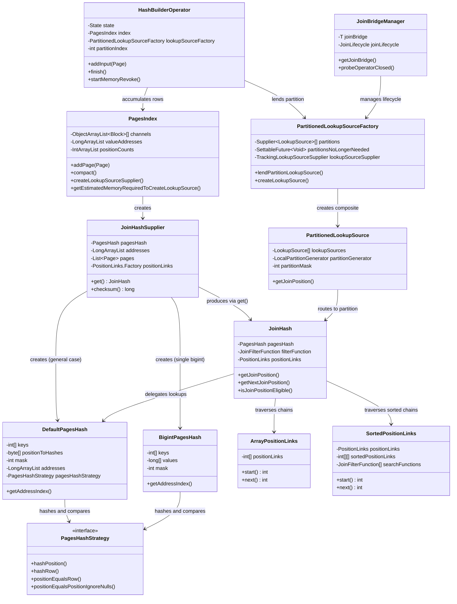
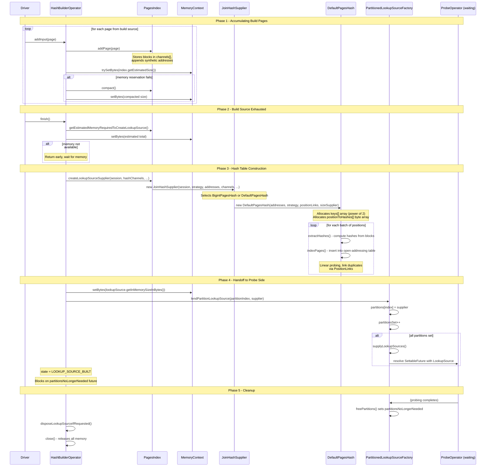

# Module Teardown: Hash Join - The Build Pipeline (Task 3.4.A)

## 0. Research Focus
* **Task ID:** 3.4.A
* **Focus:** How Trino ingests the entire "build" side of a join into memory, the internal structure of the hash table, and how memory limits are handled before the probe phase begins.
* **Trino Version:** 480

## 1. High-Level Overview
* **Core Responsibility:** The build pipeline accumulates all rows from the smaller ("build") side of a hash join into an in-memory hash table (the `LookupSource`), then signals the probe pipeline that it may begin. Each build partition is handled by one `HashBuilderOperator` instance, which collects pages into a `PagesIndex`, constructs a `PagesHash` (the actual hash table), wraps it in a `JoinHash` (the `LookupSource`), and hands it to a shared `PartitionedLookupSourceFactory`. Once all partitions have been submitted, the factory resolves the futures that the probe-side operators are waiting on.
* **Key Triggers:**
  - `addInput(Page)` -- called repeatedly by the driver loop to feed build-side pages into the operator.
  - `finish()` -- called when upstream reports no more data; triggers hash table construction and the handoff to the probe side.
  - `startMemoryRevoke()` / `finishMemoryRevoke()` -- invoked by the memory management system to spill the build side under memory pressure (spilling variant only).

## 2. Structural Architecture
* **Primary Source Files:**

| File | Package | Role |
|------|---------|------|
| `HashBuilderOperator.java` (unspilled) | `io.trino.operator.join.unspilled` | Simplified build operator without spill support |
| `HashBuilderOperator.java` (spilling) | `io.trino.operator.join.spilling` | Full build operator with spill/unspill lifecycle |
| `PagesIndex.java` | `io.trino.operator` | Row accumulator -- stores all build-side pages in columnar blocks indexed by synthetic addresses |
| `JoinHashSupplier.java` | `io.trino.operator.join` | Creates and owns the `PagesHash` and `PositionLinks`; implements `LookupSourceSupplier` |
| `DefaultPagesHash.java` | `io.trino.operator.join` | General-purpose open-addressing hash table for multi-type join keys |
| `BigintPagesHash.java` | `io.trino.operator.join` | Specialized hash table for single-bigint join keys (stores raw values for faster comparison) |
| `JoinHash.java` | `io.trino.operator.join` | The `LookupSource` implementation -- thin facade over `PagesHash` + optional `JoinFilterFunction` + `PositionLinks` |
| `PartitionedLookupSourceFactory.java` (unspilled) | `io.trino.operator.join.unspilled` | Collects partition `LookupSource`s and resolves probe-side futures when all partitions are ready |
| `PartitionedLookupSourceFactory.java` (spilling) | `io.trino.operator.join.spilling` | Same role but with spill-aware read-write locking and `SpilledLookupSourceHandle` management |
| `PartitionedLookupSource.java` | `io.trino.operator.join.unspilled` | Composite `LookupSource` that routes probe rows to the correct partition by hash |
| `JoinBridgeManager.java` | `io.trino.operator.join` | Lifecycle coordinator -- manages reference counts for probe/outer operators and triggers `destroy()` |
| `PagesHashStrategy.java` | `io.trino.operator` | Interface for hashing and comparing join key positions (implementations are bytecode-generated) |
| `SyntheticAddress.java` | `io.trino.operator` | Encodes (pageIndex, positionInPage) as a single `long` for compact row addressing |
| `ArrayPositionLinks.java` | `io.trino.operator.join` | Linked-list chain for hash collisions (same key, multiple rows) |
| `SortedPositionLinks.java` | `io.trino.operator.join` | Sorted chain for inequality join predicates with binary-search start optimization |
| `HashArraySizeSupplier.java` | `io.trino.operator` | Strategy for sizing the hash array (default 0.75 load factor vs. incremental) |
| `IncrementalLoadFactorHashArraySizeSupplier.java` | `io.trino.operator` | Adaptive load factor: 0.25 for small, 0.50 for medium, 0.75 for large hash arrays |
| `SpilledLookupSourceHandle.java` | `io.trino.operator.join.spilling` | State machine coordinating spill/unspill/dispose between build and probe pipelines |

* **Key Data Structures:**

### SyntheticAddress (row addressing)
A `long` where the high 32 bits encode the page (block) index and the low 32 bits encode the position within that page. This is the fundamental pointer into the build-side data.

```
|--- 32 bits: pageIndex ---|--- 32 bits: positionInPage ---|
```

### PagesIndex (row accumulator)
- `ObjectArrayList<Block>[] channels` -- one list of blocks per column. Each page appended adds one block per channel.
- `LongArrayList valueAddresses` -- one synthetic address per row, enabling row-level random access into the columnar blocks.
- `IntArrayList positionCounts` -- row count per page, used for page iteration during spilling.
- Supports `compact()` to copy blocks and release over-allocated memory.

### DefaultPagesHash (general hash table)
- `int[] keys` -- open-addressing hash table. Size is always a power of 2. Each slot stores the address index of the first row at that hash position, or -1 if empty. Collision resolution is linear probing.
- `byte[] positionToHashes` -- one truncated hash byte per row for fast collision filtering. Comparing a single byte avoids expensive full-key comparisons on most collisions.
- `long mask` -- bitmask for `(hash & mask)` to map hashes to bucket indices.
- `LongArrayList addresses` -- shared with `PagesIndex`; maps address indices to synthetic addresses.
- `PagesHashStrategy` -- bytecode-generated comparator/hasher for the join key columns.

### BigintPagesHash (optimized single-bigint hash table)
- `int[] keys` -- same open-addressing structure as `DefaultPagesHash`.
- `long[] values` -- stores the actual bigint join-key value per row (instead of `byte[] positionToHashes`), enabling direct value comparison without block access.
- Used only when: (a) single bigint join channel, and (b) row count is at most 1,048,576 (`THRESHOLD_50`).

### PositionLinks (collision chains)
- `ArrayPositionLinks`: `int[] positionLinks` -- each slot `i` stores the next address index in the chain, or -1. Simple linked list for equality joins.
- `SortedPositionLinks`: wraps `ArrayPositionLinks` plus `int[][] sortedPositionLinks` -- sorted arrays per chain head enabling binary search for inequality predicates.

### Class Diagram



## 3. Execution & Call Flow

### Sequence Diagram



* **Step-by-step text breakdown:**

**Step 1 - Operator Creation:**
The `HashBuilderOperatorFactory` creates one `HashBuilderOperator` per partition. Each operator gets its own `PagesIndex` initialized with the build-side column types and an `expectedPositions` hint. The partition index is assigned sequentially (0, 1, 2, ...).

**Step 2 - Page Accumulation (`addInput`):**
Each call to `addInput(Page)` appends the page to the `PagesIndex`. Inside `PagesIndex.addPage()`:
- Each column's block is added to the corresponding `channels[i]` list.
- For every row position, a synthetic address `(pageIndex << 32) | positionInPage` is appended to `valueAddresses`.
- The estimated memory size is updated.

After adding, the operator calls `trySetBytes()` on the memory context. If the reservation fails (memory pool is full), it calls `index.compact()` which copies blocks to release over-allocated memory, then does a hard `setBytes()`.

When spill is enabled, memory is tracked as revocable instead of user memory, allowing the memory manager to reclaim it.

**Step 3 - Memory Reservation for Hash Table (`finishInput`):**
When `finish()` is called (build source exhausted), the operator calls `getEstimatedMemoryRequiredToCreateLookupSource()` which computes:
- The estimated retained size of the `PagesHash` (hash array + position-to-hash bytes + block data + address array)
- Plus `PagesIndex` overhead that will remain during construction (instance size + positionCounts array)

If insufficient memory is available, `finishInput()` returns without building. The driver will call `finish()` again later when memory frees up (cooperative yielding).

**Step 4 - Hash Table Construction (`buildLookupSource`):**
`PagesIndex.createLookupSourceSupplier()` delegates to `JoinCompiler.compileLookupSourceFactory()` to get a bytecode-generated factory, which creates a `JoinHashSupplier`. The supplier's constructor:

1. **Selects PagesHash type:** If single bigint join channel and row count is at most `THRESHOLD_50` (1,048,576), uses `BigintPagesHash`. Otherwise uses `DefaultPagesHash`.
2. **Creates PositionLinks builder:** If a sort channel is present (for inequality joins), uses `SortedPositionLinks.builder()`. Otherwise `ArrayPositionLinks.builder()`.
3. **Constructs the hash table** (e.g., `DefaultPagesHash`):
   - Allocates `int[] keys` of size `hashArraySizeSupplier.getHashArraySize(n)` (always power of 2), filled with -1.
   - Allocates `byte[] positionToHashes` of size `n` (one byte per row).
   - Processes rows in cache-friendly batches (batch size = 128KB / 4 bytes):
     - **Extract hashes:** Compute full 64-bit hash for each row via `PagesHashStrategy.hashPosition()`, store truncated byte in `positionToHashes`.
     - **Index pages:** For each non-null row, compute bucket via MurmurHash3 finalization then mask. Linear probe to find empty slot or existing key with same hash. On collision with equal key, link via `positionLinks.link(newPosition, existingPosition)`.

**Step 5 - Probe-Side Notification (`lendPartitionLookupSource`):**
The `JoinHashSupplier` (which is a `LookupSourceSupplier`) is passed to `PartitionedLookupSourceFactory.lendPartitionLookupSource()`. The factory:
1. Stores the supplier in `partitions[partitionIndex]`.
2. Increments `partitionsSet`.
3. When `partitionsSet == partitions.length` (all partitions ready), calls `supplyLookupSources()`:
   - Creates a `TrackingLookupSourceSupplier` (wrapping a `PartitionedLookupSource` if multi-partition).
   - Resolves all waiting `SettableFuture<LookupSource>` (or `SettableFuture<LookupSourceProvider>` in the spilling variant).
   - Probe-side operators unblock and begin probing.

**Step 6 - Waiting and Cleanup:**
After lending, the `HashBuilderOperator` transitions to `LOOKUP_SOURCE_BUILT` and blocks on `partitionsNoLongerNeeded` (a `SettableFuture<Void>`). When the probe side completes and all references are released, `JoinBridgeManager` triggers `destroy()` on the factory, which calls `freePartitions()` -- setting `partitionsNoLongerNeeded` and nulling out partition references. The build operator then cleans up in `disposeLookupSourceIfRequested()` and transitions to `CLOSED`.

## 4. Concurrency & State Management

* **Threading Model:**
  - Build and probe pipelines run on **different drivers in different pipeline groups**. They share no driver-level state.
  - Each build partition is handled by exactly one `HashBuilderOperator` in one driver. Multiple build operators (one per partition) may run concurrently in different drivers.
  - The `PartitionedLookupSourceFactory` is the synchronization point between build and probe pipelines. All mutations are guarded by `synchronized` (unspilled) or `ReentrantReadWriteLock` (spilling).
  - The probe side accesses the `LookupSource` concurrently from multiple drivers, but each driver gets its own `JoinHash` instance (via `LookupSourceSupplier.get()`), so `JoinHash` itself is `@NotThreadSafe`. The underlying `PagesHash` is read-only after construction and safely shared.

* **Synchronization Mechanisms:**

| Mechanism | Where | Purpose |
|-----------|-------|---------|
| `SettableFuture<LookupSource>` | `PartitionedLookupSourceFactory.lookupSourceFutures` | Probe operators block until all build partitions are ready |
| `SettableFuture<Void> partitionsNoLongerNeeded` | `PartitionedLookupSourceFactory` | Build operators block until probe is done and partitions can be freed |
| `SettableFuture<Void> destroyed` | `PartitionedLookupSourceFactory` | Signals early termination (e.g., empty probe side) |
| `ListenableFuture<Void> lookupSourceFactoryDestroyed` | `HashBuilderOperator` | Checked on every `addInput`/`finish` for early exit |
| `synchronized` / `ReentrantReadWriteLock` | `PartitionedLookupSourceFactory` | Protects `partitions[]`, `partitionsSet`, `lookupSourceSupplier`, spill tracking |
| `ReferenceCount` | `JoinBridgeManager.JoinLifecycle` | Tracks active probe/outer operators; triggers `destroy()` when all finish |
| `SpilledLookupSourceHandle` | Spilling variant | State machine (SPILLED -> UNSPILLING -> PRODUCED -> DISPOSE_REQUESTED) coordinating rebuild |
| `CoarseGrainLocalMemoryContext` | `HashBuilderOperator` | Batches memory accounting updates to reduce contention on the shared memory pool |

* **Build Operator State Machine (Unspilled):**
  `CONSUMING_INPUT` -> `LOOKUP_SOURCE_BUILT` -> `CLOSED`

* **Build Operator State Machine (Spilling):**
  `CONSUMING_INPUT` -> `LOOKUP_SOURCE_BUILT` -> `CLOSED` (happy path)
  `CONSUMING_INPUT` -> `SPILLING_INPUT` -> `INPUT_SPILLED` -> `INPUT_UNSPILLING` -> `INPUT_UNSPILLED_AND_BUILT` -> `CLOSED` (spill path)
  `LOOKUP_SOURCE_BUILT` -> (revoke) -> `INPUT_SPILLED` -> ... (mid-probe spill path)

## 5. Memory & Resource Profile

* **Allocation Pattern:**

| Structure | Size Formula | Notes |
|-----------|-------------|-------|
| `PagesIndex.channels` | Sum of all block retained sizes | Columnar storage; compacted on memory pressure |
| `PagesIndex.valueAddresses` | `8 * positionCount` bytes | One `long` per row |
| `DefaultPagesHash.keys` | `4 * hashArraySize` bytes | Power-of-2 int array |
| `DefaultPagesHash.positionToHashes` | `1 * positionCount` bytes | One byte per row |
| `BigintPagesHash.keys` | `4 * hashArraySize` bytes | Same as Default |
| `BigintPagesHash.values` | `8 * positionCount` bytes | Full bigint value per row |
| `ArrayPositionLinks` | `4 * positionCount` bytes | One int per row |
| `SortedPositionLinks` | `ArrayPositionLinks + int[][] sortedPositionLinks` | Additional sorted arrays per chain head |

The hash array size depends on the `HashArraySizeSupplier`:
- **Default:** `hashArraySize = arraySize(positionCount, 0.75f)` -- approximately `positionCount * 1.34` rounded to next power of 2.
- **IncrementalLoadFactor:** Load factor varies by position count:
  - Up to 65,536 rows: 0.25 load factor (hash array is ~4x row count)
  - Up to 1,048,576 rows: 0.50 load factor (hash array is ~2x row count)
  - Above 1,048,576 rows: 0.75 load factor (hash array is ~1.34x row count)

* **Memory Tracking:**
  - During accumulation: `CoarseGrainLocalMemoryContext` batches updates to reduce locking overhead (default granularity threshold).
  - Before construction: `getEstimatedMemoryRequiredToCreateLookupSource()` pre-reserves the total memory needed for the hash table plus PagesIndex overhead. If insufficient, the operator yields.
  - After construction: memory is re-accounted to `partition.get().getInMemorySizeInBytes()` (actual hash table size).
  - Spill mode: during accumulation, memory is tracked as **revocable**. On `startMemoryRevoke()`, the operator attempts compaction first (targeting 80% of original size). If compaction is insufficient, pages are spilled to disk via `SingleStreamSpiller`, and `PagesIndex` is cleared, dropping revocable memory to zero.
  - Unspill: triggered by probe side via `SpilledLookupSourceHandle`. Pages are read back, added to a fresh `PagesIndex`, and the hash table is rebuilt. A checksum is verified against the original to detect corruption.

* **Memory Reservation Yielding:**
  The `finishInput()` method checks `reserved.isDone() && operatorContext.isWaitingForMemory().isDone()`. If either is not done, it returns without building, and the driver loop will retry later. This is cooperative back-pressure -- the operator does not block the thread; it simply reports "not finished yet" until memory becomes available.

## 6. Key Design Insights

1. **Two-level addressing via SyntheticAddress:** Rows are addressed by packing (pageIndex, position) into a single `long`. This avoids pointer chasing and lets the hash table store compact `int` address indices in the `keys[]` array while the `addresses` list maps those indices to full synthetic addresses. The indirection keeps the hot hash table small.

2. **Byte-level hash filtering in DefaultPagesHash:** Storing only 1 byte of the hash per position (`positionToHashes`) is a deliberate tradeoff. During probe, the first check is `positionToHashes[leftPosition] != rawHash` -- a single byte comparison that eliminates ~99.6% of false collisions (256 possible byte values) without touching the actual data blocks. This dramatically reduces cache misses on the critical lookup path.

3. **Batched hash extraction for cache locality:** Hash construction processes positions in batches of `CACHE_SIZE / Integer.SIZE` (about 32K positions). First, all hashes in the batch are extracted from blocks into a contiguous `long[]` array. Then the indexing pass reads from this compact array. Separating extraction from insertion improves spatial locality and is measurably faster than computing hashes inline during insertion.

4. **BigintPagesHash specialization:** When the join key is a single `BIGINT` column and the row count is at most ~1M, the specialized `BigintPagesHash` stores full `long` values directly. This eliminates the need to decode synthetic addresses and read from blocks during probe -- value comparison is a single `long == long` check. The cutoff at `THRESHOLD_50` (1M) prevents the `long[]` values array from becoming excessively large.

5. **Incremental load factor strategy:** The `IncrementalLoadFactorHashArraySizeSupplier` uses lower load factors (0.25) for small hash tables and higher load factors (0.75) for large ones. Small tables benefit from fewer collisions (improving latency), while large tables benefit from reduced memory waste. The thresholds were tuned against TPC-DS SF1000 benchmarks.

6. **Cross-pipeline coordination via futures:** The build-to-probe handoff uses Guava's `SettableFuture` as a zero-copy signaling mechanism. Build operators "lend" their partition to the factory and block on `partitionsNoLongerNeeded`. Probe operators block on `createLookupSource()` futures. When all build partitions arrive, the factory resolves all waiting probe futures atomically. This avoids polling and spin-waiting.

7. **Cooperative memory yielding (no blocking waits):** When memory is insufficient to build the hash table, `finishInput()` does not block. It returns immediately, and the operator reports `isFinished() == false`. The driver loop will call `finish()` again on a subsequent iteration. Meanwhile, other operators may free memory. This is essential for avoiding deadlocks in Trino's cooperative multitasking model.

8. **Spill-unspill with checksum verification:** When memory is revoked, the build operator spills its PagesIndex to disk. On unspill, it rebuilds the hash table from the spilled pages and verifies that `partition.checksum()` matches the original. The checksum is computed over the `PositionLinks` array using XxHash64, providing a lightweight integrity check that the same logical hash table was reconstructed.

9. **Partition-count must be power of 2:** The `PartitionedLookupSourceFactory` requires `partitionCount` to be a power of 2. This enables efficient partition routing in `PartitionedLookupSource` using bit masking (`rawHash & partitionMask`) instead of modulo division. Join positions are encoded as `(joinPosition << shiftSize) | partition`, packing partition identity into the low bits.

10. **Per-thread JoinFilterFunction and LookupSource:** `JoinFilterFunction` is not thread safe, so `JoinHashSupplier.get()` creates a new `JoinHash` (with a fresh `JoinFilterFunction` instance) for every call. Similarly, the spilling variant's `SpillAwareLookupSourceProvider` caches one `LookupSource` per provider instance in a `ConcurrentHashMap`, ensuring each probe driver has its own copy while avoiding redundant construction.

11. **PositionLinks dual implementation:** For equality-only joins, `ArrayPositionLinks` provides O(1) chain traversal via a flat `int[]` linked list. For inequality joins (e.g., `a.x BETWEEN b.lo AND b.hi`), `SortedPositionLinks` sorts chain elements by the sort channel and uses binary search in `start()` to skip non-matching positions, turning an O(n) scan into O(log n) for the first match.

## 7. Porting Considerations (Java to Rust)

1. **SyntheticAddress as a newtype:** The `(pageIndex, position)` packed `long` maps naturally to a Rust newtype wrapper around `u64` with `From`/`Into` conversions and bit manipulation methods. Consider using an inline `#[repr(transparent)]` struct.

2. **PagesHash as a flat array hash map:** The open-addressing `int[] keys` with linear probing maps directly to a `Vec<i32>` (or `Vec<u32>` with sentinel). The `byte[] positionToHashes` maps to a `Vec<u8>`. Rust's cache-line alignment guarantees make the batched extraction pattern even more effective.

3. **PagesHashStrategy as a trait object or enum dispatch:** The Java version uses bytecode generation (`JoinCompiler`). In Rust, consider an enum-dispatch pattern for common key types (single bigint, single varchar, multi-column) with a fallback trait object. Avoid dynamic dispatch on the hot path.

4. **PositionLinks as an enum:** `ArrayPositionLinks` and `SortedPositionLinks` should be variants of a single enum to avoid dynamic dispatch overhead during chain traversal.

5. **Memory tracking with arena allocators:** Trino's `CoarseGrainLocalMemoryContext` batches accounting. In Rust, consider a bump allocator for the hash table arrays with a single size check, avoiding per-allocation tracking.

6. **Spill with memory-mapped files:** Trino uses `SingleStreamSpiller` (serialized pages). Rust could use memory-mapped files for spill, enabling zero-copy unspill and OS-managed page eviction.

7. **Cross-pipeline signaling:** Replace `SettableFuture` with `tokio::sync::Notify` or `tokio::sync::oneshot` channels. The `PartitionedLookupSourceFactory` becomes an `Arc<Mutex<...>>` or a lock-free structure with `AtomicUsize` partition counters.

8. **Hash table sizing:** The power-of-2 sizing and MurmurHash3 finalization are directly portable. Rust's `hashbrown` crate uses similar techniques but with SIMD-accelerated group probing -- worth benchmarking against the Trino approach.
