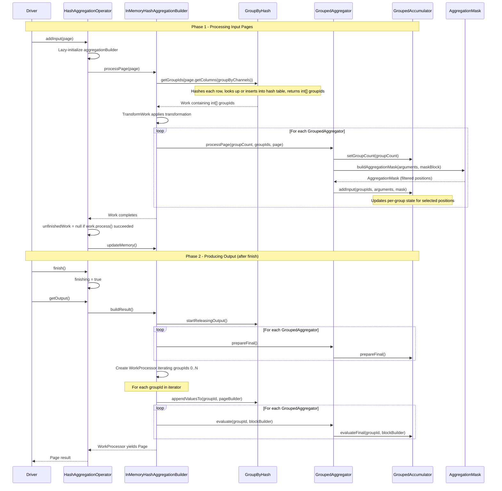

# Module Teardown: Aggregation and Accumulators (Task 3.4.C)

## 0. Research Focus
* **Task ID:** 3.4.C
* **Focus:** Trace a Group-By operation through Trino 480's aggregation system. Understand how operators maintain state across multiple `addInput()` calls, and differentiate between partial (local/map-side) aggregations and final (global/reduce-side) aggregations.

## 1. High-Level Overview
* **Core Responsibility:** Trino's aggregation subsystem computes aggregate functions (SUM, COUNT, AVG, etc.) over grouped or ungrouped data. It manages a hash table that maps group-by key values to integer group IDs, then routes each input row's column values to the correct accumulator slot indexed by that group ID. The system supports a two-phase (partial + final) decomposition that reduces data shuffled across the network during distributed execution.
* **Key Triggers:**
  - The query planner produces an `AggregationNode` in the logical plan with a `Step` enum (PARTIAL, FINAL, INTERMEDIATE, SINGLE).
  - `PushPartialAggregationThroughExchange` rewrites a SINGLE aggregation into PARTIAL (below the exchange) + FINAL (above the exchange) when the functions are decomposable.
  - `LocalExecutionPlanner.visitAggregation()` materializes these plan nodes into physical operators: `AggregationOperator` (no group-by keys, global agg) or `HashAggregationOperator` (with group-by keys).

## 2. Structural Architecture
* **Primary Source Files:**
  - `io.trino.operator.AggregationOperator` -- global aggregation (no GROUP BY)
  - `io.trino.operator.HashAggregationOperator` -- grouped aggregation (with GROUP BY)
  - `io.trino.operator.aggregation.Aggregator` -- wraps a single Accumulator for ungrouped aggregation
  - `io.trino.operator.aggregation.GroupedAggregator` -- wraps a single GroupedAccumulator for grouped aggregation
  - `io.trino.operator.aggregation.AggregatorFactory` -- factory that creates Aggregator or GroupedAggregator based on Step
  - `io.trino.operator.aggregation.Accumulator` -- interface for ungrouped state (addInput, addIntermediate, evaluateFinal)
  - `io.trino.operator.aggregation.GroupedAccumulator` -- interface for grouped state (addInput with groupIds, evaluateFinal per groupId)
  - `io.trino.operator.aggregation.AccumulatorFactory` -- interface that produces Accumulator or GroupedAccumulator instances
  - `io.trino.operator.aggregation.AccumulatorCompiler` -- bytecode-generates concrete Accumulator/GroupedAccumulator classes at runtime
  - `io.trino.operator.aggregation.builder.HashAggregationBuilder` -- interface for aggregation build strategies
  - `io.trino.operator.aggregation.builder.InMemoryHashAggregationBuilder` -- in-memory grouped aggregation using GroupByHash
  - `io.trino.operator.aggregation.builder.SpillableHashAggregationBuilder` -- spill-capable variant
  - `io.trino.operator.aggregation.builder.MergingHashAggregationBuilder` -- merges sorted spill runs
  - `io.trino.operator.aggregation.partial.SkipAggregationBuilder` -- bypass aggregation when partial agg is disabled
  - `io.trino.operator.aggregation.partial.PartialAggregationController` -- adaptive controller that disables partial agg when it is not reducing rows
  - `io.trino.operator.GroupByHash` -- interface for group ID assignment
  - `io.trino.operator.BigintGroupByHash` -- specialized hash table for single BIGINT group-by column
  - `io.trino.operator.FlatGroupByHash` -- general-purpose hash table using FlatHash for multi-column or non-bigint keys
  - `io.trino.operator.FlatHash` -- low-level flat hash table with open addressing and SWAR probing
  - `io.trino.operator.aggregation.AggregationMask` -- bitmask that filters rows (null filtering, mask column for FILTER clauses)
  - `io.trino.sql.planner.plan.AggregationNode` -- logical plan node carrying Step, grouping keys, aggregation function descriptors
  - `io.trino.sql.planner.iterative.rule.PushPartialAggregationThroughExchange` -- optimizer rule that splits SINGLE into PARTIAL+FINAL

* **Key Data Structures:**

  **GroupByHash (group ID management):** The central data structure for GROUP BY operations. It maps composite group-by key values to dense integer group IDs (0, 1, 2, ...). Two implementations exist:
  - `BigintGroupByHash`: Optimized for a single BIGINT column. Uses parallel arrays: `long[] values` (hash table slots storing the key value), `int[] groupIds` (mapping from hash slot to group ID), and `long[] valuesByGroupId` (reverse index from group ID back to value). Uses open addressing with linear probing. Fill ratio 0.75. Handles NULL as a special `nullGroupId`.
  - `FlatGroupByHash`: General-purpose for multi-column or non-bigint keys. Delegates to `FlatHash`, which stores fixed-size records in chunked `byte[][]` arrays (`fixedSizeRecords`), with `byte[] control` for SWAR-style hash probing and `int[] groupIdsByHash` mapping hash slots to group IDs. Supports variable-width data via `AppendOnlyVariableWidthData`. Load factor 15/16. Records are laid out as: optional cached hash (long), optional variable-width pointer, then fixed-width data for each type.

  **Accumulator State:** Bytecode-generated classes (via `AccumulatorCompiler`) that implement `Accumulator` or `GroupedAccumulator`. Each concrete accumulator holds `AccumulatorState` objects created by `AccumulatorStateFactory`. For grouped accumulators, the state implements `GroupedAccumulatorState` with a `setGroupId(int)` method so that a single state object can be indexed by group ID (the state internally manages per-group storage, often using BigArray structures).

  **AggregationMask:** A position filter that tracks which rows in a page should be processed. It maintains `int[] selectedPositions` and `selectedPositionCount`. Used to skip NULL values and to apply FILTER clauses on aggregate functions. Created by bytecode-generated `AggregationMaskBuilder` classes.

### Class Diagram

```mermaid
classDiagram
    class AggregationNode {
        +Step step
        +Map aggregations
        +GroupingSetDescriptor groupingSets
    }
    class Step {
        <<enumeration>>
        PARTIAL
        FINAL
        INTERMEDIATE
        SINGLE
        +isInputRaw() boolean
        +isOutputPartial() boolean
    }
    class AggregationOperator {
        -List~Aggregator~ aggregates
        -State state
        +addInput(Page)
        +getOutput() Page
    }
    class HashAggregationOperator {
        -HashAggregationBuilder aggregationBuilder
        -Step step
        -WorkProcessor~Page~ outputPages
        +addInput(Page)
        +getOutput() Page
    }
    class HashAggregationBuilder {
        <<interface>>
        +processPage(Page) Work
        +buildResult() WorkProcessor~Page~
        +isFull() boolean
        +updateMemory()
    }
    class InMemoryHashAggregationBuilder {
        -GroupByHash groupByHash
        -List~GroupedAggregator~ groupedAggregators
        -boolean partial
        +processPage(Page) Work
        +buildResult() WorkProcessor~Page~
    }
    class SpillableHashAggregationBuilder {
        -InMemoryHashAggregationBuilder hashAggregationBuilder
        -Spiller spiller
        +processPage(Page) Work
        +startMemoryRevoke() ListenableFuture
        +spillToDisk() ListenableFuture
    }
    class SkipAggregationBuilder {
        -Page currentPage
        +processPage(Page) Work
        +buildResult() WorkProcessor~Page~
    }
    class GroupByHash {
        <<interface>>
        +getGroupIds(Page) Work~int[]~
        +addPage(Page) Work
        +getGroupCount() int
        +appendValuesTo(int groupId, PageBuilder)
    }
    class BigintGroupByHash {
        -long[] values
        -int[] groupIds
        -long[] valuesByGroupId
        -int nextGroupId
        +putIfAbsent(int, Block) int
    }
    class FlatGroupByHash {
        -FlatHash flatHash
        -InterpretedHashGenerator hashGenerator
    }
    class FlatHash {
        -byte[] control
        -int[] groupIdsByHash
        -byte[][] fixedSizeRecords
        +putIfAbsent(Block[], int) int
    }
    class Aggregator {
        -Accumulator accumulator
        -Step step
        +processPage(Page)
        +evaluate(BlockBuilder)
    }
    class GroupedAggregator {
        -GroupedAccumulator accumulator
        -Step step
        +processPage(int groupCount, int[] groupIds, Page)
        +evaluate(int groupId, BlockBuilder)
    }
    class Accumulator {
        <<interface>>
        +addInput(Page, AggregationMask)
        +addIntermediate(Block)
        +evaluateIntermediate(BlockBuilder)
        +evaluateFinal(BlockBuilder)
    }
    class GroupedAccumulator {
        <<interface>>
        +setGroupCount(int)
        +addInput(int[] groupIds, Page, AggregationMask)
        +addIntermediate(int[] groupIds, Block)
        +evaluateIntermediate(int groupId, BlockBuilder)
        +evaluateFinal(int groupId, BlockBuilder)
    }
    class AggregatorFactory {
        -AccumulatorFactory accumulatorFactory
        -Step step
        +createAggregator(AggregationMetrics) Aggregator
        +createGroupedAggregator(AggregationMetrics) GroupedAggregator
    }
    class AccumulatorFactory {
        <<interface>>
        +createAccumulator(List) Accumulator
        +createGroupedAccumulator(List) GroupedAccumulator
        +createAggregationMaskBuilder() AggregationMaskBuilder
    }
    class AggregationMask {
        -int positionCount
        -int[] selectedPositions
        -int selectedPositionCount
        +isSelectAll() boolean
        +isSelectNone() boolean
    }
    class PartialAggregationController {
        -volatile boolean partialAggregationDisabled
        +onFlush(long bytes, long rows, OptionalLong unique)
        +isPartialAggregationDisabled() boolean
    }

    AggregationNode --> Step
    HashAggregationOperator --> HashAggregationBuilder
    HashAggregationOperator --> PartialAggregationController
    InMemoryHashAggregationBuilder ..|> HashAggregationBuilder
    SpillableHashAggregationBuilder ..|> HashAggregationBuilder
    SkipAggregationBuilder ..|> HashAggregationBuilder
    InMemoryHashAggregationBuilder --> GroupByHash
    InMemoryHashAggregationBuilder --> GroupedAggregator
    SpillableHashAggregationBuilder --> InMemoryHashAggregationBuilder
    BigintGroupByHash ..|> GroupByHash
    FlatGroupByHash ..|> GroupByHash
    FlatGroupByHash --> FlatHash
    AggregationOperator --> Aggregator
    Aggregator --> Accumulator
    GroupedAggregator --> GroupedAccumulator
    AggregatorFactory --> AccumulatorFactory
    AggregatorFactory --> Aggregator
    AggregatorFactory --> GroupedAggregator
    Aggregator --> AggregationMask
    GroupedAggregator --> AggregationMask
```

## 3. Execution and Call Flow

### Sequence Diagram: Grouped Aggregation (HashAggregationOperator addInput through getOutput)

### Step-by-step Text Breakdown

**1. Operator Initialization (lazy, on first addInput):**
The `HashAggregationOperator` does not create its `HashAggregationBuilder` in the constructor. Instead, it lazily creates it on the first `addInput()` call. The builder type depends on the aggregation step and configuration:
- If `step.isOutputPartial()` and `partialAggregationController` says aggregation is disabled: creates `SkipAggregationBuilder` (passes rows through with default accumulator state).
- If `step.isOutputPartial()` or spilling is not enabled or the aggregation is not spillable: creates `InMemoryHashAggregationBuilder`.
- Otherwise (final aggregation with spilling enabled and spillable): creates `SpillableHashAggregationBuilder`.

**2. Processing a Page (addInput):**
When `HashAggregationOperator.addInput(page)` is called:
- It delegates to `aggregationBuilder.processPage(page)` which returns a `Work<?>`.
- Inside `InMemoryHashAggregationBuilder.processPage()`:
  - Extracts group-by columns from the page: `page.getColumns(groupByChannels)`.
  - Calls `groupByHash.getGroupIds(groupByColumns)` to get an `int[]` mapping each row to its group ID. This is wrapped in a `MeasuredGroupByHashWork` for metrics.
  - The result is wrapped in a `TransformWork` that, once the group IDs are computed, iterates over all `GroupedAggregator` instances and calls `processPage(groupCount, groupIds, page)`.

**3. Group ID Assignment (GroupByHash):**
The `GroupByHash.getGroupIds(page)` method:
- For `BigintGroupByHash`: For each position in the block, calls `putIfAbsent(position, block)` which hashes the BIGINT value using `murmurHash3`, does linear probing to find an empty slot or matching value, and assigns a new group ID if the value is new. Group IDs are dense integers starting from 0.
- For `FlatGroupByHash`: Similar but uses `FlatHash.putIfAbsent(blocks, position, hash)` which supports multi-column composite keys. Uses SWAR (SIMD Within A Register) probing on the `control` byte array for faster hash table lookups.
- Both implementations process in batches of `BATCH_SIZE=1024` and check memory availability before each batch (yielding via the `Work` interface if memory reservation fails).
- Special handling for `DictionaryBlock` (dictionary-encoded lookback avoids redundant hash table probes) and `RunLengthEncodedBlock` (only processes one value).

**4. Accumulator Update (GroupedAggregator.processPage):**
For each `GroupedAggregator`:
- Calls `accumulator.setGroupCount(groupCount)` to ensure the grouped accumulator has allocated internal storage for the current number of groups.
- If `step.isInputRaw()` (PARTIAL or SINGLE step): extracts argument columns, builds an `AggregationMask` (filters out NULLs and applies FILTER clause mask), then calls `accumulator.addInput(groupIds, arguments, mask)`.
- If input is intermediate (FINAL or INTERMEDIATE step): calls `accumulator.addIntermediate(groupIds, block)` where the single input block contains serialized intermediate state.

**5. Output Production (getOutput after finish):**
When the operator is finishing:
- Calls `aggregationBuilder.buildResult()` which returns a `WorkProcessor<Page>`.
- `InMemoryHashAggregationBuilder.buildResult()` first calls `groupByHash.startReleasingOutput()` (allows the hash table to free lookup structures). Calls `prepareFinal()` on each aggregator. Then iterates through consecutive group IDs (0 to groupCount-1).
- For each group ID: appends the group-by key values via `groupByHash.appendValuesTo(groupId, pageBuilder)`, then calls `groupedAggregator.evaluate(groupId, blockBuilder)` which delegates to either `accumulator.evaluateIntermediate()` (if outputting partial results) or `accumulator.evaluateFinal()` (if outputting final results).

**6. Partial Aggregation Full-Flush Cycle:**
When a partial aggregation's `InMemoryHashAggregationBuilder` exceeds `maxPartialMemory`, `isFull()` returns true. The `HashAggregationOperator.getOutput()` detects this and triggers `buildResult()`. After flushing the result pages, `closeAggregationBuilder()` is called which: reports flush statistics to `PartialAggregationController`, resets counters, sets `aggregationBuilder = null`. On the next `addInput()`, a new builder is lazily created (potentially as a `SkipAggregationBuilder` if the controller has decided partial aggregation is ineffective).

## 4. Concurrency and State Management

**Single-threaded per operator:** Each `HashAggregationOperator` instance runs in exactly one driver thread. The `GroupByHash` interface is annotated `@NotThreadSafe`. No locking or atomic operations are used within a single operator instance.

**Cross-operator coordination via PartialAggregationController:** Multiple `HashAggregationOperator` instances for the same plan node on the same worker share a single `PartialAggregationController`. This controller is thread-safe: `onFlush()` is `synchronized`, and the `partialAggregationDisabled` flag is `volatile`. This allows the adaptive partial aggregation decision to be shared across all drivers/pipelines for the same aggregation stage.

**Yield mechanism (Work interface):** Hash table operations (especially rehashing) can be expensive. The `Work<T>` interface allows these operations to be broken into incremental steps. If `work.process()` returns `false`, the operator stores `unfinishedWork` and yields back to the driver. On the next `getOutput()` call, the operator retries the unfinished work. This prevents a single hash table rehash from blocking the driver for too long and enables cooperative scheduling. Hash table operations are batched in groups of `BATCH_SIZE=1024`.

**Spill coordination:** The `SpillableHashAggregationBuilder` uses revocable memory. When the memory manager triggers revocation (`startMemoryRevoke`), it spills the current in-memory hash aggregation to disk via the `Spiller`. The spill runs asynchronously (returns a `ListenableFuture`). After spilling, it rebuilds the in-memory builder fresh. During output production, `mergeFromDiskAndMemory()` uses `MergeHashSort` to merge sorted spill files with in-memory data, feeding into a `MergingHashAggregationBuilder`.

## 5. Memory and Resource Profile

* **Allocation Pattern:**
  - **Hash table growth (GroupByHash):** Both `BigintGroupByHash` and `FlatGroupByHash` use power-of-2 sizing with doubling on rehash. `BigintGroupByHash` has a fill ratio of 0.75 (rehashes at 75% capacity). `FlatHash` uses a fill ratio of 15/16 (93.75%). Rehashing allocates new arrays, copies data, then releases old arrays. Before rehashing, memory is pre-reserved via `updateMemory.update()` to ensure availability.
  - **BigintGroupByHash per-entry cost:** Each entry consumes: 8 bytes (value in hash table) + 4 bytes (groupId in hash table) + 8 bytes (value in reverse index) = 20 bytes per group (plus overhead from fill ratio).
  - **FlatHash per-entry cost:** Each entry consumes: 1 byte (control) + 4 bytes (groupIdsByHash) + fixedRecordSize bytes per group. The fixedRecordSize includes an optional 8-byte cached hash, optional 8-byte variable-width pointer, plus the fixed-width data for each type column.
  - **Accumulator memory:** Grouped accumulators typically use `BigArray` structures (from `io.trino.array`) that grow dynamically with group count. Each accumulator tracks its own `getEstimatedSize()`.

* **Memory Tracking:**
  - `InMemoryHashAggregationBuilder.getSizeInMemory()` sums `groupByHash.getEstimatedSize()` plus all `groupedAggregator.getEstimatedSize()`.
  - For partial aggregation: memory is compared against `maxPartialMemory` to trigger flushing. When the builder exceeds this limit, `isFull()` returns true and the operator flushes output and starts a fresh builder.
  - For final aggregation (non-spillable): memory usage is reported to the `OperatorContext.localUserMemoryContext()`. If memory is exhausted, the `Work.process()` call returns false (yielding) until memory is available.
  - For spillable final aggregation: memory is tracked as revocable. `SpillableHashAggregationBuilder.updateMemory()` puts the "empty builder" size in user memory and the rest in revocable memory. When revoked, data is spilled to disk.

* **Spill behavior:** `SpillableHashAggregationBuilder` spills the current in-memory builder's data as hash-sorted pages. After spilling, it creates a fresh empty `InMemoryHashAggregationBuilder`. During output, all spill files and the final in-memory data are merge-sorted by hash value, then re-aggregated in bounded-memory chunks by `MergingHashAggregationBuilder`.

## 6. Key Design Insights

**1. Partial vs Final aggregation is a Step enum, not separate operator classes.** Both partial and final aggregations use the same `HashAggregationOperator`. The `Step` enum (PARTIAL, FINAL, INTERMEDIATE, SINGLE) controls behavior at every layer:
- `AggregatorFactory.createGroupedAggregator()` uses `step.isInputRaw()` to decide whether to create a raw accumulator (processes raw column values) or an intermediate accumulator (processes serialized intermediate state blocks).
- `GroupedAggregator.processPage()` checks `step.isInputRaw()` to choose `addInput()` vs `addIntermediate()`.
- `GroupedAggregator.evaluate()` checks `step.isOutputPartial()` to choose `evaluateIntermediate()` vs `evaluateFinal()`.
- This means PARTIAL reads raw input and writes intermediate; FINAL reads intermediate and writes final; SINGLE reads raw and writes final; INTERMEDIATE reads and writes intermediate.

**2. Adaptive partial aggregation disabling.** The `PartialAggregationController` monitors the ratio of unique output rows to input rows across all flush cycles. If the ratio exceeds a threshold after processing at least 1.5x the partial memory limit in bytes, partial aggregation is disabled. When disabled, the `SkipAggregationBuilder` passes rows through verbatim (with per-row intermediate state) -- effectively becoming a no-op for aggregation. The controller periodically re-enables aggregation (after 300x the memory limit in input bytes) to check if the data distribution has changed. This is critical for high-cardinality group-by queries where partial aggregation adds overhead without reducing data volume.

**3. Three-tier builder architecture for memory pressure.** The `HashAggregationBuilder` interface has three implementations representing three strategies:
- `InMemoryHashAggregationBuilder`: All data in memory. Used for partial aggregation (bounded by maxPartialMemory) and non-spillable final aggregation.
- `SpillableHashAggregationBuilder`: Wraps an in-memory builder but can spill to disk on memory revocation. Used for final aggregation when spilling is enabled.
- `SkipAggregationBuilder`: No aggregation at all. Used when partial aggregation is adaptively disabled.
The `HashAggregationOperator` selects the builder implementation on the first `addInput()` call based on step, spill configuration, and partial aggregation controller state.

**4. GroupByHash specialization via type dispatch.** The static factory `GroupByHash.createGroupByHash()` checks if there is exactly one group-by column of type BIGINT. If so, it returns `BigintGroupByHash` (a highly optimized implementation using primitive `long[]` arrays with no boxing). Otherwise, it returns `FlatGroupByHash` which handles arbitrary type combinations using a `FlatHash` with bytecode-compiled `FlatHashStrategy` for hashing and equality. The `shouldCacheHashValue` decision also considers spillability (always cache for spillable), number of columns (cache for 3+), and type complexity (cache for container types like Map, Array, Row). This specialization is a significant performance optimization for common GROUP BY patterns.

**5. Work-based cooperative yielding for backpressure.** Hash table operations are wrapped in `Work<T>` objects that process rows in batches of 1024. This enables:
- **Memory backpressure:** Before each batch, the hash table checks if rehashing is needed and if memory can be reserved. If memory is unavailable, `process()` returns false and the operator yields.
- **Dictionary optimization:** `DictionaryBlock` inputs use a `DictionaryLookBack` cache to avoid redundant hash probes for repeated dictionary IDs.
- **RLE optimization:** `RunLengthEncodedBlock` inputs only probe the hash table once for the single repeated value.
- **Low-cardinality dictionary optimization:** `FlatGroupByHash` detects when all input blocks are dictionary-encoded with low cardinality (cumulative cardinality ratio below 0.25 and fits in short). It pre-computes combination IDs and only probes the hash table once per unique combination.

**6. Bytecode-generated accumulators for zero-overhead abstraction.** The `AccumulatorCompiler` uses Airlift bytecode generation to create concrete `Accumulator` and `GroupedAccumulator` classes at runtime. These generated classes directly invoke the aggregation function's `input()`, `combine()`, and `output()` method handles without virtual dispatch or boxing. The `AggregationMaskBuilder` is also bytecode-compiled per function to efficiently filter NULL arguments. This avoids the overhead of reflection and boxing that would occur with a generic accumulator implementation.

**7. Intermediate state serialization as a Row block.** For multi-state aggregation functions, the intermediate state is serialized as a `RowBlock` containing one field per accumulator state. The `AccumulatorCompiler` generates `evaluateIntermediate()` to serialize each state field using its `AccumulatorStateSerializer`, and `addIntermediate()` to deserialize. For single-state functions, the intermediate is a simple block. This serialization format is what flows between PARTIAL and FINAL stages over the network exchange.

**8. Group-by state indexing pattern.** The `GroupedAccumulator.addInput(int[] groupIds, Page page, AggregationMask mask)` call receives a parallel array of group IDs (one per page position). The bytecode-generated accumulator iterates positions, calls `state.setGroupId(groupIds[position])` to point the state object at the correct group's storage, then invokes the accumulator function on that row. This design means a single `GroupedAccumulatorState` object acts as a cursor over per-group storage (typically backed by `BigArray` variants for each state field), avoiding per-group object allocation.

**9. Hash-sorted spilling for efficient merge.** When `SpillableHashAggregationBuilder` spills, it sorts group IDs by their raw hash value before writing pages to disk. This means spill files are sorted by hash. During merge, `MergeHashSort` performs a merge-sort of these streams by hash value. The `MergingHashAggregationBuilder` then re-aggregates the merged stream -- since rows with the same hash are adjacent, the in-memory builder can flush groups in bounded memory. This is analogous to the "sort-merge" strategy in MapReduce.

**10. Global aggregation default output.** For queries like `SELECT count(*) FROM t WHERE false` (empty input with a global aggregation), the `HashAggregationOperator` produces a default output row (e.g., count=0, sum=NULL). This is controlled by `produceDefaultOutput` which is set when the aggregation node has empty grouping sets. The `getGlobalAggregationOutput()` method creates fresh aggregators (never fed any input) and evaluates them to produce default values.

## 7. Porting Considerations (Java to Rust)

**1. GroupByHash as a Rust trait with specialized implementations.** The `GroupByHash` dispatch pattern (BigintGroupByHash vs FlatGroupByHash) maps well to a Rust enum or trait object. The BigintGroupByHash specialization for single-BIGINT columns can be a separate struct. For FlatGroupByHash, Rust's type system and generics could enable compile-time specialization (e.g., monomorphized `GroupByHash<Key>` with different Key types) instead of Java's runtime bytecode generation.

**2. Replace bytecode-generated accumulators with Rust generics/macros.** Java's AccumulatorCompiler generates bytecode at runtime. In Rust, this can be replaced with:
- Generic accumulator types parameterized by the aggregation function and state type.
- Procedural macros to generate accumulator implementations at compile time.
- Trait objects with `dyn Accumulator` for dynamic dispatch where needed.
This eliminates the need for runtime code generation while maintaining zero-cost abstractions.

**3. Memory management without GC.** Java's approach of tracking estimated memory sizes and yielding when limits are exceeded can be adapted to Rust, but with more precise control:
- Use `Vec` with explicit capacity management for hash table arrays.
- Implement a custom allocator or memory pool that tracks allocation sizes and returns errors when limits are reached.
- The `Work` yield pattern maps to Rust's `async`/`await` or explicit state machines.

**4. FlatHash SWAR probing translates directly.** The `FlatHash` control byte probing technique (comparing 8 control bytes at once via a long comparison) is architecture-agnostic and translates directly to Rust. Consider using actual SIMD intrinsics (SSE2/NEON) for even better performance on the control array, similar to Swiss Tables (hashbrown).

**5. PartialAggregationController needs Arc + AtomicBool.** The adaptive partial aggregation controller uses Java's `volatile` and `synchronized`. In Rust, this maps to `Arc<PartialAggregationController>` shared across operator instances, with `AtomicBool` for the disabled flag and `Mutex` for the `onFlush` updates.

**6. Spill path requires async I/O integration.** The SpillableHashAggregationBuilder uses `ListenableFuture` for async spill. In Rust, this maps to `tokio` futures with the spiller running on an I/O thread pool. The merge-sort phase can use `tokio::fs` for reading spill files.

**7. AggregationMask as a selection vector.** The `AggregationMask` concept (an array of selected positions) is equivalent to Apache Arrow's selection vectors. If using Arrow for the Rust columnar format, this integrates naturally with Arrow's filter kernels. Consider using bitmasks instead of position arrays for better SIMD utilization.
