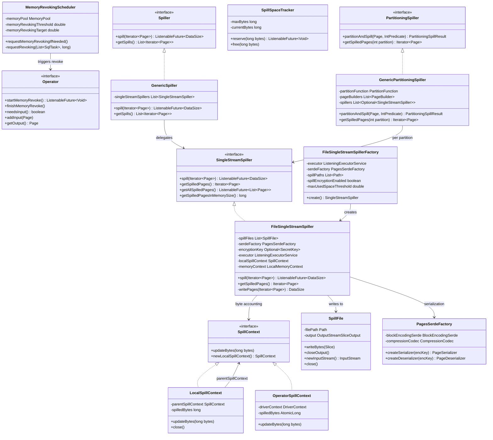
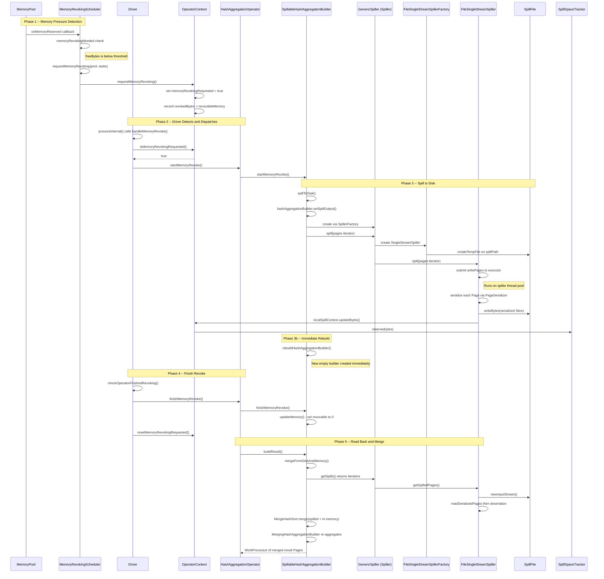
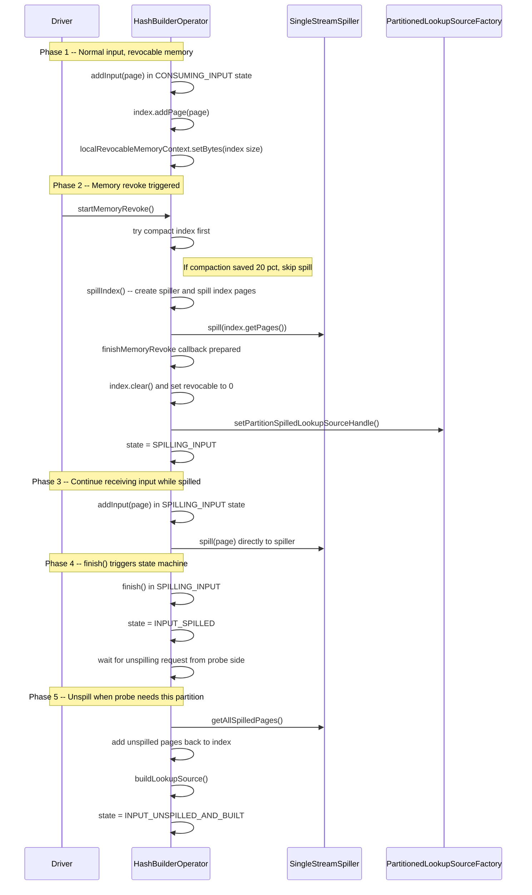

# Module Teardown: Disk Spilling Mechanism (Task 3.5.A)

## 0. Research Focus
* **Task ID:** 3.5.A
* **Focus:** Trace the spilling trigger mechanism. When memory limits are reached, how does a stateful Operator (like an Aggregation or Hash Join) pause, serialize its state to disk, free up RAM, and later read it back?

## 1. High-Level Overview
* **Core Responsibility:** Trino's disk spilling subsystem allows stateful operators (hash aggregation, hash join build side) to survive memory pressure by serializing their in-memory data to temporary files on local disk, freeing RAM, and later reading those files back to complete processing. This is a cooperative mechanism -- operators voluntarily participate by reserving memory as "revocable" rather than "user" memory, signaling to the system that their buffers can be evicted to disk when the memory pool is under pressure.
* **Key Triggers:**
  - **MemoryRevokingScheduler** detects that the MemoryPool's free bytes have fallen below the `memoryRevokingThreshold` (default 0.9 of max). It traverses all running tasks/pipelines/operators and calls `OperatorContext.requestMemoryRevoking()` on operators that hold revocable memory.
  - Two trigger paths exist: (1) a MemoryPoolListener fires on every memory reservation, and (2) a periodic 1-second scheduled check. Both converge on `requestMemoryRevoking()`.
  - The Driver's `processInternal()` loop calls `handleMemoryRevoke()`, which detects the revocation flag and invokes `operator.startMemoryRevoke()` followed by `operator.finishMemoryRevoke()`.

## 2. Structural Architecture
* **Primary Source Files:**
  - `io.trino.spiller.Spiller` -- top-level multi-stream spill interface
  - `io.trino.spiller.SingleStreamSpiller` -- single-file spill interface
  - `io.trino.spiller.FileSingleStreamSpiller` -- the concrete file-based implementation
  - `io.trino.spiller.SpillFile` -- manages a single temp file with buffered output
  - `io.trino.spiller.GenericSpiller` -- Spiller impl that delegates to multiple SingleStreamSpillers
  - `io.trino.spiller.GenericPartitioningSpiller` -- partition-aware spiller for hash joins
  - `io.trino.spiller.SpillerFactory` / `SingleStreamSpillerFactory` / `PartitioningSpillerFactory` -- factory interfaces
  - `io.trino.spiller.FileSingleStreamSpillerFactory` -- concrete factory, manages spill paths and encryption
  - `io.trino.spiller.SpillSpaceTracker` -- enforces node-level max-spill-per-node limit
  - `io.trino.spiller.LocalSpillContext` / `io.trino.operator.SpillContext` -- spill byte accounting
  - `io.trino.spiller.NodeSpillConfig` -- config (max-spill-per-node, compression, encryption)
  - `io.trino.execution.MemoryRevokingScheduler` -- the trigger that detects memory pressure
  - `io.trino.operator.Operator` -- defines `startMemoryRevoke()` / `finishMemoryRevoke()` protocol
  - `io.trino.operator.Driver` -- calls `handleMemoryRevoke()` on each processing loop
  - `io.trino.operator.OperatorContext` -- holds the `memoryRevokingRequested` flag and `OperatorSpillContext`
  - `io.trino.operator.join.spilling.HashBuilderOperator` -- hash join build-side spill integration
  - `io.trino.operator.HashAggregationOperator` -- aggregation spill integration
  - `io.trino.operator.aggregation.builder.SpillableHashAggregationBuilder` -- aggregation spill orchestrator
  - `io.trino.operator.aggregation.builder.MergingHashAggregationBuilder` -- merge-back during unspill
  - `io.trino.operator.MergeHashSort` -- merge-sort of hash-ordered spilled streams
  - `io.trino.execution.buffer.PagesSerdeUtil` -- serialized page read/write utilities
  - `io.trino.execution.buffer.PagesSerdeFactory` -- creates PageSerializer/PageDeserializer
  - `io.trino.execution.buffer.PageSerializer` / `PageDeserializer` -- serialize/deserialize Page to/from Slice

* **Key Data Structures:**
  - **Page** -- the core columnar data unit (array of Blocks with a position count)
  - **Slice** -- serialized byte representation of a Page (from airlift)
  - **SpillFile** -- wraps a `Path` with buffered `OutputStreamSliceOutput` (4KB buffer) and lifecycle management
  - **PagesIndex** -- sorted/indexed in-memory representation of Pages (used by HashBuilderOperator)
  - **InMemoryHashAggregationBuilder** -- the in-memory hash table for aggregation groups
  - **PartitioningSpillResult** -- contains a `ListenableFuture` for the spill and the retained (non-spilled) page
  - **SpilledLookupSourceHandle** -- communication channel between HashBuilderOperator and LookupJoinOperator for spilled partitions

### Class Diagram

## 3. Execution & Call Flow

### Sequence Diagram -- Full Spill Lifecycle (Hash Aggregation)

### Sequence Diagram -- Hash Join Build-Side Spill

* **Step-by-step text breakdown:**

**1. Memory Pressure Detection (MemoryRevokingScheduler)**
- `MemoryRevokingScheduler` monitors the `MemoryPool` via two mechanisms: a `MemoryPoolListener.onMemoryReserved` callback (reactive) and a 1-second periodic poll (defensive).
- When `memoryPool.getFreeBytes() <= maxBytes * (1.0 - memoryRevokingThreshold)` and revocable bytes exist, revoking is needed.
- It calculates `remainingBytesToRevoke = -freeBytes + maxBytes * (1.0 - memoryRevokingTarget)`, which is the amount needed to reach the target.
- It subtracts memory already being revoked (operators where `isMemoryRevokingRequested()` is true).
- It traverses tasks sorted by creation time (oldest first), then pipelines, then operators, calling `operatorContext.requestMemoryRevoking()` on each until enough bytes are covered.

**2. Revocation Request Delivery (OperatorContext)**
- `requestMemoryRevoking()` sets `memoryRevokingRequested = true` and records the revocable memory amount.
- It fires a `memoryRevocationRequestListener` callback to wake up the Driver.
- The Driver's `processInternal()` calls `handleMemoryRevoke()` which iterates active operators, checking `isMemoryRevokingRequested()`.

**3. Operator Responds (startMemoryRevoke / finishMemoryRevoke)**
- Driver calls `operator.startMemoryRevoke()` which returns a `ListenableFuture<Void>`.
- The operator stores a `finishMemoryRevoke` callback to be run after the future completes.
- During this window, the Driver cannot call `addInput`, `getOutput`, `needsInput`, or `isBlocked` on the operator.
- Once the future is done, Driver calls `finishMemoryRevoke()` and `resetMemoryRevokingRequested()`.

**4. Hash Aggregation Spill Path**
- `SpillableHashAggregationBuilder.spillToDisk()`:
  - Calls `hashAggregationBuilder.setSpillOutput()` to prepare sorted output.
  - Creates a `Spiller` (GenericSpiller) via `SpillerFactory` if not yet created.
  - Calls `spiller.spill(hashAggregationBuilder.buildSpillResult().iterator())` which submits the write to a thread pool.
  - Immediately calls `rebuildHashAggregationBuilder()` so the operator can continue accepting input on a fresh builder.
  - Memory classification: the "empty builder size" is charged to user memory; only the data content is revocable.

**5. Hash Join Build-Side Spill Path**
- `HashBuilderOperator.startMemoryRevoke()`:
  - In CONSUMING_INPUT: first tries compacting the PagesIndex (80% target). If compaction is sufficient, skips spilling entirely.
  - If compaction is not enough: creates a `SingleStreamSpiller`, spills all index pages, then in `finishMemoryRevoke`: clears the index, zeros revocable memory, registers a `SpilledLookupSourceHandle`, transitions to SPILLING_INPUT.
  - In SPILLING_INPUT: further input pages are spilled directly via `getSpiller().spill(page)`.
  - In LOOKUP_SOURCE_BUILT (after input finished but lookup source already built): spills the index, transitions to INPUT_SPILLED, and waits for a signal from the probe side.

**6. Serialization to Disk**
- `FileSingleStreamSpiller.writePages()` runs on a dedicated thread pool (`binary-spiller-*` threads).
- For each Page: `PageSerializer.serialize(page)` produces a `Slice` (the serialized form including header: positionCount, uncompressedSize, compressedSize).
- The Slice is written to a `SpillFile` via `writeBytes()` which appends to a buffered `OutputStreamSliceOutput` (4KB buffer).
- Pages are distributed round-robin across multiple spill files (count = `min(spillerThreads, taskConcurrency)`) for parallel I/O.
- Each write updates `LocalSpillContext.updateBytes()` which propagates up to `OperatorSpillContext` then to `DriverContext.reserveSpill()` then to `SpillSpaceTracker.reserve()`.

**7. Read-Back and Merge (Aggregation)**
- `SpillableHashAggregationBuilder.mergeFromDiskAndMemory()`:
  - Gets all spilled stream iterators via `spiller.getSpills()`.
  - Also gets current in-memory builder's sorted output as a WorkProcessor.
  - Creates a `MergeHashSort` that merge-sorts all streams by hash value.
  - Feeds merged stream into `MergingHashAggregationBuilder` which re-aggregates rows with same group keys.
  - The merging builder respects `memoryLimitForMerge` -- if memory exceeds this limit, it flushes output and starts a new aggregation batch.

**8. Read-Back (Hash Join)**
- `HashBuilderOperator.unspillLookupSourceIfRequested()`:
  - Checks memory availability for the unspilled pages size.
  - Calls `getSpiller().getAllSpilledPages()` which reads all files in parallel on the executor pool.
  - Once all pages are loaded, re-inserts them into the PagesIndex.
  - Rebuilds the LookupSource (hash table) and provides it to the probe side via `SpilledLookupSourceHandle`.
  - Validates correctness with a checksum comparison.

## 4. Concurrency & State Management

**Thread Model:**
- **Driver thread** (single-threaded per Driver): calls `startMemoryRevoke()` / `finishMemoryRevoke()`, `addInput()`, `getOutput()`. The `@NotThreadSafe` annotation on FileSingleStreamSpiller is safe because Driver serializes all calls.
- **Spiller thread pool** (`binary-spiller-*`): dedicated `ListeningExecutorService` used by `FileSingleStreamSpiller.spill()`. The `writePages()` method runs here. The comment in FileSingleStreamSpiller acknowledges a race: the spiller thread may run concurrently with `close()`, so memory is reserved in the constructor and released in close().
- **MemoryRevokingScheduler thread**: runs on `taskManagementExecutor`, calls `requestMemoryRevoking()` which only sets atomic flags -- no contention.
- **Revocation ordering**: `MemoryRevokingScheduler` sorts tasks by creation time (oldest first), then traverses pipelines and operators sequentially. This means older tasks are revoked first.

**State Machine (HashBuilderOperator):**
- `CONSUMING_INPUT` -- Normal ingestion, memory tracked as revocable.
- `SPILLING_INPUT` -- After revocation, further pages go directly to spiller.
- `LOOKUP_SOURCE_BUILT` -- Build finished without spill, lookup source provided.
- `INPUT_SPILLED` -- Input fully spilled, waiting for probe-side signal.
- `INPUT_UNSPILLING` -- Reading spilled pages back into memory.
- `INPUT_UNSPILLED_AND_BUILT` -- Lookup source rebuilt from unspilled data.
- `CLOSED` -- Terminal state.

**Synchronization Details:**
- `SpillFile`: all methods are `synchronized` (thread-safe file handle management).
- `LocalSpillContext`: `synchronized` on all methods.
- `SpillSpaceTracker`: `synchronized` on all methods.
- `GenericPartitioningSpiller`: `synchronized` on all public methods plus `flush()`.
- `OperatorContext.requestMemoryRevoking()`: uses `synchronized` block for flag + listener extraction, then runs listener outside the lock.
- `FileSingleStreamSpiller`: annotated `@NotThreadSafe`, relies on the Driver's single-threaded access pattern. The spill executor is the only exception, handled by the constructor memory reservation hack.

## 5. Memory & Resource Profile

* **Allocation Pattern:**
  - **Spill file format**: Serialized pages are written as a sequence of (header + compressed payload) pairs. Header is 12 bytes: positionCount (4B), uncompressedSize (4B), compressedSize (4B). If the compressed-block-mask bit is set in compressedSize, the payload is compressed.
  - **Compression**: Configurable via `spill-compression-codec` (NONE, LZ4, ZSTD). The `PagesSerdeFactory` creates `CompressingEncryptingPageSerializer` which compresses each block of the page (default block size: 64KB).
  - **Encryption**: Optional AES/CBC/PKCS5Padding. A random AES key is generated per spiller instance. The key is discarded after reading to prevent reuse.
  - **Buffer overhead**: Each `SpillFile` uses a 4KB output buffer (`BUFFER_SIZE = 4 * 1024`). The constructor pre-reserves `4KB * spillPathCount` of memory context.
  - **Parallelism**: Pages are distributed round-robin across `min(spillerThreads, taskConcurrency)` spill files for parallel write/read.

* **Memory Tracking:**
  - **Revocable vs User memory**: When `spillEnabled`, operators charge their data buffers to `localRevocableMemoryContext`. Only the empty/structural overhead is charged to `localUserMemoryContext`. This allows `MemoryRevokingScheduler` to identify what can be freed.
  - **SpillContext hierarchy**: `OperatorSpillContext` (per operator) -> `LocalSpillContext` (per spiller instance) -> `SpillSpaceTracker` (node-level). Each `updateBytes(+N)` call propagates up; `close()` on LocalSpillContext calls `updateBytes(-spilledBytes)` to release.
  - **Node limits**: `max-spill-per-node` (default 100GB) enforced by `SpillSpaceTracker.reserve()`. Exceeding throws `ExceededSpillLimitException`.
  - **Query limits**: `query-max-spill-per-node` (default 100GB) enforced at DriverContext level.
  - **Disk space**: `FileSingleStreamSpillerFactory.hasEnoughDiskSpace()` checks `FileStore.getUsableSpace()` against `spillMaxUsedSpaceThreshold` (default 0.9) -- refuses to spill if disk is over 90% full.
  - **Health checks**: Spill paths are health-checked with 5-minute TTL cache. A path is "healthy" if writable and can create/delete a temp file.

## 6. Key Design Insights

1. **Cooperative revocable memory protocol**: Trino's spilling is entirely cooperative. Operators must opt in by reserving memory as "revocable" rather than "user". The `MemoryRevokingScheduler` never forcibly evicts -- it only sets a flag (`memoryRevokingRequested`), and the Driver must call `startMemoryRevoke()` on its next processing loop. This design avoids the complexity of preemptive eviction but means a slow or stuck Driver can block memory reclamation.

2. **Two-phase revoke protocol (start/finish)**: The `startMemoryRevoke()` / `finishMemoryRevoke()` split is essential because the actual serialization runs on a separate thread pool. `startMemoryRevoke()` submits the async work and returns a future. While the future is pending, the Driver is blocked from calling most Operator methods (addInput, getOutput, etc.). Only after the future completes does the Driver call `finishMemoryRevoke()`, which performs non-thread-safe cleanup (clearing index, zeroing memory counters, transitioning state).

3. **Compaction as first defense (HashBuilderOperator)**: Before actually spilling, `HashBuilderOperator.startMemoryRevoke()` first tries `index.compact()`. If compaction reduces the PagesIndex by more than 20% (the `INDEX_COMPACTION_ON_REVOCATION_TARGET = 0.8` threshold), it skips spilling entirely and just updates the revocable memory reservation. This avoids unnecessary I/O for cases where the data simply has fragmented block references.

4. **Immediate builder rebuild (Aggregation)**: After `SpillableHashAggregationBuilder.spillToDisk()` submits the spill future, it immediately creates a new empty `InMemoryHashAggregationBuilder`. This means the operator can continue accepting input on the fresh builder while the old one's data is still being written to disk in the background. The old builder's memory "ownership" is effectively transferred to the spiller thread.

5. **Round-robin file striping**: `FileSingleStreamSpiller` distributes pages across multiple spill files in round-robin fashion. The number of files equals `min(spillerThreads, taskConcurrency)`. This enables parallel read-back: `getAllSpilledPages()` reads each file on a separate executor thread. The round-robin order is preserved during reads by interleaving pages from each file iterator.

6. **Merge-sort unspill for aggregation**: Unlike hash join (which simply reloads all pages), aggregation uses `MergeHashSort` to merge-sort all spilled streams plus the current in-memory builder by hash value. The `MergingHashAggregationBuilder` then re-aggregates rows with the same group keys. This is necessary because multiple spill rounds can produce overlapping group keys. The merge respects a `memoryLimitForMerge` to avoid OOM during the merge phase itself.

7. **Checksum verification (Hash Join)**: `HashBuilderOperator` computes a checksum of the lookup source before spilling (`lookupSourceSupplier.checksum()`) and verifies it matches after unspilling. This guards against data corruption during the spill/unspill round-trip.

8. **Encryption key lifecycle**: When encryption is enabled, `FileSingleStreamSpillerFactory` creates a fresh random AES key per spiller instance. After `getSpilledPages()` is called and the deserializer is created, the key reference is set to `Optional.empty()`. This ensures the spill file cannot be re-read after the spiller is done, providing defense-in-depth even if temp files linger on disk.

9. **Driver as the concurrency barrier**: The `@NotThreadSafe` annotation on `FileSingleStreamSpiller` is safe because the Driver's exclusive lock serializes all operator method calls. The only exception is the spiller's write thread, which is handled by a deliberate memory reservation "hack" (reserving memory in the constructor, releasing in close) to avoid races with the memory accounting.

10. **Self-triggered spill in aggregation**: During `SpillableHashAggregationBuilder.buildResult()`, if revocable memory cannot be converted to user memory (because the pool is full), the builder self-triggers a spill via `spillToDisk()` even without an external revocation request. This handles the edge case where the operator needs to produce output but its revocable memory cannot be promoted to user memory.

## 7. Porting Considerations (Java -> Target Architecture) *(Optional)*

1. **Async spill I/O**: Java uses `ListeningExecutorService` with `Futures.submit()` for async disk writes. In Rust, this maps naturally to `tokio::spawn_blocking()` for the file I/O, with the future returned as a `JoinHandle` or channel. The round-robin file striping could use `tokio::task::JoinSet` for parallel reads.

2. **Memory accounting**: Java's revocable vs user memory distinction requires a memory tracker with two pools. In Rust, a `MemoryReservation` type that wraps an `Arc<MemoryPool>` with a `revocable: bool` flag would suffice. The `SpillContext` chain (Operator -> Local -> Tracker) maps to nested `Arc<AtomicI64>` counters.

3. **Serialization format**: The page serialization format (12-byte header + optional LZ4/ZSTD compressed blocks) is straightforward to implement in Rust. Use the `lz4` or `zstd` crates for compression. The `Arrow IPC` format could be an alternative if the Rust engine uses Arrow memory format natively, avoiding the custom block serialization entirely.

4. **Encryption**: Java uses `javax.crypto.Cipher` with AES/CBC/PKCS5Padding. In Rust, the `aes` + `cbc` crates with `pkcs7` padding (equivalent to PKCS5 for 128-bit blocks) provide the same functionality.

5. **State machine**: HashBuilderOperator's 7-state machine (`CONSUMING_INPUT` through `CLOSED`) is a natural fit for a Rust enum. The `finishMemoryRevoke` callback stored as `Optional<Runnable>` maps to `Option<Box<dyn FnOnce()>>`.

6. **Thread safety model**: Rust's ownership system can enforce the `@NotThreadSafe` contract at compile time. The `FileSingleStreamSpiller` equivalent would be `!Send` or owned by a single task. The spiller write operation would move data ownership to the spawned task rather than using Java's shared-mutable-state approach.

7. **Temp file management**: Java's `Files.createTempFile` + `Files.delete` in `SpillFile.close()` maps to Rust's `tempfile` crate or manual `std::fs::remove_file`. The `Closer` pattern (registering resources for cleanup) maps to Rust's `Drop` trait, which is more reliable since it is guaranteed to run.

8. **Merge-sort**: `MergeHashSort` uses a min-heap merge of multiple sorted page streams. In Rust, `BinaryHeap` with a custom comparator or the `itertools::kmerge_by` adapter would work. The `WorkProcessor` abstraction maps to `Stream<Item = Page>` or an async iterator.
