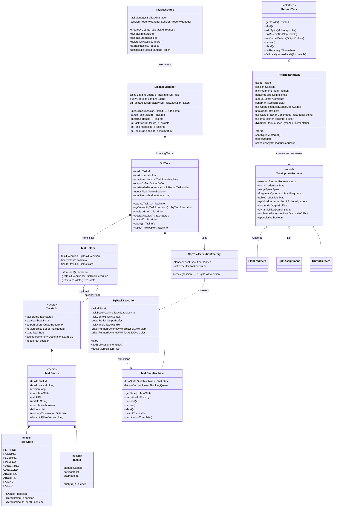
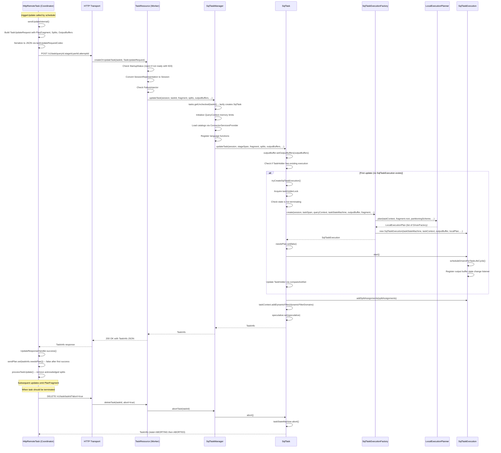

# Module Teardown: Task Lifecycle Management - Control Plane (Task 4.1.A)

## Table of Contents

- [0. Research Focus](#0-research-focus)
- [1. High-Level Overview](#1-high-level-overview)
- [2. Structural Architecture](#2-structural-architecture)
  - [Class Diagram](#class-diagram)
  - [Key Structural Notes](#key-structural-notes)
- [3. Execution & Call Flow](#3-execution-call-flow)
  - [Sequence Diagram](#sequence-diagram)
  - [Step-by-Step Breakdown](#step-by-step-breakdown)
- [4. Concurrency & State Management](#4-concurrency-state-management)
  - [Task State Machine](#task-state-machine)
  - [Critical Synchronization Points](#critical-synchronization-points)
  - [Heartbeat and Abandonment](#heartbeat-and-abandonment)
- [5. Memory & Resource Profile](#5-memory-resource-profile)
  - [Per-Task Memory Footprint](#per-task-memory-footprint)
  - [Request Size Management](#request-size-management)
  - [Task Cache Lifecycle](#task-cache-lifecycle)
- [6. Key Design Insights](#6-key-design-insights)
  - [Insight 1: Unified Create/Update Endpoint (Idempotent POST)](#insight-1-unified-createupdate-endpoint-idempotent-post)
  - [Insight 2: Plan-Once Optimization via needsPlan Flag](#insight-2-plan-once-optimization-via-needsplan-flag)
  - [Insight 3: Two-Phase Termination with Intermediate States](#insight-3-two-phase-termination-with-intermediate-states)
  - [Insight 4: Lazy Task Creation via LoadingCache](#insight-4-lazy-task-creation-via-loadingcache)
  - [Insight 5: Startup Guard with 503 Retry Semantics](#insight-5-startup-guard-with-503-retry-semantics)
  - [Insight 6: Long-Poll Status Monitoring with Randomized Wait](#insight-6-long-poll-status-monitoring-with-randomized-wait)
  - [Insight 7: Split Acknowledgment Protocol](#insight-7-split-acknowledgment-protocol)
- [7. Porting Considerations (Java to Rust Architecture)](#7-porting-considerations-java-to-rust-architecture)
  - [REST Layer (TaskResource)](#rest-layer-taskresource)
  - [Task State Machine](#task-state-machine)
  - [Concurrency Model](#concurrency-model)
  - [Protocol Considerations](#protocol-considerations)
  - [Key Architectural Decision](#key-architectural-decision)


## 0. Research Focus

This teardown analyzes the REST endpoints for creating, updating, and deleting tasks on Trino 480 worker nodes. It traces the full HTTP request path from the coordinator's `HttpRemoteTask` through the worker's `TaskResource` JAX-RS layer, into `SqlTaskManager` and `SqlTask`, ultimately reaching `SqlTaskExecution`. Special attention is paid to the `TaskUpdateRequest` JSON structure (which carries the physical plan fragment), the task state machine, and the concurrency model that protects task lifecycle transitions.

**Key question answered:** How does the worker receive the "Physical Plan" from the coordinator?

**Answer:** The coordinator's `HttpRemoteTask.sendUpdateInternal()` serializes a `TaskUpdateRequest` record (containing an `Optional<PlanFragment>`) to JSON via `taskUpdateRequestCodec.toJsonBytes()` and sends it as an HTTP POST to `POST /v1/task/{taskId}`. The worker's `TaskResource.createOrUpdateTask()` deserializes the JSON body, extracts the `PlanFragment`, and passes it through `SqlTaskManager.updateTask()` into `SqlTask.updateTask()`, which calls `tryCreateSqlTaskExecution()`. Inside that method, `SqlTaskExecutionFactory.create()` invokes `LocalExecutionPlanner.plan()` to convert the `PlanFragment` into a `LocalExecutionPlan` (a set of `DriverFactory` instances), which becomes the running `SqlTaskExecution`.

**Source files analyzed (Trino 480):**

| File | Path (relative to trino root) |
|------|------|
| TaskResource | `core/trino-main/src/main/java/io/trino/server/TaskResource.java` |
| TaskUpdateRequest | `core/trino-main/src/main/java/io/trino/server/TaskUpdateRequest.java` |
| SqlTaskManager | `core/trino-main/src/main/java/io/trino/execution/SqlTaskManager.java` |
| SqlTask | `core/trino-main/src/main/java/io/trino/execution/SqlTask.java` |
| SqlTaskExecution | `core/trino-main/src/main/java/io/trino/execution/SqlTaskExecution.java` |
| SqlTaskExecutionFactory | `core/trino-main/src/main/java/io/trino/execution/SqlTaskExecutionFactory.java` |
| TaskStateMachine | `core/trino-main/src/main/java/io/trino/execution/TaskStateMachine.java` |
| TaskState | `core/trino-main/src/main/java/io/trino/execution/TaskState.java` |
| TaskInfo | `core/trino-main/src/main/java/io/trino/execution/TaskInfo.java` |
| TaskStatus | `core/trino-main/src/main/java/io/trino/execution/TaskStatus.java` |
| TaskId | `core/trino-main/src/main/java/io/trino/execution/TaskId.java` |
| HttpRemoteTask | `core/trino-main/src/main/java/io/trino/server/remotetask/HttpRemoteTask.java` |
| RemoteTask | `core/trino-main/src/main/java/io/trino/execution/RemoteTask.java` |
| PlanFragment | `core/trino-main/src/main/java/io/trino/sql/planner/PlanFragment.java` |
| SplitAssignment | `core/trino-main/src/main/java/io/trino/execution/SplitAssignment.java` |
| OutputBuffers | `core/trino-main/src/main/java/io/trino/execution/buffer/OutputBuffers.java` |
| FailTaskRequest | `core/trino-main/src/main/java/io/trino/server/FailTaskRequest.java` |

---

## 1. High-Level Overview

Trino uses a coordinator-worker architecture where task lifecycle management is the primary control plane mechanism. The coordinator makes scheduling decisions and materializes them by sending HTTP requests to worker nodes. Each worker exposes a RESTful API at `/v1/task` that accepts commands to create, update, query, and destroy tasks.

**The core lifecycle flow:**

1. **Coordinator side:** `HttpRemoteTask` (implements `RemoteTask`) accumulates pending splits, output buffer changes, and dynamic filters. When triggered, it serializes a `TaskUpdateRequest` to JSON and POSTs it to the target worker.

2. **Worker side:** `TaskResource` (JAX-RS endpoint) receives the request, deserializes it, and delegates to `SqlTaskManager`. The manager looks up or lazily creates a `SqlTask` via a Guava `LoadingCache`, then calls `SqlTask.updateTask()`.

3. **Task creation (first update):** If no `SqlTaskExecution` exists, `SqlTask.tryCreateSqlTaskExecution()` uses `SqlTaskExecutionFactory` to invoke `LocalExecutionPlanner.plan()`, converting the `PlanFragment` into `DriverFactory` instances. The resulting `SqlTaskExecution` is started and stored in a `TaskHolder`.

4. **Subsequent updates:** Splits are added via `SqlTaskExecution.addSplitAssignments()`, dynamic filters via `TaskContext.addDynamicFilter()`, and output buffer configuration via `LazyOutputBuffer.setOutputBuffers()`.

5. **Termination:** The coordinator sends `DELETE /v1/task/{taskId}` (with abort/cancel flag) or `POST /v1/task/{taskId}/fail`. The `TaskStateMachine` transitions through terminating states (CANCELING, ABORTING, FAILING) before reaching terminal states (CANCELED, ABORTED, FAILED).

**Design philosophy:** "Create-on-first-access" -- the system lazily creates task infrastructure on the worker when the first update arrives. The coordinator uses the POST endpoint for both creation and updates (idempotent semantics). The plan fragment is sent only on the first request (`sendPlan` flag in `HttpRemoteTask`).

---

## 2. Structural Architecture

### Class Diagram



### Key Structural Notes

- **TaskHolder** is an immutable snapshot value class inside `SqlTask`. It has three states: (1) empty (no execution yet), (2) holding a `SqlTaskExecution`, (3) holding final `TaskInfo` (task is done). Transitions between these states use `AtomicReference.compareAndSet` under `taskHolderLock`.

- **TaskId** format is `queryId.stageId.partitionId.attemptId` (e.g., `20210101_123456_00001_xxxxx.1.3.0`). JAX-RS deserializes it from the URL path via `TaskId.valueOf()`.

- **OutputBuffers** is polymorphic with Jackson `@JsonTypeInfo`: either `PipelinedOutputBuffers` (for pipelined execution) or `SpoolingOutputBuffers` (for fault-tolerant execution). Versioned to ensure monotonic updates.

---

## 3. Execution & Call Flow

### Sequence Diagram



### Step-by-Step Breakdown

**Phase 1: Coordinator Initiates Task Update**

1. The scheduler calls `HttpRemoteTask.start()`, which sets `started=true` and calls `triggerUpdate()`.
2. `triggerUpdate()` increments `pendingRequestsCounter` atomically. If this is the first pending request (counter went from 0 to 1), it schedules `sendUpdate()` on the executor.
3. `sendUpdateInternal()` checks error rate limits via `updateErrorTracker.acquireRequestPermit()`. If throttled, it defers the update.
4. It builds `splitAssignments` from pending splits (limited by `splitBatchSize` for partitioned sources) and collects dynamic filter domains.
5. On the first call, `sendPlan` is `true`, so the full `PlanFragment` is included. On subsequent calls after a successful response where `needsPlan=false`, the fragment is `Optional.empty()`.
6. `TaskUpdateRequest` is constructed as a Java record and serialized to JSON bytes via `taskUpdateRequestCodec.toJsonBytes()`.
7. Adaptive request size adjustment: if enabled, the system estimates whether the request body is too large and may adjust `splitBatchSize` and reschedule.
8. The HTTP POST is sent to `{taskStatus.self()}` (the task's URI on the worker), with the JSON body and appropriate tracing span.

**Phase 2: Worker Receives and Processes**

9. `TaskResource.createOrUpdateTask()` receives the POST. It first checks `startupStatus.isStartupComplete()` -- if the worker is still starting up, it returns 503 (SERVICE_UNAVAILABLE) so the coordinator retries.
10. The `TaskUpdateRequest` is deserialized from JSON by Jackson (using `@JsonCreator` on PlanFragment, SplitAssignment, etc.).
11. `SessionRepresentation.toSession()` converts the serialized session back into a full `Session` object, incorporating `extraCredentials` and `exchangeEncryptionKey`.
12. `failureInjector` optionally injects test failures based on trace tokens.
13. `SqlTaskManager.updateTask()` is called. It wraps the actual work in `versionEmbedder.embedVersion()` to stamp the current Trino version onto the thread.

**Phase 3: SqlTask Update Logic**

14. `SqlTaskManager.doUpdateTask()` retrieves (or lazily creates) the `SqlTask` from the `LoadingCache`. On first access, the cache loader creates a new `SqlTask` with a `LazyOutputBuffer`, `TaskStateMachine`, and empty `TaskHolder`.
15. `QueryContext` memory limits are initialized (different for fault-tolerant vs. pipelined execution).
16. Catalogs are loaded eagerly via `connectorServicesProvider.ensureCatalogsLoaded()`.
17. `SqlTask.updateTask()` is called:
    - First, `outputBuffer.setOutputBuffers(outputBuffers)` configures the output buffer type (pipelined or spooling).
    - If `TaskHolder` has no existing `SqlTaskExecution`, `tryCreateSqlTaskExecution()` is called.

**Phase 4: Task Execution Creation (first update only)**

18. Under `taskHolderLock`, the system double-checks that the task is not finished or terminating.
19. An OpenTelemetry span is created for the task, parented under the stage span.
20. `SqlTaskExecutionFactory.create()` builds a `TaskContext`, then calls `LocalExecutionPlanner.plan()` which converts the `PlanFragment`'s plan tree into `DriverFactory` instances grouped by pipeline.
21. A new `SqlTaskExecution` is constructed, which classifies driver factories into split-lifecycle (partitioned sources) and task-lifecycle (unpartitioned pipelines, remote sources).
22. `execution.start()` is called, which schedules task-lifecycle drivers and registers output buffer completion listeners.
23. `needsPlan` is set to `false`, so the response `TaskInfo.needsPlan()` returns `false`, telling the coordinator to stop sending the plan fragment.
24. The `TaskHolder` is atomically updated via `compareAndSet`.

**Phase 5: Split Assignment**

25. After creation (or on subsequent updates), `SqlTaskExecution.addSplitAssignments()` is called.
26. Previously acknowledged splits (by sequence ID) are filtered out.
27. New splits are added to `PendingSplitsForPlanNode` and scheduled for execution.
28. For partitioned source splits, new `Driver` instances (with split lifecycle) are created.
29. For remote source splits, existing driver runner factories are notified.

**Phase 6: Task Termination**

30. **Cancel (graceful):** `DELETE /v1/task/{taskId}?abort=false` calls `taskManager.cancelTask(taskId)`, which transitions the state machine RUNNING -> CANCELING -> CANCELED. The output buffer is destroyed (signals completion to downstream).
31. **Abort:** `DELETE /v1/task/{taskId}?abort=true` calls `taskManager.abortTask(taskId)`. State transitions to ABORTING -> ABORTED. The output buffer is aborted (signals failure to downstream).
32. **Fail:** `POST /v1/task/{taskId}/fail` with `FailTaskRequest` JSON body. Adds the failure cause and transitions through FAILING -> FAILED.
33. In all cases, `terminationComplete()` is called when all drivers finish exiting, transitioning from the intermediate terminating state to the final done state.

---

## 4. Concurrency & State Management

### Task State Machine

`TaskStateMachine` wraps a `StateMachine<TaskState>` with the following transition rules:

```
PLANNED --> RUNNING (implicit, initial state of StateMachine is RUNNING)
RUNNING --> FLUSHING (all drivers done, output not yet consumed)
RUNNING --> FINISHED (when not terminating or done)
RUNNING --> CANCELING --> CANCELED
RUNNING --> ABORTING --> ABORTED
RUNNING --> FAILING --> FAILED

FLUSHING --> FINISHED
FLUSHING --> CANCELING / ABORTING / FAILING (same as RUNNING)
```

Key concurrency rules:
- **`setIf` guard:** All transitions use `taskState.setIf(newState, predicate)` which is an atomic compare-and-set operation. For example, `startTermination(ABORTING)` only succeeds if `!currentState.isTerminatingOrDone()`.
- **Two-phase termination:** States like CANCELING, ABORTING, FAILING are intermediate. The task stays in these states until all active drivers have finished (`driverAndTaskTerminationTracker.checkTaskTermination()`), then `terminationComplete()` moves to the final done state. This prevents premature resource cleanup.

### Critical Synchronization Points

1. **`taskHolderLock` in SqlTask:** Guards the transition from "no execution" to "has execution" and from "has execution" to "final info". The lock is acquired in `tryCreateSqlTaskExecution()` and in the state change listener that stores final `TaskInfo`. This prevents races between creating an execution and termination.

2. **`synchronized` on `notifyStatusChanged()`:** The `taskStatusVersion` counter and `taskStatusVersionChange` future are updated atomically. This ensures long-poll listeners (via `getTaskStatus(version)`) never miss a notification.

3. **AtomicReference for TaskHolder:** The `taskHolderReference` is read without locks (for performance on the read path), but writes always happen under `taskHolderLock` with `compareAndSet`.

4. **ThreadLocal SplittableRandom:** `taskInstanceId` is generated using a ThreadLocal `SplittableRandom` (split from a root PRNG). This avoids contention on the random number generator when creating many tasks concurrently.

5. **Long-poll with versioning:** Both `getTaskInfo(version)` and `getTaskStatus(version)` use `FutureStateChange` to implement long-polling. The client sends the last-known version; if the server has a newer version, it responds immediately. Otherwise, it returns a `ListenableFuture` that completes on the next status change. A randomized timeout in `[T/2, T]` prevents thundering herds.

6. **HttpRemoteTask synchronization:** The coordinator-side `pendingSplits`, `noMoreSplits`, and `pendingSourceSplitCount` are guarded by `synchronized(this)`. The `currentRequest` AtomicReference ensures only one in-flight update request at a time. `pendingRequestsCounter` is an atomic integer that tracks how many updates were requested while one was in flight.

### Heartbeat and Abandonment

- Every `SqlTaskManager` method that accesses a task calls `sqlTask.recordHeartbeat()`, which atomically stores `Instant.now()`.
- A background scheduled task (`failAbandonedTasks`) runs every 200ms, failing any task whose last heartbeat is older than `clientTimeout`.
- Completed tasks are garbage collected by `removeOldTasks()` after `infoCacheTime` has elapsed since their end time.

---

## 5. Memory & Resource Profile

### Per-Task Memory Footprint

| Component | Memory Behavior |
|-----------|----------------|
| **SqlTask object** | Lightweight shell: AtomicReferences, TaskStateMachine, LazyOutputBuffer reference |
| **TaskHolder** | Immutable snapshot; 3 variants (empty, execution, final) |
| **QueryContext** | Shared per-query via `NonEvictableLoadingCache` with weak values; tracks memory reservations |
| **SqlTaskExecution** | Holds all DriverFactory maps, pending splits per plan node, driver runner factories |
| **PlanFragment** | Sent once, then discarded (not stored in SqlTask). Includes full plan tree, type info, stats |
| **TaskUpdateRequest** | Transient -- exists only during HTTP request processing. The JSON representation can be large due to splits |
| **Output Buffers** | LazyOutputBuffer wraps the real buffer (pipelined or spooling), bounded by `maxBufferSize` and `maxBroadcastBufferSize` |
| **Pending Splits** | On coordinator: `SetMultimap<PlanNodeId, ScheduledSplit>` in HttpRemoteTask. On worker: stored per PlanNode in SqlTaskExecution |

### Request Size Management

`HttpRemoteTask` implements adaptive request size control:
- `maxRequestSizeInBytes` and `requestSizeHeadroomInBytes` bound the JSON payload size.
- `splitBatchSize` is adjusted dynamically based on actual serialized size vs. target size.
- `guaranteedSplitsPerRequest` ensures a minimum number of splits per request (avoids starvation).
- If the serialized request exceeds the limit, it is abandoned and rescheduled with a smaller batch.

### Task Cache Lifecycle

- `tasks` is a `NonEvictableLoadingCache<TaskId, SqlTask>` -- tasks are never evicted by the cache itself.
- Removal happens explicitly in `removeOldTasks()` via `tasks.unsafeInvalidate(taskId)` after a task has been done for `infoCacheTime`.
- `queryContexts` uses weak values, so they are GC'd when no task references them.

---

## 6. Key Design Insights

### Insight 1: Unified Create/Update Endpoint (Idempotent POST)

The same `POST /v1/task/{taskId}` endpoint handles both task creation and updates. The first request carries `Optional<PlanFragment>` with a value; subsequent requests may carry `Optional.empty()`. This design eliminates the need for separate create vs. update API calls and makes retries safe -- if the coordinator is unsure whether a previous request succeeded, it can resend the same update. The worker's `SqlTask.updateTask()` handles both cases: if `TaskHolder` has no execution, it creates one; if it already has one, it just adds splits and dynamic filters.

**Evidence:** `TaskResource.createOrUpdateTask()` (line 146-179) calls `taskManager.updateTask()` regardless of whether the task exists. `SqlTask.updateTask()` (line 510-558) checks `taskHolder.getTaskExecution() == null` to decide whether to create.

### Insight 2: Plan-Once Optimization via needsPlan Flag

The `PlanFragment` can be large (hundreds of KB for complex queries). To avoid sending it on every update, the response `TaskInfo` includes a `needsPlan` boolean field. After the first successful update where the plan is received and processed, `needsPlan` is set to `false`. The coordinator's `UpdateResponseHandler.success()` reads `value.needsPlan()` and sets `sendPlan.set(value.needsPlan())`, so subsequent requests omit the plan fragment. Additionally, `PlanFragment.withoutEmbeddedJsonRepresentation()` strips the human-readable JSON representation before sending, further reducing payload size.

**Evidence:** `SqlTask.tryCreateSqlTaskExecution()` calls `needsPlan.set(false)` at line 596. `HttpRemoteTask.sendUpdateInternal()` at line 770: `Optional<PlanFragment> fragment = sendPlan.get() ? Optional.of(planFragment.withoutEmbeddedJsonRepresentation()) : Optional.empty()`.

### Insight 3: Two-Phase Termination with Intermediate States

Task termination is not instantaneous. When a cancel/abort/fail is requested, the state machine first transitions to an intermediate "terminating" state (CANCELING, ABORTING, FAILING). The task stays in this state while active drivers are draining. Only when all drivers have completed does `terminationComplete()` fire, moving to the final done state (CANCELED, ABORTED, FAILED). This two-phase design ensures:
- Resources are not freed prematurely while drivers are still running.
- The output buffer behavior differs per termination type: abort destroys buffers immediately (signaling failure upstream), while cancel/finish destroys them cleanly (signaling completion).
- The coordinator can distinguish "task is being terminated" from "task has fully terminated" for scheduling purposes.

**Evidence:** `TaskStateMachine.startTermination()` at line 166 uses `setIf(terminatingState, currentState -> !currentState.isTerminatingOrDone())`. The `SqlTask.initialize()` state change listener (line 187-249) handles both terminating and done states differently. `DriverAndTaskTerminationTracker.checkTaskTermination()` is called when drivers finish, leading to `terminationComplete()`.

### Insight 4: Lazy Task Creation via LoadingCache

`SqlTaskManager` uses a Guava `NonEvictableLoadingCache<TaskId, SqlTask>` to manage tasks. The cache loader creates a new `SqlTask` on first access. This means any API call -- whether `updateTask`, `getTaskInfo`, `getTaskStatus`, or even `cancelTask` -- will create a task if it does not exist. This "create-on-first-access" pattern simplifies the coordinator logic: it never needs a separate "create task" step. However, it has the side effect noted in the JavaDoc: "this design assumes that only tasks that will eventually exist are queried."

**Evidence:** `SqlTaskManager` at line 230-249: `tasks = buildNonEvictableCache(CacheBuilder.newBuilder(), CacheLoader.from(taskId -> { ... createSqlTask(...) ... }))`. All public methods use `tasks.getUnchecked(taskId)`.

### Insight 5: Startup Guard with 503 Retry Semantics

When a worker node restarts (e.g., after a crash), the coordinator may attempt to schedule tasks before the worker is fully initialized. `TaskResource.failRequestIfInvalid()` checks `startupStatus.isStartupComplete()` and returns HTTP 503 (SERVICE_UNAVAILABLE) if the worker is not ready. This is a deliberate design choice: the coordinator's `HttpRemoteTask` retries on 503 via its `RequestErrorTracker`, while a 500 (INTERNAL_SERVER_ERROR) would cause immediate failure. This gives the worker time to fully start up.

**Evidence:** `TaskResource.failRequestIfInvalid()` at line 412-423, with the comment: "Send 503 (SERVICE_UNAVAILABLE) so that request is retried."

### Insight 6: Long-Poll Status Monitoring with Randomized Wait

The coordinator continuously monitors task status via `GET /v1/task/{taskId}/status` with long-polling. The request includes a `TRINO_CURRENT_VERSION` header and a `TRINO_MAX_WAIT` duration. The worker only responds when the task status version exceeds the caller's version or when the wait time expires. The wait time is randomized in `[maxWait/2, maxWait]` to prevent thundering herds when many tasks poll simultaneously. An additional 5-second `ADDITIONAL_WAIT_TIME` is added to the hard timeout to account for GC pauses and thread scheduling contention.

**Evidence:** `TaskResource.getTaskStatus()` at line 254: `Duration waitTime = randomizeWaitTime(maxWait)`. `randomizeWaitTime()` at line 528-533: `halfWaitMillis + ThreadLocalRandom.current().nextLong(halfWaitMillis)`.

### Insight 7: Split Acknowledgment Protocol

Splits are tracked with monotonically increasing sequence IDs (assigned by the coordinator's `HttpRemoteTask.nextSplitId`). When the worker processes splits and responds with `TaskInfo`, the coordinator's `processTaskUpdate()` removes the acknowledged splits from `pendingSplits`. On the worker side, `SqlTaskExecution.updateSplitAssignments()` tracks `maxAcknowledgedSplitByPlanNode` to deduplicate splits that are resent in retried requests. This ensures exactly-once delivery of splits despite at-least-once HTTP semantics.

**Evidence:** `HttpRemoteTask.processTaskUpdate()` at line 641-676 removes splits from `pendingSplits` after a successful response. `SqlTaskExecution.updateSplitAssignments()` at line 273-298 filters by `sequenceId > currentMaxAcknowledgedSplit`.

---

## 7. Porting Considerations (Java to Rust Architecture)

### REST Layer (TaskResource)

- **JAX-RS to Rust HTTP framework:** Replace Jakarta REST annotations with an async Rust HTTP framework (axum, actix-web, or tonic for gRPC). The path pattern `/v1/task/{taskId}` maps directly to router extractors.
- **Jackson JSON serialization:** Replace with `serde` + `serde_json`. The polymorphic `OutputBuffers` (`@JsonTypeInfo`) requires `#[serde(tag = "@type")]` with enum variants. `PlanFragment`'s `@JsonCreator` maps to `#[derive(Deserialize)]`.
- **Async response handling:** JAX-RS `@Suspended AsyncResponse` maps to Rust async handlers returning `impl IntoResponse` or using channels/oneshot for deferred responses.

### Task State Machine

- **StateMachine to Rust:** Model `TaskState` as a Rust enum. The `StateMachine<TaskState>` pattern maps to an `Arc<Mutex<TaskState>>` or a lock-free state machine using `AtomicU8` with `compare_exchange`. The `setIf(newState, predicate)` pattern maps to a CAS loop.
- **State change listeners:** Use `tokio::sync::watch` channels or a custom broadcast mechanism. The `FutureStateChange` pattern maps to `tokio::sync::Notify` or `watch::Receiver`.

### Concurrency Model

- **GuardedBy fields:** Rust's ownership model naturally enforces this. Fields behind `Mutex<T>` can only be accessed with the lock held. The `taskHolderLock` pattern becomes `Mutex<TaskHolder>`.
- **AtomicReference:** `Arc<AtomicCell<T>>` from crossbeam, or `Arc<Mutex<Option<T>>>` for larger types.
- **ThreadLocal SplittableRandom:** `thread_local!` with `rand::thread_rng()`.
- **LoadingCache:** Use `dashmap::DashMap` or `moka::sync::Cache`. The lazy-create-on-access pattern is easily replicated with `entry().or_insert_with()`.

### Protocol Considerations

- **Binary serialization:** Consider replacing JSON with a binary format (protobuf, flatbuffers, or bincode) for the `TaskUpdateRequest` to reduce serialization overhead. The `PlanFragment` is particularly expensive to serialize as JSON.
- **Plan fragment optimization:** In Rust, consider sending the plan as a separate, cached artifact (e.g., content-addressed by hash) rather than embedding it in the update request.
- **Connection pooling:** Trino uses Airlift's `HttpClient` with connection pooling. In Rust, use `reqwest` with a connection pool or `hyper` directly. Consider HTTP/2 multiplexing for many concurrent task updates.
- **gRPC alternative:** The request-response pattern maps well to gRPC unary RPCs. Long-polling could be replaced with server-streaming RPCs. This would also solve the serialization format question (protobuf by default).

### Key Architectural Decision

The "unified POST for create and update" pattern is elegant but creates implicit coupling. In a Rust port, consider making task creation explicit with a separate `CreateTask` RPC that returns a task handle, followed by `UpdateTask` RPCs for splits and dynamic filters. This makes the state machine transitions clearer and allows the plan fragment to be sent exactly once without the `needsPlan` flag workaround.
