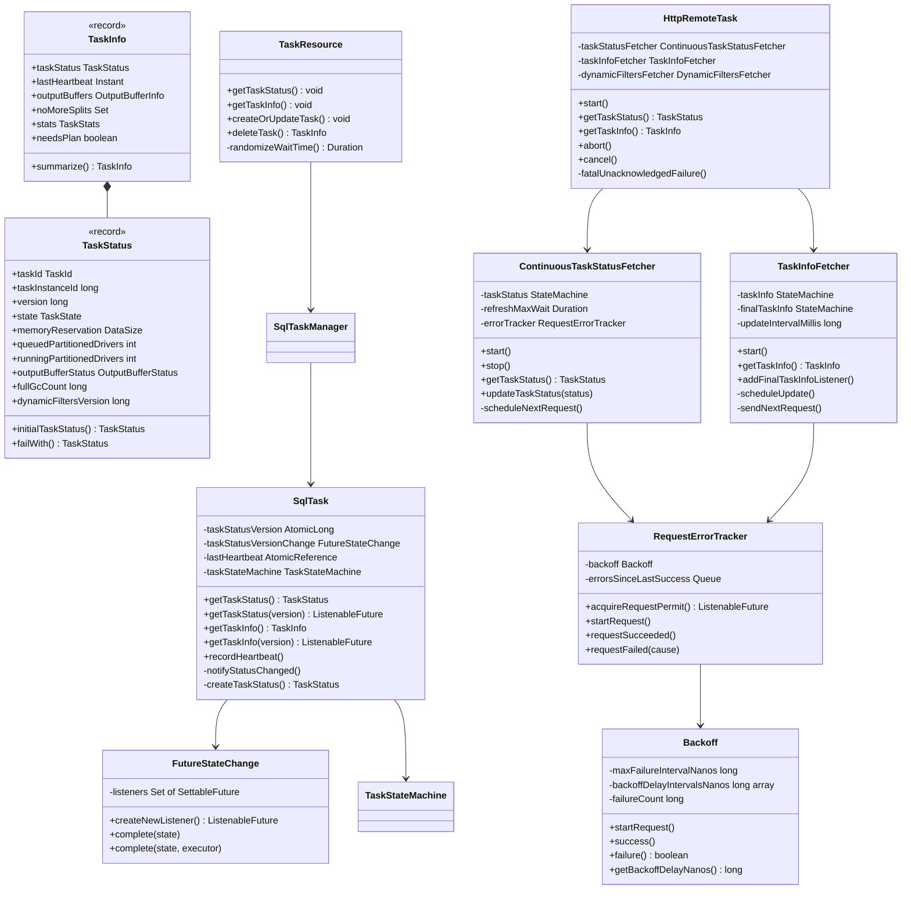
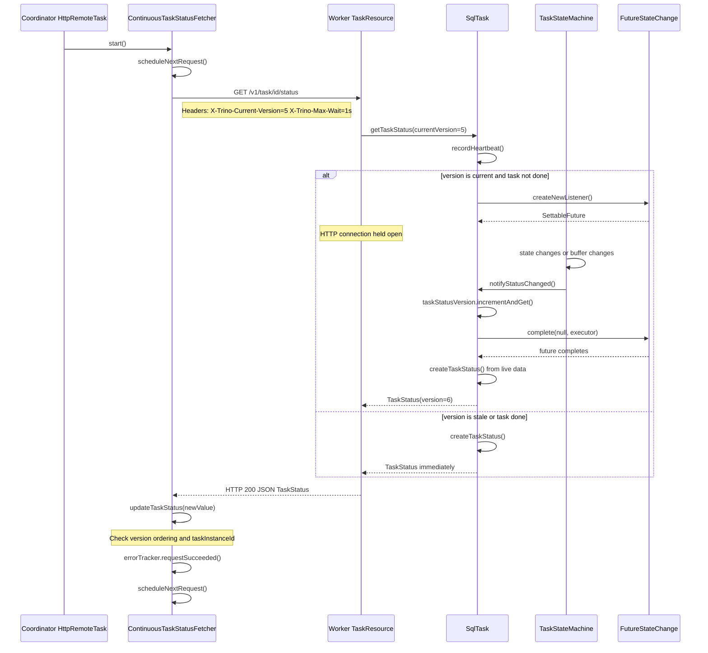
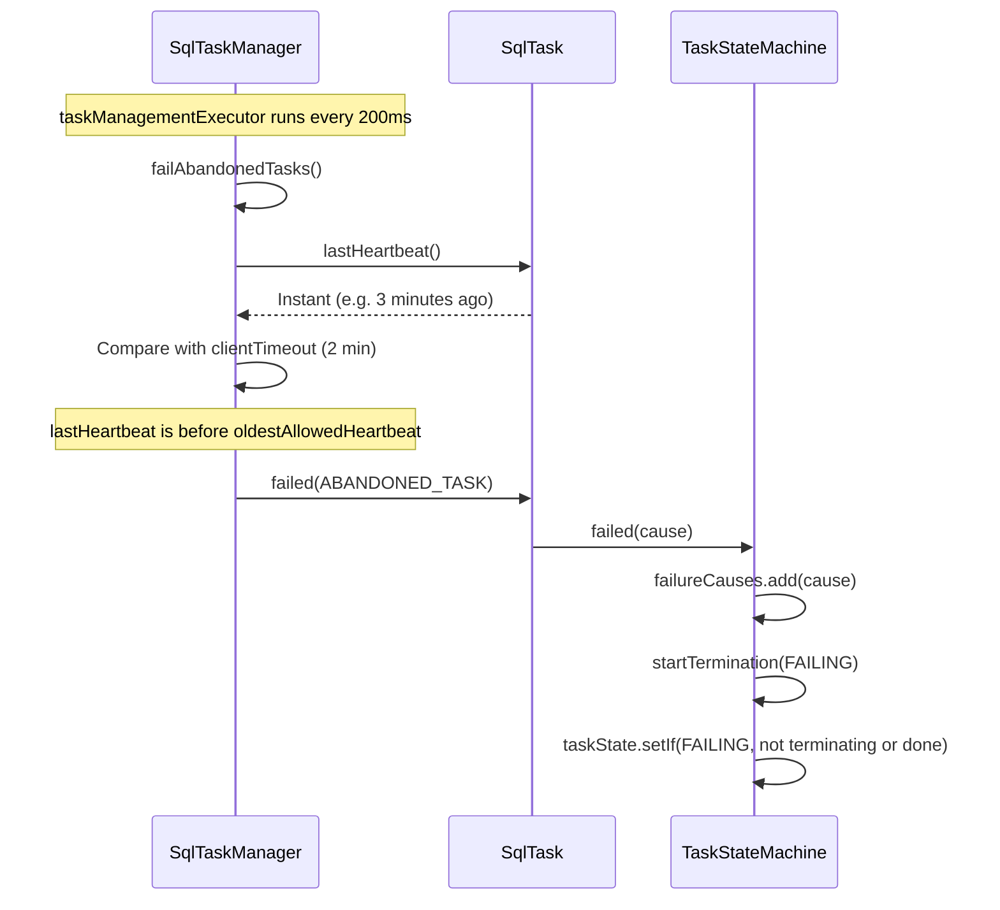

# Module Teardown: Status & Heartbeat Reporting -- Control Plane (Task 4.1.B)

## Table of Contents

- [0. Research Focus](#0-research-focus)
- [1. High-Level Overview](#1-high-level-overview)
- [2. Structural Architecture](#2-structural-architecture)
  - [Primary Source Files](#primary-source-files)
  - [Key Data Structures](#key-data-structures)
  - [Class Diagram](#class-diagram)
- [3. Data Flow Analysis](#3-data-flow-analysis)
  - [3.1 Worker-Side: Building TaskStatus on Demand](#31-worker-side-building-taskstatus-on-demand)
  - [3.2 Worker-Side: Long-Polling Mechanism](#32-worker-side-long-polling-mechanism)
  - [3.3 Coordinator-Side: Continuous Status Polling Loop](#33-coordinator-side-continuous-status-polling-loop)
  - [3.4 Coordinator-Side: TaskInfo Fetching (Slower Channel)](#34-coordinator-side-taskinfo-fetching-slower-channel)
  - [Sequence Diagram: Full Status Polling Cycle](#sequence-diagram-full-status-polling-cycle)
  - [Sequence Diagram: Heartbeat Timeout Failure](#sequence-diagram-heartbeat-timeout-failure)
- [4. Version-Based Change Detection Deep Dive](#4-version-based-change-detection-deep-dive)
  - [4.1 Version Lifecycle on the Worker](#41-version-lifecycle-on-the-worker)
  - [4.2 Version Comparison on the Coordinator](#42-version-comparison-on-the-coordinator)
  - [4.3 Special Version Values](#43-special-version-values)
- [5. Error Handling & Resilience](#5-error-handling-resilience)
  - [5.1 Backoff Strategy](#51-backoff-strategy)
  - [5.2 Error Classification](#52-error-classification)
  - [5.3 Startup Protection](#53-startup-protection)
  - [5.4 Wait Time Randomization](#54-wait-time-randomization)
- [6. Rust Rewrite Implications](#6-rust-rewrite-implications)
  - [6.1 Architecture Mapping](#61-architecture-mapping)
  - [6.2 Key Design Considerations](#62-key-design-considerations)
  - [6.3 Simplification Opportunities](#63-simplification-opportunities)
- [7. Key Observations](#7-key-observations)


## 0. Research Focus
* **Task ID:** 4.1.B
* **Focus:** How does a Trino worker report its health, memory usage, and execution progress back to the coordinator? Trace the asynchronous long-polling mechanism used to update task status, including version-based polling, heartbeat timeouts, error backoff, and the data structures that carry status information.

## 1. High-Level Overview
* **Core Responsibility:** The control plane of Trino's distributed execution is a coordinator-driven, long-polling protocol. The coordinator continuously fetches lightweight `TaskStatus` objects from every remote worker task. The worker does not push updates -- instead, it holds the HTTP response open until either the status actually changes (version-based notification) or a server-side timeout fires. This gives the coordinator near-real-time visibility into memory usage, driver counts, output buffer pressure, GC activity, and state transitions without wasteful polling.
* **Key Design Decisions:**
  - **Pull model with long-poll:** The coordinator is the sole initiator of status requests. Workers never open connections back to the coordinator. Long-polling avoids busy-wait while keeping latency low (typically under 1 second for state changes).
  - **Dual-channel fetching:** `ContinuousTaskStatusFetcher` fetches the compact `TaskStatus` record on a tight loop. `TaskInfoFetcher` fetches the heavier `TaskInfo` (including full `TaskStats` and `OutputBufferInfo`) on a slower interval (default 3 seconds).
  - **Version-based change detection:** Every mutation on the worker increments an `AtomicLong taskStatusVersion`. The coordinator sends its last-seen version in the `X-Trino-Current-Version` header. The worker only completes the HTTP response when its version exceeds the coordinator's version.
  - **Heartbeat as a side-effect:** Every status or info fetch calls `sqlTask.recordHeartbeat()`, resetting the `lastHeartbeat` timestamp. If no request arrives within `clientTimeout` (default 2 minutes), the worker declares the task abandoned and fails it.
  - **Exponential backoff on errors:** The `RequestErrorTracker` and `Backoff` classes throttle retries with delays of 0, 50, 100, 200, 500 ms. After `maxErrorDuration` of continuous failures (default 5 minutes), the task is declared permanently failed.

## 2. Structural Architecture

### Primary Source Files

| File | Lines | Role |
|------|-------|------|
| `io.trino.execution.TaskStatus` | 165 | Immutable record carrying compact task state: version, state, memory, driver counts, GC, buffer status |
| `io.trino.execution.TaskInfo` | 109 | Heavier record wrapping TaskStatus + TaskStats + OutputBufferInfo + lastHeartbeat + noMoreSplits |
| `io.trino.execution.TaskState` | 97 | Enum of 10 states with isDone, isTerminating, isTerminatingOrDone predicates |
| `io.trino.execution.TaskStateMachine` | 219 | Worker-side state machine wrapping StateMachine of TaskState, failure tracking, source-task failure propagation |
| `io.trino.execution.StateMachine` | 328 | Generic CAS-based state machine with FutureStateChange notification and listener management |
| `io.trino.execution.FutureStateChange` | 111 | Publish-subscribe for state changes: each waiter gets a SettableFuture that completes on the next change |
| `io.trino.execution.SqlTask` | 795 | Worker-side task wrapper: builds TaskStatus/TaskInfo from live TaskContext, manages version counter, provides long-poll futures |
| `io.trino.execution.SqlTaskManager` | 874 | Worker-side task manager: delegates to SqlTask, runs heartbeat timeout checker, removes old tasks |
| `io.trino.server.TaskResource` | 567 | JAX-RS endpoints on worker: GET /v1/task/taskId/status and GET /v1/task/taskId with @Suspended AsyncResponse |
| `io.trino.server.AsyncResponseUtils` | 36 | Utility: wraps a ListenableFuture with a timeout fallback |
| `io.trino.server.InternalHeaders` | 45 | HTTP header constants: X-Trino-Current-Version, X-Trino-Max-Wait, etc. |
| `io.trino.server.remotetask.ContinuousTaskStatusFetcher` | 272 | Coordinator-side: continuous loop that GETs /v1/task/taskId/status with version headers |
| `io.trino.server.remotetask.TaskInfoFetcher` | 384 | Coordinator-side: periodic loop that GETs /v1/task/taskId for full TaskInfo |
| `io.trino.server.remotetask.HttpRemoteTask` | 1270+ | Coordinator-side RemoteTask implementation: owns both fetchers, manages split queue, handles abort/cancel |
| `io.trino.server.remotetask.RequestErrorTracker` | 163 | Tracks consecutive errors with backoff; throws TOO_MANY_REQUESTS_FAILED after maxErrorDuration |
| `io.trino.server.remotetask.Backoff` | 155 | Exponential backoff delay calculator: 0, 50, 100, 200, 500 ms intervals |
| `io.trino.server.remotetask.SimpleHttpResponseHandler` | 96 | Maps HTTP JSON responses to success/failed/fatal callbacks |
| `io.trino.server.remotetask.RemoteTaskStats` | 142 | JMX metrics: status round-trip time, info round-trip time, update round-trip time |
| `io.trino.execution.TaskManagerConfig` | ~450 | Configuration: clientTimeout, statusRefreshMaxWait, infoUpdateInterval, taskTerminationTimeout |
| `io.trino.server.StartupStatus` | 33 | Tracks worker startup completion; TaskResource returns 503 until ready |

### Key Data Structures

**TaskStatus record fields (the compact heartbeat payload):**

| Field | Type | Purpose |
|-------|------|---------|
| `taskId` | `TaskId` | Unique identifier: queryId.stageId.partitionId.attemptId |
| `taskInstanceId` | `long` | Random ID to detect task restarts on same worker |
| `version` | `long` | Monotonically increasing version, starting at 0 |
| `state` | `TaskState` | Current lifecycle state (PLANNED through FAILED) |
| `self` | `URI` | Worker endpoint URL for this task |
| `nodeId` | `String` | Worker node identifier |
| `speculative` | `boolean` | Whether this is a speculative execution attempt |
| `failures` | `List of ExecutionFailureInfo` | Failure details when state is FAILED or FAILING |
| `queuedPartitionedDrivers` | `int` | Number of drivers waiting to execute |
| `runningPartitionedDrivers` | `int` | Number of actively executing drivers |
| `outputBufferStatus` | `OutputBufferStatus` | Buffer version, overutilized flag, exchange sink update flag |
| `outputDataSize` | `DataSize` | Total bytes produced to output buffer |
| `writerInputDataSize` | `DataSize` | Data consumed by table writer operators |
| `physicalWrittenDataSize` | `DataSize` | Bytes physically written to storage |
| `maxWriterCount` | `OptionalInt` | Maximum writer concurrency observed |
| `memoryReservation` | `DataSize` | Current user memory reserved |
| `peakMemoryReservation` | `DataSize` | High-water mark of memory reservation |
| `revocableMemoryReservation` | `DataSize` | Memory eligible for spilling |
| `fullGcCount` | `long` | JVM full GC count |
| `fullGcTime` | `Duration` | JVM full GC cumulative time |
| `dynamicFiltersVersion` | `long` | Version of dynamic filters collected by this task |
| `queuedPartitionedSplitsWeight` | `long` | Weighted count of queued splits |
| `runningPartitionedSplitsWeight` | `long` | Weighted count of running splits |

**TaskInfo record fields (the full status payload):**

| Field | Type | Purpose |
|-------|------|---------|
| `taskStatus` | `TaskStatus` | Embedded compact status |
| `lastHeartbeat` | `Instant` | Timestamp of last coordinator contact |
| `outputBuffers` | `OutputBufferInfo` | Full buffer info including per-partition stats |
| `noMoreSplits` | `Set of PlanNodeId` | Plan nodes that have received all splits |
| `stats` | `TaskStats` | Comprehensive execution stats with 40+ fields |
| `estimatedMemory` | `Optional DataSize` | Coordinator-provided memory estimate |
| `needsPlan` | `boolean` | Whether the task still needs the plan fragment |

**Configuration defaults (TaskManagerConfig):**

| Config | Default | Purpose |
|--------|---------|---------|
| `statusRefreshMaxWait` | 1 second | Max time worker holds the long-poll open |
| `infoUpdateInterval` | 3 seconds | How often coordinator fetches full TaskInfo |
| `clientTimeout` | 2 minutes | Heartbeat timeout before task is abandoned |
| `infoMaxAge` | 5 minutes | How long completed tasks stay in cache |
| `taskTerminationTimeout` | 1 minute | Max wait for CANCELING/ABORTING to reach terminal |

### Class Diagram



## 3. Data Flow Analysis

### 3.1 Worker-Side: Building TaskStatus on Demand

When the coordinator's HTTP request arrives at `TaskResource.getTaskStatus()`, the status is built lazily from live runtime data:

```
TaskResource.getTaskStatus(taskId, currentVersion, maxWait)
  SqlTaskManager.getTaskStatus(taskId, currentVersion)
    SqlTask sqlTask = tasks.getUnchecked(taskId)
    sqlTask.recordHeartbeat()                        // resets heartbeat timer
    SqlTask.getTaskStatus(callersCurrentVersion)
      if callersCurrentVersion is old OR task is finished:
        return immediateFuture(getTaskStatus())      // return immediately
      else:
        return taskStatusVersionChange.createNewListener()  // park until change
          transformed to getTaskStatus()
```

The `createTaskStatus()` method in `SqlTask` assembles the record from live sources:

1. **Read version first** -- `taskStatusVersion.get()` captured before reading any stats, ensuring no update is lost
2. **Read TaskState** from `TaskStateMachine`
3. **If final TaskInfo exists** -- use cached final stats (task already completed)
4. **If TaskExecution exists** -- iterate all `PipelineContext` objects to sum up `queuedPartitionedDrivers`, `runningPartitionedDrivers`, memory reservations, GC stats, dynamic filter version
5. **If neither exists but state is FINISHED** -- mask state as RUNNING to prevent coordinator from seeing incomplete terminal info
6. **Construct immutable TaskStatus record** with all gathered metrics

### 3.2 Worker-Side: Long-Polling Mechanism

The long-polling mechanism uses three layers of indirection:

**Layer 1: Version Counter (SqlTask)**
```
SqlTask.notifyStatusChanged():
  taskStatusVersion.incrementAndGet()
  taskStatusVersionChange.complete(null, taskNotificationExecutor)
```
Every significant event calls `notifyStatusChanged()`:
- State transitions (via TaskStateMachine listener)
- Output buffer changes (wired as callback `this::notifyStatusChanged`)
- Task execution factory completion

**Layer 2: FutureStateChange (one-shot fan-out)**
```
FutureStateChange.createNewListener():
  create new SettableFuture
  add to listeners set
  return future

FutureStateChange.complete(value, executor):
  snapshot all listeners, clear set
  for each future: executor.execute( future.set(value) )
```
Each HTTP long-poll request creates a new listener. When any status change occurs, ALL waiting listeners are completed, waking all pending HTTP requests.

**Layer 3: HTTP Timeout Wrapper (TaskResource)**
```
TaskResource.getTaskStatus():
  futureTaskStatus = taskManager.getTaskStatus(taskId, currentVersion)
  if not done:
    futureTaskStatus = addTimeout(futureTaskStatus,
      fallback = taskManager.getTaskStatus(taskId),  // return current status
      waitTime = randomizeWaitTime(maxWait),          // [maxWait/2, maxWait]
      timeoutExecutor)
  hardTimeout = waitTime + 5 seconds
  bindAsyncResponse(asyncResponse, withFallbackAfterTimeout(...), ...)
```
Two timeouts operate:
1. **Soft timeout** (randomized `[maxWait/2, maxWait]`): Completes the future with current status even if no change occurred. The randomization prevents thundering-herd when many tasks all time out simultaneously.
2. **Hard timeout** (soft + 5 seconds): Returns HTTP 503 Service Unavailable as absolute safety net.

### 3.3 Coordinator-Side: Continuous Status Polling Loop

```
ContinuousTaskStatusFetcher.scheduleNextRequest():
  Check: still running and not done
  Check: no outstanding request
  Check: error rate limit (backoff delay)

  Build GET request:
    URI = taskStatus.self() + "/status"
    Header: X-Trino-Current-Version = taskStatus.version()
    Header: X-Trino-Max-Wait = refreshMaxWait (default 1s)

  Send async HTTP request
  On response:
    success: updateTaskStatus(newValue) then scheduleNextRequest()
    failed:  errorTracker.requestFailed(cause) then scheduleNextRequest()
    fatal:   onFail.accept(cause) -- terminates the loop
```

The loop is self-scheduling: every response (success or failure) triggers the next request. There is no fixed-interval timer. The actual polling interval is determined by the server's hold time (up to 1 second if nothing changed) plus network round-trip.

### 3.4 Coordinator-Side: TaskInfo Fetching (Slower Channel)

```
TaskInfoFetcher.scheduleUpdate():
  scheduleWithFixedDelay(every 100ms):
    if previous request still running: skip
    if nanosSince(lastUpdate) is below updateIntervalMillis (3s): skip
    sendNextRequest()

sendNextRequest():
  Build GET to taskStatus.self() [optionally with "?summarize"]
  No version header -- always fetches full current state
  On success:
    updateTaskInfo(newValue)
    if task is done: set finalTaskInfo, stop fetching
```

Key difference from status fetching: TaskInfo uses a fixed-interval timer (100ms tick, gated by 3-second minimum interval) rather than self-scheduling, because the coordinator does not need real-time TaskInfo -- it is used for query progress display and post-completion analysis.

### Sequence Diagram: Full Status Polling Cycle



### Sequence Diagram: Heartbeat Timeout Failure



## 4. Version-Based Change Detection Deep Dive

### 4.1 Version Lifecycle on the Worker

The `taskStatusVersion` AtomicLong in `SqlTask` starts at `STARTING_VERSION = 0` and increments for every significant change:

**Events that trigger `notifyStatusChanged()`:**
1. **TaskState transitions** -- via `TaskStateMachine.addStateChangeListener` (fires for every state except the initial RUNNING)
2. **Output buffer mutations** -- wired as `this::notifyStatusChanged` callback to `LazyOutputBuffer` constructor
3. **Task execution start** -- implicit through state change
4. **Pipeline completion** -- propagated through driver status changes

The `notifyStatusChanged()` method is `synchronized` on the SqlTask instance, ensuring atomic version-increment-then-notify:

```java
private synchronized void notifyStatusChanged() {
    taskStatusVersion.incrementAndGet();
    taskStatusVersionChange.complete(null, taskNotificationExecutor);
}
```

### 4.2 Version Comparison on the Coordinator

`ContinuousTaskStatusFetcher.updateTaskStatus()` enforces version ordering:

```java
taskStatus.setIf(newValue, oldValue -> {
    // Detect task instance restart (different random ID)
    if (oldValue.taskInstanceId() != 0 &&
        oldValue.taskInstanceId() != newValue.taskInstanceId()) {
        taskMismatch.set(true);
        return false;
    }
    // Never regress from terminal state
    if (oldValue.state().isDone()) {
        return false;
    }
    // Accept same or newer version
    return newValue.version() >= oldValue.version();
});
```

If a task instance mismatch is detected (worker restarted and created a new task instance), the coordinator triggers `REMOTE_TASK_MISMATCH` error and issues a DELETE to clean up the orphaned task.

### 4.3 Special Version Values

| Value | Name | Purpose |
|-------|------|---------|
| 0 | `STARTING_VERSION` | Initial version for a freshly created task |
| `Long.MAX_VALUE` | `MAX_VERSION` | Used in `failWith()` to create a status that is always newer than any remote status |

## 5. Error Handling & Resilience

### 5.1 Backoff Strategy

The `Backoff` class implements progressive delay with guaranteed minimum retries:

| Failure Count | Delay |
|---------------|-------|
| 0 | 0 ms (immediate) |
| 1 | 50 ms |
| 2 | 100 ms |
| 3 | 200 ms |
| 4+ | 500 ms |

Permanent failure is declared when:
- `failureCount` is at least `MIN_RETRIES` (3), AND
- total failure duration exceeds `maxFailureIntervalNanos` (from `maxErrorDuration` config, default 5 minutes)

### 5.2 Error Classification

`SimpleHttpResponseHandler` classifies responses into three categories:

| Response | Classification | Action |
|----------|---------------|--------|
| HTTP 200 with valid JSON | `success()` | Update status, clear error tracker |
| HTTP 503 Service Unavailable | `failed()` | Count as retryable error in backoff |
| HTTP 500 or parse error | `fatal()` | Immediately call onFail, task declared dead |
| Network timeout or connection error | `failed()` | Count as retryable error in backoff |

`RequestErrorTracker` further classifies expected vs unexpected errors:
- **Expected** (no stack trace logged): SocketException, SocketTimeoutException, EOFException, TimeoutException, CancellationException, ClosedChannelException, ServiceUnavailableException
- **Unexpected** (full stack trace logged): everything else

### 5.3 Startup Protection

`TaskResource.failRequestIfInvalid()` checks `StartupStatus.isStartupComplete()`. If the worker is still starting up (e.g., after a crash-restart), it returns HTTP 503 so the coordinator retries rather than receiving an HTTP 500 that would be treated as a fatal error.

### 5.4 Wait Time Randomization

```java
private static Duration randomizeWaitTime(Duration waitTime) {
    long halfWaitMillis = waitTime.toMillis() / 2;
    return new Duration(
        halfWaitMillis + ThreadLocalRandom.current().nextLong(halfWaitMillis),
        MILLISECONDS);
}
```

For a 1-second `maxWait`, the actual server-side hold time is randomized in `[500ms, 1000ms]`. This prevents synchronized timeout storms across many concurrent status requests.

## 6. Rust Rewrite Implications

### 6.1 Architecture Mapping

| Java Component | Rust Equivalent | Notes |
|----------------|-----------------|-------|
| `StateMachine<T>` with `FutureStateChange` | `tokio::sync::watch` channel | Watch channels provide exactly the semantics needed: one producer, many consumers, consumers can wait for changes |
| `AtomicLong taskStatusVersion` | `AtomicU64` | Direct mapping |
| `FutureStateChange<T>` (one-shot fan-out) | `tokio::sync::watch::Receiver` or `tokio::sync::Notify` | Watch handles version-gated waiting natively |
| `@Suspended AsyncResponse` (JAX-RS) | `axum` handler returning `impl IntoResponse` with `tokio::select!` for timeout | Axum + tower natively supports async responses |
| `ListenableFuture<TaskStatus>` | `tokio::sync::watch::changed()` | Awaits version change |
| `addTimeout(future, fallback, duration, executor)` | `tokio::time::timeout(duration, future)` then match | Direct async equivalent |
| `ContinuousTaskStatusFetcher` loop | `tokio::spawn` with `loop { ... }` | Self-scheduling loop becomes a simple async loop |
| `Backoff` delays | `tokio::time::sleep(delay)` | In async context, backoff is trivial |
| `ScheduledExecutorService` for heartbeat check | `tokio::time::interval(200ms)` tick | Replace thread-pool scheduled task with interval stream |
| `synchronized notifyStatusChanged()` | `Mutex` or atomic version bump + `watch::Sender::send()` | Watch send is inherently atomic |

### 6.2 Key Design Considerations

**Version-based long polling with tokio::sync::watch:**
The `watch` channel is ideal because:
- It stores the latest value (no queue overflow)
- `changed()` returns only when the value differs from last seen
- Multiple receivers can wait concurrently
- No need to manage FutureStateChange listener sets manually

**TaskStatus as a compact struct:**
The TaskStatus record maps directly to a Rust struct. With `serde`, it serializes to JSON for the HTTP response. Key decision: should we use `Arc<TaskStatus>` to avoid cloning on every read, or keep it Copy/Clone since it is relatively small (~200 bytes)?

**Heartbeat timeout checker:**
Replace the Java `ScheduledExecutorService.scheduleWithFixedDelay(200ms)` with a `tokio::time::interval` stream in a dedicated task. The check itself is straightforward: iterate all tasks, compare `Instant::now() - last_heartbeat > client_timeout`.

**Error backoff:**
The Backoff logic translates directly. In Rust, use `tokio::time::sleep` instead of scheduling a delayed future on an executor. The `RequestErrorTracker` pattern of "acquire permit before sending" maps to an async method that either returns immediately or sleeps.

**HTTP response streaming:**
For the long-poll endpoint, the Rust handler can use `tokio::select!` between:
1. A watch receiver waiting for version change
2. A timeout future
3. A cancellation token (for graceful shutdown)

### 6.3 Simplification Opportunities

1. **Eliminate dual StateMachine layers:** Java uses `StateMachine<TaskState>` inside `TaskStateMachine` inside `SqlTask` with a separate `taskStatusVersion` counter and `FutureStateChange`. In Rust, a single `watch::Sender<TaskStatus>` can replace all three: the sender holds the current value, bumps implicitly on send, and receivers auto-detect changes.

2. **Remove synchronized blocks:** The `synchronized` on `notifyStatusChanged()` and `getTaskStatus(version)` in Java exists to prevent lost notifications between version check and listener registration. With `watch`, this race is eliminated by design.

3. **Unify status and info fetching:** Consider whether the dual-channel approach (fast status + slow info) is necessary. If the status struct in Rust includes all needed fields (it is already compact), a single channel may suffice. The Java split exists partly due to JSON serialization cost of the larger TaskInfo.

4. **Replace AsyncResponse pattern:** JAX-RS `@Suspended AsyncResponse` with `bindAsyncResponse` is verbose. In Rust/axum, the handler simply `await`s a future and returns the result -- the framework handles suspension natively.

## 7. Key Observations

1. **The coordinator is always the initiator.** Workers never push status updates. This simplifies network topology (no need for workers to know coordinator address at the task level) and makes firewall/NAT traversal trivial.

2. **TaskStatus is intentionally minimal.** It carries only the fields needed for scheduling decisions (driver counts, split weights, memory, buffer pressure). Full stats (TaskInfo with 40+ fields in TaskStats) are fetched on a slower cadence to reduce network overhead.

3. **The heartbeat is implicit, not explicit.** There is no dedicated heartbeat message. Any HTTP request to the worker (status fetch, info fetch, or even data fetch) resets the heartbeat timer. The `failAbandonedTasks()` check runs every 200ms and uses `clientTimeout` (default 2 minutes) as the threshold.

4. **Version monotonicity is critical.** The coordinator rejects any TaskStatus with a version older than what it already has. This prevents stale responses (e.g., from a delayed network packet) from overwriting newer state. The special `MAX_VERSION` is used for locally-generated failure statuses to ensure they always win.

5. **Task instance ID prevents ghost tasks.** Each SqlTask gets a random `taskInstanceId` at construction. If the coordinator detects a different instance ID, it means the worker restarted and the old task is gone. This triggers `REMOTE_TASK_MISMATCH` and a cleanup DELETE.

6. **The FLUSHING-to-FINISHED gap is masked.** When `SqlTask.createTaskStatus()` sees state=FINISHED but no TaskExecution has been registered yet (a brief race window during startup), it returns state=RUNNING to prevent the coordinator from treating incomplete data as final.

7. **Termination has a timeout.** If a task stays in CANCELING/ABORTING/FAILING for longer than `taskTerminationTimeout` (1 minute), the coordinator forces a local failure via `fatalUnacknowledgedFailure()`. This prevents zombie tasks from blocking query completion.

8. **Error backoff requires at least 3 failures.** The `Backoff` class will not declare permanent failure until at least `MIN_RETRIES=3` attempts have been made, even if the time threshold is exceeded. This prevents a single slow response from killing a task.

9. **DynamicFiltersFetcher is triggered by status changes.** When `ContinuousTaskStatusFetcher` receives a new status, it calls `dynamicFiltersFetcher.updateDynamicFiltersVersionAndFetchIfNecessary()`. If the worker's dynamic filter version is newer than what the coordinator has seen, a separate fetch is triggered to `/v1/task/taskId/dynamicfilters`.
