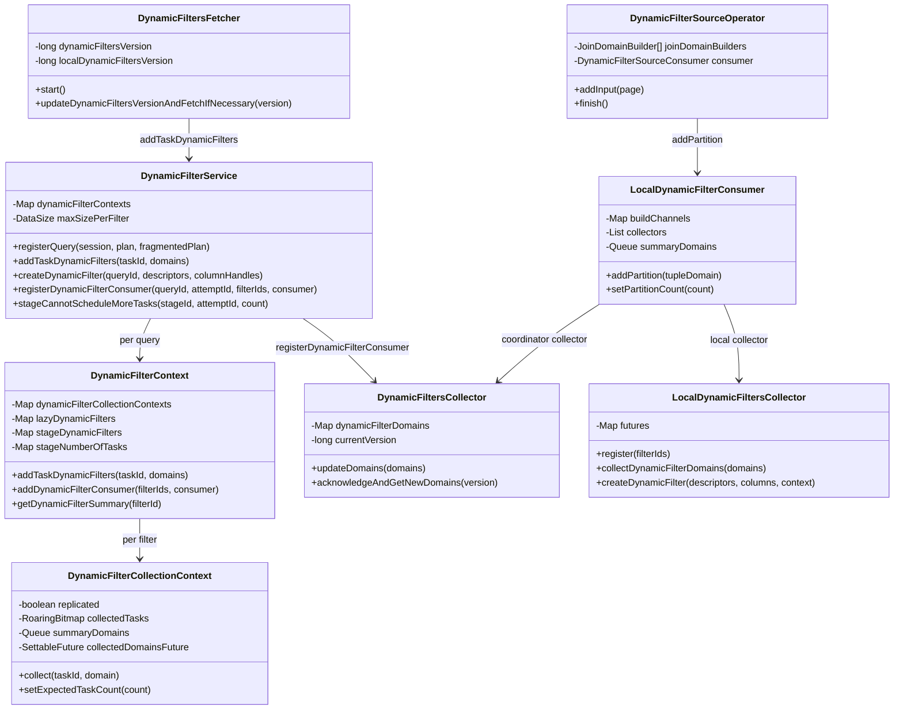
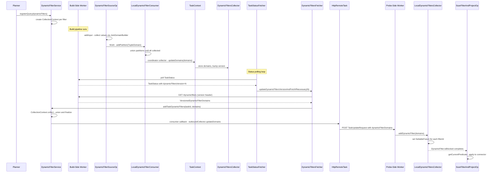

# Module Teardown: Dynamic Filter Coordination -- Control Plane (Task 4.1.C)

## Table of Contents

- [0. Research Focus](#0-research-focus)
- [1. High-Level Overview](#1-high-level-overview)
- [2. Structural Architecture](#2-structural-architecture)
  - [Class Diagram](#class-diagram)
- [3. Lifecycle Walkthrough](#3-lifecycle-walkthrough)
  - [Phase 1: Query Registration (Coordinator)](#phase-1-query-registration-coordinator)
  - [Phase 2: LocalExecutionPlanner Wiring (Worker)](#phase-2-localexecutionplanner-wiring-worker)
  - [Phase 3: Build-Side Value Collection (Worker -- DynamicFilterSourceOperator)](#phase-3-build-side-value-collection-worker-dynamicfiltersourceoperator)
  - [Phase 4: Partition Aggregation (Worker -- LocalDynamicFilterConsumer)](#phase-4-partition-aggregation-worker-localdynamicfilterconsumer)
  - [Phase 5: Outbound Transport to Coordinator (Worker to Coordinator)](#phase-5-outbound-transport-to-coordinator-worker-to-coordinator)
  - [Phase 6: Coordinator Aggregation (DynamicFilterService)](#phase-6-coordinator-aggregation-dynamicfilterservice)
  - [Phase 7: Broadcast to Scan-Side Workers (Coordinator to Worker)](#phase-7-broadcast-to-scan-side-workers-coordinator-to-worker)
  - [Phase 8: Scan-Side Filter Application](#phase-8-scan-side-filter-application)
  - [Sequence Diagram](#sequence-diagram)
- [4. Key Design Decisions and Trade-offs](#4-key-design-decisions-and-trade-offs)
  - [4.1 Two-Tier Collection: Local vs Coordinator](#41-two-tier-collection-local-vs-coordinator)
  - [4.2 Replicated vs Partitioned Collection](#42-replicated-vs-partitioned-collection)
  - [4.3 Size-Bounded Domain Collection](#43-size-bounded-domain-collection)
  - [4.4 Lazy Blocking for Split Generation](#44-lazy-blocking-for-split-generation)
  - [4.5 Versioned Incremental Updates](#45-versioned-incremental-updates)
  - [4.6 Domain Compaction Under Pressure](#46-domain-compaction-under-pressure)
- [5. Configuration Parameters](#5-configuration-parameters)
- [6. Rust Rewrite Considerations](#6-rust-rewrite-considerations)
  - [6.1 Domain Representation](#61-domain-representation)
  - [6.2 Coordinator Aggregation](#62-coordinator-aggregation)
  - [6.3 Build-Side Collection](#63-build-side-collection)
  - [6.4 Transport Protocol](#64-transport-protocol)
  - [6.5 Local vs Distributed Path](#65-local-vs-distributed-path)
  - [6.6 Deadlock Prevention](#66-deadlock-prevention)
- [7. Source Cross-Reference](#7-source-cross-reference)


## 0. Research Focus
* **Task ID:** 4.1.C
* **Focus:** Trace the full lifecycle of dynamic filter coordination between workers and the coordinator. How does a worker "collect" a filter from the build side of a join and send it to the coordinator? How does the coordinator aggregate partitioned filter domains and then "broadcast" the completed filter to scan-side workers so they can prune table scans at runtime?

## 1. High-Level Overview
* **Core Responsibility:** Dynamic filtering is Trino's mechanism for runtime predicate pushdown. When a hash join builds its hash table from the "build" side, the distinct values (or min/max range) of the join key columns are captured as a `Domain` predicate. This predicate is then propagated to the "probe" side table scans so that the connector can skip reading irrelevant splits, partitions, or row groups. The coordination layer in `DynamicFilterService` acts as the central aggregation point on the coordinator. It collects per-task filter domains from all build-side workers, unions them into a summary, and distributes the completed filter to scan-side workers. There are two distinct distribution paths: the coordinator-mediated path (inter-stage, via REST) and the task-local path (intra-stage, via in-memory futures).
* **Key Triggers:** (1) The planner identifies join equi-conditions that can produce dynamic filters and annotates the plan with `DynamicFilterId` entries. (2) During query registration, `DynamicFilterService.registerQuery()` creates per-filter collection contexts. (3) At runtime, `DynamicFilterSourceOperator` on the build side collects values into `JoinDomainBuilder` and delivers them via `LocalDynamicFilterConsumer`. (4) For coordinator-mediated filters, the domain flows through `TaskContext.updateDomains()` into a `DynamicFiltersCollector`, is picked up by `DynamicFiltersFetcher` via REST polling, and arrives at `DynamicFilterService.addTaskDynamicFilters()` on the coordinator. (5) The coordinator then pushes the completed domain to scan-side workers via `HttpRemoteTask.sendUpdate()`, where `TaskContext.addDynamicFilter()` propagates it to `LocalDynamicFiltersCollector`, which notifies the `DynamicFilter` interface used by `ScanFilterAndProjectOperator`.

## 2. Structural Architecture
* **Primary Source Files:**

| File | Lines | Role |
|------|-------|------|
| `DynamicFilterService.java` | 1052 | Coordinator-side aggregation, query registration, filter creation for connector scans |
| `DynamicFilterSourceOperator.java` | 348 | Build-side operator that collects join key values into Domain summaries |
| `JoinDomainBuilder.java` | 697 | Hash-set-based distinct value collector with min/max fallback |
| `LocalDynamicFilterConsumer.java` | 303 | Per-join filter consumer that unions partitions and dispatches to collectors |
| `DynamicFilterSourceConsumer.java` | 26 | Interface: addPartition, setPartitionCount, isDomainCollectionComplete |
| `DynamicFiltersCollector.java` | 142 | Versioned domain accumulator on the task context (outbound to coordinator) |
| `DynamicFiltersFetcher.java` | 275 | HTTP long-polling client that fetches new domains from worker tasks |
| `LocalDynamicFiltersCollector.java` | 210 | Per-task inbound filter storage with future-based notification for scans |
| `LocalExecutionPlanner.java` | 4272 | Wires DynamicFilterSourceOperator and DynamicFilter into the physical plan |
| `ScanFilterAndProjectOperator.java` | 474 | Probe-side table scan that applies dynamic filter predicates |
| `DynamicFilter.java` (SPI) | 84 | Connector-facing interface: isBlocked, getCurrentPredicate, isComplete |
| `DynamicFilterId.java` | 69 | Immutable string-based identity for a single dynamic filter |
| `DynamicFilterSourceNode.java` | 89 | Plan node representing a standalone dynamic filter source |
| `TaskResource.java` | ~350 | REST endpoint that receives dynamic filter domains and serves fetch requests |
| `HttpRemoteTask.java` | ~1300 | Coordinator-side remote task proxy that sends/receives dynamic filters |
| `DynamicFilterConfig.java` | 251 | Configuration: size limits, distinct value caps, row limits |
| `ContinuousTaskStatusFetcher.java` | ~270 | Status poller that detects dynamic filter version changes |
| `TaskStatus.java` | ~170 | Record carrying dynamicFiltersVersion for version-based polling |
| `TaskUpdateRequest.java` | 78 | Record carrying dynamicFilterDomains for coordinator-to-worker push |

* **Key Data Structures:**

**DynamicFilterService.DynamicFilterContext (per-query on coordinator):**

| Field | Type | Purpose |
|-------|------|---------|
| `dynamicFilters` | `Set of DynamicFilterId` | All dynamic filter IDs for this query |
| `replicatedDynamicFilters` | `Set of DynamicFilterId` | Filters from broadcast joins (single-task collection) |
| `lazyDynamicFilters` | `Map of DynamicFilterId to SettableFuture` | Futures that block scan-side splits until filter is ready |
| `dynamicFilterCollectionContexts` | `Map of DynamicFilterId to CollectionContext` | Per-filter aggregation state |
| `stageDynamicFilters` | `Map of StageId to Set of DynamicFilterId` | Tracks which stage produces which filters |
| `stageNumberOfTasks` | `Map of StageId to Integer` | Expected task count per stage (for completion detection) |
| `attemptId` | `int` | Current query attempt (for retry support) |

**DynamicFilterCollectionContext (per-filter on coordinator):**

| Field | Type | Purpose |
|-------|------|---------|
| `replicated` | `boolean` | If true, first task completes the filter immediately |
| `collectedTasks` | `RoaringBitmap` | Deduplicates partitioned task contributions |
| `summaryDomains` | `Queue of Domain` | Pending domains awaiting union |
| `expectedTaskCount` | `Integer` | Set when stage scheduling completes |
| `collectedTaskCount` | `int` | Number of tasks that have contributed |
| `collectedDomainsFuture` | `SettableFuture of Domain` | Completed when final summary is ready |
| `domainSizeLimitInBytes` | `long` | Max size before simplification or fallback to all() |

**DynamicFilterSourceOperator fields:**

| Field | Type | Purpose |
|-------|------|---------|
| `channels` | `List of Channel` | Each Channel maps filterId plus type plus column index |
| `joinDomainBuilders` | `JoinDomainBuilder[]` | One per channel, collects distinct values or min/max |
| `dynamicPredicateConsumer` | `DynamicFilterSourceConsumer` | Callback target (LocalDynamicFilterConsumer) |
| `minMaxCollectionLimit` | `int` | Row count threshold before disabling min/max collection |

**DynamicFiltersCollector (per-task outbound on worker):**

| Field | Type | Purpose |
|-------|------|---------|
| `dynamicFilterDomains` | `Map of DynamicFilterId to VersionedDomain` | Accumulated filter domains |
| `currentVersion` | `long` | Monotonically increasing version counter |
| `notifyTaskStatusChanged` | `Runnable` | Triggers task status version bump to notify coordinator |

### Class Diagram



## 3. Lifecycle Walkthrough

### Phase 1: Query Registration (Coordinator)

When a query is submitted and planning completes, `DynamicFilterService.registerQuery()` is called. This method scans the full logical plan to identify three categories of dynamic filters:

1. **Produced filters**: All `DynamicFilterId`s from `JoinNode.getDynamicFilters()`, `SemiJoinNode.getDynamicFilterId()`, and `DynamicFilterSourceNode.getDynamicFilters()`.
2. **Replicated filters**: Subset of produced filters where the build side uses broadcast distribution (`JoinUtils.isBuildSideReplicated()`). These only need a single task's contribution.
3. **Lazy filters**: Filters whose completion can block probe-side split generation. These are inter-stage filters (produced in one fragment, consumed in another) or replicated filters in source-distribution stages.

A `DynamicFilterContext` is created per query. For each filter ID, a `DynamicFilterCollectionContext` is created to manage the aggregation. For lazy filters, a `SettableFuture<Void>` is created and linked: when the collection context's `collectedDomainsFuture` completes, the lazy future is also set, unblocking probe-side scheduling.

### Phase 2: LocalExecutionPlanner Wiring (Worker)

When a worker's `LocalExecutionPlanner` compiles a plan fragment into physical operators, it encounters join nodes and table scans that reference dynamic filters.

**Build side (JoinNode or DynamicFilterSourceNode):**
The planner calls `createDynamicFilter()` which determines which filters are "local" (consumed within the same fragment) and which are "coordinator" (consumed in a different stage). It creates a `LocalDynamicFilterConsumer` with a list of collectors:
- For local filters: `taskContext::addDynamicFilter` (writes to `LocalDynamicFiltersCollector`)
- For coordinator filters: `taskContext::updateDomains` (writes to `DynamicFiltersCollector`)

The `LocalDynamicFilterConsumer` is then passed as the `DynamicFilterSourceConsumer` to `DynamicFilterSourceOperatorFactory`.

A key optimization: for replicated joins, only the task with `partitionId == 0` collects coordinator dynamic filters (see `getCoordinatorDynamicFilters()`). Other tasks skip collection entirely.

**Probe side (TableScanNode with filter expressions):**
The planner calls `getDynamicFilter()` which extracts `DynamicFilters.Descriptor` objects from the filter expression. It calls `registerCoordinatorDynamicFilters()` to register the consumed filter IDs with the `LocalDynamicFiltersCollector`. Then `createDynamicFilter()` on the collector produces a `TableSpecificDynamicFilter` that wraps `SettableFuture<Domain>` entries -- one per filter ID.

### Phase 3: Build-Side Value Collection (Worker -- DynamicFilterSourceOperator)

`DynamicFilterSourceOperator` is a pass-through operator that sits in the build-side pipeline, just before the `HashBuilderOperator`. As pages flow through:

1. **addInput(page)**: For each page, the operator extracts the relevant columns (from `channels`) and feeds each block into the corresponding `JoinDomainBuilder`.

2. **JoinDomainBuilder collection strategy**: The builder uses a Swiss-table-style hash set to collect distinct values. It has three collection modes:
   - **Distinct values**: Maintains a flat hash table of all unique values. This is the preferred mode for small build sides (broadcast joins). Falls back when `distinctSize` exceeds `maxDistinctValues` or `retainedSizeInBytes` exceeds `maxFilterSizeInBytes`.
   - **Min/max range**: When distinct collection overflows, extracts the minimum and maximum values from the hash set and switches to tracking only min/max per block. Skipped for REAL, DOUBLE, and NUMBER types to avoid NaN issues.
   - **All (no filter)**: When min/max collection is disabled or the `minMaxCollectionLimit` row threshold is exceeded, the operator calls `finishDomainCollectionIfNecessary()` which sends `TupleDomain.all()` (meaning "no filtering possible").

3. **finish()**: When the operator finishes (no more input), it calls `joinDomainBuilder.build()` on each channel to produce a `Domain`, then packages them into a `TupleDomain<DynamicFilterId>` and calls `dynamicPredicateConsumer.addPartition()`.

4. **PassthroughDynamicFilterSourceOperator**: If `isDomainCollectionComplete()` is already true when the factory creates an operator (e.g., an earlier partition already sent `all()`), a lightweight passthrough operator is created instead, avoiding collection overhead.

### Phase 4: Partition Aggregation (Worker -- LocalDynamicFilterConsumer)

`LocalDynamicFilterConsumer` receives `addPartition()` calls from multiple `DynamicFilterSourceOperator` instances (one per driver). It must union all partitions and deliver the result once all are collected.

**Concurrency strategy**: The union of `TupleDomain` objects is expensive. To avoid blocking multiple task executor threads:

1. Each partition's domain is added to a `ConcurrentLinkedQueue` (`summaryDomains`), with its size tracked in `summaryDomainsRetainedSizeInBytes`.
2. `unionSummaryDomainsIfNecessary(false)` is called outside the lock. If the total retained size exceeds `domainSizeLimitInBytes`, it drains the queue and performs a `columnWiseUnion()`. If the result is still too large, it calls `simplify(1)` to reduce domain complexity.
3. Inside a `synchronized` block, the consumer increments `collectedPartitionCount` and checks if all partitions have arrived (`expectedPartitionCount` is set by `noMoreOperators()` on the factory).
4. When all partitions are collected (or size limit is exceeded or `domain.isAll()`), the result is finalized and delivered to all `collectors`.

The `setPartitionCount()` method handles the race where all partitions arrive before the factory calls `noMoreOperators()`: it performs the final compaction and delivers immediately.

### Phase 5: Outbound Transport to Coordinator (Worker to Coordinator)

For coordinator-mediated filters, the domain flows through this path:

1. **TaskContext.updateDomains()** stores the domain in a `DynamicFiltersCollector` (distinct from the `LocalDynamicFiltersCollector`). The collector assigns a monotonically increasing version number and calls `notifyStatusChanged` (which bumps the task status version).

2. **TaskStatus.dynamicFiltersVersion**: The task's status includes a `dynamicFiltersVersion` field. When the coordinator's `ContinuousTaskStatusFetcher` polls the worker and detects a higher `dynamicFiltersVersion`, it calls `DynamicFiltersFetcher.updateDynamicFiltersVersionAndFetchIfNecessary()`.

3. **DynamicFiltersFetcher**: Issues an HTTP GET to `{taskUri}/dynamicfilters` with the `TRINO_CURRENT_VERSION` header set to `localDynamicFiltersVersion`. On the worker, `TaskResource.acknowledgeAndGetNewDynamicFilterDomains()` delegates to `SqlTaskManager`, which calls `DynamicFiltersCollector.acknowledgeAndGetNewDomains()`. This returns all domains with version greater than the caller's version and removes acknowledged entries.

4. **DynamicFiltersFetcher.updateDynamicFilterDomains()**: Upon receiving the response, the fetcher calls `DynamicFilterService.addTaskDynamicFilters(taskId, domains)`. This is the handoff to the coordinator's aggregation layer.

### Phase 6: Coordinator Aggregation (DynamicFilterService)

`DynamicFilterService.addTaskDynamicFilters()` dispatches each `(DynamicFilterId, Domain)` pair to the appropriate `DynamicFilterCollectionContext.collect()`. The collection differs by filter type:

**Replicated filters** (`collectReplicated`):
- The first task to report completes the filter immediately.
- If the domain exceeds `domainSizeLimitInBytes`, it is simplified. If still too large, it falls back to `Domain.all()`.
- Sets `collected = true` and completes `collectedDomainsFuture`.

**Partitioned filters** (`collectPartitioned`):
- Uses a `RoaringBitmap` (`collectedTasks`) to deduplicate by `taskId.partitionId()`.
- Adds the domain to `summaryDomains` queue and tracks retained size.
- Calls `unionSummaryDomainsIfNecessary(false)` for incremental compaction.
- Inside `synchronized`: checks if `expectedTaskCount == collectedTaskCount`.
- When all tasks have reported (or size limit exceeded), finalizes the summary and completes `collectedDomainsFuture`.

**Expected task count**: Set by `stageCannotScheduleMoreTasks()` which the scheduler calls when it knows no more tasks will be added to a stage. This calls `updateExpectedTaskCount()` which may trigger completion for filters that have already received all contributions.

### Phase 7: Broadcast to Scan-Side Workers (Coordinator to Worker)

There are two distribution mechanisms:

**Path A: Lazy filter futures (for split scheduling)**

When a lazy filter's `collectedDomainsFuture` completes, it sets the corresponding `SettableFuture<Void>` in `lazyDynamicFilters`. The coordinator's `DynamicFilter.isBlocked()` implementation (inside `createDynamicFilter()`) waits on these futures. Until they complete, the coordinator can block split generation for the probe-side stage, avoiding unnecessary I/O. Once unblocked, `getCurrentPredicate()` reads the completed summaries and translates them to `TupleDomain<ColumnHandle>`.

**Path B: Push via HttpRemoteTask (for worker-side scan operators)**

When `DynamicFilterCollectionContext.collectedDomainsFuture` completes, any registered consumer callbacks fire. For outbound (probe-side) workers:

1. During `HttpRemoteTask` construction, `DynamicFilterService.registerDynamicFilterConsumer()` is called with the set of "outbound" dynamic filter IDs (filters consumed in this task's fragment but produced in a different stage). The consumer callback is `outboundDynamicFiltersCollector::updateDomains`.

2. `DynamicFiltersCollector.updateDomains()` stores the domain and calls `triggerUpdate()` on the `HttpRemoteTask`.

3. On the next `sendUpdate()` cycle, `outboundDynamicFiltersCollector.acknowledgeAndGetNewDomains()` retrieves pending domains. They are included in the `TaskUpdateRequest.dynamicFilterDomains` field and POSTed to the worker's `TaskResource.createOrUpdateTask()`.

4. On the worker, `SqlTask.updateTask()` calls `taskExecution.getTaskContext().addDynamicFilter(dynamicFilterDomains)`.

5. `TaskContext.addDynamicFilter()` calls `LocalDynamicFiltersCollector.collectDynamicFilterDomains()`, which sets the `SettableFuture<Domain>` for each filter ID.

6. The `TableSpecificDynamicFilter` (created during planning) receives the domain via its future callback. It intersects the new domain into `currentPredicate` and completes the current `isBlocked` future, allowing `ScanFilterAndProjectOperator` to proceed.

### Phase 8: Scan-Side Filter Application

`ScanFilterAndProjectOperator` holds a `DynamicFilter` reference. The filter is used at two levels:

1. **Split-level**: In `SplitToPages.process()`, `dynamicFilter.getCurrentPredicate()` is checked. If it is not `all()`, the `dynamicFilterSplitsProcessed` counter increments. The dynamic filter is passed to `pageSourceProvider.createPageSource()`, allowing the connector to perform predicate pushdown (e.g., skip Parquet row groups, prune Hive partitions).

2. **Row-level**: When `isEnableDynamicRowFiltering` is enabled, the `PageProcessor` incorporates the dynamic filter predicate to filter individual rows within pages that have already been read.

The `isBlocked()` method on the dynamic filter allows the scan operator to yield (via the `WorkProcessor` chain) until a filter becomes available, preventing premature data reading.

### Sequence Diagram



## 4. Key Design Decisions and Trade-offs

### 4.1 Two-Tier Collection: Local vs Coordinator

Dynamic filters that are produced and consumed within the same plan fragment use the **local path** (in-memory futures via `LocalDynamicFiltersCollector`). Filters that cross stage boundaries use the **coordinator path** (REST-based via `DynamicFilterService`). This avoids unnecessary network round-trips for co-located joins while still supporting the distributed case.

**Rust implication:** In a Rust rewrite, the local path maps naturally to `tokio::sync::watch` or `tokio::sync::oneshot` channels. The coordinator path requires an HTTP-based protocol.

### 4.2 Replicated vs Partitioned Collection

For broadcast (replicated) joins, every worker has a complete copy of the build side. Only one task (partitionId == 0) needs to report, and the filter completes immediately. For partitioned joins, all tasks must report, and their domains are unioned.

**Rust implication:** The `RoaringBitmap` deduplication and concurrent union strategy needs careful lock-free design. Consider using `crossbeam::queue::SegQueue` for the domain queue.

### 4.3 Size-Bounded Domain Collection

Collection has three tiers:
1. **Distinct values** (best): Exact set of join key values. Limited by `maxDistinctValues` (default 50,000) and `maxFilterSize` (default 4MB per driver).
2. **Min/max range** (good): When distinct overflows, tracks only the range. Limited by `minMaxCollectionLimit`.
3. **Domain.all()** (no filter): When all collection fails, the filter is effectively disabled.

This graceful degradation prevents memory exhaustion. The `JoinDomainBuilder` uses a Swiss-table hash set for efficient distinct value tracking.

### 4.4 Lazy Blocking for Split Generation

Lazy dynamic filters block probe-side split generation on the coordinator until the filter is ready. This prevents the connector from generating splits for partitions that would be immediately filtered out. The `isCollectingTaskNeeded()` method creates an extra task for source-distribution stages to ensure dynamic filter collection can proceed even before any probe splits are scheduled (avoiding deadlock).

### 4.5 Versioned Incremental Updates

The `DynamicFiltersCollector` uses versioning to enable incremental updates. The coordinator only fetches domains newer than its last-seen version. The `acknowledge()` method removes already-transmitted domains, keeping memory bounded. This is triggered by `TaskStatus.dynamicFiltersVersion` changes detected during normal status polling.

### 4.6 Domain Compaction Under Pressure

Both `LocalDynamicFilterConsumer` and `DynamicFilterCollectionContext` use a lazy compaction strategy: individual domains accumulate in a lock-free queue, and `unionSummaryDomainsIfNecessary()` is called outside the lock when the total size exceeds the limit. If the union result is still too large, `domain.simplify(1)` reduces it to a single range. This avoids holding locks during expensive union operations.

## 5. Configuration Parameters

| Parameter | Default | Purpose |
|-----------|---------|---------|
| `enable-dynamic-filtering` | `true` | Global enable/disable |
| `enable-dynamic-row-filtering` | `true` | Row-level filtering within pages |
| `dynamic-row-filtering.selectivity-threshold` | `0.7` | Disable row filtering when selectivity is too low |
| `dynamic-filtering.max-distinct-values-per-driver` | `50,000` | Distinct value cap for broadcast joins |
| `dynamic-filtering.max-size-per-driver` | `4 MB` | Size cap per driver for broadcast joins |
| `dynamic-filtering.range-row-limit-per-driver` | `100,000` | Row limit for min/max collection |
| `dynamic-filtering.max-size-per-operator` | `5 MB` | Size limit for LocalDynamicFilterConsumer union |
| `dynamic-filtering.max-size-per-filter` | `10 MB` | Size limit for coordinator-side per-filter collection |
| `dynamic-filtering.partitioned.max-distinct-values-per-driver` | `20,000` | Lower cap for partitioned joins |
| `dynamic-filtering.partitioned.max-size-per-driver` | `200 KB` | Lower size cap for partitioned joins |
| `dynamic-filtering.partitioned.range-row-limit-per-driver` | `30,000` | Lower row limit for partitioned joins |
| `dynamic-filtering.partitioned.max-size-per-operator` | `5 MB` | Size limit for partitioned join union |

Note: The planner multiplies per-driver limits by `taskConcurrency` when the build side has a single task (broadcast join), effectively allowing the operator to use the full task's allocation.

## 6. Rust Rewrite Considerations

### 6.1 Domain Representation
The `TupleDomain` and `Domain` types are central to this subsystem. They represent column-level predicates as sorted ranges or discrete values. In Rust, consider an enum:
```
enum DomainKind {
    None,
    All,
    Ranges(SortedRangeSet),    // for min/max or complex predicates
    DiscreteValues(HashSet),    // for exact value lists
}
```

### 6.2 Coordinator Aggregation
The `DynamicFilterCollectionContext` pattern maps to a `tokio::sync::watch` or `Arc<Mutex<...>>` with a `Notify`. The `SettableFuture<Domain>` pattern maps to `tokio::sync::oneshot::Sender/Receiver`. The versioned incremental update pattern in `DynamicFiltersCollector` maps naturally to a version counter plus a `BTreeMap<Version, (FilterId, Domain)>`.

### 6.3 Build-Side Collection
`JoinDomainBuilder`'s Swiss-table hash set could use `hashbrown::HashSet` with a custom hasher. The flat memory layout (fixed-size records plus variable-width data) could be replaced with Rust's native `Vec<u8>` backing, but the type-operator-based hash/compare would need to be replaced with trait-based dispatch.

### 6.4 Transport Protocol
The REST-based fetch/push can be replaced with gRPC streaming or a custom binary protocol. Key requirements:
- Version-based incremental delivery (avoid re-sending completed filters)
- Efficient serialization of `Domain` predicates (avoid JSON overhead)
- Backpressure-aware (don't flood workers with filter updates)

### 6.5 Local vs Distributed Path
The clean separation between local (intra-task futures) and distributed (HTTP) paths is a good pattern to preserve. In Rust, the local path can use `Arc<RwLock<Option<Domain>>>` with `tokio::sync::Notify`, while the distributed path uses the RPC mechanism.

### 6.6 Deadlock Prevention
The "collecting task" mechanism (`isCollectingTaskNeeded`) that creates an extra task for source stages to prevent deadlock between dynamic filter collection and split generation is an important subtlety. The Rust scheduler must replicate this: if a source stage has a replicated join that produces lazy dynamic filters, an initial task must be scheduled before any probe splits are available.

## 7. Source Cross-Reference

| Concept | Primary File | Key Method |
|---------|-------------|------------|
| Query registration | `DynamicFilterService.java` | `registerQuery()` L119-137 |
| Per-filter collection context | `DynamicFilterService.java` | `DynamicFilterCollectionContext` L660-878 |
| Replicated filter collection | `DynamicFilterService.java` | `collectReplicated()` L700-719 |
| Partitioned filter collection | `DynamicFilterService.java` | `collectPartitioned()` L721-787 |
| Coordinator DynamicFilter creation | `DynamicFilterService.java` | `createDynamicFilter()` L261-352 |
| Consumer registration | `DynamicFilterService.java` | `registerDynamicFilterConsumer()` L354-368 |
| Task domain ingestion | `DynamicFilterService.java` | `addTaskDynamicFilters()` L370-384 |
| Lazy filter identification | `DynamicFilterService.java` | `getLazyDynamicFilters()` L442-449 |
| Build-side value collection | `DynamicFilterSourceOperator.java` | `addInput()` L207-237 |
| Domain construction from values | `DynamicFilterSourceOperator.java` | `finish()` L249-268 |
| Passthrough optimization | `DynamicFilterSourceOperator.java` | `createOperator()` L89-106 |
| Distinct value hash set | `JoinDomainBuilder.java` | `add(Block)` L162-266 |
| Domain build from collected | `JoinDomainBuilder.java` | `build()` L281-307 |
| Partition union strategy | `LocalDynamicFilterConsumer.java` | `addPartition()` L79-145 |
| Join-to-consumer wiring | `LocalExecutionPlanner.java` | `createDynamicFilter()` L3170-3201 |
| Coordinator filter selection | `LocalExecutionPlanner.java` | `getCoordinatorDynamicFilters()` L3308-3316 |
| Scan-side DynamicFilter wiring | `LocalExecutionPlanner.java` | `getDynamicFilter()` L2218-2235 |
| Outbound domain versioning | `DynamicFiltersCollector.java` | `updateDomains()` L48-67 |
| Incremental acknowledgment | `DynamicFiltersCollector.java` | `acknowledgeAndGetNewDomains()` L74-79 |
| REST fetch from worker | `DynamicFiltersFetcher.java` | `fetchDynamicFiltersIfNecessary()` L135-170 |
| Domain delivery to service | `DynamicFiltersFetcher.java` | `updateDynamicFilterDomains()` L252-269 |
| Version-triggered fetch | `ContinuousTaskStatusFetcher.java` | L255 |
| Inbound filter storage | `LocalDynamicFiltersCollector.java` | `collectDynamicFilterDomains()` L76-87 |
| Table-specific DF creation | `LocalDynamicFiltersCollector.java` | `createDynamicFilter()` L90-139 |
| Future-based notification | `LocalDynamicFiltersCollector.java` | `TableSpecificDynamicFilter.update()` L165-178 |
| Scan filter application | `ScanFilterAndProjectOperator.java` | `SplitToPages.process()` L236-259 |
| REST fetch endpoint | `TaskResource.java` | `acknowledgeAndGetNewDynamicFilterDomains()` L277-293 |
| Push via task update | `HttpRemoteTask.java` | `sendUpdate()` L767-779 |
| Outbound collector wiring | `HttpRemoteTask.java` | constructor L391-396 |
| SPI interface | `DynamicFilter.java` | `getCurrentPredicate()`, `isBlocked()`, `isComplete()` |
| Configuration | `DynamicFilterConfig.java` | all config properties L59-251 |
