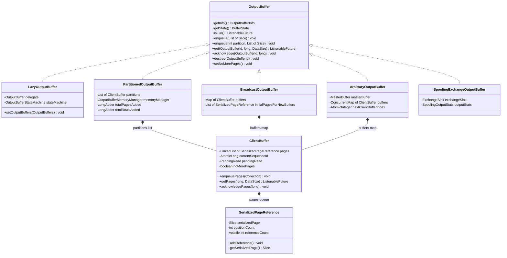
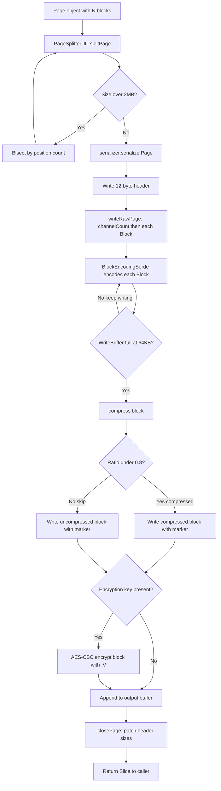
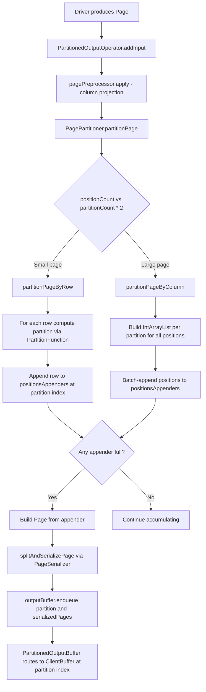
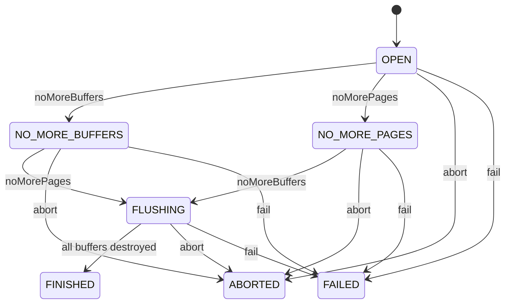

# Module Teardown: Result Buffering -- The Server Side Data Plane (Task 4.2.A)

## Table of Contents

- [0. Research Focus](#0-research-focus)
- [1. High-Level Overview](#1-high-level-overview)
- [2. Structural Architecture](#2-structural-architecture)
  - [Class Diagram](#class-diagram)
- [3. Behavioral Analysis](#3-behavioral-analysis)
  - [3.1 The Serialization Pipeline: Page to Wire Format](#31-the-serialization-pipeline-page-to-wire-format)
  - [3.2 The Wire Format Layout](#32-the-wire-format-layout)
  - [3.3 Hash Partitioning: How Rows Are Routed to Downstream Workers](#33-hash-partitioning-how-rows-are-routed-to-downstream-workers)
  - [3.4 The Four Buffer Distribution Strategies](#34-the-four-buffer-distribution-strategies)
  - [3.5 Reference Counting and Memory Management](#35-reference-counting-and-memory-management)
  - [3.6 Back-Pressure and Memory Control](#36-back-pressure-and-memory-control)
  - [3.7 The Consumer Pull Path](#37-the-consumer-pull-path)
  - [3.8 Buffer State Machine](#38-buffer-state-machine)
- [4. Key Mechanisms Deep-Dive](#4-key-mechanisms-deep-dive)
  - [4.1 The Compression Pipeline Architecture](#41-the-compression-pipeline-architecture)
  - [4.2 The Lazy Buffer Initialization Pattern](#42-the-lazy-buffer-initialization-pattern)
  - [4.3 PagePartitioner Pool and Reuse](#43-pagepartitioner-pool-and-reuse)
  - [4.4 Data Integrity via Checksum](#44-data-integrity-via-checksum)
- [5. Rust Rewrite Considerations](#5-rust-rewrite-considerations)
  - [5.1 Serialization Format](#51-serialization-format)
  - [5.2 Reference Counting vs Ownership](#52-reference-counting-vs-ownership)
  - [5.3 Buffer Back-Pressure](#53-buffer-back-pressure)
  - [5.4 Lock Granularity](#54-lock-granularity)
  - [5.5 PagePartitioner Strategy Selection](#55-pagepartitioner-strategy-selection)
  - [5.6 Page Splitting](#56-page-splitting)
- [6. Source Cross-Reference](#6-source-cross-reference)
- [7. Summary](#7-summary)


## 0. Research Focus
* **Task ID:** 4.2.A
* **Focus:** How are `Page` objects serialized into the wire format? Trace the logic in `PartitionedOutputBuffer` that hashes rows to decide which downstream worker gets which data. Follow the full path from a Driver's output page through serialization, partitioning, buffering, and delivery to downstream consumers.

## 1. High-Level Overview
* **Core Responsibility:** The result buffering subsystem is Trino's server-side data plane -- the mechanism by which a producing task serializes, optionally compresses/encrypts, partitions, and buffers output pages for downstream consumption. It sits between the operator pipeline (which produces `Page` objects) and the HTTP layer (which serves serialized data to downstream workers or the client). The system is pull-based: producers push pages into output buffers, and downstream consumers pull data via long-polling HTTP GET requests.
* **Key Triggers:** A Driver finishes processing a page through its operator pipeline. The final operator (either `TaskOutputOperator` for unpartitioned output or `PartitionedOutputOperator` for hash-partitioned output) serializes the page and enqueues the resulting `Slice` bytes into the appropriate `OutputBuffer`. Downstream workers (or the client coordinator) then fetch buffered pages by issuing HTTP requests that resolve to `OutputBuffer.get()`.

## 2. Structural Architecture
* **Primary Source Files:**
  - `io.trino.execution.buffer.OutputBuffer` -- the central interface that all buffer types implement
  - `io.trino.execution.buffer.PartitionedOutputBuffer` -- hash-partitioned buffer with fixed partition-to-ClientBuffer mapping
  - `io.trino.execution.buffer.BroadcastOutputBuffer` -- replicates every page to every consumer
  - `io.trino.execution.buffer.ArbitraryOutputBuffer` -- round-robin distribution via MasterBuffer
  - `io.trino.execution.buffer.SpoolingExchangeOutputBuffer` -- writes to external ExchangeSink (e.g. disk/S3)
  - `io.trino.execution.buffer.LazyOutputBuffer` -- proxy that defers real buffer creation until OutputBuffers config arrives
  - `io.trino.execution.buffer.ClientBuffer` -- per-consumer FIFO queue with sequence-id-based acknowledgement
  - `io.trino.execution.buffer.SerializedPageReference` -- reference-counted wrapper around a serialized page Slice
  - `io.trino.execution.buffer.CompressingEncryptingPageSerializer` -- serializes Page to compressed/encrypted Slice
  - `io.trino.execution.buffer.CompressingDecryptingPageDeserializer` -- deserializes Slice back to Page
  - `io.trino.execution.buffer.PagesSerdeFactory` -- factory that creates serializer/deserializer with codec and key
  - `io.trino.execution.buffer.PagesSerdeUtil` -- header constants, writeRawPage/readRawPage, checksum utilities
  - `io.trino.execution.buffer.PageSplitterUtil` -- splits oversized pages before serialization
  - `io.trino.execution.buffer.OutputBufferStateMachine` -- state transitions (OPEN to FINISHED/ABORTED/FAILED)
  - `io.trino.execution.buffer.OutputBufferMemoryManager` -- back-pressure via memory limits and SettableFuture blocking
  - `io.trino.operator.output.PartitionedOutputOperator` -- the Operator that drives hash-partitioned output
  - `io.trino.operator.output.PagePartitioner` -- hashes rows and appends them to per-partition page builders
  - `io.trino.operator.output.TaskOutputOperator` -- the Operator for unpartitioned (broadcast/arbitrary) output
  - `io.trino.operator.PartitionFunction` -- interface for computing partition from a row

* **Key Data Structures:**

| Structure | Type | Purpose |
|-----------|------|---------|
| `SerializedPageReference` | Class | Reference-counted Slice wrapper. Multiple ClientBuffers can share the same serialized page without copying. Atomic refcount via `AtomicIntegerFieldUpdater`. |
| `ClientBuffer.pages` | `LinkedList of SerializedPageReference` | Per-consumer FIFO queue. Pages are assigned monotonically increasing sequence IDs starting from 0. |
| `ClientBuffer.PendingRead` | Inner class | Holds a `SettableFuture of BufferResult` for long-polling. When a consumer requests data and none is available, the future is parked until pages arrive. |
| `BufferResult` | Record | Response payload: `(taskInstanceId, token, nextToken, bufferComplete, List of Slice)`. The `token` is the sequence ID of the first page, `nextToken` is the acknowledgement marker. |
| `WriteBuffer` | Inner class in serializer | Growable byte buffer backed by a Slice. Used as staging area during page serialization. |
| `ReadBuffer` | Inner class in deserializer | Bounded byte buffer with position/limit tracking. Supports rollOver() for block-boundary reads. |
| Serialized Page Header | 12 bytes | `[positionCount:i32][uncompressedSize:i32][compressedSize:i32]` at offsets 0, 4, 8. |

### Class Diagram


## 3. Behavioral Analysis

### 3.1 The Serialization Pipeline: Page to Wire Format

The serialization of a `Page` into the binary wire format follows a multi-stage pipeline inside `CompressingEncryptingPageSerializer`.

**Step 1 -- Page Splitting.** Before serialization, `PageSplitterUtil.splitAndSerializePage()` recursively splits any page larger than 2 MB (the `PAGE_SPLIT_THRESHOLD_IN_BYTES`). It bisects the page by position count and recurses until each fragment is under the threshold. This prevents any single serialized page from consuming excessive memory and ensures that the network layer transmits data in manageable chunks. Importantly, for RLE-encoded blocks, it uses the underlying value block size (not the logical expanded size) to avoid unnecessary splitting of compact representations.

**Step 2 -- Header Allocation.** `SerializedPageOutput.startPage()` allocates the output `WriteBuffer` with capacity estimated at `sizeInBytes * 1.2 + HEADER_SIZE`. The 12-byte header is partially written: `positionCount` is written immediately, but `uncompressedSize` and `compressedSize` slots are reserved (written later in `closePage()`).

**Step 3 -- Block-by-Block Raw Writing.** `PagesSerdeUtil.writeRawPage()` writes the channel count, then iterates over each `Block` in the page, delegating to `BlockSerdeUtil.writeBlock()` which uses the `BlockEncodingSerde` to encode each block in its type-specific binary format. All bytes flow into the first `WriteBuffer` (buffers[0]).

**Step 4 -- Block-Level Compression.** When the first WriteBuffer fills (reaches its 64 KB default block size), `compress()` is called. The compressor (LZ4 or ZSTD) attempts to compress the block. A minimum compression ratio of 0.8 (20% savings) is enforced -- if the compressed output is not at least 20% smaller, the uncompressed data is used instead. Each block is prefixed with a 4-byte marker: `blockSize OR 0x80000000` if compressed, or just `blockSize` if not. This per-block approach means a single serialized page contains multiple independently compressed blocks.

**Step 5 -- Block-Level Encryption.** If an encryption key is configured, each block (post-compression) is encrypted using AES/CBC/PKCS5Padding. The encrypted block is prefixed with `[encryptedSize:i32][iv:16bytes][ciphertext]`. A fresh IV is generated per block by `Cipher.init(ENCRYPT_MODE, key)`.

**Step 6 -- Page Finalization.** `closePage()` flushes any remaining data through the compression and encryption pipelines, then patches the header with the final `uncompressedSize` and `compressedSize`. If the actual serialized data occupies less than half the allocated buffer, a compact copy is made to avoid wasting memory.



### 3.2 The Wire Format Layout

The serialized page is a contiguous `Slice` with the following structure:

```
Offset 0:  [positionCount:i32]         -- number of rows in this page
Offset 4:  [uncompressedSize:i32]      -- total uncompressed payload size
Offset 8:  [compressedSize:i32]        -- total compressed payload size
Offset 12: [block0][block1]...[blockN] -- compressed/encrypted data blocks
```

Each data block within the payload (when compression is enabled):
```
[blockMarker:i32]  -- size with high bit set if compressed
[blockData:bytes]  -- compressed or raw bytes (depending on marker)
```

When encryption is additionally enabled, each encrypted block:
```
[encryptedSize:i32]       -- length of ciphertext
[iv:16bytes]              -- AES initialization vector
[ciphertext:bytes]        -- AES-CBC encrypted data
```

The `SERIALIZED_PAGE_COMPRESSED_BLOCK_MASK` is `0x80000000` (the sign bit of an int). To read a block marker: `size = marker AND NOT 0x80000000`, `isCompressed = (marker AND 0x80000000) != 0`.

### 3.3 Hash Partitioning: How Rows Are Routed to Downstream Workers

Hash partitioning is the most complex buffer distribution mode. It involves three layers:

**Layer 1: PartitionedOutputOperator.** This is the terminal Operator in a pipeline that requires partitioned output. On `addInput(page)`, it delegates to `pagePartitioner.partitionPage(page, operatorContext)`. It blocks (via `isBlocked()`) when the underlying `OutputBuffer` signals back-pressure through `isFull()`.

**Layer 2: PagePartitioner.** This class does the actual row-to-partition assignment. It contains:
- A `PartitionFunction` that computes `partition = f(hashColumns, position)` in range `[0, partitionCount)`
- Per-partition `PositionsAppenderPageBuilder` arrays that accumulate rows until full
- A `PageSerializer` for converting built pages to Slices

The partitioning uses two strategies based on page size:

**Row-wise strategy** (used when `positionCount < partitionCount * 2`): For each row, compute the partition and append that single row to the corresponding partition builder. This avoids the overhead of building position lists when partitions will have very few rows.

**Column-wise strategy** (used for larger pages): First, compute partition assignments for all positions into `IntArrayList[]` arrays. Then, for each partition, batch-append all its positions at once. This is more cache-friendly for large pages because it processes each Block column only once.

Special cases handled:
- **Null channel routing:** If the null channel is set and a row's null-channel value is null, the row is sent to ALL partitions (used for outer joins).
- **replicatesAnyRow:** For INSERT operations, the first row is sent to all partitions to ensure at least one row reaches every output partition.
- **RLE optimization:** When all partition function arguments are RLE blocks (constant), the partition is computed once and all positions go to the same partition.
- **Skew rebalancing:** `SkewedPartitionRebalancer` can dynamically remap logical partitions to physical partitions to handle data skew in scale-out writes.

**Layer 3: Enqueueing into OutputBuffer.** Once a per-partition `PositionsAppenderPageBuilder` is full (or force-flushed), the built `Page` is serialized via `splitAndSerializePage()` and then `outputBuffer.enqueue(partition, serializedPages)` routes it to the correct `ClientBuffer` in the `PartitionedOutputBuffer`.



### 3.4 The Four Buffer Distribution Strategies

**PartitionedOutputBuffer:** Created with a fixed, final set of `ClientBuffer` instances (one per partition). The `enqueue(int partitionNumber, List<Slice> pages)` method directly indexes into `partitions.get(partitionNumber)`. The buffer count is known at creation time and never changes. This is the mode used for hash-based shuffles (JOIN, GROUP BY).

**BroadcastOutputBuffer:** Every page goes to every consumer. On `enqueue()`, the buffer stores an initial reference copy in `initialPagesForNewBuffers` (for consumers that join late), then calls `partition.enqueuePages()` on every existing `ClientBuffer`. Each buffer increments the `SerializedPageReference` refcount, so the actual Slice bytes are shared. This is used for broadcast joins and the coordinator-to-client output.

**ArbitraryOutputBuffer:** A round-robin distribution for repartitioning. Pages go into a central `MasterBuffer` (a `LinkedList` of `SerializedPageReference`). When consumers call `get()`, they pass the `MasterBuffer` as a `PagesSupplier` to their `ClientBuffer`, which lazily pulls pages from the master. The `nextClientBufferIndex` ensures fair round-robin across consumers.

**SpoolingExchangeOutputBuffer:** Writes serialized pages to an external `ExchangeSink` (e.g., disk-based or S3-based spooling). Does not use `ClientBuffer` at all -- the `get()/acknowledge()/destroy()` per-buffer operations throw `UnsupportedOperationException`. This mode decouples producer and consumer lifecycles entirely.

### 3.5 Reference Counting and Memory Management

The `SerializedPageReference` uses `AtomicIntegerFieldUpdater` for lock-free reference counting. The lifecycle:

1. **Creation:** `new SerializedPageReference(slice, positionCount, initialRefCount=1)`. The initial reference belongs to the enqueuing code.
2. **Sharing:** Each `ClientBuffer` that receives the page calls `addReference()`, incrementing the count.
3. **Drop initial reference:** After enqueueing to all relevant ClientBuffers, `dereferencePages()` drops the initial reference.
4. **Consumer acknowledgement:** When a consumer calls `acknowledgePages(sequenceId)`, the acknowledged pages are removed from the ClientBuffer's queue. Each removal calls `dereferencePage()`.
5. **Final release:** When the refcount reaches 0, the page is truly freed. The `PagesReleasedListener` callback fires, which calls `memoryManager.updateMemoryUsage(-releasedBytes)`.

This scheme is critical for BroadcastOutputBuffer where a single serialized page Slice may be shared across dozens of consumers without copying.

### 3.6 Back-Pressure and Memory Control

`OutputBufferMemoryManager` enforces a configurable `maxBufferedBytes` limit. The flow:

1. When pages are enqueued, `updateMemoryUsage(+bytesAdded)` is called.
2. If `bufferedBytes > maxBufferedBytes` and `blockOnFull` is true, `getBufferBlockedFuture()` returns an uncompleted `SettableFuture`.
3. The producing Operator calls `outputBuffer.isFull()`. If the future is not done, the Driver yields (stops calling `addInput`).
4. When consumers acknowledge pages and memory drops below the threshold, `onMemoryAvailable()` completes the future, unblocking the producer.
5. Additionally, memory accounting integrates with Trino's memory pool system via `LocalMemoryContext.setBytes()`, which can also block if the memory pool is exhausted.

The BroadcastOutputBuffer has a special overutilization threshold at 50% (not 100% like others). This is because broadcast data must be buffered for all consumers, so it signals `notifyStatusChanged` early to tell the coordinator to stop adding new buffers.

### 3.7 The Consumer Pull Path

When a downstream worker requests data:

1. HTTP GET arrives at the task, which calls `outputBuffer.get(bufferId, sequenceId, maxSize)`.
2. `ClientBuffer.getPages()` first acknowledges pages up to `sequenceId` (dropping old pages and releasing refcounts).
3. If data is available, it immediately returns a `BufferResult` with up to `maxSize` bytes of serialized pages.
4. If no data is available and `noMorePages` is not set, a `PendingRead` is created with a `SettableFuture`. The HTTP handler holds this future open (long-polling).
5. When new pages are enqueued, `ClientBuffer.enqueuePages()` captures the `pendingRead` field and calls `processRead()` which fills the future with data.
6. The consumer receives pages with a `nextToken` that it will pass as the `sequenceId` in its next request, acknowledging receipt.

### 3.8 Buffer State Machine



The state machine governs page and buffer additions. `canAddPages()` is true only in OPEN and NO_MORE_BUFFERS. `canAddBuffers()` is true only in OPEN and NO_MORE_PAGES. Terminal states (FINISHED, ABORTED, FAILED) are irreversible. FLUSHING is reached when both noMorePages and noMoreBuffers have been signaled -- the buffer is draining existing data.

## 4. Key Mechanisms Deep-Dive

### 4.1 The Compression Pipeline Architecture

The serializer uses a buffer chain architecture. The number of `WriteBuffer` instances depends on which features are enabled:

| Configuration | Buffer Count | Buffer Chain |
|--------------|-------------|--------------|
| No compression, no encryption | 1 | output only |
| Compression only | 2 | compression staging then output |
| Encryption only | 2 | encryption staging then output |
| Both compression and encryption | 3 | compression staging then encryption staging then output |

`buffers[0]` is always the write target (where `writeByte/writeInt/writeLong` etc. go). When it fills up to the block size (default 64 KB), `ensureCapacityFor()` triggers `compress()` which moves data from buffers[0] to buffers[1], then `encrypt()` moves from buffers[N-2] to buffers[N-1] (the output).

The 80% compression ratio threshold (`MINIMUM_COMPRESSION_RATIO = 0.8`) means: if `compressedSize >= uncompressedSize * 0.8`, compression is abandoned for that block and the raw data is written instead. Each block independently decides whether to compress, allowing the format to adapt to mixed data patterns within a single page.

### 4.2 The Lazy Buffer Initialization Pattern

`LazyOutputBuffer` solves a chicken-and-egg problem: the `SqlTask` is created before the coordinator has decided the buffer type and partition count. It wraps a `volatile OutputBuffer delegate` that starts null.

On `setOutputBuffers()`, the delegate is created based on the `OutputBuffers` type:
- `PipelinedOutputBuffers` with `PARTITIONED` type creates `PartitionedOutputBuffer`
- `PipelinedOutputBuffers` with `BROADCAST` type creates `BroadcastOutputBuffer`
- `PipelinedOutputBuffers` with `ARBITRARY` type creates `ArbitraryOutputBuffer`
- `SpoolingOutputBuffers` creates `SpoolingExchangeOutputBuffer`

Any operations that arrive before initialization are queued:
- `get()` calls create `PendingRead` entries
- `destroy()` calls are recorded in `destroyedBuffers` set
- Once the delegate is created, all pending operations are replayed

### 4.3 PagePartitioner Pool and Reuse

The `PagePartitionerPool` (referenced from `PartitionedOutputOperatorFactory`) creates a pool of `PagePartitioner` instances of configurable size. This allows multiple Driver threads within the same pipeline to share pre-allocated PagePartitioners. When an Operator is created, it `poll()`s a partitioner from the pool. On `finish()`, it calls `prepareForRelease()` to flush dictionary-encoded appenders and then `release()` returns it to the pool. This avoids repeated allocation of the per-partition `PositionsAppenderPageBuilder` arrays and serializer state.

### 4.4 Data Integrity via Checksum

`PagesSerdeUtil.calculateChecksum()` computes XxHash64 across all serialized page Slices in a batch. A sentinel value `NO_CHECKSUM = 0x0123456789abcdefL` signals that no checksum was computed. If the computed hash coincidentally equals this sentinel, it is incremented by 1. This checksum is used to verify consistency at the spooling exchange layer.

## 5. Rust Rewrite Considerations

### 5.1 Serialization Format
The wire format is well-defined and byte-level compatible. A Rust implementation must produce identical byte layouts:
- 12-byte header: `[positionCount:i32 LE][uncompressedSize:i32 LE][compressedSize:i32 LE]`
- Block-level compression with the 0x80000000 marker bit convention
- Block-level AES-CBC encryption with per-block IV

Consider using `lz4_flex` or `lz4` crate for LZ4, `zstd` crate for ZSTD, and `aes`/`cbc` crates for encryption. The block size of 64 KB is a tunable parameter.

### 5.2 Reference Counting vs Ownership
Java's `SerializedPageReference` uses atomic refcounting to share serialized pages across multiple consumers. In Rust, `Arc<[u8]>` or `Arc<Bytes>` (from the `bytes` crate) provides equivalent zero-copy sharing with automatic deallocation on drop. For the BroadcastOutputBuffer pattern, `Arc` cloning is the natural Rust equivalent of `addReference()`.

### 5.3 Buffer Back-Pressure
The `SettableFuture`-based blocking in `OutputBufferMemoryManager` maps naturally to Rust async with `tokio::sync::Notify` or a `tokio::sync::Semaphore`. The key invariant: the memory accounting must be integrated with whatever memory pool system the Rust engine uses.

### 5.4 Lock Granularity
`ClientBuffer` uses `synchronized(this)` for its internal state but carefully performs callback operations (dereferences, future completions) outside the lock. Rust should follow this pattern using `Mutex` for the page queue and sequence state, but signaling via channels or `Notify` outside the lock scope to avoid deadlocks.

### 5.5 PagePartitioner Strategy Selection
The row-wise vs. column-wise partitioning strategy decision (`positionCount < partitionCount * COLUMNAR_STRATEGY_COEFFICIENT`) is a useful heuristic. For a Rust rewrite, the column-wise path is more SIMD-friendly and should be the focus of optimization. The RLE fast-path (single partition computation for all-constant partition keys) is also important to preserve.

### 5.6 Page Splitting
The 2 MB split threshold and recursive bisection algorithm should be preserved. In Rust, the `Page::getRegion()` equivalent would use zero-copy slicing of Arrow arrays or column vectors.

## 6. Source Cross-Reference

| File | Key Contribution |
|------|-----------------|
| `core/.../execution/buffer/OutputBuffer.java` | Central interface: enqueue, get, acknowledge, isFull |
| `core/.../execution/buffer/PartitionedOutputBuffer.java` | Fixed partition-to-ClientBuffer routing, memory management |
| `core/.../execution/buffer/BroadcastOutputBuffer.java` | All-to-all page replication with initialPagesForNewBuffers |
| `core/.../execution/buffer/ArbitraryOutputBuffer.java` | MasterBuffer with round-robin consumer pull |
| `core/.../execution/buffer/SpoolingExchangeOutputBuffer.java` | External ExchangeSink integration |
| `core/.../execution/buffer/LazyOutputBuffer.java` | Deferred initialization proxy with pending operation queuing |
| `core/.../execution/buffer/ClientBuffer.java` | Per-consumer FIFO with sequence-id acknowledgement and long-polling |
| `core/.../execution/buffer/SerializedPageReference.java` | Lock-free refcounting via AtomicIntegerFieldUpdater |
| `core/.../execution/buffer/CompressingEncryptingPageSerializer.java` | Multi-buffer compression and encryption pipeline |
| `core/.../execution/buffer/CompressingDecryptingPageDeserializer.java` | Inverse pipeline: decrypt then decompress blocks |
| `core/.../execution/buffer/PagesSerdeFactory.java` | Factory: codec selection (NONE/LZ4/ZSTD), encryption key, 64KB block size |
| `core/.../execution/buffer/PagesSerdes.java` | Static entry points: createExchangePagesSerdeFactory, createSpillingPagesSerdeFactory |
| `core/.../execution/buffer/PagesSerdeUtil.java` | Header constants, writeRawPage, readRawPage, checksum, serialized page I/O |
| `core/.../execution/buffer/PageSplitterUtil.java` | Recursive bisection splitting at 2 MB threshold |
| `core/.../execution/buffer/CompressionCodec.java` | Enum: NONE, LZ4, ZSTD with maxCompressedLength |
| `core/.../execution/buffer/OutputBufferStateMachine.java` | State transitions via StateMachine: OPEN to FINISHED/ABORTED/FAILED |
| `core/.../execution/buffer/OutputBufferMemoryManager.java` | Memory back-pressure: maxBufferedBytes, SettableFuture blocking, utilization histogram |
| `core/.../execution/buffer/BufferState.java` | Enum with canAddPages, canAddBuffers, isTerminal flags |
| `core/.../execution/buffer/BufferResult.java` | Record: taskInstanceId, token, nextToken, bufferComplete, serializedPages |
| `core/.../execution/buffer/PipelinedOutputBuffers.java` | Configuration: BufferType (PARTITIONED/BROADCAST/ARBITRARY), buffer-to-partition mapping |
| `core/.../operator/output/PartitionedOutputOperator.java` | Terminal Operator driving PagePartitioner, back-pressure via isFull |
| `core/.../operator/output/PagePartitioner.java` | Row/column partitioning strategies, null-channel broadcast, RLE optimization |
| `core/.../operator/output/TaskOutputOperator.java` | Terminal Operator for unpartitioned output, direct serialize-and-enqueue |
| `core/.../operator/PartitionFunction.java` | Interface: getPartition(Page, position) and batch getPartitions |

## 7. Summary

The result buffering subsystem is the server-side half of Trino's data plane. Its architecture reflects three key design principles:

1. **Serialization is block-oriented, not page-oriented.** The compressing/encrypting serializer operates on 64 KB blocks within a page, not on whole pages. This means compression and encryption can be streamed as data is written, blocks can independently choose whether compression is worthwhile, and the memory footprint stays bounded regardless of page size.

2. **Buffer polymorphism separates partitioning logic from buffering mechanics.** The four buffer types (Partitioned, Broadcast, Arbitrary, Spooling) all share the same `OutputBuffer` interface and `ClientBuffer` consumer abstraction, but differ only in how they route pages. Hash partitioning happens entirely in the operator layer (`PagePartitioner`), which builds per-partition pages and calls `enqueue(partition, pages)`. The buffer itself does not know about hash functions -- it just routes to the `ClientBuffer` at the given partition index.

3. **Reference counting enables zero-copy sharing.** In BroadcastOutputBuffer, a single serialized page Slice can be shared across N consumers via `SerializedPageReference` with atomic refcounting. No data is copied. Memory is freed only when the last consumer acknowledges receipt. This is the most important design decision for broadcast join performance.

The end-to-end data path is: `Driver produces Page` then `PagePartitioner hashes rows into per-partition page builders` then `Full pages are split at 2MB and serialized with block-level compression/encryption` then `Serialized Slices are wrapped in refcounted references and enqueued to ClientBuffers` then `Downstream consumers pull data via long-polling HTTP GET with sequence-id acknowledgement` then `Acknowledged pages are dereferenced, freeing memory when refcount reaches zero`.
