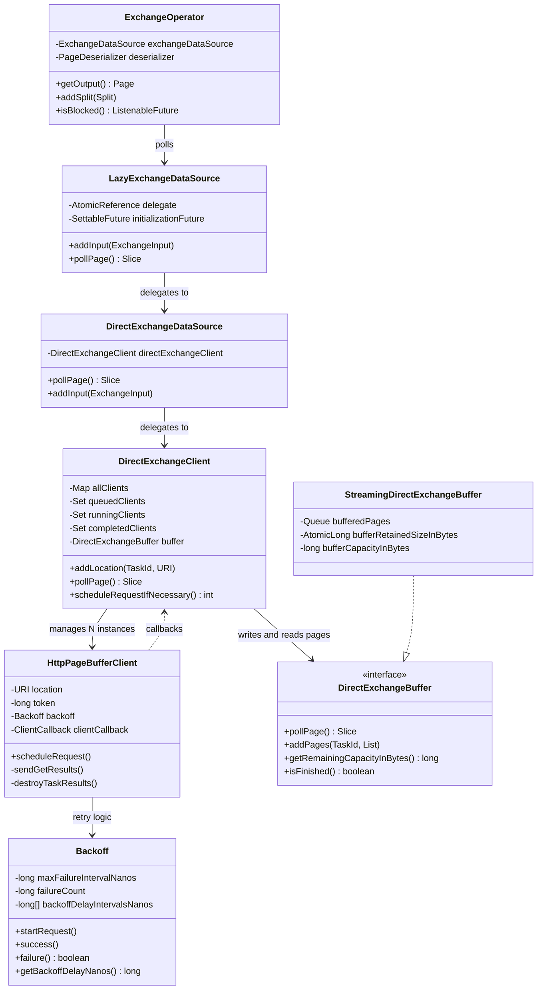
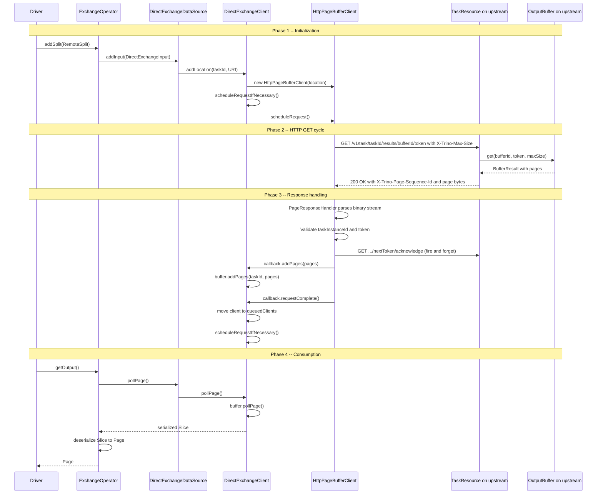
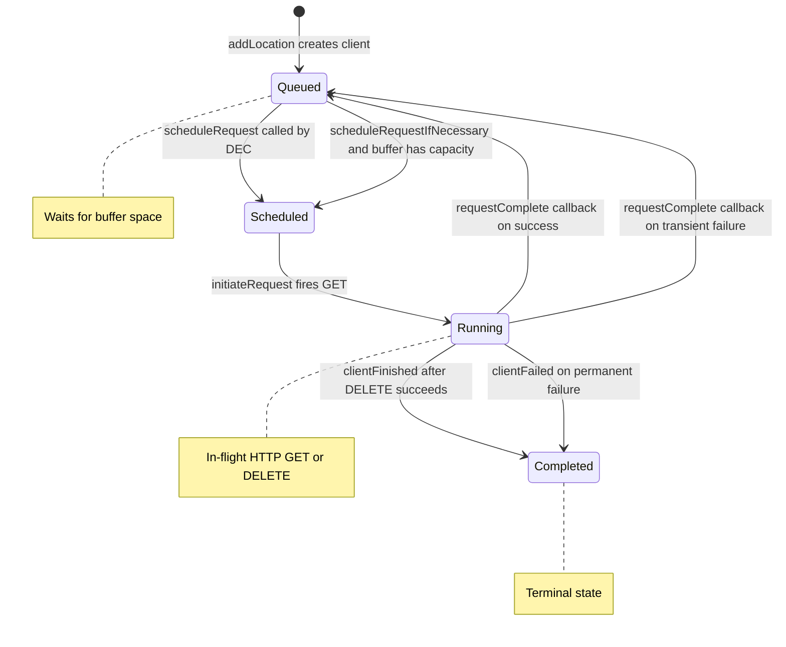

# Module Teardown: The Exchange Client -- The Client Side (Data Plane) (Task 4.2.B)

## Table of Contents

- [0. Research Focus](#0-research-focus)
- [1. High-Level Overview](#1-high-level-overview)
- [2. Structural Architecture](#2-structural-architecture)
  - [Class Diagram](#class-diagram)
- [3. Lifecycle & Flow](#3-lifecycle-flow)
  - [3.1 Initialization: From Split to HTTP Client](#31-initialization-from-split-to-http-client)
  - [3.2 Adding a Location: Creating an HttpPageBufferClient](#32-adding-a-location-creating-an-httppagebufferclient)
  - [3.3 Scheduling: Capacity-Aware Request Dispatch](#33-scheduling-capacity-aware-request-dispatch)
  - [3.4 The HTTP GET Cycle (HttpPageBufferClient.sendGetResults)](#34-the-http-get-cycle-httppagebufferclientsendgetresults)
  - [3.5 Retry and Error Handling](#35-retry-and-error-handling)
  - [3.6 Buffer Cleanup: The DELETE Cycle](#36-buffer-cleanup-the-delete-cycle)
  - [3.7 Polling: ExchangeOperator Consumes Pages](#37-polling-exchangeoperator-consumes-pages)
  - [Sequence Diagram: Complete Pull Cycle](#sequence-diagram-complete-pull-cycle)
  - [Flow Control State Diagram](#flow-control-state-diagram)
- [4. Key Design Decisions & Trade-offs](#4-key-design-decisions-trade-offs)
  - [4.1 Pull-Based vs Push-Based Shuffle](#41-pull-based-vs-push-based-shuffle)
  - [4.2 Eager Page Acknowledgment](#42-eager-page-acknowledgment)
  - [4.3 Capacity-Aware Scheduling with Over-Fetch](#43-capacity-aware-scheduling-with-over-fetch)
  - [4.4 Token-Based Idempotent Requests](#44-token-based-idempotent-requests)
  - [4.5 Task Instance ID Validation](#45-task-instance-id-validation)
  - [4.6 Backoff with Bounded Failure Duration](#46-backoff-with-bounded-failure-duration)
  - [4.7 Two Buffer Strategies](#47-two-buffer-strategies)
- [5. Configuration Parameters](#5-configuration-parameters)
- [6. Rust Rewrite Considerations](#6-rust-rewrite-considerations)
  - [6.1 Async HTTP Client](#61-async-http-client)
  - [6.2 Buffer Management](#62-buffer-management)
  - [6.3 Backoff State Machine](#63-backoff-state-machine)
  - [6.4 Token and Acknowledgment Protocol](#64-token-and-acknowledgment-protocol)
  - [6.5 Wire Format](#65-wire-format)
  - [6.6 Scheduling Algorithm](#66-scheduling-algorithm)
  - [6.7 Error Hierarchy](#67-error-hierarchy)
- [7. Key Invariants for Correctness](#7-key-invariants-for-correctness)


## 0. Research Focus
* **Task ID:** 4.2.B
* **Focus:** How does a worker pull data from multiple upstream workers? Trace the full HTTP request cycle: how `ExchangeOperator` calls through `ExchangeDataSource` into `DirectExchangeClient`, which fans out `HttpPageBufferClient` instances. Cover the HTTP headers used for flow control (`X-Trino-Max-Size`, `X-Trino-Page-Sequence-Id`, etc.), token-based acknowledgment, the backoff/retry strategy, and how received bytes become deserialized `Page` objects.

## 1. High-Level Overview
* **Core Responsibility:** When a downstream stage needs data from an upstream stage, the data plane uses a **pull-based** HTTP model. Each downstream worker runs an `ExchangeOperator` that polls an `ExchangeDataSource`, which in turn is backed by a `DirectExchangeClient`. The `DirectExchangeClient` maintains one `HttpPageBufferClient` per upstream task location. Each `HttpPageBufferClient` issues HTTP GET requests to the upstream worker's `TaskResource` endpoint, receives serialized pages in a custom binary format (`application/x-trino-pages`), and deposits them into a shared `DirectExchangeBuffer`. The `ExchangeOperator` then polls pages from this buffer and deserializes them into `Page` objects for the rest of the operator pipeline.
* **Key Design Principles:**
  - **Pull-based shuffle:** Downstream workers are responsible for fetching data. Upstream workers simply serve buffered pages via HTTP.
  - **Token-based sequencing:** Each request carries a sequence token. The server uses this to return the correct window of pages and advance acknowledgment.
  - **Capacity-aware scheduling:** `DirectExchangeClient` only dispatches HTTP requests when the local buffer has remaining capacity, multiplied by a configurable concurrency factor.
  - **Exponential backoff with bounded error duration:** Transient failures trigger retry with escalating delays (0ms, 50ms, 100ms, 200ms, 500ms). Persistent failures beyond a configurable duration (default 1 minute) become permanent.
  - **Eager acknowledgment:** When pages are received, an asynchronous acknowledge request is fired to let the upstream buffer free memory immediately, without waiting for the next poll.

## 2. Structural Architecture
* **Primary Source Files:**

| File | Lines | Role |
|------|-------|------|
| `ExchangeOperator.java` | 314 | SourceOperator that polls ExchangeDataSource for serialized pages and deserializes them |
| `LazyExchangeDataSource.java` | 206 | Deferred-initialization wrapper that creates the real data source on first split |
| `DirectExchangeDataSource.java` | 84 | Thin adapter from ExchangeDataSource interface to DirectExchangeClient |
| `DirectExchangeClient.java` | 466 | Orchestrator: manages N HttpPageBufferClients, buffer capacity, scheduling |
| `HttpPageBufferClient.java` | 876 | Per-upstream-task HTTP client: issues GETs, parses responses, handles retries |
| `DirectExchangeBuffer.java` | 64 | Interface for local page buffer (streaming or deduplicating) |
| `StreamingDirectExchangeBuffer.java` | 258 | Default buffer implementation: simple FIFO queue with capacity tracking |
| `DirectExchangeClientFactory.java` | 187 | Factory that wires config, HTTP client, buffer choice, and creates DirectExchangeClient |
| `DirectExchangeClientConfig.java` | 147 | Configuration knobs for exchange client behavior |
| `Backoff.java` | 156 | Retry/backoff state machine with configurable delay intervals |
| `TaskResource.java` | 568 | Server-side JAX-RS endpoint that serves buffered pages to requesting clients |
| `PagesInputStreamFactory.java` | 69 | Serializes pages into the wire format (magic + checksum + count + pages) |
| `BufferResult.java` | 50 | Record carrying pages + token + completion flag from output buffer |
| `InternalHeaders.java` | 46 | Constants for all X-Trino-* HTTP headers |
| `PageTransportErrorException.java` | 34 | Exception for HTTP-level page transport errors |
| `PageTransportTimeoutException.java` | 29 | Exception for timeout after exhausting backoff retries |
| `PageTooLargeException.java` | 28 | Exception when a remote page exceeds maximum allowed length |

* **Key Data Structures:**

**DirectExchangeClient fields:**

| Field | Type | Purpose |
|-------|------|---------|
| `allClients` | `ConcurrentHashMap of URI to HttpPageBufferClient` | Registry of every upstream location |
| `queuedClients` | `LinkedHashSet of HttpPageBufferClient` | Clients awaiting their next HTTP request |
| `runningClients` | `LinkedHashSet of HttpPageBufferClient` | Clients with an in-flight HTTP request |
| `completedClients` | `ConcurrentHashSet of HttpPageBufferClient` | Clients whose upstream buffer is fully consumed |
| `buffer` | `DirectExchangeBuffer` | Local page buffer holding received serialized pages |
| `maxResponseSize` | `DataSize` | Cap on bytes requested per HTTP GET (sent via header) |
| `concurrentRequestMultiplier` | `int` | Over-fetch factor (default 3x) to keep pipeline full |
| `acknowledgePages` | `boolean` | Whether to send eager acknowledge requests (default true) |
| `averageBytesPerRequest` | `long` | Running average used for scheduling decisions |

**HttpPageBufferClient fields:**

| Field | Type | Purpose |
|-------|------|---------|
| `location` | `URI` | Base URL of the upstream task results endpoint |
| `token` | `long` | Current page sequence token for this upstream |
| `taskInstanceId` | `String` | Remote task instance ID to detect stale/restarted tasks |
| `backoff` | `Backoff` | Retry state machine tracking failure count and duration |
| `future` | `HttpResponseFuture` | Handle to the currently in-flight HTTP request |
| `completed` | `boolean` | True when the remote buffer signals completion |
| `averageRequestSizeInBytes` | `long` | Running average for capacity-based scheduling |

**HTTP Headers (InternalHeaders):**

| Header | Constant Name | Direction | Purpose |
|--------|---------------|-----------|---------|
| `X-Trino-Max-Size` | `TRINO_MAX_SIZE` | Request | Max bytes the client wants in the response |
| `X-Trino-Task-Instance-Id` | `TRINO_TASK_INSTANCE_ID` | Response | Identifies the specific task instance to detect restarts |
| `X-Trino-Page-Sequence-Id` | `TRINO_PAGE_TOKEN` | Response | Echoes back the token from the request |
| `X-Trino-Page-End-Sequence-Id` | `TRINO_PAGE_NEXT_TOKEN` | Response | Token for the next request (advances past delivered pages) |
| `X-Trino-Buffer-Complete` | `TRINO_BUFFER_COMPLETE` | Response | True when all pages have been produced |
| `X-Trino-Task-Failed` | `TRINO_TASK_FAILED` | Response | True when the upstream task has failed |

**Wire Format (PagesInputStreamFactory):**

| Offset | Size | Content |
|--------|------|---------|
| 0 | 4 bytes | Magic number `0xfea4f001` |
| 4 | 8 bytes | Checksum (or `NO_CHECKSUM` if verification is disabled) |
| 12 | 4 bytes | Page count |
| 16+ | variable | Concatenated serialized pages (little-endian) |

### Class Diagram



## 3. Lifecycle & Flow

### 3.1 Initialization: From Split to HTTP Client

The exchange client is created lazily. The `ExchangeOperator` starts with a `LazyExchangeDataSource` that has no concrete delegate. When the first `RemoteSplit` arrives via `addSplit()`:

1. **ExchangeOperator.addSplit()** extracts the `RemoteSplit` and calls `exchangeDataSource.addInput(remoteSplit.getExchangeInput())`.
2. **LazyExchangeDataSource.addInput()** sees `delegate` is null. Since the input is a `DirectExchangeInput`, it calls `directExchangeClientSupplier.get()` to create a `DirectExchangeClient`.
3. **DirectExchangeClientFactory.get()** selects the buffer strategy based on retry policy:
   - `NONE` (default, pipelined): `StreamingDirectExchangeBuffer` with `maxBufferedBytes` (default 32MB)
   - `QUERY` (fault-tolerant): `DeduplicatingDirectExchangeBuffer` for at-least-once semantics
   - `TASK`: Not supported (throws)
4. The factory creates the `DirectExchangeClient`, wiring the buffer, HTTP client, scheduler, and config.
5. `LazyExchangeDataSource` wraps it in a `DirectExchangeDataSource`, sets the delegate, and completes the `initializationFuture`.
6. The `DirectExchangeInput` (containing `taskId` and `location` URL) is passed to `DirectExchangeDataSource.addInput()`, which calls `DirectExchangeClient.addLocation(taskId, URI)`.

### 3.2 Adding a Location: Creating an HttpPageBufferClient

When `DirectExchangeClient.addLocation(taskId, location)` is called:

1. The `DirectExchangeBuffer` is notified of the new task via `buffer.addTask(taskId)`.
2. A new `HttpPageBufferClient` is created with:
   - The upstream `location` URL (e.g., `http://worker-2:8080/v1/task/queryId.stageId.taskId/results/bufferId`)
   - A `maxResponseSize` (default ~75% of configured max, leaving room for encoding overhead)
   - A `maxErrorDuration` (default 1 minute) for the `Backoff` instance
   - An `ExchangeClientCallback` inner class that bridges back to `DirectExchangeClient`
3. The client is added to `allClients` (by URI) and `queuedClients`.
4. `scheduleRequestIfNecessary()` is called, which may immediately dispatch the first HTTP request.

### 3.3 Scheduling: Capacity-Aware Request Dispatch

`scheduleRequestIfNecessary()` is the central scheduling method. It controls how many HTTP requests are in flight at once:

1. **Check termination:** If the buffer is finished/failed and all clients are complete, return 0.
2. **Check capacity:** `neededBytes = buffer.getRemainingCapacityInBytes()`. If the local buffer is full (remaining capacity is 0 or negative), no requests are dispatched.
3. **Compute budget:** Sum the `averageRequestSizeInBytes` of all currently running clients to estimate reserved bytes.
4. **Iterate queued clients:** For each queued client, if `projectedBytesToBeRequested` has not yet reached `neededBytes * concurrentRequestMultiplier - reservedBytes`:
   - Call `client.scheduleRequest()` to dispatch an HTTP GET.
   - Move the client from `queuedClients` to `runningClients`.
   - Accumulate the client's average request size in the projection.

The `concurrentRequestMultiplier` (default 3) means the system intentionally over-fetches: if 10MB of buffer space is free, it will schedule requests projected to return up to 30MB. This keeps the pipeline full despite HTTP round-trip latency.

### 3.4 The HTTP GET Cycle (HttpPageBufferClient.sendGetResults)

This is the core of the data plane. Each `HttpPageBufferClient` goes through this cycle:

**Step 1: Schedule with Backoff Delay**
```
scheduleRequest():
  1. backoff.startRequest()   // record request start time
  2. delayNanos = backoff.getBackoffDelayNanos()  // 0ms on first try
  3. scheduledExecutor.schedule(initiateRequest, delayNanos)
```

**Step 2: Build and Send the HTTP GET**
```
sendGetResults():
  1. URI = location + "/" + token   // e.g., .../results/0/42
  2. GET request with header: X-Trino-Max-Size = maxResponseSize
  3. httpClient.executeAsync(request, PageResponseHandler)
  4. Register FutureCallback for success/failure
```

**Step 3: Server Side (TaskResource.getResults)**
The upstream worker's `TaskResource.getResults()` endpoint:
  1. Calls `taskManager.getTaskResults(taskId, bufferId, token, maxSize)`.
  2. The `SqlTask` delegates to `outputBuffer.get(bufferId, startingSequenceId, maxSize)`.
  3. If data is available, returns immediately. If not, the future blocks for up to a randomized wait time (1-2 seconds with jitter).
  4. The response is built with headers: `X-Trino-Task-Instance-Id`, `X-Trino-Page-Sequence-Id` (echoes token), `X-Trino-Page-End-Sequence-Id` (next token), `X-Trino-Buffer-Complete`, `X-Trino-Task-Failed`.
  5. If pages exist: status 200 with `application/x-trino-pages` body (magic + checksum + count + serialized pages).
  6. If no pages but query still running: status 204 (No Content) with the same headers.

**Step 4: Handle Success (PageResponseHandler + FutureCallback.onSuccess)**

The `PageResponseHandler` parses the HTTP response:
  1. **204 No Content:** Create empty `PagesResponse` with token metadata.
  2. **200 OK:** Verify content type is `application/x-trino-pages`. Read the binary stream: magic number, checksum, page count, then deserialize N serialized page slices. Optionally verify checksum.
  3. **Other status:** Throw `PageTransportErrorException`.

The `FutureCallback.onSuccess` then:
  1. Call `backoff.success()` to reset all failure state.
  2. **Validate task instance ID:** The first response sets `taskInstanceId`. Subsequent responses must match. A mismatch means the task was restarted (throws `REMOTE_TASK_MISMATCH`).
  3. **Validate token:** If the response token matches the local token, accept the pages and advance the token to `nextToken`. If tokens mismatch (stale response), discard pages.
  4. **Eager acknowledge:** If pages were received and `acknowledgePages` is enabled, fire an asynchronous GET to `location/{nextToken}/acknowledge`. This is fire-and-forget -- failures are logged but ignored. The purpose is to let the upstream buffer free memory without waiting for the next data request.
  5. **Deliver pages to DirectExchangeClient:** Call `clientCallback.addPages(client, pages)`, which calls `DirectExchangeClient.addPages()`, which calls `buffer.addPages(taskId, pages)` and updates memory accounting.
  6. **Track completion:** If `result.isClientComplete()`, mark this client as `completed = true`. The next `initiateRequest()` will send a DELETE instead of a GET.
  7. **Re-enqueue:** Call `clientCallback.requestComplete(client)`, which moves the client from `runningClients` back to `queuedClients` and calls `scheduleRequestIfNecessary()`.

### 3.5 Retry and Error Handling

**Step 4 (Failure Path): FutureCallback.onFailure**

1. Record `lastRequestDurationMillis`.
2. **Checksum verification failure:** Behavior depends on config:
   - `NONE` or `ABORT`: Wrap as `TrinoException` (non-retryable).
   - `RETRY`: Log warning and continue with retry logic.
3. **Page too large:** If any cause in the chain contains "exceeded maximum length", rewrite to `PageTooLargeException` (non-retryable).
4. **Retryable failure:** Call `backoff.failure()`. If it returns `true` (failure duration exceeded `maxFailureIntervalNanos` AND failure count exceeds `minTries`), wrap as `PageTransportTimeoutException` (permanent failure).
5. **Permanent failure (TrinoException):** Call `clientCallback.clientFailed()`, which calls `DirectExchangeClient.clientFailed()`. This adds the client to `completedClients`, notifies `buffer.taskFailed()`, and fires `taskFailureListener.onTaskFailed()`.
6. **Transient failure:** Call `clientCallback.requestComplete()`, which re-enqueues the client. On the next `scheduleRequest()`, the backoff delay is applied before the next attempt.

**Backoff Delay Schedule:**

| Failure Count | Delay |
|---------------|-------|
| 0 (first request) | 0ms |
| 1 | 50ms |
| 2 | 100ms |
| 3 | 200ms |
| 4+ | 500ms |

The delay is computed as `max(0, intervalForFailureCount - timeSinceLastFailure)`, so if enough time has already elapsed since the last failure, the delay is reduced or eliminated.

The `failure()` method returns `true` (permanent) only when:
- `failureCount >= minTries` (default 3), AND
- `now - firstFailureTime >= maxFailureIntervalNanos` (default 60 seconds)

### 3.6 Buffer Cleanup: The DELETE Cycle

When a client receives `isClientComplete() == true`, it marks `completed = true`. On the next `initiateRequest()`, instead of `sendGetResults()`, it calls `destroyTaskResults()`:

1. Send `DELETE` to the upstream `location` URL.
2. On success (204 No Content): mark client `closed`, call `clientCallback.clientFinished()`.
3. `DirectExchangeClient.clientFinished()` adds the client to `completedClients`, calls `buffer.taskFinished(taskId)`.
4. On failure: retry with the same backoff logic. If backoff exhausts, throw `TrinoTransportException(REMOTE_BUFFER_CLOSE_FAILED)`.

### 3.7 Polling: ExchangeOperator Consumes Pages

The `ExchangeOperator.getOutput()` method is the consumer side:

1. Call `exchangeDataSource.pollPage()` which delegates through `LazyExchangeDataSource` to `DirectExchangeDataSource` to `DirectExchangeClient.pollPage()`.
2. `DirectExchangeClient.pollPage()`: Calls `buffer.pollPage()` on the `StreamingDirectExchangeBuffer`. If a page is returned, updates retained memory accounting and calls `scheduleRequestIfNecessary()` (freeing buffer space may allow more HTTP requests).
3. Back in `ExchangeOperator`: Lazily initializes the `PageDeserializer` (needs encryption key info which depends on exchange type). Calls `deserializer.deserialize(page)` to convert the serialized `Slice` into a `Page` object. Records network input metrics.
4. If `pollPage()` returns null, `getOutput()` returns null and the driver checks `isBlocked()` and `isFinished()`.

### Sequence Diagram: Complete Pull Cycle



### Flow Control State Diagram



## 4. Key Design Decisions & Trade-offs

### 4.1 Pull-Based vs Push-Based Shuffle
**Decision:** Trino uses pull-based data exchange where downstream workers fetch from upstream.
**Trade-off:** Simpler flow control (consumer controls rate), but adds HTTP round-trip latency. The `concurrentRequestMultiplier` (default 3x) compensates by over-fetching.

### 4.2 Eager Page Acknowledgment
**Decision:** After receiving pages, an asynchronous fire-and-forget acknowledge request is sent immediately (`acknowledgePages = true` by default).
**Trade-off:** This lets the upstream output buffer free memory sooner, at the cost of an extra HTTP request per batch. The next regular GET also implicitly acknowledges via the advanced token, so the acknowledge request is an optimization, not a correctness requirement.

### 4.3 Capacity-Aware Scheduling with Over-Fetch
**Decision:** `scheduleRequestIfNecessary()` projects expected response sizes using `averageRequestSizeInBytes` and allows up to `concurrentRequestMultiplier * remainingCapacity` bytes in flight.
**Trade-off:** Over-fetching risks temporarily exceeding buffer capacity, but keeps the pipeline saturated. The buffer is a soft limit -- pages that arrive when the buffer is near-full are still accepted and buffered.

### 4.4 Token-Based Idempotent Requests
**Decision:** Each GET includes the current token in the URL path. The server returns pages starting from that token and provides the next token. If a stale token arrives (due to retry or duplicate), pages are discarded client-side.
**Trade-off:** Simple and idempotent -- requests can be safely retried. But it requires careful validation: if a response token does not match the client's current token, all received pages are silently dropped.

### 4.5 Task Instance ID Validation
**Decision:** The first response sets the `taskInstanceId`. All subsequent responses must match.
**Trade-off:** Detects task restarts (e.g., after node crash and reschedule) that would cause stale data. A mismatch throws `REMOTE_TASK_MISMATCH`, a fatal error that fails the downstream task. This is critical for correctness in non-retry mode.

### 4.6 Backoff with Bounded Failure Duration
**Decision:** Transient failures are retried with escalating delays (0, 50, 100, 200, 500ms). After `maxErrorDuration` (default 60s) with at least 3 failures, the error becomes permanent.
**Trade-off:** Tolerates brief network blips and GC pauses. The 60-second window is generous enough for typical cluster issues but prevents indefinite hangs. The `minTries = 3` ensures at least 3 attempts regardless of timing.

### 4.7 Two Buffer Strategies
**Decision:** `StreamingDirectExchangeBuffer` for pipelined execution (no retries), `DeduplicatingDirectExchangeBuffer` for fault-tolerant query-level retry.
**Trade-off:** Streaming is simple and low-overhead (FIFO queue). Deduplicating adds complexity to handle at-least-once delivery semantics when tasks may be retried, potentially receiving duplicate pages that must be filtered.

## 5. Configuration Parameters

| Config Property | Default | Effect |
|-----------------|---------|--------|
| `exchange.max-buffer-size` | 32MB | Total memory for the local DirectExchangeBuffer |
| `exchange.max-response-size` | HTTP client default | Max bytes per HTTP response (further reduced to 75%) |
| `exchange.concurrent-request-multiplier` | 3 | Over-fetch factor for scheduling |
| `exchange.max-error-duration` | 1 minute | Max time to tolerate consecutive failures before giving up |
| `exchange.acknowledge-pages` | true | Enable eager page acknowledgment requests |
| `exchange.client-threads` | 25 | HTTP client thread pool size for exchange |
| `exchange.page-buffer-client.max-callback-threads` | 25 | Thread pool for HttpPageBufferClient callbacks |
| `exchange.deduplication-buffer-size` | 32MB | Buffer size for DeduplicatingDirectExchangeBuffer (fault-tolerant mode) |

**Derived value:** `maxResponseSize` in the factory is computed as `min(httpClientConfig.maxResponseContentLength, config.maxResponseSize) * 0.75`, leaving 25% headroom for encoding overhead.

## 6. Rust Rewrite Considerations

### 6.1 Async HTTP Client
The Java implementation uses Airlift's `HttpClient` with async callbacks and a `ScheduledExecutorService` for backoff delays. In Rust, this maps naturally to `tokio` + `reqwest` or `hyper`:
- Replace `ScheduledExecutorService.schedule(task, delay)` with `tokio::time::sleep(delay).await`.
- Replace `HttpResponseFuture` + `FutureCallback` with `async fn` that returns `Result`.
- The callback-based `ClientCallback` pattern can be replaced with channels (`tokio::sync::mpsc`) or direct method calls in an `async` context.

### 6.2 Buffer Management
The `StreamingDirectExchangeBuffer` is a `Mutex<VecDeque<Bytes>>` with an `AtomicUsize` for retained size. Key points:
- Use `tokio::sync::Notify` or `tokio::sync::watch` instead of `SettableFuture<Void>` for blocking/unblocking signals.
- The `getRemainingCapacityInBytes()` check should use `Ordering::Relaxed` since it is advisory only.
- Consider using `bytes::Bytes` for zero-copy page passing.

### 6.3 Backoff State Machine
The `Backoff` class is purely synchronous and small. It translates directly to a Rust struct:
- Replace `Ticker` with `std::time::Instant`.
- The delay intervals array is fixed at compile time -- use `const`.
- The `failure()` method's return value (permanent or transient) determines whether to continue retrying or propagate the error.

### 6.4 Token and Acknowledgment Protocol
The token-based protocol is stateless on the wire and maps cleanly:
- Maintain `current_token: u64` per upstream client.
- The acknowledge request is fire-and-forget: spawn a detached task (`tokio::spawn`) that sends the GET and ignores the result.
- Task instance ID validation is a simple string comparison.

### 6.5 Wire Format
The `PagesInputStreamFactory` format (magic + checksum + count + pages) is straightforward to implement:
- Use `byteorder` crate for little-endian reads.
- CRC/checksum verification can use the same algorithm or a Rust equivalent.
- The `SERIALIZED_PAGES_MAGIC = 0xfea4f001` must match exactly for interop.

### 6.6 Scheduling Algorithm
The capacity-aware scheduling in `scheduleRequestIfNecessary()` is single-threaded (synchronized). In Rust:
- Use a `tokio::sync::Mutex` to protect the scheduling state (queued, running sets).
- The iteration over queued clients with projected-byte accounting is sequential and cheap.
- Consider using a `tokio::sync::Semaphore` to limit concurrent HTTP requests as an alternative to the current projected-bytes approach.

### 6.7 Error Hierarchy
Map the Java exception types to Rust error enums:
- `PageTransportErrorException` (retryable HTTP errors)
- `PageTransportTimeoutException` (backoff exhausted -- permanent)
- `PageTooLargeException` (page exceeds max -- permanent)
- `TrinoException(REMOTE_TASK_MISMATCH)` (task instance mismatch -- permanent)
- `TrinoException(REMOTE_TASK_FAILED)` (upstream task failed -- permanent)

Use `thiserror` with a `#[non_exhaustive]` enum distinguishing retryable vs permanent errors.

## 7. Key Invariants for Correctness

1. **Token monotonicity:** The token only advances forward. If a response carries a token that does not match the client's current token, the pages are discarded (not an error, just ignored).
2. **Task instance stability:** Once `taskInstanceId` is set from the first response, all subsequent responses must match. A mismatch is a fatal error indicating the upstream task was replaced.
3. **Buffer capacity as soft limit:** `scheduleRequestIfNecessary()` respects remaining capacity, but in-flight responses may cause temporary overflows. The buffer accepts all delivered pages regardless.
4. **Exactly-once delivery in streaming mode:** Token advancement ensures each page is delivered exactly once. The acknowledge request is idempotent.
5. **Callback lock discipline:** `clientCallback` methods are never called while holding the `HttpPageBufferClient.this` lock. The code enforces this with `assertNotHoldsLock()` assertions. This prevents deadlocks between `HttpPageBufferClient` and `DirectExchangeClient`.
6. **Completion requires DELETE:** A client is not truly finished until the DELETE request succeeds (or its backoff exhausts). The `completedClients.size() == allClients.size()` check in `isFinished()` ensures the `ExchangeOperator` does not terminate prematurely.
7. **Memory context lifecycle:** The `memoryContextWriteLock` ensures that setting `memoryContext = null` during `close()` prevents any concurrent `updateRetainedMemory()` from writing to a freed context.
