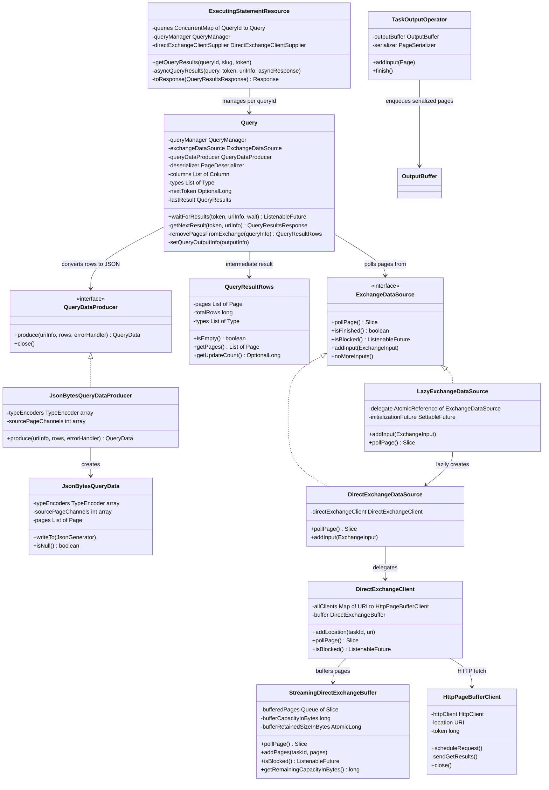
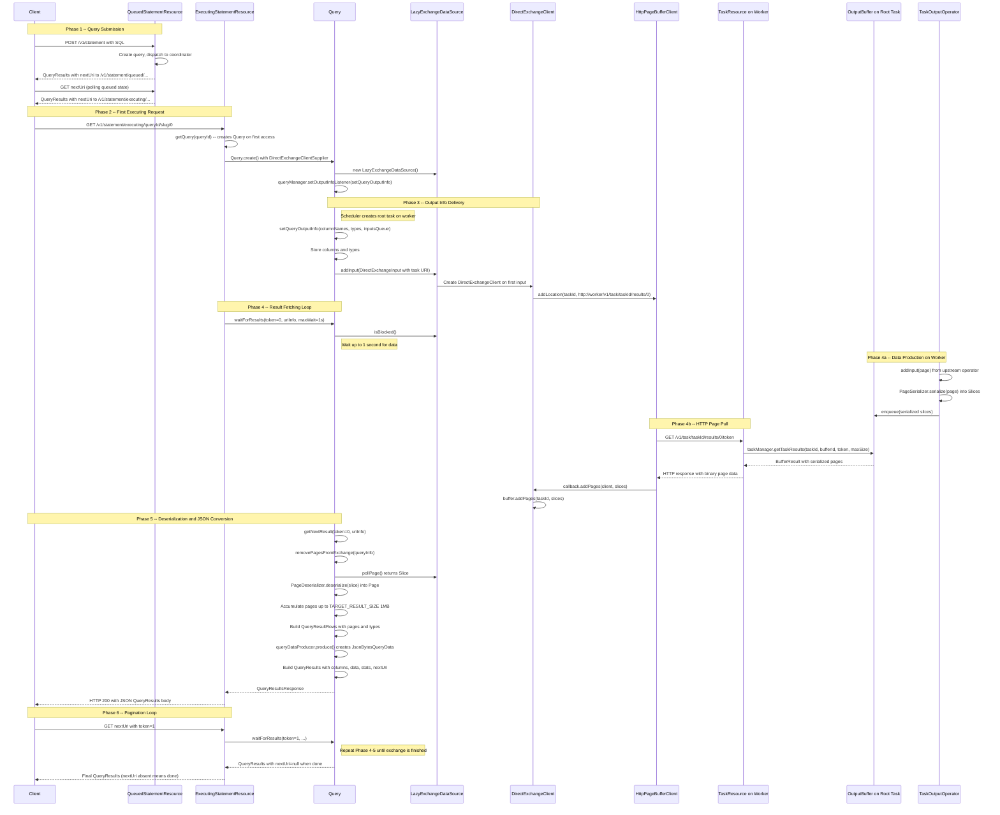
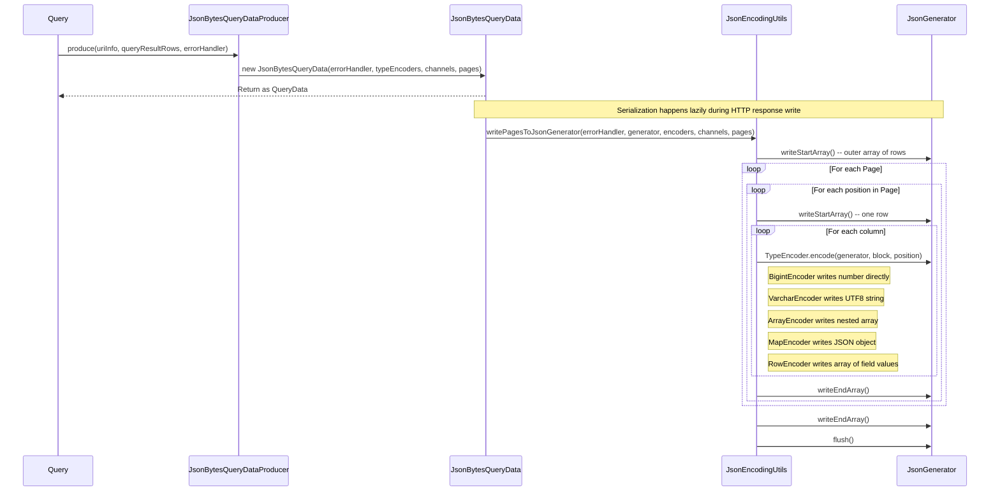

# Module Teardown: The Coordinator as the Final Consumer (Task 4.2.C)

## Table of Contents

- [0. Research Focus](#0-research-focus)
- [1. High-Level Overview](#1-high-level-overview)
- [2. Structural Architecture](#2-structural-architecture)
  - [Class Diagram](#class-diagram)
- [3. Execution and Call Flow](#3-execution-and-call-flow)
  - [Sequence Diagram -- End-to-End: Root Task Output to Client JSON Response](#sequence-diagram-end-to-end-root-task-output-to-client-json-response)
  - [Sequence Diagram -- JSON Serialization Detail](#sequence-diagram-json-serialization-detail)
  - [Step-by-step Text Breakdown](#step-by-step-text-breakdown)
- [4. Concurrency and State Management](#4-concurrency-and-state-management)
- [5. Memory and Resource Profile](#5-memory-and-resource-profile)
- [6. Design Patterns and Rust Rewrite Implications](#6-design-patterns-and-rust-rewrite-implications)
- [7. Key Observations and Gotchas](#7-key-observations-and-gotchas)

## 0. Research Focus
* **Task ID:** 4.2.C
* **Focus:** Trace how the coordinator fetches the final result set from the root task. How does the root worker's OutputBuffer differ (if at all) from an intermediate shuffle buffer? How are internal Pages finally converted into the client-facing format? Full path from root task output buffer to client HTTP response.

## 1. High-Level Overview
* **Core Responsibility:** When a client submits a SQL query, the coordinator must ultimately deliver the query results back to the client over HTTP as JSON. This requires bridging two fundamentally different worlds: the internal binary data plane (serialized Pages flowing between workers) and the external client protocol (JSON rows with column metadata, paginated via nextUri). The coordinator acts as the final consumer of the data plane -- it is the downstream "worker" that pulls serialized pages from the root stage's OutputBuffer, deserializes them back into Page objects, converts each Block value into JSON-compatible form, and streams the results to the client over a REST API with token-based pagination.

* **Key Insight -- No Special Root Buffer:** The root task's OutputBuffer is identical in implementation to any intermediate shuffle buffer. There is no "final result buffer" type. The difference lies entirely in the consumer side: intermediate buffers are consumed by ExchangeOperator running inside another task's Driver, while the root buffer is consumed by the coordinator's Query object (in the server.protocol package) using the same DirectExchangeClient and HttpPageBufferClient machinery, but the data is then converted to JSON rather than fed into another operator pipeline.

* **Two-Phase Client Protocol:** The client protocol has two distinct HTTP resource phases:
  1. **QueuedStatementResource** (`/v1/statement`) -- handles query submission and queuing. Returns status-only responses until the query is dispatched.
  2. **ExecutingStatementResource** (`/v1/statement/executing`) -- handles result fetching during execution. Each GET returns a `QueryResults` JSON payload containing data rows, column metadata, stats, and a `nextUri` for pagination.

## 2. Structural Architecture
* **Primary Source Files:**
  - `io.trino.dispatcher.QueuedStatementResource` -- REST endpoint for query submission and queuing (`/v1/statement`)
  - `io.trino.server.protocol.ExecutingStatementResource` -- REST endpoint for result fetching (`/v1/statement/executing`)
  - `io.trino.server.protocol.Query` -- coordinator-side result fetcher; owns the ExchangeDataSource, deserializes pages, produces QueryResults
  - `io.trino.server.protocol.QueryResultRows` -- wrapper around a list of deserialized Pages with type info
  - `io.trino.server.protocol.QueryResultsResponse` -- record bundling QueryResults with session state changes (catalog, schema, roles, etc.)
  - `io.trino.server.protocol.QueryDataProducer` -- interface for converting QueryResultRows into client-facing QueryData
  - `io.trino.server.protocol.QueryDataProducerFactory` -- factory choosing JSON vs spooling producer
  - `io.trino.server.protocol.JsonBytesQueryDataProducer` -- default JSON producer, creates JsonBytesQueryData
  - `io.trino.server.protocol.JsonBytesQueryData` -- QueryData implementation that writes Pages to a JsonGenerator
  - `io.trino.server.protocol.JsonEncodingUtils` -- type-specific encoders (BigintEncoder, VarcharEncoder, ArrayEncoder, etc.) that write Block values to JSON
  - `io.trino.server.protocol.ProtocolUtil` -- creates Column metadata from Type, builds StatementStats, converts errors
  - `io.trino.client.QueryResults` -- the immutable JSON-serializable result payload sent to the client
  - `io.trino.client.QueryData` -- interface for result data (can be null, JSON inline, or spooled reference)
  - `io.trino.client.Column` -- column descriptor with name, type string, and ClientTypeSignature
  - `io.trino.exchange.LazyExchangeDataSource` -- deferred-initialization wrapper that resolves to DirectExchangeDataSource or SpoolingExchangeDataSource on first input
  - `io.trino.exchange.DirectExchangeDataSource` -- thin wrapper delegating to DirectExchangeClient
  - `io.trino.exchange.ExchangeDataSource` -- common interface for pollPage/isBlocked/isFinished
  - `io.trino.exchange.DirectExchangeInput` -- carries (TaskId, location URI) for a root task's result buffer
  - `io.trino.operator.DirectExchangeClient` -- manages multiple HttpPageBufferClient instances, multiplexes and buffers their output
  - `io.trino.operator.StreamingDirectExchangeBuffer` -- in-memory FIFO queue of serialized Slices with back-pressure
  - `io.trino.operator.HttpPageBufferClient` -- HTTP client that fetches serialized pages from a worker's OutputBuffer via GET requests
  - `io.trino.server.TaskResource` -- worker-side REST endpoint serving buffer contents (`/v1/task/{taskId}/results/{bufferId}/{token}`)
  - `io.trino.execution.buffer.OutputBuffer` -- interface for the task's output buffer (same for root and intermediate)
  - `io.trino.execution.buffer.BufferResult` -- result of a buffer read: taskInstanceId, token, nextToken, bufferComplete flag, serialized pages
  - `io.trino.operator.output.TaskOutputOperator` -- the final operator in a pipeline that serializes Pages and enqueues them into the OutputBuffer
  - `io.trino.execution.buffer.PagesSerdeFactory` -- creates PageSerializer/PageDeserializer with optional encryption
  - `io.trino.exchange.ExchangeEncryptionKey` -- determines whether encryption is needed based on storage type
  - `io.trino.execution.QueryStateMachine` -- manages query state transitions and the QueryOutputManager
  - `io.trino.execution.QueryStateMachine.QueryOutputManager` -- publishes column types and exchange inputs to the output info listener
  - `io.trino.execution.QueryExecution.QueryOutputInfo` -- carries column names, types, and a queue of ExchangeInput locations
  - `io.trino.execution.SqlQueryExecution` -- wires up the QueryScheduler, sets output columns, delegates to QueryStateMachine
  - `io.trino.execution.scheduler.PipelinedQueryScheduler` -- schedules root stage tasks and publishes their result URIs as DirectExchangeInput

* **Key Data Structures:**
  - **Page** -- columnar data unit (array of Blocks with position count)
  - **Block** -- single column's data for a batch of rows (typed, nullable, variable or fixed width)
  - **Slice** -- serialized byte representation of a Page (from airlift)
  - **TypeEncoder** -- sealed interface in JsonEncodingUtils with specialized implementations per Trino type
  - **QueryResults** -- immutable JSON payload: id, infoUri, nextUri, columns, data, stats, error, warnings
  - **QueryData** -- marker interface for result data; JsonBytesQueryData implements writeTo(JsonGenerator)
  - **DirectExchangeInput** -- tuple of (TaskId, URI string) pointing to a task's result buffer endpoint
  - **BufferResult** -- record of (taskInstanceId, token, nextToken, bufferComplete, serializedPages)

### Class Diagram

## 3. Execution and Call Flow

### Sequence Diagram -- End-to-End: Root Task Output to Client JSON Response

### Sequence Diagram -- JSON Serialization Detail

### Step-by-step Text Breakdown

**1. Query Submission and Queuing (QueuedStatementResource)**
- Client POSTs SQL to `/v1/statement`. The `QueuedStatementResource` creates a query submission, assigns a `QueryId` and `Slug`, and dispatches it through the `DispatchManager`.
- The client polls `/v1/statement/queued/{queryId}/{slug}/{token}` with successive tokens. Each response is a `QueryResults` JSON with status information and a `nextUri`.
- Once the query is dispatched to a coordinator (which may be the same node), the `nextUri` switches from the queued path to the executing path: `/v1/statement/executing/{queryId}/{slug}/0`. The token resets to 0 for the executing phase.

**2. Query Object Creation (ExecutingStatementResource)**
- On the first GET to the executing endpoint, `ExecutingStatementResource.getQuery()` lazily creates a `Query` object via `Query.create()`.
- This method creates a `LazyExchangeDataSource` (with exchangeId `query-results-exchange-{queryId}`), wires up two listeners on the `QueryManager`:
  - **Output info listener** (`setQueryOutputInfo`): receives column names, column types, and a queue of `ExchangeInput` objects pointing to root task result buffer URIs.
  - **State change listener**: closes the exchange client if the query fails or has no output stage (DDL operations).

**3. Output Info Delivery (QueryStateMachine to Query)**
- During query planning, `SqlQueryExecution.planDistribution()` calls `stateMachine.setColumns()` with the column names and types from the root `OutputNode`.
- The `PipelinedQueryScheduler` creates root stage tasks. For each root task, `QueryOutputTaskLifecycleListener.taskCreated()` constructs a `DirectExchangeInput` containing the task ID and a URI like `http://worker-host:port/v1/task/{taskId}/results/0`.
- These inputs are published via `queryStateMachine.updateInputsForQueryResults(inputs, noMoreInputs)`, which enqueues them into the `QueryOutputManager.inputsQueue`.
- The `QueryOutputManager` fires the listener callback, which delivers a `QueryOutputInfo` to `Query.setQueryOutputInfo()`.
- `Query.setQueryOutputInfo()` does two things:
  - Stores column metadata: creates `Column` objects via `ProtocolUtil.createColumn()` and initializes the `QueryDataProducer` (either `JsonBytesQueryDataProducer` for standard JSON, or `SpoolingQueryDataProducer` for spooled/encoded data).
  - Drains the inputs queue via `outputInfo.drainInputs(exchangeDataSource::addInput)`, which feeds each `DirectExchangeInput` to the `LazyExchangeDataSource`.

**4. Exchange Data Source Initialization (LazyExchangeDataSource)**
- `LazyExchangeDataSource.addInput()` is lazy: on the first input, it inspects the input type:
  - If `DirectExchangeInput`: creates a `DirectExchangeClient` via the supplier, wraps it in a `DirectExchangeDataSource`, and stores it as the delegate.
  - If `SpoolingExchangeInput`: creates a `SpoolingExchangeDataSource` using the exchange manager.
- The `initializationFuture` is resolved, unblocking any callers waiting on `isBlocked()`.
- `DirectExchangeDataSource.addInput()` calls `directExchangeClient.addLocation(taskId, URI)`, which creates an `HttpPageBufferClient` for that worker and schedules its first fetch request.

**5. HTTP Page Pulling (HttpPageBufferClient to TaskResource)**
- `HttpPageBufferClient.scheduleRequest()` enqueues a delayed HTTP GET to `{location}/{token}` (e.g., `http://worker/v1/task/{taskId}/results/0/0`).
- On the worker side, `TaskResource.getResults()` calls `taskManager.getTaskResults(taskId, bufferId, token, maxSize)`, which reads from the root task's `OutputBuffer.get()`.
- The `OutputBuffer` returns a `BufferResult` containing serialized page Slices (same binary format as inter-worker shuffles), along with a token, nextToken, and bufferComplete flag.
- The response is sent as `TRINO_PAGES` media type with custom headers: `X-Trino-Page-Token`, `X-Trino-Page-Next-Token`, `X-Trino-Buffer-Complete`, `X-Trino-Task-Instance-Id`.
- Back on the coordinator, `HttpPageBufferClient` parses the response, advances its token, and calls `clientCallback.addPages()` which stores the Slices in the `DirectExchangeClient`'s `StreamingDirectExchangeBuffer`.
- If `acknowledgePages` is true, an immediate acknowledge GET is sent to `{location}/{nextToken}/acknowledge` to fast-release memory on the worker side.

**6. Page Deserialization and Accumulation (Query.removePagesFromExchange)**
- When the client polls for results, `Query.waitForResults()` waits on the `ExchangeDataSource.isBlocked()` future (up to 1 second).
- `Query.getNextResult()` calls `removePagesFromExchange()` which loops:
  - `exchangeDataSource.pollPage()` returns a serialized `Slice` from the buffer.
  - On first page, lazily creates a `PageDeserializer` from `PagesSerdeFactory`, with an optional AES encryption key (only for external/spooled storage).
  - `deserializer.deserialize(slice)` converts the binary Slice back into a `Page` object.
  - Pages are accumulated into a `QueryResultRows.Builder` until the estimated JSON size exceeds `TARGET_RESULT_SIZE` (1 MB).
- When the exchange finishes (all tasks complete, buffer drained), `exchangeDataSource.close()` is called and `exchangeFinished` is set.

**7. JSON Conversion (QueryDataProducer to JsonBytesQueryData)**
- `Query.getNextResult()` calls `queryDataProducer.produce(uriInfo, resultRows, errorHandler)`.
- For the default JSON path, `JsonBytesQueryDataProducer.produce()` creates a `JsonBytesQueryData` wrapping the Pages, TypeEncoders, and source channel indices.
- `JsonBytesQueryData` implements `QueryData` and carries a `writeTo(JsonGenerator)` method. The actual JSON serialization is deferred until the HTTP response is being written (lazy streaming).
- `JsonEncodingUtils.writePagesToJsonGenerator()` performs the conversion:
  - Outer JSON array `[` represents the entire batch of rows.
  - Each row is a JSON array `[col0, col1, ...]`.
  - Each column value is encoded by the appropriate `TypeEncoder`:
    - **Primitive types** (BIGINT, INTEGER, BOOLEAN, DOUBLE, etc.): written directly as JSON numbers/booleans via `generator.writeNumber()` / `generator.writeBoolean()`.
    - **VARCHAR**: written as UTF-8 string via `generator.writeUTF8String()`.
    - **VARBINARY**: written as base64 via `generator.writeBinary()`.
    - **CHAR**: padded with spaces to declared length, written as string.
    - **Temporal types** (TIMESTAMP, DATE, TIME, etc.): `Type.getObjectValue()` returns a Sql* object, `.toString()` produces ISO format, written as string. If client lacks `PARAMETRIC_DATETIME` capability, precision is rounded to 3.
    - **DECIMAL**: written as `BigDecimal` via `generator.writeNumber()`.
    - **ARRAY**: recurses with element encoder inside `writeStartArray()/writeEndArray()`.
    - **MAP**: keys are stringified via `getObjectValue().toString()`, values encoded with value encoder, inside `writeStartObject()/writeEndObject()`.
    - **ROW**: fields encoded in order inside a JSON array (not a JSON object).
    - **VARIANT**: serialized to JSON string via `VariantUtil.asJson()`, written as raw value.

**8. QueryResults Assembly and HTTP Response**
- `Query.getNextResult()` constructs a `QueryResults` object containing:
  - `id`: the query ID string.
  - `infoUri`: link to the query info page.
  - `nextUri`: URI for the next page of results (null if query is done).
  - `columns`: list of `Column` (name, type string, typeSignature).
  - `data`: the `QueryData` object (null if no rows this batch).
  - `stats`: `StatementStats` built from `ProtocolUtil.toStatementStats()`.
  - `error`: any query error.
  - `updateType` and `updateCount`: for DML statements.
- The `nextUri` is generated as `/v1/statement/executing/{queryId}/{slug}/{nextToken}`. The Slug is a cryptographic token preventing unauthorized access.
- Token advancement: `nextToken = currentToken + 1` if the query is not done. When the query completes and all data is drained, `nextToken` is set to empty, and `nextUri` will be null in the response.
- `ExecutingStatementResource.toResponse()` takes the `QueryResultsResponse` and sets HTTP headers for session state changes (set catalog/schema, set session properties, prepared statements, transaction IDs, etc.).

**9. Spooling Path (Alternative to JSON)**
- If the session has `queryDataEncoding` set, `QueryDataProducerFactory` creates a `SpoolingQueryDataProducer` instead of the JSON producer.
- In the spooling path, the root task does not produce raw data Pages. Instead, it produces metadata Pages containing references to externally stored data segments.
- `SpoolingQueryDataProducer.produce()` deserializes these metadata pages into `SpooledMetadataBlock` objects and builds an `EncodedQueryData` with segment URIs and inline data.
- The client then fetches the actual data from those URIs (via the coordinator's `CoordinatorSegmentResource`) rather than receiving inline JSON.

## 4. Concurrency and State Management

**Thread Model:**
- **HTTP request thread** (from Jetty): receives the client GET request in `ExecutingStatementResource.getQueryResults()`. This thread is released immediately via JAX-RS `AsyncResponse`.
- **Response executor** (BoundedExecutor, `@ForStatementResource`): executes the `getNextResult()` logic. This is where the synchronized `Query` methods run. Only one thread processes a given query's results at a time due to the synchronized blocks.
- **Timeout executor** (ScheduledExecutorService): handles the 1-second max wait timeout for `waitForResults()`.
- **DirectExchangeClient threads**: `HttpPageBufferClient.scheduleRequest()` runs on a `ScheduledExecutorService`. HTTP responses are handled on `pageBufferClientCallbackExecutor`. Buffer mutations (addPages, pollPage) use synchronized blocks.
- **Query purger** (single daemon thread in `ExecutingStatementResource`): runs every 200ms to clean up queries no longer tracked by the QueryManager and to mark results as consumed.

**Synchronization in Query:**
- The `Query` class is annotated `@ThreadSafe`. Most fields are `@GuardedBy("this")` -- all state mutations and result generation happen inside `synchronized` blocks.
- `exchangeDataSource` access is synchronized. The `exchangeDataSourceBlocked` future is cached to avoid callback accumulation on the underlying future.
- `waitForResults()` acquires the lock briefly to check the cache and get the blocked future, then releases it. The actual wait happens outside the lock. Once the future completes, `getNextResult()` re-acquires the lock for result generation.
- `removePagesFromExchange()` is synchronized -- critical because removing the last page may transition the exchange to finished state, and a concurrent observer must see the cached result before that transition.

**Token-Based Pagination:**
- `lastToken` and `lastResult` implement idempotent retries: if the client re-requests the same token, the cached result is returned.
- If a token before `lastToken` is requested, a `GoneException` (HTTP 410) is returned -- the data has been discarded.
- `nextToken` is an `OptionalLong`: empty means the query is done (no more pages). The client knows to stop when `nextUri` is null.

**StreamingDirectExchangeBuffer Synchronization:**
- All public methods are synchronized. `addPages()` unblocks exactly N waiting consumers (where N is the number of pages added), reducing spurious wakeups.
- `bufferRetainedSizeInBytes` is an `AtomicLong` to allow `getRemainingCapacityInBytes()` to read without locking.
- `isFinished()` returns true only when: no failure, noMoreTasks, activeTasks is empty, and bufferedPages is empty.

## 5. Memory and Resource Profile

* **Allocation Pattern:**
  - **StreamingDirectExchangeBuffer**: configurable capacity (`exchange.max-buffer-size`). Pages are Slices (serialized binary data) stored in an `ArrayDeque`. The buffer tracks `bufferRetainedSizeInBytes` and `maxBufferRetainedSizeInBytes`.
  - **DirectExchangeClient**: registered with a `LocalMemoryContext`. Every `pollPage()` and `addPages()` call updates `memoryContext.setBytes(buffer.getRetainedSizeInBytes())`.
  - **Query**: the `TARGET_RESULT_SIZE` is 1 MB. This means each client response carries approximately 1 MB of data (estimated in JSON size). The deserialized Pages are held only during `getNextResult()`, then wrapped in `JsonBytesQueryData` which holds them until the HTTP response is flushed.
  - **PageDeserializer**: created lazily on first page, held until exchange finishes, then nulled to free serde buffers.

* **Back-Pressure Chain:**
  1. Worker's `TaskOutputOperator.isBlocked()` checks `outputBuffer.isFull()`. If the root task's output buffer is full, the driver yields.
  2. `HttpPageBufferClient` requests pages only when `buffer.getRemainingCapacityInBytes() > 0`.
  3. `DirectExchangeClient.scheduleRequestIfNecessary()` limits concurrent requests based on `neededBytes * concurrentRequestMultiplier` minus already-scheduled bytes.
  4. If the client stops polling (heartbeat timeout), the query is eventually canceled, and the exchange is closed.

* **No Special Treatment for Root Buffer:**
  - The root task's OutputBuffer is created by the same factory as intermediate buffers. For a non-fault-tolerant query, the root task uses a `PartitionedOutputBuffer` or `BroadcastOutputBuffer` depending on the partitioning scheme. The consumer is identified by an `OutputBufferId` (0 for the coordinator).
  - The key difference is usage pattern: intermediate buffers are consumed by multiple downstream tasks (partitioned), while the root buffer typically has a single consumer (the coordinator's DirectExchangeClient pulling from bufferId 0).

## 6. Design Patterns and Rust Rewrite Implications

**Pattern 1: Lazy Initialization via LazyExchangeDataSource**
- The exchange data source is created before the scheduler runs, but the concrete type (direct vs spooling) is only known when the first input arrives. This is a classic lazy-init pattern.
- **Rust implication**: Use an `enum` with `Uninitialized` and `Ready(ConcreteSource)` variants, or `Option` with `get_or_insert_with`. The `SettableFuture` for blocking callers maps to a `tokio::sync::Notify` or a `watch` channel.

**Pattern 2: Token-Based Idempotent Pagination**
- The token/slug/lastResult caching design ensures that network retries are safe. The `GoneException` for past tokens prevents unbounded memory growth.
- **Rust implication**: This is a natural fit for a state machine. Each query's result state can be modeled as: `{ last_token: u64, last_result: Option<QueryResults>, next_token: Option<u64> }`. The slug is a cryptographic nonce for authentication -- use HMAC or similar in Rust.

**Pattern 3: Lazy JSON Streaming via JsonBytesQueryData**
- The JSON serialization is deferred until HTTP response write time. `JsonBytesQueryData.writeTo(JsonGenerator)` is called by Jackson during serialization. This avoids double-buffering (no intermediate byte array for the JSON).
- **Rust implication**: Use `serde::Serialize` with a custom implementation that streams row-by-row. With `axum` or `hyper`, use `Body::from_stream()` to stream JSON chunks. The `TypeEncoder` pattern maps directly to a Rust enum dispatch with per-type serialization functions.

**Pattern 4: Pull-Based Exchange for Both Intermediate and Final Results**
- The same HttpPageBufferClient/DirectExchangeClient machinery is used for both inter-worker shuffles and final result fetching. The only difference is what happens after `pollPage()` -- deserialization into an Operator pipeline vs JSON conversion.
- **Rust implication**: Define a single `ExchangeClient` trait used by both `ExchangeOperator` (for intermediate) and `ResultsFetcher` (for final). The binary page format should be the same in both paths.

**Pattern 5: Two-Resource REST Lifecycle**
- The separation of `QueuedStatementResource` and `ExecutingStatementResource` cleanly separates the queuing/dispatch phase from the execution/result phase.
- **Rust implication**: Two separate axum routers. The transition from queued to executing is a simple URI redirect in the `nextUri` field.

**Key Differences from Intermediate Shuffles:**
1. **Consumer**: Intermediate shuffles feed into `ExchangeOperator` which keeps data as Slices/Pages in the operator pipeline. The final consumer deserializes and converts to JSON.
2. **Buffer count**: Intermediate stages may have multiple partitions (N output buffers for N downstream tasks). The root stage typically has one consumer (bufferId 0).
3. **Serialization**: The output buffer content is identical (binary serialized Pages). The extra JSON conversion step is entirely coordinator-side.
4. **Back-pressure**: In intermediate shuffles, the downstream ExchangeOperator is driven by the Driver loop. For final results, back-pressure comes from the client polling rate and the 1 MB target batch size.

## 7. Key Observations and Gotchas

1. **TARGET_RESULT_SIZE is estimated JSON size, not binary size.** `Query.estimateJsonSize()` uses heuristics (block size in bytes) to estimate how large the JSON output will be. This means the actual HTTP response may differ significantly from 1 MB depending on data types (strings expand, numbers shrink).

2. **The PageDeserializer is lazily created and depends on LazyExchangeDataSource resolving.** The encryption key depends on whether the exchange uses external storage, which is only known after the first input. This is why `deserializer == null` check exists in `removePagesFromExchange()`.

3. **Race condition between exchange completion and result caching.** The code comment in `removePagesFromExchange()` states: "it is critical that query results are created for the pages removed from the exchange client while holding the lock because the query may transition to the finished state when the last page is removed." This is why the entire `removePagesFromExchange()` method is synchronized.

4. **The Query purger runs every 200ms.** It does two things: removes queries no longer tracked by QueryManager (preventing memory leaks), and calls `markResultsConsumedIfReady()` to notify the QueryManager when all results have been fetched. This is important for the `FINISHING -> FINISHED` state transition.

5. **Token 0 is special.** The first executing request uses token 0. If the query has no output stage (DDL), the exchange is closed immediately and an empty result with nextUri=null is returned.

6. **JsonBytesQueryData serialization errors are handled gracefully.** If JSON serialization fails mid-stream (e.g., due to an unsupported type), the `exceptionHandler` callback is invoked, which calls `queryManager.failQuery()` and stores the exception for inclusion in the next response's error field. The client can retry the same token to get the error.

7. **Map keys are always stringified.** Even for non-string map key types (like INTEGER), `mapType.getKeyType().getObjectValue().toString()` is used. This is a backward compatibility decision noted with a TODO for improvement in a v2 format.

8. **Acknowledge-after-receive pattern.** When `acknowledgePages` is true, `HttpPageBufferClient` sends an immediate GET to `{location}/{nextToken}/acknowledge` after receiving pages. This allows the worker to free buffer memory sooner rather than waiting for the next data request.

9. **ExchangeDataSource.isBlocked() caching.** `Query.getFutureStateChange()` caches the blocked future from the exchange data source to avoid accumulating callbacks on the same underlying future when multiple polling requests arrive.

10. **The spooling path is a fundamentally different data model.** In the spooling path, the root task produces metadata Pages (not data Pages). The actual data is stored externally and fetched by the client via segment URIs. This means the Rust rewrite needs to support two QueryDataProducer strategies from the start.
