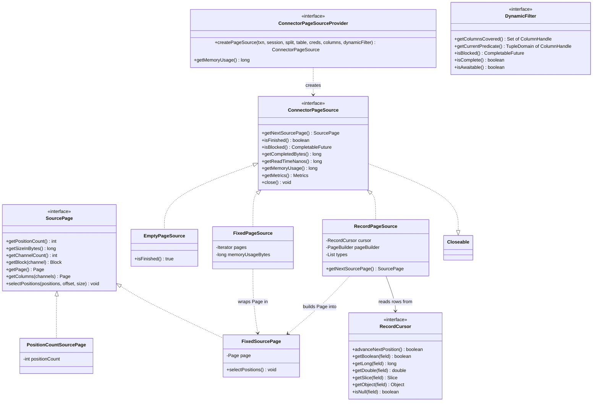
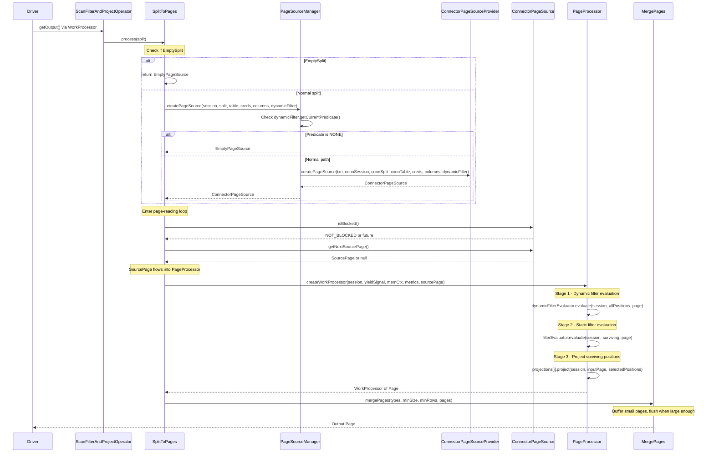
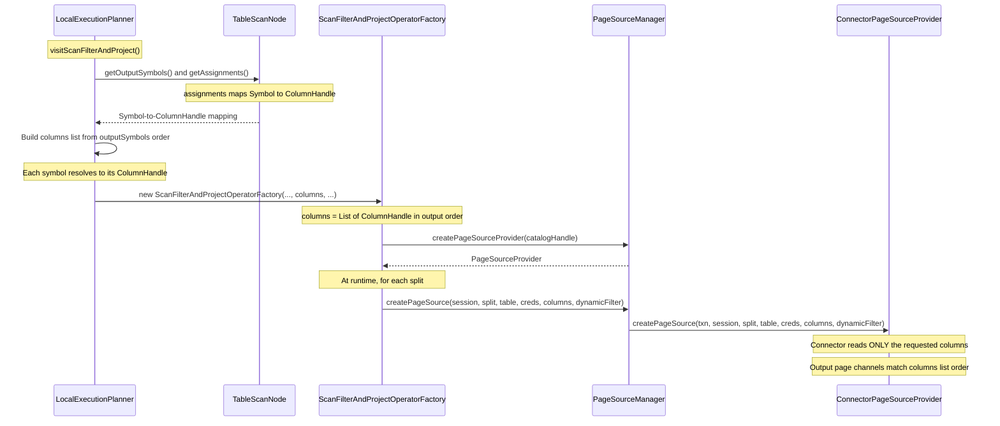
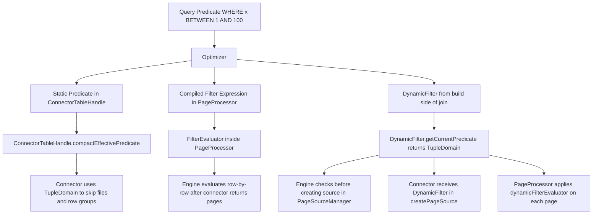
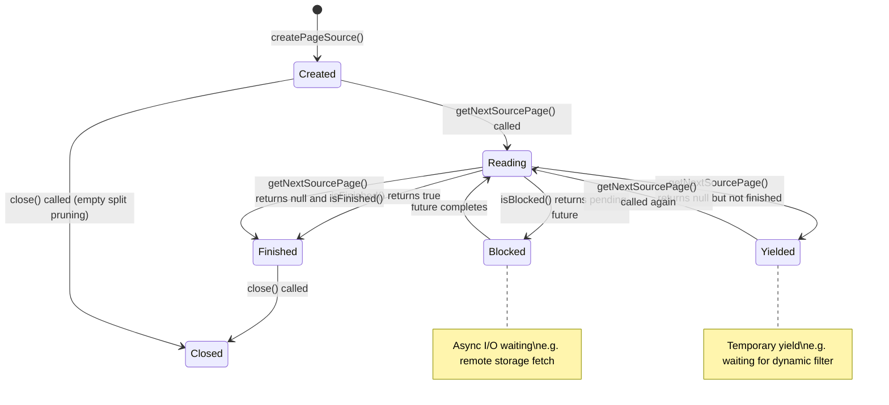
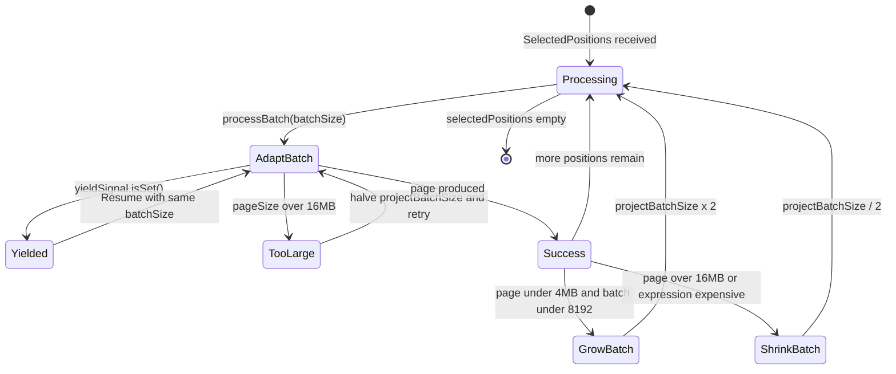

# Module Teardown: The Page Source -- Reading (Storage Plane) (Task 4.3.A)

## Table of Contents

- [0. Research Focus](#0-research-focus)
- [1. High-Level Overview](#1-high-level-overview)
- [2. Structural Architecture](#2-structural-architecture)
  - [ConnectorPageSource Interface](#connectorpagesource-interface)
  - [ConnectorPageSourceProvider.createPageSource Parameters](#connectorpagesourceprovidercreatepagesource-parameters)
  - [Class Diagram](#class-diagram)
- [3. Execution and Call Flow](#3-execution-and-call-flow)
  - [3.1 The Full Pipeline: Split to Output Page](#31-the-full-pipeline-split-to-output-page)
  - [3.2 Column Projection Flow](#32-column-projection-flow)
  - [3.3 Predicate Pushdown Layers](#33-predicate-pushdown-layers)
- [4. Key Implementation Details](#4-key-implementation-details)
  - [4.1 Three Predicate Pushdown Channels](#41-three-predicate-pushdown-channels)
  - [4.2 The SourcePage Abstraction](#42-the-sourcepage-abstraction)
  - [4.3 ScanFilterAndProjectOperator Internal Pipeline](#43-scanfilterandprojectoperator-internal-pipeline)
  - [4.4 The RecordPageSource Adapter](#44-the-recordpagesource-adapter)
  - [4.5 Memory Connector: Complete Concrete Example](#45-memory-connector-complete-concrete-example)
  - [4.6 Hive Connector: Production-Grade Example](#46-hive-connector-production-grade-example)
- [5. Lifecycle and State Machine](#5-lifecycle-and-state-machine)
  - [Page Source States](#page-source-states)
  - [PageProcessor Batch Sizing](#pageprocessor-batch-sizing)
- [6. Rust Rewrite Considerations](#6-rust-rewrite-considerations)
  - [6.1 Trait Hierarchy for Page Sources](#61-trait-hierarchy-for-page-sources)
  - [6.2 Column Projection](#62-column-projection)
  - [6.3 Predicate Pushdown with TupleDomain](#63-predicate-pushdown-with-tupledomain)
  - [6.4 The WorkProcessor Pattern](#64-the-workprocessor-pattern)
  - [6.5 Key Differences from Java](#65-key-differences-from-java)
- [7. File Inventory](#7-file-inventory)
  - [SPI Layer (connector-facing interfaces)](#spi-layer-connector-facing-interfaces)
  - [Engine Layer (operator and planning)](#engine-layer-operator-and-planning)
  - [Memory Connector (simplest concrete example)](#memory-connector-simplest-concrete-example)
  - [Hive Connector (production-grade example)](#hive-connector-production-grade-example)


## 0. Research Focus
* **Task ID:** 4.3.A
* **Focus:** Trace the boundary where a "Split" is converted into a stream of `Page` objects. How does the worker pass column projections and predicate pushdowns into the connector?

## 1. High-Level Overview
* **Core Responsibility:** `ConnectorPageSource` is the SPI interface that converts raw connector data (files, network buffers, in-memory stores) into a pull-based stream of `SourcePage` objects. It is the lowest-level reading abstraction visible to the Trino engine. Each page source represents the data for exactly one split of one table, producing columnar pages until exhausted. Above it, the engine's `ScanFilterAndProjectOperator` orchestrates pull-based iteration, applies compiled filter and projection expressions, and merges small pages into output-sized batches.

* **Key Triggers:** The operator requests the next split from the driver's split queue. The inner `SplitToPages` transformation calls `PageSourceProvider.createPageSource(...)`, which delegates through `PageSourceManager` to the connector's `ConnectorPageSourceProvider`. That factory instantiates the concrete `ConnectorPageSource` for the split. The operator then enters a tight loop calling `getNextSourcePage()` until `isFinished()` returns true.

## 2. Structural Architecture
* **Primary Source Files:**
  - `io.trino.spi.connector.ConnectorPageSource` -- the SPI interface connectors implement
  - `io.trino.spi.connector.ConnectorPageSourceProvider` -- SPI factory: Split plus ColumnHandle list plus DynamicFilter equals ConnectorPageSource
  - `io.trino.spi.connector.SourcePage` -- wrapper interface returned by page sources (supports lazy block loading and position filtering)
  - `io.trino.spi.connector.FixedSourcePage` -- SourcePage backed by a materialized Page
  - `io.trino.spi.connector.PositionCountSourcePage` -- SourcePage with zero channels (position count only)
  - `io.trino.spi.connector.EmptyPageSource` -- immediate-finish sentinel for pruned splits
  - `io.trino.spi.connector.FixedPageSource` -- iterates a pre-built List of Page objects
  - `io.trino.spi.connector.RecordPageSource` -- adapts a row-at-a-time RecordCursor into columnar pages
  - `io.trino.operator.ScanFilterAndProjectOperator` -- engine-side operator that drives the page source
  - `io.trino.operator.project.PageProcessor` -- applies compiled filter and projection expressions
  - `io.trino.split.PageSourceManager` -- engine-side bridge from CatalogHandle to ConnectorPageSourceProvider
  - `io.trino.spi.connector.DynamicFilter` -- runtime predicate that narrows over query lifetime
  - `io.trino.spi.predicate.TupleDomain` -- column-to-domain map encoding pushed-down predicates

* **Key Data Structures:**

### ConnectorPageSource Interface

| Method | Return Type | Purpose |
|--------|-------------|---------|
| `getNextSourcePage()` | `SourcePage` | Pull next batch of rows (null means "yield, try again") |
| `isFinished()` | `boolean` | True when no more pages will be produced |
| `isBlocked()` | `CompletableFuture` | Async readiness signal (NOT_BLOCKED when ready) |
| `getCompletedBytes()` | `long` | Bytes read so far (for stats) |
| `getCompletedPositions()` | `OptionalLong` | Rows read so far (for stats) |
| `getReadTimeNanos()` | `long` | Wall time spent on I/O |
| `getMemoryUsage()` | `long` | Current buffer memory for accounting |
| `getMetrics()` | `Metrics` | Connector-specific metrics exposed via OperatorStats |
| `close()` | `void` | Always called by engine for cleanup |

### ConnectorPageSourceProvider.createPageSource Parameters

| Parameter | Type | Role |
|-----------|------|------|
| `transaction` | `ConnectorTransactionHandle` | Transaction context |
| `session` | `ConnectorSession` | Query/user identity, timezone, session properties |
| `split` | `ConnectorSplit` | Unit of work (file range, partition shard, etc.) |
| `table` | `ConnectorTableHandle` | Carries pushed-down predicates (e.g., `compactEffectivePredicate` in Hive) |
| `tableCredentials` | `Optional of ConnectorTableCredentials` | Credentials for data access |
| `columns` | `List of ColumnHandle` | **Column projection** -- only these columns appear in output pages, in this order |
| `dynamicFilter` | `DynamicFilter` | Runtime predicate that may narrow over time |

### Class Diagram


## 3. Execution and Call Flow

### 3.1 The Full Pipeline: Split to Output Page

The central pipeline has four stages: (1) the operator receives a Split, (2) it creates a ConnectorPageSource via the provider chain, (3) it pulls SourcePages from the source, and (4) the PageProcessor applies filter and projection expressions to produce output Pages.



### 3.2 Column Projection Flow

Column projections are established at query planning time and passed through multiple layers:



### 3.3 Predicate Pushdown Layers

Predicates reach the connector through three distinct channels:



## 4. Key Implementation Details

### 4.1 Three Predicate Pushdown Channels

**Channel 1: Static predicates embedded in ConnectorTableHandle.**
During planning, the optimizer calls `ConnectorMetadata.applyFilter()` which intersects predicates into the table handle. For Hive, this becomes `HiveTableHandle.compactEffectivePredicate` -- a `TupleDomain<HiveColumnHandle>`. The connector uses this at file-open time for Parquet/ORC row-group pruning and partition elimination. This is the deepest pushdown -- it prevents I/O entirely.

**Channel 2: Compiled filter expressions in PageProcessor.**
Predicates the connector cannot fully handle remain as compiled `FilterEvaluator` instances inside `PageProcessor`. The engine evaluates these against every page returned by the connector. The `FilterEvaluator` sealed interface has columnar-optimized implementations (`ColumnarFilterEvaluator`, `AndFilterEvaluator`, `OrFilterEvaluator`) that operate on `SelectedPositions` bitsets rather than row-at-a-time evaluation. `DictionaryAwareColumnarFilter` avoids redundant evaluation when blocks use dictionary encoding.

**Channel 3: DynamicFilter -- runtime predicate narrowing.**
The `DynamicFilter` interface provides a `TupleDomain<ColumnHandle>` that narrows over query lifetime as the build side of a join produces values. It flows into three points:
1. **PageSourceManager**: checks `dynamicFilter.getCurrentPredicate()` before even creating a page source -- if NONE, returns `EmptyPageSource`.
2. **Connector's createPageSource**: receives the DynamicFilter for connector-level integration (e.g., memory connector's `DynamicFilteringPageSource` applies it row-by-row).
3. **PageProcessor**: the `dynamicFilterEvaluator` compiled via `DynamicPageFilter` evaluates it as a columnar filter before the static filter.

### 4.2 The SourcePage Abstraction

`SourcePage` (added in Trino 480) replaces the previous `Page` return type on `getNextSourcePage()`. It provides two critical capabilities:

1. **Lazy block access**: `getBlock(channel)` may trigger deferred deserialization in connector implementations (e.g., Parquet lazy column readers). The `InputChannels` class creates an `InputChannelsSourcePage` view that only materializes the channels needed by each projection.

2. **Position-level filtering**: `selectPositions(positions, offset, size)` mutates the page to mask out filtered rows. `FixedSourcePage` implements this by calling `page.getPositions(...)`. The memory connector's `DynamicFilteringPageSource` uses this to filter at the source level rather than copying.

### 4.3 ScanFilterAndProjectOperator Internal Pipeline

The operator uses the `WorkProcessor` framework to compose a multi-stage pipeline:

```
Split --> SplitToPages --> ConnectorPageSourceToPages --> PageProcessor --> MergePages --> Output
```

**SplitToPages** (`WorkProcessor.Transformation<Split, WorkProcessor<Page>>`): Receives one split at a time. Creates the page source. Checks for `EmptySplit`. Increments `dynamicFilterSplitsProcessed` counter. Returns a nested `WorkProcessor<Page>` for the split's data.

**ConnectorPageSourceToPages** (`WorkProcessor.Process<SourcePage>`): The inner pull loop. Calls `pageSource.isBlocked()` to handle async I/O. Calls `pageSource.getNextSourcePage()`. Updates operator stats (processedPositions, physicalBytes, readTimeNanos, metrics). Returns `ProcessState.blocked(future)` for async sources or `ProcessState.yielded()` when the source returns null but is not finished.

**PageProcessor.createWorkProcessor**: Takes one `SourcePage`. Applies `dynamicFilterEvaluator`, then `filterEvaluator`, producing `SelectedPositions`. If projections exist, creates `ProjectSelectedPositions` which processes positions in adaptive batches (starting at 1, doubling up to `MAX_BATCH_SIZE=8192`, halving when pages exceed `MAX_PAGE_SIZE_IN_BYTES=16MB`).

**MergePages**: Buffers small output pages and flushes when accumulated size exceeds the configured minimum (default thresholds from session properties). Avoids synchronization overhead from producing many tiny pages after high-selectivity filters.

### 4.4 The RecordPageSource Adapter

For connectors that implement the simpler `ConnectorRecordSetProvider` (row-at-a-time API), the engine wraps them in `RecordPageSourceProvider` which creates a `RecordPageSource`. This adapter:
- Buffers 4096 rows per batch (`ROWS_PER_REQUEST`)
- Builds pages via `PageBuilder` with typed writes per Java type (boolean, long, double, Slice, Object)
- Only returns a page when the buffer is full or the cursor is exhausted
- The `ConnectorRecordSetProvider.getRecordSet()` receives the same `columns` list, so column projection is honored

### 4.5 Memory Connector: Complete Concrete Example

The memory connector demonstrates all SPI contracts in minimal code:

**MemoryColumnHandle**: A Java record carrying `columnIndex`, `name`, and `type`. The `columnIndex` is the physical position in the stored pages.

**MemorySplit**: Carries `tableId`, `partNumber`/`totalPartsPerWorker` (for parallel reads), `expectedRows`, and `limit`.

**MemoryTableHandle**: Carries `limit` and `sampleRatio` -- predicates pushed down by the optimizer.

**MemoryPageSourceProvider.createPageSource**:
1. Casts generic handles to concrete types
2. Extracts `columnIndexes` array from the `List<ColumnHandle>` -- this is column projection
3. Calls `pagesStore.getPages(tableId, partNumber, totalParts, columnIndexes, columnTypes, ...)`
4. The store applies `page.getColumns(columnIndexes)` to project columns physically
5. Wraps result in `DynamicFilteringPageSource` for runtime predicate application

**DynamicFilteringPageSource**: A decorator that:
- Checks `dynamicFilter.isAwaitable()` to defer reading when lazy filtering is enabled
- Gets `dynamicFilter.getCurrentPredicate()` on each `getNextSourcePage()` call
- If predicate is NONE, closes immediately
- Otherwise applies `applyFilter()` which calls `SourcePage.selectPositions()` with matching positions
- Tracks metrics (rows, started, finished) via `Metrics`

### 4.6 Hive Connector: Production-Grade Example

The Hive connector shows the full complexity of a real implementation:

**HivePageSourceProvider.createPageSource**:
1. **Bucket pruning**: Checks `shouldSkipBucket()` using dynamic filter against bucket number
2. **Column mapping**: `ColumnMapping.buildColumnMappings()` classifies columns as REGULAR (from file), PREFILLED (partition keys, synthesized values), INTERIM (needed for bucket validation), or EMPTY (projection invalid for partition schema)
3. **Dynamic partition pruning**: `shouldSkipSplit()` checks prefilled column values against dynamic filter domains
4. **Effective predicate**: Intersects `HiveTableHandle.compactEffectivePredicate` with `dynamicFilter.getCurrentPredicate()` and simplifies via domain compaction
5. **Factory delegation**: Iterates `Set<HivePageSourceFactory>` (Parquet, ORC, etc.) until one returns a page source
6. **Post-processing**: Wraps the raw source in `TransformConnectorPageSource` for column remapping, type coercion, bucket validation

**HivePageSourceFactory** receives `TupleDomain<HiveColumnHandle> effectivePredicate` -- this is what enables Parquet/ORC row-group skipping at the I/O level.

**TransformConnectorPageSource**: A decorator pattern using a `Builder` that constructs per-column transform functions:
- `constantValue(block)`: For partition keys, produces RLE blocks
- `column(index)`: Direct passthrough from source channel
- `transform(index, coercer)`: Applies type coercion
- `dereferenceField(path)`: Projects nested struct fields

The builder produces a `TransformSourcePage` -- a `SourcePage` implementation with lazy block computation (blocks are only transformed when accessed).

## 5. Lifecycle and State Machine

### Page Source States


### PageProcessor Batch Sizing


## 6. Rust Rewrite Considerations

### 6.1 Trait Hierarchy for Page Sources

The `ConnectorPageSource` SPI maps to a Rust trait:

```rust
pub trait ConnectorPageSource: Send {
    fn get_next_source_page(&mut self) -> Result<Option<SourcePage>, TrinoError>;
    fn is_finished(&self) -> bool;
    fn is_blocked(&self) -> Poll<()>;  // or return a Waker-based future
    fn completed_bytes(&self) -> u64;
    fn completed_positions(&self) -> Option<u64>;
    fn read_time_nanos(&self) -> u64;
    fn memory_usage(&self) -> u64;
    fn metrics(&self) -> Metrics;
}
```

**Key design decisions:**
- **Async vs sync**: `isBlocked()` in Java returns `CompletableFuture`. In Rust, this naturally maps to `async fn get_next_page()` or a `Poll`-based approach. Since page sources are consumed by a single operator thread, `async-trait` with a single-threaded executor or `poll_fn` would work.
- **SourcePage ownership**: Java's `SourcePage` is mutable (`selectPositions` mutates internal state). In Rust, this could be `&mut self` on a `SourcePage` struct that wraps `Vec<ArrayRef>` (Arrow), or a builder pattern that creates filtered views.

### 6.2 Column Projection

In Java, column projection is a `List<ColumnHandle>` passed to `createPageSource`. The connector is responsible for reading only those columns. In Rust:

```rust
pub trait ConnectorPageSourceProvider: Send + Sync {
    fn create_page_source(
        &self,
        session: &ConnectorSession,
        split: &dyn ConnectorSplit,
        table: &dyn ConnectorTableHandle,
        columns: &[Arc<dyn ColumnHandle>],  // projection list
        dynamic_filter: Arc<dyn DynamicFilter>,
    ) -> Result<Box<dyn ConnectorPageSource>, TrinoError>;
}
```

Arrow's `RecordBatch::project()` provides zero-cost column projection, making this efficient.

### 6.3 Predicate Pushdown with TupleDomain

`TupleDomain<T>` is a `Map<T, Domain>` where `Domain` is a union of value ranges. In Rust:

```rust
pub struct TupleDomain<T: Hash + Eq> {
    // None means "no rows match" (NONE)
    // Some(empty map) means "all rows match" (ALL)
    domains: Option<HashMap<T, Domain>>,
}
```

The three-channel pushdown model maps well to Rust:
1. Static predicates in `ConnectorTableHandle` (trait object carries data)
2. Compiled filters as closures `Fn(&RecordBatch, &mut Vec<bool>)` (columnar evaluation)
3. `DynamicFilter` as `Arc<dyn DynamicFilter>` with interior mutability for concurrent updates

### 6.4 The WorkProcessor Pattern

Java's `WorkProcessor` is a lazy pull-based stream with yield support. In Rust, this maps to:
- `Iterator` for simple cases
- `Stream` (from futures) for async page sources
- A custom `enum ProcessState<T> { Result(T), Blocked(Future), Yielded, Finished }` for the full semantics

The `flatTransform` + `flatMap` + `transformProcessor` chain in `ScanFilterAndProjectOperator` could be expressed as a custom `Stream` combinator or a state machine.

### 6.5 Key Differences from Java

| Aspect | Java (Trino 480) | Rust Recommendation |
|--------|-------------------|---------------------|
| Page source lifecycle | Closeable with manual close() | `Drop` trait, or explicit `close()` for error reporting |
| SourcePage mutation | selectPositions mutates in place | Either `&mut self` or return new filtered page |
| Memory accounting | getMemoryUsage() polled by operator | jemalloc stats or explicit allocator tracking |
| RecordCursor adapter | RecordPageSource buffers 4096 rows | Arrow RecordBatchBuilder with configurable batch size |
| Type coercion | Runtime TypeCoercer Function of Block to Block | Compile-time generics or Arrow cast kernels |
| DictionaryBlock optimization | DictionaryAwarePageProjection | Arrow DictionaryArray with compute kernels |

## 7. File Inventory

### SPI Layer (connector-facing interfaces)
| File | Path | Purpose |
|------|------|---------|
| ConnectorPageSource.java | `core/trino-spi/.../connector/` | Core pull-based page reading interface |
| ConnectorPageSourceProvider.java | `core/trino-spi/.../connector/` | Factory: Split plus columns plus filter to page source |
| ConnectorPageSourceProviderFactory.java | `core/trino-spi/.../connector/` | Creates provider instances (one per query) |
| ConnectorRecordSetProvider.java | `core/trino-spi/.../connector/` | Simpler row-at-a-time alternative SPI |
| SourcePage.java | `core/trino-spi/.../connector/` | Page wrapper with lazy loading and position filtering |
| FixedSourcePage.java | `core/trino-spi/.../connector/` | SourcePage backed by materialized Page |
| PositionCountSourcePage.java | `core/trino-spi/.../connector/` | Zero-channel SourcePage (count only) |
| EmptyPageSource.java | `core/trino-spi/.../connector/` | Immediate-finish sentinel |
| FixedPageSource.java | `core/trino-spi/.../connector/` | Iterates pre-built Page list |
| RecordPageSource.java | `core/trino-spi/.../connector/` | Adapts RecordCursor to columnar pages |
| RecordCursor.java | `core/trino-spi/.../connector/` | Row-at-a-time reading interface |
| RecordSet.java | `core/trino-spi/.../connector/` | Provides column types and cursor |
| ColumnHandle.java | `core/trino-spi/.../connector/` | Opaque column identifier (marker interface) |
| ConnectorTableHandle.java | `core/trino-spi/.../connector/` | Opaque table identifier carrying pushed predicates |
| ConnectorSession.java | `core/trino-spi/.../connector/` | Session context (user, timezone, properties) |
| DynamicFilter.java | `core/trino-spi/.../connector/` | Runtime-narrowing predicate interface |
| TupleDomain.java | `core/trino-spi/.../predicate/` | Column-to-Domain map for predicate pushdown |

### Engine Layer (operator and planning)
| File | Path | Purpose |
|------|------|---------|
| ScanFilterAndProjectOperator.java | `core/trino-main/.../operator/` | Drives page source, applies filter and project |
| PageProcessor.java | `core/trino-main/.../operator/project/` | Compiled filter and projection evaluation |
| PageProjection.java | `core/trino-main/.../operator/project/` | Interface for single projection expression |
| InputPageProjection.java | `core/trino-main/.../operator/project/` | Pass-through column projection |
| InputChannels.java | `core/trino-main/.../operator/project/` | Maps projection input channels to source page channels |
| MergePages.java | `core/trino-main/.../operator/project/` | Buffers small pages into output-sized batches |
| FilterEvaluator.java | `core/trino-main/.../sql/gen/columnar/` | Sealed interface for columnar filter evaluation |
| DynamicPageFilter.java | `core/trino-main/.../sql/gen/columnar/` | Compiles DynamicFilter into FilterEvaluator at runtime |
| PageSourceManager.java | `core/trino-main/.../split/` | Engine bridge: CatalogHandle to ConnectorPageSourceProvider |
| PageSourceProvider.java | `core/trino-main/.../split/` | Engine-side interface (wraps Session, not ConnectorSession) |
| PageSourceProviderFactory.java | `core/trino-main/.../split/` | Creates PageSourceProvider per catalog |
| RecordPageSourceProvider.java | `core/trino-main/.../split/` | Wraps ConnectorRecordSetProvider as ConnectorPageSourceProvider |
| EmptySplit.java | `core/trino-main/.../split/` | Sentinel split that produces EmptyPageSource |
| LocalExecutionPlanner.java | `core/trino-main/.../sql/planner/` | Compiles TableScanNode into ScanFilterAndProjectOperatorFactory |
| TableScanNode.java | `core/trino-main/.../sql/planner/plan/` | Plan node carrying table, columns (Symbol-to-ColumnHandle map), constraints |

### Memory Connector (simplest concrete example)
| File | Path | Purpose |
|------|------|---------|
| MemoryPageSourceProvider.java | `plugin/trino-memory/.../memory/` | Creates FixedPageSource with DynamicFilter wrapper |
| MemoryColumnHandle.java | `plugin/trino-memory/.../memory/` | Record with columnIndex, name, type |
| MemoryTableHandle.java | `plugin/trino-memory/.../memory/` | Record with id, name, limit, sampleRatio |
| MemorySplit.java | `plugin/trino-memory/.../memory/` | Record with tableId, partNumber, totalParts, expectedRows, limit |
| MemoryPagesStore.java | `plugin/trino-memory/.../memory/` | In-memory page storage with column projection via getColumns() |

### Hive Connector (production-grade example)
| File | Path | Purpose |
|------|------|---------|
| HivePageSourceProvider.java | `plugin/trino-hive/.../hive/` | Full column mapping, predicate intersection, factory delegation |
| HivePageSourceFactory.java | `plugin/trino-hive/.../hive/` | Interface for format-specific readers (Parquet, ORC) |
| HiveTableHandle.java | `plugin/trino-hive/.../hive/` | Carries compactEffectivePredicate, partition info, bucket filter |
| TransformConnectorPageSource.java | `plugin/trino-hive/.../hive/` | Decorator for column remapping, coercion, constant injection |
