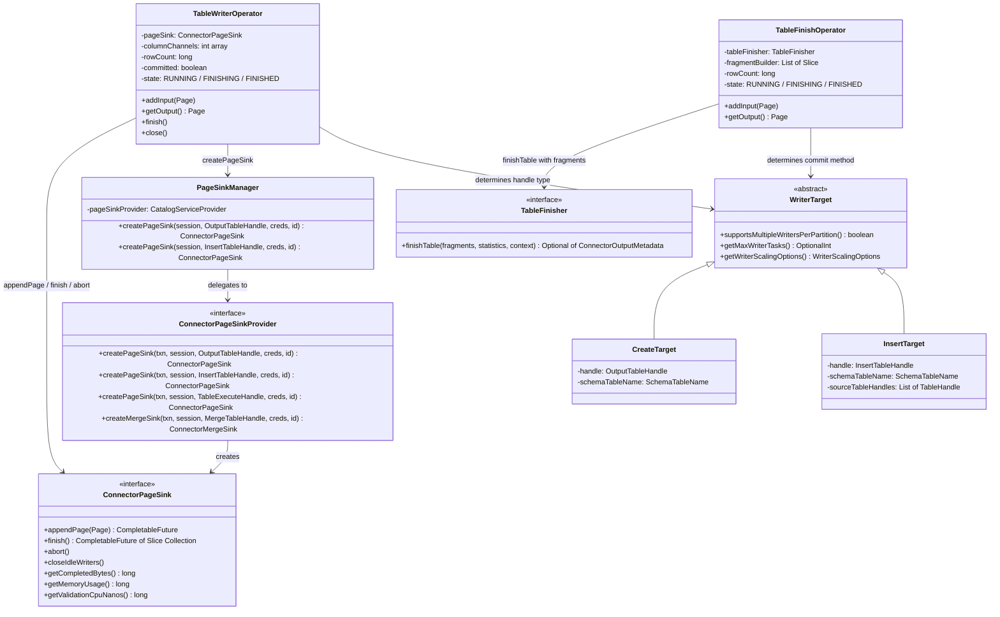
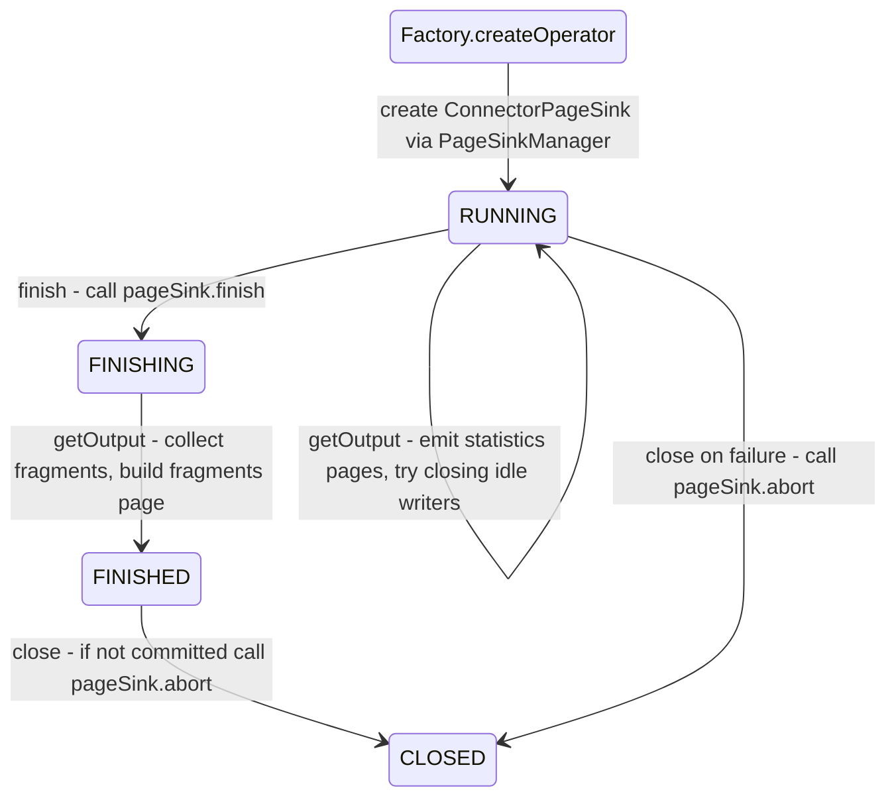
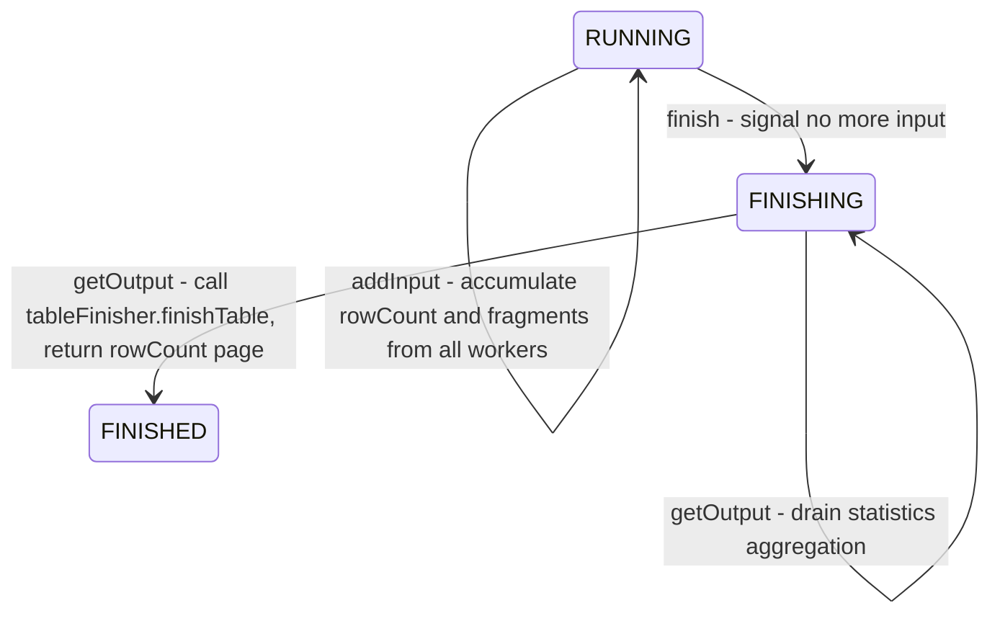
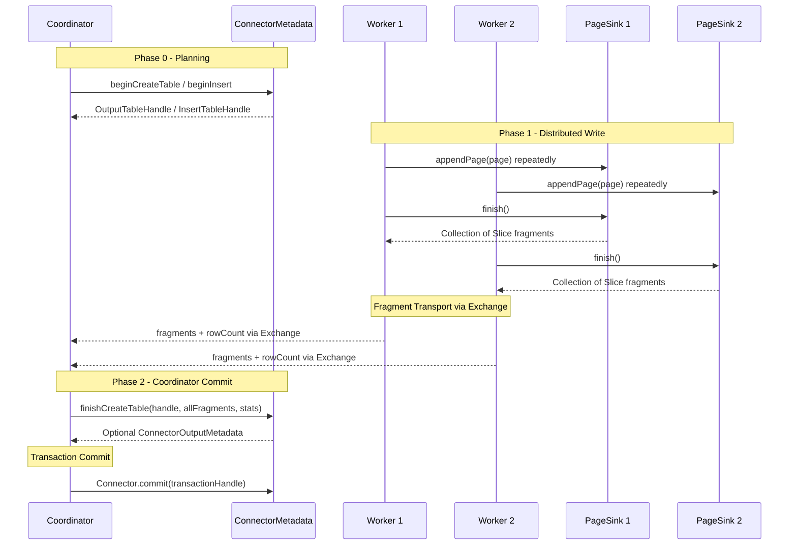

# Module Teardown: The Page Sink -- Writing (Storage Plane) (Task 4.3.B)

## Table of Contents

- [0. Research Focus](#0-research-focus)
- [1. High-Level Overview](#1-high-level-overview)
- [2. Structural Architecture](#2-structural-architecture)
  - [Class Diagram](#class-diagram)
- [3. Lifecycle and Data Flow](#3-lifecycle-and-data-flow)
  - [3.1 Planning Phase: BeginTableWrite](#31-planning-phase-begintablewrite)
  - [3.2 Execution Phase: Worker Side (TableWriterOperator)](#32-execution-phase-worker-side-tablewriteroperator)
  - [3.3 Execution Phase: Coordinator Side (TableFinishOperator)](#33-execution-phase-coordinator-side-tablefinishoperator)
  - [3.4 The Two-Phase Commit Protocol](#34-the-two-phase-commit-protocol)
  - [3.5 The PageSinkManager Routing Layer](#35-the-pagesinkmanager-routing-layer)
  - [3.6 Idle Writer Cleanup](#36-idle-writer-cleanup)
- [4. Concrete Example: Hive Connector Write Path](#4-concrete-example-hive-connector-write-path)
- [5. Multiplexed Statistics Transport](#5-multiplexed-statistics-transport)
- [6. Rust Rewrite Implications](#6-rust-rewrite-implications)
  - [6.1 Core Trait Design](#61-core-trait-design)
  - [6.2 Two-Phase Commit Architecture](#62-two-phase-commit-architecture)
  - [6.3 WriterTarget Dispatch](#63-writertarget-dispatch)
  - [6.4 Memory Management](#64-memory-management)
  - [6.5 Multiplexed Output Channel](#65-multiplexed-output-channel)
  - [6.6 Critical Invariants to Preserve](#66-critical-invariants-to-preserve)
- [7. Key Observations and Design Insights](#7-key-observations-and-design-insights)


## 0. Research Focus
* **Task ID:** 4.3.B
* **Focus:** Trace how data is sent to a connector for `INSERT` or `CREATE TABLE AS` operations. How does the worker handle transaction commits/rollbacks via the connector? Follow the full write lifecycle from operator output through connector sink to commit.

## 1. High-Level Overview
* **Core Responsibility:** The Page Sink subsystem is the write-side counterpart of the PageSource (read) path. It implements a two-phase commit protocol that spans the coordinator and all worker nodes. Workers write data through `ConnectorPageSink` instances into storage (files, partitions, etc.), producing opaque "fragment" descriptors (serialized as `Slice` objects). These fragments flow upward through an Exchange to the coordinator, where a single `TableFinishOperator` collects them all and calls `ConnectorMetadata.finishCreateTable()` or `finishInsert()` to atomically commit the entire write. If any worker fails, the `abort()` path on each sink deletes partially written data. This design means that no connector metadata changes are visible until the coordinator's final commit call succeeds, providing all-or-nothing semantics.
* **Key Triggers:** A write operation begins when the `BeginTableWrite` optimizer fires during planning. It calls `ConnectorMetadata.beginCreateTable()` or `beginInsert()` to obtain a handle. At execution time, each worker's `TableWriterOperator` creates a `ConnectorPageSink` from the handle. Data pages flow into the sink via `appendPage()`. When upstream is exhausted, `finish()` is called on the sink, returning fragments. The `TableFinishOperator` on the coordinator calls `finishCreateTable()`/`finishInsert()` with all collected fragments. On failure, `abort()` is called from `TableWriterOperator.close()`.

## 2. Structural Architecture
* **Primary Source Files:**

| File | Lines | Role |
|------|-------|------|
| `core/.../spi/connector/ConnectorPageSink.java` | 82 | Core SPI: appendPage, finish, abort contract |
| `core/.../spi/connector/ConnectorPageSinkProvider.java` | 139 | Factory SPI: creates sinks for CTAS, INSERT, MERGE, table-execute |
| `core/.../operator/TableWriterOperator.java` | 527 | Worker-side operator: pumps pages into sink, produces fragment page |
| `core/.../operator/TableFinishOperator.java` | 373 | Coordinator-side operator: collects fragments, calls metadata commit |
| `core/.../split/PageSinkManager.java` | 83 | Catalog-aware adapter: routes create calls to correct connector |
| `core/.../split/PageSinkId.java` | 47 | Unique sink ID derived from TaskId (stage + partition + attempt) |
| `core/.../sql/planner/plan/TableWriterNode.java` | 876 | Plan node: carries WriterTarget, column mapping, partitioning scheme |
| `core/.../sql/planner/plan/TableFinishNode.java` | 119 | Plan node: sits above TableWriterNode in the plan tree |
| `core/.../sql/planner/optimizations/BeginTableWrite.java` | ~310 | Optimizer: calls beginCreateTable/beginInsert during planning |
| `core/.../sql/planner/LocalExecutionPlanner.java` | (excerpt) | Wires plan nodes to operator factories for execution |
| `core/.../spi/connector/ConnectorMetadata.java` | (excerpt) | Defines beginCreateTable, finishCreateTable, beginInsert, finishInsert |
| `plugin/.../hive/HivePageSink.java` | 482 | Concrete: partition-aware writer with file splitting and idle cleanup |
| `plugin/.../hive/HivePageSinkProvider.java` | 198 | Concrete: Hive factory creating HivePageSink with writer factories |
| `plugin/.../hive/PartitionUpdate.java` | 213 | Fragment payload: JSON-serializable partition metadata for Hive |
| `plugin/.../iceberg/IcebergPageSink.java` | ~430 | Concrete: Iceberg writer with partition spec and sorted writing |

* **Key Data Structures:**

**ConnectorPageSink Interface Methods:**

| Method | Return Type | Purpose |
|--------|-------------|---------|
| `appendPage(Page)` | `CompletableFuture` | Push a data page into storage. Returns a future for back-pressure |
| `finish()` | `CompletableFuture of Collection of Slice` | Close all writers, return opaque fragment descriptors |
| `abort()` | `void` | Roll back all written data (delete partial files) |
| `closeIdleWriters()` | `void` | Close partition writers that received no data recently |
| `getCompletedBytes()` | `long` | Track physical bytes written so far |
| `getMemoryUsage()` | `long` | Report memory for pool accounting |
| `getValidationCpuNanos()` | `long` | CPU time spent on optional data validation |

**TableWriterOperator Output Page Layout:**

| Channel | Type | Content |
|---------|------|---------|
| 0 (ROW_COUNT_CHANNEL) | BIGINT | Number of rows written, or NULL for statistics rows |
| 1 (FRAGMENT_CHANNEL) | VARBINARY | Opaque fragment Slice from ConnectorPageSink.finish, or NULL |
| 2+ (STATS_START_CHANNEL...) | varies | Pre-aggregated table statistics, or NULL for fragment rows |

**WriterTarget Hierarchy:**

| Target Class | Handle Type | Operation |
|-------------|-------------|-----------|
| CreateReference | (planning only) | CTAS before begin call |
| CreateTarget | OutputTableHandle | CTAS after beginCreateTable |
| InsertReference | (planning only) | INSERT before begin call |
| InsertTarget | InsertTableHandle | INSERT after beginInsert |
| RefreshMaterializedViewTarget | InsertTableHandle | MV refresh |
| TableExecuteTarget | TableExecuteHandle | ALTER TABLE ... EXECUTE |
| MergeTarget | MergeHandle | SQL MERGE operations |

**PageSinkId Encoding (from TaskId):**

| Bits | Field | Range |
|------|-------|-------|
| Bits 63-32 | stageId | Full 32-bit integer |
| Bits 31-8 | partitionId | 24 bits (max 16M) |
| Bits 7-0 | attemptId | 8 bits (max 256) |

### Class Diagram



## 3. Lifecycle and Data Flow

### 3.1 Planning Phase: BeginTableWrite

Before execution begins, the `BeginTableWrite` optimizer rewrites the plan to call `beginCreateTable()` or `beginInsert()` on the connector metadata. This is where the connector allocates staging resources (temporary directories, transaction IDs, etc.).

**Planning Flow:**
1. Planner creates `TableWriterNode` with a `CreateReference` or `InsertReference` (placeholders)
2. `BeginTableWrite.visitTableFinish()` finds the target and calls `createWriterTarget()`
3. For CTAS: calls `metadata.beginCreateTable(session, catalog, tableMetadata, layout, replace)` which returns an `OutputTableHandle`
4. For INSERT: calls `metadata.beginInsert(session, tableHandle, columns)` which returns an `InsertTableHandle`
5. The placeholder target is replaced with `CreateTarget(OutputTableHandle, ...)` or `InsertTarget(InsertTableHandle, ...)`
6. The resulting plan tree is: `TableFinishNode` -- Exchange (gather) -- `TableWriterNode` -- source pipeline

### 3.2 Execution Phase: Worker Side (TableWriterOperator)



**Detailed addInput Flow:**
1. `TableWriterOperator.addInput(page)` receives a page from upstream
2. Forwards the full page to `statisticAggregationOperator.addInput(page)` for stats collection
3. Extracts only the data columns via `page.getColumns(columnChannels)` (strips any non-data columns)
4. Calls `pageSink.appendPage(filteredPage)` which returns a `CompletableFuture` for back-pressure
5. Updates memory tracking via `pageSink.getMemoryUsage()`
6. Increments `rowCount` by `page.getPositionCount()`
7. Records physical written bytes via `pageSink.getCompletedBytes()`

**Detailed finish and getOutput Flow:**
1. `finish()` is called when upstream is exhausted
2. Sets state to `FINISHING`, calls `pageSink.finish()` which returns `CompletableFuture<Collection<Slice>>`
3. On next `getOutput()`, when the finish future completes, calls `createFragmentsPage()`
4. `createFragmentsPage()` builds a page with: one row for [rowCount, NULL], then one row per fragment [NULL, fragmentSlice]
5. Sets `committed = true` and state to `FINISHED`

**Abort Path:**
- In `close()`, if `committed == false`, calls `pageSink.abort()`
- This handles both normal failure (operator never finished) and abnormal failure (exception during processing)

### 3.3 Execution Phase: Coordinator Side (TableFinishOperator)



**Detailed addInput Flow (Fragment Collection):**
1. Receives pages from the Exchange (each page from a different worker's TableWriterOperator)
2. For each position in the page:
   - If `rowCountBlock` is not null: adds the value to cumulative `rowCount`
   - If `fragmentBlock` is not null: adds the `Slice` to `fragmentBuilder`
3. Extracts statistics rows (positions where both rowCount and fragment are NULL) and sends them to `statisticsAggregationOperator`

**Detailed getOutput Flow (Commit Protocol):**
1. First drains all statistics from the aggregation operator into `computedStatisticsBuilder`
2. When statistics are exhausted and state is FINISHING:
   - Calls `tableFinisher.finishTable(fragments, computedStatistics, tableExecuteContext)`
   - For CTAS: this calls `metadata.finishCreateTable(session, handle, fragments, statistics)`
   - For INSERT: this calls `metadata.finishInsert(session, handle, sourceTableHandles, fragments, statistics)`
3. Returns a page with a single BIGINT column containing the total row count

### 3.4 The Two-Phase Commit Protocol



**On Failure (Abort Path):**
- If any worker fails, the task is cancelled
- Each `TableWriterOperator.close()` checks `committed == false` and calls `pageSink.abort()`
- The coordinator never calls `finishCreateTable()` / `finishInsert()`
- The connector's `Connector.rollback(transactionHandle)` is called instead of `commit()`
- In Hive, `abort()` iterates all writers and calls `rollback()` on each, deleting partial files

### 3.5 The PageSinkManager Routing Layer

The `PageSinkManager` bridges Trino's internal handle types to the connector SPI. It:
1. Receives an engine-level handle (e.g., `OutputTableHandle` containing `CatalogHandle` + `ConnectorTransactionHandle` + `ConnectorOutputTableHandle`)
2. Looks up the correct `ConnectorPageSinkProvider` for the catalog via `CatalogServiceProvider`
3. Creates a `ConnectorSession` for the catalog
4. Delegates to `provider.createPageSink(txnHandle, connectorSession, connectorHandle, credentials, pageSinkId)`

The `PageSinkId` is derived from the `TaskId` by encoding stageId, partitionId, and attemptId into a single 64-bit long. This ensures each sink instance across a query has a unique identifier, critical for retry support.

### 3.6 Idle Writer Cleanup

To prevent memory exhaustion during partitioned writes, `TableWriterOperator.getOutput()` periodically calls `tryClosingIdleWriters()`:
1. Checks if physical written data has grown beyond `idleWriterMinDataSizeThreshold * writerCount` since the last check
2. If yes, calls `pageSink.closeIdleWriters()`
3. The Hive implementation closes writers that have not received data since the last call (tracked via `activeWriters` boolean list), provided they have written more than `idleWriterMinFileSize` bytes
4. Closed writers produce a `PartitionUpdate` fragment immediately, and the writer slot is set to null (can be reopened if new data arrives for that partition)

This is triggered based on a `blocked_timeout` set on the DriverContext, so `getOutput()` is called periodically even when no new pages arrive.

## 4. Concrete Example: Hive Connector Write Path

**HivePageSink.appendPage() mechanics:**
1. Calls `getWriterIndexes(page)` which uses a `PageIndexer` to map each row to a (partition, bucket) pair
2. For each unique writer index, creates a `HiveWriter` if one does not exist (via `HiveWriterFactory.createWriter()`)
3. Splits rows by writer index and appends filtered pages to each `HiveWriter`
4. If a writer exceeds `targetMaxFileSize`, closes it and creates a new one for the same partition (file splitting)
5. Tracks `writtenBytes` and `memoryUsage` delta per writer

**HivePageSink.finish() mechanics:**
1. Iterates all writers, calling `writer.commit()` on each (flushes and closes the file)
2. Each closed writer produces a `PartitionUpdate` containing: partition name, updateMode (NEW/APPEND/OVERWRITE), writePath, targetPath, fileNames, rowCount, data sizes
3. Serializes each `PartitionUpdate` to JSON and wraps it as a `Slice`
4. Returns `ImmutableList.copyOf(partitionUpdates)` as the fragment collection

**HiveMetadata.finishCreateTable() mechanics:**
1. Deserializes all `Slice` fragments back to `PartitionUpdate` objects
2. Merges partition updates from different workers (sums row counts, concatenates file names)
3. Builds the Hive `Table` object with storage format, partitioning, etc.
4. Calls the Hive metastore to register the table and its partitions
5. Moves files from staging directories to final locations

**Iceberg follows the same pattern** but its fragment payload is `CommitTaskData` (containing data file path, partition data, metrics, file format) and the coordinator commit appends `DataFile` entries to the Iceberg table's snapshot.

## 5. Multiplexed Statistics Transport

The `TableWriterOperator` multiplexes two kinds of data over the same output channel:

**Fragment rows:** Have non-null values in channels 0-1 (rowCount + fragment) and NULL in channels 2+.

**Statistics rows:** Have NULL in channels 0-1 and real values in channels 2+ (pre-aggregated column statistics).

The `TableFinishOperator.addInput()` demultiplexes them by checking `isStatisticsPosition()`: a position is a statistics row if and only if both channels 0 and 1 are NULL. This works because:
- The row count value (BIGINT) is never NULL in a fragment row (it is always a valid count)
- The fragment value (VARBINARY) is never NULL in a fragment row (the first row after finish has [count, NULL], but subsequent rows have [NULL, fragment])
- Actually, the first position has [rowCount, NULL-fragment] and subsequent positions have [NULL-rowCount, fragment]. So a position with both NULL is guaranteed to be a statistics row

The statistics aggregation in `TableWriterOperator` runs as PARTIAL, and the one in `TableFinishOperator` runs as FINAL. Together they produce `ComputedStatistics` objects that the connector can use to update table/column statistics in the metastore.

## 6. Rust Rewrite Implications

### 6.1 Core Trait Design
The `ConnectorPageSink` interface maps naturally to a Rust trait:

```
trait ConnectorPageSink: Send {
    fn append_page(&mut self, page: &Page) -> impl Future<Output = Result<()>>;
    fn finish(&mut self) -> impl Future<Output = Result<Vec<Bytes>>>;
    fn abort(&mut self) -> Result<()>;
    fn close_idle_writers(&mut self) {}
    fn completed_bytes(&self) -> u64 { 0 }
    fn memory_usage(&self) -> u64 { 0 }
    fn validation_cpu_nanos(&self) -> u64 { 0 }
}
```

Key design decisions:
- The `CompletableFuture` return types become Rust `Future` or `async fn` -- this is natural for Rust's async model
- The `Slice` fragments become `Bytes` (from the `bytes` crate) -- opaque byte buffers
- The back-pressure signaling via futures translates well to Rust's `Poll::Pending`

### 6.2 Two-Phase Commit Architecture
The two-phase commit protocol (begin on coordinator, write on workers, finish on coordinator) must be preserved. Key considerations:
- Fragment serialization format can use `serde` with any codec (JSON, bincode, etc.)
- The `PageSinkId` encoding is trivial to replicate (bit-packing stageId/partitionId/attemptId)
- The abort-on-close pattern should use `Drop` in Rust, but care is needed since `Drop` cannot be async. Consider a synchronous `abort()` or spawn a blocking task

### 6.3 WriterTarget Dispatch
The `WriterTarget` hierarchy (CreateTarget, InsertTarget, etc.) can be modeled as a Rust enum:

```
enum WriterTarget {
    Create { handle: OutputTableHandle, ... },
    Insert { handle: InsertTableHandle, ... },
    TableExecute { handle: TableExecuteHandle, ... },
    Merge { handle: MergeHandle, ... },
    RefreshMaterializedView { handle: InsertTableHandle, ... },
}
```

This is cleaner than Java's class hierarchy and matches idiomatically.

### 6.4 Memory Management
- The `pageSinkMemoryContext` reservation pattern needs a Rust equivalent. Consider an RAII guard that reserves memory from a pool and releases on drop
- The `tryClosingIdleWriters()` mechanism can use a timer-based approach rather than polling in `getOutput()`
- The peak memory tracking (`pageSinkPeakMemoryUsage`) is a simple `AtomicU64::fetch_max`

### 6.5 Multiplexed Output Channel
The fragment+statistics multiplexing over a single output page is an implementation detail that could be simplified in Rust. Consider:
- Using separate channels (one for fragments, one for statistics) instead of NULL-column multiplexing
- Or using a Rust enum payload per row to make the demultiplexing explicit

### 6.6 Critical Invariants to Preserve
1. **Atomicity:** No metadata changes are visible until `finishCreateTable`/`finishInsert` succeeds on the coordinator
2. **Abort safety:** Every `ConnectorPageSink` must be either `finish()`-ed or `abort()`-ed, never both, never neither
3. **Fragment opacity:** The engine treats fragment `Slice`/`Bytes` as opaque. Only the connector that produced them can interpret them
4. **Single-statement writes:** The `Connector.isSingleStatementWritesOnly()` flag (true by default) means the engine uses auto-commit mode for writes, allowing connectors to write immediately without buffering until transaction commit

## 7. Key Observations and Design Insights

1. **Fragments are the coordination currency.** The entire write protocol hinges on opaque `Slice` fragments. Workers produce them, the Exchange transports them, and the coordinator passes them to the connector's metadata layer for final commit. This design completely decouples the write path from the commit path -- the engine does not need to understand what a fragment contains.

2. **The BeginTableWrite optimizer is acknowledged as a hack.** The source code comment says: "Major HACK alert!!! This logic should be invoked on query start, not during planning." The `beginCreateTable`/`beginInsert` calls happen during plan optimization, not at a proper pre-execution step. This means connector state is allocated during planning, which complicates plan caching and retry. A Rust rewrite could fix this by moving begin calls to a proper pre-execution phase.

3. **Statistics piggyback on the fragment channel.** Rather than using a separate communication path, statistics rows are multiplexed with fragment rows using NULL-column conventions. This avoids adding a separate Exchange for statistics but adds complexity to the demultiplexing logic. The TableWriterOperator runs PARTIAL aggregation, and the TableFinishOperator runs FINAL aggregation.

4. **Idle writer cleanup is a memory optimization, not a correctness requirement.** The `closeIdleWriters()` protocol exists because partitioned writes can open hundreds of file writers simultaneously. Without cleanup, a long-running write with many partitions would exhaust memory. The timer-based trigger (via `blocked_timeout` on the DriverContext) ensures cleanup happens even when no new data arrives.

5. **The ConnectorPageSinkProvider has four creation methods** covering CTAS, INSERT, table-execute, and MERGE. The MERGE path returns a `ConnectorMergeSink` instead of `ConnectorPageSink`, reflecting that MERGE operations require per-row operation codes (INSERT=1, DELETE=2, UPDATE=3, etc.) rather than pure appends.

6. **Writer scaling is connector-controlled.** The `WriterScalingOptions` record on each WriterTarget controls whether the engine can dynamically add writer tasks or per-task writer threads. The connector (not the engine) decides the scaling policy via `getWriterScalingOptions()` on its metadata, respecting connector-specific constraints like Hive bucket counts.

7. **The HivePageSink handles file splitting transparently.** When a single partition's file exceeds `targetMaxFileSize`, the sink closes the current writer and opens a new one with a different file name. The coordinator-side `PartitionUpdate.mergePartitionUpdates()` merges fragments from different workers and from split files within the same worker, summing row counts and concatenating file names.
