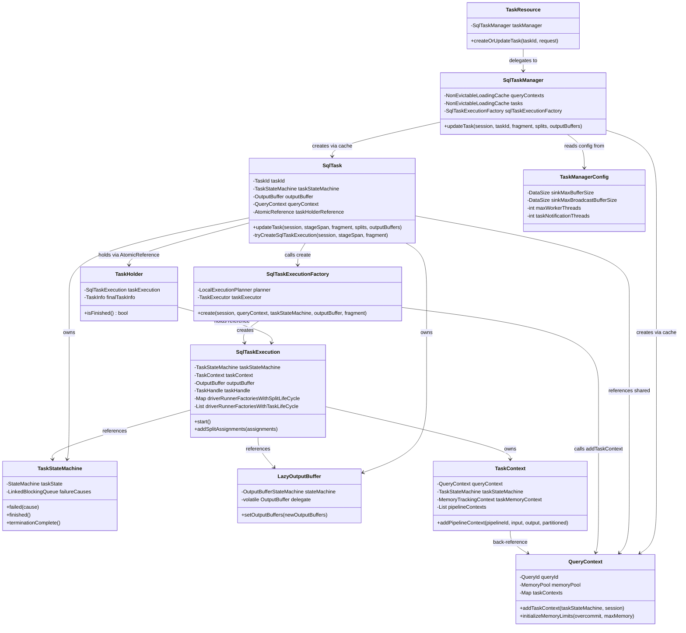
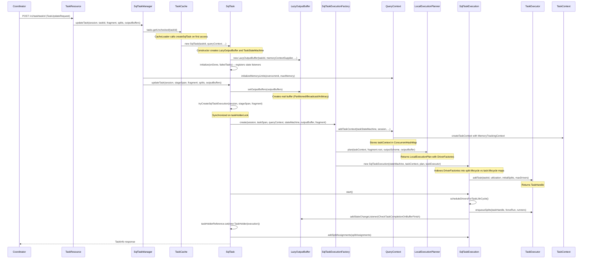

# Module Teardown: Task Creation & Resource Wiring (Task 2.1.A)

## Table of Contents

- [0. Research Focus](#0-research-focus)
- [1. High-Level Overview](#1-high-level-overview)
- [2. Structural Architecture](#2-structural-architecture)
  - [Class Diagram](#class-diagram)
- [3. Execution & Call Flow](#3-execution-call-flow)
  - [Sequence Diagram](#sequence-diagram)
- [4. Concurrency & State Management](#4-concurrency-state-management)
  - [Threading Model](#threading-model)
  - [State Machine](#state-machine)
  - [Synchronization](#synchronization)
- [5. Memory & Resource Profile](#5-memory-resource-profile)
  - [Allocation Pattern](#allocation-pattern)
  - [Memory Tracking](#memory-tracking)
- [6. Key Design Insights](#6-key-design-insights)
- [7. Porting Considerations (Java to Rust)](#7-porting-considerations-java-to-rust)
  - [Translation Blockers](#translation-blockers)
  - [Recommended Abstractions](#recommended-abstractions)


## 0. Research Focus
* **Task ID:** 2.1.A
* **Focus:** How is a `SqlTask` initialized when a `TaskUpdateRequest` hits the worker? What triggers its creation? Trace how it wires up the `OutputBuffer`, `QueryContext`, and `TaskStateMachine` at birth.

## 1. High-Level Overview
* **Core Responsibility:** When the coordinator sends a `TaskUpdateRequest` to a worker node, the worker must create a `SqlTask`, wire it to a `QueryContext` (memory), a `TaskStateMachine` (lifecycle), and a `LazyOutputBuffer` (result streaming), then produce a `SqlTaskExecution` that compiles the plan fragment into driver pipelines. The system is designed so that `SqlTask` objects are created lazily upon first reference, are reusable across multiple update calls (splits arrive incrementally), and are fully thread-safe.
* **Key Triggers:** The HTTP POST to `/v1/task/{taskId}` carrying a `TaskUpdateRequest` is the sole trigger. The coordinator calls this endpoint to (a) create a new task with a plan fragment, (b) add more splits to an existing task, and/or (c) update output buffer configuration. The first call with a `PlanFragment` triggers the full creation chain.

## 2. Structural Architecture
* **Primary Source Files:**

| File | Lines | Role |
|------|-------|------|
| `SqlTask.java` | 795 | Task lifecycle container, owns OutputBuffer and StateMachine |
| `SqlTaskExecution.java` | 946 | Driver pipeline creation, split scheduling, completion detection |
| `SqlTaskManager.java` | 874 | Singleton task registry, QueryContext cache, entry point for updates |
| `SqlTaskExecutionFactory.java` | 109 | Bridge: creates TaskContext + LocalExecutionPlan + SqlTaskExecution |
| `TaskStateMachine.java` | 219 | Finite state machine for task lifecycle |
| `LazyOutputBuffer.java` | 420 | Lazy-init proxy that defers real buffer creation until OutputBuffers arrive |
| `QueryContext.java` | 360 | Per-query memory accounting, TaskContext factory |
| `TaskContext.java` | 683 | Per-task runtime context (memory tracking, pipeline registry, stats) |
| `TaskManagerConfig.java` | 654 | All configuration knobs (buffer sizes, thread counts, timeouts) |

* **Key Data Structures:**

**SqlTask fields:**

| Field | Type | Purpose |
|-------|------|---------|
| `taskId` | `TaskId` | Unique identifier (queryId + stageId + taskId) |
| `taskInstanceId` | `long` | Random instance ID for detecting stale results |
| `taskStateMachine` | `TaskStateMachine` | Owns the RUNNING/FLUSHING/FINISHED/FAILED state |
| `outputBuffer` | `OutputBuffer` | LazyOutputBuffer created at construction time |
| `queryContext` | `QueryContext` | Shared per-query memory pool reference |
| `taskHolderReference` | `AtomicReference of TaskHolder` | Holds either nothing, a SqlTaskExecution, or final TaskInfo |
| `needsPlan` | `AtomicBoolean` | True until the first PlanFragment arrives |
| `taskStatusVersion` | `AtomicLong` | Monotonically increasing version for long-poll clients |

**TaskHolder (inner class of SqlTask) -- three-phase union type:**

| Phase | taskExecution | finalTaskInfo | Meaning |
|-------|---------------|---------------|---------|
| Empty | null | null | Task created but no plan received yet |
| Running | non-null | null | SqlTaskExecution is active |
| Finished | null | non-null | Terminal -- immutable snapshot of final stats |

**TaskUpdateRequest (record):**

| Field | Type | Purpose |
|-------|------|---------|
| `session` | `SessionRepresentation` | Session properties, catalog, schema |
| `fragment` | `Optional of PlanFragment` | The plan to execute (present on first call) |
| `splitAssignments` | `List of SplitAssignment` | Splits to schedule |
| `outputIds` | `OutputBuffers` | Buffer configuration (partitioned, broadcast, etc.) |
| `dynamicFilterDomains` | `Map of DynamicFilterId to Domain` | Dynamic filter pushdown data |
| `speculative` | `boolean` | Whether this task is speculative |

### Class Diagram



## 3. Execution & Call Flow

### Sequence Diagram



* **Step-by-step text breakdown:**

1. **HTTP Entry (`TaskResource.createOrUpdateTask`):** The coordinator POSTs a `TaskUpdateRequest` to `/v1/task/{taskId}`. The `TaskResource` deserializes the request, reconstructs a `Session` from the `SessionRepresentation`, and delegates to `SqlTaskManager.updateTask()`.

2. **Task Lazy-Creation (`SqlTaskManager.doUpdateTask`):** The `SqlTaskManager` looks up the task in a `NonEvictableLoadingCache`. On first access, the cache's `CacheLoader` fires, calling `SqlTask.createSqlTask()`. This uses a two-phase construction pattern: the constructor builds the object, then `initialize()` registers state-change listeners separately to avoid leaking `this` to other threads during construction.

3. **SqlTask Constructor -- Resource Wiring:** Three critical resources are wired at birth:
   - **`LazyOutputBuffer`**: Created immediately with a *deferred* `memoryContextSupplier` (a lambda `() -> queryContext.getTaskContextByTaskId(taskId).localMemoryContext()`). This is because the `TaskContext` does not exist yet at this point -- it is created later when `SqlTaskExecution` is produced. The lazy supplier bridges this temporal gap.
   - **`TaskStateMachine`**: Created with initial state `RUNNING` and the task notification executor. State change listeners are wired to handle buffer cleanup (abort vs destroy), counter updates, and task-done notifications.
   - **`QueryContext`**: Passed in from the `SqlTaskManager`'s query-level cache. Shared across all tasks of the same query on this worker.

4. **Memory Limit Initialization:** Back in `SqlTaskManager.doUpdateTask`, before calling `sqlTask.updateTask()`, the manager initializes `QueryContext` memory limits if not already done. For fault-tolerant (TASK retry) mode, the limit is set to `Long.MAX_VALUE` (unlimited, relying on `LowMemoryKiller`). Otherwise, it uses the minimum of the session setting and config `queryMaxMemoryPerNode`.

5. **SqlTask.updateTask -- The Trigger:** This method is the core entry point. It first calls `outputBuffer.setOutputBuffers(outputBuffers)` to materialize the `LazyOutputBuffer`'s delegate (e.g., `PartitionedOutputBuffer`, `BroadcastOutputBuffer`, or `ArbitraryOutputBuffer`). Then, if no `SqlTaskExecution` exists yet, it calls `tryCreateSqlTaskExecution()`.

6. **tryCreateSqlTaskExecution -- The Critical Section:** This method is synchronized on `taskHolderLock` to prevent concurrent creation races and to coordinate with termination. Inside the lock:
   - It double-checks that the task is not already finished or terminating.
   - Creates an OpenTelemetry `Span` for the task.
   - Calls `sqlTaskExecutionFactory.create()`.

7. **SqlTaskExecutionFactory.create -- Plan Compilation:** This factory method:
   - Calls `queryContext.addTaskContext(taskStateMachine, session, ...)` to create a `TaskContext` with a full `MemoryTrackingContext`. The memory context has two root aggregated contexts: one for user memory (with reservation handler backed by `MemoryPool.reserve/free`) and one for revocable memory.
   - Calls `planner.plan(taskContext, fragment.root, outputScheme, outputBuffer)` to compile the `PlanFragment` into a `LocalExecutionPlan` containing `DriverFactory` instances.
   - Wraps everything into a new `SqlTaskExecution`.

8. **SqlTaskExecution Constructor -- Pipeline Setup:** The constructor indexes `DriverFactory` objects into three categories:
   - `driverRunnerFactoriesWithSplitLifeCycle`: Partitioned source pipelines (one driver per split, e.g., table scans).
   - `driverRunnerFactoriesWithTaskLifeCycle`: Fixed-count pipelines (e.g., join build, aggregation).
   - `driverRunnerFactoriesWithRemoteSource`: Remote exchange sources.

   It also calls `taskExecutor.addTask()` to register a `TaskHandle` with the global task executor, providing the output buffer utilization function for backpressure.

9. **SqlTaskExecution.start() -- Driver Scheduling:** Called while still inside `tryCreateSqlTaskExecution` but after the constructor. This method:
   - Calls `scheduleDriversForTaskLifeCycle()` to immediately create and enqueue drivers for all task-lifecycle pipelines.
   - Registers a `CheckTaskCompletionOnBufferFinish` listener on the output buffer.
   - Both must happen outside the constructor to avoid leaking `this`.

10. **TaskHolder Update:** After `start()`, the `taskHolderReference` is atomically swapped from the empty `TaskHolder` to one containing the new `SqlTaskExecution`. A `compareAndSet` ensures no concurrent modification.

11. **Split Assignment:** Back in `SqlTask.updateTask()`, splits are assigned via `taskExecution.addSplitAssignments()`. Dynamic filters are also forwarded to the `TaskContext`.

## 4. Concurrency & State Management

### Threading Model

The system uses multiple thread pools, all configurable via `TaskManagerConfig`:

| Pool | Config Key | Default | Purpose |
|------|-----------|---------|---------|
| Task Notification | `task.task-notification-threads` | 5 | State change callbacks, status version bumps |
| HTTP Response | `task.http-response-threads` | 100 | Async HTTP response execution |
| HTTP Timeout | `task.http-timeout-threads` | 3 | Long-poll timeout scheduling |
| Task Yield | `task.task-yield-threads` | 3 | Yield signal scheduling for drivers |
| Driver Timeout | `task.driver-timeout-threads` | 5 | Blocked driver timeout enforcement |
| Task Management | (from `TaskManagementExecutor`) | -- | Periodic cleanup (old tasks, abandoned tasks, stuck splits) |

**Worker threads** (`task.max-worker-threads`, default `availableProcessors * 2`) are managed by the `TaskExecutor` and execute the actual `Driver.processForDuration()` calls via `PrioritizedSplitRunner`.

### State Machine

**TaskState** has a two-phase termination model:

```
RUNNING --> FLUSHING --> FINISHED
                    |
RUNNING --> CANCELING --> CANCELED
                    |
RUNNING --> ABORTING  --> ABORTED
                    |
RUNNING --> FAILING   --> FAILED
```

Key design: Terminating states (`CANCELING`, `ABORTING`, `FAILING`) are intermediate. The system transitions to the terminal state (`CANCELED`, `ABORTED`, `FAILED`) only when `terminationComplete()` is called, which happens after all live drivers have been destroyed (tracked by `DriverAndTaskTerminationTracker.liveCreatedDrivers` reaching zero).

**OutputBuffer BufferState:**

```
OPEN --> NO_MORE_BUFFERS --> FLUSHING --> FINISHED
OPEN --> NO_MORE_PAGES   --> FLUSHING --> FINISHED
OPEN --> ABORTED
OPEN --> FAILED
```

### Synchronization

| Mechanism | Location | Purpose |
|-----------|----------|---------|
| `synchronized(taskHolderLock)` | `SqlTask.tryCreateSqlTaskExecution`, `initialize` | Prevents concurrent SqlTaskExecution creation and coordinates with termination |
| `AtomicReference(TaskHolder)` with `compareAndSet` | `SqlTask` | Lock-free reads of current state (only writes need the lock) |
| `synchronized(this)` on `SqlTaskExecution` | `start()`, `enqueueDriverSplitRunner`, `schedulePartitionedSource`, `updateSplitAssignments`, `checkTaskCompletion` | Protects pending split maps, scheduling state, and driver factory lifecycle |
| `AtomicLong remainingSplitRunners` | `SqlTaskExecution` | Tracks active split runners without locking for the common path |
| `AtomicLong liveCreatedDrivers` | `DriverAndTaskTerminationTracker` | Counts live drivers for termination detection |
| `volatile OutputBuffer delegate` | `LazyOutputBuffer` | Double-checked locking for lazy initialization of the real output buffer |
| `synchronized(this)` on `notifyStatusChanged` | `SqlTask` | Ensures version increment and listener notification are atomic |
| `ThreadLocal SplittableRandom` | `SqlTask` (static) | Contention-free random instance ID generation |

**Critical invariant in `tryCreateSqlTaskExecution`:** The `taskHolderLock` is held from the termination check through to the `taskHolderReference.compareAndSet`. This ensures that if termination starts, no new `SqlTaskExecution` will be created. Conversely, if a `SqlTaskExecution` is created, the termination handler will see it and wait for its drivers to complete.

## 5. Memory & Resource Profile

### Allocation Pattern

Memory is hierarchical and tracked at four levels:

```
MemoryPool (node-level)
  --> QueryContext (per query on this node)
    --> TaskContext via MemoryTrackingContext (per task)
      --> PipelineContext (per pipeline)
        --> DriverContext (per driver instance)
          --> OperatorContext (per operator)
```

The `QueryContext.addTaskContext()` method creates a `MemoryTrackingContext` with two root `AggregatedMemoryContext` instances:
- **User memory**: Backed by `QueryMemoryReservationHandler` that calls `memoryPool.reserve(taskId, tag, delta)`. Enforces per-query limit (`maxUserMemory`).
- **Revocable memory**: Separately tracked, can be reclaimed by spilling.

Each has a guaranteed minimum of 1 MB (`GUARANTEED_MEMORY`).

### Memory Tracking

The `LazyOutputBuffer` constructor receives a `Supplier<LocalMemoryContext>` rather than a direct `LocalMemoryContext`. This lambda `() -> queryContext.getTaskContextByTaskId(taskId).localMemoryContext()` is evaluated lazily because the `TaskContext` does not exist when the `LazyOutputBuffer` is constructed -- it is created later during `SqlTaskExecutionFactory.create()`. The `TaskContext` initializes local memory contexts with the tag `LazyOutputBuffer.class.getSimpleName()`.

Memory limits are initialized in `SqlTaskManager.doUpdateTask`:
- Normal mode: `min(session.queryMaxMemoryPerNode, config.maxQueryMemoryPerNode)`
- Resource overcommit: `memoryPool.getMaxBytes()` (entire pool)
- Fault-tolerant (TASK retry): `Long.MAX_VALUE` (unlimited, pool-level enforcement only)

Key config: `sink.max-buffer-size` (default 32 MB) and `sink.max-broadcast-buffer-size` (default 200 MB) control output buffer memory.

## 6. Key Design Insights

1. **Lazy two-phase construction prevents `this` leaks.** Both `SqlTask` and `TaskContext` use a private constructor + separate `initialize()` method pattern. The constructor builds the object fully; `initialize()` registers callbacks that capture `this`. This prevents half-constructed objects from being visible to callback threads. Code evidence: `SqlTask.createSqlTask()` calls `new SqlTask(...)` then `sqlTask.initialize(onDone, failedTasks)`. Comment at line 180: "this is a separate method to ensure that the `this` reference is not leaked during construction."

2. **`LazyOutputBuffer` bridges a temporal dependency gap.** The output buffer needs a `LocalMemoryContext` for memory tracking, but the `TaskContext` (which owns that context) does not exist until `SqlTaskExecution` is created. The `LazyOutputBuffer` solves this by accepting a `Supplier<LocalMemoryContext>` that is evaluated only when the real buffer delegate is materialized. This decouples construction order from runtime dependency. Code evidence: `SqlTask` constructor lines 172-174.

3. **`TaskHolder` is a discriminated union encoding three lifecycle phases.** Rather than using nullable fields with complex checks, `TaskHolder` has three constructors for three states: empty (no execution yet), running (has `SqlTaskExecution`), and finished (has immutable `TaskInfo`). The `isFinished()` check is a simple null check on `finalTaskInfo`. This pattern is highly portable to Rust enums.

4. **The `taskHolderLock` creates a happens-before edge between termination and creation.** In `tryCreateSqlTaskExecution` (line 564-601), the lock is held while checking `taskStateMachine.getState().isTerminatingOrDone()` AND while setting the new `TaskHolder`. In the `initialize` state change listener (line 194), the same lock is held while checking if a `SqlTaskExecution` exists for immediate termination completion. This two-sided locking ensures no state can be missed.

5. **`taskInstanceId` uses `SplittableRandom` via `ThreadLocal` for contention-free uniqueness.** Rather than using `UUID.randomUUID()` (which contends on `SecureRandom`) or an `AtomicLong` counter, each task gets a random `long` from a thread-local `SplittableRandom` split from a root instance. This gives statistical uniqueness with zero contention. Code evidence: line 92-97 and line 157.

6. **Status version masking prevents premature completion visibility.** In `createTaskStatus()` (lines 406-413), if the task state is `FINISHED` but the `TaskHolder` has neither a `SqlTaskExecution` nor a `FinalTaskInfo`, the status is reported as `RUNNING`. This covers the window between `execution.start()` and the `taskHolderReference` update, ensuring the coordinator does not see an incomplete "finished" state. Comment at line 407 explains this explicitly.

7. **The cache-based task registry uses `getUnchecked` for speculative task creation.** `SqlTaskManager` uses a `NonEvictableLoadingCache<TaskId, SqlTask>` so that calling `tasks.getUnchecked(taskId)` atomically creates the task if it does not exist. This means even `getTaskInfo` or `cancelTask` on a non-existent task will create a placeholder, based on the design assumption that "only tasks that will eventually exist are queried." The cache uses weak values for `QueryContext` (shared across tasks of the same query) allowing GC when no tasks reference it.

8. **Two-phase termination prevents resource leaks.** States like `FAILING` are intermediate: the task enters `FAILING` immediately but only transitions to `FAILED` when all drivers have exited (`DriverAndTaskTerminationTracker.liveCreatedDrivers` reaches 0). This ensures all driver resources (memory, file handles, network connections) are cleaned up before the task is considered done. The `tryCreateNewDriver` method eagerly increments then checks for termination, rolling back if needed, to avoid races.

## 7. Porting Considerations (Java to Rust)

### Translation Blockers

| Java Pattern | Challenge | Rust Equivalent |
|-------------|-----------|-----------------|
| `synchronized(taskHolderLock)` + `AtomicReference` | Mixed locking and lock-free reads | `Arc of RwLock of TaskHolder` or `parking_lot::RwLock` for readers, write lock for mutations |
| `ThreadLocal of SplittableRandom` | ThreadLocal with derived random | `thread_local!` macro with `rand::thread_rng()` |
| `Guava ListenableFuture` + `Futures.addCallback` | Callback-based futures | `tokio::spawn` with `async/await`, or channels |
| `NonEvictableLoadingCache` (Guava) | Auto-loading concurrent map with weak values | `dashmap::DashMap` with explicit loading, or `moka::Cache` for weak-value semantics |
| `volatile OutputBuffer delegate` (double-checked locking) | Lazy initialization with visibility | `OnceLock` or `once_cell::sync::OnceCell` |
| `CopyOnWriteArrayList` for pipeline contexts | Copy-on-write collection | `Arc of RwLock of Vec` or append-only `Vec` behind a lock |
| `WeakReference of Driver` | Weak references for GC-eligible drivers | `std::sync::Weak of Driver` |
| OpenTelemetry Span inheritance | Trace context propagation | `tracing` crate with `tracing-opentelemetry` |

### Recommended Abstractions

1. **`TaskHolder` as a Rust enum:**
```rust
enum TaskHolder {
    Empty,
    Running { execution: Arc<SqlTaskExecution> },
    Finished { info: TaskInfo, io_stats: SqlTaskIoStats, dynamic_filters: VersionedDynamicFilterDomains },
}
```

2. **`TaskState` as a Rust enum with method impls** -- direct translation. The two-phase termination (terminating then done) maps cleanly.

3. **Output buffer lazy init**: Use `tokio::sync::OnceCell` or `OnceLock` for the lazy delegate pattern in `LazyOutputBuffer`. The double-checked locking translates to `get_or_init`.

4. **Memory tracking hierarchy**: Use `Arc`-based parent-child relationships. The `MemoryTrackingContext` and `AggregatedMemoryContext` pattern maps to a tree of `Arc of AtomicI64` counters with parent pointers for rollup.

5. **State machine**: Replace `StateMachine of T` with a generic struct wrapping `Arc of (Mutex of T, tokio::sync::watch::Sender of T)` for state change notification. The `watch` channel provides the equivalent of `FutureStateChange` listeners.

6. **Task cache**: Use `dashmap::DashMap of TaskId, Arc of SqlTask` with `entry().or_insert_with()` for atomic insertion. For `QueryContext` with weak-value semantics, use `Arc/Weak` pairs in the map with periodic cleanup.
