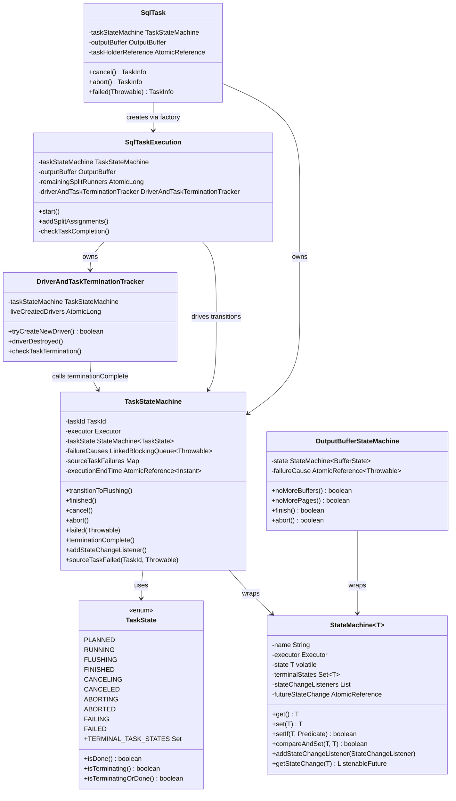
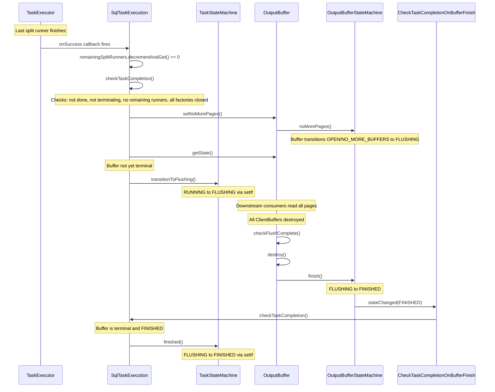
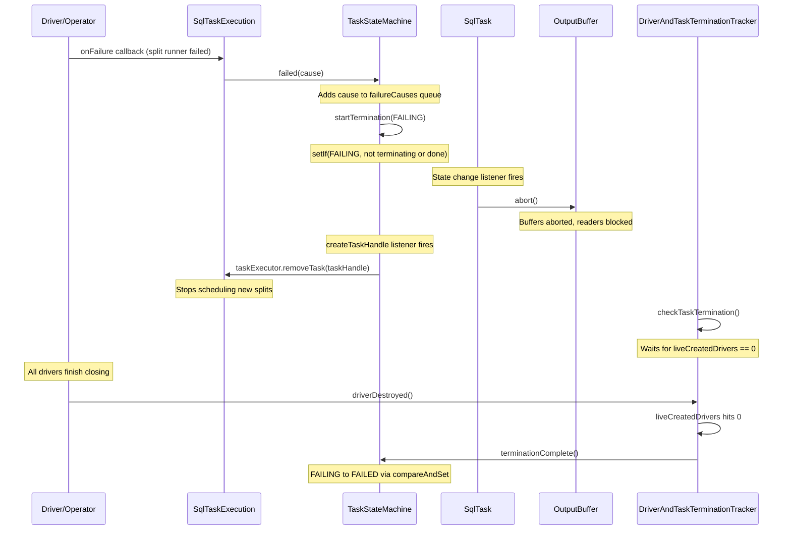
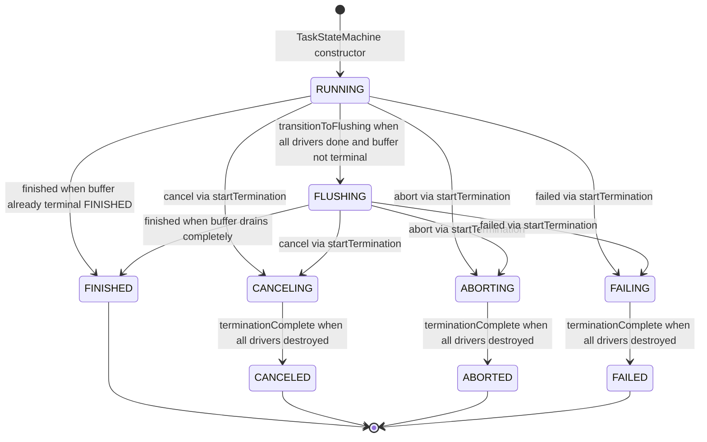

# Module Teardown: Task State Machine & Terminal Transitions (Task 2.1.B)

## Table of Contents

- [0. Research Focus](#0-research-focus)
- [1. High-Level Overview](#1-high-level-overview)
- [2. Structural Architecture](#2-structural-architecture)
  - [Primary Source Files](#primary-source-files)
  - [Key Data Structures](#key-data-structures)
  - [Class Diagram](#class-diagram)
- [3. Execution & Call Flow](#3-execution-call-flow)
  - [Happy-Path Sequence: RUNNING to FLUSHING to FINISHED](#happy-path-sequence-running-to-flushing-to-finished)
  - [Failure Path Sequence: RUNNING to FAILING to FAILED](#failure-path-sequence-running-to-failing-to-failed)
  - [Step-by-step Text Breakdown](#step-by-step-text-breakdown)
- [4. Concurrency & State Management](#4-concurrency-state-management)
  - [Threading Model](#threading-model)
  - [State Machine (CRITICAL)](#state-machine-critical)
  - [Synchronization Patterns](#synchronization-patterns)
  - [Critical Race: Termination Without Execution](#critical-race-termination-without-execution)
- [5. Memory & Resource Profile](#5-memory-resource-profile)
  - [Allocation Pattern](#allocation-pattern)
  - [Memory Tracking](#memory-tracking)
  - [Resource Lifecycle](#resource-lifecycle)
- [6. Key Design Insights](#6-key-design-insights)
- [7. Porting Considerations (Java to Rust)](#7-porting-considerations-java-to-rust)
  - [State Machine Core](#state-machine-core)
  - [Terminal State Guarantees](#terminal-state-guarantees)
  - [Buffer-Task Coordination](#buffer-task-coordination)
  - [Failure Accumulation](#failure-accumulation)
  - [Three-Phase Termination](#three-phase-termination)
  - [Synchronization Simplification](#synchronization-simplification)


## 0. Research Focus
* **Task ID:** 2.1.B
* **Focus:** Trace the full state transitions: PLANNED, RUNNING, FLUSHING, FINISHED (FAILED, CANCELED, ABORTED). What logic determines each transition, with particular emphasis on FLUSHING to FINISHED.

## 1. High-Level Overview
* **Core Responsibility:** `TaskStateMachine` governs the lifecycle of a single Trino task on a worker node. It encapsulates a `StateMachine<TaskState>` that enforces valid transitions from RUNNING through an optional FLUSHING phase (while output buffers drain) to one of four terminal states: FINISHED, CANCELED, ABORTED, or FAILED. It also manages failure cause tracking and source-task failure propagation.
* **Key Triggers:**
  - All split runners complete and output buffer is fully consumed (happy path to FINISHED)
  - Coordinator sends cancel/abort signal (CANCELING path)
  - A driver or planning step throws an exception (FAILING path)
  - Output buffer enters a terminal FINISHED state while task is FLUSHING (triggers re-check that completes the task)

## 2. Structural Architecture

### Primary Source Files

| File | Lines | Role |
|------|-------|------|
| `io.trino.execution.TaskState` | 97 | Enum defining 10 states with `isDone()`, `isTerminating()`, `isTerminatingOrDone()` predicates |
| `io.trino.execution.TaskStateMachine` | 219 | Owns `StateMachine<TaskState>`, exposes transition methods, tracks failure causes and source-task failures |
| `io.trino.execution.StateMachine` | 328 | Generic state machine with CAS-based transitions, listener notification, terminal-state locking |
| `io.trino.execution.SqlTaskExecution` | 946 | Primary driver of happy-path transitions; calls `transitionToFlushing()`, `finished()`, `terminationComplete()` |
| `io.trino.execution.SqlTask` | 795 | Task wrapper that owns `TaskStateMachine` + `OutputBuffer`; handles termination-without-execution and buffer cleanup |
| `io.trino.execution.buffer.OutputBufferStateMachine` | 91 | Buffer-side state machine (OPEN through FLUSHING to FINISHED) |
| `io.trino.execution.buffer.BufferState` | 90 | Enum for buffer lifecycle: OPEN, NO_MORE_BUFFERS, NO_MORE_PAGES, FLUSHING, FINISHED, ABORTED, FAILED |

### Key Data Structures

**TaskState enum fields:**

| State | isDone | isTerminating | Description |
|-------|--------|---------------|-------------|
| PLANNED | false | false | Task planned but not yet scheduled (dependencies not ready) |
| RUNNING | false | false | Task is actively executing drivers |
| FLUSHING | false | false | All drivers done, output buffer draining |
| FINISHED | true | false | All output consumed, terminal success |
| CANCELING | false | true | Cancel requested, drivers still running |
| CANCELED | true | false | Cancel complete, all drivers stopped |
| ABORTING | false | true | Abort requested (query failed elsewhere), drivers still running |
| ABORTED | true | false | Abort complete |
| FAILING | false | true | Local failure, drivers still running |
| FAILED | true | false | Failure complete |

**TaskStateMachine key fields:**

| Field | Type | Purpose |
|-------|------|---------|
| `taskState` | `StateMachine<TaskState>` | Underlying generic state machine, initialized to RUNNING with terminal states {FINISHED, CANCELED, ABORTED, FAILED} |
| `failureCauses` | `LinkedBlockingQueue<Throwable>` | Accumulates failure causes (multiple failures can occur) |
| `sourceTaskFailures` | `Map<TaskId, Throwable>` | Tracks failures from upstream tasks (synchronized) |
| `sourceTaskFailureListeners` | `List<TaskFailureListener>` | Listeners notified when source tasks fail |
| `executionEndTime` | `AtomicReference<Instant>` | Set once when any terminal state is reached |

### Class Diagram



## 3. Execution & Call Flow

### Happy-Path Sequence: RUNNING to FLUSHING to FINISHED



### Failure Path Sequence: RUNNING to FAILING to FAILED



### Step-by-step Text Breakdown

**Happy path (RUNNING to FINISHED):**

1. **All split runners complete.** Each enqueued split runner gets a `ListenableFuture<Void>`. On success, `remainingSplitRunners` is decremented. When it reaches 0, `checkTaskCompletion()` is called.

2. **checkTaskCompletion() evaluates completion conditions** (SqlTaskExecution.java line 449):
   - If task state is already done, return immediately.
   - If task is terminating, delegate to `driverAndTaskTerminationTracker.checkTaskTermination()`.
   - If `remainingSplitRunners != 0`, return (still working).
   - If any `DriverSplitRunnerFactory` reports `!isNoMoreDrivers()`, return (more drivers expected).

3. **Signal output buffer: no more pages** (line 475). Calls `outputBuffer.setNoMorePages()`. This triggers the buffer's state machine to move toward FLUSHING (via `noMorePages()` in `OutputBufferStateMachine`).

4. **Check buffer state** (line 477). If the buffer is not yet in a terminal state, call `taskStateMachine.transitionToFlushing()`. The task moves to FLUSHING.

5. **Buffer drains asynchronously.** Downstream tasks read remaining pages. Each `ClientBuffer` is destroyed when the consumer calls `destroyTaskResults()`. After each destruction, the buffer calls `checkFlushComplete()`.

6. **checkFlushComplete() detects all buffers consumed.** When all `ClientBuffer` instances report `isDestroyed() == true` and the buffer state is FLUSHING, the buffer calls `destroy()` which calls `stateMachine.finish()`, transitioning the buffer to FINISHED.

7. **Buffer state change triggers re-check.** The `CheckTaskCompletionOnBufferFinish` listener (registered during `SqlTaskExecution.start()`) fires when the buffer reaches a terminal state. It calls `checkTaskCompletion()` again.

8. **Second checkTaskCompletion() detects terminal buffer.** Now `bufferState.isTerminal()` is true and `bufferState == BufferState.FINISHED`, so it calls `taskStateMachine.finished()`. This transitions the task from FLUSHING to FINISHED.

**Termination paths (cancel/abort/fail):**

1. **Entry point:** `taskStateMachine.cancel()`, `.abort()`, or `.failed(cause)` is called.

2. **startTermination()** calls `taskState.setIf(terminatingState, currentState -> !currentState.isTerminatingOrDone())`. This guards against double-termination. Only the first termination signal wins.

3. **SqlTask state change listener** (SqlTask.java line 191) fires for the terminating state. Two paths:
   - If no `SqlTaskExecution` exists yet: calls `taskStateMachine.terminationComplete()` immediately.
   - If `SqlTaskExecution` exists: it handles completion via `DriverAndTaskTerminationTracker`.

4. **createTaskHandle listener** (SqlTaskExecution.java line 223) fires: removes the task from the `TaskExecutor` and calls `factory.noMoreDrivers()` on all driver factories.

5. **DriverAndTaskTerminationTracker.checkTaskTermination()** monitors `liveCreatedDrivers`. Each driver registers a `driverDestroyed` callback via `driver.getDestroyedFuture().addListener()`. When all live drivers have been destroyed, `terminationComplete()` is called.

6. **terminationComplete()** (TaskStateMachine.java line 150) performs the final transition:
   - CANCELING to CANCELED
   - ABORTING to ABORTED
   - FAILING to FAILED

## 4. Concurrency & State Management

### Threading Model
- **Notification executor:** All state change listeners fire asynchronously on a dedicated thread pool (`taskNotificationExecutor`). This prevents deadlocks from listener callbacks that attempt further state transitions.
- **Split runner callbacks:** `onSuccess`/`onFailure` from `TaskExecutor` fire on the notification executor.
- **Caller threads:** `cancel()`, `abort()`, `failed()` can be called from any thread (coordinator HTTP handler, scheduler, etc.).
- **Important invariant:** `StateMachine` asserts `!Thread.holdsLock(lock)` before any state transition, preventing nested-lock deadlocks.

### State Machine (CRITICAL)

#### Full State Diagram



#### Transition Guards (exact predicates from code)

| Method | Target State | Guard Predicate | Source (TaskStateMachine.java) |
|--------|-------------|-----------------|-------------------------------|
| `transitionToFlushing()` | FLUSHING | `currentState == RUNNING` | Line 126 |
| `finished()` | FINISHED | `!currentState.isTerminatingOrDone()` | Line 131 |
| `cancel()` | CANCELING | `!currentState.isTerminatingOrDone()` | Line 136 via `startTermination` |
| `abort()` | ABORTING | `!currentState.isTerminatingOrDone()` | Line 141 via `startTermination` |
| `failed(cause)` | FAILING | `!currentState.isTerminatingOrDone()` | Line 146 via `startTermination` |
| `terminationComplete()` | CANCELED/ABORTED/FAILED | `currentState.isTerminating()` (checked explicitly) | Line 150 via `compareAndSet` |

**Key insight about transitionToFlushing():** The guard is `currentState == RUNNING`, which is stricter than the other transitions. FLUSHING can only be entered from RUNNING. This means if a cancel/abort/fail arrives before flushing begins, the task goes directly to a terminating state and never enters FLUSHING.

**Key insight about finished():** The guard `!currentState.isTerminatingOrDone()` means `finished()` can be called from RUNNING or FLUSHING. It is possible to skip FLUSHING entirely if the buffer happens to be in a terminal FINISHED state when `checkTaskCompletion()` first runs (SqlTaskExecution.java lines 483-486).

#### FLUSHING to FINISHED: The Exact Logic

The FLUSHING-to-FINISHED transition requires TWO conditions to be met simultaneously:

1. **Task side:** All split runners have completed, and all `DriverSplitRunnerFactory` instances report `isNoMoreDrivers()`. This is what got us to FLUSHING in the first place.

2. **Buffer side:** The output buffer must reach its own terminal FINISHED state. This happens when:
   - `setNoMorePages()` has been called (done by `checkTaskCompletion()` at line 475).
   - All `ClientBuffer` instances have been destroyed by downstream consumers acknowledging and destroying their buffers.
   - `checkFlushComplete()` in the buffer implementation detects `allMatch(ClientBuffer::isDestroyed)` and calls `destroy()`, which transitions the buffer state machine to FINISHED.

3. **The bridge:** `CheckTaskCompletionOnBufferFinish` (SqlTaskExecution.java line 876) is a `StateChangeListener<BufferState>` registered on the output buffer during `SqlTaskExecution.start()`. When the buffer reaches any terminal state, it calls `checkTaskCompletion()` again. This second invocation sees `bufferState == BufferState.FINISHED` at line 483 and calls `taskStateMachine.finished()`.

The implementation uses a `WeakReference<SqlTaskExecution>` in the listener to avoid preventing GC of dead task execution objects.

### Synchronization Patterns

| Mechanism | Location | What it protects |
|-----------|----------|------------------|
| `synchronized(lock)` in StateMachine | State transitions | Ensures atomic read-modify-write of state + listener snapshot |
| `synchronized(this)` on SqlTaskExecution | `checkTaskCompletion()`, `updateSplitAssignments()`, `schedulePartitionedSource()` | Prevents concurrent completion checks from racing |
| `synchronized(taskHolderLock)` in SqlTask | TaskHolder reference updates | Prevents race between termination-without-execution and SqlTaskExecution creation |
| `AtomicLong remainingSplitRunners` | SqlTaskExecution | Lock-free decrement with completion check at zero |
| `AtomicLong liveCreatedDrivers` | DriverAndTaskTerminationTracker | Lock-free driver count for termination detection |
| `AtomicReference<Instant> executionEndTime` | TaskStateMachine | CAS-based one-shot end time recording |
| `LinkedBlockingQueue<Throwable> failureCauses` | TaskStateMachine | Thread-safe accumulation of multiple failure causes |
| volatile state in StateMachine | Direct reads via `get()` | Allows lock-free state reads (only writes need the lock) |

### Critical Race: Termination Without Execution

When a task receives a cancel/abort/fail before a `SqlTaskExecution` has been created, `SqlTask.initialize()` handles this (lines 192-199):

```java
if (newState.isTerminating()) {
    synchronized (taskHolderLock) {
        if (taskHolderReference.get().getTaskExecution() == null) {
            taskStateMachine.terminationComplete();
        }
    }
}
```

The `taskHolderLock` synchronization prevents a race with `tryCreateSqlTaskExecution()`, which also acquires `taskHolderLock` and checks `taskStateMachine.getState().isTerminatingOrDone()` before creating the execution.

## 5. Memory & Resource Profile

### Allocation Pattern
- **TaskStateMachine itself:** Lightweight. A `StateMachine<TaskState>` (single volatile enum + listener list), a `LinkedBlockingQueue` for failures, and two maps for source failure tracking.
- **Failure causes:** Accumulated in an unbounded `LinkedBlockingQueue<Throwable>`. In practice, usually 0-1 entries. The queue is thread-safe without external locking.
- **State change listeners:** Stored in an `ArrayList` within `StateMachine`, protected by `synchronized(lock)`. Listeners are cleared once a terminal state is reached (line 136 of StateMachine.java), allowing GC of all listener closures.

### Memory Tracking
- **End time tracking:** `executionEndTime` uses `AtomicReference<Instant>` with `compareAndSet(null, Instant.now())` to ensure the end time is recorded exactly once, even with concurrent state changes.
- **Buffer cleanup on terminal states:** `SqlTask.initialize()` ensures output buffer is cleaned up on any terminal/terminating state via `outputBuffer.abort()` (for failures) or `outputBuffer.destroy()` (for success/cancel). A `AtomicBoolean outputBufferCleanedUp` prevents double cleanup.

### Resource Lifecycle
- On FINISHED/CANCELED: `outputBuffer.destroy()` releases all buffer memory.
- On FAILED/ABORTED: `outputBuffer.abort()` releases memory but does NOT signal completion to upstream (important: aborted buffers block readers to prevent false "finished" signals).

## 6. Key Design Insights

**1. Three-Phase Termination Protocol.** Failure/cancel/abort uses a deliberate three-phase approach: (a) enter a "terminating" state (CANCELING/ABORTING/FAILING), (b) wait for all drivers to drain, (c) enter the terminal state. This prevents resource leaks from drivers that are mid-execution when termination is requested.

**2. First-Termination-Wins Semantics.** The guard `!currentState.isTerminatingOrDone()` on `startTermination()` means only the first termination trigger takes effect. If a task is already CANCELING and then a failure occurs, the `failed()` call is silently ignored. However, `failureCauses` accumulates all failure causes regardless of whether the state actually transitions, providing full diagnostic information.

**3. Buffer-Task Coupling via Callback, Not Polling.** The FLUSHING-to-FINISHED transition is event-driven: `CheckTaskCompletionOnBufferFinish` listens for buffer state changes and triggers `checkTaskCompletion()`. This avoids any polling loop. The WeakReference in this listener is a deliberate GC-safety measure.

**4. Skip-FLUSHING Optimization.** If the buffer happens to be in terminal FINISHED state at the moment `checkTaskCompletion()` first runs, the task transitions directly from RUNNING to FINISHED, skipping FLUSHING entirely. This can happen for tasks with no output or when buffer consumers are very fast.

**5. Asymmetric Buffer Cleanup.** FINISHED/CANCELED calls `outputBuffer.destroy()` (signals clean completion to downstream), while FAILED/ABORTED calls `outputBuffer.abort()` (blocks readers). This distinction is critical: if a failed task's buffer signaled "finished," downstream tasks would incorrectly believe they received all data.

**6. Lock-Free Fast Path, Locked Slow Path.** `StateMachine.get()` reads a volatile field without locking. Transitions use `synchronized(lock)` but release the lock before firing listeners (to prevent deadlocks). The `fireStateChanged()` method explicitly asserts `!Thread.holdsLock(lock)`.

**7. Defensive Driver Counting.** `DriverAndTaskTerminationTracker.tryCreateNewDriver()` eagerly increments the counter before checking if termination has started. If termination is detected, it decrements and re-checks. This handles the race where termination starts between the count increment and the state check.

**8. PLANNED State is Vestigial at Task Level.** The `TaskStateMachine` constructor initializes state to RUNNING, not PLANNED. The PLANNED state exists in the `TaskState` enum but is only meaningful at the stage execution level (`PipelinedStageExecution`). Individual task state machines on workers start in RUNNING.

**9. Multiple checkTaskCompletion() Call Sites.** This method is called from four distinct paths: (a) when the last split runner completes, (b) when split assignments are added (since noMoreSplits may have been set), (c) when task lifecycle drivers are first scheduled, and (d) when the output buffer reaches a terminal state. Each call is idempotent due to the state guards.

**10. Source Task Failure Propagation.** The `sourceTaskFailed()` and `addSourceTaskFailureListener()` methods form a separate concern from the task's own state machine. They allow a task to track failures in its upstream dependencies and notify interested parties, without necessarily transitioning the task's own state.

## 7. Porting Considerations (Java to Rust)

### State Machine Core
- The `StateMachine<T>` generic class maps naturally to a Rust enum-based state machine. The `volatile` state field maps to `AtomicCell<TaskState>` or a `Mutex<TaskState>`. The `setIf` with predicate pattern could use a CAS loop on an `AtomicU8` representation of the enum.
- Listener notification should use an async channel or `tokio::sync::watch` rather than Java's executor-based callback model.

### Terminal State Guarantees
- The invariant "no transitions from terminal states" maps well to Rust's ownership model. Once in a terminal state, the state machine could consume itself or return a terminal-state token that prevents further mutation.

### Buffer-Task Coordination
- The `CheckTaskCompletionOnBufferFinish` WeakReference pattern suggests using `Arc<Weak<SqlTaskExecution>>` in Rust. The buffer holds a `Weak` reference and checks if the execution is still alive before calling back.

### Failure Accumulation
- `LinkedBlockingQueue<Throwable>` maps to a `crossbeam::queue::SegQueue<anyhow::Error>` or similar lock-free queue. Consider whether multiple error accumulation is actually needed or if a single `Arc<Mutex<Option<Error>>>` suffices.

### Three-Phase Termination
- The CANCELING/ABORTING/FAILING intermediate states are essential for correctness. In Rust, this maps to a `CancellationToken` plus a `JoinSet` or `WaitGroup` for tracking live drivers. The `tokio_util::sync::CancellationToken` is a natural fit for the cooperative cancellation model.

### Synchronization Simplification
- Java's mix of `synchronized`, `AtomicLong`, `AtomicReference`, and `volatile` can be simplified in Rust. The `remainingSplitRunners` and `liveCreatedDrivers` counters map directly to `AtomicI64`. The `taskHolderLock` pattern (protecting reference swaps) can use `tokio::sync::RwLock<TaskHolder>` or `arc_swap::ArcSwap`.
