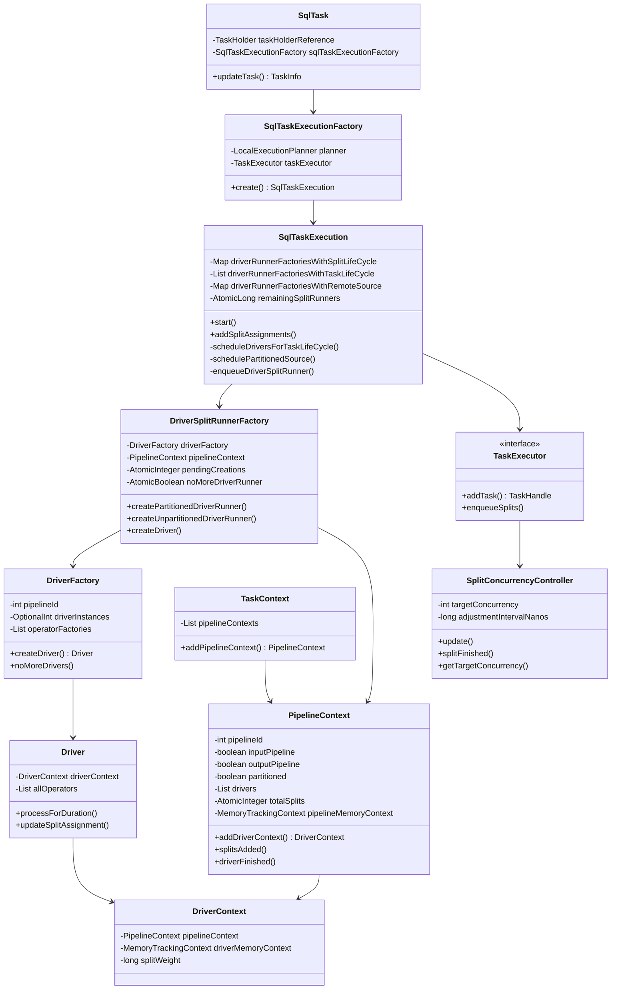
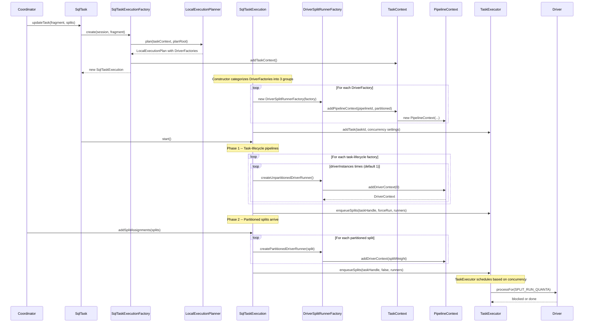

# Module Teardown: The Task-Driver Relationship (Concurrency Scaling) (Task 2.1.C)

## Table of Contents

- [0. Research Focus](#0-research-focus)
- [1. High-Level Overview](#1-high-level-overview)
- [2. Structural Architecture](#2-structural-architecture)
  - [Class Diagram](#class-diagram)
- [3. Execution & Call Flow](#3-execution-call-flow)
  - [Sequence Diagram](#sequence-diagram)
  - [Step-by-step text breakdown](#step-by-step-text-breakdown)
- [4. Concurrency & State Management](#4-concurrency-state-management)
  - [Threading Model](#threading-model)
  - [Adaptive Concurrency Algorithm](#adaptive-concurrency-algorithm)
  - [State Machine: PendingSplitsForPlanNode](#state-machine-pendingsplitsforplannode)
  - [State Machine: Task Completion](#state-machine-task-completion)
  - [Synchronization](#synchronization)
- [5. Memory & Resource Profile](#5-memory-resource-profile)
  - [Allocation Pattern (Hierarchical)](#allocation-pattern-hierarchical)
  - [Memory Tracking](#memory-tracking)
  - [Resource Lifecycle](#resource-lifecycle)
- [6. Key Design Insights](#6-key-design-insights)
  - [Insight 1: Three-Way Pipeline Classification is the Core Concurrency Decision](#insight-1-three-way-pipeline-classification-is-the-core-concurrency-decision)
  - [Insight 2: Concurrency is Adaptive, Not Pre-Planned for Scans](#insight-2-concurrency-is-adaptive-not-pre-planned-for-scans)
  - [Insight 3: DriverSplitRunner is a Lazy Driver Creator](#insight-3-driversplitrunner-is-a-lazy-driver-creator)
  - [Insight 4: Pipeline Ordering Enforces Source Dependencies](#insight-4-pipeline-ordering-enforces-source-dependencies)
  - [Insight 5: Memory Hierarchy Enables Fine-Grained Accounting](#insight-5-memory-hierarchy-enables-fine-grained-accounting)
  - [Insight 6: The Two Executor Models Have Fundamentally Different Scheduling](#insight-6-the-two-executor-models-have-fundamentally-different-scheduling)
  - [Insight 7: Intermediate vs Leaf Split Distinction Prevents Starvation](#insight-7-intermediate-vs-leaf-split-distinction-prevents-starvation)
  - [Insight 8: WeakReference for Driver Tracking in Remote Sources](#insight-8-weakreference-for-driver-tracking-in-remote-sources)
  - [Insight 9: Default Configuration Values Are Hardware-Aware](#insight-9-default-configuration-values-are-hardware-aware)
- [7. Porting Considerations (Java to Rust)](#7-porting-considerations-java-to-rust)
  - [Driver Instance Determination](#driver-instance-determination)
  - [Adaptive Concurrency Controller](#adaptive-concurrency-controller)
  - [Memory Hierarchy](#memory-hierarchy)
  - [Split Runner Lazy Initialization](#split-runner-lazy-initialization)
  - [CopyOnWriteArrayList Replacement](#copyonwritearraylist-replacement)
  - [Synchronization Strategy](#synchronization-strategy)


## 0. Research Focus
* **Task ID:** 2.1.C
* **Focus:** Analyze how a single `SqlTask` creates multiple `PipelineContexts`. Trace the logic that decides how many `Driver` instances to spawn for a single pipeline based on available splits and concurrency settings.

## 1. High-Level Overview
* **Core Responsibility:** The Task-Driver relationship is the mechanism by which Trino translates a logical execution plan into a physically concurrent execution. A single `SqlTask` receives a `LocalExecutionPlan` containing multiple `DriverFactory` instances (one per pipeline). Each factory creates a `PipelineContext` and then spawns one or more `Driver` instances, where the count depends on whether the pipeline is partitioned (one driver per split) or unpartitioned (count determined by `task_concurrency` or fixed at 1). The `TaskExecutor` layer then governs how many of these drivers are allowed to run concurrently using adaptive concurrency controllers.

* **Key Triggers:**
  - `SqlTask.updateTask()` is called by the coordinator with a plan fragment and split assignments, creating the `SqlTaskExecution`.
  - `SqlTaskExecution.start()` creates drivers for all task-lifecycle pipelines.
  - `SqlTaskExecution.addSplitAssignments()` creates one driver per partitioned split and distributes splits to unpartitioned remote-source drivers.
  - The `TaskExecutor` (either `TimeSharingTaskExecutor` or `ThreadPerDriverTaskExecutor`) periodically adjusts how many drivers are running concurrently based on output buffer utilization.

## 2. Structural Architecture
* **Primary Source Files:**
  1. `core/trino-main/src/main/java/io/trino/execution/SqlTaskExecution.java` -- Orchestrates pipeline creation, driver spawning, and split assignment
  2. `core/trino-main/src/main/java/io/trino/operator/DriverFactory.java` -- Template for creating Driver instances for a pipeline
  3. `core/trino-main/src/main/java/io/trino/operator/PipelineContext.java` -- Per-pipeline runtime context, memory tracking, and stats aggregation
  4. `core/trino-main/src/main/java/io/trino/operator/TaskContext.java` -- Per-task runtime context, parent of all PipelineContexts
  5. `core/trino-main/src/main/java/io/trino/execution/executor/timesharing/SplitConcurrencyController.java` -- Adaptive concurrency algorithm (time-sharing executor)
  6. `core/trino-main/src/main/java/io/trino/execution/executor/dedicated/ConcurrencyController.java` -- Adaptive concurrency algorithm (thread-per-driver executor)
  7. `core/trino-main/src/main/java/io/trino/sql/planner/LocalExecutionPlanner.java` -- Determines `driverInstances` per pipeline during planning

* **Key Data Structures:**

| Structure | Type | Purpose |
|---|---|---|
| `driverRunnerFactoriesWithSplitLifeCycle` | `Map<PlanNodeId, DriverSplitRunnerFactory>` | Partitioned source pipelines -- one driver per split |
| `driverRunnerFactoriesWithTaskLifeCycle` | `List<DriverSplitRunnerFactory>` | Unpartitioned pipelines -- fixed driver count at start |
| `driverRunnerFactoriesWithRemoteSource` | `Map<PlanNodeId, DriverSplitRunnerFactory>` | Remote exchange pipelines -- fixed drivers, splits round-robin |
| `PendingSplitsForPlanNode` | per-PlanNode state machine | Queues splits before they become drivers |
| `SplitConcurrencyController` | adaptive controller | Adjusts how many leaf splits run simultaneously |
| `DriverFactory.driverInstances` | `OptionalInt` | Pre-planned driver count for task-lifecycle pipelines |

### Class Diagram



## 3. Execution & Call Flow

### Sequence Diagram



### Step-by-step text breakdown

**Phase 0: Plan Compilation (SqlTaskExecutionFactory.create)**

1. `SqlTask.updateTask()` is invoked with a `PlanFragment` and split assignments from the coordinator.
2. `SqlTaskExecutionFactory.create()` calls `LocalExecutionPlanner.plan()` which walks the plan tree and produces a `LocalExecutionPlan` containing a list of `DriverFactory` instances. Each `DriverFactory` corresponds to one pipeline.
3. During planning, the `driverInstanceCount` is set on the `LocalExecutionPlanContext`:
   - **GATHER exchanges and ValuesNode**: set to `1`
   - **RemoteSourceNode**: set to `getTaskConcurrency(session)` (default: `clamp(nextPowerOfTwo(availableProcessors), 2, 32)`)
   - **REPARTITION/REPLICATE local exchanges**: set to `getTaskConcurrency(session)`
   - **TableWriterNode**: set to writer count
   - **Partitioned pipelines (TableScan)**: left as `OptionalInt.empty()` -- driver count is determined by split count

**Phase 1: SqlTaskExecution Construction**

4. The `SqlTaskExecution` constructor categorizes each `DriverFactory` into one of three groups:
   - **`driverRunnerFactoriesWithSplitLifeCycle`**: The factory has a `sourceId` that is in the `partitionedSources` list. One driver will be created per incoming split. Keyed by `PlanNodeId`.
   - **`driverRunnerFactoriesWithTaskLifeCycle`**: All other factories (no source, or source not partitioned). These get a fixed number of drivers at task start.
   - **`driverRunnerFactoriesWithRemoteSource`**: A subset of task-lifecycle factories that have a source (remote exchange). Splits are distributed round-robin to existing drivers.

5. For each `DriverFactory`, a `DriverSplitRunnerFactory` is created. Inside the constructor, it calls `taskContext.addPipelineContext()` which creates a new `PipelineContext`:

```java
// SqlTaskExecution.DriverSplitRunnerFactory constructor (line 593-604)
private DriverSplitRunnerFactory(DriverFactory driverFactory, Tracer tracer, boolean partitioned)
{
    this.driverFactory = driverFactory;
    this.pipelineContext = taskContext.addPipelineContext(
        driverFactory.getPipelineId(),
        driverFactory.isInputDriver(),
        driverFactory.isOutputDriver(),
        partitioned);
    // ...
}
```

6. `TaskContext.addPipelineContext()` constructs and stores the `PipelineContext`:

```java
// TaskContext.java (line 201-215)
public PipelineContext addPipelineContext(int pipelineId, boolean inputPipeline,
        boolean outputPipeline, boolean partitioned)
{
    PipelineContext pipelineContext = new PipelineContext(
            pipelineId, this, notificationExecutor, yieldExecutor,
            timeoutExecutor, taskMemoryContext.newMemoryTrackingContext(),
            inputPipeline, outputPipeline, partitioned);
    pipelineContexts.add(pipelineContext);
    return pipelineContext;
}
```

Key: each PipelineContext gets its own `MemoryTrackingContext` as a child of the task's memory context, creating a hierarchical memory tracking tree: Query - Task - Pipeline - Driver - Operator.

**Phase 2: Task Start (scheduleDriversForTaskLifeCycle)**

7. `SqlTaskExecution.start()` is called. It invokes `scheduleDriversForTaskLifeCycle()`:

```java
// SqlTaskExecution.java (line 375-389)
private void scheduleDriversForTaskLifeCycle()
{
    List<DriverSplitRunner> runners = new ArrayList<>();
    for (DriverSplitRunnerFactory driverRunnerFactory : driverRunnerFactoriesWithTaskLifeCycle) {
        for (int i = 0; i < driverRunnerFactory.getDriverInstances().orElse(1); i++) {
            runners.add(driverRunnerFactory.createUnpartitionedDriverRunner());
        }
    }
    enqueueDriverSplitRunner(true, runners);
    for (DriverSplitRunnerFactory driverRunnerFactory : driverRunnerFactoriesWithTaskLifeCycle) {
        driverRunnerFactory.noMoreDriverRunner();
    }
    checkTaskCompletion();
}
```

Critical detail: `getDriverInstances().orElse(1)` -- if the planner set a `driverInstances` count (e.g., `task_concurrency` for exchange pipelines), that many drivers are created. Otherwise, exactly 1. These are all enqueued as `intermediate` (force-run) splits.

**Phase 3: Partitioned Splits Arrive (schedulePartitionedSource)**

8. When the coordinator sends splits via `addSplitAssignments()`, partitioned splits flow to `schedulePartitionedSource()`:

```java
// SqlTaskExecution.java (line 343-373)
private synchronized void schedulePartitionedSource(SplitAssignment splitAssignmentUpdate)
{
    mergeIntoPendingSplits(splitAssignmentUpdate.getPlanNodeId(),
        splitAssignmentUpdate.getSplits(), splitAssignmentUpdate.isNoMoreSplits());

    while (schedulingPlanNodeOrdinal < sourceStartOrder.size()) {
        PlanNodeId schedulingPlanNode = sourceStartOrder.get(schedulingPlanNodeOrdinal);
        DriverSplitRunnerFactory partitionedDriverRunnerFactory =
            driverRunnerFactoriesWithSplitLifeCycle.get(schedulingPlanNode);
        PendingSplitsForPlanNode pendingSplits = pendingSplitsByPlanNode.get(schedulingPlanNode);

        Set<ScheduledSplit> removed = pendingSplits.removeAllSplits();
        ImmutableList.Builder<DriverSplitRunner> runners = ImmutableList.builderWithExpectedSize(removed.size());
        for (ScheduledSplit scheduledSplit : removed) {
            runners.add(partitionedDriverRunnerFactory.createPartitionedDriverRunner(scheduledSplit));
        }
        enqueueDriverSplitRunner(false, runners.build());
        // ...
    }
}
```

One `DriverSplitRunner` (and therefore one `Driver`) is created per split. Each split's weight is passed to the `DriverContext` for weighted scheduling.

**Phase 4: Remote Source Splits**

9. For remote exchange pipelines, splits are NOT used to create new drivers. Instead, existing drivers receive splits via round-robin distribution:

```java
// SqlTaskExecution.DriverSplitRunnerFactory.scheduleSplits() (line 699-736)
public void scheduleSplits()
{
    PlanNodeId sourceId = driverFactory.getSourceId().orElseThrow();
    while (!queuedSplits.isEmpty()) {
        for (WeakReference<Driver> driverReference : driverReferences) {
            Driver driver = driverReference.get();
            if (driver == null) continue;
            ScheduledSplit split = queuedSplits.poll();
            if (split == null) break;
            driver.updateSplitAssignment(new SplitAssignment(sourceId, ImmutableSet.of(split), false));
        }
    }
}
```

## 4. Concurrency & State Management

### Threading Model

Trino 480 provides two `TaskExecutor` implementations:

**1. TimeSharingTaskExecutor (legacy, cooperative time-sharing)**
- A pool of `runnerThreads` (default: `availableProcessors * 2`) runs splits in 1-second quanta.
- Splits are placed in a `MultilevelSplitQueue` (priority queue based on accumulated CPU time).
- Intermediate splits (task-lifecycle) run immediately via `startIntermediateSplit()`.
- Leaf splits (partitioned) are gated by `SplitConcurrencyController.getTargetConcurrency()`.
- The `pollNextSplit()` method on `TimeSharingTaskHandle` enforces the concurrency gate:

```java
// TimeSharingTaskHandle.java (line 166-181)
public synchronized PrioritizedSplitRunner pollNextSplit()
{
    if (runningLeafSplits.size() >= concurrencyController.getTargetConcurrency()) {
        return null;
    }
    PrioritizedSplitRunner split = queuedLeafSplits.poll();
    if (split != null) {
        runningLeafSplits.add(split);
    }
    return split;
}
```

- Global minimum: `minimumNumberOfDrivers` (default: `2 * maxWorkerThreads`) splits across all tasks.
- Per-task guaranteed: `guaranteedNumberOfDriversPerTask` (from `task.min-drivers-per-task`, default 3).
- Per-task maximum: `maximumNumberOfDriversPerTask` (from `task.max-drivers-per-task`, default `Integer.MAX_VALUE`).
- Per-task session override: `max_drivers_per_task` session property (capped by config max).

**2. ThreadPerDriverTaskExecutor (new, dedicated threads)**
- Uses a `FairScheduler` with a thread pool of `maxWorkerThreads`.
- Each split gets its own dedicated thread (no time-slicing).
- Concurrency is controlled by `ConcurrencyController` (same algorithm, simpler) and global/per-task limits.
- Background task `scheduleMoreLeafSplits()` runs every 100ms:

```java
// ThreadPerDriverTaskExecutor.java (line 197-221)
private synchronized void scheduleMoreLeafSplits()
{
    // Phase 1: guarantee minimum per task
    for (TaskEntry task : tasks.values()) {
        int target = max(0, minDriversPerTask - task.runningLeafSplits());
        for (int i = 0; i < target; i++) {
            if (!scheduleLeafSplit(task)) break;
        }
    }
    // Phase 2: fill up to global target
    Queue<TaskEntry> queue = new ArrayDeque<>(tasks.values());
    int target = targetGlobalLeafDrivers - runningLeafDrivers;
    for (int i = 0; i < target && !queue.isEmpty(); i++) {
        TaskEntry task = queue.poll();
        if (task.runningLeafSplits() < min(task.targetConcurrency(), maxDriversPerTask)) {
            scheduleLeafSplit(task);
            if (task.hasPendingLeafSplits()) queue.add(task);
        }
    }
}
```

### Adaptive Concurrency Algorithm

Both executors use the same core algorithm (with minor structural differences):

```java
// SplitConcurrencyController.java (line 27-52)
private static final double TARGET_UTILIZATION = 0.5;
private int targetConcurrency;
private long threadNanosSinceLastAdjustment;

public void update(long nanos, double utilization, int currentConcurrency)
{
    threadNanosSinceLastAdjustment += nanos;
    if (threadNanosSinceLastAdjustment >= adjustmentIntervalNanos
            && utilization < TARGET_UTILIZATION
            && currentConcurrency >= targetConcurrency) {
        threadNanosSinceLastAdjustment = 0;
        targetConcurrency++;
    }
}
```

Logic: If output buffer utilization is below 50% and we are already running at our target, increase concurrency by 1. If utilization is above 50% when a split finishes, decrease concurrency by 1 (but never below 1). The adjustment interval defaults to 100ms (`task.split-concurrency-adjustment-interval`).

### State Machine: PendingSplitsForPlanNode

```
ADDING_SPLITS --[setNoMoreSplits()]--> NO_MORE_SPLITS --[markAsCleanedUp()]--> FINISHED
```

- `ADDING_SPLITS`: Splits are being received and queued.
- `NO_MORE_SPLITS`: Coordinator signaled no more splits. Remaining splits can still be drained.
- `FINISHED`: All splits have been turned into `DriverSplitRunner` instances.

### State Machine: Task Completion

The `SqlTaskExecution` tracks completion via:
- `remainingSplitRunners` (AtomicLong): Counts enqueued split runners that have not finished.
- `DriverAndTaskTerminationTracker.liveCreatedDrivers` (AtomicLong): Counts drivers that have been physically created but not yet destroyed.
- When `remainingSplitRunners` reaches 0 AND all factories report `isNoMoreDrivers()`, the output buffer gets `setNoMorePages()`.
- During termination (abort/cancel), the `liveCreatedDrivers` counter reaching 0 triggers `terminationComplete()`.

### Synchronization

- `SqlTaskExecution` methods use `synchronized(this)` for split scheduling, preventing races between concurrent `addSplitAssignments()` calls and the `start()` sequence.
- `PipelineContext` is `@ThreadSafe` -- uses `CopyOnWriteArrayList` for drivers and atomics for all counters.
- `DriverFactory.createDriver()` uses `synchronized(this)` to prevent creation after `noMoreDrivers()`.
- `TimeSharingTaskHandle` uses `synchronized(this)` for all queue operations.
- `DriverSplitRunnerFactory` uses atomics (`pendingCreations`, `noMoreDriverRunner`) for lock-free coordination between runner creation and factory closure.

## 5. Memory & Resource Profile

### Allocation Pattern (Hierarchical)

```
QueryContext (query-level memory pool)
  |
  +-- TaskContext (taskMemoryContext: MemoryTrackingContext)
        |
        +-- PipelineContext (pipelineMemoryContext: newMemoryTrackingContext())
        |     |
        |     +-- DriverContext (driverMemoryContext: newMemoryTrackingContext())
        |     |     |
        |     |     +-- OperatorContext (operatorMemoryContext: newMemoryTrackingContext())
        |     |
        |     +-- DriverContext ...
        |
        +-- PipelineContext ...
```

Each level creates child `AggregatedMemoryContext` instances via `newMemoryTrackingContext()`:

```java
// MemoryTrackingContext.java (line 122-127)
public MemoryTrackingContext newMemoryTrackingContext()
{
    return new MemoryTrackingContext(
            userAggregateMemoryContext.newAggregatedMemoryContext(),
            revocableAggregateMemoryContext.newAggregatedMemoryContext());
}
```

### Memory Tracking

- **User memory**: Tracked per-operator, aggregated up through driver, pipeline, task, query.
- **Revocable memory**: Same hierarchy but can be spilled when memory pressure occurs.
- **Local memory**: `PipelineContext` initializes local memory contexts with the `ExchangeOperator` tag for pipeline-level allocations (line 126 of PipelineContext.java).
- **Split weight tracking**: `PipelineContext` maintains `totalSplitsWeight` and `completedSplitsWeight` for weighted scheduling feedback.

### Resource Lifecycle

- `PipelineContext.addDriverContext(splitWeight)` creates a `DriverContext` with its own `MemoryTrackingContext`.
- `PipelineContext.driverFinished(driverContext)` removes the driver from the live list, increments `completedDrivers`, and merges operator stats into `operatorSummaries`.
- `DriverFactory.noMoreDrivers()` calls `noMoreOperators()` on each `OperatorFactory`, releasing any shared resources.

## 6. Key Design Insights

### Insight 1: Three-Way Pipeline Classification is the Core Concurrency Decision

The entire driver creation strategy is determined by a single classification in the `SqlTaskExecution` constructor:
- **Split-lifecycle** (partitioned table scans): 1 driver per split, unbounded creation, gated by executor concurrency.
- **Task-lifecycle** (exchanges, values, writers): Fixed driver count determined at plan time, all created at task start.
- **Remote-source** (subset of task-lifecycle): Fixed drivers but splits are dynamically distributed.

This means the planner's `setDriverInstanceCount()` call directly controls parallelism for non-scan pipelines, while scan pipelines have parallelism determined by the number of splits the coordinator assigns.

### Insight 2: Concurrency is Adaptive, Not Pre-Planned for Scans

For partitioned pipelines, ALL splits are enqueued as `DriverSplitRunner` instances immediately, but the `TaskExecutor` controls how many actually run. The `SplitConcurrencyController` starts at `initial_splits_per_node` (default: `2 * availableProcessors`) and adjusts based on output buffer utilization with a 50% target. This means:
- If the downstream is consuming fast (utilization under 50%), more scan drivers run concurrently.
- If the downstream is slow (utilization over 50%), scan drivers are throttled back.

### Insight 3: DriverSplitRunner is a Lazy Driver Creator

`DriverSplitRunner.processFor()` creates the `Driver` on first invocation, not at enqueue time. The `DriverContext` IS created eagerly (for stats visibility), but the actual operator chain instantiation is deferred:

```java
// SqlTaskExecution.DriverSplitRunner.processFor() (line 831-853)
public ListenableFuture<Void> processFor(Duration duration)
{
    synchronized (this) {
        if (this.driver == null) {
            this.driver = driverSplitRunnerFactory.createDriver(driverContext, partitionedSplit);
        }
        driver = this.driver;
    }
    return driver.processForDuration(duration);
}
```

This design allows the system to report split counts accurately without committing the memory cost of operator instantiation until execution actually begins.

### Insight 4: Pipeline Ordering Enforces Source Dependencies

The `sourceStartOrder` list (from `LocalExecutionPlan.getPartitionedSourceOrder()`) controls which partitioned source starts producing first. In `schedulePartitionedSource()`, the system processes plan nodes sequentially via `schedulingPlanNodeOrdinal`, only advancing to the next plan node when the current one has `NO_MORE_SPLITS`. This ensures that in multi-source plans (e.g., build side of a join completes before probe side starts), the execution order respects data dependencies.

### Insight 5: Memory Hierarchy Enables Fine-Grained Accounting

The `MemoryTrackingContext.newMemoryTrackingContext()` call creates nested `AggregatedMemoryContext` instances. This means every pipeline and driver gets independent memory budgets that automatically roll up to the task and query levels. The pattern enables:
- Per-pipeline memory stats in `PipelineStats`
- Per-driver memory accounting for spill decisions
- Query-level enforcement by the `QueryContext` memory pool

### Insight 6: The Two Executor Models Have Fundamentally Different Scheduling

- **TimeSharingTaskExecutor**: N threads share all splits via 1-second time quanta. Concurrency is controlled by gating `pollNextSplit()` with `targetConcurrency`. A split can be preempted mid-processing.
- **ThreadPerDriverTaskExecutor**: Each running split gets a dedicated thread from a `FairScheduler`. The split runs until blocked, then yields the thread. Concurrency is controlled by `scheduleMoreLeafSplits()` which decides how many pending splits to activate.

The dedicated model (enabled by default via `task.thread-per-driver-scheduler-enabled = true`) gives better latency characteristics since splits do not have to wait for their time quanta.

### Insight 7: Intermediate vs Leaf Split Distinction Prevents Starvation

Task-lifecycle pipelines (exchange consumers, etc.) are enqueued with `forceRunSplit = true` (the `intermediate` parameter). In `TimeSharingTaskExecutor`, intermediate splits are tracked in `runningIntermediateSplits` and are NOT counted against the `minimumNumberOfDrivers` threshold. This prevents a scenario where many intermediate splits starve leaf (scan) splits from running.

### Insight 8: WeakReference for Driver Tracking in Remote Sources

`DriverSplitRunnerFactory.driverReferences` uses `WeakReference<Driver>` for remote-source drivers. This prevents the split-scheduling code from holding strong references to completed drivers, avoiding memory leaks in long-running tasks where drivers are continuously created and completed.

### Insight 9: Default Configuration Values Are Hardware-Aware

- `task.concurrency` defaults to `clamp(nextPowerOfTwo(availablePhysicalProcessors), 2, 32)` -- power-of-two for hash partitioning efficiency
- `task.initial-splits-per-node` defaults to `2 * availableProcessors` -- oversubscribes to hide I/O latency
- `task.min-drivers-per-task` defaults to 3 -- ensures minimum parallelism even under global pressure
- `task.max-drivers-per-task` defaults to `Integer.MAX_VALUE` -- no per-task limit unless explicitly configured
- `task.min-drivers` defaults to `2 * maxWorkerThreads` -- global minimum running splits

## 7. Porting Considerations (Java to Rust)

### Driver Instance Determination

The `driverInstances` field on `DriverFactory` is a static plan-time decision. In a Rust port, this would be a simple `Option<usize>` field on the pipeline descriptor. The three-way classification (split-lifecycle, task-lifecycle, remote-source) maps well to a Rust enum:

```
enum PipelineLifecycle {
    SplitLifecycle { source_id: PlanNodeId },
    TaskLifecycle { driver_count: usize },
    RemoteSource { source_id: PlanNodeId, driver_count: usize },
}
```

### Adaptive Concurrency Controller

The `SplitConcurrencyController` / `ConcurrencyController` is a simple state machine (~30 lines) that maps directly to Rust. The 50% utilization target and increment/decrement logic are straightforward. Consider using `AtomicUsize` for the target concurrency to avoid locking.

### Memory Hierarchy

The `MemoryTrackingContext` tree (Query - Task - Pipeline - Driver - Operator) maps to Rust's ownership model well. Each child context holds an `Arc` to its parent's aggregated context. Atomic counters at each level aggregate upward. Rust's `Drop` trait naturally handles cleanup when a driver context goes out of scope.

### Split Runner Lazy Initialization

The lazy `Driver` creation in `DriverSplitRunner.processFor()` is important for memory efficiency. In Rust, this would be an `Option<Driver>` initialized on first `poll()` of the split's future, or a state machine enum:

```
enum SplitRunnerState {
    Pending { context: DriverContext, split: Option<ScheduledSplit> },
    Running { driver: Driver },
    Finished,
}
```

### CopyOnWriteArrayList Replacement

`PipelineContext.drivers` uses `CopyOnWriteArrayList` for thread-safe iteration without locking. In Rust, this pattern maps to either `Arc<RwLock<Vec<DriverContext>>>` (for rare writes/frequent reads) or a concurrent data structure like `crossbeam::epoch`-based containers. Given that driver addition/removal is infrequent compared to stats reads, `RwLock` is likely sufficient.

### Synchronization Strategy

`SqlTaskExecution` uses coarse `synchronized(this)` for split scheduling. In Rust, a `Mutex<SplitSchedulerState>` holding all mutable scheduling state (pending splits, scheduling ordinal) would be the equivalent. The critical section is brief (enqueue work items), so contention should be low.
