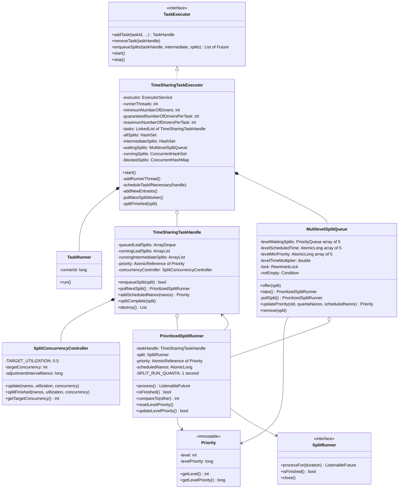
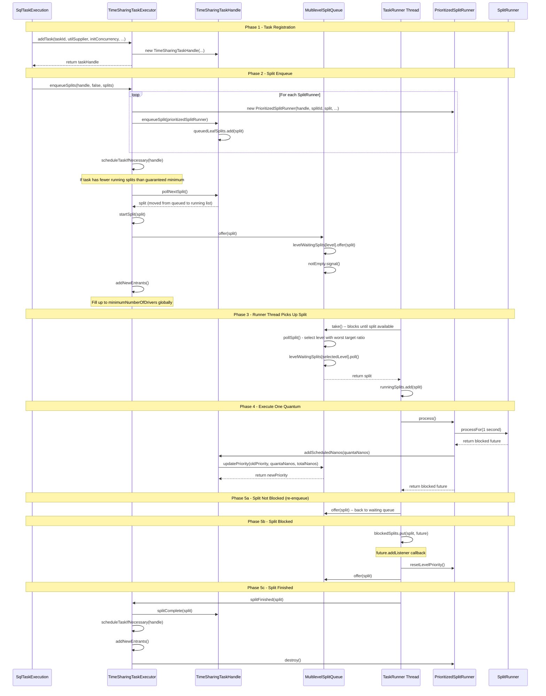
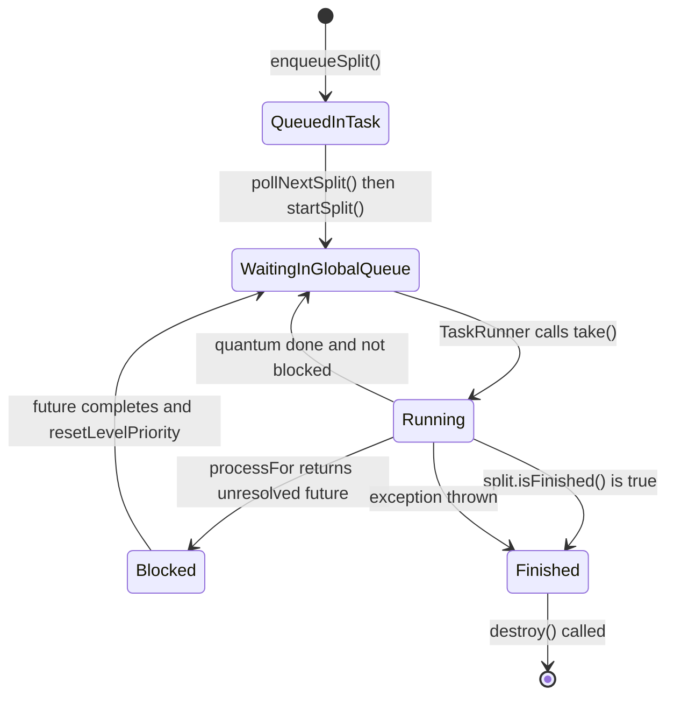

# Module Teardown: Thread Pool Executor and Multilevel Priority Queue (Task 2.2.A)

## Table of Contents

- [0. Research Focus](#0-research-focus)
- [1. High-Level Overview](#1-high-level-overview)
- [2. Structural Architecture](#2-structural-architecture)
  - [Primary Source Files](#primary-source-files)
  - [Key Data Structures](#key-data-structures)
  - [Class Diagram](#class-diagram)
- [3. Execution and Call Flow](#3-execution-and-call-flow)
  - [Sequence Diagram: Split Enqueue and Execution](#sequence-diagram-split-enqueue-and-execution)
  - [Step-by-step Text Breakdown](#step-by-step-text-breakdown)
- [4. Concurrency and State Management](#4-concurrency-and-state-management)
  - [Threading Model](#threading-model)
  - [Split State Machine](#split-state-machine)
  - [Synchronization Strategy](#synchronization-strategy)
  - [Concurrency Control: SplitConcurrencyController](#concurrency-control-splitconcurrencycontroller)
- [5. Memory and Resource Profile](#5-memory-and-resource-profile)
- [6. Key Design Insights](#6-key-design-insights)
  - [Insight 1: Two-Level Queuing -- Local Task Queue then Global Multilevel Queue](#insight-1-two-level-queuing-local-task-queue-then-global-multilevel-queue)
  - [Insight 2: Multilevel Feedback Queue with 5 Levels Based on Accumulated CPU Time](#insight-2-multilevel-feedback-queue-with-5-levels-based-on-accumulated-cpu-time)
  - [Insight 3: LEVEL_CONTRIBUTION_CAP Prevents Pathological Charging](#insight-3-level_contribution_cap-prevents-pathological-charging)
  - [Insight 4: resetLevelPriority Prevents Post-Block Starvation](#insight-4-resetlevelpriority-prevents-post-block-starvation)
  - [Insight 5: Round-Robin Task Selection for Global Admission](#insight-5-round-robin-task-selection-for-global-admission)
  - [Insight 6: Intermediate Splits Bypass All Queuing](#insight-6-intermediate-splits-bypass-all-queuing)
  - [Insight 7: Self-Healing Thread Pool](#insight-7-self-healing-thread-pool)
  - [Insight 8: The updateLevelPriority Re-check in take()](#insight-8-the-updatelevelpriority-re-check-in-take)
  - [Insight 9: Dual Executor Architecture in Trino 480](#insight-9-dual-executor-architecture-in-trino-480)
- [7. Porting Considerations (Java to Rust)](#7-porting-considerations-java-to-rust)
  - [Thread Pool](#thread-pool)
  - [MultilevelSplitQueue](#multilevelsplitqueue)
  - [Priority Charging](#priority-charging)
  - [Concurrency Controller](#concurrency-controller)
  - [Split Lifecycle](#split-lifecycle)
  - [Key Architectural Decision](#key-architectural-decision)


## 0. Research Focus
* **Task ID:** 2.2.A
* **Focus:** Analyze the core thread pool (Runner threads). How does it accept tasks? How does it manage the priority queue of `PrioritizedSplitRunner` objects?

## 1. High-Level Overview
* **Core Responsibility:** The `TaskExecutor` subsystem manages a fixed-size pool of runner threads that execute split work in time-shared quanta. It wraps each `SplitRunner` in a `PrioritizedSplitRunner`, inserts it into a `MultilevelSplitQueue` (a 5-level priority queue), and dispatches runner threads to process the highest-priority available split for one quantum (1 second) before re-enqueueing. Trino 480 ships two concrete implementations behind the `TaskExecutor` interface: the original `TimeSharingTaskExecutor` (multilevel feedback queue) and the newer `ThreadPerDriverTaskExecutor` (CFS-inspired fair scheduler).
* **Key Triggers:**
  - `SqlTaskExecution` calls `taskExecutor.addTask(...)` to register a task
  - `SqlTaskExecution` calls `taskExecutor.enqueueSplits(...)` when new splits arrive from the coordinator
  - Runner threads continuously call `waitingSplits.take()` to pull the next split to execute
  - Splits that finish or block trigger rescheduling via `splitFinished()` or `ListenableFuture` callbacks

## 2. Structural Architecture

### Primary Source Files

**Root interfaces (`executor/`):**
| File | Role |
|------|------|
| `TaskExecutor.java` | Interface: `addTask`, `removeTask`, `enqueueSplits`, `start`, `stop` |
| `TaskHandle.java` | Interface: `isDestroyed()` marker for task lifecycle |
| `RunningSplitInfo.java` | Diagnostic wrapper tracking start-time, thread, and task-id of a running split |

**Time-sharing implementation (`executor/timesharing/`):**
| File | Role |
|------|------|
| `TimeSharingTaskExecutor.java` | **Primary executor** -- manages runner threads, split lifecycle, and admission control |
| `TimeSharingTaskHandle.java` | Per-task state: queued splits, running splits, concurrency controller, priority |
| `PrioritizedSplitRunner.java` | Wraps a `SplitRunner` with priority, timing stats, and 1-second quantum execution |
| `MultilevelSplitQueue.java` | **5-level priority queue** -- the heart of the scheduling algorithm |
| `Priority.java` | Immutable (level, levelPriority) pair |
| `SplitConcurrencyController.java` | Adaptive concurrency: adjusts target concurrency per task based on utilization |

**Dedicated executor alternative (`executor/dedicated/`):**
| File | Role |
|------|------|
| `ThreadPerDriverTaskExecutor.java` | Alternative executor using `FairScheduler` (CFS-based) |
| `TaskEntry.java` | Per-task state for the dedicated executor |
| `SplitProcessor.java` | Adapts `SplitRunner` to the `Schedulable` interface |
| `ConcurrencyController.java` | Simplified concurrency controller (no time-gating) |

**Fair scheduler infrastructure (`executor/scheduler/`):**
| File | Role |
|------|------|
| `FairScheduler.java` | CFS-inspired scheduler with semaphore-based concurrency control |
| `BlockingSchedulingQueue.java` | Thread-safe wrapper around `SchedulingQueue` |
| `SchedulingQueue.java` | CFS queue: groups ordered by accumulated weight |
| `SchedulingGroup.java` | Per-group state: runnable queue, blocked set, weight tracking |
| `PriorityQueue.java` | `TreeSet`-backed priority queue with sequence tiebreaker |
| `TaskControl.java` | Per-task state machine: NEW, WAITING, RUNNING, BLOCKED, INTERRUPTED, FINISHED |
| `Reservation.java` | Semaphore wrapper tracking which tasks hold concurrency slots |
| `SchedulerContext.java` | Context passed to `Schedulable.run()` -- provides `maybeYield()` and `block()` |
| `Gate.java` | Simple open/close latch for pausing the scheduler |
| `Group.java` | Record: (name, startTime) -- represents a scheduling group (one per task) |
| `Task.java` | Scheduling weight tracker: committed weight, uncommitted weight, state |
| `State.java` | Enum: BLOCKED, RUNNING, RUNNABLE (for groups and tasks in the CFS queue) |
| `Schedulable.java` | Interface: `void run(SchedulerContext context)` |

### Key Data Structures

1. **`MultilevelSplitQueue`** -- Array of 5 `java.util.PriorityQueue<PrioritizedSplitRunner>`, one per level. Protected by `ReentrantLock` + `Condition`.
2. **`PrioritizedSplitRunner`** -- Comparable wrapper around `SplitRunner`. `compareTo` orders by `levelPriority`, then `workerId`.
3. **`Priority`** -- Immutable `(level: int, levelPriority: long)`. Level determined by total scheduled nanos; levelPriority increments with each quantum.
4. **`TimeSharingTaskHandle`** -- Contains `queuedLeafSplits: ArrayDeque`, `runningLeafSplits: ArrayList`, `runningIntermediateSplits: ArrayList`, and a `SplitConcurrencyController`.
5. **Split state sets in `TimeSharingTaskExecutor`:**
   - `allSplits: HashSet` -- every registered split
   - `intermediateSplits: HashSet` -- splits that skip the per-task queue
   - `waitingSplits: MultilevelSplitQueue` -- splits ready for a runner thread
   - `runningSplits: ConcurrentHashSet` -- currently executing on a thread
   - `blockedSplits: ConcurrentHashMap<Split, Future>` -- blocked on I/O or data

### Class Diagram



## 3. Execution and Call Flow

### Sequence Diagram: Split Enqueue and Execution



### Step-by-step Text Breakdown

**1. Task Registration (`addTask`)**
- Creates a `TimeSharingTaskHandle` with a `SplitConcurrencyController` (initial concurrency, adjustment frequency).
- Adds the handle to the `tasks` linked list.
- No splits are running yet; the handle just reserves a slot.

**2. Split Enqueue (`enqueueSplits`)**
- For each incoming `SplitRunner`, wraps it in a `PrioritizedSplitRunner` with initial `Priority(0, 0)`.
- **Leaf splits** go to `taskHandle.enqueueSplit()` which adds them to the handle's `queuedLeafSplits: ArrayDeque`.
- **Intermediate splits** bypass the per-task queue entirely -- they go directly to `startIntermediateSplit()` which calls `startSplit()` immediately.
- After enqueuing, two admission control functions fire:
  - `scheduleTaskIfNecessary(handle)` -- ensures this task has at least `guaranteedNumberOfDriversPerTask` splits in the global queue by calling `handle.pollNextSplit()` and `startSplit()`.
  - `addNewEntrants()` -- ensures the global count of active leaf splits is at least `minimumNumberOfDrivers` by calling `pollNextSplitWorker()` which round-robins across tasks.

**3. `startSplit(split)` -- entering the global queue**
- Adds split to `allSplits` set.
- Calls `waitingSplits.offer(split)` which places the split into the appropriate level's `PriorityQueue` inside `MultilevelSplitQueue`.

**4. Runner Thread Loop (`TaskRunner.run()`)**
- Each runner thread loops: `split = waitingSplits.take()` (blocking).
- `take()` calls `pollSplit()` which selects the level with the worst ratio of actual-to-target scheduled time, then polls the lowest-priority split from that level's `PriorityQueue`.
- The thread calls `split.process()` which delegates to `splitRunner.processFor(SPLIT_RUN_QUANTA)` -- executing for up to 1 second.
- After the quantum:
  - **Finished:** calls `splitFinished(split)` to clean up and schedule replacements.
  - **Not blocked:** re-offers the split to `waitingSplits.offer(split)`.
  - **Blocked:** stores in `blockedSplits` map; when the future completes, a listener resets the level priority and re-offers to the waiting queue.

**5. Priority Update After Each Quantum**
- `PrioritizedSplitRunner.process()` calls `taskHandle.addScheduledNanos(quantaScheduledNanos)`.
- The handle calls `splitQueue.updatePriority(oldPriority, quantaNanos, totalScheduledNanos)`.
- `updatePriority` computes the new level based on total scheduled nanos and charges time to the appropriate level(s), capped at `LEVEL_CONTRIBUTION_CAP` (30 seconds).

**6. `pollNextSplitWorker()` -- Round-Robin Task Selection**
- Iterates the `tasks` linked list.
- Skips tasks at or above `maximumNumberOfDriversPerTask`.
- Calls `task.pollNextSplit()` which checks against the `SplitConcurrencyController`'s target concurrency.
- On success, moves the task to the end of the list (round-robin).

## 4. Concurrency and State Management

### Threading Model

**Thread Pool Sizing (TimeSharingTaskExecutor):**
- `runnerThreads` = `task.max-worker-threads` (default: `availableProcessors * 2`).
- The underlying `ExecutorService` is `Executors.newCachedThreadPool()` -- unbounded, but exactly `runnerThreads` instances of `TaskRunner` are submitted at `start()`.
- If a runner thread exits unexpectedly (non-closed), it calls `addRunnerThread()` to replace itself. This is a self-healing mechanism in the `finally` block:
```java
finally {
    if (!closed) {
        addRunnerThread();
    }
}
```
- `minimumNumberOfDrivers` = `task.min-drivers` (default: `2 * maxWorkerThreads`). This is the minimum number of splits that should be in the global queue plus running.
- `guaranteedNumberOfDriversPerTask` = `task.min-drivers-per-task` (default: 3). Each task gets at least this many splits promoted from its local queue to the global queue.
- `maximumNumberOfDriversPerTask` = `task.max-drivers-per-task` (default: `Integer.MAX_VALUE`). Hard cap on running leaf splits per task.

**Runner Thread Loop:**
```java
while (!closed && !Thread.currentThread().isInterrupted()) {
    PrioritizedSplitRunner split = waitingSplits.take();  // BLOCKING
    // ... set thread name, track in runningSplitInfos ...
    ListenableFuture<Void> blocked = split.process();     // 1-second quantum
    // ... route to finished/waiting/blocked ...
}
```

### Split State Machine

A `PrioritizedSplitRunner` moves through these states:



### Synchronization Strategy

**TimeSharingTaskExecutor** uses `synchronized(this)` on most methods. The critical lock ordering is:
1. `TimeSharingTaskExecutor` instance lock (coarse-grained)
2. `MultilevelSplitQueue.lock` (fine-grained `ReentrantLock`)
3. `TimeSharingTaskHandle` instance lock

Key insight: The `TaskRunner` inner class calls `waitingSplits.take()` **without** holding the executor lock. This is critical -- the runner thread blocks on the queue's `Condition` independently and only acquires the executor lock when calling `splitFinished()`.

**MultilevelSplitQueue** uses a dedicated `ReentrantLock` + `Condition notEmpty`:
- `offer()` acquires lock, inserts into the level queue, signals `notEmpty`.
- `take()` acquires lock, calls `pollSplit()` in a loop, awaits `notEmpty` when empty.
- `levelScheduledTime` accesses are intentionally unsynchronized (documented benign data race -- only stale by the duration of concurrent quanta completions).

**TimeSharingTaskHandle** uses `synchronized(this)` for all methods. The `priority` field uses `AtomicReference` to allow lock-free reads from `PrioritizedSplitRunner.updateLevelPriority()`.

### Concurrency Control: SplitConcurrencyController

Per-task adaptive concurrency targeting 50% CPU utilization:
```java
private static final double TARGET_UTILIZATION = 0.5;

public void update(long nanos, double utilization, int currentConcurrency) {
    threadNanosSinceLastAdjustment += nanos;
    if (threadNanosSinceLastAdjustment >= adjustmentIntervalNanos
            && utilization < TARGET_UTILIZATION
            && currentConcurrency >= targetConcurrency) {
        threadNanosSinceLastAdjustment = 0;
        targetConcurrency++;
    }
}
```
- On each quantum: if utilization is below 50% and all target slots are filled, increase target concurrency.
- On split finish: if utilization is above 50%, decrease; if below 50% and at target, increase.
- The `adjustmentIntervalNanos` (default 100ms) rate-limits adjustments.
- `TimeSharingTaskHandle.pollNextSplit()` checks `runningLeafSplits.size() >= concurrencyController.getTargetConcurrency()` before dequeuing.

## 5. Memory and Resource Profile

**Per-executor footprint:**
- `runnerThreads` Java threads (default: 2 * CPU cores), each with a default 1MB stack.
- 5 `java.util.PriorityQueue` instances (one per level) -- heap-backed arrays, grow dynamically.
- `allSplits`, `intermediateSplits`: `HashSet` -- O(N) where N = active splits.
- `runningSplits`: `ConcurrentHashMap`-backed set -- O(R) where R = runner threads.
- `blockedSplits`: `ConcurrentHashMap` -- O(B) where B = blocked splits.
- `runningSplitInfos`: `ConcurrentSkipListSet` -- sorted for diagnostic queries.

**Per-split footprint (`PrioritizedSplitRunner`):**
- ~200 bytes: 6 `AtomicLong` fields, 2 `AtomicReference`, 1 `AtomicBoolean`, 1 `SettableFuture`, 1 `Span`.
- References to shared stat counters (`CounterStat`, `TimeStat`) -- not duplicated.

**Per-task footprint (`TimeSharingTaskHandle`):**
- `queuedLeafSplits: ArrayDeque` (initial capacity 10).
- `runningLeafSplits: ArrayList` (initial capacity 10).
- `runningIntermediateSplits: ArrayList` (initial capacity 10).
- `SplitConcurrencyController`: 3 primitive fields.

**Key resource concern:** The `minimumNumberOfDrivers` default of `2 * maxWorkerThreads` means with 64 cores, 256 splits will be promoted to the global queue even if they just wait. This ensures runner threads always have work but can increase memory pressure from driver buffers.

## 6. Key Design Insights

### Insight 1: Two-Level Queuing -- Local Task Queue then Global Multilevel Queue

Splits traverse two queues. First, `enqueueSplit()` places them in the per-task `queuedLeafSplits: ArrayDeque` (FIFO). Then, admission control functions (`scheduleTaskIfNecessary`, `addNewEntrants`) promote them to the global `MultilevelSplitQueue`. This two-level design decouples task-level admission (governed by concurrency controller) from global scheduling (governed by the multilevel feedback algorithm).

**Evidence:** `TimeSharingTaskHandle.pollNextSplit()` at line 166-181 checks `runningLeafSplits.size() >= concurrencyController.getTargetConcurrency()` before polling from `queuedLeafSplits`. Only splits that pass this gate enter the global queue via `startSplit()`.

### Insight 2: Multilevel Feedback Queue with 5 Levels Based on Accumulated CPU Time

The 5 levels partition tasks by total scheduled time:
- Level 0: 0-1 second (short queries)
- Level 1: 1-10 seconds
- Level 2: 10-60 seconds
- Level 3: 60-300 seconds (1-5 minutes)
- Level 4: 300+ seconds (long-running)

```java
static final int[] LEVEL_THRESHOLD_SECONDS = {0, 1, 10, 60, 300};
```

Level selection in `pollSplit()` picks the level with the worst ratio of actual-to-target scheduled time. The target for level N is `level0Time / (levelTimeMultiplier ^ N)`, so higher levels get exponentially less CPU. With the default multiplier of 2, level 4 gets 1/16th the time of level 0.

**Key anti-starvation mechanism:** When a level's queue becomes empty and later receives splits again, `offer()` resets that level's `levelScheduledTime` to the expected value based on level 0's time. This prevents the newly-populated level from monopolizing threads while "catching up."

### Insight 3: LEVEL_CONTRIBUTION_CAP Prevents Pathological Charging

```java
static final long LEVEL_CONTRIBUTION_CAP = SECONDS.toNanos(30);
```

When `updatePriority()` charges time to a level, it caps the contribution at 30 seconds. This protects against a single hung split (e.g., a stalled I/O read that takes minutes) from drastically distorting the level's scheduled time and starving other tasks at that level.

### Insight 4: resetLevelPriority Prevents Post-Block Starvation

When a blocked split unblocks, its `levelPriority` may be far lower than currently running splits (it was set before blocking). If re-enqueued with the stale priority, it would immediately jump to the head and starve active splits. The `resetLevelPriority()` method fixes this:

```java
public void resetLevelPriority() {
    priority.set(taskHandle.resetLevelPriority());
}
```

`TimeSharingTaskHandle.resetLevelPriority()` bumps the level priority to at least `levelMinPriority` -- the priority of the last split dequeued from that level. This ensures unblocked splits enter "at the back of the line" within their level.

### Insight 5: Round-Robin Task Selection for Global Admission

`pollNextSplitWorker()` iterates the `tasks` linked list and moves the selected task to the end:
```java
iterator.remove();
tasks.add(task);  // move to end
return split;
```
This ensures no single task monopolizes the global admission path. Combined with `maximumNumberOfDriversPerTask`, it provides task-level fairness for promotion from local to global queues.

### Insight 6: Intermediate Splits Bypass All Queuing

Intermediate splits (e.g., hash-build sides of joins) skip the per-task queue entirely and go directly to the global `MultilevelSplitQueue` via `startIntermediateSplit()`. They are also excluded from the `minimumNumberOfDrivers` count in `addNewEntrants()`:
```java
int running = allSplits.size() - intermediateSplits.size();
```
This prevents intermediate splits from inflating the "running" count and blocking leaf splits from being promoted.

### Insight 7: Self-Healing Thread Pool

Runner threads are not managed by a fixed thread pool. Instead, `newCachedThreadPool()` is used and exactly `runnerThreads` `TaskRunner` instances are submitted at startup. If a runner exits unexpectedly, it replaces itself:
```java
finally {
    if (!closed) {
        addRunnerThread();
    }
}
```
The `Thread.interrupted()` flag is carefully managed: if set but not closed, it is cleared to allow the replacement thread to function normally.

### Insight 8: The updateLevelPriority Re-check in take()

`MultilevelSplitQueue.take()` contains a subtle re-check after dequeuing:
```java
if (result.updateLevelPriority()) {
    offer(result);
    continue;
}
```
Because a split's cached priority can become stale (the task handle's priority is updated by other threads), `take()` checks if the split's level has changed since it was enqueued. If so, it re-offers the split at the correct level rather than running it at the wrong priority.

### Insight 9: Dual Executor Architecture in Trino 480

Trino 480 provides two `TaskExecutor` implementations:
- **`TimeSharingTaskExecutor`**: The original multilevel feedback queue. Runner threads `take()` from the queue, process one 1-second quantum, and re-enqueue.
- **`ThreadPerDriverTaskExecutor`**: A newer CFS-inspired design where each split gets its own thread from a pool, and fairness is enforced by a `FairScheduler` that uses semaphore-based concurrency control (`Reservation`) and weight-based scheduling (`SchedulingQueue` modeled after Linux CFS). Splits yield cooperatively via `SchedulerContext.maybeYield()` after their quantum.

The dedicated executor is fundamentally different: splits run in a loop on a dedicated thread, yielding/blocking through the `SchedulerContext`, rather than being dequeued/re-enqueued from a global queue each quantum.

## 7. Porting Considerations (Java to Rust)

### Thread Pool
- Java's `newCachedThreadPool()` maps to a Rust work-stealing runtime like `tokio`. However, the `TaskRunner` is a long-lived blocking loop, not async. Consider using `tokio::task::spawn_blocking` or a dedicated `std::thread` pool.
- The self-healing pattern (replace thread on exit) is unnecessary in Rust where panics can be caught with `std::panic::catch_unwind` or handled by the runtime.

### MultilevelSplitQueue
- The 5-level `PriorityQueue<PrioritizedSplitRunner>` maps naturally to `[BinaryHeap<PrioritizedSplitRunner>; 5]` protected by a `Mutex` + `Condvar`.
- `PrioritizedSplitRunner.compareTo` logic (levelPriority then workerId) maps to a `#[derive(Ord)]` on a wrapper struct.
- The `ReentrantLock` + `Condition` maps to `std::sync::Mutex` + `Condvar` or `parking_lot::Mutex` + `parking_lot::Condvar`.

### Priority Charging
- `AtomicLong` for `levelScheduledTime` maps to `AtomicI64` or `AtomicU64`. The documented benign data race is safe in Rust with `Ordering::Relaxed`.
- The `LEVEL_CONTRIBUTION_CAP` and level-crossing charge distribution in `updatePriority()` is pure arithmetic -- ports directly.

### Concurrency Controller
- `SplitConcurrencyController` is `@NotThreadSafe` -- always called under the task handle's lock. In Rust, embed it inside the task handle's `Mutex<TaskHandleInner>`.

### Split Lifecycle
- The `SplitRunner` interface's `processFor(Duration)` returning `ListenableFuture<Void>` maps to an async `process_for(duration) -> Option<Pin<Box<dyn Future>>>` or a sync function returning a poll result.
- The blocked-split callback pattern (`future.addListener(...)`) maps to `tokio::spawn(async { future.await; requeue(split); })`.

### Key Architectural Decision
The choice between porting the `TimeSharingTaskExecutor` (explicit dequeue/re-enqueue per quantum) vs. the `ThreadPerDriverTaskExecutor` (cooperative yielding via `SchedulerContext`) has significant implications. The cooperative model is more natural for Rust async, where `poll`-based futures already yield control. The multilevel queue is more natural for a thread-per-core model with explicit scheduling. For a Rust rewrite targeting async, the CFS-inspired `FairScheduler` design may be a better foundation, while the multilevel priority thresholds from `TimeSharingTaskExecutor` could be layered on top for query-age-based fairness.
