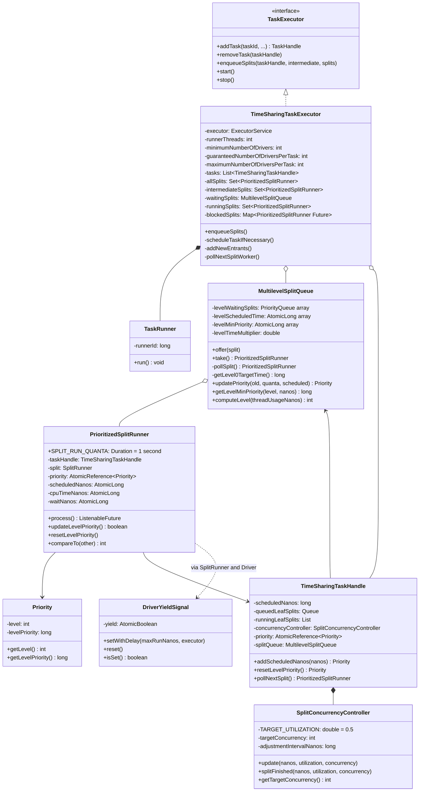
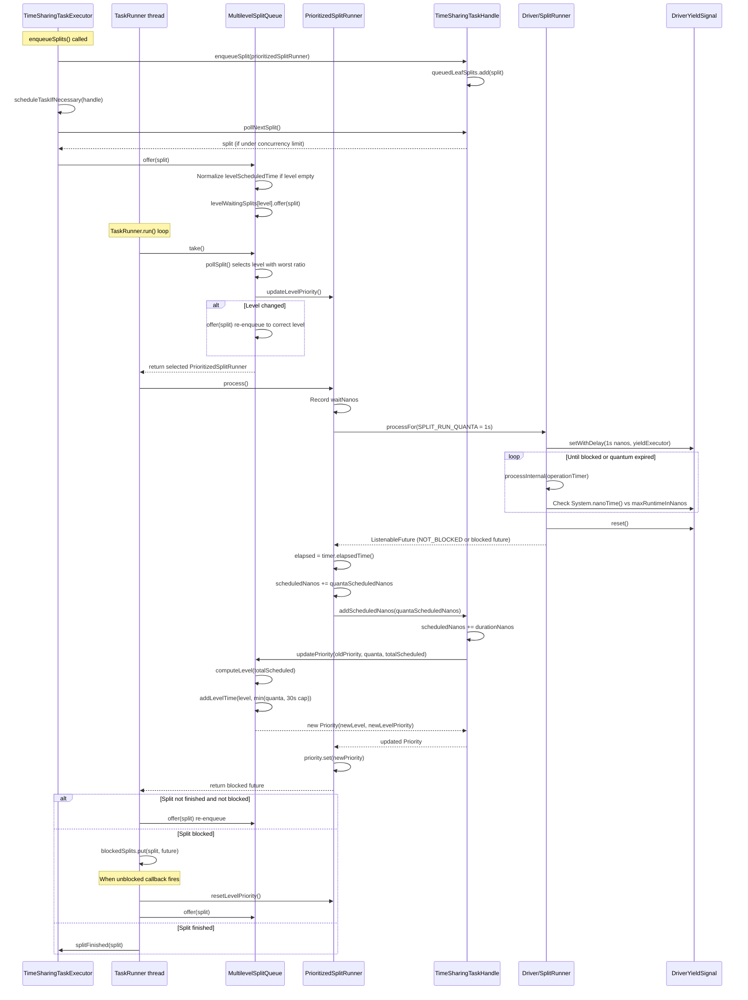

# Module Teardown: Split Prioritization & Time Quanta (Task 2.2.B)

## Table of Contents

- [0. Research Focus](#0-research-focus)
- [1. High-Level Overview](#1-high-level-overview)
- [2. Structural Architecture](#2-structural-architecture)
  - [Level Thresholds](#level-thresholds)
  - [Priority Object](#priority-object)
  - [Per-Level Tracking in MultilevelSplitQueue](#per-level-tracking-in-multilevelsplitqueue)
  - [Class Diagram](#class-diagram)
- [3. Execution & Call Flow](#3-execution-call-flow)
  - [Sequence Diagram](#sequence-diagram)
  - [Step-by-step Text Breakdown](#step-by-step-text-breakdown)
- [4. Concurrency & State Management](#4-concurrency-state-management)
  - [Threading Model](#threading-model)
  - [State Machine](#state-machine)
  - [Synchronization](#synchronization)
- [5. Memory & Resource Profile](#5-memory-resource-profile)
- [6. Key Design Insights](#6-key-design-insights)
  - [Insight 1: Wall Time as Scheduling Currency, Not CPU Time](#insight-1-wall-time-as-scheduling-currency-not-cpu-time)
  - [Insight 2: The Level Contribution Cap Prevents Pathological Distortion](#insight-2-the-level-contribution-cap-prevents-pathological-distortion)
  - [Insight 3: Empty Level Time Normalization Prevents Burst Starvation](#insight-3-empty-level-time-normalization-prevents-burst-starvation)
  - [Insight 4: Level Graduation Preserves Intra-Level Fairness](#insight-4-level-graduation-preserves-intra-level-fairness)
  - [Insight 5: The Blocked-Split Anti-Starvation Reset](#insight-5-the-blocked-split-anti-starvation-reset)
  - [Insight 6: Cooperative Quantum Enforcement Via Yield Signal](#insight-6-cooperative-quantum-enforcement-via-yield-signal)
  - [Insight 7: Two-Tier Scheduling (Round-Robin Tasks, then MLFQ Splits)](#insight-7-two-tier-scheduling-round-robin-tasks-then-mlfq-splits)
  - [Insight 8: SplitConcurrencyController Adapts to I/O Patterns](#insight-8-splitconcurrencycontroller-adapts-to-io-patterns)
  - [Insight 9: Level Time Multiplier Controls Fair-Share Ratios](#insight-9-level-time-multiplier-controls-fair-share-ratios)
  - [Insight 10: PrioritizedSplitRunner compareTo Uses Level Priority Then Worker ID](#insight-10-prioritizedsplitrunner-compareto-uses-level-priority-then-worker-id)
- [7. Porting Considerations (Java to Rust)](#7-porting-considerations-java-to-rust)
  - [Priority Queue and MLFQ](#priority-queue-and-mlfq)
  - [Cooperative Yield](#cooperative-yield)
  - [Lock Strategy](#lock-strategy)
  - [Immutable Priority](#immutable-priority)
  - [SplitConcurrencyController](#splitconcurrencycontroller)
  - [Time Measurement](#time-measurement)


## 0. Research Focus
* **Task ID:** 2.2.B
* **Focus:** How does the executor track CPU "quanta" (time slices)? How does it calculate the priority of a split to ensure fair scheduling across multiple queries?
* **Trino Version:** 480 (source at `trino/trino/`)

## 1. High-Level Overview
* **Core Responsibility:** Trino's time-sharing task executor implements a multilevel feedback queue (MLFQ) scheduler that gives short-running queries preferential access to CPU time while preventing long-running queries from starving. Each split is executed for a fixed *time quantum* (1 second of wall time), after which it is re-enqueued with an updated priority. Priority is a composite of two dimensions: which *level* a task belongs to (based on total accumulated scheduled time) and a *within-level priority* (based on time accrued in that level), ensuring both inter-level and intra-level fairness.
* **Key Triggers:**
  - A split is enqueued via `TimeSharingTaskExecutor.enqueueSplits()` and placed into the `MultilevelSplitQueue`.
  - A `TaskRunner` thread calls `waitingSplits.take()` to select the next split.
  - After executing for one quantum, `PrioritizedSplitRunner.process()` updates the task's priority via `TaskHandle.addScheduledNanos()`, which delegates to `MultilevelSplitQueue.updatePriority()`.

## 2. Structural Architecture
* **Primary Source Files:**
  - `io.trino.execution.executor.timesharing.PrioritizedSplitRunner` -- wraps a SplitRunner with priority tracking, timing, and the 1-second quantum enforcement
  - `io.trino.execution.executor.timesharing.MultilevelSplitQueue` -- the 5-level MLFQ that selects which level to run from and which split within that level
  - `io.trino.execution.executor.timesharing.Priority` -- immutable value object holding (level, levelPriority)
  - `io.trino.execution.executor.timesharing.TimeSharingTaskHandle` -- per-task state: accumulated scheduled nanos, queued/running splits, concurrency controller
  - `io.trino.execution.executor.timesharing.TimeSharingTaskExecutor` -- the main executor with the `TaskRunner` inner class that drives the run loop
  - `io.trino.execution.executor.timesharing.SplitConcurrencyController` -- adaptive concurrency per task based on utilization
  - `io.trino.operator.DriverYieldSignal` -- cooperative yield mechanism that operators check to respect the time quantum
  - `io.trino.operator.Driver` -- calls `processInternal()` in a loop until the quantum expires or the driver blocks

* **Key Data Structures:**

### Level Thresholds

The 5 levels are defined by cumulative *task* scheduled time (not per-split):

| Level | Threshold (seconds) | Interpretation |
|-------|---------------------|----------------|
| 0     | 0                   | New/short tasks (under 1s total) |
| 1     | 1                   | Tasks with 1-10s total scheduled time |
| 2     | 10                  | Medium tasks (10-60s) |
| 3     | 60                  | Long tasks (1-5 minutes) |
| 4     | 300                 | Very long tasks (over 5 minutes) |

```java
// MultilevelSplitQueue.java:41-42
static final int[] LEVEL_THRESHOLD_SECONDS = {0, 1, 10, 60, 300};
static final long LEVEL_CONTRIBUTION_CAP = SECONDS.toNanos(30);
```

### Priority Object

```java
// Priority.java:37-47
@Immutable
public final class Priority
{
    private final int level;          // which queue (0-4)
    private final long levelPriority; // within-level ordering (nanos of scheduled time in this level)
    ...
}
```

### Per-Level Tracking in MultilevelSplitQueue

Each level maintains:
- `levelWaitingSplits[level]` -- a `java.util.PriorityQueue<PrioritizedSplitRunner>` ordered by `compareTo()` (i.e., levelPriority, then workerId tiebreak)
- `levelScheduledTime[level]` -- `AtomicLong` tracking total nanos of scheduled time charged to this level across all tasks
- `levelMinPriority[level]` -- `AtomicLong` tracking the minimum levelPriority of any split most recently dequeued from this level (used for anti-starvation on re-entry)

### Class Diagram



## 3. Execution & Call Flow

### Sequence Diagram



### Step-by-step Text Breakdown

**Phase 1: Split Enqueueing**

1. `TimeSharingTaskExecutor.enqueueSplits()` creates a `PrioritizedSplitRunner` wrapping each `SplitRunner`. The constructor calls `updateLevelPriority()` which reads the task's current `Priority` (initially `Priority(0, 0)`).
2. For leaf splits, it calls `handle.enqueueSplit(split)` which adds to `queuedLeafSplits`.
3. `scheduleTaskIfNecessary()` checks if the task has fewer running splits than `guaranteedNumberOfDriversPerTask` (default 3). If so, it calls `handle.pollNextSplit()`.
4. `pollNextSplit()` only returns a split if `runningLeafSplits.size() < concurrencyController.getTargetConcurrency()` -- enforcing the adaptive concurrency limit.
5. The returned split is placed into `MultilevelSplitQueue` via `startSplit() -> waitingSplits.offer(split)`.

**Phase 2: Level Selection in `MultilevelSplitQueue.take()`**

6. A `TaskRunner` thread blocks on `waitingSplits.take()`.
7. `pollSplit()` iterates all 5 levels and computes for each non-empty level the ratio `targetScheduledTime / levelScheduledTime[level]`.
8. The target for level 0 is computed by `getLevel0TargetTime()` which finds the maximum of `levelScheduledTime[level] / multiplier^level` across all levels -- essentially normalizing all levels to level-0 scale and taking the max.
9. Each subsequent level's target is `target / levelTimeMultiplier` (default `2.0`). So level 0 gets 2x the target time of level 1, which gets 2x of level 2, etc.
10. The level with the *highest* ratio (most underserved relative to target) is selected.
11. From that level, the split with the *lowest* `levelPriority` is dequeued (via Java's PriorityQueue, ordered by `compareTo()`).

**Phase 3: Level Re-check**

12. After dequeuing, `take()` calls `result.updateLevelPriority()`. This re-reads the task's current priority from the `TaskHandle`. If the *level* has changed since the split was enqueued (another split for the same task accumulated more time), the split is re-offered to the queue at the new level and the loop restarts.
13. The dequeued split's levelPriority is recorded as `levelMinPriority[selectedLevel]`.

**Phase 4: Quantum Execution**

14. `TaskRunner.run()` calls `split.process()`.
15. Inside `process()`:
    - A `CpuTimer` starts.
    - `split.processFor(SPLIT_RUN_QUANTA)` is called where `SPLIT_RUN_QUANTA = Duration(1, SECONDS)`.
    - This reaches `Driver.process(maxRuntime=1s, maxIterations=MAX_INT)`.
    - The Driver sets `DriverYieldSignal.setWithDelay(1s, executor)` which schedules a timer to set an atomic boolean after 1 second.
    - The Driver loops calling `processInternal()` (which pushes/pulls pages through the operator pipeline) until either:
      - An operator returns a non-done `ListenableFuture` (blocked on I/O, memory, etc.)
      - `System.nanoTime() - start >= maxRuntimeInNanos` (wall time expired)
      - `iterations >= maxIterations`
    - The DriverYieldSignal is also checked cooperatively by long-running operators (joins, aggregations, projections) to yield mid-page-processing.

16. After `processFor` returns, the `CpuTimer.elapsedTime()` captures both wall and CPU durations.

**Phase 5: Priority Update**

17. `quantaScheduledNanos = elapsed.wall().roundTo(NANOSECONDS)` -- note: *wall time* is the scheduling currency, not CPU time.
18. `priority.set(taskHandle.addScheduledNanos(quantaScheduledNanos))` does:
    - Updates the `SplitConcurrencyController` with the quantum duration and current utilization.
    - `scheduledNanos += durationNanos` on the task handle (cumulative).
    - Calls `splitQueue.updatePriority(oldPriority, durationNanos, scheduledNanos)`.

19. Inside `MultilevelSplitQueue.updatePriority()`:

```java
// MultilevelSplitQueue.java:214-242
public Priority updatePriority(Priority oldPriority, long quantaNanos, long scheduledNanos)
{
    int oldLevel = oldPriority.getLevel();
    int newLevel = computeLevel(scheduledNanos);

    long levelContribution = Math.min(quantaNanos, LEVEL_CONTRIBUTION_CAP);

    if (oldLevel == newLevel) {
        addLevelTime(oldLevel, levelContribution);
        return new Priority(oldLevel, oldPriority.getLevelPriority() + quantaNanos);
    }

    long remainingLevelContribution = levelContribution;
    long remainingTaskTime = quantaNanos;

    for (int currentLevel = oldLevel; currentLevel < newLevel; currentLevel++) {
        long timeAccruedToLevel = Math.min(
            SECONDS.toNanos(LEVEL_THRESHOLD_SECONDS[currentLevel + 1] - LEVEL_THRESHOLD_SECONDS[currentLevel]),
            remainingLevelContribution);
        addLevelTime(currentLevel, timeAccruedToLevel);
        remainingLevelContribution -= timeAccruedToLevel;
        remainingTaskTime -= timeAccruedToLevel;
    }

    addLevelTime(newLevel, remainingLevelContribution);
    long newLevelMinPriority = getLevelMinPriority(newLevel, scheduledNanos);
    return new Priority(newLevel, newLevelMinPriority + remainingTaskTime);
}
```

Key behaviors:
- **Same level:** The level's total time is increased by `min(quantaNanos, 30s)`, and the task's levelPriority increases by the full `quantaNanos`. This means the task sorts later in the PriorityQueue (tasks with less accumulated time go first).
- **Level transition:** Time is distributed across old levels proportionally to their threshold widths. The task enters the new level at `newLevelMinPriority + remainingTaskTime`, which is the minimum priority in that level plus any leftover time -- ensuring the task doesn't jump ahead of tasks already in the new level.
- **30-second cap** (`LEVEL_CONTRIBUTION_CAP`): If a single quantum was abnormally long (e.g., a split hung for minutes on a failing dependency), the level is only charged up to 30 seconds. This prevents a single pathological split from distorting the inter-level balance for other queries.

**Phase 6: Re-enqueueing or Blocking**

20. Back in `TaskRunner`:
    - If the split is finished, `splitFinished()` is called, which removes it from tracking, updates stats, and calls `scheduleTaskIfNecessary()` and `addNewEntrants()`.
    - If the future is `NOT_BLOCKED` (already done), the split is re-offered to the queue immediately.
    - If blocked, it goes into `blockedSplits`. When the future completes, a callback calls `split.resetLevelPriority()` then `waitingSplits.offer(split)`.

21. `resetLevelPriority()` is the anti-starvation mechanism for blocked splits:

```java
// TimeSharingTaskHandle.java:88-100
public synchronized Priority resetLevelPriority()
{
    Priority currentPriority = priority.get();
    long levelMinPriority = splitQueue.getLevelMinPriority(currentPriority.getLevel(), scheduledNanos);

    if (currentPriority.getLevelPriority() < levelMinPriority) {
        Priority newPriority = new Priority(currentPriority.getLevel(), levelMinPriority);
        priority.set(newPriority);
        return newPriority;
    }
    return currentPriority;
}
```

This ensures that a split that was blocked for a long time (while other splits in the same level accumulated priority) does not return with a stale low priority number and starve the currently-running splits.

## 4. Concurrency & State Management

### Threading Model

- **Runner threads:** `runnerThreads` (default `availableProcessors * 2`) threads are started via `newCachedThreadPool`. Each runs the `TaskRunner.run()` loop indefinitely.
- **Minimum drivers:** `minimumNumberOfDrivers` (default `maxWorkerThreads * 2`) ensures enough splits are in flight. `addNewEntrants()` polls tasks round-robin to fill up to this minimum.
- **Per-task concurrency:** `guaranteedNumberOfDriversPerTask` (default 3) and `maximumNumberOfDriversPerTask` (default MAX_INT) bound how many leaf splits a single task can have in the queue simultaneously.
- **Adaptive concurrency:** `SplitConcurrencyController` increases `targetConcurrency` when utilization is below 50% and decreases it when above 50%. This means I/O-heavy tasks (low CPU utilization) get more concurrent splits, while CPU-bound tasks get fewer.

### State Machine

A split transitions through these states:

```
                              +---> BLOCKED ---> (unblock callback) --+
                              |                                       |
QUEUED_IN_TASK --> WAITING_IN_QUEUE --> RUNNING ---+--> WAITING_IN_QUEUE (re-enqueue)
                       ^                          |
                       |                          +--> FINISHED --> DESTROYED
                       +--------------------------+
```

- **QUEUED_IN_TASK:** In `TimeSharingTaskHandle.queuedLeafSplits`. Not yet visible to the executor.
- **WAITING_IN_QUEUE:** In `MultilevelSplitQueue.levelWaitingSplits[level]`. Tracked in `allSplits`.
- **RUNNING:** A `TaskRunner` thread holds a reference. In `runningSplits` set.
- **BLOCKED:** In `blockedSplits` map, waiting for a `ListenableFuture` to complete.
- **FINISHED/DESTROYED:** `split.destroy()` called, `finishedFuture` completed.

### Synchronization

| Resource | Mechanism | Notes |
|----------|-----------|-------|
| `MultilevelSplitQueue` internal arrays | `ReentrantLock` + `Condition notEmpty` | `take()` blocks on `notEmpty.await()`; `offer()` signals |
| `TimeSharingTaskHandle` fields | `synchronized(this)` on the handle | Guards `scheduledNanos`, `queuedLeafSplits`, `runningLeafSplits` |
| `TimeSharingTaskExecutor` split sets | `synchronized(this)` on the executor | Guards `allSplits`, `intermediateSplits`, `tasks` |
| `PrioritizedSplitRunner.priority` | `AtomicReference<Priority>` | Lock-free reads during `compareTo()` |
| `levelScheduledTime[]` | `AtomicLong` per level | Deliberately racy reads in `offer()` -- bounded staleness accepted |
| `runningSplits` | `ConcurrentHashMap`-backed set | No lock needed |
| `blockedSplits` | `ConcurrentHashMap` | Concurrent put/remove from different threads |
| `SplitConcurrencyController` | Not thread-safe (`@NotThreadSafe`) | Always accessed under `TimeSharingTaskHandle`'s monitor |

## 5. Memory & Resource Profile

- **Per-split overhead:** Each `PrioritizedSplitRunner` holds 7 `AtomicLong` fields (56 bytes), an `AtomicReference<Priority>`, an `AtomicBoolean`, and a `SettableFuture`. Approximately 200-300 bytes per split.
- **Per-level overhead:** 5 levels, each with a `PriorityQueue` (heap-backed array), an `AtomicLong` for scheduled time, an `AtomicLong` for min priority, and a `CounterStat`. Minimal.
- **Per-task overhead:** `TimeSharingTaskHandle` holds an `ArrayDeque` for queued splits and two `ArrayList`s for running splits. The `SplitConcurrencyController` adds 3 fields.
- **Thread pool:** `runnerThreads` threads (typically cores * 2) are permanently allocated. Additional threads may be created by the cached thread pool if existing ones are blocked.
- **Timer threads:** The `DriverYieldSignal` uses a `ScheduledExecutorService` (`taskYieldThreads`, default 3) to schedule the 1-second quantum expiry callback.
- **No per-level memory isolation:** All levels share the same thread pool. A burst of level-0 (short) queries does not have dedicated threads.

## 6. Key Design Insights

### Insight 1: Wall Time as Scheduling Currency, Not CPU Time

The priority system charges *wall time* (`elapsed.wall()`) to tasks and levels, not CPU time. This is deliberate: a split that spends 900ms blocked on I/O and 100ms on CPU still consumes 1 second of wall time from the perspective of scheduling. This prevents I/O-heavy splits from being unfairly advantaged in priority.

```java
// PrioritizedSplitRunner.java:190-193
long quantaScheduledNanos = elapsed.wall().roundTo(NANOSECONDS);
scheduledNanos.addAndGet(quantaScheduledNanos);
priority.set(taskHandle.addScheduledNanos(quantaScheduledNanos));
```

CPU time is tracked separately for metrics (`cpuTimeNanos`) but is NOT used for priority calculations.

### Insight 2: The Level Contribution Cap Prevents Pathological Distortion

`LEVEL_CONTRIBUTION_CAP = 30 seconds` means a single abnormal quantum (e.g., a split that hung for 5 minutes due to a network timeout) charges at most 30s to the level's total scheduled time. Without this cap, one bad split could cause its entire level to appear massively over-served, starving all other queries at that level.

```java
// MultilevelSplitQueue.java:219
long levelContribution = Math.min(quantaNanos, LEVEL_CONTRIBUTION_CAP);
```

### Insight 3: Empty Level Time Normalization Prevents Burst Starvation

When a level has no waiting splits, it accumulates zero scheduled time. If splits suddenly appear at that level, it would have a very high ratio (target/actual is nearly infinite), causing it to monopolize all runner threads temporarily. The `offer()` method preemptively sets the level's scheduled time to its expected value when adding the first split to an empty level:

```java
// MultilevelSplitQueue.java:103-111
if (levelWaitingSplits[level].isEmpty()) {
    long level0Time = getLevel0TargetTime();
    long levelExpectedTime = (long) (level0Time / Math.pow(levelTimeMultiplier, level));
    long delta = levelExpectedTime - levelScheduledTime[level].get();
    levelScheduledTime[level].addAndGet(delta);
}
```

The code comment explicitly acknowledges a benign data race here -- `levelScheduledTime` accesses are not synchronized, but staleness is bounded.

### Insight 4: Level Graduation Preserves Intra-Level Fairness

When a task transitions from level N to level N+1, its new `levelPriority` is set to `getLevelMinPriority(newLevel) + remainingTaskTime`, not zero. This means the newly-promoted task starts at the *back* of the new level's queue, behind tasks that have been running there. This is critical: without it, a task graduating from level 0 to level 1 would have `levelPriority = 0` and would starve every existing level-1 task.

```java
// MultilevelSplitQueue.java:240-241
long newLevelMinPriority = getLevelMinPriority(newLevel, scheduledNanos);
return new Priority(newLevel, newLevelMinPriority + remainingTaskTime);
```

### Insight 5: The Blocked-Split Anti-Starvation Reset

When a split unblocks after being blocked on I/O, its cached priority could be much lower (numerically) than the current splits in its level, because other splits have been accumulating `levelPriority` while it was asleep. If re-enqueued with the old priority, it would immediately get scheduled ahead of everything. `resetLevelPriority()` bumps it up to the level's current minimum:

```java
// PrioritizedSplitRunner.java:249-252 (called from TaskRunner when blocked future completes)
public void resetLevelPriority()
{
    priority.set(taskHandle.resetLevelPriority());
}
```

### Insight 6: Cooperative Quantum Enforcement Via Yield Signal

The 1-second quantum is not enforced via thread preemption. Instead, `Driver.process()` cooperatively yields:
- A `ScheduledFuture` fires after 1 second and sets `DriverYieldSignal.yield = true`.
- The Driver's inner loop checks `System.nanoTime() - start >= maxRuntimeInNanos` after each `processInternal()` call.
- Long-running operators (e.g., `PageProcessor`, `PageJoiner`, `WindowOperator`) check `yieldSignal.isSet()` mid-iteration to yield even during a single page of processing.

This means the actual quantum can exceed 1 second if an operator does not check the yield signal frequently enough. There is a separate "stuck split" detector (`interruptStuckSplitTasksWarningThreshold`, default 10 minutes) that catches truly non-yielding splits.

### Insight 7: Two-Tier Scheduling (Round-Robin Tasks, then MLFQ Splits)

Split scheduling is actually two tiers:
1. **Task-level:** `pollNextSplitWorker()` iterates tasks in round-robin order. When a task produces a split, that task is moved to the end of the list. This ensures every task gets its `guaranteedNumberOfDriversPerTask` splits into the MLFQ.
2. **Split-level:** The `MultilevelSplitQueue` handles priority ordering among all splits from all tasks. The MLFQ only operates at this level.

The task-level round-robin is purely for admission control (deciding which task gets to put splits into the MLFQ), not for execution ordering.

### Insight 8: SplitConcurrencyController Adapts to I/O Patterns

The `SplitConcurrencyController` with `TARGET_UTILIZATION = 0.5` dynamically adjusts how many concurrent splits a task runs:
- If utilization drops below 50% (I/O-heavy), it increases `targetConcurrency`, allowing more splits to run concurrently and overlap I/O waits.
- If utilization exceeds 50% (CPU-heavy), it decreases `targetConcurrency` to avoid oversubscribing CPU.
- Adjustments are rate-limited by `splitConcurrencyAdjustmentInterval` (default 100ms of accumulated thread time).

This interacts with the MLFQ: more concurrent splits for a task means more total scheduled time accumulates faster, potentially pushing the task to higher levels sooner.

### Insight 9: Level Time Multiplier Controls Fair-Share Ratios

The `levelTimeMultiplier` (default `2.0`, configurable via `task.level-time-multiplier`) determines how much more CPU time lower levels get relative to higher levels. With the default of 2.0:
- Level 0 targets 2x the scheduled time of level 1
- Level 1 targets 2x level 2
- Level 0 gets 16x the scheduled time of level 4

This is a geometric decay. The `pollSplit()` method selects the level whose actual-to-target ratio is highest, meaning the level that has been most underserved.

### Insight 10: PrioritizedSplitRunner compareTo Uses Level Priority Then Worker ID

```java
// PrioritizedSplitRunner.java:255-263
public int compareTo(PrioritizedSplitRunner o)
{
    int result = Long.compare(priority.get().getLevelPriority(), o.getPriority().getLevelPriority());
    if (result != 0) {
        return result;
    }
    return Long.compare(workerId, o.workerId);
}
```

Within a level, splits are ordered by `levelPriority` (lower = higher priority = less accumulated time in this level). Ties are broken by `workerId` (a global monotonic counter), which effectively gives FIFO ordering among splits with identical priority.

## 7. Porting Considerations (Java to Rust)

### Priority Queue and MLFQ
- Java uses `java.util.PriorityQueue` (binary heap) per level. In Rust, `BinaryHeap` from std requires `Ord` and is a max-heap, so the comparison must be inverted or wrapped in `Reverse`. Alternatively, consider a `BTreeSet` for O(log n) removal (Java's `PriorityQueue.remove()` is O(n)).
- The `AtomicLong[]` arrays for level tracking map to `[AtomicU64; 5]` or `[AtomicI64; 5]`.

### Cooperative Yield
- Java's `DriverYieldSignal` uses a `ScheduledExecutorService` to set an `AtomicBoolean` after a timeout. In Rust with async, this maps to `tokio::time::sleep()` racing against the operator's processing future. For synchronous execution, a `crossbeam` channel or `AtomicBool` polled by operators works similarly.
- The cooperative nature is fundamental -- there is no thread preemption. A Rust port must similarly have operators check a yield signal.

### Lock Strategy
- `MultilevelSplitQueue` uses a `ReentrantLock` + `Condition`. In Rust, `std::sync::Mutex` + `Condvar` is the direct equivalent. Consider `parking_lot::Mutex` for better performance.
- `TimeSharingTaskHandle` uses `synchronized` (intrinsic monitor lock). In Rust, a `Mutex<TaskHandleInner>` wrapping the mutable state is the idiomatic approach.
- The deliberate data race on `levelScheduledTime` in `offer()` is harder to express safely in Rust. Options: (a) use `AtomicI64::load(Ordering::Relaxed)` which is the closest match, (b) hold the lock briefly to read all level times.

### Immutable Priority
- `Priority` is `@Immutable` with two fields. In Rust: `#[derive(Clone, Copy)] struct Priority { level: u8, level_priority: i64 }`. The `AtomicReference<Priority>` maps to an `AtomicU128` packing both fields, or an `ArcSwap<Priority>`, or simply `Mutex<Priority>` if contention is low.

### SplitConcurrencyController
- This is `@NotThreadSafe` and always accessed under the task handle's lock. In Rust, it would be a plain struct owned by the `Mutex<TaskHandleInner>`, no additional synchronization needed.

### Time Measurement
- Java's `CpuTimer` and `Ticker` provide wall and CPU time. In Rust, `std::time::Instant` gives wall time; CPU time requires platform-specific calls (`libc::clock_gettime(CLOCK_THREAD_CPUTIME_ID, ...)` on Linux).
