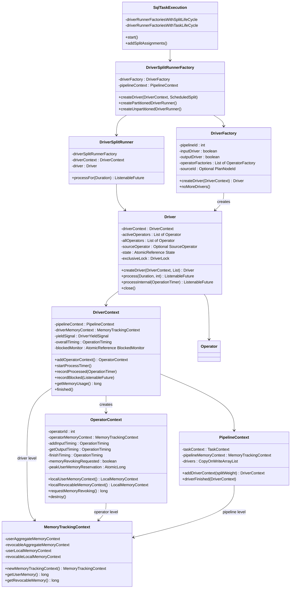
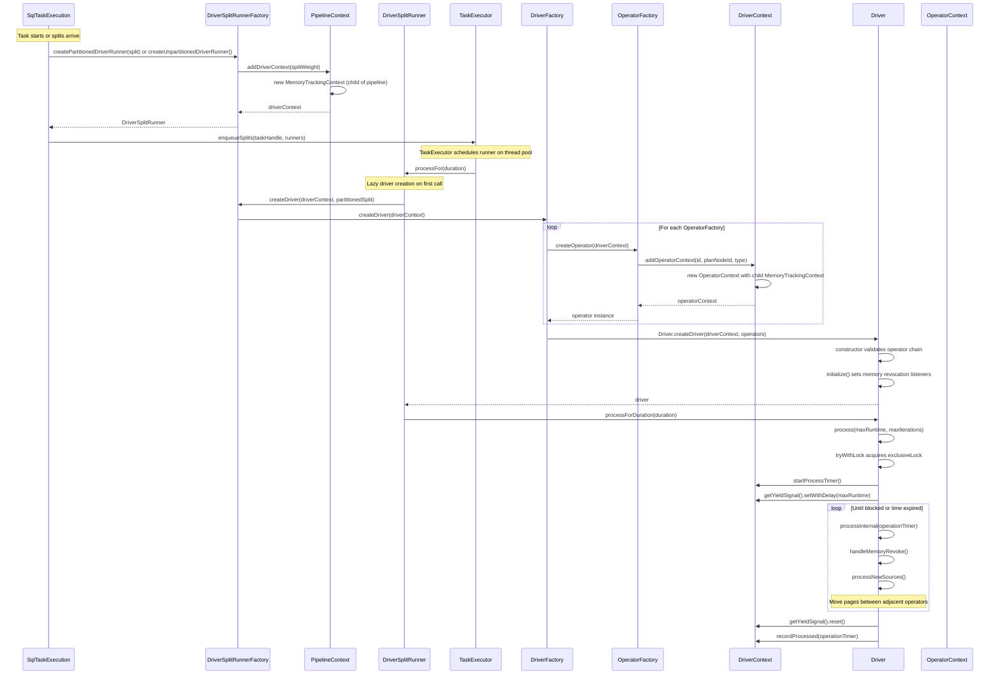

# Module Teardown: Driver Initialization & Pipeline Plumbing (Task 2.3.A)

## Table of Contents

- [0. Research Focus](#0-research-focus)
- [1. High-Level Overview](#1-high-level-overview)
- [2. Structural Architecture](#2-structural-architecture)
  - [Class Diagram](#class-diagram)
- [3. Execution & Call Flow](#3-execution-call-flow)
  - [Sequence Diagram](#sequence-diagram)
  - [Step-by-step Text Breakdown](#step-by-step-text-breakdown)
- [4. Concurrency & State Management](#4-concurrency-state-management)
  - [Threading Model](#threading-model)
  - [State Machine](#state-machine)
  - [Synchronization](#synchronization)
- [5. Memory & Resource Profile](#5-memory-resource-profile)
  - [Allocation Pattern](#allocation-pattern)
  - [Memory Tracking](#memory-tracking)
  - [CPU Tracking](#cpu-tracking)
  - [Blocked Time Tracking](#blocked-time-tracking)
- [6. Key Design Insights](#6-key-design-insights)
- [7. Porting Considerations (Java to Rust)](#7-porting-considerations-java-to-rust)


## 0. Research Focus
* **Task ID:** 2.3.A
* **Focus:** How is a `Driver` instantiated as a sequence of `Operator` instances? Trace how the `DriverContext` is used to track memory and CPU at the driver level.

## 1. High-Level Overview
* **Core Responsibility:** A `Driver` is the unit of execution in Trino's task engine. It encapsulates a pipeline of `Operator` instances connected in a linear chain, shuttling `Page` objects from a source operator through intermediate operators to a sink. The `DriverContext` tracks per-driver wall/CPU timing, blocked time, and acts as the memory-accounting parent for all operator memory contexts within that driver. The `DriverFactory` is the template that stamps out `Driver` instances by iterating its list of `OperatorFactory` objects and calling `createOperator(driverContext)` on each.
* **Key Triggers:**
  - `SqlTaskExecution.scheduleDriversForTaskLifeCycle()` -- creates drivers for pipelines with task lifecycle (build-side hash joins, output buffers, etc.)
  - `SqlTaskExecution.schedulePartitionedSource()` -- creates one driver per partitioned split (table scans)
  - `DriverSplitRunner.processFor()` -- lazily creates the driver on first call from the `TaskExecutor`

## 2. Structural Architecture
* **Primary Source Files:**
  - `core/trino-main/src/main/java/io/trino/operator/Driver.java` -- The pipeline executor
  - `core/trino-main/src/main/java/io/trino/operator/DriverContext.java` -- Memory + CPU tracking for one driver
  - `core/trino-main/src/main/java/io/trino/operator/DriverFactory.java` -- Template for creating drivers from operator factories
  - `core/trino-main/src/main/java/io/trino/operator/OperatorContext.java` -- Per-operator memory/timing stats
  - `core/trino-main/src/main/java/io/trino/operator/PipelineContext.java` -- Aggregate stats for all drivers in one pipeline
  - `core/trino-main/src/main/java/io/trino/operator/OperationTimer.java` -- Wall and CPU time measurement utility
  - `core/trino-main/src/main/java/io/trino/operator/DriverYieldSignal.java` -- Cooperative time-slicing signal
  - `core/trino-main/src/main/java/io/trino/execution/SqlTaskExecution.java` -- Orchestrator that creates `DriverSplitRunner` instances and enqueues them
  - `lib/trino-memory-context/src/main/java/io/trino/memory/context/MemoryTrackingContext.java` -- Hierarchical memory accounting

* **Key Data Structures:**
  - `Driver.State` -- enum `{ALIVE, NEED_DESTRUCTION, DESTROYING, DESTROYED}`
  - `Driver.DriverLock` -- Non-reentrant `ReentrantLock` wrapper with owner tracking and interruptibility
  - `DriverContext.OperationTiming overallTiming` -- accumulated wall/CPU nanos for entire driver
  - `DriverContext.BlockedMonitor` -- measures blocked wall-clock time intervals
  - `MemoryTrackingContext` -- holds `userAggregateMemoryContext` and `revocableAggregateMemoryContext` at every level (task, pipeline, driver, operator)
  - `OperationTimer` -- captures `ThreadMXBean.getCurrentThreadCpuTime()` deltas to measure real CPU consumed

### Class Diagram



## 3. Execution & Call Flow

### Sequence Diagram



### Step-by-step Text Breakdown

**Phase 1: Context and Runner Creation**

1. `SqlTaskExecution` receives `DriverFactory` instances from the `LocalExecutionPlan` (output of the planner). Factories are classified into split-lifecycle (one driver per split) vs. task-lifecycle (fixed number of drivers).

2. For each driver to be created, `DriverSplitRunnerFactory.createDriverRunner()` is called. This immediately calls `pipelineContext.addDriverContext(splitWeight)` which:
   - Creates a new `MemoryTrackingContext` as a child of the pipeline's memory context
   - Constructs a `DriverContext` with references to the notification executor, yield executor, timeout executor

3. A `DriverSplitRunner` is constructed holding the `DriverContext` and an optional `ScheduledSplit`. The runner is enqueued into the `TaskExecutor`.

**Phase 2: Lazy Driver Instantiation**

4. On the first call to `DriverSplitRunner.processFor(duration)`, the actual driver creation happens:

```java
// DriverSplitRunner.processFor()
if (this.driver == null) {
    this.driver = driverSplitRunnerFactory.createDriver(driverContext, partitionedSplit);
}
```

5. `DriverSplitRunnerFactory.createDriver()` calls `driverFactory.createDriver(driverContext)`. Inside `DriverFactory.createDriver()`:

```java
public Driver createDriver(DriverContext driverContext) {
    List<Operator> operators = new ArrayList<>(operatorFactories.size());
    synchronized (this) {
        checkState(!noMoreDrivers, "noMoreDrivers is already set");
        for (OperatorFactory operatorFactory : operatorFactories) {
            Operator operator = operatorFactory.createOperator(driverContext);
            operators.add(operator);
        }
    }
    return Driver.createDriver(driverContext, operators);
}
```

The `synchronized` block ensures that `noMoreDrivers()` cannot be called concurrently with `createDriver()`. Each `OperatorFactory.createOperator(driverContext)` typically calls `driverContext.addOperatorContext()` internally, which creates the per-operator `OperatorContext` with its own child `MemoryTrackingContext`.

**Phase 3: Driver Constructor and Initialization**

6. `Driver.createDriver(driverContext, operators)` is a two-phase static factory:

```java
public static Driver createDriver(DriverContext driverContext, List<Operator> operators) {
    Driver driver = new Driver(driverContext, operators);
    driver.initialize();
    return driver;
}
```

7. The constructor validates invariants:
   - At least two operators are required
   - At most one `SourceOperator` is allowed
   - Sets up `pendingSplitAssignmentUpdates` (staging area for splits)
   - Creates an already-completed `driverBlockedFuture`

8. `initialize()` is separate from the constructor to avoid leaking `this` to another thread. It wires up memory revocation listeners:

```java
private void initialize() {
    activeOperators.stream()
            .map(Operator::getOperatorContext)
            .forEach(operatorContext -> operatorContext.setMemoryRevocationRequestListener(
                () -> driverBlockedFuture.get().set(null)));
}
```

This ensures that when any operator receives a memory revocation request, the driver's blocked future is signaled, unblocking the scheduler thread.

**Phase 4: Page Processing Loop**

9. `Driver.process(maxRuntime, maxIterations)` acquires the `exclusiveLock` with a 100ms timeout, then enters the main loop:

```java
while (!isTerminatingOrDoneInternal()) {
    ListenableFuture<Void> future = processInternal(operationTimer);
    iterations++;
    if (!future.isDone()) {
        return updateDriverBlockedFuture(future);
    }
    if (System.nanoTime() - start >= maxRuntimeInNanos || iterations >= maxIterations) {
        break;
    }
}
```

10. `processInternal()` is the core page-shuttling logic:
    - First handles any pending memory revocation via `handleMemoryRevoke()`
    - Drains the split staging area via `processNewSources()`
    - Iterates through adjacent operator pairs: for each pair `(current, next)`:
      - If `current` is not finished and `next` needs input and neither is blocked, calls `current.getOutput()` and feeds the resulting page to `next.addInput(page)`
      - If `current` is finished, calls `next.finish()`
    - Removes finished operators from the bottom of the pipeline
    - If no pages were moved, collects blocked futures from all operators and returns a composite blocked future

## 4. Concurrency & State Management

### Threading Model

The `Driver` is designed for **single-threaded execution with concurrent state changes**. The comment at the top of `Driver.java` summarizes the strategy:

> As a general strategy the methods should "stage" a change and only process the actual change before lock release. This assures that only one thread will be working with the operators at a time and state changer threads are not blocked.

Key threads involved:
- **TaskExecutor worker thread** -- calls `processFor()` on the `DriverSplitRunner`, which calls `driver.processForDuration()`
- **Coordinator thread** -- calls `updateSplitAssignment()` to deliver new splits
- **Memory revocation thread** -- calls `OperatorContext.requestMemoryRevoking()` which triggers the listener

### State Machine

```
ALIVE --> NEED_DESTRUCTION --> DESTROYING --> DESTROYED
```

- `ALIVE`: Normal operating state. Processes pages, accepts splits.
- `NEED_DESTRUCTION`: Set when `close()` is called or when the pipeline's last operator is finished. Destruction is deferred to the next lock acquisition.
- `DESTROYING`: Transition happens in `destroyIfNecessary()` under the lock. Calls `close()` on all operators and `destroy()` on all `OperatorContext` instances.
- `DESTROYED`: Final state. The `destroyedFuture` is completed after the lock is released.

The state machine is implemented with `AtomicReference<State>` and CAS operations, allowing `close()` to be called from any thread without blocking.

### Synchronization

**DriverLock (custom non-reentrant lock):**

```java
private static class DriverLock {
    private final ReentrantLock lock = new ReentrantLock();
    private Thread currentOwner;
    private boolean currentOwnerInterruptionAllowed;
    private List<StackTraceElement> interrupterStack;
}
```

- Non-reentrant by design (explicitly checks `!lock.isHeldByCurrentThread()`)
- Tracks the current owner thread and whether it can be interrupted
- `interruptCurrentOwner()` is called by `close()` to wake up a running `process()` call
- The `interrupterStack` is stored for debugging purposes only

**Split staging area (lock-free):**
`pendingSplitAssignmentUpdates` is an `AtomicReference<SplitAssignment>` that accumulates updates via CAS-based `updateAndGet`. The actual processing happens under the exclusive lock in `processNewSources()`.

**Memory futures:**
`OperatorContext` uses `AtomicReference<SettableFuture<Void>>` for `memoryFuture` and `revocableMemoryFuture`. When a memory allocation fails, the operator becomes blocked on this future. When memory is freed, the future is completed, unblocking the operator.

## 5. Memory & Resource Profile

### Allocation Pattern

Memory is tracked in a strict 4-level hierarchy:

```
QueryContext (QueryMemoryPool)
  --> TaskContext.taskMemoryContext (MemoryTrackingContext)
    --> PipelineContext.pipelineMemoryContext (MemoryTrackingContext, child of task)
      --> DriverContext.driverMemoryContext (MemoryTrackingContext, child of pipeline)
        --> OperatorContext.operatorMemoryContext (MemoryTrackingContext, child of driver)
```

Each level is created by calling `parentContext.newMemoryTrackingContext()`:

```java
// MemoryTrackingContext.newMemoryTrackingContext()
public MemoryTrackingContext newMemoryTrackingContext() {
    return new MemoryTrackingContext(
            userAggregateMemoryContext.newAggregatedMemoryContext(),
            revocableAggregateMemoryContext.newAggregatedMemoryContext());
}
```

This creates child `AggregatedMemoryContext` instances. When a child allocates memory, the allocation automatically propagates up to the parent contexts.

### Memory Tracking

**At the Operator level (leaf allocations):**

Operators obtain `LocalMemoryContext` handles from their `OperatorContext`:

```java
// Operators call one of these to get a memory context:
public LocalMemoryContext localUserMemoryContext()       // managed lifecycle
public LocalMemoryContext localRevocableMemoryContext()  // managed lifecycle
public LocalMemoryContext newLocalUserMemoryContext(tag) // caller-managed lifecycle
```

These are wrapped in `InternalLocalMemoryContext` which intercepts every `setBytes()` / `addBytes()` call to:
1. Delegate to the real `LocalMemoryContext` (which propagates up the hierarchy)
2. Call `updateMemoryFuture()` if the allocation blocks (query memory pool full)
3. Call `updatePeakMemoryReservations()` to track peak user/revocable/total memory

**Peak tracking in OperatorContext:**

```java
private void updatePeakMemoryReservations() {
    long userMemory = operatorMemoryContext.getUserMemory();
    long revocableMemory = operatorMemoryContext.getRevocableMemory();
    long totalMemory = userMemory;
    peakUserMemoryReservation.accumulateAndGet(userMemory, Math::max);
    peakRevocableMemoryReservation.accumulateAndGet(revocableMemory, Math::max);
    peakTotalMemoryReservation.accumulateAndGet(totalMemory, Math::max);
}
```

**At the Driver level (aggregation):**

`DriverContext` reads aggregate memory from its `driverMemoryContext`:

```java
public long getMemoryUsage() {
    return driverMemoryContext.getUserMemory();
}
public long getRevocableMemoryUsage() {
    return driverMemoryContext.getRevocableMemory();
}
```

These values are the sum of all operator-level allocations within this driver.

**Memory revocation flow:**

1. A memory management thread calls `OperatorContext.requestMemoryRevoking()` on operators with revocable memory
2. This sets `memoryRevokingRequested = true` and fires the `memoryRevocationRequestListener`
3. The listener (set by `Driver.initialize()`) completes the `driverBlockedFuture`, unblocking the driver
4. On the next `processInternal()`, `handleMemoryRevoke()` calls `operator.startMemoryRevoke()`
5. When the returned future completes, `operator.finishMemoryRevoke()` is called

**Cleanup on destruction:**

```java
// Driver.destroyIfNecessary()
inFlightException = closeAndDestroyOperators(activeOperators);
if (driverContext.getMemoryUsage() > 0) {
    log.error("Driver still has memory reserved after freeing all operator memory.");
}
driverContext.finished();
```

`OperatorContext.destroy()` closes the `operatorMemoryContext` and verifies that both user and revocable memory are zero, throwing `TrinoException` if any leak is detected:

```java
public void destroy() {
    synchronized (this) { memoryRevocationRequestListener = null; }
    // memoize and clear infoSupplier to prevent holding large objects
    operatorMemoryContext.close();
    if (operatorMemoryContext.getUserMemory() != 0) {
        throw new TrinoException(GENERIC_INTERNAL_ERROR, ...);
    }
}
```

### CPU Tracking

CPU time is tracked using `OperationTimer` which reads `ThreadMXBean.getCurrentThreadCpuTime()`:

```java
class OperationTimer {
    private static final ThreadMXBean THREAD_MX_BEAN = ManagementFactory.getThreadMXBean();

    OperationTimer(boolean trackOverallCpuTime, boolean trackOperationCpuTime) {
        wallStart = System.nanoTime();
        cpuStart = trackOverallCpuTime ? currentThreadCpuTime() : 0;
    }
}
```

Two granularity levels exist:
- `trackOverallCpuTime` (driver level) -- always enabled when `isCpuTimerEnabled()` is true
- `trackOperationCpuTime` (per-operator level) -- only enabled when `isPerOperatorCpuTimerEnabled()` is true

The timer is created at the start of `process()`:

```java
private OperationTimer createTimer() {
    return new OperationTimer(
            driverContext.isCpuTimerEnabled(),
            driverContext.isCpuTimerEnabled() && driverContext.isPerOperatorCpuTimerEnabled());
}
```

Per-operator timings are recorded via `recordGetOutput()`, `recordAddInput()`, `recordFinish()` which call `operationTimer.recordOperationComplete(operationTiming)`. The overall timing is captured in `driverContext.recordProcessed(operationTimer)` which calls `operationTimer.end(overallTiming)`.

### Blocked Time Tracking

When the driver is blocked (no pages can move), a `BlockedMonitor` captures the duration:

```java
// DriverContext.recordBlocked()
public void recordBlocked(ListenableFuture<Void> blocked) {
    BlockedMonitor monitor = new BlockedMonitor();
    BlockedMonitor oldMonitor = blockedMonitor.getAndSet(monitor);
    if (oldMonitor != null) { oldMonitor.run(); } // finalize old monitor
    blocked.addListener(monitor, notificationExecutor);
}
```

`BlockedMonitor.run()` computes the elapsed time and adds it to `blockedWallNanos`.

## 6. Key Design Insights

1. **Two-phase construction prevents unsafe publication.** `Driver` uses a static factory `createDriver()` that first constructs the object, then calls `initialize()`. The `initialize()` method registers memory revocation listeners that reference `this`. If this were done in the constructor, the `this` reference would be leaked to other threads before construction is complete. This is a textbook Java concurrency pattern.

2. **The Driver is NOT thread-safe by design.** Only one thread can work with operators at a time, enforced by the `DriverLock`. However, state changes (close, split assignment) are "staged" using atomic references (`pendingSplitAssignmentUpdates`, `state`) and processed only when the lock is acquired. This avoids blocking callers that need to signal the driver.

3. **The DriverLock is intentionally non-reentrant.** Unlike a typical `ReentrantLock`, re-acquisition is forbidden (`checkState(!lock.isHeldByCurrentThread())`). This prevents subtle bugs where nested lock acquisitions could lead to re-entrant operator calls. The lock also tracks the current owner and supports interruption for fast shutdown.

4. **Memory context hierarchy enables aggregation without coordination.** Each level creates child `AggregatedMemoryContext` instances. When a leaf-level `LocalMemoryContext.setBytes()` is called, the allocation automatically propagates up through the parent chain to the `QueryContext`. No explicit rollup is needed. This is why `DriverContext.getMemoryUsage()` simply reads `driverMemoryContext.getUserMemory()` -- it is always the sum of all child allocations.

5. **Memory revocation is cooperative, not preemptive.** The system does not forcibly free operator memory. Instead, it sets a flag (`memoryRevokingRequested`), fires a listener to unblock the driver, and waits for the driver's next `processInternal()` call to invoke `operator.startMemoryRevoke()`. This means revocation latency depends on when the driver next gets a time slice.

6. **Page shuttling uses a pull model with finish propagation.** The inner loop in `processInternal()` iterates forward through operators: it pulls output from operator[i] and pushes it to operator[i+1]. When an operator finishes, `finish()` is called on the downstream operator. Finished operators are removed from `activeOperators` from the bottom up, and the new bottom operator is immediately told it is "finished" as well.

7. **DriverFactory synchronizes createDriver() and noMoreDrivers().** The `synchronized(this)` block inside `DriverFactory.createDriver()` ensures that `noMoreDrivers()` (which calls `operatorFactory.noMoreOperators()` on all factories) cannot interleave with operator creation. This is critical because some operator factories (e.g., hash build) perform cleanup in `noMoreOperators()` that assumes all operators have been created.

8. **Lazy driver creation in DriverSplitRunner.** The actual `Driver` is not created when the `DriverSplitRunner` is constructed. It is created on the first call to `processFor()` by the `TaskExecutor` thread pool. However, the `DriverContext` IS created eagerly (in `createDriverRunner()`) so that driver counts are accurate for work distribution balancing across nodes.

9. **The yield signal prevents time-slice starvation.** `DriverYieldSignal.setWithDelay()` schedules a future on the `yieldExecutor` that sets `yield = true` after `maxRunNanos`. Operators check `yieldSignal.isSet()` and voluntarily return from `getOutput()` if true. On close, `yieldImmediatelyForTermination()` sets the flag immediately and prevents any future `setWithDelay()` calls, ensuring fast shutdown.

10. **Spill accounting flows through DriverContext to PipelineContext.** The `OperatorContext` contains an `OperatorSpillContext` that delegates `reserveSpill()`/`freeSpill()` to the `DriverContext`, which in turn delegates to `PipelineContext`, which delegates to `TaskContext`. This creates a reservation chain where spill bytes are tracked at every level.

## 7. Porting Considerations (Java to Rust)

1. **DriverLock as an exclusive lock wrapper**: In Rust, this maps naturally to a `Mutex<DriverState>` that owns all mutable driver state. The non-reentrant property is the default for `std::sync::Mutex`. The interruptibility feature (for fast close) could be modeled using a `CancellationToken` or `tokio::select!` with a shutdown signal.

2. **AtomicReference-based staging area**: The `pendingSplitAssignmentUpdates` pattern (atomic swap + process under lock) maps to `AtomicCell` or a `Mutex<Option<SplitAssignment>>` with a try-lock pattern.

3. **Memory context hierarchy**: The tree of `AggregatedMemoryContext` objects with automatic propagation could be modeled with `Arc<AtomicI64>` shared between parent and child, or with a custom allocator that tracks subtree usage. Rust's ownership model makes it natural to enforce the invariant that child contexts cannot outlive parents.

4. **OperationTimer using ThreadMXBean**: Rust does not have a direct equivalent of JMX's `getCurrentThreadCpuTime()`. On Linux, `clock_gettime(CLOCK_THREAD_CPUTIME_ID)` provides the same measurement. The `libc` crate or `nix` crate can be used.

5. **SettableFuture/ListenableFuture for blocking**: In async Rust, this maps to `tokio::sync::Notify` or `tokio::sync::watch::Sender<()>`. The pattern of "operator returns a future that completes when unblocked" maps directly to `async fn is_blocked() -> ()` or polling-based `Future` implementations.

6. **CopyOnWriteArrayList for operatorContexts**: The `CopyOnWriteArrayList` used in `DriverContext.operatorContexts` (rarely written, frequently read) can be replaced with `Arc<Vec<OperatorContext>>` if contexts are added only during construction, or `arc_swap::ArcSwap<Vec<...>>` if dynamic addition is needed.

7. **Cooperative yield signal**: The `DriverYieldSignal` (scheduled future sets an `AtomicBool`) can be a `tokio::time::sleep()` racing with the main processing loop via `tokio::select!`, or a simple `Arc<AtomicBool>` polled by operators.

8. **Operator trait**: The `Operator` interface with `needsInput()`, `addInput()`, `getOutput()`, `finish()`, `isFinished()`, `isBlocked()` is a good fit for a Rust trait. The memory revocation methods (`startMemoryRevoke`, `finishMemoryRevoke`) can have default implementations returning `Ready(())`.
