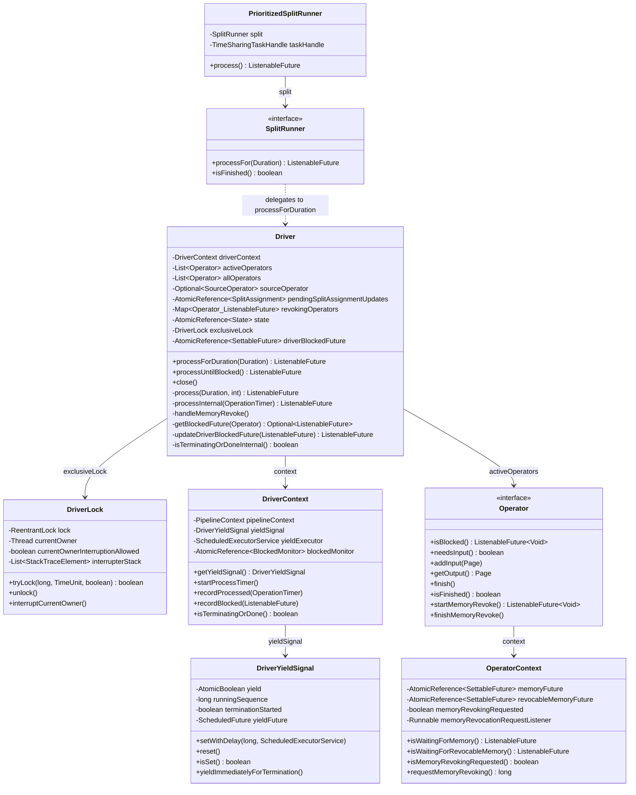
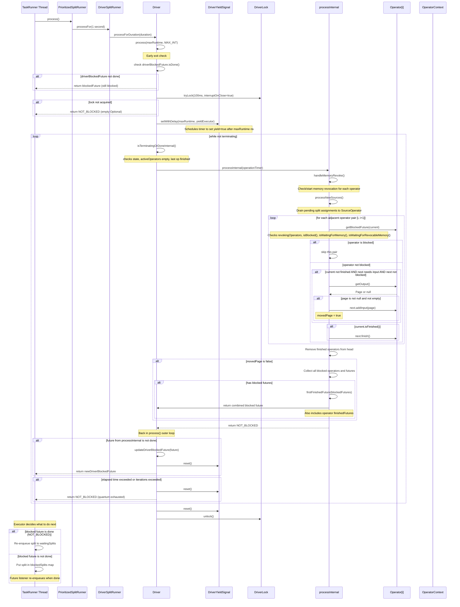
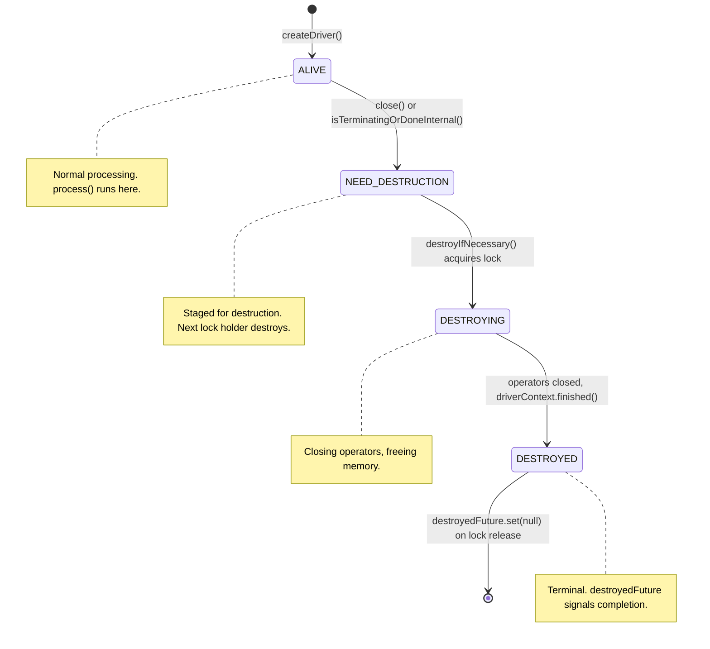

# Module Teardown: The Cooperative Yield Loop -- The Engine Heart (Task 2.3.B)

## Table of Contents

- [0. Research Focus](#0-research-focus)
- [1. High-Level Overview](#1-high-level-overview)
- [2. Structural Architecture](#2-structural-architecture)
  - [Class Diagram](#class-diagram)
- [3. Execution and Call Flow](#3-execution-and-call-flow)
  - [The Full Call Chain](#the-full-call-chain)
  - [Sequence Diagram](#sequence-diagram)
  - [Step-by-step Text Breakdown](#step-by-step-text-breakdown)
- [4. Concurrency and State Management](#4-concurrency-and-state-management)
  - [Threading Model](#threading-model)
  - [State Machine](#state-machine)
  - [Synchronization](#synchronization)
  - [The `getBlockedFuture()` Priority Order](#the-getblockedfuture-priority-order)
- [5. Memory and Resource Profile](#5-memory-and-resource-profile)
- [6. Key Design Insights](#6-key-design-insights)
  - [Insight 1: The "No Page Moved" Heuristic is the Blocking Decision Point](#insight-1-the-no-page-moved-heuristic-is-the-blocking-decision-point)
  - [Insight 2: Two-Level Yield -- Timer + Intra-Operator](#insight-2-two-level-yield-timer-intra-operator)
  - [Insight 3: The `driverBlockedFuture` Fast-Path Avoids Lock Contention](#insight-3-the-driverblockedfuture-fast-path-avoids-lock-contention)
  - [Insight 4: Memory Revocation Wakes Blocked Drivers](#insight-4-memory-revocation-wakes-blocked-drivers)
  - [Insight 5: The Pipeline Shrinks at Runtime](#insight-5-the-pipeline-shrinks-at-runtime)
  - [Insight 6: `firstFinishedFuture()` Implements Cooperative "select()"](#insight-6-firstfinishedfuture-implements-cooperative-select)
  - [Insight 7: Lock Strategy Separates State Changes from Processing](#insight-7-lock-strategy-separates-state-changes-from-processing)
  - [Insight 8: Blocked Timeout Prevents Indefinite Stalls](#insight-8-blocked-timeout-prevents-indefinite-stalls)
  - [Insight 9: The Executor's Two-Queue Model](#insight-9-the-executors-two-queue-model)
- [7. Porting Considerations (Java to Rust)](#7-porting-considerations-java-to-rust)
  - [Cooperative Yield Mechanism](#cooperative-yield-mechanism)
  - [ListenableFuture to Rust Future/Waker](#listenablefuture-to-rust-futurewaker)
  - [DriverLock to Rust Mutex](#driverlock-to-rust-mutex)
  - [Page Movement Loop](#page-movement-loop)
  - [Memory Revocation](#memory-revocation)
  - [Key Architectural Decision](#key-architectural-decision)


## 0. Research Focus
* **Task ID:** 2.3.B
* **Focus:** Document exactly what causes a `Driver` to suspend (yield) and return a `ListenableFuture` to the executor -- e.g., blocked on an operator, or quantum exhausted. This is the core cooperative scheduling loop that enables Trino's multi-tenant, time-sliced execution model.

## 1. High-Level Overview
* **Core Responsibility:** The `Driver` is the fundamental unit of execution in Trino. It holds an ordered pipeline of `Operator` instances and runs a cooperative loop that pulls pages from source operators, pushes them through intermediate operators, and delivers them to a sink. The Driver **never blocks a thread** -- instead it returns a `ListenableFuture<Void>` to the executor when it cannot make progress, allowing the thread to be reused for other work. This is the beating heart of Trino's cooperative multitasking engine.
* **Key Triggers (reasons a Driver yields control back to the executor):**
  1. **Operator blocked** -- an operator's `isBlocked()` returns an incomplete future (e.g., waiting for network data, hash build, or exchange buffer)
  2. **Memory wait** -- an operator's `OperatorContext.isWaitingForMemory()` or `isWaitingForRevocableMemory()` returns an incomplete future
  3. **Memory revocation in progress** -- an operator has a pending entry in `revokingOperators` map
  4. **Time quantum exhausted** -- the `DriverYieldSignal` fires after `maxRuntime` nanoseconds, causing `process()` outer loop to `break`
  5. **Iteration limit reached** -- the `maxIterations` parameter is hit
  6. **Pipeline termination** -- `driverContext.isTerminatingOrDone()` becomes true, or the last operator is finished
  7. **Intra-operator yield** -- operators like `PageProcessor` check `yieldSignal.isSet()` between projections and return `null` from `getOutput()`, preventing the driver from moving a page and triggering the blocked-check path
  8. **Lock acquisition failure** -- the driver cannot acquire its `exclusiveLock` within the 100ms timeout

## 2. Structural Architecture
* **Primary Source Files:**
  - `core/trino-main/src/main/java/io/trino/operator/Driver.java` -- the main loop
  - `core/trino-main/src/main/java/io/trino/operator/DriverYieldSignal.java` -- timer-based yield signal
  - `core/trino-main/src/main/java/io/trino/operator/DriverContext.java` -- per-driver context and timing
  - `core/trino-main/src/main/java/io/trino/operator/Operator.java` -- operator interface
  - `core/trino-main/src/main/java/io/trino/operator/OperatorContext.java` -- memory futures and blocked tracking
  - `core/trino-main/src/main/java/io/trino/execution/executor/timesharing/PrioritizedSplitRunner.java` -- time-sharing executor caller
  - `core/trino-main/src/main/java/io/trino/execution/executor/dedicated/SplitProcessor.java` -- dedicated executor caller
  - `core/trino-main/src/main/java/io/trino/execution/SqlTaskExecution.java` -- `DriverSplitRunner` adapter
  - `core/trino-main/src/main/java/io/trino/operator/project/PageProcessor.java` -- intra-operator yield example

* **Key Data Structures:**

| Structure | Type | Purpose |
|-----------|------|---------|
| `activeOperators` | `ArrayList<Operator>` | Mutable list of live operators; finished ones are removed from the head |
| `state` | `AtomicReference<State>` | 4-state lifecycle: ALIVE, NEED_DESTRUCTION, DESTROYING, DESTROYED |
| `driverBlockedFuture` | `AtomicReference<SettableFuture<Void>>` | The "master" future that the executor waits on; completed when any operator unblocks or memory revocation is requested |
| `pendingSplitAssignmentUpdates` | `AtomicReference<SplitAssignment>` | Staging area for new splits; drained under lock |
| `revokingOperators` | `Map<Operator, ListenableFuture<Void>>` | Tracks operators currently undergoing memory revocation |
| `exclusiveLock` | `DriverLock` | Non-reentrant lock ensuring single-threaded access to operators |
| `yieldSignal` | `DriverYieldSignal` | Timer-based cooperative yield signal (AtomicBoolean + ScheduledFuture) |
| `Operator.NOT_BLOCKED` | `ListenableFuture<Void>` | Sentinel: `immediateVoidFuture()` -- already-completed future meaning "not blocked" |

### Class Diagram



## 3. Execution and Call Flow

### The Full Call Chain

The call chain from executor thread to operator-level yield:

```
TimeSharingTaskExecutor.TaskRunner.run()
  -> PrioritizedSplitRunner.process()                    [1-second quanta]
    -> SplitRunner.processFor(SPLIT_RUN_QUANTA)
      -> DriverSplitRunner.processFor(duration)
        -> Driver.processForDuration(duration)
          -> Driver.process(duration, MAX_INT)
            -> tryWithLock(100ms, interruptOnClose=true)
              -> yieldSignal.setWithDelay(maxRuntime, yieldExecutor)
              -> while (!isTerminatingOrDoneInternal()):
                  -> processInternal(operationTimer)      [ONE iteration]
                     -> returns NOT_BLOCKED or a blocked future
                  -> if future not done: return updateDriverBlockedFuture(future)
                  -> if time or iterations exceeded: break
              -> yieldSignal.reset()
            -> return NOT_BLOCKED or blocked future
```

### Sequence Diagram



### Step-by-step Text Breakdown

**Phase 1: Entry from Executor**

1. The `TimeSharingTaskExecutor.TaskRunner` takes a `PrioritizedSplitRunner` from the `waitingSplits` priority queue.
2. `PrioritizedSplitRunner.process()` calls `split.processFor(SPLIT_RUN_QUANTA)` where `SPLIT_RUN_QUANTA = 1 second`.
3. `DriverSplitRunner.processFor(duration)` lazily creates the `Driver` on first call, then delegates to `driver.processForDuration(duration)`.
4. `processForDuration()` calls `process(duration, Integer.MAX_VALUE)`.

**Phase 2: Pre-loop Guards in `process()`**

5. **Quick blocked check**: Before acquiring the lock, `process()` checks if `driverBlockedFuture` is still incomplete. If so, the Driver is still blocked from a previous call and returns immediately. This avoids unnecessary lock contention.
6. **Lock acquisition**: Attempts `tryWithLock(100ms, interruptOnClose=true)`. If the lock cannot be acquired within 100ms, returns `NOT_BLOCKED` (the executor will re-enqueue).
7. **Yield signal armed**: `driverContext.getYieldSignal().setWithDelay(maxRuntimeInNanos, yieldExecutor)` schedules a `ScheduledFuture` that will set `yield = true` after `maxRuntime` nanoseconds.

**Phase 3: The Main Loop (inside the lock)**

8. **Termination check**: `isTerminatingOrDoneInternal()` returns true if state is not ALIVE, activeOperators is empty, the last operator is finished, or the driverContext is terminating. If true, the loop exits.
9. **`processInternal()` call**: This is where the real work happens -- ONE pass through the operator pipeline.

**Phase 4: Inside `processInternal()` -- One Pass Through the Pipeline**

10. **Memory revocation**: `handleMemoryRevoke()` iterates all active operators. For any operator where `isMemoryRevokingRequested()`, it calls `startMemoryRevoke()` and stores the future in `revokingOperators`. For already-revoking operators, it checks if the future is done and calls `finishMemoryRevoke()`.

11. **New sources**: `processNewSources()` drains `pendingSplitAssignmentUpdates` and calls `sourceOperator.addSplit()` for new splits and `noMoreSplits()` if signaled.

12. **Partial-pipeline finish**: If an operator was previously removed (pipeline shrunk), the new bottommost operator gets `finish()` called. This handles broken operators like `LookupJoinOperator` that need repeated finish calls.

13. **The page-movement loop** (the core): For each adjacent pair `(operators[i], operators[i+1])`:
    - **Skip blocked**: `getBlockedFuture(current)` checks 4 things in order:
      1. Is the operator in `revokingOperators`? (blocked regardless of future state)
      2. Is `operator.isBlocked()` not done?
      3. Is `operatorContext.isWaitingForMemory()` not done?
      4. Is `operatorContext.isWaitingForRevocableMemory()` not done?
    - **Move data**: If current is not finished, next is not blocked, and `next.needsInput()` is true, call `current.getOutput()`. If a non-empty page is returned, call `next.addInput(page)`. Set `movedPage = true`.
    - **Propagate finish**: If `current.isFinished()`, call `next.finish()`.

14. **Cleanup finished operators**: Scans from the end of `activeOperators` backward. For the highest-index finished operator, closes and destroys all operators from index 0 to that index. This prunes the pipeline from the source end.

15. **Blocked detection** (the yield decision): If no page was moved (`movedPage == false`):
    - Collect all blocked operators and their futures.
    - Also include each operator's `finishedFuture` (allows unblocking when an operator becomes finished).
    - Combine with `firstFinishedFuture()` -- a `SettableFuture` that completes when ANY of the constituent futures completes.
    - Apply optional blocked timeout via `withTimeout()`.
    - Record blocked time via `driverContext.recordBlocked()` and each `operatorContext.recordBlocked()`.
    - **Return the combined blocked future** -- this is the primary yield path.

**Phase 5: Post-processInternal Back in `process()` Loop**

16. **Blocked future check**: If `processInternal()` returned a future that is not done, call `updateDriverBlockedFuture(future)`:
    - Create a new `SettableFuture` for `driverBlockedFuture`.
    - Wire the source future to complete the driver future.
    - Check for memory revocation requests that might have arrived in between.
    - Return the new driver blocked future to the executor.

17. **Time/iteration check**: If `System.nanoTime() - start >= maxRuntimeInNanos` or `iterations >= maxIterations`, break out. Return `NOT_BLOCKED` (quantum exhausted, re-enqueue immediately).

18. **Otherwise**: Loop back to step 8 for another `processInternal()` iteration.

**Phase 6: Return to Executor**

19. `yieldSignal.reset()` cancels the scheduled yield timer.
20. `driverContext.recordProcessed(operationTimer)` records wall/CPU time.
21. Lock is released. During `tryWithLock`'s finally block, `processNewSources()` and `destroyIfNecessary()` are called opportunistically.
22. The executor receives either `NOT_BLOCKED` (re-enqueue to waitingSplits) or a blocked future (put in `blockedSplits` map with a listener that re-enqueues when resolved).

## 4. Concurrency and State Management

### Threading Model

Trino's Driver uses a **cooperative, non-preemptive** scheduling model:

- **Single-threaded operator access**: The `DriverLock` (a non-reentrant `ReentrantLock` wrapper) guarantees that only one thread touches the operators at a time. The lock is acquired for the duration of one `process()` call.
- **No thread affinity**: Different invocations of `process()` can run on different executor threads. The Driver is a state machine that picks up where it left off.
- **Interruptible processing**: When `close()` is called, it sets the yield signal for termination and interrupts the current lock owner (if `interruptOnClose` was true during lock acquisition). The processing thread catches the interrupt and converts it to a `TrinoException`.
- **Lock-free state changes**: Split assignments use `AtomicReference` staging (`pendingSplitAssignmentUpdates`) to avoid blocking the coordinator thread. State transitions use `AtomicReference<State>` with CAS operations.
- **Memory revocation listener**: The `memoryRevocationRequestListener` (set in `Driver.initialize()`) completes the `driverBlockedFuture`, waking the executor to re-schedule the driver even when it was previously blocked.

### State Machine



**Driver lifecycle states:**

| State | Meaning |
|-------|---------|
| `ALIVE` | Normal operation. `process()` actively moves pages. |
| `NEED_DESTRUCTION` | Destruction requested (close called, pipeline finished, or task terminated). Next lock acquisition will trigger destroy. |
| `DESTROYING` | Lock holder is actively closing operators and freeing resources. |
| `DESTROYED` | Terminal. `destroyedFuture` is set after lock release to notify waiters. |

### Synchronization

| Mechanism | Protects | Notes |
|-----------|----------|-------|
| `DriverLock` (exclusiveLock) | All operator calls, `activeOperators`, `currentSplitAssignment`, `revokingOperators` | Non-reentrant. tryLock with 100ms timeout for `process()`, immediate tryLock for state changes. |
| `AtomicReference<State>` | Driver lifecycle state | CAS-based transitions, lock-free reads. |
| `AtomicReference<SplitAssignment>` (pendingSplitAssignmentUpdates) | New split staging | Allows coordinator thread to stage splits without acquiring the driver lock. Uses `updateAndGet` for atomic merge. |
| `AtomicReference<SettableFuture<Void>>` (driverBlockedFuture) | Cross-call blocked signaling | Read without lock at `process()` entry for fast-path blocked check. |
| `synchronized` on DriverLock | `currentOwner`, `currentOwnerInterruptionAllowed`, `interrupterStack` | Protects interrupt metadata for the lock holder thread. |
| `synchronized` on OperatorContext | `memoryRevokingRequested`, `memoryRevocationRequestListener` | Thread-safe memory revocation signaling from the memory pool thread. |

### The `getBlockedFuture()` Priority Order

The `getBlockedFuture(Operator)` method checks four sources of blocking in strict priority order:

```java
// 1. Memory revocation in progress (highest priority -- operator is mid-revoke)
ListenableFuture<Void> blocked = revokingOperators.get(operator);
if (blocked != null) return Optional.of(blocked);

// 2. Operator-reported blocking (e.g., waiting for hash build, exchange data)
blocked = operator.isBlocked();
if (!blocked.isDone()) return Optional.of(blocked);

// 3. Waiting for user memory allocation
blocked = operator.getOperatorContext().isWaitingForMemory();
if (!blocked.isDone()) return Optional.of(blocked);

// 4. Waiting for revocable memory allocation
blocked = operator.getOperatorContext().isWaitingForRevocableMemory();
if (!blocked.isDone()) return Optional.of(blocked);

return Optional.empty(); // Not blocked
```

## 5. Memory and Resource Profile

| Resource | Accounting | Lifecycle |
|----------|-----------|-----------|
| **User memory** | Tracked via `OperatorContext.memoryFuture`. When an allocation exceeds the pool limit, `setBytes()`/`addBytes()` returns a blocked future. The future is stored in `memoryFuture` and checked by `isWaitingForMemory()`. | Released on `operator.close()` then `operatorContext.destroy()`. |
| **Revocable memory** | Tracked via `OperatorContext.revocableMemoryFuture`. Subject to memory revocation: the memory pool requests revocation, `requestMemoryRevoking()` sets the flag, the listener wakes the driver, `handleMemoryRevoke()` calls `startMemoryRevoke()`. | Revoked on demand, freed after `finishMemoryRevoke()`. |
| **Spill disk** | Via `driverContext.reserveSpill()`/`freeSpill()` propagated to `PipelineContext`. | Operator-managed through `SpillContext`. |
| **CPU time** | `OperationTimer` tracks wall and CPU nanos per `processInternal()` call. Per-operator timing via `recordGetOutput()`, `recordAddInput()`, `recordFinish()`. | Accumulated across all `process()` invocations. |
| **Blocked time** | `DriverContext.BlockedMonitor` and `OperatorContext.BlockedMonitor` track wall time spent blocked. | Measured from blocked future creation to completion. |
| **Thread time** | No thread is held while blocked. The executor thread is returned to the pool. | Thread cost is only during active `process()` calls (up to 1-second quanta). |

## 6. Key Design Insights

### Insight 1: The "No Page Moved" Heuristic is the Blocking Decision Point

The single most important design choice: `processInternal()` only checks for blocked operators when `movedPage == false`. If even one page was successfully moved between any operator pair, the method returns `NOT_BLOCKED` immediately, allowing the outer loop to call it again. This means:

- **Data flow has priority over blocking checks.** If data is flowing, the Driver keeps running.
- **Blocking is a last resort.** Only when the entire pipeline is stalled (no operator produced output for any downstream consumer) does the Driver look for which operators are blocked.
- **The `SourceOperator` exception**: Any call to a SourceOperator's `getOutput()` sets `movedPage = true` even if the page is null. This prevents the Driver from blocking on a source that has no data yet but might get splits soon.

### Insight 2: Two-Level Yield -- Timer + Intra-Operator

The yield mechanism operates at two levels:

1. **Driver level (timer-based)**: `DriverYieldSignal.setWithDelay()` schedules a `ScheduledFuture` that sets an `AtomicBoolean` after `maxRuntime` nanoseconds. The `process()` outer loop checks `System.nanoTime() - start >= maxRuntimeInNanos` after each `processInternal()` call. This is a coarse-grained time quantum (default 1 second from `SPLIT_RUN_QUANTA`).

2. **Operator level (signal-polling)**: Operators like `PageProcessor.ProjectSelectedPositions.processBatch()` check `yieldSignal.isSet()` between projecting individual columns. When set, they return a `ProcessBatchResult.processBatchYield()`, which propagates up as a `yielded()` `ProcessState`, causing `getOutput()` to return `null`. This prevents a single large page from monopolizing the thread for the entire quantum.

The two levels work together: the timer fires and sets the signal, and the next operator that checks the signal yields immediately, returning control to the `processInternal()` loop, which returns `NOT_BLOCKED`, which causes the `process()` outer loop to check the time and break.

### Insight 3: The `driverBlockedFuture` Fast-Path Avoids Lock Contention

Before even attempting to acquire the lock, `process()` checks:

```java
SettableFuture<Void> blockedFuture = driverBlockedFuture.get();
if (!blockedFuture.isDone()) {
    return blockedFuture;
}
```

This is a lock-free read of an `AtomicReference`. If the Driver is still blocked from a previous call (the future has not been completed), there is no point in acquiring the lock and running `processInternal()` -- nothing has changed. This avoids unnecessary contention when the executor speculatively re-schedules a blocked driver.

### Insight 4: Memory Revocation Wakes Blocked Drivers

When the memory pool needs to reclaim revocable memory, it calls `OperatorContext.requestMemoryRevoking()`. This sets `memoryRevokingRequested = true` and invokes the `memoryRevocationRequestListener`. This listener was installed in `Driver.initialize()` as:

```java
operatorContext.setMemoryRevocationRequestListener(
    () -> driverBlockedFuture.get().set(null));
```

This completes the current `driverBlockedFuture`, which wakes up the executor listener that re-enqueues the split. On the next `process()` call, `handleMemoryRevoke()` will find the flagged operator and call `startMemoryRevoke()`. Additionally, `updateDriverBlockedFuture()` rechecks for revocation requests after wiring the new future, preventing a race condition where the revocation signal arrives between checking the operator's blocked state and setting up the new future.

### Insight 5: The Pipeline Shrinks at Runtime

As operators finish processing, they are **removed from `activeOperators`**. Finished operators are closed and destroyed from the source end of the pipeline. The new bottommost operator gets `finish()` called on it. This means:

- The pipeline can shrink from N operators to 1 during execution.
- The page-movement loop automatically adjusts because it iterates `activeOperators.size() - 1` pairs.
- The check `activeOperators.size() != allOperators.size()` detects that the pipeline has already shrunk and ensures the new root operator is being finished.

### Insight 6: `firstFinishedFuture()` Implements Cooperative "select()"

When multiple operators are blocked, the Driver creates a composite future via `firstFinishedFuture()`:

```java
private static ListenableFuture<Void> firstFinishedFuture(List<ListenableFuture<Void>> futures) {
    SettableFuture<Void> result = SettableFuture.create();
    for (ListenableFuture<Void> future : futures) {
        future.addListener(() -> result.set(null), directExecutor());
    }
    return result;
}
```

This is analogous to `select()` / `epoll()` in systems programming: the Driver blocks on whichever future completes first. The list includes both operator blocked futures AND operator finished futures (via `getFinishedFuture()`), so the Driver wakes up when any operator either unblocks or finishes.

### Insight 7: Lock Strategy Separates State Changes from Processing

The note at the top of `Driver.java` explains the design: "As a general strategy the methods should 'stage' a change and only process the actual change before lock release." This means:

- **`updateSplitAssignment()`** does not need the lock to stage splits -- it uses `AtomicReference.updateAndGet()`.
- **`close()`** does not need the lock to set the state -- it uses `state.compareAndSet()`.
- **Processing** happens only inside `tryWithLock()`, which opportunistically calls `processNewSources()` and `destroyIfNecessary()` on every lock release.
- The while loop after the main task in `tryWithLock()` ensures pending updates and destruction are handled even if they arrive while the lock is held.

### Insight 8: Blocked Timeout Prevents Indefinite Stalls

`driverContext.getBlockedTimeout()` allows a per-driver timeout on blocked futures:

```java
if (driverContext.getBlockedTimeout().isPresent()) {
    blocked = withTimeout(
        nonCancellationPropagating(blocked),
        driverContext.getBlockedTimeout().get().toMillis(),
        MILLISECONDS,
        driverContext.getTimeoutExecutor());
}
```

This wraps the blocked future with a timeout, ensuring the Driver wakes up periodically even if no operator unblocks. This is a safety mechanism against deadlocks or stuck connectors.

### Insight 9: The Executor's Two-Queue Model

The executor (`TimeSharingTaskExecutor`) maintains two collections:
- **`waitingSplits`** (priority queue): Splits ready to run. The `TaskRunner` thread takes from here.
- **`blockedSplits`** (concurrent map): Splits waiting on a `ListenableFuture`. A listener on the future moves the split back to `waitingSplits` when the future completes.

The decision is made based on the return value of `split.process()`:
- `NOT_BLOCKED` (done future): Immediately `waitingSplits.offer(split)` -- quantum expired but can continue.
- Undone future: `blockedSplits.put(split, blocked)` with a listener.
- `split.isFinished()`: Call `splitFinished(split)` to clean up.

The dedicated executor (`SplitProcessor`) has a simpler model -- it runs in its own thread and calls `context.maybeYield()` (for NOT_BLOCKED returns) or `context.block(blocked)` (for blocked returns), letting the scheduler handle the thread.

## 7. Porting Considerations (Java to Rust)

### Cooperative Yield Mechanism
- **Java**: Uses `ScheduledExecutorService` to schedule a delayed task that sets an `AtomicBoolean`. Operators poll this boolean.
- **Rust approach**: Use `tokio::time::sleep()` in a `select!` or a simple `AtomicBool` with a background timer task. Alternatively, use a monotonic `Instant` check at yield points -- this avoids the scheduled task entirely and is more natural in Rust.

### ListenableFuture to Rust Future/Waker
- **Java**: `ListenableFuture<Void>` with `addListener()` callbacks. `SettableFuture` for manual completion.
- **Rust approach**: Use `tokio::sync::Notify` or `tokio::sync::oneshot` for the blocked signal. The `firstFinishedFuture` pattern maps to `tokio::select!` or `futures::future::select_all()`. The `driverBlockedFuture` pattern maps to a shared `Notify` that can be triggered from any source.

### DriverLock to Rust Mutex
- **Java**: `ReentrantLock` with `tryLock(timeout)` and thread interruption support.
- **Rust approach**: `tokio::sync::Mutex` for async-aware locking, or a simple `std::sync::Mutex` if processing is synchronous within the lock. The interrupt-current-owner pattern can be replaced with a `CancellationToken` from `tokio_util`.

### Page Movement Loop
- **Java**: Iterates `ArrayList<Operator>` with index-based access, calling virtual methods.
- **Rust approach**: Use a `Vec<Box<dyn Operator>>` with trait object dispatch, or an enum-based operator pipeline for static dispatch. The pull/push model (getOutput/addInput) can be preserved directly.

### Memory Revocation
- **Java**: Cross-thread signaling via `synchronized` blocks and `Runnable` listeners that complete `SettableFuture`.
- **Rust approach**: Use `Arc<AtomicBool>` for the revocation flag and `tokio::sync::Notify` for waking the driver. The revocation listener pattern maps to a channel or `Notify`.

### Key Architectural Decision
The Trino model is fundamentally a **synchronous operator pipeline that yields cooperatively**. In Rust, two approaches are viable:
1. **Preserve the sync model**: Use blocking threads with cooperative yield (like `rayon` work-stealing). Port the Driver loop almost directly.
2. **Go fully async**: Make each operator an async stream. The Driver becomes an async task that `await`s on `select!` of all operator futures. This is more idiomatic Rust but requires all operators to be async-safe.

The sync model is recommended for initial porting because it preserves the single-threaded operator invariant without requiring `Send + Sync` on all operator internal state.
