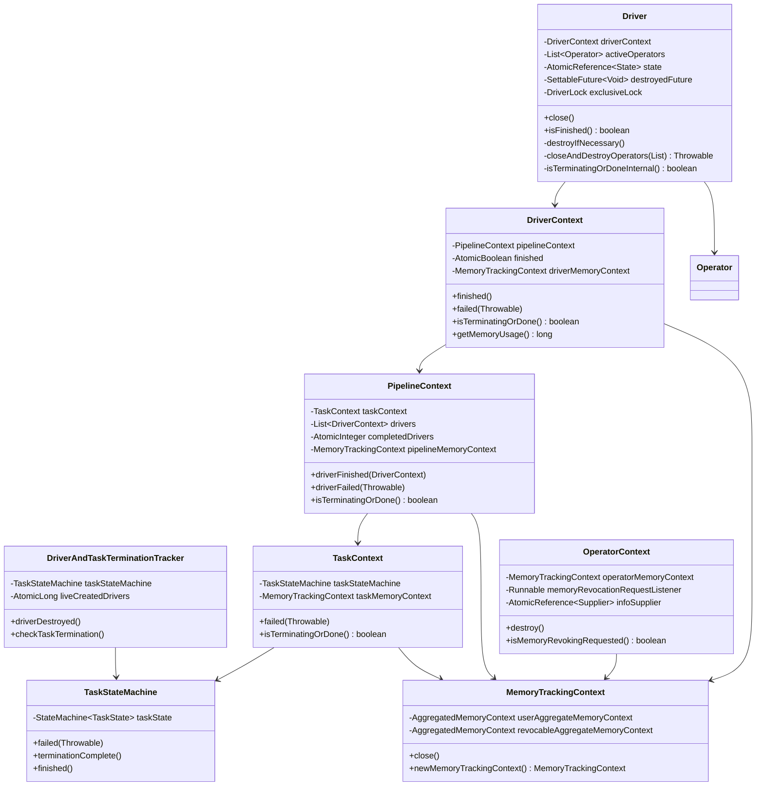
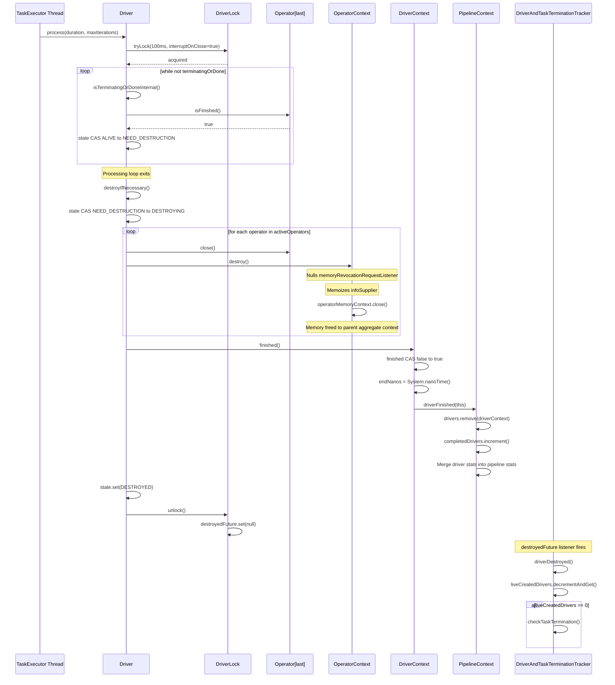
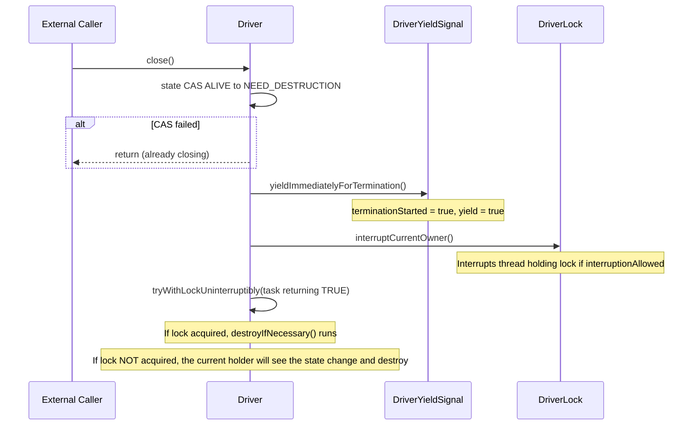

# Module Teardown: Driver Termination & Cleanup (Task 2.3.C)

## Table of Contents

- [0. Research Focus](#0-research-focus)
- [1. High-Level Overview](#1-high-level-overview)
- [2. Structural Architecture](#2-structural-architecture)
  - [Primary Source Files](#primary-source-files)
  - [Key Data Structures](#key-data-structures)
  - [Class Diagram](#class-diagram)
- [3. Execution & Call Flow](#3-execution-call-flow)
  - [Sequence Diagram: Normal Completion Path](#sequence-diagram-normal-completion-path)
  - [Sequence Diagram: External Close Path (Cancellation)](#sequence-diagram-external-close-path-cancellation)
  - [Step-by-step Text Breakdown](#step-by-step-text-breakdown)
- [4. Concurrency & State Management](#4-concurrency-state-management)
  - [Threading Model](#threading-model)
  - [State Machine](#state-machine)
  - [Synchronization](#synchronization)
- [5. Memory & Resource Profile](#5-memory-resource-profile)
  - [Allocation Pattern](#allocation-pattern)
  - [Memory Tracking -- Release Path (CRITICAL)](#memory-tracking-release-path-critical)
  - [Interrupt Safety During Cleanup](#interrupt-safety-during-cleanup)
- [6. Key Design Insights](#6-key-design-insights)
  - [Insight 1: Two-Phase Termination at Both Driver and Task Levels](#insight-1-two-phase-termination-at-both-driver-and-task-levels)
  - [Insight 2: Lock-Free State Staging with Deferred Execution](#insight-2-lock-free-state-staging-with-deferred-execution)
  - [Insight 3: destroyedFuture Is Set AFTER Lock Release](#insight-3-destroyedfuture-is-set-after-lock-release)
  - [Insight 4: Incremental Operator Cleanup Before Full Destruction](#insight-4-incremental-operator-cleanup-before-full-destruction)
  - [Insight 5: Memory Release Uses Force-Free Tag for Hierarchical Cleanup](#insight-5-memory-release-uses-force-free-tag-for-hierarchical-cleanup)
  - [Insight 6: Three Independent Error Recovery Strategies](#insight-6-three-independent-error-recovery-strategies)
  - [Insight 7: The tryWithLock Retry Loop Ensures Eventual Completion](#insight-7-the-trywithlock-retry-loop-ensures-eventual-completion)
  - [Insight 8: YieldSignal Has Permanent Termination Mode](#insight-8-yieldsignal-has-permanent-termination-mode)
- [7. Porting Considerations (Java to Rust)](#7-porting-considerations-java-to-rust)


## 0. Research Focus
* **Task ID:** 2.3.C
* **Focus:** When is a Driver considered done? Trace the cleanup path: closing operators, releasing memory back to the PipelineContext, and signaling the TaskStateMachine.

## 1. High-Level Overview
* **Core Responsibility:** A `Driver` is considered "done" when its terminal operator (the last in `activeOperators`) reports `isFinished()`, when an external `close()` call triggers termination, or when the parent `TaskContext` is already terminating/done. The cleanup path follows a strict bottom-up hierarchy: each `Operator` is closed and its `OperatorContext` destroyed (freeing operator-level memory), then `DriverContext.finished()` propagates stats up to `PipelineContext`, which removes the driver from its live list. When all drivers for a task reach the DESTROYED state, the `DriverAndTaskTerminationTracker` calls `TaskStateMachine.terminationComplete()` to move the task from a terminating state (CANCELING/ABORTING/FAILING) to a terminal state (CANCELED/ABORTED/FAILED).

* **Key Triggers:**
  1. **Natural completion:** The last (terminal) operator in the pipeline reports `isFinished() == true` during normal processing.
  2. **External close:** `Driver.close()` is called (e.g., task cancellation, failure propagation), which sets state to `NEED_DESTRUCTION`.
  3. **Task-level termination:** `DriverContext.isTerminatingOrDone()` returns true (the `TaskStateMachine` entered a terminating state), which causes `isTerminatingOrDoneInternal()` to trigger destruction on the next process loop iteration.

## 2. Structural Architecture

### Primary Source Files

| File | Path (relative to trino/core/trino-main/src/main/java/) |
|------|------|
| `Driver` | `io/trino/operator/Driver.java` |
| `DriverContext` | `io/trino/operator/DriverContext.java` |
| `OperatorContext` | `io/trino/operator/OperatorContext.java` |
| `PipelineContext` | `io/trino/operator/PipelineContext.java` |
| `TaskContext` | `io/trino/operator/TaskContext.java` |
| `DriverYieldSignal` | `io/trino/operator/DriverYieldSignal.java` |
| `Operator` | `io/trino/operator/Operator.java` |
| `TaskStateMachine` | `io/trino/execution/TaskStateMachine.java` |
| `TaskState` | `io/trino/execution/TaskState.java` |
| `SqlTaskExecution` | `io/trino/execution/SqlTaskExecution.java` |
| `MemoryTrackingContext` | (trino-memory-context lib) `io/trino/memory/context/MemoryTrackingContext.java` |
| `ChildAggregatedMemoryContext` | (trino-memory-context lib) `io/trino/memory/context/ChildAggregatedMemoryContext.java` |
| `SimpleLocalMemoryContext` | (trino-memory-context lib) `io/trino/memory/context/SimpleLocalMemoryContext.java` |

### Key Data Structures

**Driver.State enum** -- The four-state lifecycle of a Driver:
```java
private enum State
{
    ALIVE, NEED_DESTRUCTION, DESTROYING, DESTROYED
}
```

**Driver core fields:**
```java
private final DriverContext driverContext;
private final List<Operator> activeOperators;       // mutable, shrinks as operators finish
private final List<Operator> allOperators;           // immutable snapshot for debugging
private final AtomicReference<State> state = new AtomicReference<>(State.ALIVE);
private final SettableFuture<Void> destroyedFuture = SettableFuture.create();
private final DriverLock exclusiveLock = new DriverLock(state, destroyedFuture);
```

**DriverContext key cleanup fields:**
```java
private final AtomicBoolean finished = new AtomicBoolean();
private final MemoryTrackingContext driverMemoryContext;
private final PipelineContext pipelineContext;
```

**OperatorContext key cleanup fields:**
```java
private final MemoryTrackingContext operatorMemoryContext;
private Runnable memoryRevocationRequestListener;  // nulled on destroy
private final AtomicReference<Supplier<? extends OperatorInfo>> infoSupplier; // memoized on destroy
```

### Class Diagram



## 3. Execution & Call Flow

### Sequence Diagram: Normal Completion Path



### Sequence Diagram: External Close Path (Cancellation)



### Step-by-step Text Breakdown

#### Path 1: Natural Completion

1. **Detection:** During `processInternal()`, the loop iterates operators bottom-to-top checking `isFinished()`. When the **last** (terminal) operator reports finished, `isTerminatingOrDoneInternal()` returns true.

2. **State transition:** `isTerminatingOrDoneInternal()` atomically CAS's state from `ALIVE` to `NEED_DESTRUCTION`:
```java
boolean terminatingOrDone = state.get() != State.ALIVE || activeOperators.isEmpty()
    || activeOperators.getLast().isFinished() || driverContext.isTerminatingOrDone();
if (terminatingOrDone) {
    state.compareAndSet(State.ALIVE, State.NEED_DESTRUCTION);
}
```

3. **Incremental operator cleanup during processing:** Before full destruction, `processInternal()` performs incremental cleanup. When an operator at index `i` is finished, all operators from index 0 through `i` are closed and destroyed:
```java
for (int index = activeOperators.size() - 1; index >= 0; index--) {
    if (activeOperators.get(index).isFinished()) {
        List<Operator> finishedOperators = this.activeOperators.subList(0, index + 1);
        Throwable throwable = closeAndDestroyOperators(finishedOperators);
        finishedOperators.clear();
        // ...
    }
}
```

4. **destroyIfNecessary():** Called during `tryWithLock` cleanup after the task runs. CAS's state from `NEED_DESTRUCTION` to `DESTROYING`. Closes remaining `activeOperators`, checks for leaked memory, calls `driverContext.finished()`.

5. **closeAndDestroyOperators:** For each operator, two separate operations, each with independent try-catch:
   - `operator.close()` -- operator-specific resource release
   - `operator.getOperatorContext().destroy()` -- nulls listener references, memoizes `infoSupplier`, closes the `operatorMemoryContext`

6. **driverContext.finished():** Uses `AtomicBoolean` CAS to ensure idempotency. Records `endNanos`, then calls `pipelineContext.driverFinished(this)`.

7. **pipelineContext.driverFinished():** Removes the `DriverContext` from the live `drivers` list, increments `completedDrivers`, merges all driver timing/IO stats into pipeline-level aggregates.

8. **destroyedFuture signaling:** After state is set to `DESTROYED` and the `DriverLock` is released, `DriverLock.unlock()` checks for the DESTROYED state and sets the `destroyedFuture`:
```java
public void unlock() {
    // ...
    lock.unlock();
    if (state.get() == State.DESTROYED) {
        destroyedFuture.set(null);
    }
}
```

9. **Task termination tracking:** The `destroyedFuture` has a listener registered by `SqlTaskExecution.DriverSplitRunnerFactory.createDriver()`:
```java
driver.getDestroyedFuture().addListener(
    driverAndTaskTerminationTracker::driverDestroyed, directExecutor());
```
When all live drivers reach zero, `DriverAndTaskTerminationTracker.checkTaskTermination()` calls `taskStateMachine.terminationComplete()`.

#### Path 2: External Close (Cancellation/Failure)

1. **Driver.close():** CAS from ALIVE to NEED_DESTRUCTION. If CAS fails, another thread is already handling it.

2. **Yield signal:** `driverContext.getYieldSignal().yieldImmediatelyForTermination()` sets `terminationStarted = true` and `yield = true`. This ensures any actively running process loop will break out at the next yield check, and prevents future `setWithDelay()` calls from succeeding.

3. **Thread interruption:** `exclusiveLock.interruptCurrentOwner()` interrupts the thread currently holding the lock (if `interruptOnClose` was set to true when the lock was acquired). This is specifically for the `process()` method which acquires the lock with `interruptOnClose=true`.

4. **Lock acquisition attempt:** `tryWithLockUninterruptibly()` tries to acquire the lock without timeout. If acquired, `destroyIfNecessary()` runs immediately. If not acquired (another thread holds it), the other thread will see `state == NEED_DESTRUCTION` and call `destroyIfNecessary()` when it finishes.

#### Path 3: Task-level Termination Propagation

1. `TaskStateMachine` transitions to a terminating state (CANCELING, ABORTING, FAILING).
2. `TaskContext.isTerminatingOrDone()` starts returning true.
3. `PipelineContext.isTerminatingOrDone()` delegates to TaskContext.
4. `DriverContext.isTerminatingOrDone()` returns `finished.get() || pipelineContext.isTerminatingOrDone()`.
5. On the next Driver `process()` call, `isTerminatingOrDoneInternal()` detects this and sets state to `NEED_DESTRUCTION`.
6. Additionally, in `SqlTaskExecution.createTaskHandle()`, a state change listener calls `taskExecutor.removeTask(taskHandle)` which prevents further scheduling, and `driverAndTaskTerminationTracker.checkTaskTermination()` handles the case where no drivers were running.

## 4. Concurrency & State Management

### Threading Model

The Driver uses a **single-threaded execution model enforced by a non-reentrant lock**. The comment at the top of `Driver.java` is the key design principle:

> As a general strategy the methods should "stage" a change and only process the actual change before lock release (DriverLockResult.close()). This assures that only one thread will be working with the operators at a time and state changer threads are not blocked.

Key threading facts:
- **Process threads** (from `TaskExecutor`): Acquire lock with 100ms timeout and `interruptOnClose=true`.
- **Split assignment threads**: Stage changes via `AtomicReference<SplitAssignment>`, then `tryWithLockUninterruptibly` (0ms timeout, no interrupt).
- **Close/termination threads**: Use `tryWithLockUninterruptibly` (0ms timeout, no interrupt).
- **The `tryWithLock` method's cleanup loop** re-acquires the lock to process pending split assignments and/or call `destroyIfNecessary()`, ensuring eventual completion even under contention.

### State Machine

**Driver State (4 states, linear progression):**
```
ALIVE --> NEED_DESTRUCTION --> DESTROYING --> DESTROYED
```

Transitions:
- `ALIVE -> NEED_DESTRUCTION`: Via `isTerminatingOrDoneInternal()` CAS or `close()` CAS. Multiple threads can race, only one wins.
- `NEED_DESTRUCTION -> DESTROYING`: Via `destroyIfNecessary()` CAS, under exclusive lock. Exactly one thread executes destruction.
- `DESTROYING -> DESTROYED`: Direct `state.set()` in `destroyIfNecessary()` finally block, under exclusive lock.

**TaskState (10 states, two-phase termination):**
```
PLANNED -> RUNNING -> FLUSHING -> FINISHED
                   \-> CANCELING -> CANCELED
                   \-> ABORTING  -> ABORTED
                   \-> FAILING   -> FAILED
```
The `isTerminating()` states (CANCELING, ABORTING, FAILING) exist to give drivers time to finish before the terminal state. `terminationComplete()` transitions from terminating to done.

### Synchronization

| Mechanism | Used By | Purpose |
|-----------|---------|---------|
| `DriverLock` (ReentrantLock) | Driver | Exclusive access to operators; non-reentrant by design |
| `AtomicReference<State>` | Driver | Lock-free state transitions via CAS |
| `AtomicBoolean finished` | DriverContext | Idempotent finish detection |
| `CopyOnWriteArrayList` | PipelineContext.drivers | Thread-safe driver list iteration + removal |
| `AtomicReference<SplitAssignment>` | Driver | Lock-free staging of split updates |
| `SettableFuture<Void>` | Driver.destroyedFuture | Cross-thread signaling of driver destruction |
| `synchronized` | OperatorContext | Guards memoryRevokingRequested and listener |
| `StateMachine<TaskState>` | TaskStateMachine | Thread-safe state transitions with listeners |

**Critical design detail -- lock release before future notification:**
```java
// In DriverLock.unlock():
lock.unlock();
// Set the destroyed signal after releasing the lock since callbacks
// are fired synchronously and otherwise could cause a deadlock
if (state.get() == State.DESTROYED) {
    destroyedFuture.set(null);
}
```
This prevents deadlocks because the `destroyedFuture` listener (which calls `driverAndTaskTerminationTracker.driverDestroyed()`) runs synchronously via `directExecutor()`.

## 5. Memory & Resource Profile

### Allocation Pattern

Memory is organized in a **hierarchical tree** of `MemoryTrackingContext` objects:

```
TaskContext.taskMemoryContext
  |
  +-- PipelineContext.pipelineMemoryContext    (one per pipeline)
        |
        +-- DriverContext.driverMemoryContext  (one per driver)
              |
              +-- OperatorContext.operatorMemoryContext  (one per operator)
```

Each `MemoryTrackingContext` contains:
- `userAggregateMemoryContext` (an `AggregatedMemoryContext`)
- `revocableAggregateMemoryContext` (an `AggregatedMemoryContext`)
- `userLocalMemoryContext` (a `LocalMemoryContext` for level-local allocations)
- `revocableLocalMemoryContext` (a `LocalMemoryContext` for level-local allocations)

Child contexts are created via `newMemoryTrackingContext()`:
```java
public MemoryTrackingContext newMemoryTrackingContext() {
    return new MemoryTrackingContext(
            userAggregateMemoryContext.newAggregatedMemoryContext(),
            revocableAggregateMemoryContext.newAggregatedMemoryContext());
}
```
This creates `ChildAggregatedMemoryContext` instances that propagate all allocation changes up to their parent.

### Memory Tracking -- Release Path (CRITICAL)

**Step 1: Operator.close()** -- The operator releases its own resources (buffers, hash tables, etc.). Well-behaved operators set their local memory contexts back to 0 bytes.

**Step 2: OperatorContext.destroy()** -- The critical memory release call:
```java
public void destroy() {
    synchronized (this) {
        memoryRevocationRequestListener = null;  // break reference cycle to Driver
    }
    Supplier<? extends OperatorInfo> infoSupplier = this.infoSupplier.get();
    if (infoSupplier != null) {
        OperatorInfo info = infoSupplier.get();
        this.infoSupplier.set(info == null ? null : Suppliers.ofInstance(info));
    }
    operatorMemoryContext.close();  // <-- THIS IS THE KEY CALL
    // Post-condition checks:
    if (operatorMemoryContext.getUserMemory() != 0) {
        throw new TrinoException(GENERIC_INTERNAL_ERROR, ...);
    }
    if (operatorMemoryContext.getRevocableMemory() != 0) {
        throw new TrinoException(GENERIC_INTERNAL_ERROR, ...);
    }
}
```

**Step 3: MemoryTrackingContext.close()** -- Closes all four memory contexts:
```java
public void close() {
    try (Closer closer = Closer.create()) {
        closer.register(userAggregateMemoryContext::close);
        closer.register(revocableAggregateMemoryContext::close);
        closer.register(userLocalMemoryContext::close);
        closer.register(revocableLocalMemoryContext::close);
    }
}
```

**Step 4: AggregatedMemoryContext.close()** (`AbstractAggregatedMemoryContext`):
```java
public synchronized void close() {
    if (closed) { return; }
    closed = true;
    closeContext();
    usedBytes = 0;
}
```

**Step 5: ChildAggregatedMemoryContext.closeContext()** -- The actual propagation:
```java
void closeContext() {
    parentMemoryContext.updateBytes(FORCE_FREE_TAG, -getBytes());
}
```
This sends a **negative delta** equal to all bytes used by the child context, back to the parent. The `FORCE_FREE_TAG` is a special allocation tag used for these force-free operations during cleanup.

**Step 6: SimpleLocalMemoryContext.close()** -- Same pattern for local contexts:
```java
public synchronized void close() {
    if (closed) { return; }
    closed = true;
    parentMemoryContext.updateBytes(allocationTag, -usedBytes);
    usedBytes = 0;
}
```

**The full release chain:** When `operatorMemoryContext.close()` is called, it closes its aggregate contexts, which are `ChildAggregatedMemoryContext` instances. Each one calls `parentMemoryContext.updateBytes(FORCE_FREE_TAG, -bytes)` on the `driverMemoryContext`'s aggregate. The `driverMemoryContext` is similarly a child of `pipelineMemoryContext`, which is a child of `taskMemoryContext`. The negative delta propagates up through `ChildAggregatedMemoryContext.updateBytes()`:
```java
synchronized ListenableFuture<Void> updateBytes(String allocationTag, long delta) {
    ListenableFuture<Void> future = parentMemoryContext.updateBytes(allocationTag, delta);
    addBytes(delta);
    return future;
}
```

**Post-destruction memory leak checks in Driver.destroyIfNecessary():**
```java
if (driverContext.getMemoryUsage() > 0) {
    log.error("Driver still has memory reserved after freeing all operator memory.");
}
if (driverContext.getRevocableMemoryUsage() > 0) {
    log.error("Driver still has revocable memory reserved after freeing all operator memory. Freeing it.");
}
```

### Interrupt Safety During Cleanup

`closeAndDestroyOperators` carefully preserves the interrupted flag:
```java
private Throwable closeAndDestroyOperators(List<Operator> operators) {
    boolean wasInterrupted = Thread.interrupted();  // save and clear
    Throwable inFlightException = null;
    try {
        for (Operator operator : operators) {
            try { operator.close(); }
            catch (InterruptedException t) { wasInterrupted = true; }
            catch (Throwable t) { /* suppress */ }
            try { operator.getOperatorContext().destroy(); }
            catch (Throwable t) { /* suppress */ }
        }
    } finally {
        if (wasInterrupted) {
            Thread.currentThread().interrupt();  // restore
        }
    }
    return inFlightException;
}
```
This ensures all operators get cleaned up even if the thread was interrupted during the close of an earlier operator. Errors are collected via `addSuppressedException` which only re-throws `Error` instances -- regular exceptions are logged but suppressed so cleanup continues.

## 6. Key Design Insights

### Insight 1: Two-Phase Termination at Both Driver and Task Levels

Both the Driver (NEED_DESTRUCTION -> DESTROYING -> DESTROYED) and the TaskStateMachine (CANCELING -> CANCELED, etc.) use two-phase termination. At the task level, terminating states exist specifically to allow in-progress drivers to drain. The `DriverAndTaskTerminationTracker` counts live drivers and only calls `terminationComplete()` when the count reaches zero. This prevents the task from being marked as done while cleanup is still in progress.

### Insight 2: Lock-Free State Staging with Deferred Execution

The Driver explicitly separates "requesting a change" from "executing the change." `close()` only CAS's state to `NEED_DESTRUCTION` and interrupts the current owner -- it does NOT execute cleanup itself. Similarly, `updateSplitAssignment()` stages data in an `AtomicReference` without blocking. The actual work only happens when the exclusive lock is held, in `tryWithLock`'s cleanup section. This ensures state-changing threads (which may be on the coordinator's HTTP thread) are never blocked waiting for operators to process.

### Insight 3: destroyedFuture Is Set AFTER Lock Release

```java
// DriverLock.unlock():
lock.unlock();
if (state.get() == State.DESTROYED) {
    destroyedFuture.set(null);
}
```
The `destroyedFuture` listeners (registered via `directExecutor()`) run synchronously. If the future were set while the lock was held, a listener that attempts to acquire any related lock could deadlock. This ordering is explicitly documented in the code comment.

### Insight 4: Incremental Operator Cleanup Before Full Destruction

During normal processing, the Driver doesn't wait for the entire pipeline to finish. In `processInternal()`, when an operator at position `i` becomes finished, ALL operators from 0 through `i` are immediately closed and removed from `activeOperators`:
```java
List<Operator> finishedOperators = this.activeOperators.subList(0, index + 1);
Throwable throwable = closeAndDestroyOperators(finishedOperators);
finishedOperators.clear();
```
This means memory is reclaimed progressively as data flows through the pipeline, rather than accumulating until the entire pipeline is done. This is crucial for memory-intensive operators like hash joins.

### Insight 5: Memory Release Uses Force-Free Tag for Hierarchical Cleanup

When a `ChildAggregatedMemoryContext` is closed, it uses the special `FORCE_FREE_TAG` to release memory from its parent. This is necessary because the memory pool API requires a tag for all reserve/free operations. The force-free tag bypasses any tag-specific accounting, ensuring all memory is properly released even if the original allocation tags are no longer tracked.

### Insight 6: Three Independent Error Recovery Strategies

The Driver uses three distinct strategies depending on error severity:
- **InterruptedException during operator close:** Silently absorbed, interrupted flag preserved, cleanup continues.
- **Regular exceptions during operator close/destroy:** Logged but suppressed, cleanup continues to next operator.
- **Error during operator close/destroy:** Collected and re-thrown after ALL operators have been attempted (no early abort).

This is implemented via `addSuppressedException`:
```java
if (newException instanceof Error) {
    // collect and re-throw later
    inFlightException.addSuppressed(newException);
} else {
    // log normal exceptions instead of rethrowing them
    log.error(newException, message, args);
}
```

### Insight 7: The tryWithLock Retry Loop Ensures Eventual Completion

The `tryWithLock` method has a while-loop that re-acquires the lock after initial release:
```java
while (((pendingSplitAssignmentUpdates.get() != null && state.get() == State.ALIVE)
        || state.get() == State.NEED_DESTRUCTION)
        && exclusiveLock.tryLock(interruptOnClose)) {
    try {
        processNewSources();
        destroyIfNecessary();
    } finally {
        exclusiveLock.unlock();
    }
}
```
This handles the race where a `close()` call sets `NEED_DESTRUCTION` while a `process()` call holds the lock. When `process()` releases the lock and enters this loop, it sees `NEED_DESTRUCTION` and calls `destroyIfNecessary()` before returning.

### Insight 8: YieldSignal Has Permanent Termination Mode

`DriverYieldSignal.yieldImmediatelyForTermination()` is NOT reversible -- once `terminationStarted = true`, all future `setWithDelay()` calls become no-ops, and `reset()` becomes a no-op. This ensures that once termination is signaled, the driver cannot accidentally start a new processing interval:
```java
public synchronized void setWithDelay(long maxRunNanos, ScheduledExecutorService executor) {
    if (terminationStarted) { return; }
    // ...
}
```

## 7. Porting Considerations (Java to Rust)

1. **Driver State Machine:** The 4-state enum with CAS transitions maps cleanly to Rust's `AtomicU8` or an `AtomicCell<State>`. The `ALIVE -> NEED_DESTRUCTION` CAS is the key idempotency gate.

2. **DriverLock:** The non-reentrant `ReentrantLock` with `interruptCurrentOwner()` has no direct Rust equivalent. Consider a `Mutex<()>` combined with a separate `AtomicBool` for the "interrupt" signal (cooperative cancellation via a CancellationToken). Rust's `tokio::sync::Mutex` could be used if moving to async, or `parking_lot::Mutex` with a timeout for sync.

3. **Memory Hierarchy:** The `MemoryTrackingContext` tree of `ChildAggregatedMemoryContext` that propagates negative deltas upward is essentially an accounting tree. In Rust, this could be `Arc<AtomicI64>` at each level with explicit parent references, or a simpler design using Rust's ownership model: when an operator's memory tracker is dropped, its destructor decrements the parent counter. The `Drop` trait provides a natural fit for the `close()` semantics.

4. **destroyedFuture:** Maps to a `tokio::sync::oneshot::Sender<()>` or a `tokio::sync::Notify`. The critical ordering (set after lock release) must be preserved.

5. **Error suppression in cleanup:** Java's approach of collecting errors via `addSuppressed` is awkward in Rust. Consider a `Vec<anyhow::Error>` collected during cleanup, with the first error returned and the rest logged. The key invariant is that ALL operators must have `close()` and `destroy()` called regardless of earlier failures.

6. **CopyOnWriteArrayList for PipelineContext.drivers:** In Rust, this could be a `DashMap` or `RwLock<Vec<...>>` depending on the access pattern. Since reads far outnumber writes, `RwLock` is appropriate. The `remove()` call in `driverFinished()` requires write access.

7. **Interrupt flag preservation:** Java's `Thread.interrupted()` / `Thread.currentThread().interrupt()` idiom has no direct analogue. In Rust, cooperative cancellation (checking a flag) replaces thread interruption. Tokio's `CancellationToken` is the async equivalent.
