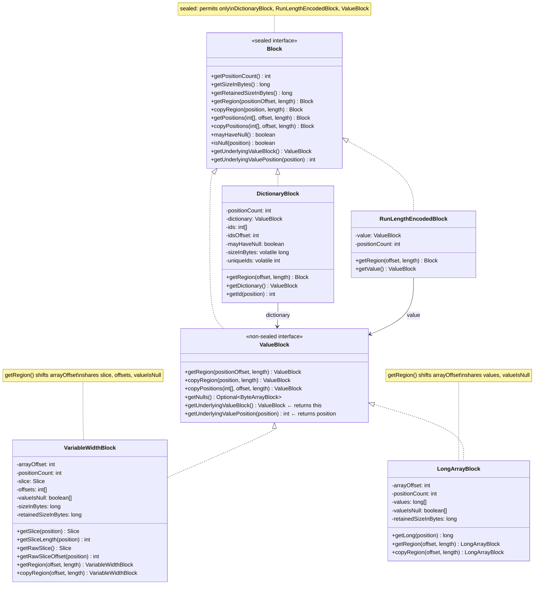
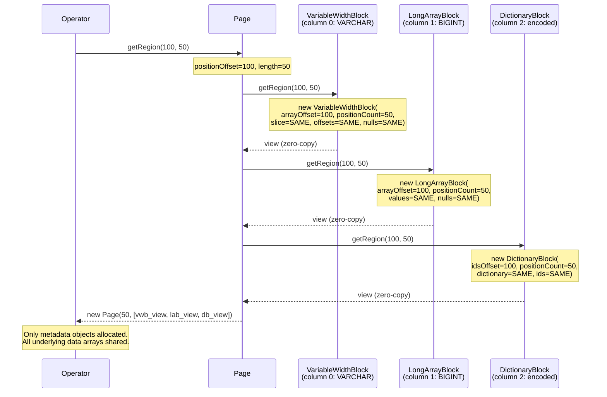
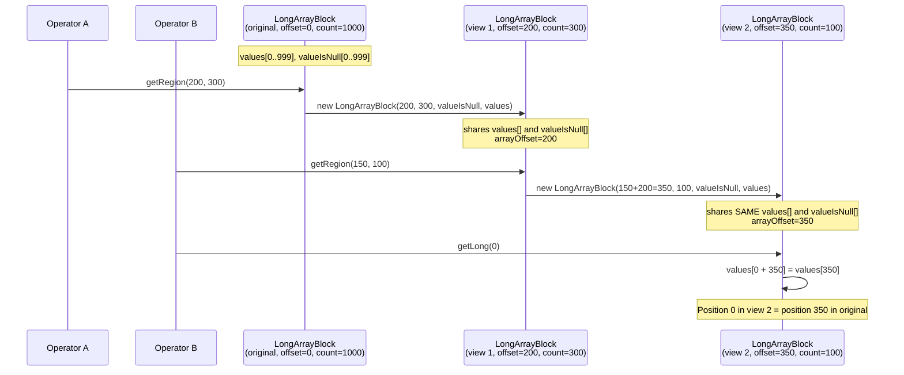

# Module Teardown: The `Block` Interface & Internal Metadata (Task 1.2.A)

## Table of Contents

- [0. Research Focus](#0-research-focus)
- [1. High-Level Overview](#1-high-level-overview)
- [2. Structural Architecture](#2-structural-architecture)
  - [The Block Sealed Hierarchy](#the-block-sealed-hierarchy)
  - [VariableWidthBlock Internal Fields](#variablewidthblock-internal-fields)
  - [LongArrayBlock Internal Fields](#longarrayblock-internal-fields)
  - [Class Diagram](#class-diagram)
- [3. Execution & Call Flow](#3-execution-call-flow)
  - [3.1 The Read-Only Block Contract](#31-the-read-only-block-contract)
  - [3.2 The `arrayOffset` Pattern -- The Key to Zero-Copy Views](#32-the-arrayoffset-pattern-the-key-to-zero-copy-views)
  - [3.3 `LongArrayBlock.getRegion()` -- Fixed-Width Zero-Copy Slicing](#33-longarrayblockgetregion-fixed-width-zero-copy-slicing)
  - [3.4 `VariableWidthBlock.getRegion()` -- Variable-Width Zero-Copy Slicing](#34-variablewidthblockgetregion-variable-width-zero-copy-slicing)
  - [3.5 `DictionaryBlock.getRegion()` -- Indirection-Layer Slicing](#35-dictionaryblockgetregion-indirection-layer-slicing)
  - [3.6 `RunLengthEncodedBlock.getRegion()` -- Trivial Slicing](#36-runlengthencodedblockgetregion-trivial-slicing)
  - [3.7 `Page.getRegion()` -- The Top-Level Entry Point](#37-pagegetregion-the-top-level-entry-point)
  - [Sequence Diagram: Full getRegion() Chain](#sequence-diagram-full-getregion-chain)
  - [3.8 `VariableWidthBlock.copyPositions()` -- Scatter-Gather with Contiguous-Range Optimization](#38-variablewidthblockcopypositions-scatter-gather-with-contiguous-range-optimization)
  - [3.9 Null Representation -- The `@Nullable boolean[]` Pattern](#39-null-representation-the-nullable-boolean-pattern)
  - [Sequence Diagram: getRegion() Chaining with Nested Views](#sequence-diagram-getregion-chaining-with-nested-views)
- [4. Concurrency & State Management](#4-concurrency-state-management)
- [5. Memory & Resource Profile](#5-memory-resource-profile)
  - [Allocation Patterns](#allocation-patterns)
  - [Size Metrics](#size-metrics)
  - [Memory Tracking via `retainedBytesForEachPart()`](#memory-tracking-via-retainedbytesforeachpart)
- [6. Key Design Insights](#6-key-design-insights)
- [7. Porting Considerations (Java -> Target Architecture)](#7-porting-considerations-java-target-architecture)
  - [Translation Blockers](#translation-blockers)
  - [Recommended Rust Abstractions](#recommended-rust-abstractions)


## 0. Research Focus
* **Task ID:** 1.2.A
* **Focus:** Analyze the internal fields of `VariableWidthBlock` (`Slice`, `int[] offsets`, `boolean[] valueIsNull`) and `LongArrayBlock` (`long[] values`, `boolean[] valueIsNull`). Trace the read-only contract of the `Block` interface. Deeply trace `getRegion()` to understand how zero-copy columnar slicing works without duplicating the underlying memory. Compare `getRegion()` vs `copyRegion()` vs `copyPositions()` across all Block variants.

## 1. High-Level Overview
* **Core Responsibility:** `Block` is Trino's sealed interface for all columnar data. It enforces a read-only contract: once a `BlockBuilder` freezes data via `build()`, the resulting `Block` is immutable. Every concrete `ValueBlock` carries its own metadata (position count, null bitmap, data arrays) plus an `arrayOffset` that enables zero-copy sub-views. The `getRegion()` method is the primary mechanism for columnar slicing -- it creates a new `Block` object pointing into the same underlying arrays by adjusting `arrayOffset` and `positionCount`, achieving O(1) slicing with zero memory movement.
* **Key Triggers:** `getRegion()` is called by `Page.getRegion()` on every block in a page when an operator needs to process a sub-range of rows (e.g., splitting a page for parallel processing, passing a sub-range to a downstream operator). `copyRegion()` is used when the caller needs an independent copy that can outlive the source. `copyPositions()` is used for arbitrary scatter-gather reordering.

## 2. Structural Architecture
* **Primary Source Files:**
  - `io.trino.spi.block.Block` (172 lines) -- Sealed interface; defines the read-only columnar contract
  - `io.trino.spi.block.ValueBlock` (51 lines) -- Non-sealed sub-interface for concrete physical storage
  - `io.trino.spi.block.VariableWidthBlock` (321 lines) -- Variable-length storage: `Slice` + `int[] offsets`
  - `io.trino.spi.block.LongArrayBlock` (249 lines) -- Fixed-width 8-byte storage: `long[] values`
  - `io.trino.spi.block.DictionaryBlock` (596 lines) -- Dictionary-encoded indirection layer
  - `io.trino.spi.block.RunLengthEncodedBlock` (230 lines) -- Run-length encoding for repeated values
  - `io.trino.spi.block.BlockUtil` (343 lines) -- Compaction helpers: `compactOffsets`, `compactIsNull`, `compactArray`
  - `io.trino.spi.block.BlockBuilder` (105 lines) -- Mutable builder interface; `appendBlockRange()` uses sealed dispatch
  - `io.trino.spi.Page` (316 lines) -- Row-group container; delegates `getRegion()` to each column block

* **Key Data Structures:**

### The Block Sealed Hierarchy

| Block Variant | Internal Fields | `getRegion()` Strategy |
|---|---|---|
| `ValueBlock` (non-sealed) | Type-specific arrays + `arrayOffset` + `@Nullable boolean[] valueIsNull` | Shift `arrayOffset`, share arrays |
| `DictionaryBlock` | `ValueBlock dictionary` + `int[] ids` + `int idsOffset` | Shift `idsOffset`, share `ids` and `dictionary` |
| `RunLengthEncodedBlock` | `ValueBlock value` + `int positionCount` | Return new RLE with reduced `positionCount` |

### VariableWidthBlock Internal Fields

| Field | Type | Purpose |
|---|---|---|
| `arrayOffset` | `int` | Base index into `offsets[]` and `valueIsNull[]`; enables zero-copy views |
| `positionCount` | `int` | Number of logical positions visible through this view |
| `slice` | `Slice` | Contiguous byte buffer holding all variable-length values |
| `offsets` | `int[]` | Sentinel-pattern offsets; always `positionCount + 1` entries from base. Position N's bytes are at `slice[offsets[N+arrayOffset]..offsets[N+1+arrayOffset]]` |
| `valueIsNull` | `@Nullable boolean[]` | Null bitmap; `null` reference means no nulls exist (O(1) fast path) |
| `sizeInBytes` | `long` | Pre-computed logical size: `totalDataBytes + 5 * positionCount` |
| `retainedSizeInBytes` | `long` | Pre-computed physical size: `INSTANCE_SIZE + slice.retained + sizeOf(offsets) + sizeOf(valueIsNull)` |

### LongArrayBlock Internal Fields

| Field | Type | Purpose |
|---|---|---|
| `arrayOffset` | `int` | Base index into `values[]` and `valueIsNull[]`; enables zero-copy views |
| `positionCount` | `int` | Number of logical positions visible through this view |
| `values` | `long[]` | Flat array of 8-byte values; position N is `values[N + arrayOffset]` |
| `valueIsNull` | `@Nullable boolean[]` | Null bitmap; `null` reference means no nulls (same pattern as VariableWidthBlock) |
| `retainedSizeInBytes` | `long` | Pre-computed: `INSTANCE_SIZE + sizeOf(valueIsNull) + sizeOf(values)` |

Note: `LongArrayBlock` has no `sizeInBytes` field because its logical size is trivially `SIZE_IN_BYTES_PER_POSITION * positionCount` (a constant 9 bytes per position: 8 for the long + 1 for the null flag).

### Class Diagram



## 3. Execution & Call Flow

### 3.1 The Read-Only Block Contract

The `Block` interface (Block.java, line 21-171) is a `sealed interface` permitting exactly three implementations:

```java
public sealed interface Block
        permits DictionaryBlock, RunLengthEncodedBlock, ValueBlock
```

The contract is strictly read-only. There are **no mutating methods** on `Block`. Every method either:
1. **Reads** a value: `isNull(pos)`, `getPositionCount()`, `getSizeInBytes()`
2. **Creates a new view** without mutating: `getRegion()`, `getPositions()`
3. **Creates a new independent copy**: `copyRegion()`, `copyPositions()`, `getSingleValueBlock()`

The Javadoc on `getRegion()` (Block.java, line 100-109) is explicit about the shared-lifetime semantics:

```java
/**
 * Returns a block starting at the specified position and extends for the
 * specified length.  The specified region must be entirely contained
 * within this block.
 * <p>
 * The region can be a view over this block.  If this block is released
 * the region block may also be released.  If the region block is released
 * this block may also be released.
 */
Block getRegion(int positionOffset, int length);
```

In contrast, `copyRegion()` (Block.java, line 111-121) requires the result to be independent:

```java
/**
 * The region returned must be a compact representation of the original block,
 * unless their internal representation will be exactly the same.
 */
Block copyRegion(int position, int length);
```

The default `getPositions()` method (Block.java, line 83-88) wraps the block in a `DictionaryBlock` -- zero-copy projection via indirection:

```java
default Block getPositions(int[] positions, int offset, int length)
{
    checkArrayRange(positions, offset, length);
    return DictionaryBlock.createInternal(offset, length, this, positions, randomDictionaryId());
}
```

### 3.2 The `arrayOffset` Pattern -- The Key to Zero-Copy Views

Every `ValueBlock` implementation uses the same pattern: an `arrayOffset` field that shifts the logical position 0 to point at any element within the underlying arrays. When `getRegion()` is called, a new block object is created with `arrayOffset = positionOffset + oldArrayOffset`, but the underlying data arrays are **shared by reference**.

This means:
- The new block and the old block point to the **same** `long[]`, `int[]`, `boolean[]`, or `Slice`
- No `System.arraycopy()`, no `Arrays.copyOfRange()`, no `Slice.copy()`
- The only allocation is the new block object itself (a few dozen bytes of metadata)

### 3.3 `LongArrayBlock.getRegion()` -- Fixed-Width Zero-Copy Slicing

```java
// LongArrayBlock.java, line 186-191
@Override
public LongArrayBlock getRegion(int positionOffset, int length)
{
    checkValidRegion(getPositionCount(), positionOffset, length);

    return new LongArrayBlock(positionOffset + arrayOffset, length, valueIsNull, values);
}
```

**Step-by-step trace** for `getRegion(2, 3)` on a block with `arrayOffset=0, positionCount=10`:

1. `checkValidRegion(10, 2, 3)` -- validates `2 + 3 <= 10`
2. Constructs `new LongArrayBlock(2, 3, valueIsNull, values)`:
   - `this.arrayOffset = 2` (shifted by 2 from the parent)
   - `this.positionCount = 3`
   - `this.valueIsNull = <same reference>` -- shared, not copied
   - `this.values = <same reference>` -- shared, not copied
3. The new block's `getLong(0)` returns `values[0 + 2] = values[2]` -- position 0 in the region maps to position 2 in the original

**Memory diagram:**

```
Original block (arrayOffset=0, positionCount=10):
  values:      [v0, v1, v2, v3, v4, v5, v6, v7, v8, v9]
  valueIsNull: [f,  f,  f,  t,  f,  f,  f,  f,  t,  f ]
                        ^-----------^
                        region view

Region block (arrayOffset=2, positionCount=3):
  values:      [v0, v1, v2, v3, v4, v5, v6, v7, v8, v9]  ← SAME array
  valueIsNull: [f,  f,  f,  t,  f,  f,  f,  f,  t,  f ]  ← SAME array
                        ^-----------^
  getLong(0) → values[0+2] = v2
  getLong(1) → values[1+2] = v3
  getLong(2) → values[2+2] = v4
  isNull(1)  → valueIsNull[1+2] = true
```

**Compare with `copyRegion()`** (LongArrayBlock.java, line 194-206):

```java
@Override
public LongArrayBlock copyRegion(int positionOffset, int length)
{
    checkValidRegion(getPositionCount(), positionOffset, length);

    positionOffset += arrayOffset;
    boolean[] newValueIsNull = compactIsNull(valueIsNull, positionOffset, length);
    long[] newValues = compactArray(values, positionOffset, length);

    if (newValueIsNull == valueIsNull && newValues == values) {
        return this;
    }
    return new LongArrayBlock(0, length, newValueIsNull, newValues);
}
```

`copyRegion()` calls `compactArray()` (BlockUtil.java, line 205-211) which does an `Arrays.copyOfRange()` unless the region already spans the entire array:

```java
static long[] compactArray(long[] array, int index, int length)
{
    if (index == 0 && length == array.length) {
        return array;  // Already compact, return same reference
    }
    return Arrays.copyOfRange(array, index, index + length);
}
```

And `compactIsNull()` (BlockUtil.java, line 116-134) is even more sophisticated -- it scans for actual nulls and returns `null` if none are found, dropping the null array entirely:

```java
static boolean[] compactIsNull(@Nullable boolean[] isNull, int index, int length)
{
    if (isNull == null) {
        return null;
    }
    checkArrayRange(isNull, index, length);
    if (index == 0 && length == isNull.length) {
        return isNull;
    }
    for (int i = 0; i < length; i++) {
        if (isNull[i + index]) {
            boolean[] result = new boolean[length];
            System.arraycopy(isNull, i + index, result, i, length - i);
            return result;
        }
    }
    // No nulls encountered, return null as the result
    return null;
}
```

This is a key optimization: `compactIsNull()` lazily scans and returns `null` (meaning "no nulls") if the region has no nulls. The copy only starts from the first null position, skipping the prefix of non-null values.

### 3.4 `VariableWidthBlock.getRegion()` -- Variable-Width Zero-Copy Slicing

```java
// VariableWidthBlock.java, line 257-262
@Override
public VariableWidthBlock getRegion(int positionOffset, int length)
{
    checkValidRegion(getPositionCount(), positionOffset, length);

    return new VariableWidthBlock(positionOffset + arrayOffset, length, slice, offsets, valueIsNull);
}
```

**Step-by-step trace** for `getRegion(1, 2)` on a block with 3 positions:

```
Original block (arrayOffset=0, positionCount=3):
  slice:       [  "hello"  |  "world"  |  "!"  ]
                0          5           10       11
  offsets:     [0,         5,          10,      11]
  valueIsNull: [false,     false,      false       ]
```

1. `checkValidRegion(3, 1, 2)` -- validates `1 + 2 <= 3`
2. Constructs `new VariableWidthBlock(1, 2, slice, offsets, valueIsNull)`:
   - `this.arrayOffset = 1`
   - `this.positionCount = 2`
   - `this.slice = <same Slice>` -- shared, not copied
   - `this.offsets = <same int[]>` -- shared, not copied
   - `this.valueIsNull = <same boolean[]>` -- shared, not copied
   - Constructor computes: `sizeInBytes = offsets[1+2] - offsets[1] + 5*2 = 11 - 5 + 10 = 16`

```
Region block (arrayOffset=1, positionCount=2):
  slice:       [  "hello"  |  "world"  |  "!"  ]  ← SAME Slice
  offsets:     [0,         5,          10,      11] ← SAME array
                            ^-----------^-------^
                            visible: positions 0 and 1

  getSlice(0) → offsets[0+1]=5, offsets[1+1]=10 → slice.slice(5, 5) → "world"
  getSlice(1) → offsets[1+1]=10, offsets[2+1]=11 → slice.slice(10, 1) → "!"
```

The critical observation is that `getSlice()` (VariableWidthBlock.java, line 155-161) performs its own zero-copy view by calling `slice.slice()`:

```java
public Slice getSlice(int position)
{
    checkReadablePosition(this, position);
    int offset = offsets[position + arrayOffset];
    int length = offsets[position + 1 + arrayOffset] - offset;
    return slice.slice(offset, length);  // Zero-copy Slice view
}
```

This means the chain is: `Page.getRegion()` -> `VariableWidthBlock.getRegion()` -> `getSlice()` -> `Slice.slice()`. Three levels of zero-copy views, all the way down. No data is ever copied during normal read operations.

**Compare with `copyRegion()`** (VariableWidthBlock.java, line 265-278):

```java
@Override
public VariableWidthBlock copyRegion(int positionOffset, int length)
{
    checkValidRegion(getPositionCount(), positionOffset, length);
    positionOffset += arrayOffset;

    int[] newOffsets = compactOffsets(offsets, positionOffset, length);
    Slice newSlice = compactSlice(slice, offsets[positionOffset], newOffsets[length]);
    boolean[] newValueIsNull = compactIsNull(valueIsNull, positionOffset, length);

    if (newOffsets == offsets && newSlice == slice && newValueIsNull == valueIsNull) {
        return this;
    }
    return new VariableWidthBlock(0, length, newSlice, newOffsets, newValueIsNull);
}
```

`copyRegion()` performs three compactions:

1. **`compactOffsets()`** (BlockUtil.java, line 142-153) -- normalizes offsets to start from 0:
   ```java
   static int[] compactOffsets(int[] offsets, int index, int length)
   {
       if (index == 0 && offsets.length == length + 1) {
           return offsets;
       }
       int[] newOffsets = new int[length + 1];
       for (int i = 1; i <= length; i++) {
           newOffsets[i] = offsets[index + i] - offsets[index];
       }
       return newOffsets;
   }
   ```

2. **`compactSlice()`** (BlockUtil.java, line 160-166) -- copies only the referenced byte range:
   ```java
   static Slice compactSlice(Slice slice, int index, int length)
   {
       if (slice.isCompact() && index == 0 && length == slice.length()) {
           return slice;
       }
       return slice.copy(index, length);  // Deep copy
   }
   ```

3. **`compactIsNull()`** -- as described above, drops the null array if no nulls exist in the range.

### 3.5 `DictionaryBlock.getRegion()` -- Indirection-Layer Slicing

```java
// DictionaryBlock.java, line 255-264
@Override
public Block getRegion(int positionOffset, int length)
{
    checkValidRegion(positionCount, positionOffset, length);

    if (length == positionCount) {
        return this;
    }

    return new DictionaryBlock(idsOffset + positionOffset, length, dictionary, ids, false, false, dictionarySourceId);
}
```

DictionaryBlock uses `idsOffset` instead of `arrayOffset` -- same pattern, different field name. The `dictionary` and `ids` array are shared. The `dictionarySourceId` is preserved, which allows the system to detect that two dictionary blocks share the same underlying dictionary and avoid redundant decompression.

### 3.6 `RunLengthEncodedBlock.getRegion()` -- Trivial Slicing

```java
// RunLengthEncodedBlock.java, line 148-152
@Override
public Block getRegion(int positionOffset, int length)
{
    checkValidRegion(positionCount, positionOffset, length);
    return create(value, length);
}
```

RLE's `getRegion()` simply creates a new RLE with a smaller `positionCount`. The `value` (a single-element `ValueBlock`) is shared. Note that `create()` has guards: if `length == 0` it returns `value.copyRegion(0, 0)`, if `length == 1` it returns the `value` directly. Only `length >= 2` creates an actual `RunLengthEncodedBlock`.

### 3.7 `Page.getRegion()` -- The Top-Level Entry Point

```java
// Page.java, line 142-158
public Page getRegion(int positionOffset, int length)
{
    if (positionOffset < 0 || length < 0 || positionOffset + length > positionCount) {
        throw new IndexOutOfBoundsException(...);
    }

    if (positionOffset == 0 && length == positionCount) {
        return this;
    }

    int channelCount = getChannelCount();
    Block[] slicedBlocks = new Block[channelCount];
    for (int i = 0; i < channelCount; i++) {
        slicedBlocks[i] = blocks[i].getRegion(positionOffset, length);
    }
    return wrapBlocksWithoutCopy(length, slicedBlocks);
}
```

`Page.getRegion()` calls `getRegion()` on every column block, then wraps the resulting array of views into a new `Page`. The only allocation is the `Block[]` array and the `Page` object itself -- every column's data stays in place.

### Sequence Diagram: Full getRegion() Chain



### 3.8 `VariableWidthBlock.copyPositions()` -- Scatter-Gather with Contiguous-Range Optimization

The most complex read operation is `copyPositions()` (VariableWidthBlock.java, line 209-254), which copies arbitrary non-contiguous positions into a new compact block. Its key optimization is detecting contiguous byte ranges:

```java
@Override
public VariableWidthBlock copyPositions(int[] positions, int offset, int length)
{
    checkArrayRange(positions, offset, length);
    if (length == 0) {
        return new VariableWidthBlock(0, 0, EMPTY_SLICE, new int[1], null);
    }

    int[] newOffsets = new int[length + 1];
    int finalLength = 0;
    for (int i = 0; i < length; i++) {
        int position = positions[offset + i];
        finalLength += getSliceLength(position);
        newOffsets[i + 1] = finalLength;
    }

    SliceOutput newSlice = Slices.allocate(finalLength).getOutput();
    boolean hasNull = false;
    boolean[] newValueIsNull = null;
    int firstPosition = positions[offset];
    if (valueIsNull != null) {
        newValueIsNull = new boolean[length];
        newValueIsNull[0] = valueIsNull[firstPosition + arrayOffset];
        hasNull |= newValueIsNull[0];
    }
    int currentStart = getPositionOffset(firstPosition);
    int currentEnd = getPositionOffset(firstPosition + 1);
    for (int i = 1; i < length; i++) {
        int position = positions[offset + i];
        if (valueIsNull != null) {
            boolean isNull = valueIsNull[position + arrayOffset];
            newValueIsNull[i] = isNull;
            hasNull |= isNull;
        }
        int currentOffset = getPositionOffset(position);
        if (currentOffset != currentEnd) {
            // Copy last continuous range of bytes and update currentStart
            newSlice.writeBytes(slice, currentStart, currentEnd - currentStart);
            currentStart = currentOffset;
        }
        currentEnd = getPositionOffset(position + 1);
    }
    // Copy last range of bytes
    newSlice.writeBytes(slice, currentStart, currentEnd - currentStart);
    return new VariableWidthBlock(0, length, newSlice.slice(), newOffsets,
                                  hasNull ? newValueIsNull : null);
}
```

The contiguous-range optimization (lines 243-248) tracks `currentStart` and `currentEnd`. As long as consecutive positions map to adjacent byte ranges (i.e., `currentOffset == currentEnd`), the range grows. When a gap is detected, the accumulated range is flushed with a single `writeBytes()`. This is critical for filter operations where surviving rows tend to cluster.

### 3.9 Null Representation -- The `@Nullable boolean[]` Pattern

All `ValueBlock` implementations share an identical null-handling pattern:

```java
// Common across VariableWidthBlock, LongArrayBlock, IntArrayBlock, etc.
@Override
public boolean mayHaveNull()
{
    return valueIsNull != null;    // O(1) -- null-pointer test
}

@Override
public boolean isNull(int position)
{
    if (!mayHaveNull()) {
        return false;              // Fast path: skip bounds check
    }
    checkReadablePosition(this, position);
    return valueIsNull[position + arrayOffset];
}
```

This pattern has three important properties:
1. **O(1) `mayHaveNull()`**: A null-pointer test. When the entire block has no nulls, the `valueIsNull` reference is `null`, and `mayHaveNull()` returns false immediately.
2. **Early exit in `isNull()`**: If `mayHaveNull()` returns false, `isNull()` returns false without even checking `position` validity. The Javadoc explicitly permits this: "The method may return false without throwing exception when there are no nulls in the block, even if the position is invalid."
3. **`build()` drops the null array**: The builder always maintains a `boolean[] valueIsNull` array, but at `build()` time, if `hasNullValue` is false, it passes `null` to the block constructor, eliminating the array entirely.

The `getNulls()` method (ValueBlock interface) converts the internal `boolean[]` to a `ByteArrayBlock` for uniform consumer access. The conversion in `BlockUtil.getNulls()` (line 326-341) scans for actual nulls and returns `Optional.empty()` if none exist, even if `valueIsNull != null`:

```java
static Optional<ByteArrayBlock> getNulls(@Nullable boolean[] valueIsNull, int arrayOffset, int positionCount)
{
    if (valueIsNull == null) {
        return Optional.empty();
    }
    byte[] booleansAsBytes = new byte[positionCount];
    boolean foundAnyNull = false;
    for (int i = 0; i < positionCount; i++) {
        booleansAsBytes[i] = (byte) (valueIsNull[arrayOffset + i] ? 1 : 0);
        foundAnyNull = foundAnyNull || valueIsNull[arrayOffset + i];
    }
    if (!foundAnyNull) {
        return Optional.empty();
    }
    return Optional.of(new ByteArrayBlock(booleansAsBytes.length, Optional.empty(), booleansAsBytes));
}
```

The code comment at line 322-325 notes this is transitional: "Ideally, the underlying nulls array in Block implementations should be a byte array instead of a boolean array."

### Sequence Diagram: getRegion() Chaining with Nested Views



This shows that `getRegion()` composes correctly: calling `getRegion()` on a region view produces another view with `arrayOffset = child.positionOffset + parent.arrayOffset`. All views share the same underlying arrays, and the offsets chain additively.

## 4. Concurrency & State Management

* **Threading Model:** All `Block` implementations are immutable after construction. Every field is `final` (or effectively final through `volatile` for lazily-computed caches). This means `Block` instances are safe to share across threads without synchronization.

* **State Machine:** There is no mutable state in blocks. The lifecycle is:
  ```
  BlockBuilder (mutable, thread-confined)
    → build() →
  Block (immutable, freely shareable)
    → getRegion() →
  Block (immutable view, shares data with parent)
  ```
  Views created by `getRegion()` have no independent lifecycle from their parent -- they are garbage-collected when no longer referenced, and the shared arrays are collected when all referencing blocks are collected.

* **Volatile Fields in DictionaryBlock:** Three fields are `volatile` for lazy computation:
  ```java
  private volatile long sizeInBytes = -1;
  private volatile int uniqueIds = -1;
  private volatile boolean isSequentialIds;
  ```
  Multiple threads may race to compute these (benign race -- the result is deterministic). The `-1` sentinel indicates "not yet computed."

* **No Synchronization in ValueBlock:** `VariableWidthBlock` and `LongArrayBlock` have no `volatile` fields and no synchronization. Their `sizeInBytes` and `retainedSizeInBytes` are computed eagerly in the constructor and stored in `final` fields.

## 5. Memory & Resource Profile

### Allocation Patterns

**getRegion() allocation cost:**
| Block Type | Object Allocation | Data Copying |
|---|---|---|
| `LongArrayBlock` | 1 new LongArrayBlock (INSTANCE_SIZE) | None |
| `VariableWidthBlock` | 1 new VariableWidthBlock (INSTANCE_SIZE) | None |
| `DictionaryBlock` | 1 new DictionaryBlock (INSTANCE_SIZE) | None |
| `RunLengthEncodedBlock` | 1 new RunLengthEncodedBlock (INSTANCE_SIZE) | None |
| `RowBlock` | 1 new RowBlock (INSTANCE_SIZE) | None |
| `ArrayBlock` | 1 new ArrayBlock (INSTANCE_SIZE) | None |

Every `getRegion()` call allocates only a single small metadata object. The `INSTANCE_SIZE` is computed via `instanceSize()` which uses `Instrumentation.getObjectSize()` -- typically 40-80 bytes per block object.

**copyRegion() allocation cost:**
| Block Type | Allocation |
|---|---|
| `LongArrayBlock` | New `long[]` + optional `boolean[]` via `Arrays.copyOfRange` |
| `VariableWidthBlock` | New `int[]` offsets + `Slice.copy()` + optional `boolean[]` |
| `DictionaryBlock` | New `int[]` ids + potentially compacted dictionary |
| `RunLengthEncodedBlock` | `value.copyRegion(0, 1)` + new RLE wrapper |

### Size Metrics

`LongArrayBlock` size computation is trivial -- constant per position:
```java
// LongArrayBlock.java, line 35
public static final int SIZE_IN_BYTES_PER_POSITION = Long.BYTES + Byte.BYTES;  // 9 bytes

// getSizeInBytes() -- no caching needed
public long getSizeInBytes() {
    return SIZE_IN_BYTES_PER_POSITION * (long) positionCount;  // 9 * N
}
```

`VariableWidthBlock` size depends on actual data content -- computed eagerly in constructor:
```java
// VariableWidthBlock.java, line 82-83
sizeInBytes = offsets[arrayOffset + positionCount] - offsets[arrayOffset]
              + ((Integer.BYTES + Byte.BYTES) * (long) positionCount);
// = actual_data_bytes + 5_bytes_metadata * positionCount
```

**Retained vs Logical size divergence after getRegion():**

After `getRegion()`, `retainedSizeInBytes` reflects the **full** backing arrays (since the view shares them), while `sizeInBytes` reflects only the visible region. For example:

```
Original: 1000 longs → retainedSize = INSTANCE_SIZE + 8000 + 1000 = ~9040
getRegion(500, 100):
  sizeInBytes = 9 * 100 = 900  (logical: just the 100 positions)
  retainedSizeInBytes = INSTANCE_SIZE + 8000 + 1000 = ~9040  (physical: full arrays)
```

This divergence is tracked by `Page.compact()` (Page.java, line 172-197), which calls `copyRegion()` on blocks where `retainedSizeInBytes > sizeInBytes`, creating compact copies that release the over-allocated backing arrays.

### Memory Tracking via `retainedBytesForEachPart()`

Each block visits its internal components with their sizes, using Java object identity for deduplication:

```java
// VariableWidthBlock.java, line 145-153
public void retainedBytesForEachPart(ObjLongConsumer<Object> consumer)
{
    consumer.accept(slice, slice.getRetainedSize());
    consumer.accept(offsets, sizeOf(offsets));
    if (valueIsNull != null) {
        consumer.accept(valueIsNull, sizeOf(valueIsNull));
    }
    consumer.accept(this, INSTANCE_SIZE);
}

// LongArrayBlock.java, line 99-106
public void retainedBytesForEachPart(ObjLongConsumer<Object> consumer)
{
    consumer.accept(values, sizeOf(values));
    if (valueIsNull != null) {
        consumer.accept(valueIsNull, sizeOf(valueIsNull));
    }
    consumer.accept(this, INSTANCE_SIZE);
}
```

When multiple blocks share the same `values` or `offsets` array (via `getRegion()`), the consumer receives the **same object reference** multiple times. Callers like `OperatorContext` use identity-based deduplication (e.g., `IdentityHashMap`) to count shared arrays only once.

## 6. Key Design Insights

* **`arrayOffset` is the universal zero-copy primitive:** Every `ValueBlock` implementation carries an `arrayOffset` field that enables `getRegion()` to produce O(1) sub-views by shifting the base index without copying data. For `LongArrayBlock`, position N maps to `values[N + arrayOffset]`. For `VariableWidthBlock`, position N's byte range is `slice[offsets[N + arrayOffset]..offsets[N+1 + arrayOffset]]`. This offset composes: calling `getRegion()` on a region view produces a new view with `arrayOffset = inner.positionOffset + outer.arrayOffset`, and all views transitively share the same backing arrays. The pattern is identical across all 11 concrete `ValueBlock` types (including `IntArrayBlock`, `ByteArrayBlock`, `RowBlock.startOffset`, `ArrayBlock.arrayOffset`, etc.).

* **`getRegion()` vs `copyRegion()` is a lifetime contract, not a data contract:** Both return the same logical data. The difference is purely about memory ownership. `getRegion()` says "the view shares the parent's backing arrays -- their lifetimes are coupled." `copyRegion()` says "the copy is independent -- it can outlive the source." The engine uses `getRegion()` in the hot path (operator-to-operator data flow within a pipeline) and `copyRegion()` only when data must survive across pipeline boundaries (e.g., `Page.compact()`, serialization). This distinction is the single most important performance decision in Trino's memory model.

* **The null bitmap is `@Nullable`, not a fixed-cost allocation:** By representing "no nulls" as a `null` reference (rather than an all-false array), blocks with no null values pay zero cost for null checking. `mayHaveNull()` is a null-pointer test (branch-predicted as false in typical OLAP workloads where most columns are NOT NULL). The builder always allocates the `boolean[]` array, but `build()` drops it via the `hasNullValue ? valueIsNull : null` ternary. Additionally, `compactIsNull()` scans a region and returns `null` if no nulls are found, so `copyRegion()` on a null-free sub-range of a nullable block produces a non-nullable block.

* **`VariableWidthBlock` carries more metadata complexity than fixed-width blocks by necessity:** `LongArrayBlock` stores only `values[]` + `valueIsNull[]` (both indexed directly by `position + arrayOffset`). Its `sizeInBytes` is a trivial `9 * positionCount`. `VariableWidthBlock` requires an additional `int[] offsets` array (one entry per position + 1 sentinel) and a `Slice` object. Its `sizeInBytes` depends on actual data content and is eagerly computed in the constructor. The offsets array adds 4 bytes per position of overhead but enables O(1) random access via the `offsets[N]..offsets[N+1]` interval pattern.

* **`copyPositions()` on VariableWidthBlock detects contiguous byte ranges for bulk copy:** Rather than copying each position's bytes individually, the method tracks `currentStart`/`currentEnd` and coalesces adjacent byte ranges into single `writeBytes()` calls. When filter operations produce clustered surviving positions (common in predicate pushdown), this collapses many small copies into a few large memcpy operations. This is not a micro-optimization -- it can turn O(N) individual copies into O(K) bulk copies where K is the number of gaps.

* **Sealed interface + pattern matching enables exhaustive dispatch without runtime type checks:** `BlockBuilder.appendBlockRange()` uses Java 17's exhaustive `switch` over the sealed `Block` hierarchy to dispatch between `RunLengthEncodedBlock`, `DictionaryBlock`, and `ValueBlock` without a `default` case. The compiler enforces completeness -- if a new variant is added to the sealed hierarchy, all switches must be updated. This replaces error-prone `instanceof` chains with compile-time-verified dispatch.

## 7. Porting Considerations (Java -> Target Architecture)

### Translation Blockers

1. **`arrayOffset` pattern**: In Java, the region view shares the underlying `long[]` / `int[]` / `boolean[]` arrays by reference. In Rust, this maps to shared ownership via `Arc<[T]>` with offset + length metadata, or to `&[T]` slice references with lifetime bounds. The `Arc` approach allows views to outlive the original without explicit lifetime management. The `&[T]` approach is more efficient but requires careful lifetime annotation.

2. **`@Nullable boolean[] valueIsNull`**: This two-level optionality (outer: "does the block have a null bitmap at all?" inner: "is position N null?") maps to `Option<Arc<[bool]>>` or `Option<Bitmap>`. The `mayHaveNull() == valueIsNull != null` fast path maps to `bitmap.is_some()`. For memory efficiency, use Arrow's bit-packed `NullBuffer` instead of byte-per-position.

3. **`Slice` sharing**: `VariableWidthBlock.getRegion()` shares the `Slice` by reference. In Rust, `bytes::Bytes` provides reference-counted byte buffers with zero-copy slicing (`Bytes::slice()`). Alternatively, `Arc<[u8]>` with explicit offset/length gives the same semantics.

4. **Sealed hierarchy exhaustiveness**: Java's `sealed interface` with `permits` maps directly to Rust's `enum Block { Value(ValueBlock), Dict(DictionaryBlock), Rle(RleBlock) }`. Rust's `match` is exhaustive by default, so the compile-time guarantee is even stronger.

### Recommended Rust Abstractions

| Java Concept | Rust Equivalent | Notes |
|---|---|---|
| `LongArrayBlock { arrayOffset, values, valueIsNull }` | `struct LongArrayBlock { offset: usize, len: usize, values: Arc<[i64]>, nulls: Option<NullBuffer> }` | `Arc` for shared ownership across views |
| `VariableWidthBlock { arrayOffset, slice, offsets, valueIsNull }` | `struct VarWidthBlock { offset: usize, len: usize, data: Bytes, offsets: Arc<[i32]>, nulls: Option<NullBuffer> }` | `Bytes` for zero-copy slicing of byte data |
| `getRegion(pos, len)` | `fn region(&self, pos: usize, len: usize) -> Self { Self { offset: self.offset + pos, len, ..self.clone() } }` | `Arc::clone()` is O(1) ref-count increment |
| `copyRegion(pos, len)` | `fn copy_region(&self, pos: usize, len: usize) -> Self { /* allocate new arrays, copy range */ }` | Returns independent block with `offset=0` |
| `@Nullable boolean[] valueIsNull` | `Option<NullBuffer>` (Arrow bit-packed) | 8x more memory-efficient than `boolean[]` |
| `mayHaveNull()` | `self.nulls.is_some()` | Free O(1) check |
| `Block` (sealed) | `enum Block { Value(ValueBlock), Dict(DictionaryBlock), Rle(RleBlock) }` | Exhaustive `match` guaranteed |
| `INSTANCE_SIZE` tracking | `std::mem::size_of::<Self>()` + custom `retained_bytes()` | No JVM instrumentation needed |
| `retainedBytesForEachPart()` | `fn retained_parts(&self) -> Vec<(Arc<dyn Any>, usize)>` | Use `Arc::ptr_eq` for deduplication |
| `Page.getRegion()` | `fn region(&self, pos: usize, len: usize) -> Page { Page { blocks: self.blocks.iter().map(\|b\| b.region(pos, len)).collect() } }` | Same pattern: delegate to each column |

**Key architectural alignment:** Trino's `(Slice, int[] offsets, boolean[] valueIsNull)` for `VariableWidthBlock` maps almost directly to Arrow's `StringArray` layout: `(Buffer<u8>, OffsetsBuffer<i32>, NullBuffer)`. The main differences are: (1) Arrow uses bit-packed nulls (1 bit per value vs Trino's 1 byte), (2) Arrow's `slice()` method on `ArrayRef` is the direct equivalent of `getRegion()` -- both shift an offset without copying. A Rust port should align with Arrow's layout from the start to enable zero-copy interop.
