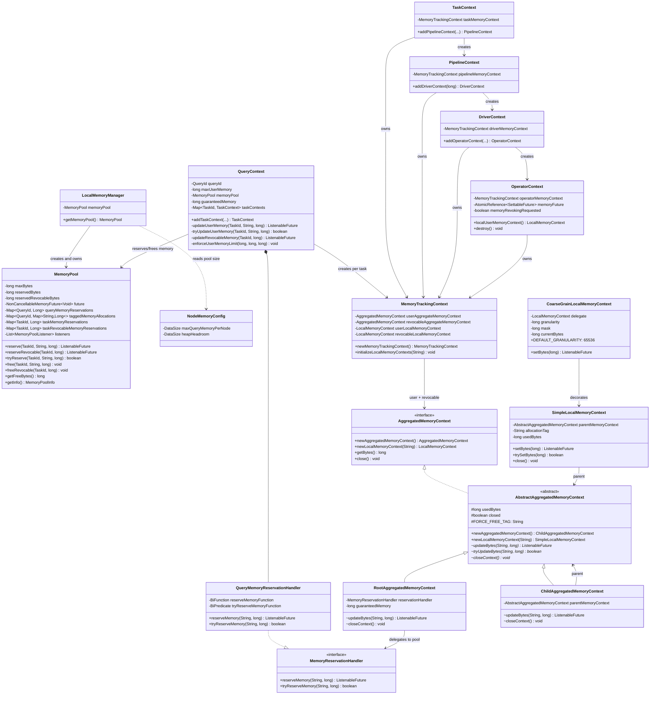
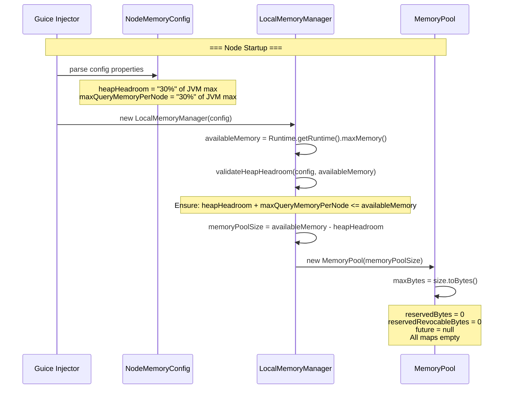
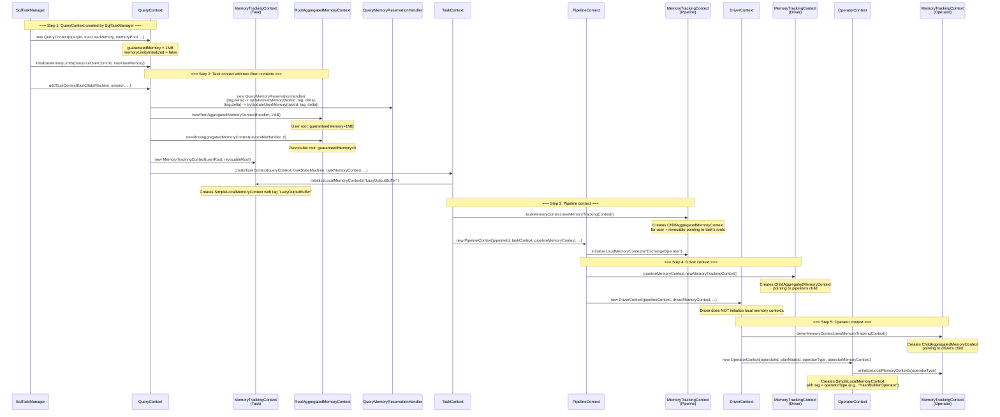
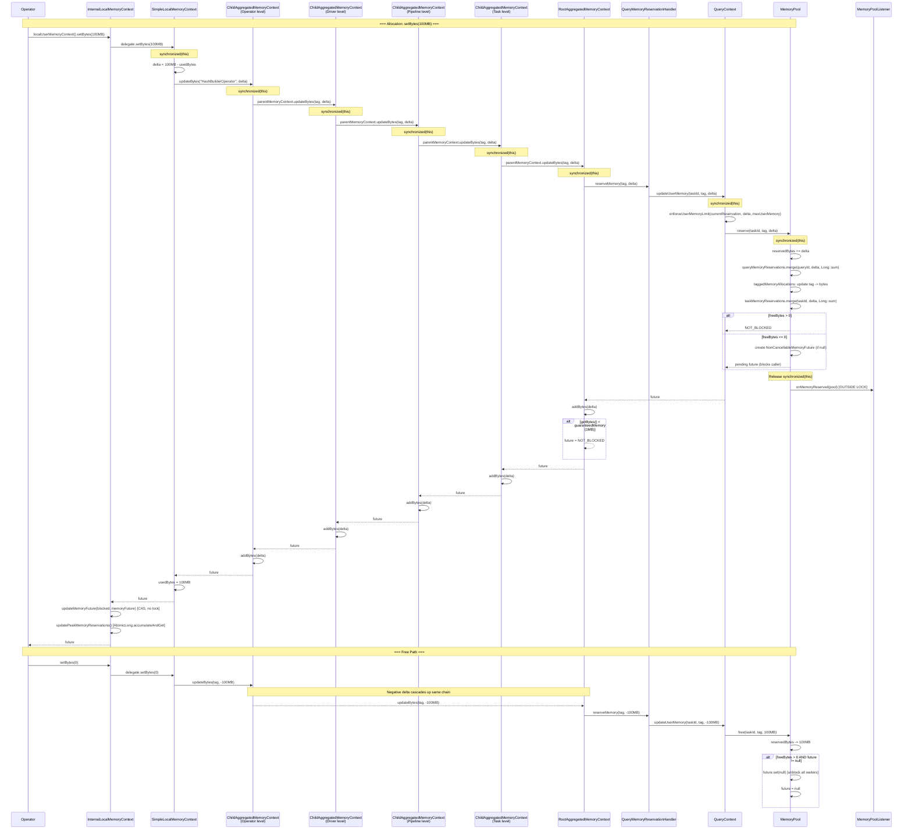

# Module Teardown: The Global Pool and the Tracking Tree (Task 5.1.A)

## Table of Contents

- [0. Research Focus](#0-research-focus)
- [1. High-Level Overview](#1-high-level-overview)
- [2. Structural Architecture](#2-structural-architecture)
  - [Primary Source Files](#primary-source-files)
  - [Key Data Structures](#key-data-structures)
  - [Class Diagram](#class-diagram)
- [3. Execution & Call Flow](#3-execution-call-flow)
  - [3.1 Pool Construction](#31-pool-construction)
  - [3.2 Context Tree Creation (Query -> Task -> Pipeline -> Driver -> Operator)](#32-context-tree-creation-query-task-pipeline-driver-operator)
  - [Allocation Tag Convention by Tree Level](#allocation-tag-convention-by-tree-level)
  - [3.3 Delta Propagation Path (Bottom-Up)](#33-delta-propagation-path-bottom-up)
  - [3.4 Close Cascade](#34-close-cascade)
- [4. Concurrency & State Management](#4-concurrency-state-management)
  - [Threading Model](#threading-model)
  - [How Delta Propagation Avoids Lock Contention](#how-delta-propagation-avoids-lock-contention)
  - [Synchronization Summary](#synchronization-summary)
  - [State Machine](#state-machine)
- [5. Memory & Resource Profile](#5-memory-resource-profile)
  - [Allocation Patterns](#allocation-patterns)
  - [Three-Level Tracking Granularity](#three-level-tracking-granularity)
  - [Pool Can Go Negative on Free Bytes](#pool-can-go-negative-on-free-bytes)
  - [Configuration Properties](#configuration-properties)
  - [Two-Level Enforcement Summary](#two-level-enforcement-summary)
- [6. Key Design Insights](#6-key-design-insights)
- [7. Porting Considerations (Java -> Target Architecture)](#7-porting-considerations-java-target-architecture)
  - [Translation Blockers](#translation-blockers)
  - [Recommended Abstractions](#recommended-abstractions)
  - [Design Pattern Translation Summary](#design-pattern-translation-summary)


## 0. Research Focus
* **Task ID:** 5.1.A
* **Focus:** Analyze how the single global `MemoryPool` is constructed. Trace the creation of the context tree (Query -> Task -> Pipeline -> Driver -> Operator). How do deltas (additions/subtractions of memory) propagate up this tree without causing severe lock contention?

## 1. High-Level Overview
* **Core Responsibility:** Trino 480 uses a single unified `MemoryPool` per worker node to track all memory reservations. Operators report their memory usage through a hierarchical context tree (Query -> Task -> Pipeline -> Driver -> Operator) built from `MemoryTrackingContext` wrappers. Deltas propagate bottom-up through `ChildAggregatedMemoryContext` nodes to a `RootAggregatedMemoryContext`, which bridges into `QueryContext` for per-query limit enforcement, and finally into the shared `MemoryPool` for node-level accounting. The design avoids severe lock contention through three key mechanisms: per-context fine-grained locking (each node synchronizes only on itself), `CoarseGrainLocalMemoryContext` batching (64KB granularity reduces pool interactions by ~1000x), and CAS-based future management at the operator level (no lock needed for blocking state propagation).
* **Key Triggers:** Operator-level `setBytes()` calls initiate the bottom-up propagation. `MemoryPool.free()` triggers unblocking of waiting operators. `MemoryRevokingScheduler.onMemoryReserved()` listens for threshold crossings and triggers spilling. `ClusterMemoryManager.process()` periodically enforces cluster-wide limits.

## 2. Structural Architecture

### Primary Source Files

| File | Lines | Role |
|------|-------|------|
| `core/.../memory/MemoryPool.java` | 425 | Single per-node pool: reserve/free, `ConcurrentHashMap` tracking, `NonCancellableMemoryFuture` blocking |
| `core/.../memory/LocalMemoryManager.java` | 80 | Creates and owns the single `MemoryPool` per node |
| `core/.../memory/QueryContext.java` | 360 | Per-query isolation, `maxUserMemory` enforcement, context tree factory, `QueryMemoryReservationHandler` |
| `core/.../memory/NodeMemoryConfig.java` | 62 | `query.max-memory-per-node` (30% heap), `memory.heap-headroom-per-node` (30% heap) |
| `core/.../memory/MemoryManagerConfig.java` | 236 | `query.max-memory` (20GB), `query.max-total-memory` (40GB), killer policies |
| `lib/.../context/MemoryTrackingContext.java` | 149 | Composite wrapper: user + revocable aggregated contexts, `newMemoryTrackingContext()` factory |
| `lib/.../context/AggregatedMemoryContext.java` | 35 | Public interface with static factory methods |
| `lib/.../context/AbstractAggregatedMemoryContext.java` | 103 | Base class: `usedBytes`, lifecycle, abstract `updateBytes()` |
| `lib/.../context/RootAggregatedMemoryContext.java` | 62 | Root node: bridges to pool via `MemoryReservationHandler`, guaranteed memory override |
| `lib/.../context/ChildAggregatedMemoryContext.java` | 59 | Intermediate node: delegates to parent first, then records locally |
| `lib/.../context/SimpleLocalMemoryContext.java` | 108 | Leaf node: `setBytes()`/`addBytes()` compute delta, propagate up with allocation tag |
| `lib/.../context/CoarseGrainLocalMemoryContext.java` | 106 | Decorator: 64KB granularity batching, reduces lock acquisitions ~1000x |
| `lib/.../context/SimpleAggregatedMemoryContext.java` | 44 | Standalone parentless/pool-less context, never blocks |
| `lib/.../context/MemoryReservationHandler.java` | 31 | Bridge interface: `reserveMemory(tag, delta)` and `tryReserveMemory(tag, delta)` |
| `core/.../operator/TaskContext.java` | 683 | Task-level context, `addPipelineContext()`, tag `"LazyOutputBuffer"` |
| `core/.../operator/PipelineContext.java` | 682 | Pipeline-level context, `addDriverContext()`, tag `"ExchangeOperator"` |
| `core/.../operator/DriverContext.java` | 499 | Driver-level context, `addOperatorContext()` |
| `core/.../operator/OperatorContext.java` | 788 | Operator-level: `InternalLocalMemoryContext`, `updateMemoryFuture()` CAS, peak tracking, revocation |

### Key Data Structures

**MemoryPool fields:**

| Field | Type | Purpose |
|-------|------|---------|
| `maxBytes` | `long` (final) | Pool ceiling, set at construction |
| `reservedBytes` | `long` (`@GuardedBy("this")`) | Total non-revocable bytes reserved |
| `reservedRevocableBytes` | `long` (`@GuardedBy("this")`) | Total revocable (spillable) bytes reserved |
| `future` | `NonCancellableMemoryFuture<Void>` (`@GuardedBy("this")`) | Shared blocking future; null when pool has free bytes |
| `queryMemoryReservations` | `ConcurrentHashMap<QueryId, Long>` | Per-query total bytes (lock-free reads, synchronized writes) |
| `taggedMemoryAllocations` | `HashMap<QueryId, Map<String, Long>>` (`@GuardedBy("this")`) | Per-query per-operator-tag breakdown |
| `taskMemoryReservations` | `HashMap<TaskId, Long>` (`@GuardedBy("this")`) | Per-task total bytes |
| `taskRevocableMemoryReservations` | `HashMap<TaskId, Long>` (`@GuardedBy("this")`) | Per-task revocable bytes |
| `listeners` | `CopyOnWriteArrayList<MemoryPoolListener>` | Event subscribers, notified outside lock |

**Context tree node fields:**

| Class | Key Fields | Purpose |
|-------|-----------|---------|
| `RootAggregatedMemoryContext` | `reservationHandler`, `guaranteedMemory` | Bridge to pool; 1MB deadlock prevention |
| `ChildAggregatedMemoryContext` | `parentMemoryContext` | Parent delegation; intermediate aggregation |
| `AbstractAggregatedMemoryContext` | `usedBytes`, `closed` | Byte counter and lifecycle for all aggregated contexts |
| `SimpleLocalMemoryContext` | `usedBytes`, `allocationTag`, `parentMemoryContext` | Leaf; computes deltas and propagates with tag |
| `CoarseGrainLocalMemoryContext` | `delegate`, `granularity` (64KB), `mask`, `currentBytes` | Batching decorator; only propagates on boundary crossings |
| `MemoryTrackingContext` | `userAggregateMemoryContext`, `revocableAggregateMemoryContext`, local contexts | Composite wrapper for user + revocable at every level |

### Class Diagram



## 3. Execution & Call Flow

### 3.1 Pool Construction



**Step-by-step pool construction:**

1. `LocalMemoryManager` is Guice-injected with `NodeMemoryConfig` at worker startup.

2. It reads `Runtime.getRuntime().maxMemory()` to determine JVM heap size, then computes pool size:
   ```java
   // LocalMemoryManager constructor (line 48-53)
   public LocalMemoryManager(NodeMemoryConfig config, long availableMemory)
   {
       validateHeapHeadroom(config, availableMemory);
       DataSize memoryPoolSize = DataSize.ofBytes(availableMemory - config.getHeapHeadroom().toBytes());
       verify(memoryPoolSize.toBytes() > 0, "memory pool size is 0");
       memoryPool = new MemoryPool(memoryPoolSize);
   }
   ```

3. Validation ensures `heapHeadroom + maxQueryMemoryPerNode <= availableMemory` (line 58-68). The headroom reserves space for GC and untracked allocations.

4. `MemoryPool` constructor stores `maxBytes = size.toBytes()` and initializes all counters to zero (line 73-77). The pool starts with no reservations, no future, and empty tracking maps.

**Key: there is exactly one `MemoryPool` instance per worker.** It is owned by `LocalMemoryManager` and shared by all queries on that node. The old general/reserved dual-pool design has been entirely removed.

### 3.2 Context Tree Creation (Query -> Task -> Pipeline -> Driver -> Operator)



**Step-by-step tree creation:**

**Step 1 - QueryContext creation.** `SqlTaskManager` lazily creates one `QueryContext` per query on the worker, injected with the node's `MemoryPool` reference and `maxQueryMemoryPerNode` from `NodeMemoryConfig`. `initializeMemoryLimits()` sets the per-query cap:

```java
// QueryContext.initializeMemoryLimits() (line 139-151)
public synchronized void initializeMemoryLimits(boolean resourceOverCommit, long maxUserMemory)
{
    if (resourceOverCommit) {
        // Allow the query to use the entire pool.
        this.maxUserMemory = memoryPool.getMaxBytes();
    }
    else {
        this.maxUserMemory = maxUserMemory;
    }
    memoryLimitsInitialized = true;
}
```

**Step 2 - Task context with two Root contexts.** `QueryContext.addTaskContext()` creates two separate `RootAggregatedMemoryContext` instances (one for user memory, one for revocable), each wired via a `QueryMemoryReservationHandler` that **captures the `taskId` via lambda closure**:

```java
// QueryContext.addTaskContext() (line 250-261)
MemoryTrackingContext taskMemoryContext = new MemoryTrackingContext(
        newRootAggregatedMemoryContext(
                new QueryMemoryReservationHandler(
                        (tag, delta) -> updateUserMemory(taskId, tag, delta),
                        (tag, delta) -> tryUpdateUserMemory(taskId, tag, delta)),
                guaranteedMemory),
        newRootAggregatedMemoryContext(
                new QueryMemoryReservationHandler(
                        (tag, delta) -> updateRevocableMemory(taskId, delta),
                        (tag, delta) -> tryReserveMemoryNotSupported()),
                0L));
```

The user root has `guaranteedMemory = 1MB` (deadlock prevention), the revocable root has `0` (no guarantee for spillable memory). The `TaskContext` constructor then initializes local memory contexts with tag `"LazyOutputBuffer"` for task-level output buffer allocations.

**Step 3 - Pipeline context.** `TaskContext.addPipelineContext()` calls `taskMemoryContext.newMemoryTrackingContext()`:

```java
// MemoryTrackingContext.newMemoryTrackingContext() (line 122-127)
public MemoryTrackingContext newMemoryTrackingContext()
{
    return new MemoryTrackingContext(
            userAggregateMemoryContext.newAggregatedMemoryContext(),
            revocableAggregateMemoryContext.newAggregatedMemoryContext());
}
```

This calls `AbstractAggregatedMemoryContext.newAggregatedMemoryContext()` which creates a `ChildAggregatedMemoryContext` pointing to its parent. `PipelineContext` initializes local contexts with tag `"ExchangeOperator"`.

**Step 4 - Driver context.** `PipelineContext.addDriverContext()` calls `pipelineMemoryContext.newMemoryTrackingContext()`, creating another layer of `ChildAggregatedMemoryContext` nodes. The driver does **not** initialize local memory contexts -- all allocations go through its operators.

```java
// PipelineContext.addDriverContext() (line 159-171)
public DriverContext addDriverContext(long splitWeight)
{
    DriverContext driverContext = new DriverContext(
            this,
            notificationExecutor,
            yieldExecutor,
            timeoutExecutor,
            pipelineMemoryContext.newMemoryTrackingContext(),
            splitWeight);
    drivers.add(driverContext);
    return driverContext;
}
```

**Step 5 - Operator context.** `DriverContext.addOperatorContext()` creates the final `MemoryTrackingContext` layer and initializes local contexts with the operator type as the allocation tag:

```java
// DriverContext.addOperatorContext() (line 118-136)
OperatorContext operatorContext = new OperatorContext(
        operatorId,
        planNodeId,
        sourceId,
        operatorType,
        this,
        notificationExecutor,
        driverMemoryContext.newMemoryTrackingContext());
```

```java
// OperatorContext constructor (line 140)
operatorMemoryContext.initializeLocalMemoryContexts(operatorType);
```

**The resulting tree for a single operator looks like:**
```
RootAggregatedMemoryContext (query-level, bridges to pool)
  └── ChildAggregatedMemoryContext (task-level)
        └── ChildAggregatedMemoryContext (pipeline-level)
              └── ChildAggregatedMemoryContext (driver-level)
                    └── ChildAggregatedMemoryContext (operator-level)
                          └── SimpleLocalMemoryContext (leaf, tag = operatorType)
```

Each `ChildAggregatedMemoryContext` holds its own `usedBytes` counter representing the aggregate of all descendants in that subtree.

### Allocation Tag Convention by Tree Level

| Level | Tag | Rationale |
|-------|-----|-----------|
| Task | `"LazyOutputBuffer"` | Output buffer allocations at task level |
| Pipeline | `"ExchangeOperator"` | Exchange client network buffer allocations |
| Driver | *(not initialized)* | All allocations go through operators |
| Operator | Operator type name (e.g., `"HashBuilderOperator"`) | Per-operator attribution for diagnostics |

### 3.3 Delta Propagation Path (Bottom-Up)



**Step-by-step propagation analysis:**

1. **Operator calls `setBytes()`.** The operator calls `localUserMemoryContext()` on `OperatorContext`, which returns an `InternalLocalMemoryContext` decorator wrapping the real `SimpleLocalMemoryContext`.

2. **Delta computation at leaf.** `SimpleLocalMemoryContext.setBytes(bytes)` computes `delta = bytes - usedBytes` and calls `parentMemoryContext.updateBytes(allocationTag, delta)`:
   ```java
   // SimpleLocalMemoryContext.setBytes() (line 55-68)
   public synchronized ListenableFuture<Void> setBytes(long bytes)
   {
       checkState(!closed, "SimpleLocalMemoryContext is already closed");
       checkArgument(bytes >= 0, "bytes cannot be negative");
       if (bytes == usedBytes) {
           return NOT_BLOCKED;
       }
       // update the parent first as it may throw a runtime exception
       ListenableFuture<Void> future = parentMemoryContext.updateBytes(allocationTag, bytes - usedBytes);
       usedBytes = bytes;
       return future;
   }
   ```

3. **Chain through `ChildAggregatedMemoryContext` nodes.** Each intermediate node delegates to its parent **before** recording locally:
   ```java
   // ChildAggregatedMemoryContext.updateBytes() (line 34-41)
   synchronized ListenableFuture<Void> updateBytes(String allocationTag, long delta)
   {
       checkState(!isClosed(), "ChildAggregatedMemoryContext is already closed");
       // update the parent before updating usedBytes as it may throw a runtime exception
       ListenableFuture<Void> future = parentMemoryContext.updateBytes(allocationTag, delta);
       addBytes(delta);
       return future;
   }
   ```
   This "parent-first" ordering is critical: if `enforceUserMemoryLimit()` throws `ExceededMemoryLimitException`, no intermediate node has been mutated, keeping the tree consistent.

4. **Root contacts pool via handler.** `RootAggregatedMemoryContext.updateBytes()` calls the `MemoryReservationHandler`, which routes through the `QueryMemoryReservationHandler` lambda to `QueryContext.updateUserMemory(taskId, tag, delta)`:
   ```java
   // RootAggregatedMemoryContext.updateBytes() (line 34-44)
   synchronized ListenableFuture<Void> updateBytes(String allocationTag, long delta)
   {
       checkState(!isClosed(), "RootAggregatedMemoryContext is already closed");
       ListenableFuture<Void> future = reservationHandler.reserveMemory(allocationTag, delta);
       addBytes(delta);
       // make sure we never block queries below guaranteedMemory
       if (getBytes() < guaranteedMemory) {
           future = NOT_BLOCKED;
       }
       return future;
   }
   ```

5. **Per-query limit check.** `QueryContext.updateUserMemory()` first enforces the per-query limit, then delegates to the pool:
   ```java
   // QueryContext.updateUserMemory() (line 164-177)
   private synchronized ListenableFuture<Void> updateUserMemory(TaskId taskId, String allocationTag, long delta)
   {
       if (delta >= 0) {
           enforceUserMemoryLimit(memoryPool.getQueryMemoryReservation(queryId), delta, maxUserMemory);
           ListenableFuture<Void> future = memoryPool.reserve(taskId, allocationTag, delta);
           if (future.isDone()) {
               return NOT_BLOCKED;
           }
           return future;
       }
       memoryPool.free(taskId, allocationTag, -delta);
       return NOT_BLOCKED;
   }
   ```

6. **Pool reservation.** `MemoryPool.reserve()` atomically updates all four tracking structures within a single `synchronized` block:
   ```java
   // MemoryPool.reserve() (line 123-149)
   public ListenableFuture<Void> reserve(TaskId taskId, String allocationTag, long bytes)
   {
       ListenableFuture<Void> result;
       synchronized (this) {
           if (bytes != 0) {
               QueryId queryId = taskId.queryId();
               queryMemoryReservations.merge(queryId, bytes, Long::sum);
               updateTaggedMemoryAllocations(queryId, allocationTag, bytes);
               taskMemoryReservations.merge(taskId, bytes, Long::sum);
           }
           reservedBytes += bytes;
           if (getFreeBytes() <= 0) {
               if (future == null) {
                   future = NonCancellableMemoryFuture.create();
               }
               result = future;
           }
           else {
               result = NOT_BLOCKED;
           }
       }
       onMemoryReserved();  // OUTSIDE the lock
       return result;
   }
   ```

7. **Listener notification outside the lock.** `onMemoryReserved()` is called **after** the `synchronized` block exits, preventing deadlock with `MemoryRevokingScheduler` which traverses the context tree.

8. **Unblocking.** When `free()` makes `freeBytes > 0`, the pool completes the shared future and sets it to null:
   ```java
   // MemoryPool.free() excerpt (line 256-259)
   reservedBytes -= bytes;
   if (getFreeBytes() > 0 && future != null) {
       future.set(null);
       future = null;
   }
   ```

9. **CAS-based future propagation at operator level.** `InternalLocalMemoryContext` calls `updateMemoryFuture()` using `AtomicReference.compareAndSet()` -- no lock needed:
   ```java
   // OperatorContext.updateMemoryFuture() (line 369-388)
   private static void updateMemoryFuture(ListenableFuture<Void> memoryPoolFuture,
           AtomicReference<SettableFuture<Void>> targetFutureReference)
   {
       if (!memoryPoolFuture.isDone()) {
           SettableFuture<Void> currentMemoryFuture = targetFutureReference.get();
           while (currentMemoryFuture.isDone()) {
               SettableFuture<Void> settableFuture = SettableFuture.create();
               if (targetFutureReference.compareAndSet(currentMemoryFuture, settableFuture)) {
                   currentMemoryFuture = settableFuture;
               }
               else {
                   currentMemoryFuture = targetFutureReference.get();
               }
           }
           SettableFuture<Void> finalMemoryFuture = currentMemoryFuture;
           memoryPoolFuture.addListener(() -> finalMemoryFuture.set(null), directExecutor());
       }
   }
   ```

### 3.4 Close Cascade

When a task completes, `MemoryTrackingContext.close()` uses Guava's `Closer` to close both aggregated and local contexts. Each `SimpleLocalMemoryContext.close()` sends `-usedBytes` up. Each `ChildAggregatedMemoryContext.closeContext()` sends `FORCE_FREE_TAG` with `-getBytes()`:

```java
// ChildAggregatedMemoryContext.closeContext() (line 54-58)
void closeContext()
{
    parentMemoryContext.updateBytes(FORCE_FREE_TAG, -getBytes());
}
```

```java
// RootAggregatedMemoryContext.closeContext() (line 58-61)
void closeContext()
{
    reservationHandler.reserveMemory(FORCE_FREE_TAG, -getBytes());
}
```

`OperatorContext.destroy()` validates zero memory after close:
```java
// OperatorContext.destroy() (line 403-411)
operatorMemoryContext.close();
if (operatorMemoryContext.getUserMemory() != 0) {
    throw new TrinoException(GENERIC_INTERNAL_ERROR,
        format("Operator %s has non-zero user memory (%d bytes) after destroy()", ...));
}
```

## 4. Concurrency & State Management

### Threading Model

`MemoryPool` is a shared resource accessed by all driver threads on a worker. It does not run on a dedicated thread -- it is invoked inline by any thread executing an operator's `addInput()`/`getOutput()` path. Multiple operators across different queries, tasks, pipelines, and drivers can call into the pool concurrently.

The memory context tree is also shared across driver threads within a query. Each context object synchronizes on its own `this` monitor.

### How Delta Propagation Avoids Lock Contention

This is the central design question. The answer involves **five complementary mechanisms:**

**Mechanism 1: Per-node fine-grained locking.** Each `AbstractAggregatedMemoryContext` and `SimpleLocalMemoryContext` synchronizes on its own `this` monitor. Two operators in different pipelines only contend at the task-level `ChildAggregatedMemoryContext` and above. Two operators in different drivers of the same pipeline contend at the pipeline level and above. The lock hold time at each level is minimal -- just `addBytes(delta)` which is a single `long` addition.

**Mechanism 2: Strict leaf-to-root lock ordering prevents deadlock.** An allocation acquires locks bottom-up:
```
SimpleLocalMemoryContext(this) ->
  ChildAggregatedMemoryContext[operator](this) ->
    ChildAggregatedMemoryContext[driver](this) ->
      ChildAggregatedMemoryContext[pipeline](this) ->
        ChildAggregatedMemoryContext[task](this) ->
          RootAggregatedMemoryContext(this) ->
            QueryContext(this) ->
              MemoryPool(this)
```
Because the ordering is always the same direction, two operators that share an ancestor can never deadlock.

**Mechanism 3: `CoarseGrainLocalMemoryContext` -- the primary contention reduction mechanism.** This decorator batches small allocations to 64KB boundaries, dramatically reducing the number of times the full lock chain is acquired:

```java
// CoarseGrainLocalMemoryContext.setBytes() (line 63-71)
public synchronized ListenableFuture<Void> setBytes(long bytes)
{
    long roundedUpBytes = roundUpToNearest(bytes);
    if (roundedUpBytes != currentBytes) {
        currentBytes = roundedUpBytes;
        return delegate.setBytes(currentBytes);
    }
    return Futures.immediateVoidFuture();
}

long roundUpToNearest(long bytes)
{
    long masked = bytes & mask;  // mask = ~(granularity - 1)
    return masked == bytes ? masked : masked + granularity;
}
```

For hash table operators that resize incrementally (reporting byte-level changes on every row), this means the expensive synchronized propagation through 5+ levels to the pool happens only once per 64KB of growth -- approximately a **1000x reduction** in lock acquisitions for typical workloads. The class Javadoc explicitly states: "This class prevents contention in the memory tracking system by coarsening the granularity of memory tracking."

**Mechanism 4: CAS-based operator future management.** `OperatorContext.updateMemoryFuture()` uses `AtomicReference.compareAndSet()` to atomically swap blocking futures without holding a lock. This avoids contention between the driver thread (which calls `setBytes()`) and the memory-freeing thread (which completes the pool future). The CAS loop retries if another thread concurrently updates the reference.

**Mechanism 5: Listener notification outside the pool lock.** `MemoryPool.reserve()` calls `onMemoryReserved()` **after** the `synchronized` block exits. `MemoryRevokingScheduler` is a listener that traverses the entire context tree; calling it under the pool lock would cause deadlock with operator threads holding context locks and trying to reserve from the pool.

### Synchronization Summary

| Component | Synchronization | Scope | Hold Time |
|-----------|----------------|-------|-----------|
| `MemoryPool` | `synchronized(this)` | Single intrinsic lock for all state | Short: arithmetic + map updates |
| `queryMemoryReservations` | `ConcurrentHashMap` | Lock-free reads (writes still under pool lock) | Near-zero for reads |
| `QueryContext` | `synchronized(this)` | Per-query limit check + pool call | Short: comparison + delegation |
| `RootAggregatedMemoryContext` | `synchronized(this)` | Handler call + `addBytes()` | Very short |
| `ChildAggregatedMemoryContext` | `synchronized(this)` | Parent call + `addBytes()` | Very short |
| `SimpleLocalMemoryContext` | `synchronized(this)` | Delta computation + parent call | Very short |
| `CoarseGrainLocalMemoryContext` | `synchronized(this)` | Rounding check; delegates only on boundary | Near-zero when no boundary crossing |
| `OperatorContext.memoryFuture` | `AtomicReference` CAS | Future swap for blocking state | Lock-free |
| `OperatorContext.peakMemory*` | `AtomicLong.accumulateAndGet` | Peak tracking | Lock-free |
| `MemoryPool.listeners` | `CopyOnWriteArrayList` | Safe concurrent iteration | Lock-free for reads |

### State Machine

No formal state machine exists. The pool has two effective states:
- **Available:** `freeBytes > 0`, `future == null` or completed. Allocations return `NOT_BLOCKED`.
- **Exhausted:** `freeBytes <= 0`, pending `future` blocks callers. Transitions back to available when `free()` makes `freeBytes > 0`.

Each context has a binary `closed` flag: once closed, all further `setBytes()`/`addBytes()` throw `IllegalStateException`.

## 5. Memory & Resource Profile

### Allocation Patterns

**The pool itself allocates no data buffers.** `MemoryPool` is a lightweight accounting object. Its overhead is the `HashMap`/`ConcurrentHashMap` entries for query/task/tag tracking. The real memory being tracked lives in operator data structures (hash tables, sort buffers, aggregation state).

**The context tree is lightweight.** Each node is a small Java object with a `long usedBytes`, a parent reference, and a monitor. For a query with 4 tasks x 3 pipelines x 2 drivers x 5 operators, the tree has ~120 `ChildAggregatedMemoryContext` nodes + ~80 `SimpleLocalMemoryContext` leaves. Total overhead: ~20KB (user + revocable) -- negligible compared to the data being tracked.

### Three-Level Tracking Granularity

The pool maintains three levels of granularity, all updated atomically within the same `synchronized` block:

| Level | Data Structure | Granularity |
|-------|---------------|-------------|
| Query | `queryMemoryReservations` (`ConcurrentHashMap<QueryId, Long>`) | Total bytes per query |
| Task | `taskMemoryReservations` (`HashMap<TaskId, Long>`) | Total bytes per task |
| Operator | `taggedMemoryAllocations` (`HashMap<QueryId, Map<String, Long>>`) | Per-query x operator-tag breakdown |

Reading `getBytes()` on any `AggregatedMemoryContext` in the tree gives the total for that subtree. The allocation tag on `SimpleLocalMemoryContext` propagates to `MemoryPool.taggedMemoryAllocations` for per-operator visibility in `MemoryPoolInfo` (exposed via JMX and the coordinator).

### Pool Can Go Negative on Free Bytes

When `reserve()` is called and `freeBytes <= 0`, the pool **still records the reservation** (`reservedBytes += delta`), then returns a pending future. The pool's `getFreeBytes()` can go negative:
```java
// MemoryPool.getFreeBytes() (line 310-313)
public synchronized long getFreeBytes()
{
    return maxBytes - reservedBytes - reservedRevocableBytes;
}
```
This is by design: bookkeeping is always accurate, and the blocking future prevents the operator from proceeding. The `NonCancellableMemoryFuture` prevents callers from cancelling the future (throws `UnsupportedOperationException` on `cancel()`), ensuring that cleanup code always runs.

### Configuration Properties

| Property | Default | Purpose |
|----------|---------|---------|
| `query.max-memory-per-node` | 30% of JVM heap | Per-query memory cap on a single worker |
| `memory.heap-headroom-per-node` | 30% of JVM heap | Reserved for GC and untracked allocations |
| `query.max-memory` | 20 GB | Global per-query user memory limit (coordinator-enforced) |
| `query.max-total-memory` | 2x `query.max-memory` | Global per-query total (user + revocable) limit |
| `query.low-memory-killer.policy` | `TOTAL_RESERVATION_ON_BLOCKED_NODES` | Which query to kill when OOM |
| `task.low-memory-killer.policy` | `TOTAL_RESERVATION_ON_BLOCKED_NODES` | Which task to kill when OOM |

### Two-Level Enforcement Summary

| Level | Scope | Limit Source | Enforcement Point | Default |
|-------|-------|-------------|-------------------|---------|
| Worker per-query | Single node | `query.max-memory-per-node` | `QueryContext.enforceUserMemoryLimit()` | 30% of heap |
| Worker pool | Single node | `JVM max - heap headroom` | `MemoryPool.reserve()` (blocking future) | 70% of heap |
| Coordinator per-query (user) | Cluster-wide | `query.max-memory` | `ClusterMemoryManager.process()` | 20 GB |
| Coordinator per-query (total) | Cluster-wide | `query.max-total-memory` | `ClusterMemoryManager.process()` | 40 GB |
| Coordinator OOM killer | Cluster-wide | blocked nodes > 0 | `LowMemoryKiller.chooseTargetToKill()` | Kill biggest on blocked nodes |

## 6. Key Design Insights

* **Single unified pool per node -- no general/reserved split.** Trino 480 uses exactly one `MemoryPool` per worker, created by `LocalMemoryManager` with `maxBytes = JVM max memory - heap headroom (30%)`. All queries share the same pool, with isolation enforced at the `QueryContext` level (per-query limits) rather than at the pool level. This simplifies the model: one lock, one set of counters, one blocking future.

* **Five-mechanism contention avoidance strategy.** Lock contention on the shared pool is mitigated by: (1) per-context fine-grained locking with strict leaf-to-root ordering, (2) `CoarseGrainLocalMemoryContext` batching to 64KB boundaries (~1000x fewer pool interactions for incremental allocators), (3) CAS-based operator future management, (4) listener notification outside the pool lock, and (5) `ConcurrentHashMap` for `queryMemoryReservations` enabling lock-free reads for monitoring. The pool's intrinsic lock is held only for fast arithmetic and map updates -- no I/O, no cross-thread signaling inside the lock.

* **Parent-first mutation ordering guarantees tree consistency on failure.** Every `ChildAggregatedMemoryContext.updateBytes()` and `SimpleLocalMemoryContext.setBytes()` delegates to the parent **before** updating its own `usedBytes`. If the parent throws (e.g., `ExceededMemoryLimitException`), no intermediate node has been mutated. The tree is always consistent after a failed allocation -- no partial updates to unwind.

* **Guaranteed memory (1MB) prevents deadlock on trivial allocations.** `RootAggregatedMemoryContext` overrides the pool's pending future to `NOT_BLOCKED` when the query's total bytes are below `guaranteedMemory` (1MB). Without this, a query that hasn't started processing could be permanently blocked. The 1MB threshold ensures every query can initialize (read at least one page, allocate hash tables) regardless of pool state.

* **Reserve-first, block-second semantics.** When `reserve()` is called and `freeBytes <= 0`, the pool records the reservation first (`reservedBytes += delta`), then returns a pending future. This means `freeBytes` can go negative, but bookkeeping is always accurate. `NonCancellableMemoryFuture` prevents callers from cancelling, ensuring cleanup code always executes.

* **`QueryMemoryReservationHandler` captures `taskId` via closure for attribution.** The handler's lambda closures close over the `taskId`, so every allocation propagated from a specific task carries its identity through to `MemoryPool.reserve()`, enabling per-task tracking without the context tree needing to know about task identity. The pattern is: operator -> tree -> root -> handler(captures taskId) -> QueryContext -> pool.

## 7. Porting Considerations (Java -> Target Architecture)

### Translation Blockers

* **Synchronized cascading lock chain.** Each allocation acquires 5-7 nested intrinsic locks bottom-to-top. In Rust, this maps to nested `Mutex` locks. The consistent lock ordering prevents deadlock, but nested `Mutex::lock()` calls are verbose and error-prone. The total number of locks acquired per allocation (without `CoarseGrainLocalMemoryContext` batching) is 7-8.

* **`ListenableFuture` backpressure model.** Every `updateBytes()` returns a `ListenableFuture<Void>`. The blocking-future pattern (return a future, driver loop checks it before proceeding) works because Java threads can park cheaply. In async Rust, blocking a thread is unacceptable.

* **`ConcurrentHashMap` semantics.** Java's CHM provides fine-grained locking with atomic `merge()`/`compute()` operations. Rust's `DashMap` or `RwLock<HashMap>` approximate but don't exactly replicate these semantics.

* **GC-dependent lifecycle management.** `SqlTaskManager` stores `QueryContext` in a `NonEvictableLoadingCache` with weak values. The `QueryContext` stays alive as long as at least one `TaskContext` holds a strong reference. In Rust, there is no GC -- explicit lifecycle management is needed.

### Recommended Abstractions

* **`MemoryPool` -> `Arc<Mutex<MemoryPoolInner>>`:** The single-lock design maps cleanly. Use `parking_lot::Mutex` for the fast path (no I/O in critical section). Replace `NonCancellableMemoryFuture` with `tokio::sync::Notify` or `tokio::sync::watch`.

* **Flatten the lock chain:** Instead of each `ChildAggregatedMemoryContext` holding its own `Mutex`, consider using `AtomicI64` for `usedBytes` at each level (lock-free counter) and only acquiring the root's mutex for the pool call:
  ```rust
  struct ChildAggregatedMemoryContext {
      used_bytes: AtomicI64,  // lock-free counter
      parent: Arc<dyn AggregatedMemoryContext>,
  }
  ```

* **RAII memory contexts:** Implement `Drop` on `LocalMemoryContext` and `ChildAggregatedMemoryContext` to automatically free bytes on destruction. This eliminates the `FORCE_FREE_TAG` hack and the manual `close()` pattern:
  ```rust
  impl Drop for LocalMemoryContext {
      fn drop(&mut self) {
          let bytes = self.inner.lock().used_bytes;
          if bytes > 0 {
              self.parent.update_bytes(&self.tag, -bytes);
          }
      }
  }
  ```

* **`CoarseGrainLocalMemoryContext` -> `AtomicI64` + bitwise rounding:** The 64KB batching pattern is critical for performance and should be faithfully replicated. Consider whether `AtomicI64` can replace the `synchronized` block:
  ```rust
  fn set_bytes(&self, bytes: i64) -> MemoryFuture {
      let rounded = self.round_up(bytes);
      let prev = self.current_bytes.swap(rounded, Ordering::SeqCst);
      if rounded != prev {
          self.delegate.set_bytes(rounded)
      } else {
          MemoryFuture::Ready
      }
  }
  ```

* **Backpressure via `tokio::sync::Notify`:** Replace `ListenableFuture<Void>` with a `MemoryFuture` enum. Operators `.await` on `Notify::notified()` when blocked. `MemoryPool.free()` calls `notify.notify_waiters()`.

* **QueryContext lifecycle -> explicit `Arc<QueryContext>`:** Use `Arc` held by each `TaskContext`. When the last task drops its `Arc`, the `QueryContext` is destroyed deterministically -- no GC needed.

* **Guaranteed memory -> `const GUARANTEED_MEMORY: usize = 1_048_576`:** Same logic: if total query bytes < threshold, never block.

### Design Pattern Translation Summary

| Java Pattern | Source Class | Rust Equivalent |
|---|---|---|
| Template method (abstract + subclass) | `AbstractAggregatedMemoryContext` | Trait with `dyn` dispatch |
| Decorator | `CoarseGrainLocalMemoryContext`, `InternalLocalMemoryContext` | Newtype wrapper implementing same trait |
| Composite | `MemoryTrackingContext` | Struct with two `Arc<dyn AggregatedMemoryContext>` |
| Factory method | `AggregatedMemoryContext.newRootAggregatedMemoryContext()` | Associated function on trait or module-level `fn` |
| Package-private | `updateBytes()`, `closeContext()` | `pub(crate)` visibility |
| Synchronized + intrinsic lock | `synchronized(this)` on each context | `Mutex<Inner>` or `AtomicI64` for counters |
| ListenableFuture backpressure | `reserve()` returns blocking future | `MemoryFuture::Blocked(Arc<Notify>)` |
| FORCE_FREE_TAG cleanup | `closeContext()` sends negative delta | `Drop` impl on context structs |
| Inner class capturing taskId | `QueryMemoryReservationHandler` | Closure or trait object with captured state |
| Weak-value cache lifecycle | `SqlTaskManager.queryContexts` | `Arc` reference counting with deterministic drop |
