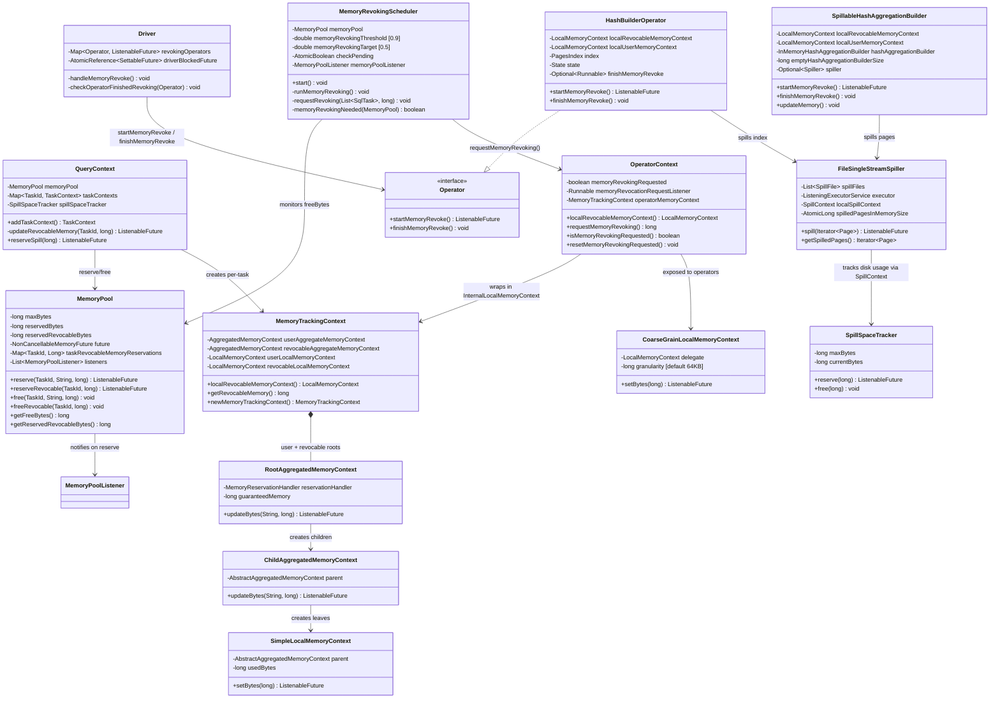
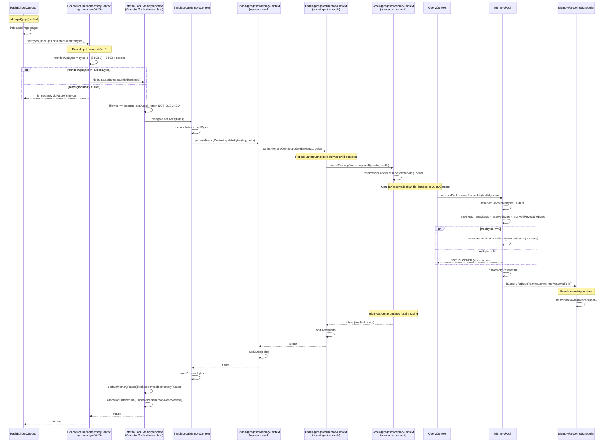

# Module Teardown: Revocable Memory and Spilling (Task 5.3.A)

## Table of Contents

- [0. Research Focus](#0-research-focus)
- [1. High-Level Overview](#1-high-level-overview)
- [2. Structural Architecture](#2-structural-architecture)
  - [Primary Source Files](#primary-source-files)
  - [Class Diagram](#class-diagram)
- [3. Execution & Call Flow](#3-execution-call-flow)
  - [3.1 Revocable Memory Allocation Path (Operator -> Pool)](#31-revocable-memory-allocation-path-operator-pool)
  - [3.2 SpillableHashAggregationBuilder -- Revocable Allocation Strategy](#32-spillablehashaggregationbuilder-revocable-allocation-strategy)
  - [3.3 Revocation Trigger Path (MemoryRevokingScheduler -> Operators)](#33-revocation-trigger-path-memoryrevokingscheduler-operators)
  - [3.4 HashBuilderOperator Spill Strategy (compact-or-spill)](#34-hashbuilderoperator-spill-strategy-compact-or-spill)
  - [3.5 SpillableHashAggregationBuilder Spill Strategy](#35-spillablehashaggregationbuilder-spill-strategy)
  - [3.6 FileSingleStreamSpiller Write Path](#36-filesinglestreamspiller-write-path)
- [4. Concurrency & State Management](#4-concurrency-state-management)
  - [Threading Model](#threading-model)
  - [Critical Synchronization Points](#critical-synchronization-points)
  - [State Machines](#state-machines)
- [5. Memory & Resource Profile](#5-memory-resource-profile)
  - [Memory Flow During Revocation](#memory-flow-during-revocation)
  - [Memory Tracking Hierarchy](#memory-tracking-hierarchy)
  - [CoarseGrainLocalMemoryContext Optimization](#coarsegrainlocalmemorycontext-optimization)
  - [Spill Disk Tracking](#spill-disk-tracking)
- [6. Key Design Insights](#6-key-design-insights)
- [7. Porting Considerations (Java -> Target Architecture)](#7-porting-considerations-java-target-architecture)
  - [Memory Context Tree Translation](#memory-context-tree-translation)
  - [CoarseGrainLocalMemoryContext in Rust](#coarsegrainlocalmemorycontext-in-rust)
  - [Revocation Signal: AtomicBool + Notify vs Channel](#revocation-signal-atomicbool-notify-vs-channel)
  - [Two-Phase Protocol](#two-phase-protocol)
  - [Spill Executor](#spill-executor)
  - [Key Differences to Watch](#key-differences-to-watch)
  - [Configuration Summary](#configuration-summary)


## 0. Research Focus
* **Task ID:** 5.3.A
* **Focus:** Trace how operators (HashBuilderOperator, HashAggregationOperator) allocate memory via RevocableMemoryContext, and how MemoryRevokingScheduler monitors the global pool, selects a victim task, and invokes the asynchronous revoking process. This is an end-to-end analysis of both the revocable allocation path and the revocation trigger path.

## 1. High-Level Overview

Trino's revocable memory system is a cooperative spill-to-disk mechanism built around a two-sided contract:

**Allocation side (operators):** Spillable operators allocate their bulk data structures (hash tables, sort buffers, aggregation state) via a `localRevocableMemoryContext` rather than the regular user memory context. This marks the memory as "reclaimable" -- the operator is promising that it can release this memory on demand by spilling to disk.

**Revocation side (scheduler):** The `MemoryRevokingScheduler` monitors the global `MemoryPool` and, when usage exceeds a configurable threshold (default 90%), walks the entire operator tree to signal operators with revocable memory to spill. A two-phase protocol (`startMemoryRevoke` / `finishMemoryRevoke`) handles the async disk I/O and state cleanup.

The memory context hierarchy forms a tree: `MemoryPool` <- `RootAggregatedMemoryContext` (per task, per memory type) <- `ChildAggregatedMemoryContext` (pipeline/driver) <- `SimpleLocalMemoryContext` (operator-level leaf). There are two parallel trees: one for user memory (non-revocable) and one for revocable memory. The revocable tree's root handler calls `MemoryPool.reserveRevocable()` while the user tree's calls `MemoryPool.reserve()`. Both contribute to the pool's total used bytes (`reservedBytes + reservedRevocableBytes`), which determines `getFreeBytes()`.

The critical insight is that **revocable bytes count against the pool capacity** but represent memory that can be reclaimed through spilling, while user bytes represent memory that cannot be reclaimed. The `MemoryRevokingScheduler` treats revocable bytes as the "pressure relief valve" -- when the pool is nearly full, it forces operators to convert their revocable memory into disk-based spilled data.

## 2. Structural Architecture

### Primary Source Files

**Memory Context Hierarchy (lib/trino-memory-context):**
- `LocalMemoryContext.java` -- interface: `setBytes(long)`, `addBytes(long)`, `trySetBytes(long)`, `close()`
- `SimpleLocalMemoryContext.java` -- leaf implementation, delegates delta to parent `AbstractAggregatedMemoryContext.updateBytes()`
- `CoarseGrainLocalMemoryContext.java` -- wraps a `LocalMemoryContext`, rounds up to nearest 64KB to reduce contention
- `AbstractAggregatedMemoryContext.java` -- tracks `usedBytes`, abstract `updateBytes()` / `closeContext()`
- `ChildAggregatedMemoryContext.java` -- propagates `updateBytes()` up to parent, then adds locally
- `RootAggregatedMemoryContext.java` -- terminal: calls `MemoryReservationHandler.reserveMemory()` to reach the pool
- `MemoryTrackingContext.java` -- pairs of (user, revocable) aggregated + local contexts at each hierarchy level
- `MemoryReservationHandler.java` -- interface bridging context hierarchy to pool-level reservation

**Memory Pool and Query Context:**
- `MemoryPool.java` -- node-level pool: `reserve()`, `reserveRevocable()`, `free()`, `freeRevocable()`; tracks per-task and per-query reservations; fires `MemoryPoolListener` on every `reserve()`/`reserveRevocable()`
- `QueryContext.java` -- creates `MemoryTrackingContext` per task with two `RootAggregatedMemoryContext`s (user + revocable), each wired to the pool via `QueryMemoryReservationHandler`
- `MemoryPoolListener.java` -- functional interface `onMemoryReserved(MemoryPool)`

**Revocation Scheduling:**
- `MemoryRevokingScheduler.java` -- dual-trigger monitor (timer + pool listener), threshold check, tree traversal, operator signaling
- `TraversingQueryContextVisitor.java` -- generic visitor pattern: traverses Query -> Task -> Pipeline -> Driver -> Operator contexts
- `VoidTraversingQueryContextVisitor.java` -- void-returning specialization (no merge needed)

**Operator-Level Revocation:**
- `OperatorContext.java` -- `requestMemoryRevoking()`, `isMemoryRevokingRequested()`, `resetMemoryRevokingRequested()`, wraps raw contexts in `InternalLocalMemoryContext` / `InternalAggregatedMemoryContext`
- `Driver.java` -- `handleMemoryRevoke()`, `checkOperatorFinishedRevoking()`, manages `revokingOperators` map
- `HashBuilderOperator.java` (spilling variant) -- compact-or-spill strategy, state machine: `CONSUMING_INPUT -> SPILLING_INPUT -> INPUT_SPILLED -> INPUT_UNSPILLING -> INPUT_UNSPILLED_AND_BUILT -> CLOSED`
- `HashAggregationOperator.java` -- delegates revocation to `HashAggregationBuilder.startMemoryRevoke()`
- `SpillableHashAggregationBuilder.java` -- spills aggregation groups, rebuilds in-memory builder, handles revocable-to-user memory conversion at output time
- `InMemoryHashAggregationBuilder.java` -- the actual hash table; used by `SpillableHashAggregationBuilder` as inner engine

**Spilling Infrastructure:**
- `SingleStreamSpiller.java` -- interface: `spill(Iterator<Page>)`, `getSpilledPages()`, `getAllSpilledPages()`
- `FileSingleStreamSpiller.java` -- writes pages round-robin across temp files on spill paths
- `Spiller.java` -- multi-stream interface (one stream per `spill()` call)
- `GenericSpiller.java` -- creates a new `SingleStreamSpiller` per `spill()` invocation
- `SpillSpaceTracker.java` -- node-level global spill disk quota
- `SpillContext.java` / `LocalSpillContext.java` -- per-operator and hierarchical spill byte tracking

### Class Diagram



## 3. Execution & Call Flow

### 3.1 Revocable Memory Allocation Path (Operator -> Pool)

This traces what happens when an operator calls `localRevocableMemoryContext.setBytes(n)`.



**Key code for the allocation path:**

1. **HashBuilderOperator.updateIndex()** -- the entry point where revocable memory is claimed:
```java
// HashBuilderOperator.java, line 337-351
private void updateIndex(Page page)
{
    index.addPage(page);

    if (spillEnabled) {
        localRevocableMemoryContext.setBytes(index.getEstimatedSize().toBytes());
    }
    else {
        if (!localUserMemoryContext.trySetBytes(index.getEstimatedSize().toBytes())) {
            index.compact();
            localUserMemoryContext.setBytes(index.getEstimatedSize().toBytes());
        }
    }
    operatorContext.recordOutput(page.getSizeInBytes(), page.getPositionCount());
}
```

The critical branching: when `spillEnabled == true`, the operator uses `localRevocableMemoryContext` (making the memory reclaimable). When `spillEnabled == false`, it uses `localUserMemoryContext` (non-reclaimable, subject to hard limits).

2. **CoarseGrainLocalMemoryContext** -- reduces lock contention by batching updates:
```java
// CoarseGrainLocalMemoryContext.java, line 63-71
public synchronized ListenableFuture<Void> setBytes(long bytes)
{
    long roundedUpBytes = roundUpToNearest(bytes);
    if (roundedUpBytes != currentBytes) {
        currentBytes = roundedUpBytes;
        return delegate.setBytes(currentBytes);
    }
    return Futures.immediateVoidFuture();
}
```
With 64KB granularity, small page additions within the same 64KB bucket are free (no synchronization up the tree).

3. **QueryContext.addTaskContext()** -- where the revocable tree root is wired to the pool:
```java
// QueryContext.java, line 250-261
MemoryTrackingContext taskMemoryContext = new MemoryTrackingContext(
        newRootAggregatedMemoryContext(
                new QueryMemoryReservationHandler(
                        (tag, delta) -> updateUserMemory(taskId, tag, delta),
                        (tag, delta) -> tryUpdateUserMemory(taskId, tag, delta)),
                guaranteedMemory),
        newRootAggregatedMemoryContext(
                new QueryMemoryReservationHandler(
                        (tag, delta) -> updateRevocableMemory(taskId, delta),
                        (tag, delta) -> tryReserveMemoryNotSupported()),
                0L));
```

The second `newRootAggregatedMemoryContext` is the revocable root. Its handler calls `updateRevocableMemory()`:
```java
// QueryContext.java, line 180-191
private synchronized ListenableFuture<Void> updateRevocableMemory(TaskId taskId, long delta)
{
    if (delta >= 0) {
        ListenableFuture<Void> future = memoryPool.reserveRevocable(taskId, delta);
        if (future.isDone()) {
            return NOT_BLOCKED;
        }
        return future;
    }
    memoryPool.freeRevocable(taskId, -delta);
    return NOT_BLOCKED;
}
```

Note: revocable memory has `guaranteedMemory = 0L` (no guaranteed minimum) and `tryReserveMemoryNotSupported()` -- the try-reserve path is not implemented for revocable memory.

4. **MemoryPool.reserveRevocable()** -- the pool-level accounting:
```java
// MemoryPool.java, line 156-180
public ListenableFuture<Void> reserveRevocable(TaskId taskId, long bytes)
{
    checkArgument(bytes >= 0, "'%s' is negative", bytes);

    ListenableFuture<Void> result;
    synchronized (this) {
        if (bytes != 0) {
            taskRevocableMemoryReservations.merge(taskId, bytes, Long::sum);
        }
        reservedRevocableBytes += bytes;
        if (getFreeBytes() <= 0) {
            if (future == null) {
                future = NonCancellableMemoryFuture.create();
            }
            checkState(!future.isDone(), "future is already completed");
            result = future;
        }
        else {
            result = NOT_BLOCKED;
        }
    }

    onMemoryReserved();  // FIRES LISTENERS -- this is the event-driven trigger
    return result;
}
```

The `getFreeBytes()` formula is: `maxBytes - reservedBytes - reservedRevocableBytes`. Both user and revocable count against the same pool.

### 3.2 SpillableHashAggregationBuilder -- Revocable Allocation Strategy

The aggregation case is subtler. `SpillableHashAggregationBuilder` uses a split-accounting model where the "empty shell" of the hash table is user memory and the growing data is revocable:

```java
// SpillableHashAggregationBuilder.java, line 124-136
public void updateMemory()
{
    checkState(spillInProgress.isDone());

    if (producingOutput) {
        localRevocableMemoryContext.setBytes(0);
        localUserMemoryContext.setBytes(hashAggregationBuilder.getSizeInMemory());
    }
    else {
        localUserMemoryContext.setBytes(emptyHashAggregationBuilderSize);
        localRevocableMemoryContext.setBytes(hashAggregationBuilder.getSizeInMemory() - emptyHashAggregationBuilderSize);
    }
}
```

During input processing:
- `localUserMemoryContext` = size of an empty hash table (small, fixed-ish) -- non-reclaimable
- `localRevocableMemoryContext` = total size minus empty size -- the growing data that can be spilled

During output production, everything converts to user memory because you cannot spill while producing output.

### 3.3 Revocation Trigger Path (MemoryRevokingScheduler -> Operators)

```mermaid
sequenceDiagram
    participant Timer as ScheduledExecutor<br/>(1s periodic)
    participant Listener as MemoryPoolListener<br/>(onMemoryReserved)
    participant Sched as MemoryRevokingScheduler
    participant Pool as MemoryPool
    participant Task as SqlTask (sorted by create time)
    participant TC as TaskContext
    participant PC as PipelineContext
    participant DC as DriverContext
    participant OC as OperatorContext
    participant Drv as Driver
    participant Op as HashBuilderOperator
    participant Spiller as FileSingleStreamSpiller
    participant Disk as Temp Files

    Note over Timer,Listener: === DUAL TRIGGER MECHANISM ===

    par Timer trigger (every 1 second)
        Timer->>Sched: requestMemoryRevokingIfNeeded()
        Sched->>Sched: checkPending.compareAndSet(false, true)
        Sched->>Sched: runMemoryRevoking()
    and Event trigger (on every pool reservation)
        Listener->>Sched: onMemoryReserved(pool)
        Sched->>Pool: memoryRevokingNeeded(pool)?
        alt revocableBytes > 0 AND freeBytes <= maxBytes * 0.1
            Sched->>Sched: checkPending.compareAndSet(false, true)
            Sched->>Sched: scheduleRevoking() [submit to executor]
        end
    end

    Note over Sched: === runMemoryRevoking() - synchronized ===
    Sched->>Sched: checkPending.getAndSet(false)
    Sched->>Pool: memoryRevokingNeeded(pool)?
    Pool-->>Sched: YES (freeBytes=5GB, maxBytes=100GB, revocableBytes=40GB)

    Sched->>Sched: remainingBytesToRevoke = -freeBytes + maxBytes * 0.5
    Note over Sched: = -5GB + 50GB = 45GB

    Sched->>Sched: findRunningTasksInMemoryPool() [sorted by create time]

    Note over Sched: === DEDUP: Subtract already-in-progress revocations ===
    Sched->>TC: TraversingQueryContextVisitor: sum revocable bytes where isMemoryRevokingRequested
    TC-->>Sched: currentRevoking = 10GB (from prior revocations)
    Sched->>Sched: remainingBytesToRevoke -= 10GB = 35GB

    Note over Sched: === TREE TRAVERSAL with VoidTraversingQueryContextVisitor ===

    loop For each SqlTask (oldest first)
        Sched->>TC: taskContext.accept(visitor, remainingBytesToRevoke)
        TC->>PC: visitTaskContext -> acceptChildren
        loop For each PipelineContext
            PC->>PC: visitPipelineContext: remainingBytes > 0? continue
            PC->>DC: acceptChildren
            loop For each DriverContext
                DC->>OC: acceptChildren
                loop For each OperatorContext
                    alt remainingBytesToRevoke > 0
                        OC->>OC: requestMemoryRevoking()
                        OC->>OC: synchronized: set memoryRevokingRequested = true
                        OC->>OC: revokedMemory = operatorMemoryContext.getRevocableMemory()
                        OC->>Drv: listener.run() [driverBlockedFuture.get().set(null)]
                        Note over Drv: Driver wakes up!
                        OC-->>Sched: revokedMemory (e.g. 20GB)
                        Sched->>Sched: remainingBytesToRevoke -= 20GB = 15GB
                    end
                end
            end
        end
    end

    Note over Drv,Disk: === DRIVER HANDLES REVOCATION ===
    Drv->>Drv: processInternal() -> handleMemoryRevoke()

    loop For each activeOperator
        Drv->>OC: isMemoryRevokingRequested()?
        OC-->>Drv: true

        Drv->>Op: startMemoryRevoke()

        alt HashBuilderOperator in CONSUMING_INPUT
            Op->>Op: index.compact()
            Op->>Op: check: compacted < original * 0.8?

            alt Compaction saved > 20%
                Op->>Op: localRevocableMemoryContext.setBytes(compactedSize)
                Op->>Op: finishMemoryRevoke = Optional.of(() -> {})
                Op-->>Drv: immediateVoidFuture()
            else Compaction insufficient
                Op->>Op: create SingleStreamSpiller
                Op->>Spiller: spill(index.getPages())
                Spiller->>Disk: writePages() [async on executor]
                Op->>Op: finishMemoryRevoke = Optional.of(() -> { index.clear(); revocable=0; state=SPILLING_INPUT })
                Op-->>Drv: spillFuture (pending)
            end
        end

        Drv->>Drv: revokingOperators.put(operator, future)
        Drv->>Drv: checkOperatorFinishedRevoking(operator)

        alt future.isDone()
            Drv->>Op: finishMemoryRevoke()
            Op->>Op: finishMemoryRevoke.get().run()
            Note over Op: index.clear(), localRevocableMemoryContext.setBytes(0), state = SPILLING_INPUT
            Drv->>OC: resetMemoryRevokingRequested()
            Drv->>Drv: revokingOperators.remove(operator)
        else future not done
            Note over Drv: operator blocked on spill; getBlockedFuture() returns spill future
        end
    end
```

**Key code for the revocation trigger path:**

1. **Dual trigger with deduplication via AtomicBoolean:**
```java
// MemoryRevokingScheduler.java, line 142-157
private void onMemoryReserved(MemoryPool memoryPool)
{
    try {
        if (!memoryRevokingNeeded(memoryPool)) {
            return;
        }

        if (checkPending.compareAndSet(false, true)) {
            log.debug("Scheduling check for %s", memoryPool);
            scheduleRevoking();
        }
    }
    catch (Throwable e) {
        log.error(e, "Error when acting on memory pool reservation");
    }
}
```
The `checkPending` AtomicBoolean ensures only one revocation check is in flight. If the listener fires while a check is already pending, it's a no-op. The periodic timer path is identical:
```java
// MemoryRevokingScheduler.java, line 159-165
void requestMemoryRevokingIfNeeded()
{
    if (checkPending.compareAndSet(false, true)) {
        runMemoryRevoking();
    }
}
```

2. **Synchronized execution with double-check:**
```java
// MemoryRevokingScheduler.java, line 179-187
private synchronized void runMemoryRevoking()
{
    if (checkPending.getAndSet(false)) {
        if (!memoryRevokingNeeded(memoryPool)) {
            return;
        }
        requestMemoryRevoking(memoryPool, requireNonNull(currentTasksSupplier.get()));
    }
}
```
The `synchronized` keyword ensures only one revocation run at a time. The `getAndSet(false)` clears the pending flag -- if a new trigger arrives during execution, it will set `checkPending = true` again, causing a follow-up run.

3. **Task ordering -- oldest first:**
```java
// MemoryRevokingScheduler.java, line 51
private static final Ordering<SqlTask> ORDER_BY_CREATE_TIME = Ordering.natural().onResultOf(SqlTask::getTaskCreatedTime);

// MemoryRevokingScheduler.java, line 281-287
private static List<SqlTask> findRunningTasksInMemoryPool(Collection<SqlTask> allCurrentTasks, MemoryPool memoryPool)
{
    return allCurrentTasks.stream()
            .filter(task -> task.getTaskState() == TaskState.RUNNING && task.getQueryContext().getMemoryPool() == memoryPool)
            .sorted(ORDER_BY_CREATE_TIME)
            .collect(toImmutableList());
}
```
Tasks are sorted by creation time. This means **older tasks are victimized first**. The rationale is that older tasks have had more time to accumulate data, so they likely have more revocable memory. This also provides fairness: newer queries are given a chance to complete before being asked to spill.

4. **Pipeline-level early exit optimization:**
```java
// MemoryRevokingScheduler.java, line 246-252
public Void visitPipelineContext(PipelineContext pipelineContext, AtomicLong remainingBytesToRevoke)
{
    if (remainingBytesToRevoke.get() <= 0) {
        // exit immediately if no work needs to be done
        return null;
    }
    return super.visitPipelineContext(pipelineContext, remainingBytesToRevoke);
}
```
Once enough bytes are marked for revocation, the visitor short-circuits at the pipeline level to avoid unnecessary traversal.

5. **Driver.handleMemoryRevoke() -- the two-phase orchestrator:**
```java
// Driver.java, line 487-502
private void handleMemoryRevoke()
{
    for (int i = 0; i < activeOperators.size() && !driverContext.isTerminatingOrDone(); i++) {
        Operator operator = activeOperators.get(i);

        if (revokingOperators.containsKey(operator)) {
            checkOperatorFinishedRevoking(operator);
        }
        else if (operator.getOperatorContext().isMemoryRevokingRequested()) {
            ListenableFuture<Void> future = operator.startMemoryRevoke();
            revokingOperators.put(operator, future);
            checkOperatorFinishedRevoking(operator);
        }
    }
}
```

6. **The blocking mechanism -- how revoking operators block the driver:**
```java
// Driver.java, line 602-622
private Optional<ListenableFuture<Void>> getBlockedFuture(Operator operator)
{
    ListenableFuture<Void> blocked = revokingOperators.get(operator);
    if (blocked != null) {
        // We mark operator as blocked regardless of blocked.isDone(), because finishMemoryRevoke has not been called yet.
        return Optional.of(blocked);
    }
    blocked = operator.isBlocked();
    if (!blocked.isDone()) {
        return Optional.of(blocked);
    }
    blocked = operator.getOperatorContext().isWaitingForMemory();
    if (!blocked.isDone()) {
        return Optional.of(blocked);
    }
    blocked = operator.getOperatorContext().isWaitingForRevocableMemory();
    if (!blocked.isDone()) {
        return Optional.of(blocked);
    }
    return Optional.empty();
}
```
An operator in `revokingOperators` is **always** considered blocked (even if the future is done) until `finishMemoryRevoke()` has been called. This ensures the driver doesn't move pages to/from a revoking operator before it has cleaned up its state.

### 3.4 HashBuilderOperator Spill Strategy (compact-or-spill)

```java
// HashBuilderOperator.java, line 366-408
public ListenableFuture<Void> startMemoryRevoke()
{
    checkState(spillEnabled, "Spill not enabled, no revokable memory should be reserved");

    if (state == State.CONSUMING_INPUT) {
        long indexSizeBeforeCompaction = index.getEstimatedSize().toBytes();
        index.compact();
        long indexSizeAfterCompaction = index.getEstimatedSize().toBytes();
        if (indexSizeAfterCompaction < indexSizeBeforeCompaction * INDEX_COMPACTION_ON_REVOCATION_TARGET) {
            finishMemoryRevoke = Optional.of(() -> {});
            localRevocableMemoryContext.setBytes(indexSizeAfterCompaction);
            return immediateVoidFuture();
        }

        finishMemoryRevoke = Optional.of(() -> {
            index.clear();
            localUserMemoryContext.setBytes(index.getEstimatedSize().toBytes());
            localRevocableMemoryContext.setBytes(0);
            lookupSourceFactory.setPartitionSpilledLookupSourceHandle(partitionIndex, spilledLookupSourceHandle);
            state = State.SPILLING_INPUT;
        });
        return spillIndex();
    }
    if (state == State.LOOKUP_SOURCE_BUILT) {
        finishMemoryRevoke = Optional.of(() -> {
            lookupSourceFactory.setPartitionSpilledLookupSourceHandle(partitionIndex, spilledLookupSourceHandle);
            lookupSourceNotNeeded = Optional.empty();
            index.clear();
            lookupSourceChecksum = OptionalLong.of(lookupSourceSupplier.checksum());
            lookupSourceSupplier = null;
            localUserMemoryContext.setBytes(index.getEstimatedSize().toBytes());
            localRevocableMemoryContext.setBytes(0);
            state = State.INPUT_SPILLED;
        });
        return spillIndex();
    }
    if (operatorContext.getReservedRevocableBytes() == 0) {
        // Probably stale revoking request
        finishMemoryRevoke = Optional.of(() -> {});
        return immediateVoidFuture();
    }

    throw new IllegalStateException(format("State %s cannot have revocable memory, but has %s revocable bytes",
            state, operatorContext.getReservedRevocableBytes()));
}
```

Three cases:
- **CONSUMING_INPUT:** Try compaction first (target = 80% of original). If compaction frees > 20%, just update the context. Otherwise, spill the entire index to disk and transition to SPILLING_INPUT.
- **LOOKUP_SOURCE_BUILT:** The lookup source is already built but can be spilled post-hoc. Spill the index, clear the in-memory lookup source, save a checksum for verification on unspill.
- **No revocable bytes:** Stale request -- no-op.

After spilling, the `finishMemoryRevoke` closure is what actually:
1. Clears the in-memory index
2. Moves any residual tracking to user memory
3. Zeroes out revocable memory
4. Transitions the state machine

### 3.5 SpillableHashAggregationBuilder Spill Strategy

```java
// SpillableHashAggregationBuilder.java, line 155-158
public ListenableFuture<Void> startMemoryRevoke()
{
    return spillToDisk();
}

// SpillableHashAggregationBuilder.java, line 242-275
private ListenableFuture<Void> spillToDisk()
{
    if (!spillInProgress.isDone()) {
        // Spill already in progress (could be triggered by buildResult() or by Driver)
        return asVoid(spillInProgress);
    }

    if (localRevocableMemoryContext.getBytes() == 0 || hasNoGroups()) {
        // Stale request or nothing to spill
        return immediateVoidFuture();
    }

    checkState(hasPreviousSpillCompletedSuccessfully(), "Previous spill hasn't yet finished");
    hashAggregationBuilder.setSpillOutput();

    if (spiller.isEmpty()) {
        spiller = Optional.of(spillerFactory.create(
                hashAggregationBuilder.buildSpillTypes(),
                operatorContext.getSpillContext(),
                operatorContext.newAggregateUserMemoryContext()));
    }

    // start spilling process with current content of the hashAggregationBuilder...
    long spillStartNanos = System.nanoTime();
    spillInProgress = spiller.get().spill(hashAggregationBuilder.buildSpillResult().iterator());
    addSuccessCallback(spillInProgress, dataSize -> aggregationMetrics.recordSpillSince(spillStartNanos, dataSize.toBytes()));
    // ... and immediately create new hashAggregationBuilder so effectively memory ownership
    // over hashAggregationBuilder is transferred from this thread to a spilling thread
    rebuildHashAggregationBuilder();

    return asVoid(spillInProgress);
}
```

The aggregation strategy differs from hash join:
1. **No compaction attempt** -- aggregation data doesn't compact the same way
2. **Spill current groups, immediately rebuild** -- the old builder is handed to the spiller thread, and a new empty builder is created for incoming data
3. **Multiple spills possible** -- `GenericSpiller` accumulates multiple `SingleStreamSpiller` instances, one per `spill()` call
4. **Merge-sort on output** -- when building results, spilled data is merge-sorted with in-memory data via `MergeHashSort`

The `finishMemoryRevoke()` is minimal:
```java
// SpillableHashAggregationBuilder.java, line 160-165
public void finishMemoryRevoke()
{
    checkState(hasPreviousSpillCompletedSuccessfully(), "Previous spill hasn't yet finished");
    updateMemory();
}
```
It just calls `updateMemory()`, which resets the revocable/user split based on the new (empty) builder size.

### 3.6 FileSingleStreamSpiller Write Path

```java
// FileSingleStreamSpiller.java, line 233-275
private DataSize writePages(Iterator<Page> pages)
{
    checkState(writable.get(), "Spilling no longer allowed...");

    Optional<SecretKey> encryptionKey = this.encryptionKey;
    checkState(encrypted == encryptionKey.isPresent(), "encryptionKey has been discarded");
    PageSerializer serializer = serdeFactory.createSerializer(encryptionKey);

    long spilledPagesBytes = 0;
    int fileIndex = currentFileIndex;
    int fileCount = spillFiles.size();

    try {
        while (pages.hasNext()) {
            Page page = pages.next();
            long pageSizeInBytes = page.getSizeInBytes();
            Slice serialized = serializer.serialize(page);
            long serializedPageSize = serialized.length();

            spillFiles.get(fileIndex).writeBytes(serialized);

            spilledPagesBytes += pageSizeInBytes;

            spilledPagesInMemorySize.addAndGet(pageSizeInBytes);
            localSpillContext.updateBytes(serializedPageSize);
            spillerStats.addToTotalSpilledBytes(serializedPageSize);

            fileIndex = (fileIndex + 1) % fileCount;
        }

        currentFileIndex = fileIndex;

        for (SpillFile file : spillFiles) {
            file.closeOutput();
        }
    }
    catch (UncheckedIOException | IOException e) {
        fileSystemErrorHandler.run();
        throw new TrinoException(GENERIC_INTERNAL_ERROR, "Failed to spill pages", e);
    }

    return DataSize.ofBytes(spilledPagesBytes);
}
```

This runs on the spiller's `ListeningExecutorService`. Pages are serialized (with optional LZ4/AES), written round-robin across spill files (one per configured spill path), and tracked via `localSpillContext.updateBytes()` which propagates up to `SpillSpaceTracker`.

## 4. Concurrency & State Management

### Threading Model

| Thread | Role | Key Locks |
|--------|------|-----------|
| `taskManagementExecutor` | Runs `MemoryRevokingScheduler` (periodic timer + event-driven schedule) | `synchronized(MemoryRevokingScheduler.this)` for `runMemoryRevoking()` |
| `taskManagementExecutor` (same pool) | Calls `OperatorContext.requestMemoryRevoking()` + fires listener | `synchronized(OperatorContext.this)` for flag + listener capture |
| Driver thread (from `TaskExecutor` pool) | Runs `handleMemoryRevoke()`, `startMemoryRevoke()`, `finishMemoryRevoke()` | `Driver.exclusiveLock` (ReentrantLock) |
| Spiller executor (`ListeningExecutorService`) | Runs `FileSingleStreamSpiller.writePages()` | None (single-writer by design; `AtomicBoolean writable` prevents concurrent read) |
| Any thread | `MemoryPool.reserveRevocable()` / `freeRevocable()` | `synchronized(MemoryPool.this)` |

### Critical Synchronization Points

1. **OperatorContext.requestMemoryRevoking()** -- called from scheduler thread, must not interfere with driver thread reading `isMemoryRevokingRequested()`:
```java
// OperatorContext.java, line 427-442
public long requestMemoryRevoking()
{
    long revokedMemory = 0L;
    Runnable listener = null;
    synchronized (this) {
        if (!isMemoryRevokingRequested() && operatorMemoryContext.getRevocableMemory() > 0) {
            memoryRevokingRequested = true;
            revokedMemory = operatorMemoryContext.getRevocableMemory();
            listener = memoryRevocationRequestListener;
        }
    }
    if (listener != null) {
        runListener(listener);  // OUTSIDE THE LOCK -- critical for deadlock avoidance
    }
    return revokedMemory;
}
```
The listener fires **outside** the synchronized block. This is critical because the listener calls `driverBlockedFuture.get().set(null)`, which triggers SettableFuture callbacks that could try to acquire other locks.

2. **Driver initialization -- listener registration:**
```java
// Driver.java, line 151-156
private void initialize()
{
    activeOperators.stream()
            .map(Operator::getOperatorContext)
            .forEach(operatorContext -> operatorContext.setMemoryRevocationRequestListener(
                    () -> driverBlockedFuture.get().set(null)));
}
```
This is in a separate `initialize()` method (not constructor) to prevent leaking `this` before construction completes.

3. **MemoryPool.reserveRevocable() -> onMemoryReserved()** -- the listener callback is called **outside** the synchronized block:
```java
// MemoryPool.java, line 156-180
public ListenableFuture<Void> reserveRevocable(TaskId taskId, long bytes)
{
    // ... synchronized block updates reservedRevocableBytes ...
    onMemoryReserved();  // OUTSIDE synchronized
    return result;
}
```
This prevents holding the pool lock while the `MemoryRevokingScheduler` listener does its work.

4. **Race condition defense in MemoryRevokingScheduler:**
```java
// MemoryRevokingScheduler.java, line 205-238
private long getMemoryAlreadyBeingRevoked(List<SqlTask> sqlTasks, long targetRevokingLimit)
```
This traversal sums up `getReservedRevocableBytes()` for all operators where `isMemoryRevokingRequested()` is already true. This prevents double-counting: if operator A was already asked to revoke 20GB in a prior cycle and hasn't finished yet, that 20GB is subtracted from the target so operator B isn't also asked to revoke it.

5. **checkPending AtomicBoolean** -- coalescing trigger:

The `checkPending` flag serves dual purposes:
- **Coalesces rapid-fire triggers** -- if the pool listener fires 100 times in a burst, only one `runMemoryRevoking()` executes
- **Prevents timer/listener collision** -- the timer and listener both use `compareAndSet(false, true)` so only one wins

### State Machines

**HashBuilderOperator State Machine:**
```
CONSUMING_INPUT ──[revoke]──> SPILLING_INPUT ──[finish]──> INPUT_SPILLED
       |                                                        |
       |──[finish, no spill]──> LOOKUP_SOURCE_BUILT             |──[unspill requested]──> INPUT_UNSPILLING
       |                             |                                                         |
       |                             |──[revoke]──> spillIndex() ──> INPUT_SPILLED             |──[done]──> INPUT_UNSPILLED_AND_BUILT
       |                             |                                                                         |
       |                             |──[dispose]──> CLOSED                                                    |──[dispose]──> CLOSED
```

**SpillableHashAggregationBuilder lifecycle:**
```
[processing input]
  - updateMemory(): revocable = total - empty, user = empty
  - spillToDisk(): spill current groups, rebuildHashAggregationBuilder()
  - [can spill multiple times during input]

[producing output (buildResult)]
  - revocable -> user conversion (trySetBytes), or spill if conversion fails
  - if spiller present: mergeFromDiskAndMemory() using MergeHashSort
  - if no spill occurred: direct output from hashAggregationBuilder
```

## 5. Memory & Resource Profile

### Memory Flow During Revocation

```
BEFORE REVOCATION:
  MemoryPool: reservedRevocableBytes = 20GB (this operator's hash table)
  Operator: localRevocableMemoryContext = 20GB
  Disk: 0

DURING SPILL (startMemoryRevoke -> spillIndex):
  MemoryPool: reservedRevocableBytes = 20GB (not yet freed -- data still in memory AND being written)
  Operator: localRevocableMemoryContext = 20GB (unchanged until finishMemoryRevoke)
  SpillContext: tracking serialized bytes written
  Disk: growing (pages being written by spiller thread)

AFTER SPILL (finishMemoryRevoke):
  MemoryPool: reservedRevocableBytes = 0 (freed)
  Operator: localRevocableMemoryContext = 0, localUserMemoryContext = small (empty index metadata)
  SpillContext: serialized_size bytes
  Disk: serialized_size bytes (may be < 20GB due to serialization compression)
```

### Memory Tracking Hierarchy

```
MemoryPool
  |
  +-- reservedBytes (user memory, per-query and per-task)
  +-- reservedRevocableBytes (revocable memory, per-task only)
  |
  +-- QueryContext (per query)
  |     |
  |     +-- TaskContext (per task fragment)
  |     |     |
  |     |     +-- MemoryTrackingContext
  |     |     |     +-- userAggregateMemoryContext (RootAggregated -> pool.reserve())
  |     |     |     +-- revocableAggregateMemoryContext (RootAggregated -> pool.reserveRevocable())
  |     |     |
  |     |     +-- PipelineContext (per pipeline)
  |     |     |     +-- MemoryTrackingContext (child of task's)
  |     |     |     |
  |     |     |     +-- DriverContext (per driver)
  |     |     |     |     +-- MemoryTrackingContext (child of pipeline's)
  |     |     |     |     |
  |     |     |     |     +-- OperatorContext (per operator)
  |     |     |     |           +-- MemoryTrackingContext (child of driver's)
  |     |     |     |           +-- localRevocableMemoryContext -> SimpleLocalMemoryContext
  |     |     |     |           +-- localUserMemoryContext -> SimpleLocalMemoryContext
```

Each `SimpleLocalMemoryContext.setBytes()` propagates a delta up through `ChildAggregatedMemoryContext.updateBytes()` at each level until reaching the `RootAggregatedMemoryContext`, which calls through the `MemoryReservationHandler` to the pool.

### CoarseGrainLocalMemoryContext Optimization

`HashBuilderOperator` wraps both its local contexts with `CoarseGrainLocalMemoryContext(delegate, DEFAULT_GRANULARITY=65536)`:
```java
// HashBuilderOperator.java, line 268-269
this.localUserMemoryContext = new CoarseGrainLocalMemoryContext(operatorContext.localUserMemoryContext(), memorySyncGranularity);
this.localRevocableMemoryContext = new CoarseGrainLocalMemoryContext(operatorContext.localRevocableMemoryContext(), memorySyncGranularity);
```
This means small incremental changes (e.g., adding a 4KB page to a 20GB index) that stay within the same 64KB bucket do NOT propagate to the tree. Only when the rounded-up value changes does the full delegation chain fire. This reduces contention on the pool lock by orders of magnitude for high-frequency small allocations.

### Spill Disk Tracking

```
FileSingleStreamSpiller.localSpillContext.updateBytes(serializedPageSize)
  -> LocalSpillContext.updateBytes(bytes)
    -> parentContext.updateBytes(bytes)  [OperatorSpillContext]
      -> driverContext.reserveSpill(bytes)
        -> QueryContext.reserveSpill(bytes)
          -> spillUsed += bytes; check maxSpill
          -> SpillSpaceTracker.reserve(bytes)
            -> currentBytes += bytes; check maxBytes
```

## 6. Key Design Insights

* **Two parallel memory trees (user + revocable) share one pool budget.** The pool's `getFreeBytes() = maxBytes - reservedBytes - reservedRevocableBytes`. Both trees deduct from the same capacity. The distinction is not about capacity partitioning -- it is about reclaimability. Revocable memory is a "soft" reservation that the system can force-release, while user memory is a "hard" reservation that can only be released by the operator voluntarily finishing.

* **The 64KB CoarseGrainLocalMemoryContext is essential for performance.** Without it, every `index.addPage()` in `HashBuilderOperator.updateIndex()` would trigger a full traversal up the context tree and a synchronized call into `MemoryPool.reserveRevocable()`. With 64KB granularity, only 1 in ~16 page additions (for 4KB pages) actually triggers pool-level accounting. The `SpillableHashAggregationBuilder` does NOT use this optimization because its `updateMemory()` is called less frequently (once per page process, not per row).

* **The revocable-to-user memory conversion at output time reveals a protocol gap.** `SpillableHashAggregationBuilder.buildResult()` must convert revocable memory to user memory before producing output (because output cannot be interrupted by spill). It does this via `localRevocableMemoryContext.setBytes(0)` + `localUserMemoryContext.trySetBytes(old + delta)`. If `trySetBytes` fails (pool is full), it falls back to spilling. The comment "TODO: this might fail... but we don't have a proper way to atomically convert memory reservations" (line 190-192) indicates this is a known design limitation -- there is no atomic swap between memory types.

* **Task age ordering creates a "first-in, first-spilled" policy.** `findRunningTasksInMemoryPool()` sorts by `SqlTask::getTaskCreatedTime`. This means older, likely larger tasks are asked to spill first. This is a pragmatic heuristic: older tasks have accumulated more revocable memory and spilling them frees more space per revocation. However, it can penalize long-running queries that are near completion.

* **The deduplication subtraction (`getMemoryAlreadyBeingRevoked`) prevents revocation storms.** Without this, if operator A (20GB revocable) was asked to revoke in cycle N but hasn't finished yet, cycle N+1 would see the same 20GB and ask operator B to revoke 20GB too -- overshooting the target. By subtracting already-flagged revocable bytes, the scheduler avoids cascading unnecessary spills.

* **SpillableHashAggregationBuilder uses a "spill and rebuild" strategy rather than "spill and pause".** Unlike HashBuilderOperator which transitions to `SPILLING_INPUT` and spills incoming pages directly to disk, the aggregation builder immediately creates a new `InMemoryHashAggregationBuilder` after handing off the current one to the spiller. This means aggregation can continue accepting input without interruption -- the memory cost is just the empty builder shell tracked in user memory. The trade-off is more complex merge logic at output time.

## 7. Porting Considerations (Java -> Target Architecture)

### Memory Context Tree Translation

The Java hierarchy uses `synchronized` blocks at every level with parent delegation. In Rust, there are several approaches:

**Approach A: Lock-free with atomics.** Each level tracks its own `AtomicI64` bytes. The delta propagation can use `fetch_add` at each level. The pool-level reservation still needs a lock/mutex for the free-bytes check, but the intermediate levels don't.

**Approach B: Single-lock pool with local tracking.** Skip the intermediate aggregated contexts entirely. Operators track their own bytes locally and only touch the pool when calling `reserve`/`free`. This eliminates the hierarchy's lock contention but loses per-pipeline/per-driver visibility.

Recommended: Approach B with a separate "stats" system for visibility. The intermediate context levels in Trino exist primarily for tracking/reporting, not for enforcement. Only the pool-level accounting matters for correctness.

### CoarseGrainLocalMemoryContext in Rust

```rust
struct CoarseGrainMemoryContext {
    current_bytes: AtomicI64,
    granularity: i64,
    mask: i64,
    pool: Arc<MemoryPool>,
}

impl CoarseGrainMemoryContext {
    fn set_bytes(&self, bytes: i64) -> Result<()> {
        let rounded = (bytes + self.granularity - 1) & self.mask;
        let current = self.current_bytes.load(Ordering::Relaxed);
        if rounded != current {
            self.current_bytes.store(rounded, Ordering::Relaxed);
            self.pool.reserve_revocable(rounded - current)?;
        }
        Ok(())
    }
}
```

### Revocation Signal: AtomicBool + Notify vs Channel

The Java model uses a `boolean` flag + `Runnable` listener. In Rust with tokio:

```rust
struct RevocationState {
    requested: AtomicBool,
    driver_notify: Arc<Notify>,
}

impl RevocationState {
    fn request_revoking(&self, revocable_bytes: i64) -> i64 {
        if revocable_bytes > 0
            && !self.requested.swap(true, Ordering::AcqRel)
        {
            self.driver_notify.notify_one();
            return revocable_bytes;
        }
        0
    }
}
```

The driver would `select!` between its normal work future and `self.revocation_state.driver_notify.notified()`.

### Two-Phase Protocol

In Rust, the `startMemoryRevoke -> Future -> finishMemoryRevoke` pattern maps directly:

```rust
#[async_trait]
trait SpillableOperator: Operator {
    /// Returns a future that completes when spill I/O finishes.
    /// Must NOT mutate operator state -- only hand off data to spiller.
    async fn start_memory_revoke(&mut self) -> Result<()>;

    /// Called after the future completes. Clears in-memory state,
    /// zeroes revocable memory, transitions state machine.
    fn finish_memory_revoke(&mut self);
}
```

The driver holds `Option<Pin<Box<dyn Future>>>` per operator (equivalent to `revokingOperators` map).

### Spill Executor

Java uses a `ListeningExecutorService` thread pool for disk I/O. In Rust:
- For buffered file I/O: `tokio::task::spawn_blocking` (since file I/O is blocking)
- For async file I/O: `tokio::fs` (uses `spawn_blocking` internally on most platforms)

The round-robin file distribution maps directly -- an index counter modulo file count.

### Key Differences to Watch

1. **Memory pool future semantics:** In Java, `MemoryPool.reserveRevocable()` returns a `NonCancellableMemoryFuture` that cannot be cancelled. In Rust, `oneshot::Receiver` or `tokio::sync::Notify` would serve the same purpose. The non-cancellable semantics matter because callers use the future to block, and cancelling would let them proceed when the pool is actually full.

2. **tryReserveMemory not supported for revocable:** The Java code throws `UnsupportedOperationException`. This is because revocable reservations always succeed at the query level (no per-query limit on revocable memory) -- the enforcement happens only at the pool level. A Rust port should use `Option<fn>` or a separate trait to make this explicit.

3. **Ownership transfer in SpillableHashAggregationBuilder:** After calling `spillInProgress = spiller.get().spill(hashAggregationBuilder.buildSpillResult().iterator())`, the old builder's data is being consumed by the spiller thread. The immediate `rebuildHashAggregationBuilder()` creates a new builder. In Java, the GC handles the old builder's memory once the spiller is done. In Rust, ownership of the old builder's pages must be explicitly moved to the spill task, and the builder itself dropped after the pages are serialized.

### Configuration Summary

| Property | Default | Description |
|----------|---------|-------------|
| `memory-revoking-threshold` | 0.9 | Trigger revocation when pool >= 90% full |
| `memory-revoking-target` | 0.5 | Revoke until pool <= 50% full |
| `spill-enabled` | false | Must be true for operators to use revocable memory |
| `max-spill-per-node` | 100 GB | Global disk spill quota (SpillSpaceTracker) |
| `query-max-spill-per-node` | 100 GB | Per-query spill limit |
| `spill-compression-codec` | NONE | NONE or LZ4 |
| `spill-encryption-enabled` | false | AES encryption for spilled data |
| `spiller-spill-path` | (none) | Disk directories for temp files |
| `spiller-threads` | max(4, 2 x paths) | Thread pool for async I/O |
| `CoarseGrainLocalMemoryContext.DEFAULT_GRANULARITY` | 65536 (64KB) | Reduces pool lock contention |
| `INDEX_COMPACTION_ON_REVOCATION_TARGET` | 0.8 | HashBuilder: skip spill if compaction saves > 20% |
