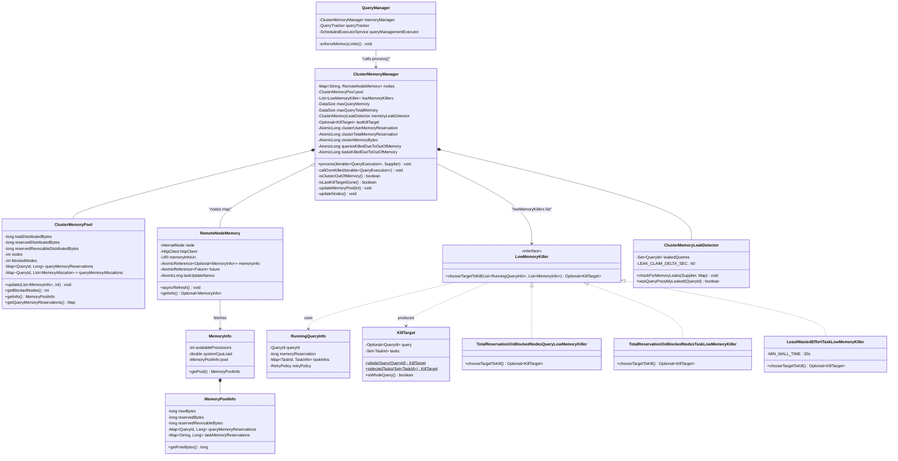
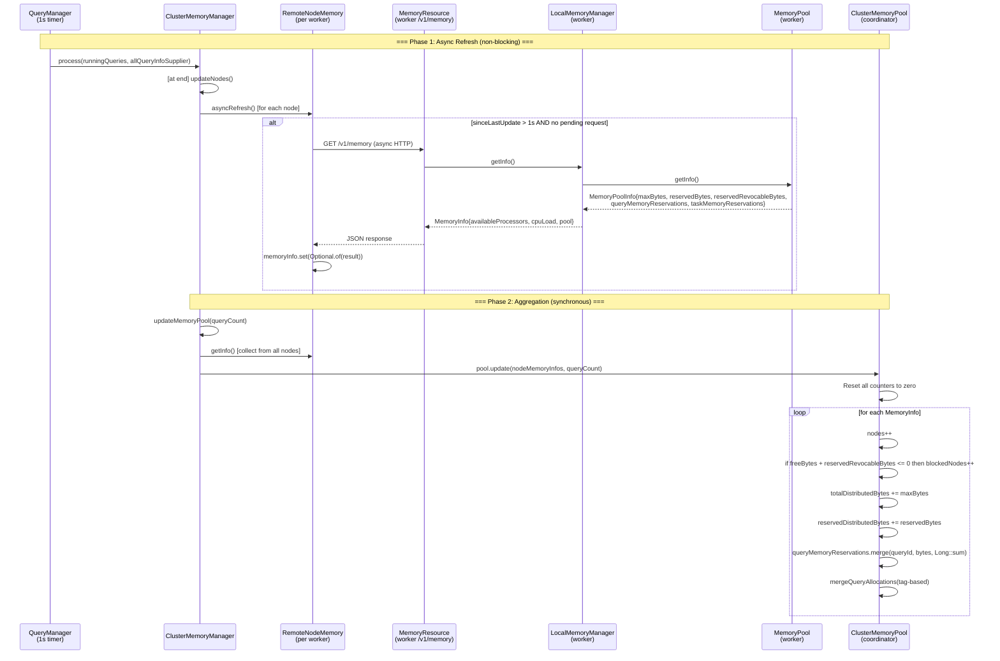
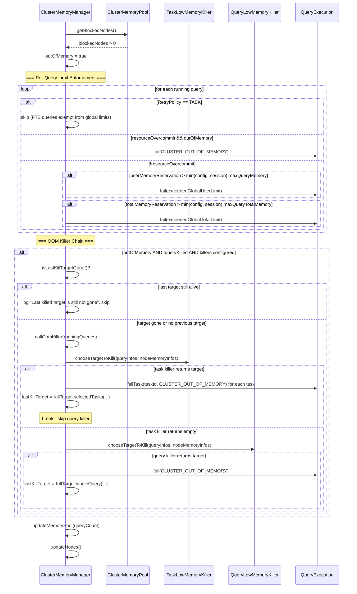

# Module Teardown: Cluster Arbitration and the OOM Killer (Task 5.4.A)

## Table of Contents

- [0. Research Focus](#0-research-focus)
- [1. High-Level Overview](#1-high-level-overview)
- [2. Structural Architecture](#2-structural-architecture)
  - [Primary Source Files](#primary-source-files)
  - [Class Diagram](#class-diagram)
- [3. Execution & Call Flow](#3-execution-call-flow)
  - [3.1 The Periodic Tick: QueryManager -> ClusterMemoryManager.process()](#31-the-periodic-tick-querymanager-clustermemorymanagerprocess)
  - [3.2 Memory Aggregation: How the Coordinator Builds its World View](#32-memory-aggregation-how-the-coordinator-builds-its-world-view)
  - [3.3 Worker-Side MemoryInfo Production](#33-worker-side-memoryinfo-production)
  - [3.4 Blocked-State Detection and the OOM Kill Decision](#34-blocked-state-detection-and-the-oom-kill-decision)
  - [3.5 Victim Selection Algorithms](#35-victim-selection-algorithms)
  - [3.6 Kill Signal Propagation](#36-kill-signal-propagation)
  - [3.7 RemoteNodeMemory: Async HTTP Polling](#37-remotenodememory-async-http-polling)
  - [3.8 Node Lifecycle Management](#38-node-lifecycle-management)
- [4. Concurrency & State Management](#4-concurrency-state-management)
  - [Threading Model](#threading-model)
  - [Synchronization Map](#synchronization-map)
  - [State Machine](#state-machine)
  - [Race Conditions and Eventual Consistency](#race-conditions-and-eventual-consistency)
- [5. Memory & Resource Profile](#5-memory-resource-profile)
  - [Coordinator-Side Overhead](#coordinator-side-overhead)
  - [Network Overhead](#network-overhead)
  - [MemoryPool "Blocked" State Mechanism](#memorypool-blocked-state-mechanism)
- [6. Key Design Insights](#6-key-design-insights)
- [7. Porting Considerations (Java -> Target Architecture)](#7-porting-considerations-java-target-architecture)
  - [Configuration Mapping](#configuration-mapping)
  - [Key Translation Decisions](#key-translation-decisions)
  - [Architectural Recommendation](#architectural-recommendation)


## 0. Research Focus
* **Task ID:** 5.4.A
* **Focus:** How does the coordinator aggregate `MemoryInfo` from all workers? Trace the logic in `ClusterMemoryManager` when a worker reports a "blocked" state. How does the `LowMemoryKiller` select a victim, and how is the "kill" signal propagated back down the Control Plane to the workers?

## 1. High-Level Overview

The coordinator's `ClusterMemoryManager` is the central arbiter of cluster-wide memory pressure in Trino 480. It runs entirely on the coordinator node (enforced by a `checkState(serverConfig.isCoordinator())` guard in its constructor) and operates on a **poll-then-react** model: every second, `QueryManager.enforceMemoryLimits()` gathers all RUNNING queries and calls `ClusterMemoryManager.process()`, which:

1. **Detects memory leaks** via `ClusterMemoryLeakDetector`.
2. **Enforces per-query global limits** (`query.max-memory`, `query.max-total-memory`) by failing queries that exceed them.
3. **Detects cluster OOM** by checking if any worker node is "blocked" (i.e., `freeBytes + reservedRevocableBytes <= 0`).
4. **Invokes the OOM killer chain** if the cluster is out of memory and the last kill target has already died.
5. **Refreshes the cluster-wide memory snapshot** by polling each worker's `GET /v1/memory` REST endpoint via `RemoteNodeMemory.asyncRefresh()`.

The kill signal follows a well-defined propagation chain:
- **Whole-query kill:** `ClusterMemoryManager` -> `QueryExecution.fail(TrinoException)` -> `QueryStateMachine.transitionToFailed()` -> all stages abort -> `RemoteTask.abort()` -> `DELETE /v1/task/{taskId}?abort=true` on each worker.
- **Task-level kill (fault-tolerant mode):** `ClusterMemoryManager` -> `QueryExecution.failTask(taskId, TrinoException)` -> `QueryScheduler.failTask()` -> `SqlStage.failTaskRemotely()` -> `RemoteTask.failRemotely()` -> `POST /v1/task/{taskId}/fail` with `FailTaskRequest` JSON body on the target worker.

The key insight is that the coordinator never directly manipulates worker memory. Instead, it issues state-transition commands (fail/abort) that propagate through the existing task management infrastructure. Workers release memory as a side-effect of task termination, which naturally unblocks the memory pool.

## 2. Structural Architecture

### Primary Source Files

| File | Role |
|------|------|
| `core/trino-main/.../memory/ClusterMemoryManager.java` | Coordinator-side orchestrator: aggregation, limit enforcement, OOM killer dispatch |
| `core/trino-main/.../memory/ClusterMemoryPool.java` | Aggregated cluster-wide memory view (sum of all node pools) |
| `core/trino-main/.../memory/RemoteNodeMemory.java` | Per-node HTTP poller: fetches `MemoryInfo` from worker's `/v1/memory` |
| `core/trino-main/.../memory/MemoryResource.java` | Worker-side REST endpoint: `GET /v1/memory` returning `MemoryInfo` |
| `core/trino-main/.../memory/LocalMemoryManager.java` | Worker-side: produces `MemoryInfo` from local `MemoryPool` state |
| `core/trino-main/.../memory/MemoryPool.java` | Worker-side: actual memory accounting (reservedBytes, freeBytes, per-query/task maps) |
| `core/trino-main/.../memory/MemoryInfo.java` | Data transfer object: `{availableProcessors, systemCpuLoad, MemoryPoolInfo}` |
| `core/trino-spi/.../memory/MemoryPoolInfo.java` | Immutable snapshot: `{maxBytes, reservedBytes, reservedRevocableBytes, queryReservations, taskReservations}` |
| `core/trino-main/.../memory/LowMemoryKiller.java` | Strategy interface: `chooseTargetToKill(queries, nodes) -> Optional<KillTarget>` |
| `core/trino-main/.../memory/TotalReservationOnBlockedNodesQueryLowMemoryKiller.java` | Default query killer: biggest query on blocked nodes |
| `core/trino-main/.../memory/TotalReservationOnBlockedNodesTaskLowMemoryKiller.java` | Default task killer: biggest task on blocked nodes (speculative first) |
| `core/trino-main/.../memory/LeastWastedEffortTaskLowMemoryKiller.java` | Alternative task killer: memory/runtime ratio selection |
| `core/trino-main/.../memory/TotalReservationLowMemoryKiller.java` | Simple query killer: biggest query cluster-wide (ignores node state) |
| `core/trino-main/.../memory/KillTarget.java` | Discriminated union: either `wholeQuery(QueryId)` or `selectedTasks(Set<TaskId>)` |
| `core/trino-main/.../memory/ClusterMemoryLeakDetector.java` | Detects queries with memory reservations that finished 60+ seconds ago |
| `core/trino-main/.../memory/MemoryManagerConfig.java` | Configuration: killer policies, memory limits, fault-tolerant settings |
| `core/trino-main/.../execution/QueryManager.java` | Scheduler: runs `enforceMemoryLimits()` every 1 second |
| `core/trino-main/.../execution/QueryExecution.java` | Interface: `fail(Throwable)`, `failTask(TaskId, Exception)` |
| `core/trino-main/.../execution/SqlQueryExecution.java` | Delegates `fail()` to `QueryStateMachine`, `failTask()` to `QueryScheduler` |
| `core/trino-main/.../server/remotetask/HttpRemoteTask.java` | Sends kill signals over HTTP: `abort()`, `cancel()`, `failRemotely()` |
| `core/trino-main/.../server/TaskResource.java` | Worker-side REST: `POST /v1/task/{taskId}/fail` endpoint |
| `core/trino-main/.../execution/SqlTaskManager.java` | Worker-side: `failTask()` transitions task to FAILED state |

### Class Diagram



## 3. Execution & Call Flow

### 3.1 The Periodic Tick: QueryManager -> ClusterMemoryManager.process()

The entire cluster arbitration system is driven by a single timer in `QueryManager`:

```java
// QueryManager.java line 112
queryManagementExecutor.scheduleWithFixedDelay(() -> {
    try {
        enforceMemoryLimits();
    }
    catch (Throwable e) {
        log.error(e, "Error enforcing memory limits");
    }
    // ... also enforceCpuLimits, enforceScanLimits, enforceWriteLimits
}, 1, 1, TimeUnit.SECONDS);
```

```java
// QueryManager.java line 384
private void enforceMemoryLimits()
{
    List<QueryExecution> runningQueries = queryTracker.getAllQueries().stream()
            .filter(query -> query.getState() == RUNNING)
            .collect(toImmutableList());
    memoryManager.process(runningQueries, this::getQueries);
}
```

This means the entire OOM detection and kill cycle runs **at most once per second**, on a single `queryManagementExecutor` thread. There is no asynchronous event-driven trigger; the coordinator discovers memory pressure by polling.

### 3.2 Memory Aggregation: How the Coordinator Builds its World View



The aggregation happens in `ClusterMemoryPool.update()` (line 121):

```java
// ClusterMemoryPool.java line 121-148
public synchronized void update(List<MemoryInfo> memoryInfos, int assignedQueries)
{
    nodes = 0;
    blockedNodes = 0;
    totalDistributedBytes = 0;
    reservedDistributedBytes = 0;
    reservedRevocableDistributedBytes = 0;
    this.assignedQueries = assignedQueries;
    this.queryMemoryReservations.clear();
    this.queryMemoryAllocations.clear();

    for (MemoryInfo info : memoryInfos) {
        MemoryPoolInfo poolInfo = info.getPool();
        nodes++;
        if (poolInfo.getFreeBytes() + poolInfo.getReservedRevocableBytes() <= 0) {
            blockedNodes++;
        }
        totalDistributedBytes += poolInfo.getMaxBytes();
        reservedDistributedBytes += poolInfo.getReservedBytes();
        reservedRevocableDistributedBytes += poolInfo.getReservedRevocableBytes();
        for (Entry<QueryId, Long> entry : poolInfo.getQueryMemoryReservations().entrySet()) {
            queryMemoryReservations.merge(entry.getKey(), entry.getValue(), Long::sum);
        }
        for (Entry<QueryId, List<MemoryAllocation>> entry : poolInfo.getQueryMemoryAllocations().entrySet()) {
            queryMemoryAllocations.merge(entry.getKey(), entry.getValue(), this::mergeQueryAllocations);
        }
    }
}
```

**Key detail: blocked node detection formula.** A node is considered "blocked" when:
```
freeBytes + reservedRevocableBytes <= 0
```
where `freeBytes = maxBytes - reservedBytes - reservedRevocableBytes`. This simplifies to:
```
maxBytes - reservedBytes <= 0
```
This means a node is blocked when its **non-revocable** reservation alone exhausts the pool. Revocable memory is excluded because it can be forcibly reclaimed via spilling.

### 3.3 Worker-Side MemoryInfo Production

On each worker, the `MemoryResource` REST endpoint is registered at `GET /v1/memory` (internal-only):

```java
// MemoryResource.java
@Path("/v1/memory")
public class MemoryResource {
    @GET
    @Produces(MediaType.APPLICATION_JSON)
    public MemoryInfo getMemoryInfo() {
        return memoryManager.getInfo();
    }
}
```

`LocalMemoryManager.getInfo()` constructs `MemoryInfo` from:
- `AVAILABLE_PROCESSORS`: `Runtime.getRuntime()::availableProcessors` (cached 30s)
- `SYSTEM_CPU_LOAD`: JMX `getCpuLoad()` (cached 5s)
- `memoryPool.getInfo()`: the `MemoryPoolInfo` snapshot containing all per-query and per-task reservations

The `MemoryPool.getInfo()` method (line 79) produces the full per-node memory snapshot including:
- `maxBytes`, `reservedBytes`, `reservedRevocableBytes`
- `queryMemoryReservations`: `Map<QueryId, Long>` (sum of all tasks of that query on this node)
- `queryMemoryAllocations`: `Map<QueryId, List<MemoryAllocation>>` (tagged breakdown per query)
- `taskMemoryReservations`: `Map<String, Long>` (per-task, keyed by `TaskId.toString()`)
- `taskMemoryRevocableReservations`: `Map<String, Long>` (per-task revocable)

### 3.4 Blocked-State Detection and the OOM Kill Decision



The kill decision in `process()` (line 177) has an important ordering:

```java
// ClusterMemoryManager.java line 148 (constructor)
this.lowMemoryKillers = ImmutableList.of(
        taskLowMemoryKiller, // try to kill tasks first
        queryLowMemoryKiller);
```

**Task killers are always tried first.** This is intentional: killing a single task (which can be retried in fault-tolerant mode) is less disruptive than killing an entire query. The `callOomKiller` method iterates through the list and breaks on the first killer that returns a target:

```java
// ClusterMemoryManager.java line 252
for (LowMemoryKiller lowMemoryKiller : lowMemoryKillers) {
    List<MemoryInfo> nodeMemoryInfos = ImmutableList.copyOf(nodeMemoryInfosByNode.values());
    Optional<KillTarget> killTarget = lowMemoryKiller.chooseTargetToKill(runningQueryInfos, nodeMemoryInfos);
    if (killTarget.isPresent()) {
        // ... execute kill ...
        break; // skip other killers
    }
}
```

**Debounce via `lastKillTarget`.** The `isLastKillTargetGone()` check (line 293) prevents the killer from choosing a new victim every second while the previous kill is still being processed. A killed query is "gone" when its `QueryId` no longer appears in `pool.getQueryMemoryReservations()`. A killed task set is "gone" when none of the task IDs appear in any worker's task memory reservations. There is also a special case for leaked queries detected by `ClusterMemoryLeakDetector`: if the last kill target is suspected of being a leak (query finished 60+ seconds ago but still has memory reservations), the debounce is cleared so the killer can make progress.

### 3.5 Victim Selection Algorithms

#### 3.5.1 TotalReservationOnBlockedNodesQueryLowMemoryKiller (Default Query Killer)

**Algorithm:** For each blocked node, sum up each query's memory reservation on that node. Pick the query with the highest total reservation across all blocked nodes.

```java
// TotalReservationOnBlockedNodesQueryLowMemoryKiller.java line 33-64
public Optional<KillTarget> chooseTargetToKill(List<RunningQueryInfo> runningQueries, List<MemoryInfo> nodes)
{
    Map<QueryId, RunningQueryInfo> queriesById = Maps.uniqueIndex(runningQueries, RunningQueryInfo::getQueryId);
    Map<QueryId, Long> memoryReservationOnBlockedNodes = new HashMap<>();
    for (MemoryInfo node : nodes) {
        MemoryPoolInfo memoryPool = node.getPool();
        if (memoryPool == null) {
            continue;
        }
        if (memoryPool.getFreeBytes() + memoryPool.getReservedRevocableBytes() > 0) {
            continue;  // Skip non-blocked nodes
        }
        Map<QueryId, Long> queryMemoryReservations = memoryPool.getQueryMemoryReservations();
        queryMemoryReservations.forEach((queryId, memoryReservation) -> {
            RunningQueryInfo queryMemoryInfo = queriesById.get(queryId);
            if (queryMemoryInfo != null && queryMemoryInfo.getRetryPolicy() == RetryPolicy.TASK) {
                return; // Skip fault-tolerant queries (task killer handles them)
            }
            memoryReservationOnBlockedNodes.compute(queryId,
                (id, oldValue) -> oldValue == null ? memoryReservation : oldValue + memoryReservation);
        });
    }

    return memoryReservationOnBlockedNodes.entrySet().stream()
            .max(comparingLong(Map.Entry::getValue))
            .map(Map.Entry::getKey)
            .map(KillTarget::wholeQuery);
}
```

**Critical filter:** queries with `RetryPolicy.TASK` are excluded from the query killer. They are handled exclusively by the task killers.

#### 3.5.2 TotalReservationOnBlockedNodesTaskLowMemoryKiller (Default Task Killer)

**Algorithm:** For each blocked node, find the biggest task from a fault-tolerant query. Prefer speculative tasks first (they can be killed at no cost since they haven't committed results). Fall back to any task.

```java
// TotalReservationOnBlockedNodesTaskLowMemoryKiller.java line 61-63
findBiggestTask(runningQueriesById, memoryPool, true) // try just speculative
        .or(() -> findBiggestTask(runningQueriesById, memoryPool, false)) // fallback to any task
        .ifPresent(tasksToKillBuilder::add);
```

The selection per blocked node (line 72-93):
```java
private static Optional<TaskId> findBiggestTask(..., boolean onlySpeculative)
{
    Stream<SimpleEntry<TaskId, Long>> stream = memoryPool.getTaskMemoryReservations().entrySet().stream()
            .map(entry -> new SimpleEntry<>(TaskId.valueOf(entry.getKey()), entry.getValue()))
            .filter(entry -> runningQueries.containsKey(entry.getKey().queryId()))
            .filter(entry -> runningQueries.get(entry.getKey().queryId()).getRetryPolicy() == TASK);

    if (onlySpeculative) {
        stream = stream.filter(entry -> {
            TaskInfo taskInfo = runningQueries.get(entry.getKey().queryId()).getTaskInfos().get(entry.getKey());
            if (taskInfo == null) { return false; }
            return taskInfo.taskStatus().speculative();
        });
    }

    return stream
            .max(Map.Entry.comparingByValue())
            .map(SimpleEntry::getKey);
}
```

**Key detail:** This can kill multiple tasks per invocation -- one per blocked node. Each blocked node independently selects its biggest task victim.

#### 3.5.3 LeastWastedEffortTaskLowMemoryKiller (Alternative Task Killer)

**Algorithm:** Same per-blocked-node structure as the default task killer, but instead of picking the biggest task by memory, it picks the task with the highest **memory-to-wall-time ratio** (`memoryUsed / wallTime`). This minimizes wasted compute: a task that has used a lot of memory but hasn't run long is a better kill target than one that has run for hours.

```java
// LeastWastedEffortTaskLowMemoryKiller.java line 100-112
return stream
        .max(comparing(entry -> {
            TaskId taskId = entry.getKey();
            Long memoryUsed = entry.getValue();
            long wallTime = 0;
            if (taskInfos.containsKey(taskId)) {
                TaskStats stats = taskInfos.get(taskId).stats();
                wallTime = stats.totalScheduledTime().toMillis() + stats.totalBlockedTime().toMillis();
            }
            wallTime = Math.max(wallTime, MIN_WALL_TIME); // 30 seconds minimum
            return (double) memoryUsed / wallTime;
        }))
        .map(SimpleEntry::getKey);
```

The `MIN_WALL_TIME = 30 seconds` floor means tasks that have been running less than 30 seconds are all treated equally by wall time (only memory consumption differentiates them). This prevents killing freshly-started tasks that have a spike in memory setup but haven't done meaningful work yet.

#### 3.5.4 TotalReservationLowMemoryKiller (Simple Query Killer)

**Algorithm:** Simply picks the query with the highest total memory reservation cluster-wide, regardless of which nodes are blocked.

```java
// TotalReservationLowMemoryKiller.java
for (RunningQueryInfo query : runningQueries) {
    long bytesUsed = query.getMemoryReservation();
    if (bytesUsed > maxMemory) {
        biggestQuery = Optional.of(query.getQueryId());
        maxMemory = bytesUsed;
    }
}
return biggestQuery.map(KillTarget::wholeQuery);
```

This is a less surgical policy than the blocked-nodes variant, but simpler. It's selected via `query.low-memory-killer.policy=total-reservation`.

### 3.6 Kill Signal Propagation

```mermaid
sequenceDiagram
    participant CMM as ClusterMemoryManager
    participant QE as QueryExecution<br/>(SqlQueryExecution)
    participant QSM as QueryStateMachine
    participant QS as QueryScheduler<br/>(Pipelined or FTE)
    participant SM as StageManager
    participant SS as SqlStage
    participant RT as HttpRemoteTask
    participant TR as TaskResource<br/>(worker /v1/task)
    participant STM as SqlTaskManager<br/>(worker)
    participant ST as SqlTask<br/>(worker)

    Note over CMM,ST: === Path A: Whole-Query Kill ===
    CMM->>QE: fail(new TrinoException(CLUSTER_OUT_OF_MEMORY, ...))
    QE->>QSM: transitionToFailed(throwable)
    QSM->>QSM: failureCause.compareAndSet(null, toFailure(throwable))
    QSM->>QSM: queryState.trySet(FAILED)
    QSM->>QSM: abort transaction if auto-commit
    Note over QSM: State change listeners fire
    Note over QSM: SqlQueryExecution's onFail listener aborts all stages
    QS->>SM: abort()
    SM->>SS: fail(throwable) [for each stage]
    SS->>RT: abort() [for each task in stage]
    RT->>RT: terminating.compareAndSet(false, true)
    RT->>TR: DELETE /v1/task/{taskId}?abort=true (async HTTP)
    TR->>STM: abortTask(taskId) or failTask(taskId)
    STM->>ST: abort()
    ST->>ST: taskStateMachine.abort()
    Note over ST: Task state -> ABORTED
    Note over ST: All memory released during cleanup

    Note over CMM,ST: === Path B: Single-Task Kill (Fault-Tolerant) ===
    CMM->>QE: failTask(taskId, new TrinoException(CLUSTER_OUT_OF_MEMORY, ...))
    QE->>QS: failTask(taskId, reason)
    QS->>SM: failTaskRemotely(taskId, failureCause)
    SM->>SS: failTaskRemotely(taskId, failureCause)
    SS->>RT: failRemotely(failureCause)
    RT->>RT: terminating.compareAndSet(false, true)
    RT->>TR: POST /v1/task/{taskId}/fail (async HTTP)
    Note over RT: Body: FailTaskRequest{failureInfo: ExecutionFailureInfo}
    TR->>STM: failTask(taskId, failure.toException())
    STM->>ST: failed(cause)
    ST->>ST: taskStateMachine.failed(cause)
    Note over ST: Task state -> FAILED
    Note over ST: Memory released; task eligible for retry by scheduler
```

#### Path A: Whole-Query Kill -- Detail

When `ClusterMemoryManager` calls `query.fail(new TrinoException(CLUSTER_OUT_OF_MEMORY, ...))`, this routes to `SqlQueryExecution.fail()` (line 632):

```java
// SqlQueryExecution.java line 632
public void fail(Throwable cause)
{
    requireNonNull(cause, "cause is null");
    stateMachine.transitionToFailed(cause);
}
```

`QueryStateMachine.transitionToFailed()` (line 1321) does the actual state transition:
```java
// QueryStateMachine.java line 1321
private boolean transitionToFailed(Throwable throwable, boolean log)
{
    queryStateTimer.endQuery();
    requireNonNull(throwable, "throwable is null");
    failureCause.compareAndSet(null, toFailure(throwable));
    cleanupQueryQuietly();
    QueryState oldState = queryState.trySet(FAILED);
    if (oldState.isDone()) {
        // already in terminal state, no-op
        return false;
    }
    // ... abort transaction, notify listeners ...
}
```

The state change triggers listeners that cause the `QueryScheduler` to abort all stages. For the pipelined scheduler, `SqlStage.fail()` (line 206) calls `RemoteTask.abort()` on every task:

```java
// SqlStage.java line 206
public synchronized void fail(Throwable throwable)
{
    requireNonNull(throwable, "throwable is null");
    if (stateMachine.transitionToFailed(throwable)) {
        tasks.values().forEach(RemoteTask::abort);
    }
}
```

`HttpRemoteTask.abort()` (line 851) sends a `DELETE /v1/task/{taskId}?abort=true` request to the worker:

```java
// HttpRemoteTask.java line 851
public void abort()
{
    if (!terminating.compareAndSet(false, true)) {
        return;
    }
    synchronized (this) {
        if (!getTaskStatus().state().isTerminatingOrDone()) {
            scheduleAsyncCleanupRequest("abort", true);
        }
    }
}
```

#### Path B: Single-Task Kill -- Detail

For fault-tolerant query task kills, `SqlQueryExecution.failTask()` (line 619) delegates to the scheduler:

```java
// SqlQueryExecution.java line 619
public void failTask(TaskId taskId, Exception reason)
{
    try (SetThreadName _ = new SetThreadName("Query-" + stateMachine.getQueryId())) {
        QueryScheduler scheduler = queryScheduler.get();
        if (scheduler != null) {
            scheduler.failTask(taskId, reason);
        }
    }
}
```

This chains through `StageManager.failTaskRemotely()` -> `SqlStage.failTaskRemotely()` -> `HttpRemoteTask.failRemotely()`:

```java
// HttpRemoteTask.java line 1134
public void failRemotely(Throwable cause)
{
    if (!terminating.compareAndSet(false, true)) {
        return;
    }
    synchronized (this) {
        if (!taskStatus.state().isTerminatingOrDone()) {
            log.debug(cause, "Remote task %s failed with %s", taskStatus.self(), cause);
            scheduleAsyncCleanupRequest("fail", new FailTaskRequest(toFailure(cause)));
        }
    }
}
```

This sends `POST /v1/task/{taskId}/fail` with a JSON body containing `FailTaskRequest{failureInfo: ExecutionFailureInfo}`.

On the worker side, `TaskResource` (line 319) routes the request:
```java
// TaskResource.java line 319
@POST
@Path("{taskId}/fail")
@Consumes(MediaType.APPLICATION_JSON)
@Produces(MediaType.APPLICATION_JSON)
public TaskInfo failTask(
        @PathParam("taskId") TaskId taskId,
        FailTaskRequest failTaskRequest)
{
    requireNonNull(taskId, "taskId is null");
    requireNonNull(failTaskRequest, "failTaskRequest is null");
    return taskManager.failTask(taskId, failTaskRequest.getFailureInfo().toException());
}
```

`SqlTaskManager.failTask()` (line 635) transitions the task to FAILED:
```java
// SqlTaskManager.java line 635
public TaskInfo failTask(TaskId taskId, Throwable failure)
{
    requireNonNull(taskId, "taskId is null");
    requireNonNull(failure, "failure is null");
    return tasks.getUnchecked(taskId).failed(failure);
}
```

**Key difference between abort and fail:** `abort()` uses `DELETE` (task is irrecoverable). `failRemotely()` uses `POST .../fail` (task can be retried in fault-tolerant mode). Both result in memory release, but the fault-tolerant scheduler will re-schedule a replacement task for a `FAILED` task.

### 3.7 RemoteNodeMemory: Async HTTP Polling

`RemoteNodeMemory.asyncRefresh()` (line 78) is the mechanism by which the coordinator learns about worker memory state:

```java
// RemoteNodeMemory.java line 78-118
public void asyncRefresh()
{
    Duration sinceUpdate = nanosSince(lastUpdateNanos.get());
    if (nanosSince(lastWarningLogged.get()).toMillis() > 1_000 &&
            sinceUpdate.toMillis() > 10_000 &&
            future.get() != null) {
        log.warn("Memory info update request to %s has not returned in %s", memoryInfoUri, sinceUpdate);
        lastWarningLogged.set(System.nanoTime());
    }
    if (sinceUpdate.toMillis() > 1_000 && future.get() == null) {
        Request request = prepareGet()
                .setUri(memoryInfoUri)
                .build();
        HttpResponseFuture<JsonResponse<MemoryInfo>> responseFuture =
                httpClient.executeAsync(request, createFullJsonResponseHandler(memoryInfoCodec));
        future.compareAndSet(null, responseFuture);

        Futures.addCallback(responseFuture, new FutureCallback<>() {
            @Override
            public void onSuccess(JsonResponse<MemoryInfo> result) {
                lastUpdateNanos.set(System.nanoTime());
                future.compareAndSet(responseFuture, null);
                if (result.hasValue()) {
                    memoryInfo.set(Optional.ofNullable(result.getValue()));
                }
            }
            @Override
            public void onFailure(Throwable t) {
                log.warn("Error fetching memory info from %s: %s", memoryInfoUri, t.getMessage());
                lastUpdateNanos.set(System.nanoTime());
                future.compareAndSet(responseFuture, null);
            }
        }, directExecutor());
    }
}
```

**Polling characteristics:**
- Minimum interval: 1 second (won't send a new request if less than 1s since last update)
- Maximum one outstanding request per node (the `future.compareAndSet(null, responseFuture)` pattern)
- On failure: logs a warning but keeps the stale `MemoryInfo` from the last successful fetch
- Staleness warning: if a request hasn't returned in 10 seconds, logs a warning every 1 second
- HTTP timeout: 10 seconds (configured in `CoordinatorModule` via `config.setRequestTimeout(new Duration(10, SECONDS))`)

### 3.8 Node Lifecycle Management

`updateNodes()` (line 428) maintains the `nodes` map:

```java
// ClusterMemoryManager.java line 428
private synchronized void updateNodes()
{
    ImmutableSet.Builder<InternalNode> builder = ImmutableSet.builder();
    Set<InternalNode> aliveNodes = builder
            .addAll(nodeManager.getNodes(ACTIVE))
            .addAll(nodeManager.getNodes(SHUTTING_DOWN))
            .addAll(nodeManager.getNodes(DRAINING))
            .addAll(nodeManager.getNodes(DRAINED))
            .build();

    Set<String> aliveNodeIds = aliveNodes.stream()
            .map(InternalNode::getNodeIdentifier)
            .collect(toImmutableSet());

    // Remove dead nodes
    Set<String> deadNodes = ImmutableSet.copyOf(difference(nodes.keySet(), aliveNodeIds));
    nodes.keySet().removeAll(deadNodes);

    // Add new nodes
    for (InternalNode node : aliveNodes) {
        if (!nodes.containsKey(node.getNodeIdentifier())) {
            nodes.put(node.getNodeIdentifier(), new RemoteNodeMemory(node, httpClient, memoryInfoCodec,
                    locationFactory.createMemoryInfoLocation(node)));
        }
    }

    // Schedule refresh for all alive nodes
    for (RemoteNodeMemory node : nodes.values()) {
        node.asyncRefresh();
    }
}
```

Nodes in SHUTTING_DOWN, DRAINING, and DRAINED states are still polled for memory info. This is important because those nodes may still have running tasks consuming memory. The coordinator needs their memory state for accurate cluster-wide accounting.

## 4. Concurrency & State Management

### Threading Model

`ClusterMemoryManager` has a simple threading model:
- **All public methods are `synchronized`** on the `ClusterMemoryManager` instance (`process()`, `updateNodes()`, `updateMemoryPool()`, `callOomKiller()`, `getWorkersMemoryInfo()`, `getAllNodesMemoryInfo()`).
- The `process()` method is called from `QueryManager`'s `queryManagementExecutor` thread (single-threaded scheduled executor).
- `RemoteNodeMemory` HTTP callbacks fire on the HTTP client's IO threads but only update `AtomicReference<Optional<MemoryInfo>>`, which is lock-free.
- Change listeners are dispatched asynchronously via `listenerExecutor` (a single daemon thread).

### Synchronization Map

| Object | Lock | Contention Profile |
|--------|------|-------------------|
| `ClusterMemoryManager` | `synchronized(this)` | Low: single caller (1s timer) |
| `ClusterMemoryPool` | `synchronized(this)` | Low: only called from CMM under CMM's lock |
| `RemoteNodeMemory.memoryInfo` | `AtomicReference` | Low: one writer (HTTP callback), one reader (CMM) |
| `RemoteNodeMemory.future` | `AtomicReference` | Low: CAS pattern prevents concurrent requests |
| `ClusterMemoryLeakDetector.leakedQueries` | `synchronized(this)` | Low: read/write under CMM's lock |

### State Machine

`ClusterMemoryManager` does not have a formal state machine, but there is an implicit lifecycle for kill targets:

```
NO_TARGET -> TARGET_CHOSEN -> TARGET_GONE -> NO_TARGET
```

The `lastKillTarget` field tracks this:
- `Optional.empty()`: no kill in progress, free to choose a new victim
- `Optional.of(KillTarget)`: a kill was issued, waiting for it to take effect
- Transition back to empty: `isLastKillTargetGone()` returns true when the victim's memory reservations disappear from the cluster pool

This debounce prevents kill storms where the coordinator repeatedly kills queries every second because the memory release from the previous kill hasn't propagated yet.

### Race Conditions and Eventual Consistency

The entire system operates on **eventually consistent** snapshots. Between the time a worker's MemoryInfo is fetched and the coordinator processes it:
- A task might have finished and released memory
- A new query might have started consuming memory
- A previous kill might have taken effect

This is by design. The coordinator makes decisions based on the best available information and relies on the next 1-second tick to correct any mistakes. The debounce mechanism (`lastKillTarget`) prevents over-killing, and the 1-second polling interval bounds the staleness.

## 5. Memory & Resource Profile

### Coordinator-Side Overhead

| Component | Size | Per-Node or Per-Query |
|-----------|------|----------------------|
| `RemoteNodeMemory` | ~200 bytes + `MemoryInfo` JSON | Per node |
| `MemoryInfo` (cached) | ~1KB (with query/task maps) | Per node |
| `ClusterMemoryPool.queryMemoryReservations` | ~64 bytes per entry | Per active query |
| `ClusterMemoryPool.queryMemoryAllocations` | Variable (tag list per query) | Per active query |
| `RunningQueryInfo` (transient) | ~200 bytes + `Map<TaskId, TaskInfo>` | Per running query per tick |

For a cluster with 100 nodes and 500 active queries, the coordinator overhead for memory management is:
- 100 `RemoteNodeMemory` objects: ~100KB
- 500 `queryMemoryReservations` entries: ~32KB
- 500 `RunningQueryInfo` snapshots (transient per tick): ~100KB + TaskInfo maps
- Total: well under 1MB

### Network Overhead

Each `GET /v1/memory` request/response is typically 1-10KB of JSON (depends on number of active queries/tasks on that node). With 100 nodes polled every ~1 second, that's 100-1000KB/s of memory management HTTP traffic.

The `POST /v1/task/{taskId}/fail` requests are tiny (~200 bytes of JSON body) and only sent when a kill is executed.

### MemoryPool "Blocked" State Mechanism

On the worker side, when `MemoryPool.reserve()` is called and `getFreeBytes() <= 0`:

```java
// MemoryPool.java line 135-141
if (getFreeBytes() <= 0) {
    if (future == null) {
        future = NonCancellableMemoryFuture.create();
    }
    checkState(!future.isDone(), "future is already completed");
    result = future;
}
```

All callers that attempt to reserve memory when the pool is full get the **same shared future**. When memory is freed and `getFreeBytes() > 0`, the future is completed:

```java
// MemoryPool.java line 256-259 (in free())
if (getFreeBytes() > 0 && future != null) {
    future.set(null);
    future = null;
}
```

This unblocks all waiting operators simultaneously. The future is `NonCancellableMemoryFuture` to prevent operators from canceling the shared future (which would affect all waiters).

## 6. Key Design Insights

* **Task killers before query killers -- damage minimization.** The `lowMemoryKillers` list is ordered `[taskKiller, queryKiller]`. Task kills in fault-tolerant mode are cheap (the task is simply retried), while query kills abort all work. By trying task kills first, the system can often free enough memory without user-visible query failures. The `break` after any successful kill prevents both killers from acting simultaneously.

* **"Blocked" is defined as non-revocable exhaustion only.** The `freeBytes + reservedRevocableBytes <= 0` formula means a node is blocked when non-revocable memory alone fills the pool. This is correct because revocable memory can be reclaimed via spilling without killing anything -- the memory revocation system handles that. The OOM killer is a last resort for when even after potential revocation, there's still no room.

* **Kill debounce prevents cascading kills.** The `lastKillTarget` + `isLastKillTargetGone()` pattern ensures only one kill is in flight at a time. Without this, the coordinator would kill a new query every second because the memory from the previous kill takes time to propagate back through the polling cycle (RemoteNodeMemory -> ClusterMemoryPool -> blockedNodes). The leak detector integration (`wasQueryPossiblyLeaked`) prevents permanent deadlock if the kill victim's memory is leaked.

* **Fault-tolerant queries are exempt from global per-query limits.** The `if (getRetryPolicy(query.getSession()) == RetryPolicy.TASK) { continue; }` skip in `process()` means fault-tolerant queries can use arbitrarily large memory across the cluster. Their memory pressure is managed solely through task-level kills and retries, not through hard limits. This design acknowledges that fault-tolerant queries are expected to be large and long-running.

* **Speculative tasks are preferred kill victims.** Both `TotalReservationOnBlockedNodesTaskLowMemoryKiller` and `LeastWastedEffortTaskLowMemoryKiller` first try `findBiggestTask(..., onlySpeculative=true)` before falling back to any task. Speculative tasks (started proactively by the fault-tolerant scheduler) haven't committed results and can be killed with zero cost to query progress.

* **The coordinator never directly manipulates worker memory.** All memory release happens as a side-effect of task state transitions. The coordinator sends `fail`/`abort` signals; the worker's task cleanup code releases memory from the `MemoryPool`. This clean separation means the memory management layer doesn't need special "force free" APIs -- it relies on the existing task lifecycle.

## 7. Porting Considerations (Java -> Target Architecture)

### Configuration Mapping

| Java Config | Default | Rust Consideration |
|-------------|---------|-------------------|
| `query.max-memory` | 20 GB | Static config, trivial |
| `query.max-total-memory` | 2x `query.max-memory` | Lazy default based on other config |
| `query.low-memory-killer.policy` | `total-reservation-on-blocked-nodes` | Enum -> trait object dispatch |
| `task.low-memory-killer.policy` | `total-reservation-on-blocked-nodes` | Enum -> trait object dispatch |
| `query.max-memory-per-node` | 30% heap | Requires runtime heap detection |
| `memory.heap-headroom-per-node` | 30% heap | Same |

### Key Translation Decisions

* **`RemoteNodeMemory` HTTP polling -> async tasks.** Replace with `tokio::spawn` per node that polls the worker memory endpoint. Use `tokio::sync::watch::Sender<Option<MemoryInfo>>` to publish updates that the main loop can consume without blocking. The 1-second minimum interval maps to `tokio::time::sleep(Duration::from_secs(1))`.

* **`ClusterMemoryPool.update()` (full reset every tick) -> incremental or snapshot-based.** The Java code clears and rebuilds the entire cluster pool every second. For Rust, consider keeping the same approach (it's cheap) but using `Arc<MemoryPoolSnapshot>` with atomic swap for lock-free reads by monitoring threads.

* **`LowMemoryKiller` trait:**
  ```rust
  trait LowMemoryKiller: Send + Sync {
      fn choose_target(
          &self,
          running_queries: &[RunningQueryInfo],
          nodes: &[MemoryInfo],
      ) -> Option<KillTarget>;
  }
  ```

* **Kill debounce (`lastKillTarget`) -> `Option<KillTarget>` with explicit check.** The same pattern works in Rust. Use `Option<KillTarget>` protected by the same lock as the main processing loop.

* **Kill signal propagation -> gRPC or HTTP.** The Java version uses REST (`POST /v1/task/{taskId}/fail`). In Rust, this maps to either a gRPC call or HTTP endpoint on the worker. The key requirement is **async fire-and-forget with retry**: `HttpRemoteTask` retries with exponential backoff on failure.

* **`NonCancellableMemoryFuture` -> `tokio::sync::Notify` or `tokio::sync::watch`.** The shared-future pattern in `MemoryPool` (all blocked callers share one future that is completed when memory frees) maps well to a `Notify` that is signaled when `free_bytes > 0`. Unlike the Java version which uses a single shared future, Rust's `Notify` supports multiple waiters natively.

* **Synchronized methods -> `tokio::sync::Mutex` or `std::sync::Mutex`.** Since the `process()` method does HTTP-related work (through `RemoteNodeMemory`), consider `tokio::sync::Mutex` if the method becomes async. However, the Java version uses synchronous IO with async callbacks, so a standard `Mutex` with the async HTTP polling running in separate tasks may be cleaner.

* **`ClusterMemoryLeakDetector` -> same timeout-based approach.** The 60-second leak detection delay is a simple timestamp check. In Rust, `Instant::elapsed() > Duration::from_secs(60)`.

### Architectural Recommendation

The Java system's 1-second polling model is pragmatic but introduces latency between memory pressure and kill response. For a Rust implementation, consider a hybrid model:
1. Keep the 1-second polling for memory snapshot aggregation (it provides the global view).
2. Add a push-based "memory critical" signal from workers (e.g., when `freeBytes` first drops below 0, immediately notify the coordinator). This would allow faster OOM response without increasing baseline polling overhead.
