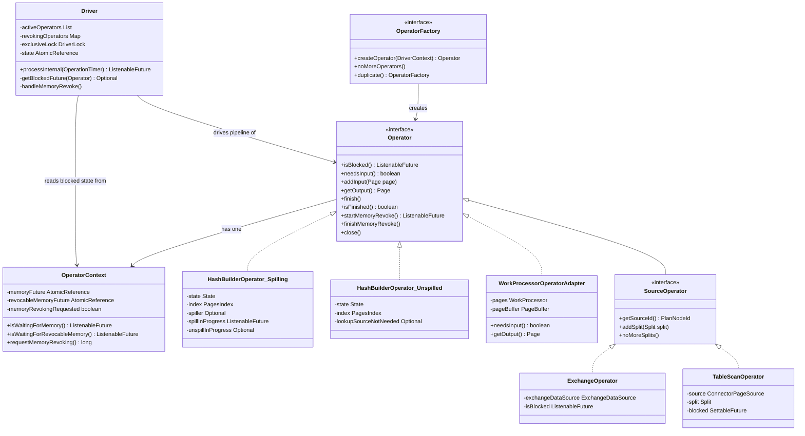
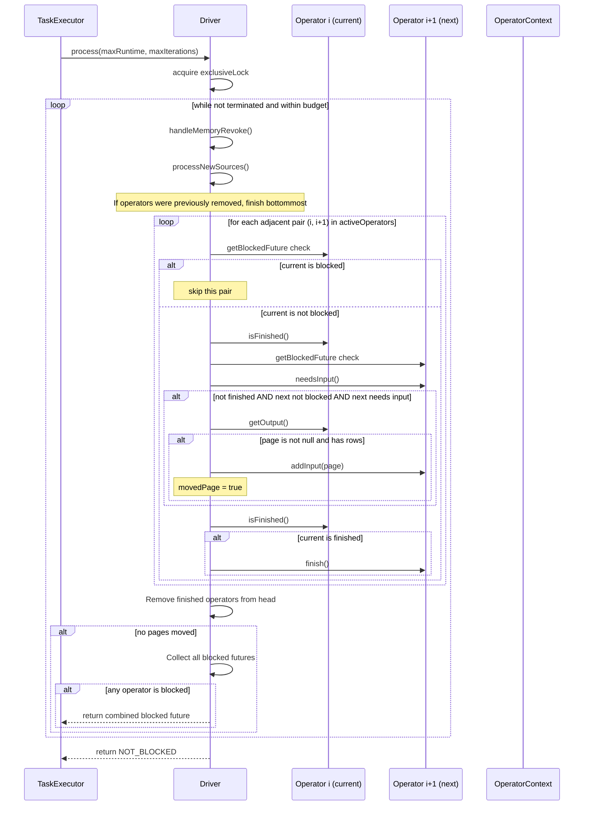
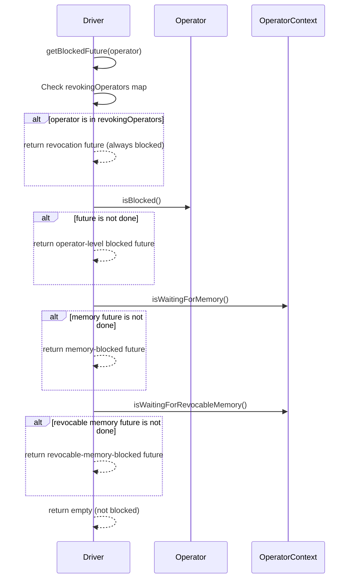

# Module Teardown: The Operator State Machine -- Non-Blocking Volcano Model (Task 3.1.A)

## Table of Contents

- [0. Research Focus](#0-research-focus)
- [1. High-Level Overview](#1-high-level-overview)
- [2. Structural Architecture](#2-structural-architecture)
  - [Class Diagram](#class-diagram)
- [3. Execution & Call Flow](#3-execution-call-flow)
  - [Sequence Diagram -- Driver.processInternal() Core Loop](#sequence-diagram-driverprocessinternal-core-loop)
  - [Sequence Diagram -- getBlockedFuture() Three-Level Check](#sequence-diagram-getblockedfuture-three-level-check)
- [4. Concurrency & State Management](#4-concurrency-state-management)
- [5. Memory & Resource Profile](#5-memory-resource-profile)
- [6. Key Design Insights](#6-key-design-insights)
- [7. Porting Considerations (Java to Rust)](#7-porting-considerations-java-to-rust)


## 0. Research Focus
* **Task ID:** 3.1.A
* **Focus:** Analyze the non-blocking Volcano model. Trace the exact sequence of `needsInput()`, `addInput()`, `getOutput()`, `isFinished()`, and `isBlocked()`. How does an Operator tell the Driver "I need more data" vs. "I need to wait for memory"?

## 1. High-Level Overview
* **Core Responsibility:** The Operator interface defines Trino's non-blocking Volcano execution model, where data flows through a pipeline of operators as Page objects. Unlike the traditional blocking Volcano model (where `next()` blocks until data is available), Trino's operators never block -- they report their blocking state via `ListenableFuture` objects, allowing the Driver to yield the thread and schedule other work. The Driver orchestrates the pipeline by polling each operator's state every iteration and moving pages from producers to consumers.
* **Key Triggers:** The Driver's `processInternal()` method is the central pump. It is invoked repeatedly by task executor threads (via `process()`). Each invocation walks the operator chain from source to sink, checking readiness and transferring pages. External events that change operator state include: split assignments arriving, memory becoming available, remote exchange data arriving, memory revocation requests, and the `finish()` signal propagating downstream when a source is exhausted.

## 2. Structural Architecture
* **Primary Source Files:**

| File | Lines | Role |
|------|-------|------|
| `core/.../operator/Operator.java` | 102 | Core interface: 7 methods defining the non-blocking contract |
| `core/.../operator/Driver.java` | 866 | Pipeline orchestrator: calls operator methods in the correct sequence |
| `core/.../operator/OperatorContext.java` | 788 | Per-operator stats, memory tracking, and memory-blocked futures |
| `core/.../operator/WorkProcessorOperatorAdapter.java` | 187 | Bridge from WorkProcessor pull-model to Operator push-model |
| `core/.../operator/join/spilling/HashBuilderOperator.java` | 710 | Complex stateful operator with 7-state machine and spill support |

* **Key Data Structures:**

**Operator Interface Methods:**

| Method | Return Type | Purpose |
|--------|-------------|---------|
| `isBlocked()` | `ListenableFuture of Void` | Returns NOT_BLOCKED if ready, or an incomplete future if waiting on I/O, memory, etc. |
| `needsInput()` | `boolean` | True if operator can accept an input page right now |
| `addInput(Page)` | `void` | Push a page into the operator (only call when needsInput is true) |
| `getOutput()` | `Page` (nullable) | Pull an output page from the operator (null means nothing ready yet) |
| `finish()` | `void` | Signal no more input will arrive -- flush any buffered results |
| `isFinished()` | `boolean` | True when operator has produced all output and is done |
| `startMemoryRevoke()` | `ListenableFuture of Void` | Begin revoking revocable memory (spill to disk) |
| `finishMemoryRevoke()` | `void` | Complete the revocation after the future is done |

**Driver State Enum:**

| State | Meaning |
|-------|---------|
| `ALIVE` | Normal processing |
| `NEED_DESTRUCTION` | Marked for cleanup (task done or cancelled) |
| `DESTROYING` | Currently closing operators |
| `DESTROYED` | Fully cleaned up |

**Driver Key Fields:**

| Field | Type | Purpose |
|-------|------|---------|
| `activeOperators` | `List of Operator` | Operators still processing; finished ones are removed from head |
| `revokingOperators` | `Map of Operator to Future` | Tracks operators currently doing memory revocation |
| `exclusiveLock` | `DriverLock` | Ensures only one thread at a time runs processInternal |
| `driverBlockedFuture` | `AtomicReference of SettableFuture` | Signaled when any operator unblocks or memory revocation is requested |
| `pendingSplitAssignmentUpdates` | `AtomicReference` | Staging area for new splits arriving asynchronously |

### Class Diagram



## 3. Execution & Call Flow

### Sequence Diagram -- Driver.processInternal() Core Loop



### Sequence Diagram -- getBlockedFuture() Three-Level Check



* **Step-by-step text breakdown of processInternal():**

1. **handleMemoryRevoke()**: Iterates all active operators. For any operator with `isMemoryRevokingRequested()` true, calls `startMemoryRevoke()` and tracks the returned future in `revokingOperators`. For operators already in that map, checks if the revocation future is done, and if so calls `finishMemoryRevoke()` and removes from the map.

2. **processNewSources()**: Drains `pendingSplitAssignmentUpdates` (an AtomicReference staging area). Computes new splits as the set difference against current assignments. Calls `sourceOperator.addSplit()` for each new split and `sourceOperator.noMoreSplits()` if appropriate.

3. **Finish propagation for partially-removed pipelines**: If `activeOperators.size() != allOperators.size()`, it means some operators were already removed. Calls `finish()` on the new bottommost operator (index 0) to continue the finish signal. This handles operators like HashBuilderOperator and LookupJoinOperator that require `finish()` to be called repeatedly.

4. **The page-moving loop** (core data flow): For each pair `(current, next)` in activeOperators:
   - **Skip if current is blocked**: Calls `getBlockedFuture(current)`. If present, skip this pair entirely.
   - **Check readiness**: If `!current.isFinished()` AND `getBlockedFuture(next).isEmpty()` AND `next.needsInput()`:
     - Call `current.getOutput()` to pull a page.
     - If page is non-null and non-empty, call `next.addInput(page)`. Set `movedPage = true`.
   - **Propagate finish**: If `current.isFinished()`, call `next.finish()`.

5. **Remove finished operators**: Scans activeOperators from the end (sink) toward the source. When a finished operator is found, all operators from index 0 through that index are closed and removed from activeOperators. If operators remain, `finish()` is called on the new head operator.

6. **Check for blocking** (only if no pages were moved): Collects all blocked futures from all active operators (using `getBlockedFuture()`). Also adds each operator's `finishedFuture` (if present) to allow operators to signal the driver when they finish asynchronously. Combines all futures with `firstFinishedFuture()` (unblocks when ANY one completes). Returns this combined future so the task executor knows when to re-schedule.

## 4. Concurrency & State Management

* **Threading Model:** A Driver is designed for single-threaded execution via `exclusiveLock` (a non-reentrant `ReentrantLock`). Task executor threads compete for the lock with a 100ms timeout. Only the lock holder may call `processInternal()`. State changes (like new split assignments) are "staged" atomically and drained under the lock. The comment at the top of Driver.java describes this strategy: "stage a change and only process the actual change before lock release."

* **State Machine -- Operator-level contract:**

The Operator interface itself does not define explicit states, but the contract implies a state machine. The Driver enforces it through call ordering:

```
                    +----------------------------------+
                    |                                  |
                    v                                  |
    +--------+   split/data   +------------+   finish()  +-----------+
    | CREATED |  ---------->  | PROCESSING |  -------->  | FINISHING |
    +--------+                +------------+             +-----------+
                                |      ^                      |
                                |      |                      |
                           blocked  unblocked            isFinished()
                                |      |                      |
                                v      |                      v
                              +----------+              +----------+
                              | BLOCKED  |              | FINISHED |
                              +----------+              +----------+
                                                              |
                                                              v
                                                        +--------+
                                                        | CLOSED |
                                                        +--------+
```

The key transitions are:
- **CREATED to PROCESSING**: Operator created by factory, added to driver pipeline
- **PROCESSING to BLOCKED**: `isBlocked()` returns an incomplete future, OR `OperatorContext.isWaitingForMemory()` returns an incomplete future, OR operator is in the `revokingOperators` map
- **BLOCKED to PROCESSING**: The blocking future completes (data arrives, memory freed, revocation done)
- **PROCESSING to FINISHING**: Upstream operator calls `finish()` to signal no more input
- **FINISHING to FINISHED**: `isFinished()` returns true
- **FINISHED to CLOSED**: Driver calls `close()` and then `operatorContext.destroy()`

* **State Machine -- HashBuilderOperator (spilling variant, 7 states):**

This is the most complex operator state machine in Trino. It demonstrates the full lifecycle including memory revocation and spill/unspill:

```
    CONSUMING_INPUT
        |                \
        | finish()        \ startMemoryRevoke()
        v                  v
    LOOKUP_SOURCE_BUILT    SPILLING_INPUT
        |        \              |
        | dispose \startMR     | finish()
        v          v           v
      CLOSED   INPUT_SPILLED <-+
                    |
                    | unspill requested
                    v
               INPUT_UNSPILLING
                    |
                    | unspill done + build
                    v
               INPUT_UNSPILLED_AND_BUILT
                    |
                    | dispose requested
                    v
                  CLOSED
```

State descriptions:
- **CONSUMING_INPUT**: Accepts pages via `addInput()`, stores in PagesIndex. `needsInput()` returns true.
- **SPILLING_INPUT**: Memory was revoked. Still accepts pages but spills them directly. `needsInput()` returns true only when `spillInProgress.isDone()`.
- **LOOKUP_SOURCE_BUILT**: Input finished without spill. Hash table built and lent to probe side. `isBlocked()` returns `lookupSourceNotNeeded` future -- blocks until probe side is done.
- **INPUT_SPILLED**: Input finished after spill. Blocked on `spilledLookupSourceHandle.getUnspillingOrDisposeRequested()` -- waits for probe side to request the hash table.
- **INPUT_UNSPILLING**: Pages are being read back from disk. Blocked on `unspillInProgress` future.
- **INPUT_UNSPILLED_AND_BUILT**: Hash table rebuilt from unspilled data. Blocked on `spilledLookupSourceHandle.getDisposeRequested()`.
- **CLOSED**: Resources freed.

* **Synchronization Mechanisms:**

| Mechanism | Where | Purpose |
|-----------|-------|---------|
| `DriverLock` (ReentrantLock) | Driver.exclusiveLock | Ensures single-threaded operator access |
| `AtomicReference` staging | `pendingSplitAssignmentUpdates` | Lock-free staging of split updates from scheduler threads |
| `SettableFuture` | `driverBlockedFuture` | Communicates blocked/unblocked state to task executor |
| `AtomicReference of SettableFuture` | `OperatorContext.memoryFuture` | Tracks memory-blocked state per operator |
| `synchronized` blocks | `OperatorContext.isMemoryRevokingRequested()` | Thread-safe revocation flag |
| Memory revocation listener | `Driver.initialize()` | Wakes up blocked driver when memory revocation is requested |

## 5. Memory & Resource Profile

* **Allocation Pattern:** Operators allocate memory through `OperatorContext`, which wraps a `MemoryTrackingContext` with two pools:
  - **User memory**: Non-revocable. When exhausted, the memory pool returns an incomplete future from `setBytes()`, which propagates up through `OperatorContext.isWaitingForMemory()`. The Driver sees this in `getBlockedFuture()` and blocks the pipeline.
  - **Revocable memory**: Can be spilled. When memory pressure hits, `OperatorContext.requestMemoryRevoking()` is called externally, setting `memoryRevokingRequested = true` and firing the listener, which unblocks the driver via `driverBlockedFuture`. On the next `processInternal()` iteration, `handleMemoryRevoke()` calls `startMemoryRevoke()` on the operator.

* **Memory Tracking:** The `InternalLocalMemoryContext` wrapper (inner class of OperatorContext, line 670) intercepts every `setBytes()` / `addBytes()` call. When the underlying pool returns an incomplete future (meaning allocation was denied/queued), `updateMemoryFuture()` stores this future so the Driver can observe it. The `trySetBytes()` method is used for optimistic allocation -- if it returns false, the caller compacts data and retries with `setBytes()` (see HashBuilderOperator.updateIndex()).

* **Three Sources of Blocking** (checked in `Driver.getBlockedFuture()`, lines 602-622):
  1. **Memory revocation in progress**: If operator is in `revokingOperators` map, it is blocked regardless of the revocation future's state (because `finishMemoryRevoke()` has not been called yet).
  2. **Operator-intrinsic blocking**: `operator.isBlocked()` -- e.g., ExchangeOperator waiting for network data, HashBuilderOperator waiting for probe side to finish with lookup source.
  3. **Memory pressure**: `operatorContext.isWaitingForMemory()` or `operatorContext.isWaitingForRevocableMemory()` -- the operator's last memory allocation request was denied.

## 6. Key Design Insights

1. **The non-blocking contract is cooperative, not enforced.** The Operator interface has no runtime enforcement that `needsInput()` is checked before `addInput()` or that `getOutput()` does not block. The contract is documented in Javadoc and enforced by the Driver's call ordering. An operator that blocks in `getOutput()` would freeze the entire pipeline's thread. This is a key difference from Rust's async model where the compiler enforces non-blocking via `Future`/`Poll`. (Evidence: Operator.java lines 39-53, no runtime checks.)

2. **`getBlockedFuture()` creates a three-layer blocking hierarchy.** The Driver checks for blocking in a strict priority order: (1) memory revocation in progress, (2) operator-level `isBlocked()`, (3) memory pool exhaustion. This is significant because an operator currently revoking memory is ALWAYS considered blocked, even if the revocation future is done -- the Driver must call `finishMemoryRevoke()` first. (Evidence: Driver.java lines 602-622.)

3. **`finish()` must be idempotent and is called repeatedly.** The Driver calls `finish()` on the bottommost operator every iteration when operators have been removed from the pipeline (Driver.java lines 383-388). The TODO comment explicitly notes: "Some operators (LookupJoinOperator and HashBuildOperator) are broken and requires finish to be called continuously." The spilling HashBuilderOperator uses `finish()` as a state-machine driver: each call to `finish()` dispatches based on current state and may advance the state (e.g., from CONSUMING_INPUT to LOOKUP_SOURCE_BUILT, from INPUT_SPILLED to INPUT_UNSPILLING). (Evidence: spilling/HashBuilderOperator.java lines 442-490.)

4. **Source operators (TableScan, Exchange) never accept input -- they generate data.** Both `needsInput()` returns `false` and `addInput()` throws `UnsupportedOperationException`. Their `getOutput()` pulls from an external source (ConnectorPageSource, ExchangeDataSource). Their `isBlocked()` delegates to the underlying source -- TableScanOperator blocks on a SettableFuture until a split is assigned (line 244), then delegates to `source.isBlocked()`. ExchangeOperator delegates to `exchangeDataSource.isBlocked()`. (Evidence: ExchangeOperator.java lines 237-244, TableScanOperator.java lines 260-268.)

5. **The WorkProcessorOperatorAdapter bridges two execution models.** The `WorkProcessorOperator` (used by FilterAndProjectOperator, LookupJoinOperator) operates in a pull-based model via `WorkProcessor of Page`. The adapter converts this to the push-based Operator contract using a `PageBuffer` as the bridge. `needsInput()` returns true when the WorkProcessor is neither blocked nor finished AND the PageBuffer is empty. `addInput()` puts a page into the buffer. `getOutput()` calls `pages.process()` which may pull from the buffer. This pattern means the Driver sees a standard Operator but inside, the computation is structured as a lazy stream. (Evidence: WorkProcessorOperatorAdapter.java lines 136-139, PageBuffer.java lines 36-49.)

6. **The Driver removes finished operators eagerly from the head of the pipeline.** When scanning for finished operators, the Driver works backward from the sink. When it finds a finished operator at index `i`, it closes and removes ALL operators from 0 to i inclusive. It then calls `finish()` on the new head. This is because once an operator is finished, all its upstream sources are necessarily exhausted. This eager removal shortens the processing loop and frees resources early. (Evidence: Driver.java lines 426-444.)

7. **Memory revocation uses a listener pattern to wake a blocked Driver.** In `Driver.initialize()`, every operator's context gets a memory revocation listener that calls `driverBlockedFuture.get().set(null)`. When the memory manager requests revocation, `OperatorContext.requestMemoryRevoking()` fires this listener. If the Driver was blocked waiting on a combined future (e.g., waiting for exchange data), the `driverBlockedFuture` completion causes the task executor to re-schedule the Driver. On the next `processInternal()` call, `handleMemoryRevoke()` processes the revocation. (Evidence: Driver.java lines 153-156, OperatorContext.java lines 427-442.)

8. **The ExchangeOperator caches its blocked future for efficiency.** Instead of asking `exchangeDataSource.isBlocked()` every time (which may register a new callback), it caches the future in a field and only refreshes it when the previous one is done. (Evidence: ExchangeOperator.java lines 222-233.)

## 7. Porting Considerations (Java to Rust)

* **Translation Blockers:**
  - **ListenableFuture everywhere**: The entire non-blocking model is built on Guava's `ListenableFuture` with synchronous listener callbacks. Rust's closest analog is `std::future::Future` with `Poll`, but the interaction patterns differ. In Trino, futures are observed (`.isDone()`), composed (`firstFinishedFuture`), and listened to (`.addListener()`). In Rust async, you would use `tokio::select!` or `FuturesUnordered`.
  - **Mutable pipeline state**: The `activeOperators` list is mutated in-place (finished operators are removed). In Rust, this requires careful ownership design -- perhaps an enum wrapper with a `Finished` variant rather than removal.
  - **Cooperative non-blocking**: Java relies on convention (operators must not block). Rust can enforce this at compile time with `async fn` and `Poll::Pending` -- a significant improvement.

* **Recommended Abstractions:**
  - **Trait-based Operator**: Map the Operator interface to a Rust trait. The 7 methods (isBlocked, needsInput, addInput, getOutput, finish, isFinished, close) can be an enum-returning `poll_xxx` pattern or kept as separate methods behind a trait object.
  - **State machine via enum**: The implicit state machine should be made explicit with Rust enums (e.g., `enum OperatorState { NeedsInput, Blocked(oneshot::Receiver), Producing, Finished }`). Each operator implementation would be a state machine with exhaustive match.
  - **Memory tracking via RAII**: Replace the manual `setBytes(0)` cleanup pattern with Rust's `Drop` trait. Memory reservations can be represented as guard objects that free on drop.
  - **Replace DriverLock with single-threaded ownership**: Since the Driver already enforces single-threaded execution, in Rust this can be modeled as `!Send` ownership or a `tokio::task::LocalSet`. The lock becomes unnecessary -- Rust's type system prevents concurrent access.
  - **Replace SettableFuture with channels**: `SettableFuture` for signaling (e.g., `driverBlockedFuture`) maps to `tokio::sync::Notify` or `tokio::sync::oneshot`. The pattern of "complete a future from another thread to wake the driver" is idiomatic with Tokio's `Notify`.
