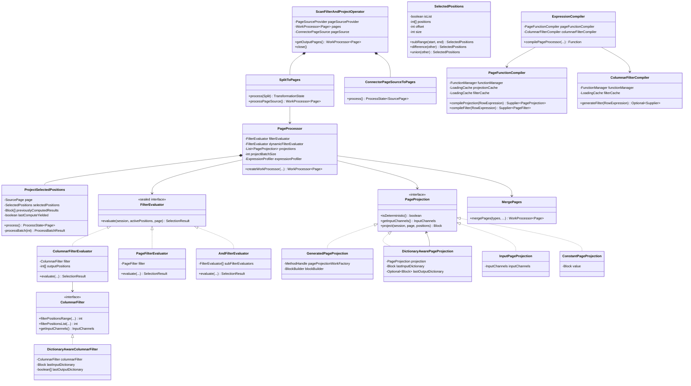
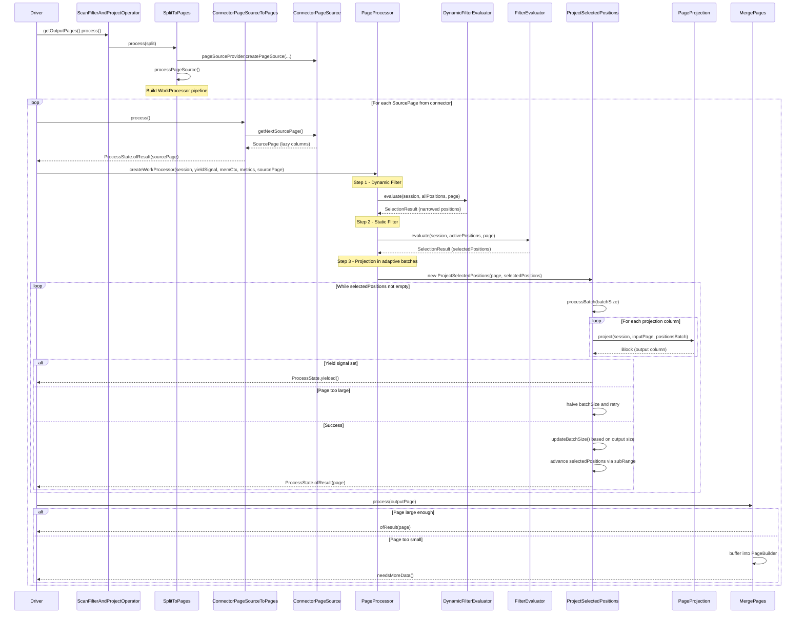

# Module Teardown: Scan, Filter, and Project Pipeline (Task 3.3.A)

## Table of Contents

- [0. Research Focus](#0-research-focus)
- [1. High-Level Overview](#1-high-level-overview)
- [2. Structural Architecture](#2-structural-architecture)
  - [Primary Source Files](#primary-source-files)
  - [Key Data Structures](#key-data-structures)
  - [Class Diagram](#class-diagram)
- [3. Execution and Call Flow](#3-execution-and-call-flow)
  - [Sequence Diagram](#sequence-diagram)
  - [Step-by-step Text Breakdown](#step-by-step-text-breakdown)
- [4. Concurrency and State Management](#4-concurrency-and-state-management)
- [5. Memory and Resource Profile](#5-memory-and-resource-profile)
- [6. Key Design Insights](#6-key-design-insights)
  - [Insight 1: Two-Tier Filter Compilation Strategy](#insight-1-two-tier-filter-compilation-strategy)
  - [Insight 2: Adaptive Batch Sizing is a Self-Tuning Feedback Loop](#insight-2-adaptive-batch-sizing-is-a-self-tuning-feedback-loop)
  - [Insight 3: SelectedPositions is a Dual-Mode Selection Vector](#insight-3-selectedpositions-is-a-dual-mode-selection-vector)
  - [Insight 4: Dictionary-Aware Processing Avoids Redundant Computation](#insight-4-dictionary-aware-processing-avoids-redundant-computation)
  - [Insight 5: Yield Integration Preserves Partial Work](#insight-5-yield-integration-preserves-partial-work)
  - [Insight 6: MergePages Prevents the Small-Page Problem](#insight-6-mergepages-prevents-the-small-page-problem)
  - [Insight 7: Dynamic Filters are Self-Disabling](#insight-7-dynamic-filters-are-self-disabling)
  - [Insight 8: Bytecode Generation Uses the Airlift Bytecode Library](#insight-8-bytecode-generation-uses-the-airlift-bytecode-library)
  - [Insight 9: Lazy SourcePage Enables Projection Push-Down](#insight-9-lazy-sourcepage-enables-projection-push-down)
- [7. Porting Considerations (Java to Rust)](#7-porting-considerations-java-to-rust)
  - [Bytecode Compilation to Native Code](#bytecode-compilation-to-native-code)
  - [SelectedPositions Maps to a Rust Selection Vector](#selectedpositions-maps-to-a-rust-selection-vector)
  - [WorkProcessor Maps to async/Stream](#workprocessor-maps-to-asyncstream)
  - [Dictionary-Aware Processing](#dictionary-aware-processing)
  - [Memory Tracking](#memory-tracking)
  - [Adaptive Batch Sizing](#adaptive-batch-sizing)


## 0. Research Focus
* **Task ID:** 3.3.A
* **Focus:** Trace a raw block of data coming from a connector, passing through a filter, and yielding a transformed `Page`. Understand how Trino compiles expressions into bytecode for faster execution.

## 1. High-Level Overview
* **Core Responsibility:** `ScanFilterAndProjectOperator` is the fused operator that reads data from a connector's `ConnectorPageSource`, applies filter predicates to eliminate non-matching rows, projects (transforms) selected columns/expressions into output blocks, and produces output `Page` objects. This is the most fundamental leaf operator in Trino's physical plan -- it is the only operator that directly interacts with connector-level I/O.
* **Key Triggers:**
  - A `Split` is assigned to a driver, which triggers `SplitToPages.process()` to create a `ConnectorPageSource` and begin producing pages.
  - Each call to the driver's `process()` advances the `WorkProcessor` pipeline: reading a `SourcePage` from the connector, filtering it, projecting selected positions in adaptive batches, and merging small output pages.
  - The `DriverYieldSignal` can interrupt processing mid-batch to maintain time-sharing fairness across concurrent splits.

## 2. Structural Architecture

### Primary Source Files

| File | Package | Role |
|------|---------|------|
| `ScanFilterAndProjectOperator.java` | `io.trino.operator` | Top-level operator: wires splits to page sources, feeds pages into PageProcessor, merges output |
| `PageProcessor.java` | `io.trino.operator.project` | Core filter-then-project engine with adaptive batching and yield support |
| `PageFilter.java` | `io.trino.operator.project` | Interface for row-at-a-time bytecode-compiled filter functions |
| `PageProjection.java` | `io.trino.operator.project` | Interface for projecting a block of selected positions into an output block |
| `SelectedPositions.java` | `io.trino.operator.project` | Tracks which row positions survived filtering (range or sparse list) |
| `InputChannels.java` | `io.trino.operator.project` | Maps logical column indices to physical blocks, supports lazy loading |
| `FilterEvaluator.java` | `io.trino.sql.gen.columnar` | Sealed interface for filter evaluation strategies (columnar, page-based, AND/OR composition) |
| `ColumnarFilter.java` | `io.trino.sql.gen.columnar` | Interface for columnar (vectorized) filter evaluation operating on position ranges/lists |
| `ColumnarFilterEvaluator.java` | `io.trino.sql.gen.columnar` | Adapts ColumnarFilter into the FilterEvaluator interface |
| `PageFilterEvaluator.java` | `io.trino.sql.gen.columnar` | Adapts row-at-a-time PageFilter into the FilterEvaluator interface |
| `AndFilterEvaluator.java` | `io.trino.sql.gen.columnar` | Composes multiple FilterEvaluators with short-circuit AND semantics |
| `DictionaryAwareColumnarFilter.java` | `io.trino.sql.gen.columnar` | Wraps a ColumnarFilter to evaluate dictionaries once and apply a bitmask |
| `DictionaryAwarePageProjection.java` | `io.trino.operator.project` | Wraps a PageProjection to project dictionary values once and reuse via DictionaryBlock |
| `GeneratedPageProjection.java` | `io.trino.operator.project` | Projection backed by a bytecode-generated `PageProjectionWork` class |
| `InputPageProjection.java` | `io.trino.operator.project` | Pass-through projection for identity column references (no computation) |
| `ConstantPageProjection.java` | `io.trino.operator.project` | Produces RunLengthEncodedBlock for constant-valued expressions |
| `ExpressionCompiler.java` | `io.trino.sql.gen` | Top-level compiler: decides columnar vs row-at-a-time path, compiles filters and projections |
| `PageFunctionCompiler.java` | `io.trino.sql.gen` | Generates bytecode for row-at-a-time PageFilter and PageProjection classes using airlift bytecode library |
| `ColumnarFilterCompiler.java` | `io.trino.sql.gen.columnar` | Generates bytecode for columnar (vectorized) ColumnarFilter classes |
| `CallColumnarFilterGenerator.java` | `io.trino.sql.gen.columnar` | Generates columnar filter bytecode for function-call expressions (e.g., `equal`, `less_than`) |
| `MergePages.java` | `io.trino.operator.project` | Buffers and merges small output pages to reduce downstream synchronization overhead |
| `ExpressionProfiler.java` | `io.trino.sql.gen` | Tracks average expression evaluation cost to influence adaptive batch sizing |
| `DynamicPageFilter.java` | `io.trino.sql.gen.columnar` | Compiles and manages dynamic filter predicates that arrive at runtime from join build sides |
| `ConnectorPageSource.java` | `io.trino.spi.connector` | SPI interface: connectors implement this to produce SourcePage objects |
| `SourcePage.java` | `io.trino.spi.connector` | SPI interface for a page of data from a connector, supports lazy block loading and position selection |

### Key Data Structures

| Structure | Description |
|-----------|-------------|
| `SourcePage` | A connector-produced page supporting lazy block materialization and `selectPositions()` for push-down filtering |
| `Page` | Trino's immutable output page: array of `Block` objects with a shared position count |
| `Block` | Columnar data for one column -- may be `DictionaryBlock`, `RunLengthEncodedBlock`, or flat value arrays |
| `SelectedPositions` | Encodes which rows survive a filter. Two modes: `range(offset, size)` for dense selections, `list(int[], offset, size)` for sparse. Supports `subRange`, `difference`, and `union` operations. |
| `ProcessBatchResult` | Three-state result from projection: `SUCCESS` (with output Page), `YIELD` (driver must give up CPU), `PAGE_TOO_LARGE` (halve batch size and retry) |
| `WorkProcessor` | Lazy pull-based iterator with yield/block/finish states. The entire scan-filter-project pipeline is composed via `flatTransform`, `flatMap`, `transformProcessor`, and `blocking`. |
| `FilterEvaluator.SelectionResult` | Pairs a `SelectedPositions` with elapsed filter time in nanos for metrics |

### Class Diagram



## 3. Execution and Call Flow

### Sequence Diagram



### Step-by-step Text Breakdown

**Phase 0: Compilation (happens once at plan time)**

1. `ExpressionCompiler.compilePageProcessor()` receives the filter `RowExpression` and list of projection `RowExpression` objects from the planner.
2. For the filter, it first attempts the **columnar path**: `FilterEvaluator.createColumnarFilterEvaluator()` pattern-matches the expression tree. Supported forms include `CallExpression` (operators like `equal`, `less_than`), `IS_NULL`, `NOT(IS_NULL)`, `AND`, `OR`, `BETWEEN`, and `IN`. For each leaf, `ColumnarFilterCompiler.generateFilter()` uses `io.airlift.bytecode` to emit a JVM class implementing `ColumnarFilter` with `filterPositionsRange()` and `filterPositionsList()` methods. The generated bytecode loops over positions, reads block values at each position via `BLOCK_POSITION` calling convention, evaluates the function, and writes matching positions to an output array.
3. If the columnar path cannot handle an expression (e.g., lambda arguments, nested calls), it falls back to the **row-at-a-time path**: `PageFunctionCompiler.compileFilter()` generates a class implementing `PageFilter`. The generated `filter(session, page)` method iterates over all positions, calling an inner `filter(session, page, position)` method for each, and returns a `SelectedPositions` object.
4. For projections, `PageFunctionCompiler.compileProjection()` handles three fast paths: `InputReferenceExpression` maps to `InputPageProjection` (zero-copy), `ConstantExpression` maps to `ConstantPageProjection` (RLE block). All other expressions generate a class implementing `PageProjectionWork` with a `process()` method that loops over selected positions, evaluates the expression per row, and appends results to a `BlockBuilder`.
5. Both compilers use `NonEvictableLoadingCache` keyed by `RowExpression` to avoid recompiling identical expressions.

**Phase 1: Split assignment and page source creation**

6. When a `Split` arrives, `SplitToPages.process(split)` calls `pageSourceProvider.createPageSource(session, split, table, credentials, columns, dynamicFilter)` to obtain a `ConnectorPageSource`. This is the connector-specific reader (e.g., Hive ORC/Parquet reader, JDBC reader).
7. `processPageSource()` constructs a `WorkProcessor` pipeline: `ConnectorPageSourceToPages` (produces `SourcePage`) -> yield gate -> `flatMap` through `PageProcessor` -> `mergePages` -> memory tracking.

**Phase 2: Reading from the connector**

8. `ConnectorPageSourceToPages.process()` calls `pageSource.getNextSourcePage()`. If the source is blocked (e.g., async I/O), it returns `ProcessState.blocked(future)`. If the source returns null but is not finished, it returns `ProcessState.yielded()`. Otherwise it returns the `SourcePage`.
9. `SourcePage` is an interface that supports lazy block loading. Blocks are not materialized until `getBlock(channel)` is called, which is critical for projection push-down where only needed columns are loaded.

**Phase 3: Filter evaluation**

10. `PageProcessor.createWorkProcessor()` receives the `SourcePage`. It first creates a `SelectedPositions.positionsRange(0, positionCount)` representing all rows.
11. **Dynamic filter** (if present): `dynamicFilterEvaluator.evaluate()` narrows positions. Dynamic filters come from the build side of joins and are compiled into `DynamicFilterEvaluator`, which internally holds per-column `FilterEvaluator` instances with selectivity profiling. Ineffective filters (selectivity above threshold after 2047 samples) are automatically skipped.
12. **Static filter** (if present): `filterEvaluator.evaluate()` further narrows positions. For columnar evaluation, `ColumnarFilterEvaluator` calls `filter.filterPositionsRange()` or `filter.filterPositionsList()` depending on whether the input `SelectedPositions` is a range or list. For `AND` expressions, `AndFilterEvaluator` chains evaluators and passes the progressively narrowed `SelectedPositions` through each.
13. If no positions survive, `WorkProcessor.of()` returns an empty iterator immediately -- no projection work is done.

**Phase 4: Projection with adaptive batching**

14. `ProjectSelectedPositions` is created with the surviving positions. Its `process()` method is called repeatedly.
15. **Batch sizing**: `projectBatchSize` starts at the `initialBatchSize` (default 1) and adapts. After each successful batch, if the output page is smaller than `MIN_PAGE_SIZE_IN_BYTES` (4 MB) and the expression is cheap, the batch size doubles (up to `MAX_BATCH_SIZE` = 8192). If the output exceeds `MAX_PAGE_SIZE_IN_BYTES` (16 MB) or the expression is expensive, batch size halves.
16. For each batch, `processBatch(batchSize)` iterates over projections. For each projection:
    - `projection.getInputChannels().getInputChannels(page)` creates an `InputChannelsSourcePage` that remaps logical channels, supporting lazy loading and eager loading hints.
    - `projection.project(session, inputPage, positionsBatch)` evaluates the expression.
    - `ExpressionProfiler.start()/stop()` brackets the call to track per-row cost.
17. Between projections, `yieldSignal.isSet()` is checked. If the driver has exceeded its time quantum, processing stops mid-page and returns `ProcessState.yielded()`. The `lastComputeYielded` and `lastComputeBatchSize` fields ensure the exact same batch is retried on resumption, and `previouslyComputedResults` caches blocks already computed for the current batch to avoid redundant work.
18. If accumulated page size exceeds `MAX_PAGE_SIZE_IN_BYTES`, `ProcessBatchResult.processBatchTooLarge()` is returned, batch size is halved, and the batch is retried (previously computed results are reused).
19. On success, `selectedPositions = selectedPositions.subRange(batchSize, ...)` advances past the completed batch. Partially computed results are also sliced via `getRegion()`.

**Phase 5: Output page merging**

20. `MergePages` sits downstream of the `PageProcessor`. Small output pages (below `minOutputPageSize` or `minOutputPageRowCount`) are buffered into a `PageBuilder`. When a sufficiently large page arrives or the source is exhausted, buffered data is flushed as a single output `Page`. This prevents excessive synchronization overhead from tiny pages when filter selectivity is very high.

## 4. Concurrency and State Management

- **Single-threaded operator**: `ScanFilterAndProjectOperator` and `PageProcessor` are both annotated `@NotThreadSafe`. A single driver thread processes one split at a time through the full pipeline.
- **Yield-based cooperative scheduling**: The `DriverYieldSignal` is checked between projection evaluations within a batch. When the signal fires, processing pauses at a well-defined boundary (between projections) and resumes later with cached state. This is Trino's cooperative multitasking mechanism -- each split gets a time quantum (default ~1 second).
- **Blocking on I/O**: `ConnectorPageSource.isBlocked()` returns a `CompletableFuture`. If incomplete, the `ConnectorPageSourceToPages` process returns `ProcessState.blocked(future)`, which propagates up through the `WorkProcessor` chain and eventually causes the driver to park the split until the future completes.
- **DynamicFilter thread safety**: `DynamicPageFilter.createDynamicPageFilterEvaluator()` is `synchronized` because dynamic filter predicates can be updated from the join build side on a different thread. The compiled evaluator is cached and only recompiled when the underlying `DynamicFilter` unblocks (meaning new predicates arrived).
- **No shared mutable state between operators**: Each `ScanFilterAndProjectOperator` instance holds its own `PageProcessor`, `ConnectorPageSource`, and metrics counters. There is no cross-operator locking.

## 5. Memory and Resource Profile

- **Memory tracking**: Three `LocalMemoryContext` instances track memory independently:
  - `pageSourceMemoryContext`: tracks `pageSource.getMemoryUsage()` plus `pageSourceProvider.getMemoryUsage()`.
  - `outputMemoryContext`: tracks retained bytes of the in-flight `SourcePage`, `previouslyComputedResults` array, and `SelectedPositions` during projection. Uses `RetainedBytesByPartVisitor` with `ReferenceCountMap` to deduplicate shared block references.
  - MergePages local context: tracks the `PageBuilder` buffering small pages.
  - All are aggregated via `AggregatedMemoryContext` and propagated to the memory pool via `blocking()`.

- **Page size constants**:
  - `MAX_BATCH_SIZE` = 8192 positions per projection batch
  - `MAX_PAGE_SIZE_IN_BYTES` = 16 MB (triggers batch halving)
  - `MIN_PAGE_SIZE_IN_BYTES` = 4 MB (triggers batch doubling)
  - `MergePages.MAX_MIN_PAGE_SIZE` = 1 MB

- **Lazy block loading**: `SourcePage` and `InputChannelsSourcePage` defer `getBlock(channel)` calls until the block is actually needed. This means columns referenced only by the filter are loaded during filtering, and columns referenced only by projections are loaded during projection. This is critical for wide tables.

- **Dictionary and RLE optimization**: Both `DictionaryAwarePageProjection` and `DictionaryAwareColumnarFilter` cache the result of evaluating on a dictionary block's dictionary. For a `DictionaryBlock` with N entries and P positions, instead of evaluating the expression P times, they evaluate N times (N is typically much smaller than P). The result is stored as a dictionary mapping or boolean mask and reused across positions.

- **Expression cache**: Both `PageFunctionCompiler` and `ColumnarFilterCompiler` use Guava `LoadingCache` keyed by `RowExpression`. This avoids regenerating and classloading bytecode for identical expressions across different operators in the same query.

## 6. Key Design Insights

### Insight 1: Two-Tier Filter Compilation Strategy
Trino employs a two-tier filter compilation strategy. The preferred path is **columnar evaluation** via `ColumnarFilterCompiler`, which generates bytecode that operates on position arrays (`filterPositionsRange`/`filterPositionsList`) and reads block values via the `BLOCK_POSITION` calling convention. This is more cache-friendly because it processes one column at a time. When the expression is too complex for columnar evaluation (lambda arguments, deeply nested expressions), it falls back to the **row-at-a-time** `PageFunctionCompiler` path, which generates a `PageFilter` that loops position-by-position and evaluates the full expression per row. The `FilterEvaluator` sealed interface hierarchy unifies both behind a common `evaluate()` method that `PageProcessor` calls uniformly.

### Insight 2: Adaptive Batch Sizing is a Self-Tuning Feedback Loop
The `projectBatchSize` variable is a shared, mutable field on `PageProcessor` that persists across pages and evolves over the lifetime of the operator. Starting at 1 (or a configured initial value), it doubles when output pages are small and cheap, halves when they are large or expensive. This creates a feedback loop: the system automatically finds the sweet spot between per-call overhead (too many small batches) and memory pressure / yield latency (too few large batches). The `ExpressionProfiler` adds a second signal: if average per-row evaluation time exceeds the split time quantum, the expression is classified as "expensive" and batch growth is suppressed.

### Insight 3: SelectedPositions is a Dual-Mode Selection Vector
`SelectedPositions` has two representations: range mode (contiguous positions) and list mode (sparse int array). Range mode is the common case when all rows pass the filter or when the filter has not yet been applied. Converting to list mode only happens when a filter produces a sparse result. This duality propagates through the entire pipeline: `ColumnarFilter` has separate `filterPositionsRange()` and `filterPositionsList()` methods, and `InputPageProjection.project()` uses `getRegion()` for ranges vs `copyPositions()` for lists. The `difference()` and `union()` methods handle all four combinations of (range, list) inputs.

### Insight 4: Dictionary-Aware Processing Avoids Redundant Computation
Both filtering and projection implement dictionary-awareness as decorator patterns (`DictionaryAwareColumnarFilter` wraps `ColumnarFilter`, `DictionaryAwarePageProjection` wraps `PageProjection`). For dictionary-encoded columns (common in string and low-cardinality data), the expression is evaluated once per unique dictionary entry instead of once per row. For `DictionaryAwareColumnarFilter`, the result is a boolean mask indexed by dictionary ID. For `DictionaryAwarePageProjection`, the result is a projected dictionary block that gets wrapped in a new `DictionaryBlock` with remapped IDs. Both cache the last dictionary and reuse results when the same dictionary appears in consecutive pages (which is very common in columnar file formats like Parquet/ORC where dictionary encoding spans a row group).

### Insight 5: Yield Integration Preserves Partial Work
When a yield signal fires mid-batch, the system preserves all state: `lastComputeYielded = true`, `lastComputeBatchSize` records the exact batch size, and `previouslyComputedResults[]` retains blocks already projected for earlier columns in the current batch. On resumption, the same batch is retried with the same size, and already-computed projections are retrieved from the cache array instead of being recomputed. This is critical because projections may have side effects (block builder state) and because it would be wasteful to discard work already done.

### Insight 6: MergePages Prevents the Small-Page Problem
When a filter has very high selectivity (e.g., 0.1%), each input page of 1000 rows might produce only 1 output row. Without merging, each tiny page would flow through the operator pipeline, incurring per-page synchronization and exchange overhead. `MergePages` acts as a buffering layer: it accumulates small pages into a `PageBuilder` until the minimum size/row threshold is met, then flushes a single larger page. Large pages bypass the buffer entirely (zero-copy). This is inserted via `transformProcessor` in the `WorkProcessor` pipeline, making it transparent to the rest of the operator.

### Insight 7: Dynamic Filters are Self-Disabling
`DynamicPageFilter.DynamicFilterEvaluator` includes an `EffectiveFilterProfiler` that tracks per-column selectivity. After `MIN_SAMPLE_POSITIONS` (2047) input positions, if a dynamic filter column's selectivity exceeds the threshold (i.e., it passes most rows), that column's filter is automatically skipped in subsequent evaluations. This prevents runtime overhead from dynamic filters that turned out to be non-selective for the current data distribution.

### Insight 8: Bytecode Generation Uses the Airlift Bytecode Library
All bytecode generation uses `io.airlift.bytecode`, an ASM-based library that provides a builder API for constructing JVM bytecode. The generated classes implement `PageFilter`, `ColumnarFilter`, or `PageProjectionWork` interfaces. Key patterns in the generated code:
- **Null checks use branchless arithmetic**: In `PageFilter.positionsArrayToSelectedPositions()`, the conversion from `boolean[]` to position list uses `index += selectedPositions[position] ? 1 : 0` instead of `if/else`, reducing branch mispredictions.
- **Block fields are cached**: The constructor of generated classes eagerly reads `page.getBlock(channel)` into `block_N` fields to avoid repeated virtual dispatch during the row loop.
- **CallSiteBinder uses invokedynamic**: Constants and function implementations are bound into the generated class's call sites using `invokedynamic`, avoiding constant pool limitations for large objects.

### Insight 9: Lazy SourcePage Enables Projection Push-Down
The `SourcePage` interface's `getBlock(channel)` method is designed to be lazy -- the connector can defer materializing column data until the engine actually requests it. This pairs with `InputChannels.getInputChannels(page)`, which creates a remapped view that only touches the channels needed by a particular filter or projection. For a query like `SELECT a FROM t WHERE b > 10`, the filter only materializes column `b`, and the projection only materializes column `a`. Furthermore, `SourcePage.selectPositions()` allows the engine to push position filtering back into the connector, enabling the reader to skip rows in subsequent column reads.

## 7. Porting Considerations (Java to Rust)

### Bytecode Compilation to Native Code
The Java path uses runtime bytecode generation via airlift to create specialized filter/projection classes loaded into the JVM. In Rust, the analogous approach would be:
- **LLVM JIT via Cranelift or inkwell**: Generate native machine code at query compile time. The `ColumnarFilter` interface maps naturally to a function pointer `fn(session, output: &mut [i32], offset: usize, size: usize, page: &SourcePage) -> usize`.
- **Enum dispatch with inlining**: For simpler expressions, Rust's monomorphization and `#[inline]` can achieve similar performance to JIT-compiled code. An expression tree enum with match-based evaluation, compiled in release mode, can be competitive with generated code for simple predicates.
- **Cached compilation**: The `NonEvictableLoadingCache` pattern maps to a `HashMap<ExpressionKey, Arc<CompiledFilter>>` with a mutex or concurrent map.

### SelectedPositions Maps to a Rust Selection Vector
`SelectedPositions` is a natural fit for an enum:
```
enum SelectionVector {
    Range { offset: usize, len: usize },
    Indices { positions: Vec<u32>, offset: usize, len: usize },
}
```
The branchless position conversion in `positionsArrayToSelectedPositions` maps directly to Rust with SIMD potential via `std::simd` or manual vectorization.

### WorkProcessor Maps to async/Stream
The `WorkProcessor` yield/block/finish state machine maps to Rust's `async`/`Stream` trait or a manual `Poll`-based approach. The `DriverYieldSignal` becomes an `AtomicBool` checked between projection batches. Blocking on I/O (`CompletableFuture`) maps to `Future`/`tokio::sync::Notify`.

### Dictionary-Aware Processing
The dictionary-aware patterns (caching last dictionary, reusing projection/filter results) are directly portable. In Rust, the `lastInputDictionary` identity check (`==` on Java references) maps to `Arc::ptr_eq()` or a generation counter on the dictionary block.

### Memory Tracking
Java's `LocalMemoryContext.setBytes()` pattern maps to a `MemoryTracker` struct with `set_bytes(n: usize)` that reports to a pool. The `RetainedBytesByPartVisitor` deduplication via `ReferenceCountMap` maps to a `HashMap<*const (), usize>` tracking raw pointer identity.

### Adaptive Batch Sizing
The `projectBatchSize` feedback loop is directly portable. The `ExpressionProfiler` time-based classification maps to `std::time::Instant` measurements. The key invariant to preserve: batch size is shared across pages within a single operator instance and evolves over the operator's lifetime.
