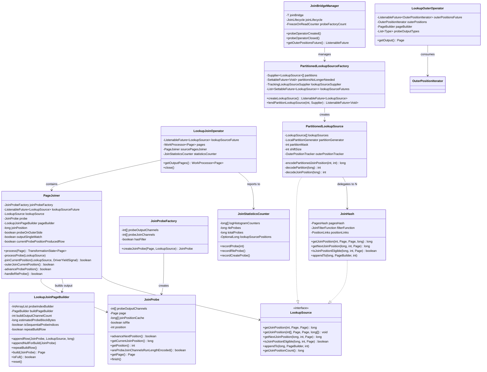
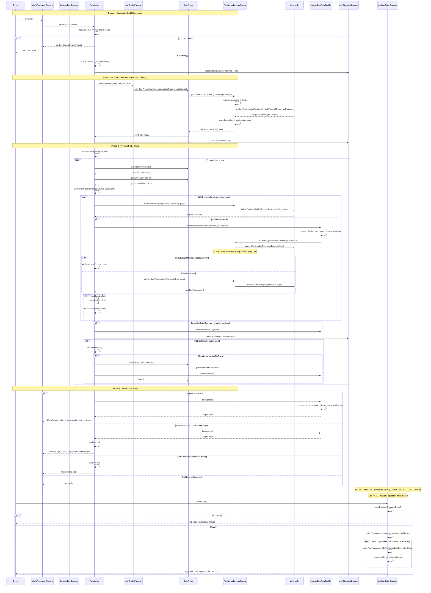

# Module Teardown: Hash Join - The Probe Pipeline (Task 3.4.B)

## Table of Contents

- [0. Research Focus](#0-research-focus)
- [1. High-Level Overview](#1-high-level-overview)
- [2. Structural Architecture](#2-structural-architecture)
  - [Class Diagram](#class-diagram)
- [3. Execution & Call Flow](#3-execution-call-flow)
  - [Sequence Diagram](#sequence-diagram)
- [4. Concurrency & State Management](#4-concurrency-state-management)
- [5. Memory & Resource Profile](#5-memory-resource-profile)
- [6. Key Design Insights](#6-key-design-insights)
- [7. Porting Considerations (Java to Rust)](#7-porting-considerations-java-to-rust)

## 0. Research Focus
* **Task ID:** 3.4.B
* **Focus:** How the probe side streams through and matches against the built hash table without blocking, how output pages are constructed from matched indices, and how outer join unmatched rows are emitted.

## 1. High-Level Overview
* **Core Responsibility:** The probe pipeline is the streaming side of a hash join. It receives pages one at a time, hashes each row's join keys to look up matching positions in the pre-built hash table, walks the chain of collisions for each match, applies optional filter functions, and assembles output pages that combine columns from both the probe and build sides. For outer joins, it also tracks which build-side rows were never matched so a separate operator can emit them with null-padded probe columns.
* **Key Triggers:**
  - Build-side completion: The `PartitionedLookupSourceFactory` fulfills a `SettableFuture<LookupSource>` that unblocks all probe operators.
  - Incoming probe pages: Each page from the upstream pipeline triggers `PageJoiner.process()` via the WorkProcessor transformation model.
  - Yield signal: The driver's cooperative yield signal causes the probe loop to pause mid-page and resume on the next `process()` call.
  - Page builder full: When the output page builder reaches its size threshold, the operator emits a partial result without consuming all probe rows.

## 2. Structural Architecture
* **Primary Source Files:**
  - `io.trino.operator.join.unspilled.LookupJoinOperator` -- top-level WorkProcessorOperator, wires up the pipeline
  - `io.trino.operator.join.unspilled.PageJoiner` -- the core Transformation that drives the probe loop
  - `io.trino.operator.join.unspilled.JoinProbe` -- per-page probe state; eagerly caches all join positions for the page
  - `io.trino.operator.join.unspilled.LookupJoinPageBuilder` -- builds output pages with dictionary-based probe columns and copied build columns
  - `io.trino.operator.join.unspilled.PartitionedLookupSource` -- routes probe lookups to the correct partition's hash table
  - `io.trino.operator.join.unspilled.PartitionedLookupSourceFactory` -- manages build completion, supplies LookupSource to probers
  - `io.trino.operator.join.JoinHash` -- single-partition LookupSource backed by PagesHash
  - `io.trino.operator.join.LookupSource` -- interface for hash table access (getJoinPosition, getNextJoinPosition, appendTo, isJoinPositionEligible)
  - `io.trino.operator.join.LookupOuterOperator` -- source operator for emitting unmatched build rows in RIGHT/FULL OUTER joins
  - `io.trino.operator.join.JoinStatisticsCounter` -- collects logarithmic histogram of probe-to-match ratios
  - `io.trino.operator.join.JoinBridgeManager` -- lifecycle management connecting build, probe, and outer operators
  - `io.trino.operator.join.unspilled.LookupJoinOperatorFactory` -- creates LookupJoinOperator instances and wires up outer operator factories

* **Key Data Structures:**

| Structure | Location | Purpose |
|-----------|----------|---------|
| `long[] joinPositionCache` | `JoinProbe` | Eagerly computed array mapping each probe row index to its first matching join position (or -1) |
| `IntArrayList probeIndexBuilder` | `LookupJoinPageBuilder` | Accumulates probe-side row indices for the current output page |
| `PageBuilder buildPageBuilder` | `LookupJoinPageBuilder` | Accumulates build-side row data (copied column values) for current output page |
| `boolean[][] visitedPositions` | `PartitionedLookupSource.OuterPositionTracker` | Shared bitmap across all probe operators tracking which build positions were matched (for outer join) |
| `LookupSource[] lookupSources` | `PartitionedLookupSource` | Array of per-partition JoinHash instances |
| `long partitionedJoinPosition` | `PartitionedLookupSource` | Encoded long packing partition index in low bits and join position in high bits |
| `long[] logHistogramCounters` | `JoinStatisticsCounter` | Packed array: even indices are probe-row counts, odd indices are total output counts per histogram bucket |
| `SettableFuture<LookupSource>` | `PartitionedLookupSourceFactory` | Future that blocks probe operators until all build partitions are ready |

### Class Diagram

## 3. Execution & Call Flow

### Sequence Diagram

* **Step-by-step text breakdown:**

**Step 1 -- Operator construction and build-wait:**
The `LookupJoinOperatorFactory.create()` obtains the `PartitionedLookupSourceFactory` from `JoinBridgeManager` and calls `createLookupSource()` which returns a `ListenableFuture<LookupSource>`. The `LookupJoinOperator` constructor wraps the source page stream with a `PageJoiner` transformation. If `waitForBuild` is true (e.g., for RIGHT OUTER joins), a `.blocking()` wrapper is added so the WorkProcessor does not even pull probe pages until the build future completes. Otherwise, the first call to `PageJoiner.process()` checks `lookupSourceFuture.isDone()` and returns `blocked(...)` if the build is still running.

**Step 2 -- JoinProbe creation (eager batch hash lookup):**
When `PageJoiner.process()` receives a new probe page and the LookupSource is available, it creates a `JoinProbe` via `JoinProbeFactory.createJoinProbe(page, lookupSource)`. The constructor immediately extracts the hash-join columns into a `probePage` and calls `fillCache()` to compute all join positions in one batch:
- If all probe join columns are RLE (Run-Length Encoded) and there is no filter, it only looks up position 0 and fills the cache with that single position.
- Otherwise, it identifies which rows have null values in any join column (null rows cannot match and get -1) and calls `lookupSource.getJoinPosition(positions[], hashPage, allPage, result[])` in batch.
- At the `PartitionedLookupSource` level, this batch call partitions positions by their hash, fans out to per-partition `JoinHash.getJoinPosition()`, then re-encodes results with the partition index packed into the low bits.

**Step 3 -- The probe loop (`processProbe`):**
`processProbe()` is a tight loop with cooperative yielding. For each probe position:
1. `joinCurrentPosition()` walks the chain of matching build rows. For each join position: check eligibility via `isJoinPositionEligible` (applies the optional filter function), and if eligible, call `pageBuilder.appendRow(probe, lookupSource, joinPosition)`. Then advance to the next position via `getNextJoinPosition()` which follows the `PositionLinks` chain. If `outputSingleMatch` is set (for semi-join semantics), the chain walk stops after the first match. The loop breaks early if the yield signal fires or the page builder is full.
2. `outerJoinCurrentPosition()` fires only when `probeOnOuterSide` is true (LEFT/FULL OUTER). If the current probe row produced no match, it appends the probe row with null build columns.
3. `statisticsCounter.recordProbe(joinSourcePositions)` records the number of build matches for this probe row into the logarithmic histogram.
4. `handleRleProbe()` checks for the RLE optimization: if join channels are RLE and we just processed position 0, we can shortcut. If zero matches, skip all remaining rows. If exactly one match, call `repeatBuildRow()` to replicate the single build row across all probe positions. If multiple matches, fall through to row-by-row processing.
5. `advanceProbePosition()` moves to the next probe row, reads the cached join position, and resets per-row state.

**Step 4 -- Output page construction (`LookupJoinPageBuilder.build()`):**
The page builder maintains two parallel structures: a `probeIndexBuilder` (IntArrayList of probe row indices) and a `buildPageBuilder` (standard PageBuilder with build column data). When `build()` is called:
- **Probe side (zero-copy where possible):** If probe indices are sequential (common case of 1:1 or 1:0 matching), the builder uses `Block.getRegion()` to create a zero-copy view. If the indices cover the entire page, it passes the original block directly. Only for non-sequential indices (1:N matching with skips) does it use `Block.getPositions()` which copies.
- **Build side:** Each build column's `BlockBuilder.build()` produces a new Block. Data was copied into the builder via `lookupSource.appendTo()` during the probe loop.
- **RLE repeat optimization:** When `repeatBuildRow` is true, the single build row is wrapped in `RunLengthEncodedBlock.create(block, positionCount)`, providing a zero-copy broadcast of the build row across all probe positions.

**Step 5 -- Outer join unmatched rows (`LookupOuterOperator`):**
For LOOKUP_OUTER and FULL_OUTER joins, the `LookupJoinOperatorFactory` also creates a `LookupOuterOperatorFactory`. The `LookupOuterOperator` is a source operator (takes no input) that blocks on `outerPositionsFuture`, which only resolves after all probe operators AND the build have finished (managed by `JoinBridgeManager.JoinLifecycle`). Once ready, it iterates over the `visitedPositions` bitmap. For each position where `visitedPositions[partition][pos] == false`, it calls `lookupSource.appendTo(pos, pageBuilder, probeColumnCount)` to emit the build columns, and fills probe columns with nulls.

## 4. Concurrency & State Management
* **Threading Model:**
  - Each probe operator runs in its own driver thread. Multiple driver threads may probe the same hash table concurrently since `JoinHash` and `PagesHash` are effectively read-only after construction.
  - The `LookupSource` interface is annotated `@NotThreadSafe`, but each probe operator gets its own `LookupSource` instance via `lookupSourceFactory.createLookupSource()`. The underlying `PagesHash` data is shared and immutable.
  - The `PageJoiner` and `JoinProbe` are strictly single-threaded per operator.

* **Synchronization:**
  - **Build-probe coordination:** Uses Guava `SettableFuture<LookupSource>`. The factory's `lendPartitionLookupSource()` is called by build operators (one per partition). When the last partition arrives, `supplyLookupSources()` resolves all pending futures, unblocking all waiting probe operators. The `synchronized` block in the factory ensures partition count and future resolution are atomic.
  - **Probe-outer coordination:** `JoinBridgeManager.JoinLifecycle` uses two `ReferenceCount` instances (probe and outer). The `whenBuildAndProbeFinishes` future resolves when both the build future AND all probe reference counts reach zero. Only then is the `OuterPositionIterator` made available.
  - **Visited positions tracking (partitioned case):** The `OuterPositionTracker` in `PartitionedLookupSource` uses a shared `boolean[][]` array with lock-free writes (each probe operator independently sets positions to `true`). Memory visibility is ensured by `AtomicLong referenceCount`: each tracker increments on first write, decrements on `commit()`. The iterator factory verifies `referenceCount == 0` before reading.
  - **Visited positions tracking (single-partition case):** `OuterLookupSource.OuterPositionTracker` uses `synchronized` for both `positionVisited()` and `getOuterPositionIterator()`, which is simpler but more conservative.

* **State Machine (PageJoiner.process):**
  The `PageJoiner` operates as a `WorkProcessor.Transformation<Page, Page>` with the following state transitions per call:
  - `blocked(future)` -- returned when LookupSource is not yet available
  - `needsMoreData()` -- returned when probe finished and output builder is empty
  - `ofResult(page, true)` -- returned when probe finished and output builder has data (needs next probe page)
  - `ofResult(page, false)` -- returned when output builder is full but probe page is not exhausted (continue same page)
  - `yielded()` -- returned when yield signal interrupted the probe loop
  - `finished()` -- returned when `probePage == null` (upstream exhausted) and no active probe

## 5. Memory & Resource Profile

**Hash Table (build side, shared, read-only during probe):**
- The `PagesHash` and its backing arrays are the dominant memory consumer. Owned by the build side; probe operators only hold references.
- `JoinHash.getInMemorySizeInBytes()` reports: instance overhead + pagesHash size + positionLinks size + page instances retained size.

**Probe-side memory (per operator):**
- `JoinProbe.joinPositionCache`: `long[positionCount]` = 8 bytes per probe row per page. For a 1024-row page, this is 8KB. Allocated fresh for each probe page, GC'd when the JoinProbe is discarded.
- `LookupJoinPageBuilder.probeIndexBuilder`: `IntArrayList` that grows dynamically. Capacity is retained across pages (not shrunk on `reset()`).
- `LookupJoinPageBuilder.buildPageBuilder`: Standard `PageBuilder` that copies build-side data. Reset between output pages.
- Output page size is bounded by `DEFAULT_MAX_PAGE_SIZE_IN_BYTES` (1MB default) and `MAX_BATCH_SIZE` (8192 positions). The `isFull()` check considers both estimated probe block bytes and build page builder size.

**Output page zero-copy optimization:**
- When probe indices are sequential, `Block.getRegion()` creates a view without copying. When indices cover the entire original block, the block reference is passed through directly.
- The RLE optimization (`repeatBuildRow`) wraps a single-row Block in `RunLengthEncodedBlock`, which is O(1) memory regardless of the number of probe rows.

**Outer position tracking:**
- `visitedPositions` is `boolean[partitionCount][positionCountPerPartition]`. This is 1 byte per build-side row. For a 10M-row build side, that is ~10MB. Shared across all probe operators.

**Memory accounting estimation:**
- The probe side uses an approximate per-row size: `block.getSizeInBytes() / block.getPositionCount()` for each output channel. This avoids expensive recursive size calculations on nested/dictionary blocks. The estimation guarantees the output page size is bounded between `[buildPageBuilder.getSizeInBytes(), buildPageBuilder.getSizeInBytes + probe.getPage().getSizeInBytes()]`.

## 6. Key Design Insights

1. **Eager batch hash lookup in JoinProbe constructor.** Rather than looking up one row at a time during the probe loop, Trino computes all join positions for the entire page upfront in `fillCache()`. This enables vectorized hash lookups: `PartitionedLookupSource.getJoinPosition(int[] positions, ...)` partitions all positions by hash, fans them out to per-partition JoinHash in batch, and collects results. This is significantly more cache-friendly than interleaving hash lookups with output construction. The probe loop then just reads from the pre-computed `joinPositionCache[]` array.

2. **Partition-encoded join positions.** `PartitionedLookupSource` packs the partition index and within-partition position into a single `long`: the low bits hold the partition (masked by `partitionMask`), and the high bits hold the position (shifted by `shiftSize = numberOfTrailingZeros(partitionCount) + 1`). This avoids allocating tuple objects for every join position, and all subsequent operations (getNextJoinPosition, isJoinPositionEligible, appendTo) can extract the partition with a bitmask and the position with a right-shift, both in a single CPU cycle.

3. **RLE probe shortcut.** When all join key columns are Run-Length Encoded (constant value) and there is no filter function, all probe rows in the page hash to the same position. The probe handles three sub-cases: (a) zero matches -- skip the entire page (`probe.finish()`); (b) exactly one match -- look up once, then broadcast via `RunLengthEncodedBlock.create()` (zero-copy replication); (c) multiple matches -- fall back to row-by-row processing since output cardinality varies. This optimization is tracked via `statisticsCounter.recordRleProbe()` and avoids O(N) redundant hash lookups for broadcast joins or constant-key scenarios.

4. **Zero-copy probe output pages.** `LookupJoinPageBuilder` tracks whether probe indices are sequential via the `isSequentialProbeIndices` flag (updated on each `appendProbeIndex`). In the common inner-join case where most probe rows match exactly once, indices are sequential and `Block.getRegion()` produces a zero-copy slice. Only in the 1:N case (duplicates due to multiple build matches) or when rows are skipped (non-sequential indices) does it fall back to `Block.getPositions()` which copies data. This asymmetry (zero-copy probe, always-copy build) is intentional: probe blocks already exist in memory, while build data must be gathered from scattered hash table positions.

5. **Cooperative yielding with resumable state.** The `processProbe()` loop checks `yieldSignal.isSet()` both in the inner chain-walk loop and in the outer probe-row loop. The `joinPosition` field persists across calls, so when `joinCurrentPosition()` returns false due to yield or full page builder, the next invocation resumes exactly where it left off in the chain. This is critical for Trino's cooperative multitasking model where a single driver thread is shared among multiple operators.

6. **Decoupled outer join emission.** The `LookupOuterOperator` is a completely separate source operator (not a transformation on the probe stream). It activates only after all probe operators have closed (tracked by `JoinLifecycle`'s reference counting). It iterates the `visitedPositions` bitmap and emits unmatched build rows with null-padded probe columns. This separation means the probe pipeline can finish and free its resources before the outer emission begins, and the outer operator can run in a different driver or at a different parallelism level.

7. **Lock-free outer position tracking in partitioned case.** The partitioned `OuterPositionTracker` avoids synchronization during normal probing. Since `visitedPositions[partition][position]` transitions are monotonic (false to true only), concurrent writes from multiple probe operators are safe without locks. An `AtomicLong referenceCount` provides the memory fence: each tracker increments on first write and decrements on commit. The iterator factory reads only after all reference counts have been decremented to zero, guaranteeing all writes are visible.

8. **Null-aware probe skipping.** In `JoinProbe.fillCache()`, the code identifies which probe rows have null values in any join column and pre-fills their cache entries with -1 (no match). Null values cannot join, so this avoids sending them through the hash lookup entirely. The null-detection loop is optimized: it scans only `mayHaveNull()` blocks and uses a branchless counting pattern (`nonNullCount += isNull[i] ? 0 : 1`) for better branch prediction.

9. **Asymmetric output strategy.** Build-side columns are always deep-copied into a `PageBuilder`, while probe-side columns use dictionary/region references. The TODO comment in `LookupJoinPageBuilder` acknowledges this: "use dictionary blocks (probably extended kind) to avoid data copying for build side." The current approach is simpler but means build-side output bandwidth is proportional to the number of matched rows. A future optimization could use index-based references into the hash table's pages for the build side as well.

10. **Statistics as a logarithmic histogram.** The `JoinStatisticsCounter` packs probe and output counts into an 8-bucket logarithmic histogram (buckets: 0, 1, 2, 3, 4, 5-10, 11-100, 101+). This provides a cheap but informative profile of the join's fan-out characteristics. The packed `long[16]` array (2 longs per bucket) fits in a single cache line and avoids any allocation during the hot probe loop. The data is exposed via `JoinOperatorInfo` and is mergeable across pipeline instances.

## 7. Porting Considerations (Java to Rust)

1. **WorkProcessor transformation model.** Trino's `WorkProcessor.Transformation<Page, Page>` is essentially a coroutine-like state machine with yield/block/result states. In Rust, this maps well to `Poll<Option<Result<Page>>>` patterns in async streams, or a manual state machine enum. The key is that `process()` must be re-entrant: the `joinPosition` field persists across calls so the chain-walk can resume mid-way.

2. **ListenableFuture to Rust async.** The `lookupSourceFuture` and `outerPositionsFuture` are one-shot futures. In Rust, use `tokio::sync::oneshot` or `tokio::sync::watch` channels. The `SettableFuture<LookupSource>` pattern maps to `oneshot::Sender/Receiver`. The `blocked()` state translates to returning `Poll::Pending` with a registered waker.

3. **Batch hash lookup with partitioning.** The `PartitionedLookupSource.getJoinPosition(int[], ...)` scatter-gather pattern is a good fit for Rust: partition positions into per-partition `Vec<usize>`, call each partition's lookup, then gather results. Use `unsafe` indexing judiciously in the hot path since bounds-checks can be a measurable cost at this level.

4. **Encoded join positions.** The partition-in-low-bits encoding is straightforward in Rust (`u64` bit operations). Consider using `NonZeroU64` or an `Option<u64>` sentinel pattern instead of `-1` for "no match," since Rust does not have Java's implicit long-to-int narrowing bugs.

5. **Zero-copy probe output.** Rust's `Arc<[u8]>` slice references and Arrow's buffer model naturally support region views without copying. The `isSequentialProbeIndices` optimization translates to checking whether the selection vector is a contiguous range, which Arrow's `SliceBuffer` handles natively.

6. **Outer position tracking.** The lock-free `boolean[][]` pattern with `AtomicLong` fences maps to `Vec<AtomicBool>` in Rust (or `Vec<AtomicU8>` for byte-level bitmaps). Use `Ordering::Relaxed` for the individual position writes and `Ordering::Release/Acquire` on the reference count for the fence, mirroring the Java memory model guarantees.

7. **RLE optimization.** Arrow's `RunEndEncodedArray` or a custom constant-array type can represent the RLE case. The key design decision is whether to detect RLE at the probe level (as Trino does) or at the block/array level. Trino's approach of checking `instanceof RunLengthEncodedBlock` is simple but Java-specific; in Rust, use an enum variant or trait method.

8. **Memory accounting.** Trino's approximate per-row size estimation for the probe side avoids recursive `getSizeInBytes()` calls on nested blocks. In Rust with Arrow, `ArrayRef::get_buffer_memory_size()` is available but can be expensive for dictionary arrays. Consider a similar averaging approach for the page builder's fullness check.

9. **Yield signal.** Trino's `DriverYieldSignal` is a shared boolean that the driver sets when the operator has consumed too much CPU time. In Rust, this can be a simple `Arc<AtomicBool>` or a callback-based approach. The important design point is that the probe loop checks it at two granularities: after each build-chain step and after each probe row.
