# Velox Module Map

## Table of Contents

- [Mind Map](#mind-map)
- [Detailed Module Breakdown](#detailed-module-breakdown)
  - [1. Host Control Boundary (No HTTP — Library API)](#1-host-control-boundary-no-http--library-api)
  - [2. Task Management](#2-task-management)
  - [3. Plan Compilation](#3-plan-compilation)
  - [4. Scheduling Engine](#4-scheduling-engine)
  - [5. Execution Engine](#5-execution-engine)
  - [6. Data Model](#6-data-model)
  - [7. Data Exchange](#7-data-exchange)
  - [8. Connector Interface (Storage SPI)](#8-connector-interface-storage-spi)
  - [9. Memory Management](#9-memory-management)
  - [10. Function Registry & Type System](#10-function-registry--type-system)
- [Data Flow: How Modules Connect](#data-flow-how-modules-connect)
- [Request Lifecycle (end-to-end)](#request-lifecycle-end-to-end)

---

## Mind Map

Modules are plain text, classes are wrapped in `[brackets]`.

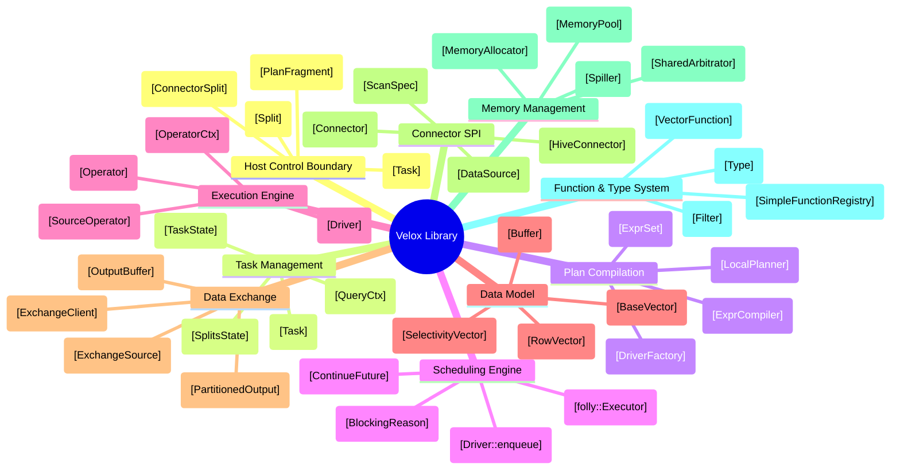

---

## Detailed Module Breakdown

Base path: `velox/velox/velox/`
- `velox/exec/` → abbreviated as `exec.`
- `velox/core/` → abbreviated as `core.`
- `velox/vector/` → abbreviated as `vec.`
- `velox/buffer/` → abbreviated as `buf.`
- `velox/expression/` → abbreviated as `expr.`
- `velox/common/memory/` → abbreviated as `mem.`
- `velox/connectors/` → abbreviated as `conn.`
- `velox/serializers/` → abbreviated as `ser.`
- `velox/functions/` → abbreviated as `fn.`
- `velox/type/` → abbreviated as `type.`
- `velox/dwio/` → abbreviated as `dwio.`
- External: Meta's `folly` library (Executor, SemiFuture, Synchronized, F14Map)

### 1. Host Control Boundary (No HTTP — Library API)
Velox is a C++ library, not a server. There is no REST endpoint. The host application (Prestissimo, Spark/Gluten, unit tests) calls C++ methods directly. Contrast with Trino, where `TaskResource` exposes REST endpoints.

| Class | Path | Role |
|-------|------|------|
| `Task` | `exec.Task` | **Sole entry point.** Accepts `PlanFragment`, manages drivers/pipelines, receives incremental `Split` delivery. Equivalent to Trino's `SqlTask` + `SqlTaskExecution` combined. |
| `PlanFragment` | `core.PlanFragment` | Unit of work: wraps a `PlanNode` tree + execution strategy (ungrouped/grouped) + split group count. |
| `Split` | `exec.Split` | Data-location descriptor: `shared_ptr<ConnectorSplit>` + `groupId` + optional `BarrierSplit`. Pushed by host via `Task::addSplit()`. |
| `ConnectorSplit` | `conn.Connector` | Abstract base. Concrete: `HiveConnectorSplit` (file path, byte range, partition keys), `RemoteConnectorSplit` (upstream task ID for exchange). |
| `TaskUpdateRequest` | *(N/A — no REST)* | No equivalent. The host constructs C++ objects directly: `Task::create()`, `addSplit()`, `noMoreSplits()`, `updateOutputBuffers()`. Zero serialization at the API boundary. |

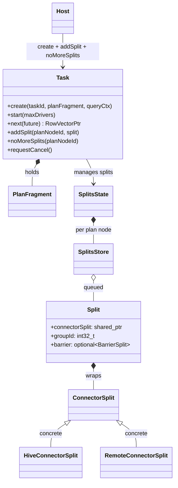

### 2. Task Management
Lifecycle of tasks within the engine. The `Task` class serves as both registry and execution orchestrator — unlike Trino where `SqlTaskManager`, `SqlTask`, and `SqlTaskExecution` are separate classes.

| Class | Path | Role |
|-------|------|------|
| `Task` | `exec.Task` | Central orchestrator. Owns drivers, splits state, memory pools, lifecycle. Uses `std::timed_mutex` for all state. |
| `TaskState` | `exec.TaskStructs` | Enum: `kRunning → kFinished / kCanceled / kAborted / kFailed`. Simpler than Trino's 10-state `TaskStateMachine`. |
| `SplitsState` | `exec.TaskStructs` | Per-plan-node split tracking. Contains `SplitsStore` per split group. |
| `SplitsStore` | `exec.TaskStructs` | FIFO queue of `Split` objects. Returns splits to requesting drivers via `ContinuePromise` when available. |
| `QueryCtx` | `core.QueryCtx` | Per-query resource context. Owns root `MemoryPool`, `folly::Executor`, connector configs. Equivalent to Trino's `QueryContext`. |
| `TaskStats` | `exec.TaskStats` | Aggregated statistics: per-pipeline, per-operator timing, memory, rows. |

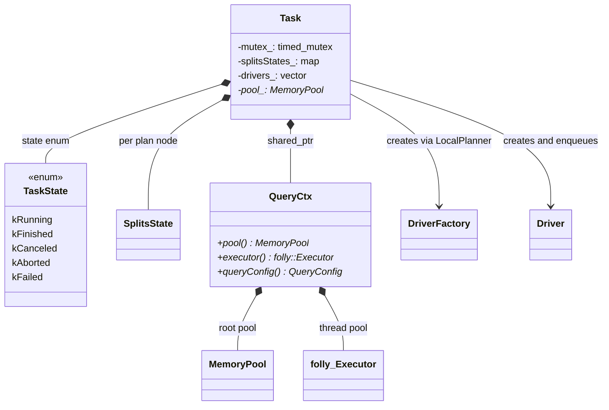

### 3. Plan Compilation
Translates a `PlanFragment` into executable operator pipelines. The `LocalPlanner` is a direct analog of Trino's `LocalExecutionPlanner`.

| Class | Path | Role |
|-------|------|------|
| `LocalPlanner` | `exec.LocalPlanner` | Walks `PlanNode` tree → `vector<DriverFactory>`. Detects pipeline boundaries (e.g., hash join → build + probe). Fuses consecutive Filter+Project into `FilterProject`. |
| `DriverFactory` | `exec.DriverFactory` | Blueprint for `Driver` creation. Holds `Operator` factories in pipeline order. Knows if pipeline uses grouped execution, needs splits, or is the output pipeline. |
| `PlanNode` | `core.PlanNode` | Abstract base: `ISerializable`. 20+ subclasses: `TableScanNode`, `FilterNode`, `ProjectNode`, `AggregationNode`, `HashJoinNode`, `OrderByNode`, `ExchangeNode`, `PartitionedOutputNode`, `ValuesNode`, etc. |
| `ExprCompiler` | `expr.ExprCompiler` | Compiles `TypedExpr` trees (from planner) into `Expr` trees (for evaluation). Performs CSE deduplication via `Scope::visited`, resolves functions from registries. No JIT — contrast with Trino's `ExpressionCompiler` which generates bytecode. |
| `ExprSet` | `expr.ExprSet` | Compiled expression artifact: holds a vector of `Expr` trees. Applied by `FilterProject` operator. Equivalent to Trino's `PageProcessor`. |

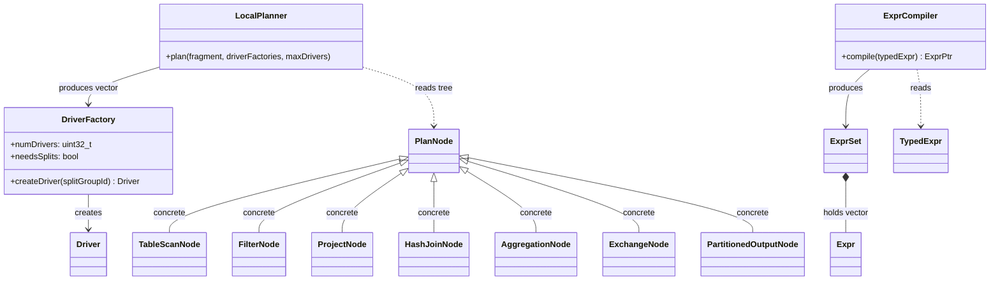

### 4. Scheduling Engine
Velox delegates thread management to the host's `folly::Executor`. There is no built-in priority queue or multilevel feedback — contrast with Trino's `TimeSharingTaskExecutor` + `MultilevelSplitQueue`.

| Class | Path | Role |
|-------|------|------|
| `folly::Executor` | *(external)* | Thread pool provided by host via `QueryCtx`. `Driver::enqueue()` submits drivers as tasks. The executor decides scheduling. |
| `Driver::enqueue()` | `exec.Driver` | Static method: submits a driver to the executor. The driver's `run()` method executes cooperatively and re-enqueues itself if not finished. |
| `ContinueFuture` | `exec.Driver` | `folly::SemiFuture<folly::Unit>`. When a driver blocks (I/O, memory, barrier), it captures a future and goes off-thread. Future fulfillment re-enqueues the driver. Equivalent to Trino's `ListenableFuture`. |
| `BlockingReason` | `exec.BlockingReason` | 13 variants: `kNotBlocked`, `kWaitForSplit`, `kWaitForProducer`, `kWaitForConsumer`, `kWaitForJoinBuild`, `kWaitForJoinProbe`, `kWaitForMemory`, `kWaitForSpill`, etc. Finer-grained than Trino's boolean blocked state. |
| `BlockingState` | `exec.Driver` | Captures the `ContinueFuture` + `BlockingReason` + operator pointer when a driver blocks. |
| Cooperative yield | `exec.Driver` | `checkIfYieldNeeded()`: yields after configurable time quantum (`driverCpuTimeSliceLimitMs`, default 0 = no forced yield). Contrast Trino's strict 1-second quanta via `DriverYieldSignal`. |

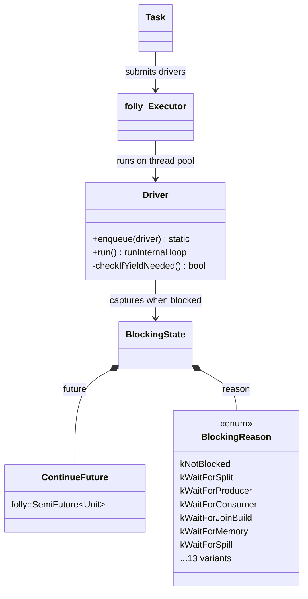

### 5. Execution Engine
The computation core. Drivers shuttle `RowVector` batches through `Operator` chains. Near-identical Volcano-style contract to Trino.

| Class | Path | Role |
|-------|------|------|
| `Driver` | `exec.Driver` | Execution unit. Single-threaded cooperative loop (`runInternal()`). Walks operator chain calling `isBlocked()` / `needsInput()` / `getOutput()` / `addInput()`. Never blocks a thread. |
| `DriverCtx` | `exec.Driver` | Per-driver context. Links to `Task`, pipeline ID, driver ID, split group ID. |
| `Operator` | `exec.Operator` | Base class. 5-method Volcano contract: `needsInput()`, `addInput(RowVectorPtr)`, `getOutput() -> RowVectorPtr`, `isBlocked(ContinueFuture*)`, `isFinished()`, `noMoreInput()`. Near-identical to Trino's `Operator` interface. |
| `SourceOperator` | `exec.Operator` | Subclass for pipeline-start operators. `needsInput()` returns false, `addInput()` throws. Generates data via `getOutput()`. |
| `OperatorCtx` | `exec.Operator` | Per-operator resource tracking. Holds `MemoryPool*`, `DriverCtx*`, plan node ID. Lighter than Trino's `OperatorContext` (no revocable/user split). |
| `CALL_OPERATOR` | `exec.Operator` | Macro wrapping every operator call with `NonReclaimableSectionGuard`, stats tracking, `OpCallStatus` for deadlock detection. |
| **Key operators** | `exec.*` | `FilterProject`, `HashBuild`, `HashProbe`, `HashAggregation`, `OrderBy`, `Limit`, `TableScan`, `Exchange`, `PartitionedOutput`, `LocalPartition`, `LocalExchange`, `MergeJoin`, `NestedLoopJoinBuild/Probe`, `MarkDistinct`, `WindowBuild`, `TopN`, `Values`. |

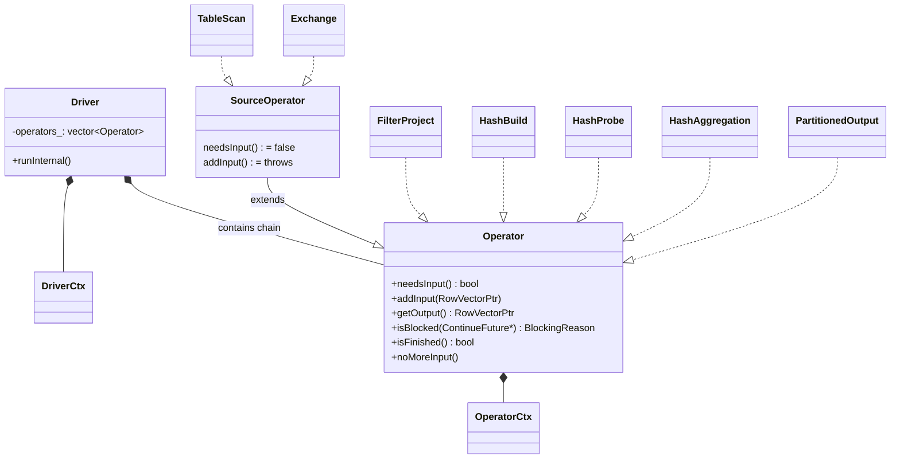

### 6. Data Model
In-memory columnar representation. Custom C++ vectors with encoding-aware fast paths — not Arrow arrays.

| Class | Path | Role |
|-------|------|------|
| `Buffer` | `buf.Buffer` | Contiguous raw memory. Reference-counted via `atomic_int32_t`. `AlignedBuffer` places header + data in a single allocation (64-byte aligned). Mutable iff `refCount == 1`. Equivalent to Trino's `Slice`. |
| `BaseVector` | `vec.BaseVector` | Abstract base for all columnar vectors. Properties: `TypePtr`, `VectorEncoding`, `BufferPtr nulls`, `length`, `pool`. Equivalent to Trino's `Block`. |
| `FlatVector<T>` | `vec.FlatVector` | Dense typed array: `Buffer` values + `Buffer` nulls bitmap. Equivalent to Trino's `LongArrayBlock`/`VariableWidthBlock`. |
| `DictionaryVector` | `vec.DictionaryVector` | Index indirection: `BufferPtr indices` → `BaseVector dictionary`. Zero-copy projection. Equivalent to Trino's `DictionaryBlock`. |
| `ConstantVector` | `vec.ConstantVector` | Single value × position count. Equivalent to Trino's `RunLengthEncodedBlock`. |
| `RowVector` | `vec.ComplexVector` | Column container: `vector<VectorPtr> children` + shared `nulls`. Equivalent to Trino's `Page`. Zero-copy column selection. |
| `ArrayVector` | `vec.ComplexVector` | Variable-length arrays: `offsets Buffer` + `sizes Buffer` + `elements Vector`. |
| `MapVector` | `vec.ComplexVector` | Key-value maps: `offsets` + `sizes` + `keys Vector` + `values Vector`. |
| `SelectivityVector` | `vec.SelectivityVector` | Bitmask of active rows. Drives vectorized evaluation — `applyToSelected()` generates auto-vectorizable loops when `isAllSelected()`. No Trino equivalent (Trino processes all rows). |
| `DecodedVector` | `vec.DecodedVector` | Normalizes any encoding to a flat view for uniform access. Peels dictionary/constant layers. |
| `StringView` | `type.StringView` | 16-byte inline string: 4-byte size + 4-byte inline prefix + 8-byte pointer. Enables prefix comparisons without pointer chase. Velox-specific — deviates from Arrow's contiguous string layout (see VELOX_IMPLEMENTATION_CHALLENGES.md). |

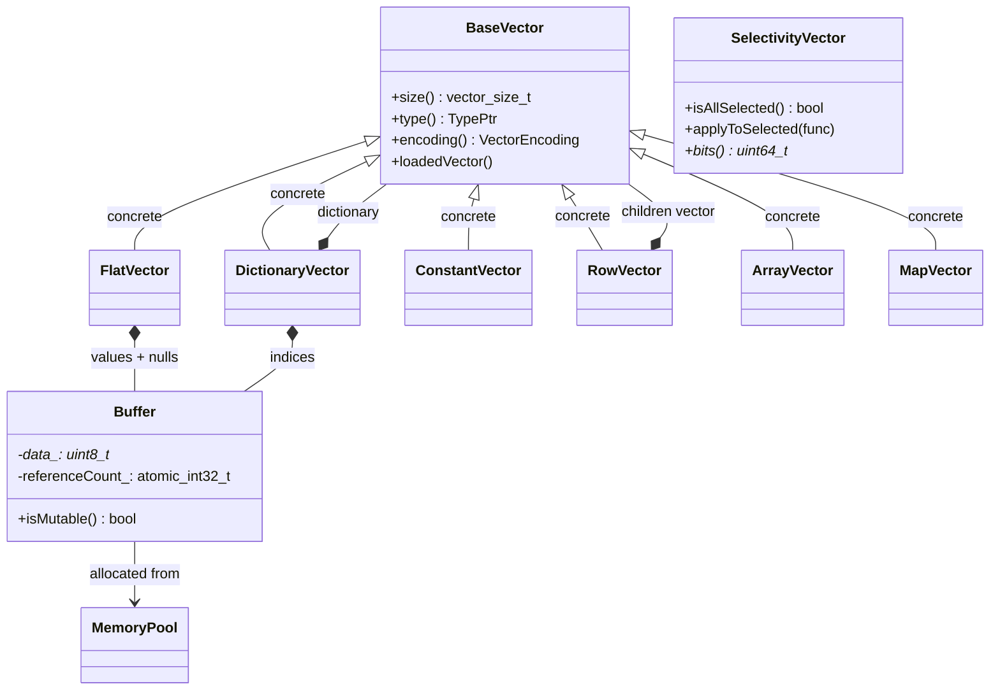

### 7. Data Exchange
Inter-task shuffle. Velox handles serialization, buffering, and fetch coordination but delegates network transport to the host.

| Class | Path | Role |
|-------|------|------|
| **Producer side** | | |
| `PartitionedOutput` | `exec.PartitionedOutput` | Terminal (sink) operator. Hashes rows via `PartitionFunction`, serializes via `VectorSerde` on the driver thread, enqueues into `OutputBufferManager`. Returns `nullptr` from `getOutput()`. Equivalent to Trino's `PartitionedOutputOperator`. |
| `OutputBuffer` | `exec.OutputBuffer` | Per-task buffer holding N `DestinationBuffer` queues. Three modes: `kPartitioned`, `kBroadcast`, `kArbitrary`. Equivalent to Trino's `PartitionedOutputBuffer` / `BroadcastOutputBuffer` / `ArbitraryOutputBuffer`. |
| `OutputBufferManager` | `exec.OutputBufferManager` | Global singleton registry: `taskId → OutputBuffer`. |
| `DestinationBuffer` | `exec.OutputBuffer` | Per-consumer FIFO. Sequence-based acknowledgement (TCP-style sliding window). Callback-based pull (`DataAvailableCallback`) — contrast Trino's `ListenableFuture`. |
| `detail::Destination` | `exec.PartitionedOutput` | Per-partition serialization state. Randomized flush threshold (70-120% of nominal) to prevent bursty traffic. |
| `PrestoVectorSerde` | `ser.PrestoSerializer` | Columnar wire format. Optional LZ4/ZSTD compression. Also used for spilling. Equivalent to Trino's `CompressingEncryptingPageSerializer`. |
| `HashPartitionFunction` | `exec.HashPartitionFunction` | Hash-based partition assignment using `VectorHasher`. Local exchange uses `localExchangeHash()` (reverse + XXH32) to decorrelate from remote hash bits. |
| **Consumer side** | | |
| `Exchange` | `exec.Exchange` | Source operator. Pulls `RemoteConnectorSplit`s from Task's split store, feeds them to `ExchangeClient`. Only driver 0 manages splits. Equivalent to Trino's `ExchangeOperator`. |
| `ExchangeClient` | `exec.ExchangeClient` | Fetch coordinator. Manages multiple `ExchangeSource` instances, memory budget (32 MB default), request scheduling. Two-phase fetch: size probe → data transfer. Equivalent to Trino's `DirectExchangeClient`. |
| `ExchangeSource` | `exec.ExchangeSource` | **Transport boundary.** Abstract interface: `request()`, `requestDataSizes()`, `pause()`, `close()`. Host registers factory. No HTTP/gRPC import — fully pluggable. Contrast Trino's tightly-coupled `HttpPageBufferClient`. |
| `ExchangeQueue` | `exec.ExchangeQueue` | Thread-safe buffer of `SerializedPageBase`. Shared across pipeline drivers. Proportional consumer wake-up prevents thundering herd. |

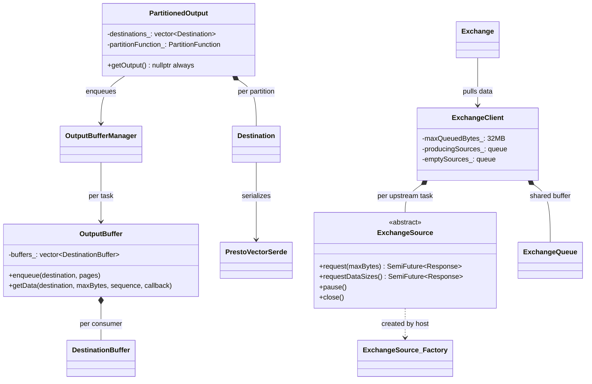

### 8. Connector Interface (Storage SPI)
The boundary between the engine and external data sources. Trait-based pluggability.

| Class | Path | Role |
|-------|------|------|
| **Read path** | | |
| `Connector` | `conn.Connector` | Abstract interface: `createDataSource()`, `createDataSink()`, `canAddDynamicFilter()`, `supportsSplitPreload()`. Equivalent to Trino's `Connector` SPI. |
| `ConnectorFactory` | `conn.Connector` | Factory: `newConnector(id, properties) → Connector`. |
| `DataSource` | `conn.Connector` | Abstract: `addSplit()`, `next(size, future) → optional<RowVectorPtr>`, `addDynamicFilter()`. Equivalent to Trino's `ConnectorPageSource`. |
| `HiveConnector` | `conn.hive.HiveConnector` | Hive-compatible data source. Reads Parquet, ORC, DWRF via DWIO framework. |
| `HiveDataSource` | `conn.hive.HiveDataSource` | Concrete `DataSource`. Builds `ScanSpec` tree in constructor, processes splits via `SplitReader`. |
| `SplitReader` | `conn.hive.SplitReader` | Owns the DWIO row reader. Creates `SelectiveColumnReader`s per column. |
| `TableScan` | `exec.TableScan` | Source operator that drives splits through `DataSource`. Pulls splits from Task's split store. |
| **Filter pushdown** | | |
| `SubfieldFilters` | `type.Filter` | `unordered_map<Subfield, FilterPtr>`. Single-column comparisons pushed into DWIO decode layer. SIMD-accelerated `testValues(batch)`. Equivalent to Trino's `TupleDomain<ColumnHandle>` but supports nested paths. |
| `ScanSpec` | `dwio.common.ScanSpec` | Unified filter + projection tree mirroring column nesting. Each node carries filter, channel, projectOut flag. Velox-specific — no Trino equivalent. |
| `MetadataFilter` | `conn.hive.HiveConnectorUtil` | Boolean expression tree for row-group/stripe pruning via column statistics. |
| `PushdownFilters` | `exec.Driver` | Shared filter state across drivers: static + dynamic filters merged via `Filter::mergeWith()`. |
| **Write path** | | |
| `DataSink` | `conn.Connector` | Abstract: `appendData()`, `close()`. Equivalent to Trino's `ConnectorPageSink`. |
| `HiveInsertTableHandle` | `conn.hive` | Write configuration for Hive tables. |

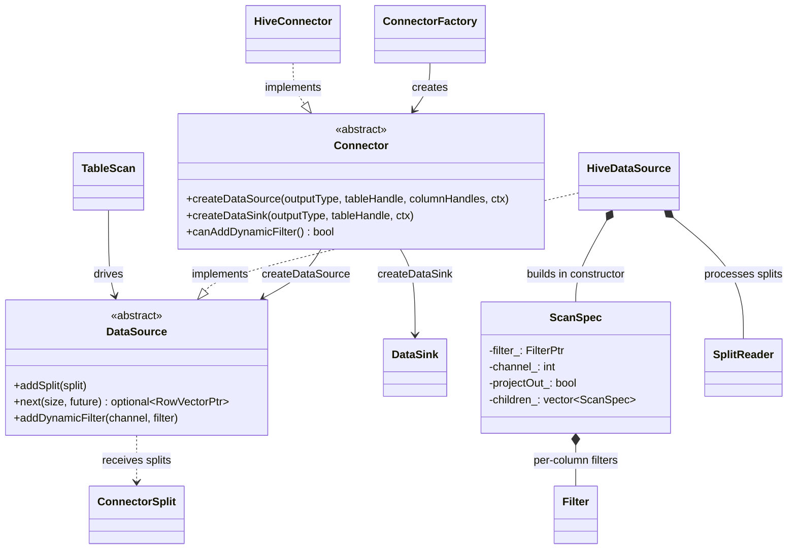

### 9. Memory Management
Three-component architecture: pool tree for accounting, allocator for physical bytes, arbitrator for capacity governance. See VELOX_IMPLEMENTATION_CHALLENGES.md for the cross-language JNI motivation.

| Class | Path | Role |
|-------|------|------|
| **Pool tree** | | |
| `MemoryPool` | `mem.MemoryPool` | 4-level tree: Root (query) → Task → Node → Operator (leaf). Only leaves allocate. Quantized reservation (1/4/8 MB tiers) reduces parent chain updates. Equivalent to Trino's `MemoryPool` + `MemoryTrackingContext` hierarchy. |
| `MemoryManager` | `mem.Memory` | Process singleton. Owns allocator, arbitrator, tracks all root pools via `weak_ptr`. |
| **Allocator** | | |
| `MemoryAllocator` | `mem.MemoryAllocator` | Abstract: three modes — non-contiguous `Allocation` (page runs), contiguous `ContiguousAllocation` (single mmap), raw bytes. |
| `MmapAllocator` | `mem.MmapAllocator` | Pre-maps full capacity for 9 size classes (4KB–1MB). Dual bitmaps (`pageAllocated_`/`pageMapped_`) with SIMD scanning. Physical pages fungible via `madvise(MADV_DONTNEED)`. No Trino equivalent (JVM manages heap). |
| `MallocAllocator` | `mem.MallocAllocator` | Delegates to `std::malloc`. Sharded `ConcurrentCounter` for low-contention accounting. |
| `Allocation` | `mem.Allocation` | Non-contiguous: vector of `PageRun` (pointer + page count packed in 8 bytes via x86-64 48-bit address trick). |
| `ContiguousAllocation` | `mem.Allocation` | Single mmap region. Supports over-reservation (`maxSize > size`) for growth without remapping. |
| **Arbitrator** | | |
| `MemoryArbitrator` | `mem.MemoryArbitrator` | Abstract interface for dynamic capacity management. |
| `SharedArbitrator` | `mem.SharedArbitrator` | Production implementation. 6-phase cascade: self-growth → local self-reclaim → free capacity → harvest from others → global arbitration (background controller thread). Equivalent to Trino's `MemoryRevokingScheduler` but synchronous and deterministic. |
| `ArbitrationParticipant` | `mem.ArbitrationParticipant` | Per-query wrapper. Serializes arbitration per pool. Exponential growth (2× < 512MB, then 25%). |
| **Spilling** | | |
| `Spiller` / `SpillerBase` | `exec.Spiller` | Multi-stream spill. Serializes via `PrestoVectorSerde` to temp files. Recursive spilling up to 4 levels via `SpillPartitionId`. |
| `MemoryReclaimer` | `exec.MemoryReclaimer` | Per-pool reclaimer. `Task::MemoryReclaimer` pauses task before spilling. `Operator::MemoryReclaimer` checks `nonReclaimableSection_`. |
| `NonReclaimableSectionGuard` | `mem.MemoryArbitrator` | RAII guard marking critical sections. Arbitrator skips these operators. |

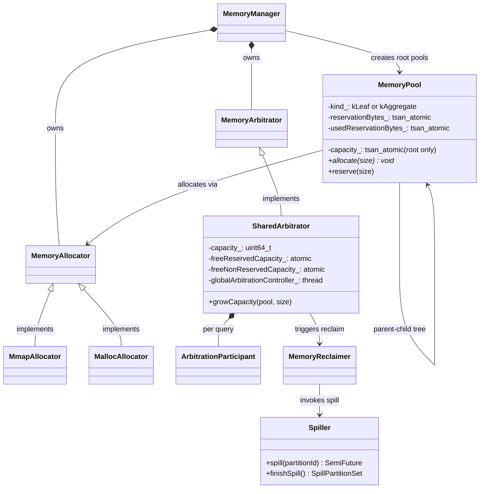

### 10. Function Registry & Type System
Extensible function system with dialect-aware registration (Presto vs Spark). See VELOX_IMPLEMENTATION_CHALLENGES.md for the semantic gap challenge.

| Class | Path | Role |
|-------|------|------|
| **Type system** | | |
| `Type` | `type.Type` | Abstract base: `ISerializable`. `TypeKind` enum: BOOLEAN, TINYINT–BIGINT, REAL, DOUBLE, VARCHAR, VARBINARY, TIMESTAMP, ARRAY, MAP, ROW, UNKNOWN. |
| `RowType` | `type.Type` | Struct type: named fields. Schema equivalent. |
| `Filter` | `type.Filter` | Predicate hierarchy for pushdown: `BigintRange`, `BytesRange`, `BigintValuesUsingHashTable`, `BigintValuesUsingBloomFilter`, `IsNull`, `IsNotNull`, `NegatedBytesValues`, etc. SIMD-accelerated `testValues()`. |
| `Subfield` | `type.Subfield` | Nested column path: `a.b[1].c`. Path elements: `NestedField`, `LongSubscript`, `StringSubscript`, `AllSubscripts`. |
| **Function registry** | | |
| `SimpleFunctionRegistry` | `expr.SimpleFunctionRegistry` | Registers simple (row-level) scalar functions. Wrapped by `SimpleFunctionAdapter` for vectorized execution. |
| `VectorFunction` | `expr.VectorFunction` | Interface for batch-level functions operating on `BaseVector` directly. |
| `VectorFunctionRegistry` | `expr.VectorFunction` | Registry for vector functions. |
| `AggregateFunction` | `fn.aggregate` | Interface: `addRawInput()`, `addIntermediateResults()`, `extractValues()`. |
| **Dialect packages** | | |
| `functions/prestosql/` | `fn.prestosql` | Presto-compatible function implementations. |
| `functions/sparksql/` | `fn.sparksql` | Spark-compatible function implementations (different null handling, type promotion, error semantics). |
| `functions/lib/` | `fn.lib` | Shared function implementations used by both dialects. |

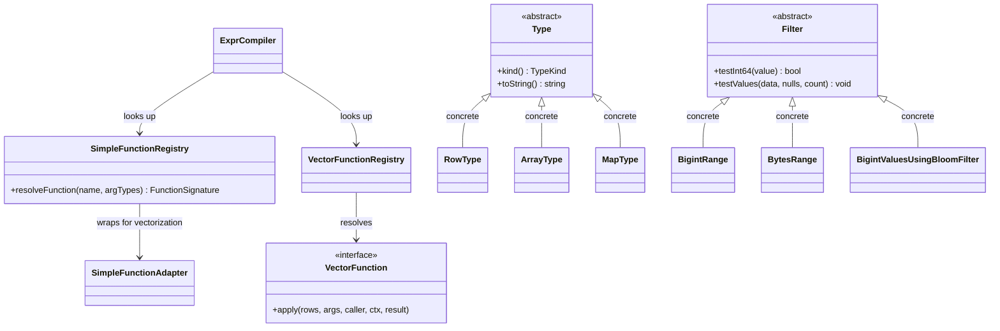

---

## Data Flow: How Modules Connect

```
                          ┌─────────────────────────────────────────────────────────────┐
                          │              HOST APPLICATION                               │
                          │  Prestissimo (C++ HTTP worker)                              │
                          │  Spark/Gluten (JNI bridge)                                  │
                          │  Unit tests (direct C++ calls)                              │
                          └──────────┬──────────────────────────────────────────────────┘
                                     │ C++ function calls (no REST, no serialization)
                          ┌──────────▼──────────────────────────────────────────────────┐
                          │            [Host Control Boundary]                          │
                          │  Task::create(planFragment, queryCtx)                       │
                          │  Task::start(maxDrivers)                                    │
                          │  Task::addSplit(planNodeId, Split)                          │
                          │  Task::noMoreSplits()                                       │
                          └──────────┬──────────────────────────────────────────────────┘
                                     │
                          ┌──────────▼──────────────────────────────────────────────────┐
                          │               [Task Management]                             │
                          │  Task (orchestrator, single timed_mutex)                    │
                          │  SplitsState → SplitsStore (promise-based rendezvous)       │
                          │  TaskState: kRunning → kFinished/kCanceled/kAborted/kFailed │
                          └──────────┬───────────────────┬──────────────────────────────┘
                                     │                   │ PlanFragment
                          ┌──────────▼───────┐ ┌────────▼──────────────────────────────┐
                          │   SPLIT ROUTING  │ │       [Plan Compilation]              │
                          │  addSplit() →    │ │  LocalPlanner::plan()                 │
                          │  SplitsStore →   │ │  PlanNode → DriverFactory[]           │
                          │  unblock driver  │ │  ExprCompiler → ExprSet               │
                          └──────────┬───────┘ └────────┬──────────────────────────────┘
                                     │                   │ DriverFactory[]
                          ┌──────────▼───────────────────▼──────────────────────────────┐
                          │               [Scheduling Engine]                            │
                          │  folly::Executor (host-provided thread pool)                │
                          │  Driver::enqueue() → cooperative run loop                   │
                          │  ContinueFuture re-enqueues on unblock                     │
                          └──────────┬──────────────────────────────────────────────────┘
                                     │ cooperative quanta
                          ┌──────────▼──────────────────────────────────────────────────┐
                          │               [Execution Engine]                             │
                          │  Driver (single-threaded operator chain walk)                │
                          │  isBlocked → needsInput → getOutput → addInput              │
                          │  ┌──────────┐   ┌──────────┐   ┌──────────┐                │
                          │  │ Source   │──▶│Transform │──▶│  Sink    │                │
                          │  │ Operator │   │ Operator │   │ Operator │                │
                          │  └────┬─────┘   └──────────┘   └────┬─────┘                │
                          │       │        RowVector            │                      │
                          └───────┼──────────────────────────────┼──────────────────────┘
                                  │                              │
                    ┌─────────────▼────────┐          ┌─────────▼─────────────┐
                    │   [Connector SPI]    │          │   [Data Exchange]     │
                    │  Connector →         │          │  PartitionedOutput    │
                    │    DataSource         │          │  OutputBuffer         │
                    │    HiveDataSource     │          │  PrestoVectorSerde    │
                    │    ScanSpec tree      │          │  ExchangeClient       │
                    │    SubfieldFilters    │          │  ExchangeSource       │
                    │         │             │          │    (host-provided)    │
                    └─────────┼─────────────┘          └─────────┼─────────────┘
                              │                                  │
                     ┌────────▼────────┐              ┌─────────▼─────────┐
                     │  DWIO Framework │              │  Host Transport   │
                     │  Parquet/ORC    │              │  (HTTP, shared    │
                     │  via ObjectStore│              │   memory, etc.)   │
                     └─────────────────┘              └───────────────────┘

  CROSS-CUTTING:
  ┌─────────────────────────────────────────────────────────────────────────┐
  │  [Memory Management]                                                   │
  │  MemoryPool tree (Root → Task → Node → Operator leaf)                 │
  │  Quantized reservation (1/4/8 MB tiers) — fast path: leaf mutex only  │
  │  MmapAllocator (pre-mapped size classes, dual bitmaps, SIMD scanning) │
  │  SharedArbitrator → pause task → spill → resume (or abort)            │
  └─────────────────────────────────────────────────────────────────────────┘
  ┌─────────────────────────────────────────────────────────────────────────┐
  │  [Data Model] (passive, used everywhere)                               │
  │  Buffer → BaseVector (Flat | Dictionary | Constant) → RowVector       │
  │  SelectivityVector bitmask gates all vectorized evaluation             │
  │  StringView (16-byte inline prefix + pointer, not Arrow layout)       │
  └─────────────────────────────────────────────────────────────────────────┘
```

### Request Lifecycle (end-to-end)

1. **Host** calls `Task::create(taskId, planFragment, queryCtx, kParallel)` — constructs Task, walks plan tree to discover split-requiring leaf nodes, builds `splitsStates_` map
2. **Host** calls `Task::start(maxDrivers)` — delegates to `LocalPlanner::plan()` which compiles `PlanNode` tree into `vector<DriverFactory>`. Fuses Filter+Project, splits hash join into build+probe pipelines
3. **Expression compilation**: `ExprCompiler` converts `TypedExpr` trees into `Expr` evaluation trees with CSE deduplication. No JIT — compensates via template specialization, encoding peeling, adaptive conjunct reordering
4. **Task** creates `Driver` instances from factories, enqueues them onto `folly::Executor` via `Driver::enqueue()`
5. **Host** pushes splits incrementally: `Task::addSplit(scanNodeId, Split(HiveConnectorSplit(...)))`. Blocked drivers are unblocked via `ContinuePromise` fulfillment (outside the mutex)
6. **Executor thread** runs `Driver::runInternal()` — cooperative loop walking operator chain: `isBlocked()` → `needsInput()` → `getOutput()` → `addInput()`. Processes entire columnar batches gated by `SelectivityVector`
7. **Source operators** (`TableScan`) pull splits from `SplitsStore`, create `DataSource` via `Connector::createDataSource()`, read data via `DataSource::next()`. `ScanSpec` tree pushes filters into DWIO decode layer
8. **Transform operators** (`FilterProject`, `HashAggregation`) process `RowVector` batches. Hash join uses split pipelines: `HashBuild` accumulates into `HashTable`, barrier elects last driver to merge, `HashJoinBridge` passes table to `HashProbe`
9. **Sink operators** (`PartitionedOutput`) hash rows, serialize via `PrestoVectorSerde` on driver thread, enqueue into `OutputBuffer`
10. **Downstream consumers** (host HTTP handler or in-process) pull via `OutputBuffer::getData(destination, maxBytes, sequence, callback)` — sequence-based acknowledgement frees memory
11. **Exchange operators** fetch upstream data via `ExchangeClient` → `ExchangeSource` (host-provided transport). Two-phase fetch, progressive fetching via `folly::collectAny` on split + data futures
12. Each **operator** reserves memory via quantized `MemoryPool::reserve()`. Fast path: leaf mutex only. Slow path: propagates to root → `SharedArbitrator::growCapacity()` blocks requesting thread
13. Under memory pressure: arbitrator tries self-growth → local self-reclaim → free capacity from other pools → global arbitration (background controller thread pauses tasks, spills via `Spiller`, or aborts youngest/lowest-priority query)
14. When all drivers finish → `Task::checkIfFinishedLocked()` transitions to `kFinished`. Memory pools release up the hierarchy
15. Cleanup: operator `close()` → driver destruction → pool destruction via `shared_ptr` RAII → root pool `destructionCb_` deregisters from `MemoryManager`
