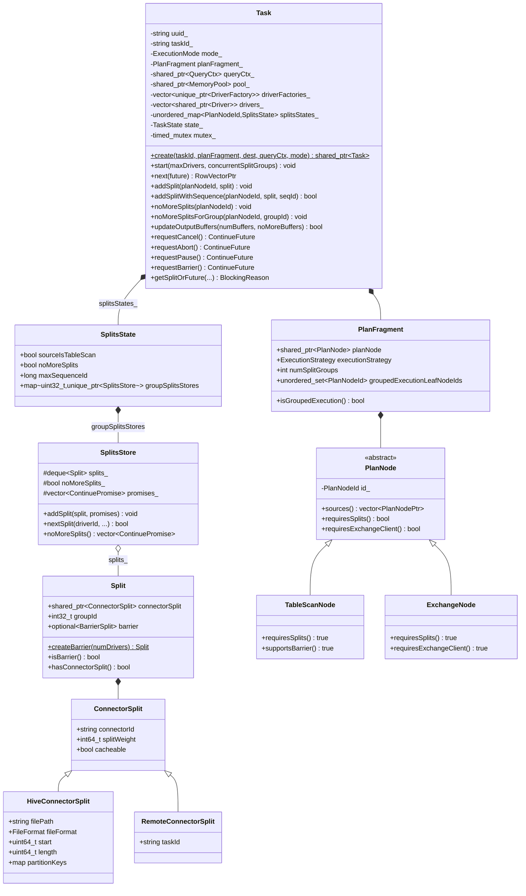
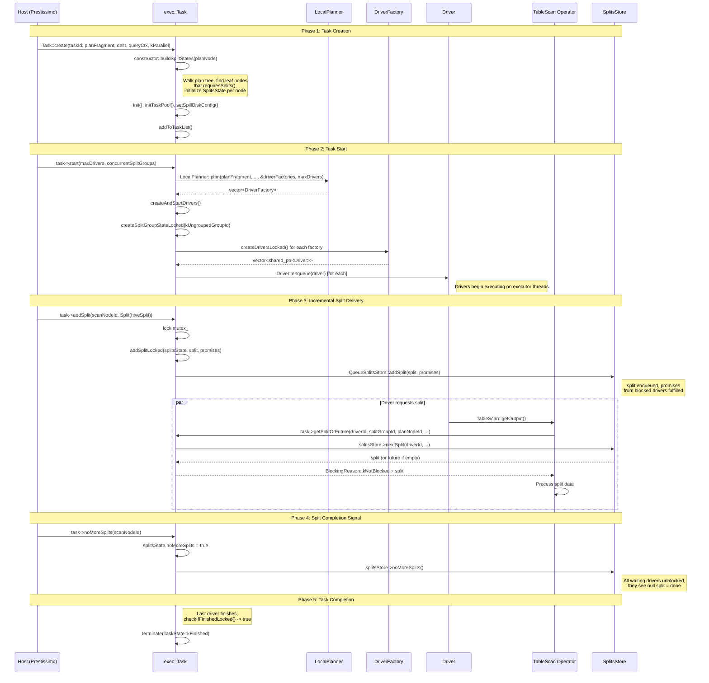

# Module Teardown: The Host Control Boundary

## Table of Contents

- [0. Research Focus](#0-research-focus)
- [1. High-Level Overview](#1-high-level-overview)
- [2. Structural Architecture](#2-structural-architecture)
  - [Primary Source Files](#primary-source-files)
  - [Key Data Structures](#key-data-structures)
  - [Class Diagram (mermaid)](#class-diagram-mermaid)
- [3. Execution & Call Flow](#3-execution-call-flow)
  - [Sequence Diagram (mermaid)](#sequence-diagram-mermaid)
  - [Step-by-step Text Breakdown](#step-by-step-text-breakdown)
- [4. Concurrency & State Management](#4-concurrency-state-management)
  - [Threading Model](#threading-model)
  - [State Machine](#state-machine)
  - [Synchronization](#synchronization)
- [5. Memory & Resource Profile](#5-memory-resource-profile)
  - [Allocation Pattern](#allocation-pattern)
  - [Memory Tracking](#memory-tracking)
- [6. Key Design Insights](#6-key-design-insights)
  - [1. Library-as-a-Service, Not Server-as-a-Service](#1-library-as-a-service-not-server-as-a-service)
  - [2. Splits Can Arrive Before or After start()](#2-splits-can-arrive-before-or-after-start)
  - [3. Sequence-Based Deduplication for Distributed Systems](#3-sequence-based-deduplication-for-distributed-systems)
  - [4. Grouped Execution: Dynamic Driver Lifecycle](#4-grouped-execution-dynamic-driver-lifecycle)
  - [5. Dual Execution Modes With a Single Task Class](#5-dual-execution-modes-with-a-single-task-class)
  - [6. Barrier Processing: Streaming Micro-Batch Within a Task](#6-barrier-processing-streaming-micro-batch-within-a-task)
  - [7. Contrast with DataFusion's Programmatic API](#7-contrast-with-datafusions-programmatic-api)
  - [8. The splitsStates_ Map as the Central Coordination Structure](#8-the-splitsstates_-map-as-the-central-coordination-structure)


## 0. Research Focus
* **Task ID:** 4.1
* **Focus:** Velox does not have a REST server; the host application (e.g., Prestissimo) feeds it. Trace the C++ API boundary where the host pushes `PlanNode` fragments and incrementally adds `exec::Split`s to a running `Task`.

## 1. High-Level Overview
* **Core Responsibility:** The `exec::Task` class is the single, library-level entry point through which any host application (Prestissimo, Spark Gluten, DuckDB-Velox, unit tests) submits work to the Velox execution engine. It accepts a `PlanFragment` (an immutable plan tree), creates drivers/pipelines internally, and then allows the host to incrementally feed `Split` objects that point to data sources. The host also controls output buffer sizing, barrier processing, pausing, cancellation, and task lifecycle.
* **Key Triggers:**
  1. `Task::create()` -- host constructs a Task from a PlanFragment
  2. `Task::start()` -- host triggers parallel multi-threaded execution
  3. `Task::next()` -- host pulls results one batch at a time in serial mode
  4. `Task::addSplit()` / `Task::addSplitWithSequence()` -- host pushes data-location descriptors
  5. `Task::noMoreSplits()` -- host signals end of input
  6. `Task::updateOutputBuffers()` -- host adjusts downstream consumer count
  7. `Task::requestCancel()` / `Task::requestAbort()` -- host terminates execution

## 2. Structural Architecture

### Primary Source Files
| File | Role |
|------|------|
| `velox/exec/Task.h` / `Task.cpp` | Central orchestrator; owns drivers, splits state, lifecycle |
| `velox/exec/Split.h` | Split wrapper: ConnectorSplit + groupId + optional BarrierSplit |
| `velox/exec/BarrierSplit.h` | Special split for drain/barrier signaling |
| `velox/core/PlanFragment.h` | Wraps a PlanNode tree with execution strategy metadata |
| `velox/core/PlanNode.h` | Abstract PlanNode hierarchy (TableScanNode, ExchangeNode, etc.) |
| `velox/exec/TaskStructs.h` | SplitsState, SplitsStore, SplitGroupState, TaskState enum |
| `velox/connectors/Connector.h` | ConnectorSplit base class |
| `velox/connectors/hive/HiveConnectorSplit.h` | Concrete split: file path, offset, length, partition keys |
| `velox/exec/Exchange.h` | RemoteConnectorSplit: task ID for inter-node shuffle |
| `velox/exec/LocalPlanner.h` | Converts PlanFragment into DriverFactory vector |

### Key Data Structures

**PlanFragment** -- The unit of work submitted to a Task:
```cpp
struct PlanFragment {
  std::shared_ptr<const core::PlanNode> planNode;  // root of plan tree
  ExecutionStrategy executionStrategy{ExecutionStrategy::kUngrouped};
  int numSplitGroups{0};
  std::unordered_set<PlanNodeId> groupedExecutionLeafNodeIds;
};
```

**Split** -- A data-location descriptor pushed by the host:
```cpp
struct Split {
  std::shared_ptr<velox::connector::ConnectorSplit> connectorSplit{nullptr};
  int32_t groupId{-1};  // Bucketed group id (-1 means 'none')
  std::optional<BarrierSplit> barrier;
};
```

**ConnectorSplit** -- Abstract base for connector-specific split data:
```cpp
struct ConnectorSplit : public ISerializable {
  const std::string connectorId;
  const int64_t splitWeight{0};
  const bool cacheable{true};
  std::unique_ptr<AsyncSource<DataSource>> dataSource;
};
```

**HiveConnectorSplit** -- Concrete example (file-based):
```cpp
struct HiveConnectorSplit : public ConnectorSplit {
  const std::string filePath;
  dwio::common::FileFormat fileFormat;
  const uint64_t start;   // byte offset
  const uint64_t length;  // byte range
  const std::unordered_map<std::string, std::optional<std::string>> partitionKeys;
  std::optional<int32_t> tableBucketNumber;
  // ... infoColumns, serdeParameters, etc.
};
```

**RemoteConnectorSplit** -- For inter-node exchange:
```cpp
struct RemoteConnectorSplit : public ConnectorSplit {
  const std::string taskId;  // remote task producing data
};
```

**SplitsState** -- Per-plan-node split tracking:
```cpp
struct SplitsState {
  bool sourceIsTableScan{false};
  bool noMoreSplits{false};
  long maxSequenceId{std::numeric_limits<long>::min()};
  std::unordered_map<uint32_t, std::unique_ptr<SplitsStore>> groupSplitsStores;
};
```

**TaskState** -- Lifecycle states:
```cpp
enum class TaskState : int {
  kRunning = 0,
  kFinished = 1,
  kCanceled = 2,
  kAborted = 3,
  kFailed = 4
};
```

### Class Diagram (mermaid)



## 3. Execution & Call Flow

### Sequence Diagram (mermaid)



### Step-by-step Text Breakdown

#### Step 1: Task Construction (`Task::create`)

The host calls `Task::create()`, which is a static factory. The constructor is private, enforcing shared_ptr semantics via `enable_shared_from_this`:

```cpp
static std::shared_ptr<Task> Task::create(
    const std::string& taskId,
    core::PlanFragment planFragment,
    int destination,
    std::shared_ptr<core::QueryCtx> queryCtx,
    ExecutionMode mode,
    ConsumerSupplier consumerSupplier,
    ...) {
  VELOX_CHECK_NOT_NULL(planFragment.planNode);
  auto task = std::shared_ptr<Task>(new Task(
      taskId, std::move(planFragment), destination,
      std::move(queryCtx), mode, std::move(consumerSupplier), ...));
  task->init(std::move(spillDiskOpts));
  task->addToTaskList();
  return task;
}
```

During construction, the Task immediately walks the PlanNode tree to discover all leaf nodes that require splits (via `buildSplitStates`):

```cpp
void buildSplitStates(
    const core::PlanNode* planNode,
    std::unordered_set<core::PlanNodeId>& allIds,
    std::unordered_map<core::PlanNodeId, SplitsState>& splitStateMap) {
  // ...
  if (planNode->sources().empty()) {
    if (planNode->requiresSplits()) {
      splitStateMap[planNode->id()].sourceIsTableScan =
          (dynamic_cast<const core::TableScanNode*>(planNode) != nullptr);
    }
    return;
  }
  // recurse into sources...
}
```

This produces `splitsStates_`, a map from `PlanNodeId` to `SplitsState`. Only leaf nodes where `requiresSplits()` returns true get entries. `ValuesNode`, for example, does not require splits, so it is excluded.

#### Step 2a: Parallel Execution (`Task::start`)

For multi-threaded execution, the host calls `start()`:

```cpp
void Task::start(uint32_t maxDrivers, uint32_t concurrentSplitGroups) {
  checkExecutionMode(ExecutionMode::kParallel);
  {
    std::unique_lock<std::timed_mutex> l(mutex_);
    taskStats_.executionStartTimeMs = getCurrentTimeMs();
    if (!isRunningLocked()) { return; }
    createDriverFactoriesLocked(maxDrivers);
  }
  initializePartitionOutput();
  createAndStartDrivers(concurrentSplitGroups);
}
```

`createDriverFactoriesLocked` delegates to `LocalPlanner::plan()`, which converts the PlanFragment's plan tree into a vector of `DriverFactory` objects (one per pipeline). Each factory knows how many drivers it needs, whether it uses grouped execution, and what its leaf node is.

`createAndStartDrivers` then:
1. Creates drivers for ungrouped execution pipelines immediately
2. Enqueues them onto the executor via `Driver::enqueue(driver)`
3. For grouped execution pipelines, calls `ensureSplitGroupsAreBeingProcessedLocked()` to start processing any splits that arrived before `start()`

#### Step 2b: Serial Execution (`Task::next`)

For single-threaded mode, setup happens in `init()` rather than `start()`:

```cpp
void Task::init(...) {
  // ...
  if (mode_ != Task::ExecutionMode::kSerial) { return; }
  LocalPlanner::plan(planFragment_, nullptr, &driverFactories_, ..., 1);
  // Create drivers with splitGroupId = kUngroupedGroupId
  drivers_ = createDriversLocked(kUngroupedGroupId);
}
```

The host then calls `task->next()` in a loop. Each call runs drivers cooperatively on the calling thread, round-robining between them until one produces a result batch:

```cpp
RowVectorPtr Task::next(ContinueFuture* future) {
  // Requires all splits added OR barrier requested before first call
  for (;;) {
    for (auto i = 0; i < numDrivers; ++i) {
      auto result = driver->next(&driverFuture, driverOp, blockReason);
      if (result != nullptr) { return result; }
    }
    // If all drivers blocked, wait on futures or return nullptr
  }
}
```

#### Step 3: Incremental Split Delivery (`addSplit` / `addSplitWithSequence`)

The core of the host control boundary is the ability to push splits after the task is already running. `addSplit` is the simpler variant:

```cpp
void Task::addSplit(const core::PlanNodeId& planNodeId, exec::Split&& split) {
  RECORD_METRIC_VALUE(kMetricTaskSplitsCount, 1);
  bool isTaskRunning;
  std::vector<ContinuePromise> promises;
  {
    std::lock_guard<std::timed_mutex> l(mutex_);
    isTaskRunning = isRunningLocked();
    if (isTaskRunning) {
      addSplitLocked(getPlanNodeSplitsStateLocked(planNodeId), split, promises);
    }
  }
  // Fulfill promises OUTSIDE the lock to unblock waiting drivers
  for (auto& promise : promises) {
    promise.setValue();
  }
  // If task not running, forward remote splits to exchange client
  if (!isTaskRunning) {
    addRemoteSplit(planNodeId, split);
  }
}
```

`addSplitWithSequence` adds deduplication by comparing the split's sequence ID against a running maximum:

```cpp
bool Task::addSplitWithSequence(
    const core::PlanNodeId& planNodeId,
    exec::Split&& split, long sequenceId) {
  // ...
  if (sequenceId > splitsState.maxSequenceId) {
    addSplitLocked(splitsState, split, promises);
    added = true;
  }
  // ...
}
```

This is critical for the Prestissimo integration where the coordinator may retry split assignments.

The internal `addSplitLocked` routes splits into the correct `SplitsStore` based on the split's group ID:

```cpp
void Task::addSplitLocked(SplitsState& splitsState, const exec::Split& split,
                          std::vector<ContinuePromise>& promises) {
  if (split.isBarrier()) {
    addSplitToStoreLocked(splitsState, kUngroupedGroupId, split, promises);
    return;
  }
  ++taskStats_.numTotalSplits;
  ++taskStats_.numQueuedSplits;
  if (!split.hasGroup()) {
    addSplitToStoreLocked(splitsState, kUngroupedGroupId, split, promises);
  } else {
    const auto splitGroupId = split.groupId;
    if (seenSplitGroups_.find(splitGroupId) == seenSplitGroups_.end()) {
      seenSplitGroups_.emplace(splitGroupId);
      queuedSplitGroups_.push(splitGroupId);
      ensureSplitGroupsAreBeingProcessedLocked();
    }
    addSplitToStoreLocked(splitsState, splitGroupId, split, promises);
  }
}
```

For grouped execution, the first split in a new split group triggers driver creation for that group (via `ensureSplitGroupsAreBeingProcessedLocked`), respecting the concurrency limit.

#### Step 4: Driver-side Split Consumption (`getSplitOrFuture`)

When a TableScan operator needs data, it calls back into the Task:

```cpp
BlockingReason Task::getSplitOrFuture(
    uint32_t driverId, uint32_t splitGroupId,
    const core::PlanNodeId& planNodeId, ...,
    exec::Split& split, ContinueFuture& future) {
  std::lock_guard<std::timed_mutex> l(mutex_);
  auto& splitsStore = splitsState.groupSplitsStores[splitGroupId];
  return splitsStore->nextSplit(driverId, maxPreloadSplits, preload, split, future)
      ? BlockingReason::kNotBlocked
      : BlockingReason::kWaitForSplit;
}
```

The `QueueSplitsStore::nextSplit` implementation returns a split if one is available, or sets a blocking future if the queue is empty and no "no more splits" signal has been received:

```cpp
bool nextSplit(..., Split& split, ContinueFuture& future) override {
  if (!splits_.empty()) {
    split = getSplit(maxPreloadSplits, preload);
    return true;
  }
  if (tryGetBarrier(driverId, split)) { return true; }
  if (noMoreSplits_) { return true; }  // split remains null -> done
  future = makeFuture();  // driver will block on this
  return false;
}
```

#### Step 5: End-of-input Signal (`noMoreSplits`)

The host signals that all splits for a plan node have been sent:

```cpp
void Task::noMoreSplits(const core::PlanNodeId& planNodeId) {
  std::lock_guard<std::timed_mutex> l(mutex_);
  auto& splitsState = getPlanNodeSplitsStateLocked(planNodeId);
  splitsState.noMoreSplits = true;
  if (!planFragment_.leafNodeRunsGroupedExecution(planNodeId)) {
    // Ungrouped: mark the single split store as done
    noMoreSplitsForStore(it->second.get(), splitPromises);
  } else {
    // Grouped: mark ALL split stores as done
    for (auto& it : splitsState.groupSplitsStores) {
      noMoreSplitsForStore(it.second.get(), splitPromises);
    }
  }
  allFinished = checkNoMoreSplitGroupsLocked();
  // ...
}
```

When `checkNoMoreSplitGroupsLocked()` determines all nodes have received their "no more splits" signal and all drivers have finished, the task transitions to `kFinished`.

#### Step 6: Output Buffer Management (`updateOutputBuffers`)

For distributed execution, the host adjusts how many downstream consumers will read results:

```cpp
bool Task::updateOutputBuffers(int numBuffers, bool noMoreBuffers) {
  std::lock_guard<std::timed_mutex> l(mutex_);
  if (noMoreOutputBuffers_) { return false; }
  if (noMoreBuffers) { noMoreOutputBuffers_ = true; }
  return bufferManager->updateOutputBuffers(taskId_, numBuffers, noMoreBuffers);
}
```

This is used when the plan tree ends with a `PartitionedOutputNode` of kind `kBroadcast` or `kArbitrary`, where the number of consumers is determined dynamically.

## 4. Concurrency & State Management

### Threading Model

Velox supports two execution modes, selected at `Task::create` time:

| Mode | API | Threading | Use Case |
|------|-----|-----------|----------|
| `kParallel` | `start()` + consume from OutputBufferManager | Multi-threaded; drivers run on executor pool threads | Production distributed execution (Prestissimo) |
| `kSerial` | `next()` loop | Single-threaded; runs on caller's thread | Testing, embedded use, simple queries |

In parallel mode, drivers are enqueued via `Driver::enqueue(driver)`, which submits them to the `folly::Executor` provided by `QueryCtx`. Each driver runs independently on a thread pool thread.

The host thread (calling `addSplit`, `noMoreSplits`, etc.) is separate from driver threads. All interaction goes through the Task's mutex-protected methods.

### State Machine

```
                 +----------+
    create() --> | kRunning  |
                 +-----+----+
                       |
          +------------+----------+----------+
          |            |          |          |
     (all drivers  (user cancel) (ext err)  (exception)
      finish)         |          |          |
          |            v          v          v
    +-----v-----+ +--------+ +--------+ +--------+
    | kFinished  | |kCanceled| |kAborted| | kFailed|
    +-----------+ +--------+ +--------+ +--------+
```

The Task starts in `kRunning` and transitions to exactly one terminal state:
- **kFinished** -- All output produced, all drivers done, output consumed
- **kCanceled** -- Host called `requestCancel()` (user-initiated)
- **kAborted** -- Host called `requestAbort()` (failure in another task)
- **kFailed** -- An exception occurred during execution (`setError()`)

Once in a terminal state, the task never returns to `kRunning`. Subsequent `addSplit` calls are silently ignored (for running-state check) or forwarded to exchange clients (for remote splits).

### Synchronization

The Task uses a **single `std::timed_mutex`** (`mutex_`) to protect all mutable state. This is a deliberate design choice -- a single coarse lock simplifies reasoning about concurrent access from host threads and driver threads:

```cpp
mutable std::timed_mutex mutex_;
```

The key synchronization pattern for split delivery:
1. Host thread acquires `mutex_`, adds split to `SplitsStore`, collects `ContinuePromise` objects
2. Host thread releases `mutex_`
3. Host thread fulfills promises **outside the lock**, which unblocks waiting driver threads

This "collect promises under lock, fulfill outside lock" pattern is pervasive (see `EventCompletionNotifier` RAII helper):

```cpp
class EventCompletionNotifier {
  // ... collects promises in activate(), fulfills them in notify()/destructor
};
```

Atomic variables are used for fast-path checks that don't need full synchronization:
- `terminateRequested_` -- checked by drivers via `shouldStop()` / `isCancelled()` without lock
- `pauseRequested_` -- checked by drivers for yield/pause decisions
- `barrierRequested_` -- checked by `underBarrier()`
- `onThreadSince_` -- for yield timing decisions

## 5. Memory & Resource Profile

### Allocation Pattern

The Task creates a hierarchy of memory pools:
1. **Task pool** (`pool_`) -- root pool for this task, child of the query's memory pool
2. **Node pools** (`nodePools_`) -- per-plan-node pools for operator memory
3. **Operator pools** -- per-driver, per-operator pools (created via `addOperatorPool`)
4. **Connector pools** -- special pools for connector I/O (created via `addConnectorPoolLocked`)

```cpp
void Task::initTaskPool() {
  // Creates pool_ as child of queryCtx_->pool()
  // with a MemoryReclaimer for spill-based reclamation
}
```

Split objects themselves are lightweight -- the `Split` struct is a shared_ptr to a `ConnectorSplit` plus a group ID. The `SplitsStore` uses a `std::deque<Split>` for queuing, which has minimal memory overhead.

### Memory Tracking

The `memoryArbitrationPriority_` field allows the host to control which tasks get reclaimed first under memory pressure. The Task's `MemoryReclaimer` can pause drivers and trigger spilling:

```cpp
class MemoryReclaimer : public exec::MemoryReclaimer {
  uint64_t reclaim(memory::MemoryPool* pool, uint64_t targetBytes, ...);
  void abort(memory::MemoryPool* pool, const std::exception_ptr& error);
};
```

## 6. Key Design Insights

### 1. Library-as-a-Service, Not Server-as-a-Service

Unlike Trino, which exposes a REST API (`/v1/task/{taskId}`) where the coordinator pushes splits over HTTP, Velox is a C++ library with in-process function calls. The "network boundary" is the responsibility of the host application. In Trino:

```
Coordinator --HTTP POST /v1/task/{taskId}/split--> Worker (Netty) --> TaskManager --> SqlTask
```

In Velox:

```
Prestissimo (HTTP handler) --C++ call--> Task::addSplit(planNodeId, Split(HiveConnectorSplit(...)))
```

This means Velox does zero serialization/deserialization of splits at the API boundary. The host constructs C++ objects directly. The Split structure is a thin wrapper -- just a shared_ptr and an int32.

### 2. Splits Can Arrive Before or After start()

The API explicitly supports out-of-order operation. From `Task::start()` comments:

```cpp
/// Starts executing the plan fragment specified in the constructor. If leaf
/// nodes require splits (e.g. TableScan, Exchange, etc.), these splits can be
/// added before or after calling start().
```

This is implemented by `ensureSplitGroupsAreBeingProcessedLocked()`, which is called both from `createAndStartDrivers()` and from `addSplitLocked()`. If splits arrive before `start()`, they queue in `splitsStates_`. When `start()` runs, it picks them up. If they arrive after, drivers may already be blocked waiting -- the promises mechanism unblocks them.

### 3. Sequence-Based Deduplication for Distributed Systems

The `addSplitWithSequence()` method provides at-least-once delivery semantics, critical for Prestissimo where the Presto coordinator may retry split assignments:

```cpp
if (sequenceId > splitsState.maxSequenceId) {
    addSplitLocked(splitsState, split, promises);
    added = true;
}
```

Note that `maxSequenceId` is NOT updated by `addSplitWithSequence` -- it is set separately via `setMaxSplitSequenceId()`. This separation allows the host to batch-acknowledge splits.

### 4. Grouped Execution: Dynamic Driver Lifecycle

In grouped execution (bucketed joins), drivers are created on-demand as split groups arrive, bounded by `concurrentSplitGroups_`:

```cpp
while (numRunningSplitGroups_ < concurrentSplitGroups_ and
       not queuedSplitGroups_.empty()) {
  const uint32_t splitGroupId = queuedSplitGroups_.front();
  queuedSplitGroups_.pop();
  createSplitGroupStateLocked(splitGroupId);
  std::vector<std::shared_ptr<Driver>> drivers = createDriversLocked(splitGroupId);
  // ... enqueue drivers
}
```

This is fundamentally different from Trino's model where the number of pipelines/drivers is fixed at scheduling time. In Velox, the driver population grows dynamically as the host pushes splits for new groups.

### 5. Dual Execution Modes With a Single Task Class

Rather than separate classes for serial and parallel execution, Velox uses a single `Task` class with runtime mode selection:

```cpp
enum class ExecutionMode {
  kSerial,    // Task::next() API
  kParallel,  // Task::start() API
};
```

The mode is enforced at runtime:
```cpp
void Task::checkExecutionMode(ExecutionMode mode) {
  VELOX_CHECK_EQ(mode, mode_, "Inconsistent task execution mode.");
}
```

Serial mode requires all splits to be added before calling `next()` (or a barrier to be requested), while parallel mode allows fully asynchronous split delivery. This dual interface makes Velox equally ergonomic for unit tests (serial) and production (parallel).

### 6. Barrier Processing: Streaming Micro-Batch Within a Task

The barrier mechanism enables incremental result delivery in serial mode. The host can:
1. Add a batch of splits
2. Call `requestBarrier()`
3. Call `next()` repeatedly to drain results
4. Add more splits and repeat

Barrier splits flow through the pipeline as special `BarrierSplit` objects:
```cpp
struct BarrierSplit {
  uint32_t numDrivers;  // for dedup at pipeline root
};
```

When a TableScan receives a barrier split, it triggers `drainOutput()` on the driver, flushing buffered data through the pipeline. This is unique to Velox -- neither Trino nor DataFusion have an equivalent streaming micro-batch concept at the task level.

### 7. Contrast with DataFusion's Programmatic API

DataFusion (Rust) also has a library API rather than REST, but the design differs significantly:

| Aspect | Velox | DataFusion |
|--------|-------|------------|
| Split delivery | Incremental, async (`addSplit`) | Upfront via `ListingTable` / `TableProvider` |
| Execution trigger | `start()` or `next()` | `collect()` or `execute()` on physical plan |
| Threading | External executor (folly) | Tokio async runtime |
| Plan unit | `PlanFragment` wrapping `PlanNode` tree | `ExecutionPlan` (physical plan) |
| Output delivery | `OutputBufferManager` or `Consumer` callback | `RecordBatchStream` (async stream) |
| Split lifecycle | Host controls: add, noMore, sequence dedup | Provider controls: listing at plan time |

The biggest architectural difference is that Velox's split delivery is fundamentally push-based (host pushes splits into a running task), while DataFusion's is pull-based (operators pull from TableProviders that were configured at planning time). Velox's approach enables the dynamic split assignment that distributed query engines like Presto require.

### 8. The splitsStates_ Map as the Central Coordination Structure

The `splitsStates_` map is the critical data structure bridging the host and driver threads. It is populated at construction by walking the plan tree, and then mutated by two concurrent actors:
- **Host thread**: `addSplit` -> `addSplitLocked` -> `addSplitToStoreLocked` (writes to `SplitsStore`)
- **Driver threads**: `getSplitOrFuture` -> `SplitsStore::nextSplit` (reads from `SplitsStore`)

Both paths go through the single `mutex_`, with the promise-based future mechanism providing the rendezvous point when splits are not yet available.
