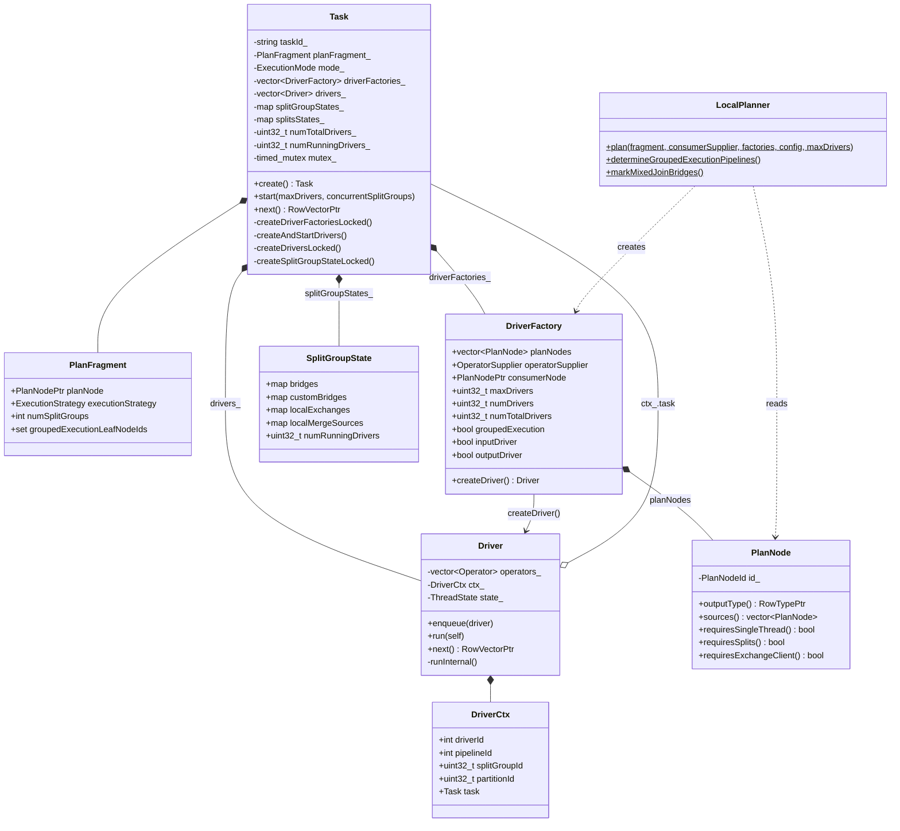
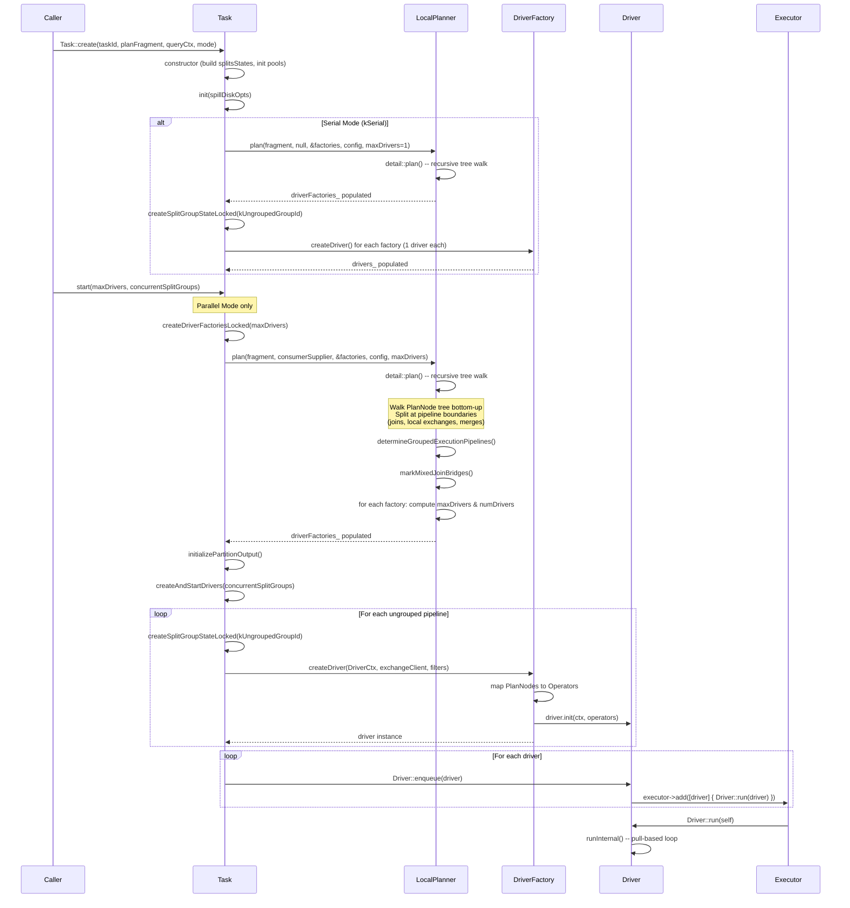

# Module Teardown: Task Creation & Pipeline Instantiation

## Table of Contents

- [0. Research Focus](#0-research-focus)
- [1. High-Level Overview](#1-high-level-overview)
- [2. Structural Architecture](#2-structural-architecture)
  - [Class Diagram](#class-diagram)
- [3. Execution & Call Flow](#3-execution-call-flow)
  - [Sequence Diagram](#sequence-diagram)
  - [3.1 Task Construction (`Task::create` and `Task::Task`)](#31-task-construction-taskcreate-and-tasktask)
  - [3.2 Task Initialization (`Task::init`)](#32-task-initialization-taskinit)
  - [3.3 Plan Decomposition (`LocalPlanner::plan`)](#33-plan-decomposition-localplannerplan)
  - [3.4 Concurrency Determination (`detail::maxDrivers`)](#34-concurrency-determination-detailmaxdrivers)
  - [3.5 Task Start (`Task::start`)](#35-task-start-taskstart)
  - [3.6 Creating Driver Factories (`createDriverFactoriesLocked`)](#36-creating-driver-factories-createdriverfactorieslocked)
  - [3.7 Creating and Starting Drivers (`createAndStartDrivers`)](#37-creating-and-starting-drivers-createandstartdrivers)
  - [3.8 Split Group State Creation (`createSplitGroupStateLocked`)](#38-split-group-state-creation-createsplitgroupstatelocked)
  - [3.9 Driver Instantiation (`createDriversLocked`)](#39-driver-instantiation-createdriverslocked)
  - [3.10 PlanNode-to-Operator Translation (`DriverFactory::createDriver`)](#310-plannode-to-operator-translation-driverfactorycreatedriver)
  - [3.11 Driver Scheduling](#311-driver-scheduling)
  - [3.12 Grouped Execution: Split Group Lifecycle](#312-grouped-execution-split-group-lifecycle)
- [4. Concurrency & State Management](#4-concurrency-state-management)
  - [Threading Model](#threading-model)
  - [State Machine](#state-machine)
  - [Synchronization](#synchronization)
- [5. Memory & Resource Profile](#5-memory-resource-profile)
  - [Allocation Pattern](#allocation-pattern)
  - [Memory Tracking](#memory-tracking)
- [6. Key Design Insights](#6-key-design-insights)
  - [6.1 Pipeline Splitting is Implicit in the Plan Tree Structure](#61-pipeline-splitting-is-implicit-in-the-plan-tree-structure)
  - [6.2 Concurrency is the Minimum Across All Operators in a Pipeline](#62-concurrency-is-the-minimum-across-all-operators-in-a-pipeline)
  - [6.3 DriverFactory is a Blueprint; Driver is an Instance](#63-driverfactory-is-a-blueprint-driver-is-an-instance)
  - [6.4 Operator Fusion at Pipeline Construction Time](#64-operator-fusion-at-pipeline-construction-time)
  - [6.5 Split Group Lifecycle Enables Bucketed Execution](#65-split-group-lifecycle-enables-bucketed-execution)
  - [6.6 The OperatorSupplier Pattern for Pipeline Sinks](#66-the-operatorsupplier-pattern-for-pipeline-sinks)
  - [6.7 Serial Mode Is a Restricted Subset of Parallel Mode](#67-serial-mode-is-a-restricted-subset-of-parallel-mode)
  - [6.8 The DriverAdapter Extension Point](#68-the-driveradapter-extension-point)


## 0. Research Focus
* **Task ID:** 2.1
* **Focus:** How does Velox convert a physical `PlanNode` tree into executable pipelines? Trace the initialization of a `Task`. How does it decide the degree of concurrency and spawn multiple `Driver`s for a given pipeline?

## 1. High-Level Overview
* **Core Responsibility:** A `Task` is the top-level execution unit in Velox. It owns a `PlanFragment` (a tree of `PlanNode`s), and its job is to (1) decompose that tree into linear pipelines (`DriverFactory`s), (2) decide concurrency for each pipeline, (3) instantiate the right number of `Driver` instances per pipeline, and (4) schedule them on an executor for parallel execution (or run them one-at-a-time in serial mode).
* **Key Triggers:** `Task::create()` constructs the Task and wires up split states and memory pools. `Task::start()` triggers the actual planning and driver creation for parallel mode. For serial mode, planning and driver creation happen eagerly inside `Task::init()`, and execution is driven by repeated `Task::next()` calls.

## 2. Structural Architecture
* **Primary Source Files:**
  - `velox/exec/Task.h` / `velox/exec/Task.cpp` -- Task lifecycle, driver creation, split management
  - `velox/exec/LocalPlanner.h` / `velox/exec/LocalPlanner.cpp` -- Plan-tree-to-pipeline decomposition
  - `velox/exec/Driver.h` / `velox/exec/Driver.cpp` -- Driver structure, DriverFactory, execution loop
  - `velox/core/PlanNode.h` -- PlanNode base class and all node types
  - `velox/core/PlanFragment.h` -- PlanFragment wrapper with execution strategy
  - `velox/exec/TaskStructs.h` -- SplitsState, SplitGroupState

* **Key Data Structures:**
  - `PlanFragment` -- wraps a root `PlanNode` plus execution strategy (grouped/ungrouped) and split group info.
  - `DriverFactory` -- a linear sequence of `PlanNode`s representing one pipeline, plus metadata (maxDrivers, numDrivers, flags).
  - `Driver` -- an instantiated pipeline: a chain of `Operator`s that runs on a single thread.
  - `SplitGroupState` -- per-split-group inter-operator state (join bridges, local exchange queues, merge sources).
  - `SplitsState` -- per-plan-node split tracking (queue of splits, no-more-splits signal).

### Class Diagram


## 3. Execution & Call Flow

### Sequence Diagram


* **Step-by-step text breakdown:**

### 3.1 Task Construction (`Task::create` and `Task::Task`)

`Task::create` is a static factory that constructs a `Task` via its private constructor and then calls `init()`.

```cpp
// Task.cpp:361
std::shared_ptr<Task> Task::create(
    const std::string& taskId,
    core::PlanFragment planFragment, ...) {
  auto task = std::shared_ptr<Task>(new Task(
      taskId, std::move(planFragment), destination,
      std::move(queryCtx), mode, std::move(consumerSupplier), ...));
  task->init(std::move(spillDiskOpts));
  task->addToTaskList();
  return task;
}
```

The constructor does several things:
1. Generates a UUID for the task.
2. Stores the `PlanFragment` and `QueryCtx`.
3. Builds the `splitsStates_` map by walking the plan tree to find leaf nodes that require splits:

```cpp
// Task.cpp:407
splitsStates_(buildSplitStates(planFragment_.planNode)),
```

The `buildSplitStates` helper recursively walks the plan tree. Any leaf node where `requiresSplits()` returns true gets an entry in the map:

```cpp
// Task.cpp:157
if (planNode->sources().empty()) {
  if (planNode->requiresSplits()) {
    splitStateMap[planNode->id()].sourceIsTableScan =
        (dynamic_cast<const core::TableScanNode*>(planNode) != nullptr);
  }
  return;
}
```

### 3.2 Task Initialization (`Task::init`)

For **parallel mode** (`kParallel`), `init()` only initializes the memory pool and spill config. Planning is deferred to `start()`.

For **serial mode** (`kSerial`), `init()` eagerly plans and creates all drivers:

```cpp
// Task.cpp:491
void Task::init(std::optional<common::SpillDiskOptions>&& spillDiskOpts) {
  VELOX_CHECK(driverFactories_.empty());
  initTaskPool();
  setSpillDiskConfig(std::move(spillDiskOpts));

  if (mode_ != Task::ExecutionMode::kSerial) {
    return;
  }

  // Serial mode: plan immediately with maxDrivers=1
  LocalPlanner::plan(
      planFragment_, nullptr, &driverFactories_, queryCtx_->queryConfig(), 1);
  ...
  // Each factory must have exactly 1 driver in serial mode
  for (const auto& factory : driverFactories_) {
    VELOX_CHECK_EQ(factory->numDrivers, 1);
    ...
  }
  createSplitGroupStateLocked(kUngroupedGroupId);
  std::vector<std::shared_ptr<Driver>> drivers =
      createDriversLocked(kUngroupedGroupId);
  drivers_ = std::move(drivers);
}
```

### 3.3 Plan Decomposition (`LocalPlanner::plan`)

This is the core algorithm that converts a `PlanNode` tree into a set of linear pipelines (`DriverFactory`s).

**Entry point:**

```cpp
// LocalPlanner.cpp:341
void LocalPlanner::plan(
    const core::PlanFragment& planFragment,
    ConsumerSupplier consumerSupplier,
    std::vector<std::unique_ptr<DriverFactory>>* driverFactories,
    const core::QueryConfig& queryConfig,
    uint32_t maxDrivers) {
  // Run registered adapters for inspection
  for (auto& adapter : DriverFactory::adapters) {
    if (adapter.inspect) { adapter.inspect(planFragment); }
  }
  // Recursive planning
  detail::plan(planFragment.planNode, nullptr, nullptr,
      detail::makeOperatorSupplier(std::move(consumerSupplier)),
      driverFactories);

  (*driverFactories)[0]->outputDriver = true;

  if (planFragment.isGroupedExecution()) {
    determineGroupedExecutionPipelines(planFragment, *driverFactories);
    markMixedJoinBridges(*driverFactories);
  }

  // Determine concurrency for each pipeline
  for (auto& factory : *driverFactories) {
    factory->maxDrivers = detail::maxDrivers(*factory, queryConfig);
    factory->numDrivers = std::min(factory->maxDrivers, maxDrivers);
    if (factory->groupedExecution) {
      factory->numTotalDrivers =
          factory->numDrivers * planFragment.numSplitGroups;
    } else {
      factory->numTotalDrivers = factory->numDrivers;
    }
  }
}
```

**Recursive `detail::plan` function** -- the pipeline splitting algorithm:

```cpp
// LocalPlanner.cpp:251
void plan(
    const std::shared_ptr<const core::PlanNode>& planNode,
    std::vector<std::shared_ptr<const core::PlanNode>>* currentPlanNodes,
    const std::shared_ptr<const core::PlanNode>& consumerNode,
    OperatorSupplier operatorSupplier,
    std::vector<std::unique_ptr<DriverFactory>>* driverFactories) {

  if (!currentPlanNodes) {
    // Start a new pipeline (DriverFactory)
    auto driverFactory = std::make_unique<DriverFactory>();
    currentPlanNodes = &driverFactory->planNodes;
    driverFactory->operatorSupplier = std::move(operatorSupplier);
    driverFactory->consumerNode = consumerNode;
    driverFactories->push_back(std::move(driverFactory));
  }

  const auto& sources = planNode->sources();
  if (sources.empty()) {
    driverFactories->back()->inputDriver = true;
  } else {
    for (int32_t i = 0; i < numSourcesToPlan; ++i) {
      plan(
          sources[i],
          // If mustStartNewPipeline, pass nullptr to force a new pipeline
          mustStartNewPipeline(planNode, i) ? nullptr : currentPlanNodes,
          planNode,
          makeOperatorSupplier(planNode),
          driverFactories);
    }
  }
  // Append this node to the current pipeline (bottom-up order)
  currentPlanNodes->push_back(planNode);
}
```

The key insight is that the tree is walked recursively from root to leaves, but nodes are appended in **bottom-up order** (leaves first, root last) within each pipeline. A new pipeline is started whenever `mustStartNewPipeline()` returns true.

**Pipeline boundary detection** (`mustStartNewPipeline`):

```cpp
// LocalPlanner.cpp:82
bool mustStartNewPipeline(
    const std::shared_ptr<const core::PlanNode>& planNode, int sourceId) {
  if (auto localMerge = ...) return true;  // LocalMerge sources get own pipeline
  if (std::dynamic_pointer_cast<const core::MixedUnionNode>(planNode))
    return true;
  if (std::dynamic_pointer_cast<const core::LocalPartitionNode>(planNode))
    return true;
  // Non-first sources always run in their own pipeline (e.g., build side of joins)
  return sourceId != 0;
}
```

Pipeline boundaries occur at:
- **LocalMergeNode** -- all sources get separate pipelines
- **MixedUnionNode** -- all sources get separate pipelines
- **LocalPartitionNode** (local exchange) -- sources get separate pipelines
- **Non-first sources** of any node -- this means the build side of hash joins, nested loop joins, spatial joins, and merge joins always runs in its own pipeline

### 3.4 Concurrency Determination (`detail::maxDrivers`)

Each pipeline's maximum concurrency is computed by walking all `PlanNode`s in the pipeline:

```cpp
// LocalPlanner.cpp:294
uint32_t maxDrivers(const DriverFactory& driverFactory,
                    const core::QueryConfig& queryConfig) {
  // Check if the consumer limits concurrency (MergeJoin -> 1)
  uint32_t count = maxDriversForConsumer(driverFactory.consumerNode);
  if (count == 1) return count;

  for (auto& node : driverFactory.planNodes) {
    if (node->requiresSingleThread()) return 1;

    if (auto localExchange = ...) {
      // Repartition limits parallelism to the partition count
      if (localExchange->type() == Type::kRepartition) {
        count = std::min(queryConfig.maxLocalExchangePartitionCount(), count);
      }
    } else if (auto tableWrite = ...) {
      if (tableWrite->hasPartitioningScheme()) {
        return queryConfig.taskPartitionedWriterCount();
      } else {
        return queryConfig.taskWriterCount();
      }
    } else {
      auto result = Operator::maxDrivers(node);
      if (result) {
        if (*result == 1) return 1;
        count = std::min(*result, count);
      }
    }
  }
  return count;
}
```

Nodes that force single-threaded execution (`requiresSingleThread() == true`):
- **ValuesNode** (when not `parallelizable_`)
- **ArrowStreamNode** (always)
- **MergeExchangeNode** (always)
- **LocalMergeNode** (implicit via consumer constraint)
- **LocalPartitionNode** when `type_ == kGather`
- **OrderByNode** (always, final sort must be single-threaded)
- **TableWriteNode** (depends on connector)
- **TableWriteMergeNode** (always)
- **LimitNode** (when not partial)
- **TopNRowNumberNode** (when not partial)
- **RowNumberNode** (when not partial)
- **NestedLoopJoinNode** (always)
- **HashJoinNode** (only for right semi project + null aware)

The final `numDrivers` is `min(maxDrivers_from_pipeline, maxDrivers_from_caller)`.

### 3.5 Task Start (`Task::start`)

```cpp
// Task.cpp:960
void Task::start(uint32_t maxDrivers, uint32_t concurrentSplitGroups) {
  checkExecutionMode(ExecutionMode::kParallel);
  {
    std::unique_lock<std::timed_mutex> l(mutex_);
    taskStats_.executionStartTimeMs = getCurrentTimeMs();
    createDriverFactoriesLocked(maxDrivers);  // calls LocalPlanner::plan
  }
  initializePartitionOutput();  // setup output buffer if PartitionedOutputNode
  createAndStartDrivers(concurrentSplitGroups);
}
```

### 3.6 Creating Driver Factories (`createDriverFactoriesLocked`)

```cpp
// Task.cpp:1018
void Task::createDriverFactoriesLocked(uint32_t maxDrivers) {
  LocalPlanner::plan(planFragment_, consumerSupplier(),
                     &driverFactories_, queryCtx_->queryConfig(), maxDrivers);

  for (auto& factory : driverFactories_) {
    if (factory->groupedExecution) {
      numDriversPerSplitGroup_ += factory->numDrivers;
    } else {
      numDriversUngrouped_ += factory->numDrivers;
    }
    numTotalDrivers_ += factory->numTotalDrivers;
    numDriversPerLeafNode_[factory->leafNodeId()] = factory->numDrivers;
    taskStats_.pipelineStats.emplace_back(
        factory->inputDriver, factory->outputDriver);
  }
  validateGroupedExecutionLeafNodes();
}
```

### 3.7 Creating and Starting Drivers (`createAndStartDrivers`)

```cpp
// Task.cpp:1046
void Task::createAndStartDrivers(uint32_t concurrentSplitGroups) {
  concurrentSplitGroups_ = concurrentSplitGroups;
  // Pre-allocate slots for grouped execution drivers
  if (numDriversPerSplitGroup_ > 0) {
    drivers_.resize(numDriversPerSplitGroup_ * concurrentSplitGroups_);
  }

  // 1. Create ungrouped execution drivers
  if (numDriversUngrouped_ > 0) {
    createSplitGroupStateLocked(kUngroupedGroupId);
    std::vector<std::shared_ptr<Driver>> drivers =
        createDriversLocked(kUngroupedGroupId);
    ...
    // Enqueue all ungrouped drivers
    for (auto it = drivers_.end() - numDriversUngrouped_;
         it != drivers_.end(); ++it) {
      if (*it) {
        ++numRunningDrivers_;
        Driver::enqueue(*it);
      }
    }
  }

  // 2. Start grouped execution if splits are already queued
  if (numDriversPerSplitGroup_ > 0) {
    ensureSplitGroupsAreBeingProcessedLocked();
  }
}
```

### 3.8 Split Group State Creation (`createSplitGroupStateLocked`)

Before creating drivers for a split group, the Task sets up shared inter-operator state:

```cpp
// Task.cpp:1293
void Task::createSplitGroupStateLocked(uint32_t splitGroupId) {
  for (auto pipeline = 0; pipeline < numPipelines; ++pipeline) {
    auto& factory = driverFactories_[pipeline];
    if (factory->groupedExecution != groupedExecutionDrivers) continue;

    // Create local exchange queues if the pipeline reads from one
    core::PlanNodePtr partitionNode;
    if (factory->needsLocalExchange(partitionNode)) {
      createLocalExchangeQueuesLocked(
          splitGroupId, partitionNode, factory->numDrivers);
    }
    // Create join bridges for hash joins, nested loop joins, spatial joins
    addHashJoinBridgesLocked(splitGroupId, factory->needsHashJoinBridges());
    addNestedLoopJoinBridgesLocked(splitGroupId, factory->needsNestedLoopJoinBridges());
    addSpatialJoinBridgesLocked(splitGroupId, factory->needsSpatialJoinBridges());
    addCustomJoinBridgesLocked(splitGroupId, factory->planNodes);
  }
}
```

### 3.9 Driver Instantiation (`createDriversLocked`)

```cpp
// Task.cpp:1328
std::vector<std::shared_ptr<Driver>> Task::createDriversLocked(
    uint32_t splitGroupId) {
  std::vector<std::shared_ptr<Driver>> drivers;
  for (auto pipeline = 0; pipeline < numPipelines; ++pipeline) {
    auto& factory = driverFactories_[pipeline];
    if (factory->groupedExecution != groupedExecutionDrivers) continue;

    const uint32_t driverIdOffset =
        factory->numDrivers * (groupedExecutionDrivers ? splitGroupId : 0);
    auto filters = std::make_shared<PipelinePushdownFilters>();

    for (uint32_t partitionId = 0; partitionId < factory->numDrivers;
         ++partitionId) {
      drivers.emplace_back(factory->createDriver(
          std::make_unique<DriverCtx>(
              self, driverIdOffset + partitionId, pipeline,
              splitGroupId, partitionId),
          getExchangeClientLocked(pipeline),
          filters, ...));
      ++splitGroupState.numRunningDrivers;
    }
  }
  noMoreLocalExchangeProducers(splitGroupId);

  // Start all join bridges
  for (auto& bridgeEntry : splitGroupState.bridges) {
    bridgeEntry.second->start();
  }
  return drivers;
}
```

For each pipeline, it creates `numDrivers` Driver instances. Each Driver gets a unique `DriverCtx` with its `driverId`, `pipelineId`, `splitGroupId`, and `partitionId`. Drivers in the same pipeline share the same `PipelinePushdownFilters`.

### 3.10 PlanNode-to-Operator Translation (`DriverFactory::createDriver`)

This is where `PlanNode`s become `Operator`s:

```cpp
// LocalPlanner.cpp:471
std::shared_ptr<Driver> DriverFactory::createDriver(
    std::unique_ptr<DriverCtx> ctx, ...) {
  auto driver = std::shared_ptr<Driver>(new Driver());
  ctx->driver = driver.get();
  std::vector<std::unique_ptr<Operator>> operators;

  for (int32_t i = 0; i < planNodes.size(); i++) {
    auto id = operators.size();
    auto planNode = planNodes[i];

    // Filter + Project fusion: consecutive FilterNode -> ProjectNode
    // become a single FilterProject operator
    if (auto filterNode = dynamic_pointer_cast<FilterNode>(planNode)) {
      if (i < planNodes.size() - 1) {
        auto next = planNodes[i + 1];
        if (auto projectNode = dynamic_pointer_cast<ProjectNode>(next)) {
          operators.push_back(
              make_unique<FilterProject>(id, ctx.get(), filterNode, projectNode));
          i++;  // skip the ProjectNode
          continue;
        }
      }
      operators.push_back(
          make_unique<FilterProject>(id, ctx.get(), filterNode, nullptr));
    }
    // ... 30+ else-if branches for different PlanNode types ...
  }

  // Add the terminal operator (sink) from operatorSupplier
  if (operatorSupplier) {
    operators.push_back(operatorSupplier(operators.size(), ctx.get()));
  }

  driver->init(std::move(ctx), std::move(operators));

  // Allow registered adapters to modify the driver
  for (auto& adapter : adapters) {
    if (adapter.adapt(*this, *driver)) break;
  }
  driver->isAdaptable_ = false;
  driver->pushdownFilters_ = std::move(filters);
  return driver;
}
```

Key translations include:
- `TableScanNode` -> `TableScan`
- `FilterNode` + `ProjectNode` -> `FilterProject` (fused)
- `HashJoinNode` -> `HashProbe` (probe pipeline) or `HashBuild` (build pipeline, via `operatorSupplier`)
- `ExchangeNode` -> `Exchange` (uses shared ExchangeClient)
- `LocalPartitionNode` -> `LocalExchange` (consumer) or `LocalPartition` (producer, via `operatorSupplier`)
- `PartitionedOutputNode` -> `PartitionedOutput`
- `AggregationNode` -> `HashAggregation` or `StreamingAggregation` (depending on `isPreGrouped`)

### 3.11 Driver Scheduling

Drivers are scheduled by `Driver::enqueue`:

```cpp
// Driver.cpp:282
void Driver::enqueue(std::shared_ptr<Driver> driver) {
  driver->enqueueInternal();
  if (driver->closed_) return;
  driver->task()->queryCtx()->executor()->add(
      [driver]() { Driver::run(driver); });
}
```

The executor is typically a `folly::CPUThreadPoolExecutor`. Each `Driver::run` call runs the pull-based pipeline loop until the driver blocks, yields, terminates, or reaches end of data.

### 3.12 Grouped Execution: Split Group Lifecycle

For grouped (bucketed) execution, drivers are not all created at `start()`. Instead, they are created on-demand as splits arrive:

```cpp
// Task.cpp:1466
void Task::ensureSplitGroupsAreBeingProcessedLocked() {
  if (not isRunningLocked() or (numDriversPerSplitGroup_ == 0)) return;

  while (numRunningSplitGroups_ < concurrentSplitGroups_ and
         not queuedSplitGroups_.empty()) {
    const uint32_t splitGroupId = queuedSplitGroups_.front();
    queuedSplitGroups_.pop();
    createSplitGroupStateLocked(splitGroupId);
    std::vector<std::shared_ptr<Driver>> drivers =
        createDriversLocked(splitGroupId);
    // Place drivers into pre-allocated slots and enqueue them
    ...
  }
}
```

This ensures that at most `concurrentSplitGroups_` groups are processed in parallel. When a split group finishes (all its drivers complete), the slot is freed and the next queued group is started.

## 4. Concurrency & State Management

### Threading Model

Velox supports two execution modes:

| Mode | API | Threading | Concurrency |
|------|-----|-----------|-------------|
| `kParallel` | `Task::start()` | Multi-threaded via executor | Up to `maxDrivers` per pipeline |
| `kSerial` | `Task::next()` | Single caller thread | Always 1 driver per pipeline |

In parallel mode, each Driver runs as a task on a `folly::CPUThreadPoolExecutor`. The executor manages the thread pool. There is no affinity between drivers and threads -- any executor thread can run any driver.

### State Machine

```
Task States:
  kRunning -> kFinished    (all drivers complete successfully)
  kRunning -> kCanceled    (user cancellation via requestCancel)
  kRunning -> kAborted     (failure in related task via requestAbort)
  kRunning -> kFailed      (error during execution via setError)
```

```
Driver ThreadState transitions:
  [Created] -> Enqueued -> On Thread -> {Blocked | Suspended | Terminated | Enqueued}
  Blocked -> {Enqueued | Terminated}
  Suspended -> {On Thread | Terminated}
```

The `ThreadState` struct tracks each driver's lifecycle:

```cpp
struct ThreadState {
  std::atomic<std::thread::id> thread{std::thread::id()};  // current thread
  std::atomic<int32_t> tid{0};
  std::atomic<bool> isEnqueued{false};
  std::atomic<bool> isTerminated{false};
  bool hasBlockingFuture{false};
  std::atomic<uint32_t> numSuspensions{0};
  size_t startExecTimeMs{0};
};
```

### Synchronization

- **Task mutex** (`std::timed_mutex mutex_`): Guards all mutable Task state -- drivers, split states, split group states, counters. Used by `Task::enter()` / `Task::leave()` which drivers call when going on/off thread.
- **Thread counting**: `numThreads_` tracks how many driver threads are active. When it reaches zero, `threadFinishPromises_` are fulfilled (used by pause/terminate).
- **Join bridges**: Coordinate between build and probe pipelines. Build drivers call `allPeersFinished()` which is a barrier -- the last build driver unblocks all probe drivers waiting on the bridge.
- **Local exchange queues**: `LocalExchangeQueue` instances coordinate producers (upstream pipeline) and consumers (downstream pipeline) of a local repartition.
- **Pause/Yield**: `pauseRequested_` and `toYield_` are atomic flags checked by drivers via `Task::shouldStop()`. Pause waits for all drivers to go off-thread. Yield sends a driver to the back of the executor queue.

## 5. Memory & Resource Profile

### Allocation Pattern

Memory is organized hierarchically:
1. **Query pool** (`QueryCtx::pool_`) -- root pool shared across tasks in a query
2. **Task pool** (`Task::pool_`) -- child of query pool, created in `initTaskPool()`
3. **Node pools** (`Task::nodePools_`) -- per plan-node pools, children of task pool
4. **Operator pools** -- per operator instance pools, children of node pools

Each operator gets its own memory pool via `DriverCtx::addOperatorPool()`, which creates a leaf pool under the corresponding node pool. This hierarchy enables memory tracking and reclamation at each level.

### Memory Tracking

- `Task::pool_` tracks total memory for all operators in the task.
- The `Task::MemoryReclaimer` can be invoked by the memory arbitrator to spill operators and reclaim memory.
- Spill config is set per-task via `spillDiskOpts` in `Task::create()`.
- Memory arbitration priority (`memoryArbitrationPriority_`) determines reclamation order across tasks.

The task verifies zero allocations after driver initialization:

```cpp
// Task.cpp:1070
if (pool_->reservedBytes() != 0) {
  VELOX_FAIL(
      "Unexpected memory pool allocations during task[{}] driver initialization: {}",
      taskId_, pool_->treeMemoryUsage());
}
```

## 6. Key Design Insights

### 6.1 Pipeline Splitting is Implicit in the Plan Tree Structure

Velox does not have an explicit "pipeline" concept in the plan. Instead, pipelines emerge from the `detail::plan()` recursion. The algorithm walks the plan tree top-down but builds pipelines bottom-up. A new pipeline is created whenever `mustStartNewPipeline()` returns true, which happens at local exchanges, local merges, and non-first sources (join build sides). This means a HashJoinNode always produces two pipelines: the probe (first source, same pipeline as the join) and the build (second source, new pipeline). Evidence:

```cpp
// LocalPlanner.cpp:100
// Non-first sources always run in their own pipeline.
return sourceId != 0;
```

### 6.2 Concurrency is the Minimum Across All Operators in a Pipeline

The `detail::maxDrivers()` function iterates every node in a `DriverFactory` and takes the minimum. This means a single `requiresSingleThread()` node anywhere in a pipeline forces the entire pipeline to single-threaded execution. The caller-supplied `maxDrivers` further caps this. This conservative approach prevents deadlocks and data correctness issues. Evidence:

```cpp
// LocalPlanner.cpp:301
for (auto& node : driverFactory.planNodes) {
  if (node->requiresSingleThread()) return 1;
  ...
}
```

### 6.3 DriverFactory is a Blueprint; Driver is an Instance

`DriverFactory` holds the plan node sequence and concurrency metadata but does not own operators. `createDriver()` is called N times (once per `numDrivers`), and each call creates a fresh set of operators from the same plan nodes. All drivers in a pipeline share the same `PipelinePushdownFilters` instance, enabling dynamic filter sharing across threads. Each driver gets a distinct `DriverCtx` with its `partitionId`, which determines which local exchange queue it reads from.

### 6.4 Operator Fusion at Pipeline Construction Time

Filter and Project nodes are fused into a single `FilterProject` operator during `DriverFactory::createDriver()`:

```cpp
// LocalPlanner.cpp:486
if (auto filterNode = ...) {
  if (i < planNodes.size() - 1) {
    auto next = planNodes[i + 1];
    if (auto projectNode = ...) {
      operators.push_back(
          make_unique<FilterProject>(id, ctx.get(), filterNode, projectNode));
      i++;  // skip the ProjectNode
      continue;
    }
  }
}
```

This avoids materializing intermediate vectors between filter and project, reducing memory allocations and improving cache locality.

### 6.5 Split Group Lifecycle Enables Bucketed Execution

Grouped execution (used for bucketed/partitioned data) creates drivers on-demand per split group rather than all at once. The `concurrentSplitGroups_` parameter limits how many groups run simultaneously. When one group's drivers all finish, `Task::removeDriver` calls `ensureSplitGroupsAreBeingProcessedLocked()` to start the next queued group. This amortizes memory usage across groups since only `concurrentSplitGroups` worth of join hash tables, etc. exist at any time. Evidence:

```cpp
// Task.cpp:1433
if (splitGroupState.numRunningDrivers == 0) {
  if (splitGroupId != kUngroupedGroupId) {
    --self->numRunningSplitGroups_;
    splitGroupState.clear();  // free bridges, exchanges, etc.
    self->ensureSplitGroupsAreBeingProcessedLocked();
  }
}
```

### 6.6 The OperatorSupplier Pattern for Pipeline Sinks

When a pipeline feeds into another (e.g., a join build pipeline feeding a join bridge), the sink operator is not derived from the plan node itself. Instead, `detail::makeOperatorSupplier()` creates a lambda that produces a `CallbackSink` or `HashBuild` or `LocalPartition` as the terminal operator. This sink is appended after all the plan-node-derived operators in `createDriver()`. This cleanly separates the intra-pipeline plan node traversal from the inter-pipeline wiring. Evidence:

```cpp
// LocalPlanner.cpp:722
if (operatorSupplier) {
  operators.push_back(operatorSupplier(operators.size(), ctx.get()));
}
```

### 6.7 Serial Mode Is a Restricted Subset of Parallel Mode

Serial mode reuses the same pipeline decomposition and driver creation infrastructure, but forces `maxDrivers=1` and forbids `PartitionedOutput` and `ExchangeClient`. The `Task::next()` method round-robins across drivers manually on the caller thread, running each until it produces a result or blocks. Blocked drivers are skipped, and their futures are collected into a `collectAny` to wake the caller. Evidence:

```cpp
// Task.cpp:519
VELOX_CHECK_EQ(factory->numDrivers, 1);
// ...
// Task.cpp:867 (next() loop)
for (auto i = 0; i < numDrivers; ++i) {
  auto driver = getDriver(i);
  if (driver == nullptr) continue;        // finished
  if (!futures[i].isReady()) continue;     // blocked
  auto result = driver->next(&driverFuture, driverOp, blockReason);
  if (result != nullptr) return result;    // got output
}
```

### 6.8 The DriverAdapter Extension Point

After creating a driver, registered `DriverAdapter`s can inspect and modify it (e.g., replacing operators). This enables plugins to transform the operator chain without modifying the core planner. Only one adapter can modify a driver (first match wins via `break`):

```cpp
// LocalPlanner.cpp:732
for (auto& adapter : adapters) {
  if (adapter.adapt(*this, *driver)) break;
}
driver->isAdaptable_ = false;  // lock down further modifications
```
