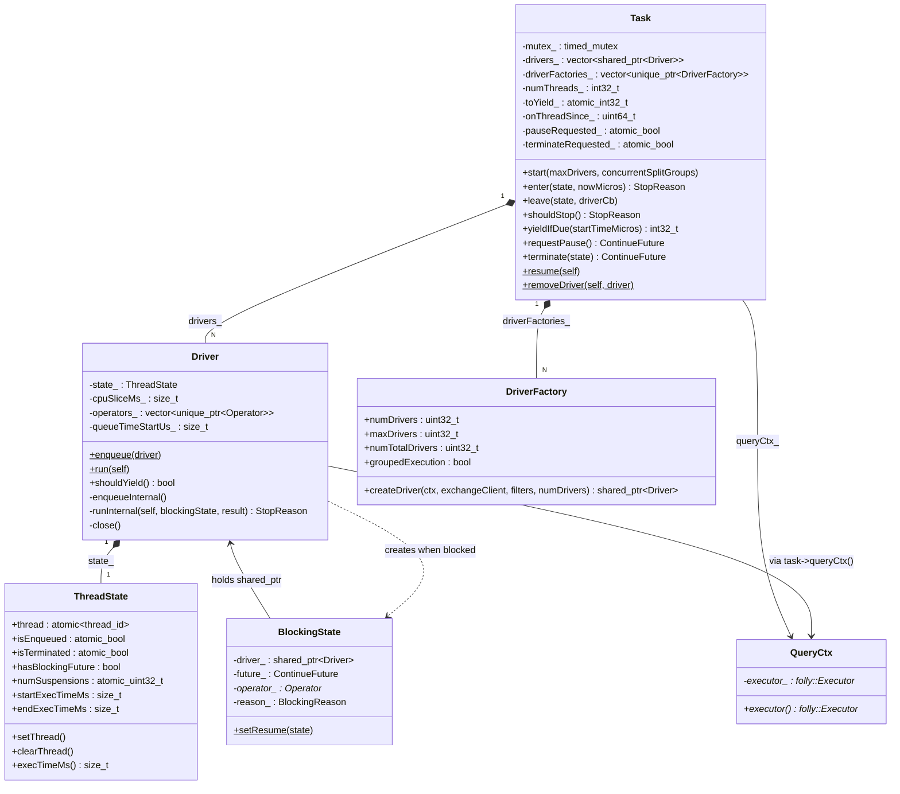
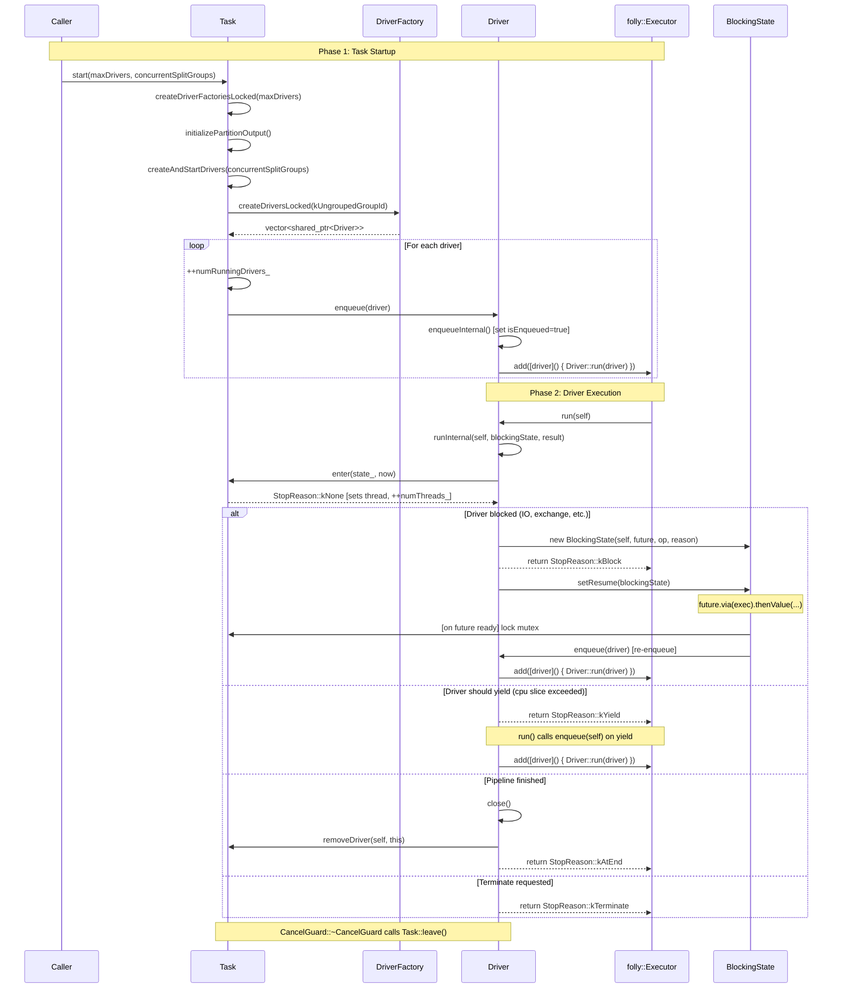

# Module Teardown: The Thread Pool and Execution Queue

## 0. Research Focus
* **Task ID:** 2.2
* **Focus:** Trace how `Driver` instances are queued into a `folly::Executor` (or similar thread pool). How does Velox ensure CPU fairness between concurrent tasks?

## 1. High-Level Overview
* **Core Responsibility:** Velox schedules `Driver` instances (the unit of parallel execution) onto a shared `folly::Executor` thread pool. The `Task::start()` method creates drivers from pipeline factories and enqueues them; each driver then self-reschedules after yielding, blocking, or completing an iteration of its operator pipeline. CPU fairness between concurrent tasks is achieved through a cooperative time-slicing mechanism (`driverCpuTimeSliceLimitMs`) and a task-level yield system (`yieldIfDue`), both of which cause drivers to voluntarily return to the back of the executor's queue.
* **Key Triggers:** `Task::start()` initiating parallel execution; `BlockingState::setResume` re-enqueuing a driver when a blocking future is realized; `Driver::run` re-enqueuing on `StopReason::kYield`; `Task::resume` re-enqueuing after a pause.

## 2. Structural Architecture
* **Primary Source Files:**
  - `velox/exec/Task.cpp` / `Task.h` -- Task lifecycle, driver creation, thread counting, yield/pause coordination
  - `velox/exec/Driver.cpp` / `Driver.h` -- Driver enqueue, run loop, yield detection, blocking state management
  - `velox/core/QueryCtx.h` -- Holds the `folly::Executor*` used for scheduling
  - `velox/core/QueryConfig.h` -- `kDriverCpuTimeSliceLimitMs` configuration
  - `velox/exec/ScaledScanController.h` -- Dynamic scan driver scaling based on memory pressure

* **Key Data Structures:**

| Structure | Role |
|-----------|------|
| `ThreadState` | Per-driver state: on-thread flag, enqueued flag, terminated flag, suspension count, timing |
| `StopReason` | Enum: `kNone`, `kPause`, `kTerminate`, `kYield`, `kBlock`, `kAtEnd`, `kAlreadyTerminated`, `kAlreadyOnThread` |
| `BlockingState` | Holds a blocked driver's shared_ptr, its ContinueFuture, and the blocking operator/reason |
| `CancelGuard` | RAII guard ensuring `Task::leave()` is called when a driver exits `runInternal()` |
| `DriverFactory` | Blueprint for creating drivers within a pipeline; tracks `numDrivers`, `maxDrivers`, execution mode |
| `Task::toYield_` | Atomic counter: number of drivers that should yield; decremented as each driver yields |
| `Task::onThreadSince_` | Timestamp of when the task's first driver came on-thread; used by `yieldIfDue()` |

### Class Diagram



## 3. Execution & Call Flow

### Sequence Diagram



### Step-by-step text breakdown

**1. Task::start() -- Entry Point for Parallel Execution**

`Task::start()` is the only entry point for multi-threaded query execution. It validates parameters, then proceeds through three phases:

```cpp
void Task::start(uint32_t maxDrivers, uint32_t concurrentSplitGroups) {
  // ...
  checkExecutionMode(ExecutionMode::kParallel);
  {
    std::unique_lock<std::timed_mutex> l(mutex_);
    taskStats_.executionStartTimeMs = getCurrentTimeMs();
    if (!isRunningLocked()) { return; }
    createDriverFactoriesLocked(maxDrivers);
  }
  initializePartitionOutput();
  createAndStartDrivers(concurrentSplitGroups);
}
```

**2. createDriverFactoriesLocked() -- Planning**

Uses `LocalPlanner::plan()` to convert the plan fragment into `DriverFactory` instances (one per pipeline). Each factory knows how many parallel drivers it needs:

```cpp
void Task::createDriverFactoriesLocked(uint32_t maxDrivers) {
  LocalPlanner::plan(planFragment_, consumerSupplier(),
                     &driverFactories_, queryCtx_->queryConfig(), maxDrivers);
  for (auto& factory : driverFactories_) {
    if (factory->groupedExecution) {
      numDriversPerSplitGroup_ += factory->numDrivers;
    } else {
      numDriversUngrouped_ += factory->numDrivers;
    }
    numTotalDrivers_ += factory->numTotalDrivers;
  }
}
```

**3. createAndStartDrivers() -- Driver Creation and Initial Enqueue**

For ungrouped execution, drivers are created immediately and enqueued to the executor under the Task mutex. This atomic creation-and-enqueue prevents race conditions with cancellations:

```cpp
// Set and start all Drivers together inside 'mutex_' so that
// cancellations and pauses have the well-defined timing.
for (auto it = drivers_.end() - numDriversUngrouped_; it != drivers_.end(); ++it) {
  if (*it) {
    ++numRunningDrivers_;
    Driver::enqueue(*it);
  }
}
```

**4. Driver::enqueue() -- The Core Scheduling Primitive**

This is the single point where drivers are submitted to the thread pool. It is always called inside the Task's mutex:

```cpp
// static
void Driver::enqueue(std::shared_ptr<Driver> driver) {
  process::ScopedThreadDebugInfo scopedInfo(driver->driverCtx()->threadDebugInfo);
  driver->enqueueInternal();  // sets isEnqueued = true, starts queue timer
  if (driver->closed_) {
    return;
  }
  driver->task()->queryCtx()->executor()->add(
      [driver]() { Driver::run(driver); });
}
```

Key design points:
- The driver's `shared_ptr` is captured by the lambda, preventing premature destruction while queued.
- `enqueueInternal()` marks `state_.isEnqueued = true` and starts the queue time measurement.
- The executor is obtained from `QueryCtx`, which is a raw `folly::Executor*` pointer. In production, this is typically a `folly::CPUThreadPoolExecutor`.

**5. Driver::run() -- The Executor Callback**

The thread pool invokes `Driver::run()` when a thread becomes available. This is a static method that calls `runInternal()` and then handles the exit reason:

```cpp
void Driver::run(std::shared_ptr<Driver> self) {
  process::TraceContext trace("Driver::run");
  // ...
  auto reason = self->runInternal(self, blockingState, nullResult);

  switch (reason) {
    case StopReason::kBlock:
      BlockingState::setResume(blockingState);  // attach re-enqueue on future
      return;
    case StopReason::kYield:
      enqueue(self);  // go to back of queue
      return;
    case StopReason::kPause:
    case StopReason::kTerminate:
    case StopReason::kAlreadyTerminated:
    case StopReason::kAtEnd:
      return;  // CancelGuard::~CancelGuard handles cleanup via Task::leave()
  }
}
```

**6. Driver::runInternal() -- The Operator Pipeline Loop**

This is the main execution loop. On entry, the driver calls `Task::enter()` to transition from "enqueued" to "on-thread":

```cpp
StopReason stop = closed_ ? StopReason::kTerminate : task()->enter(state_, now);
if (stop != StopReason::kNone) { return stop; }
```

Then enters a double loop: an outer infinite loop and an inner loop walking the operator chain from sink to source:

```cpp
for (;;) {
  for (int32_t i = startingOperator; i >= 0; --i) {
    stop = task()->shouldStop();
    if (stop != StopReason::kNone) { return stop; }

    if (FOLLY_UNLIKELY(shouldYield())) {
      recordYieldCount();
      return StopReason::kYield;
    }
    // ... check isBlocked, needsInput, getOutput, addInput ...
  }
}
```

At every operator iteration, two checks gate continued execution:
- `task()->shouldStop()` -- checks `pauseRequested_`, `terminateRequested_`, or `toYield_`
- `shouldYield()` -- per-driver CPU time slice check

**7. BlockingState::setResume() -- Future-Based Re-enqueue**

When a driver blocks on an external event (IO, exchange data, memory arbitration), the blocking future is captured in a `BlockingState`. The future's callback re-enqueues the driver:

```cpp
void BlockingState::setResume(std::shared_ptr<BlockingState> state) {
  auto& exec = folly::QueuedImmediateExecutor::instance();
  std::move(state->future_)
      .via(&exec)
      .thenValue([state](auto&&) {
        auto& driver = state->driver_;
        auto& task = driver->task();
        std::lock_guard<std::timed_mutex> l(task->mutex());
        // ... record blocking time, clear hasBlockingFuture ...
        if (task->pauseRequested()) { return; }
        Driver::enqueue(state->driver_);
      });
}
```

The `folly::QueuedImmediateExecutor` ensures the callback runs inline on the thread that fulfills the promise. This avoids an extra thread pool hop for the re-enqueue decision.

## 4. Concurrency & State Management

### Threading Model

Velox uses a **shared thread pool model** where all tasks within a query (and potentially across queries) share the same `folly::Executor`. The executor is not owned by Velox -- it is injected via `QueryCtx`:

```cpp
// QueryCtx holds a raw pointer to an externally-managed executor
folly::Executor* executor() const { return executor_; }
```

In test code, this is typically a `folly::CPUThreadPoolExecutor`:
```cpp
driverExecutor_ = std::make_unique<folly::CPUThreadPoolExecutor>(3);
```

The `folly::CPUThreadPoolExecutor` uses a `LifoSemMPMCQueue` (FIFO task queue with LIFO thread wake-up). Velox itself does not implement custom priority scheduling within the executor. Instead, it relies on cooperative yielding to achieve fairness.

**Key threading invariants:**
- A driver is on at most one thread at any time (enforced by `ThreadState.thread`)
- `Driver::enqueue()` is always called under the Task's `mutex_`
- `Task::numThreads_` tracks how many drivers of this task are currently on-thread
- The `isEnqueued` flag prevents double-enqueue

### State Machine

The `ThreadState` tracks each driver through these states:

```
                 +-----------+
                 | Created   |  (all flags false)
                 +-----+-----+
                       |
                       v
                 +-----------+
            +--->| Enqueued  |  (isEnqueued=true)
            |    +-----+-----+
            |          |  [thread pool picks it up]
            |          v
            |    +-----------+
            |    | On Thread |  (thread=<tid>, isEnqueued=false)
            |    +-----+-----+
            |      |   |   |
            |      |   |   +-----> Suspended (numSuspensions>0, stays on thread)
            |      |   |                |
            |      |   |                v [leaveSuspended]
            |      |   |           Back to On Thread
            |      |   |
            |      |   +-------> Blocked (hasBlockingFuture=true, off thread)
            |      |                  | [future realized]
            |      |                  v
            |      |             +----+
            |      |             | Enqueued (re-enqueue)
            |      |
            |      +-----------> kYield: back to Enqueued
            |
            +--- [on resume/unblock]

                 +-----------+
                 | Terminated|  (isTerminated=true, final)
                 +-----------+
```

The `StopReason` enum governs transitions:

| StopReason | Meaning | Driver Action |
|---|---|---|
| `kNone` | Keep running | Continue operator loop |
| `kBlock` | External dependency | Save `BlockingState`, go off thread |
| `kYield` | CPU fairness yield | Re-enqueue to back of queue |
| `kPause` | Task pause requested | Go off thread, wait for resume |
| `kTerminate` | Task being terminated | Close and cleanup |
| `kAtEnd` | Pipeline complete | Close operators, remove from task |
| `kAlreadyTerminated` | Already marked terminated | Unwind |

### Synchronization

The primary synchronization mechanism is `Task::mutex_` (a `std::timed_mutex`):

```cpp
mutable std::timed_mutex mutex_;
```

This mutex serializes:
- Driver creation and enqueue (`createAndStartDrivers`)
- Thread count management (`enter`, `leave`, `enterSuspended`, `leaveSuspended`)
- Yield coordination (`shouldStopLocked`, `yieldIfDue`)
- Pause/terminate state transitions
- Driver removal and split group management

Some variables use `std::atomic` for lock-free fast-path checks:
```cpp
std::atomic_bool pauseRequested_{false};      // checked by shouldStop() without lock
std::atomic_bool terminateRequested_{false};   // checked by shouldStop() without lock
std::atomic_int32_t toYield_ = 0;             // decremented inside mutex in shouldStopLocked()
```

This enables a fast-path in `shouldStop()` that avoids the mutex when no special condition is active:
```cpp
StopReason Task::shouldStop() {
  if (pauseRequested_) { return StopReason::kPause; }
  if (terminateRequested_) { return StopReason::kTerminate; }
  if (toYield_) {
    std::lock_guard<std::timed_mutex> l(mutex_);
    return shouldStopLocked();
  }
  return StopReason::kNone;
}
```

## 5. Memory & Resource Profile

### Allocation Pattern

**Driver shared_ptr lifecycle:**
The `shared_ptr<Driver>` is the primary resource management mechanism. A driver is kept alive by three possible holders:
1. `Task::drivers_` vector (cleared by `removeDriver` or `terminate`)
2. The lambda captured in the executor queue: `[driver]() { Driver::run(driver); }`
3. The `BlockingState` held by a future callback

This ensures a driver is never destroyed while queued or being executed.

**Pre-allocation:**
The `drivers_` vector is pre-allocated to the maximum size for grouped execution:
```cpp
if (numDriversPerSplitGroup_ > 0) {
  drivers_.resize(numDriversPerSplitGroup_ * concurrentSplitGroups_);
}
```
Ungrouped drivers are appended after the pre-allocated slots. As split groups complete and new ones start, their drivers are placed into vacated slots.

### Memory Tracking

Queue time is tracked per-driver with microsecond precision:
```cpp
void Driver::enqueueInternal() {
  VELOX_CHECK(!state_.isEnqueued);
  state_.isEnqueued = true;
  queueTimeStartUs_ = getCurrentTimeMicro();
}
```

On dequeue (inside `runInternal`), the queue time is reported as a runtime stat on the current operator:
```cpp
operators_[curOperatorId_]->addRuntimeStat(
    std::string(DriverStats::kQueuedWallNanos),
    RuntimeCounter(queuedTimeUs * 1'000, RuntimeCounter::Unit::kNanos));
```

Execution time on-thread is tracked in `ThreadState`:
```cpp
void setThread() {
  thread = std::this_thread::get_id();
  startExecTimeMs = getCurrentTimeMs();
  // ...
}
void clearThread() {
  endExecTimeMs = getCurrentTimeMs();
  RECORD_HISTOGRAM_METRIC_VALUE(kMetricDriverExecTimeMs,
                                 (endExecTimeMs - startExecTimeMs));
  startExecTimeMs = 0;
}
```

Memory arbitration awareness is built into the scheduling loop. Before processing each operator, the driver checks if the query is under memory arbitration and voluntarily goes off-thread if so:
```cpp
if (FOLLY_UNLIKELY(checkUnderArbitration(&future))) {
  blockingReason_ = BlockingReason::kWaitForArbitration;
  return blockDriver(self, i, std::move(future), blockingState, guard);
}
```

## 6. Key Design Insights

### Insight 1: The Executor is a Thin, External Abstraction

Velox does **not** implement its own thread pool or task scheduler. It delegates entirely to `folly::Executor`, which is injected via `QueryCtx`. The only scheduling API used is `executor->add(func)`:

```cpp
driver->task()->queryCtx()->executor()->add(
    [driver]() { Driver::run(driver); });
```

This means Velox has no built-in priority queue, no inter-task fairness at the executor level, and no ability to preempt drivers. The executor is a black box -- Velox adds work to it and gets callbacks. In production (Prestissimo), this is typically a `folly::CPUThreadPoolExecutor` with FIFO semantics. Any cross-task fairness must be implemented either by the executor itself or by Velox's cooperative mechanisms.

### Insight 2: CPU Fairness is Achieved Through Cooperative Time-Slicing at Two Levels

Velox provides two independent yield mechanisms that together create cooperative multi-tasking:

**Level 1: Per-Driver CPU Time Slice** (`driverCpuTimeSliceLimitMs`)

Each driver checks its continuous execution time at every operator iteration:

```cpp
bool Driver::shouldYield() const {
  if (cpuSliceMs_ == 0) { return false; }
  return execTimeMs() >= cpuSliceMs_;
}
```

When the time slice is exceeded, the driver returns `StopReason::kYield` and `Driver::run()` re-enqueues it to the back of the executor's queue:

```cpp
case StopReason::kYield:
  enqueue(self);  // go to the end of the queue
  return;
```

The time slice defaults to 0 (disabled) and must be explicitly set via `driver_cpu_time_slice_limit_ms`. When disabled, a driver runs until it blocks or finishes. This is only active in parallel execution mode:

```cpp
uint64_t Task::driverCpuTimeSliceLimitMs() const {
  return mode_ == Task::ExecutionMode::kSerial
      ? 0
      : queryCtx_->queryConfig().driverCpuTimeSliceLimitMs();
}
```

**Level 2: Task-Level Yield** (`yieldIfDue` / `requestYield`)

An external caller (e.g., a resource manager) can request that all drivers of a task yield:

```cpp
int32_t Task::yieldIfDue(uint64_t startTimeMicros) {
  if (onThreadSince_ < startTimeMicros) {
    std::lock_guard<std::timed_mutex> l(mutex_);
    if (onThreadSince_ < startTimeMicros && numThreads_ && !toYield_ &&
        !terminateRequested_ && !pauseRequested_) {
      toYield_ = numThreads_;
      return numThreads_;
    }
  }
  return 0;
}
```

When `toYield_` is set, each driver picks it up in `shouldStopLocked()` and decrements the counter:

```cpp
StopReason Task::shouldStopLocked() {
  if (pauseRequested_) { return StopReason::kPause; }
  if (terminateRequested_) { return StopReason::kTerminate; }
  if (toYield_ > 0) {
    --toYield_;
    return StopReason::kYield;
  }
  return StopReason::kNone;
}
```

### Insight 3: The Task Mutex is the Central Serialization Point for All Scheduling Decisions

Every scheduling state transition goes through `Task::mutex_`. The `enter/leave/shouldStop` protocol ensures that the Task always knows exactly how many drivers are on-thread:

- `Task::enter()` increments `numThreads_` and sets the driver's thread ID
- `Task::leave()` decrements `numThreads_`, and when it reaches zero, fulfills `threadFinishPromises_`
- `Task::enterSuspended()` decrements `numThreads_` while keeping the driver on its thread (used for RPC/IO waits)
- `Task::leaveSuspended()` increments `numThreads_` back

This thread counting is critical for pause/terminate coordination: a pause or terminate request must wait until all threads have exited (`numThreads_ == 0`). The `CancelGuard` RAII object guarantees that `leave()` is always called when `runInternal()` exits, even on exceptions:

```cpp
Driver::CancelGuard::~CancelGuard() {
  bool onTerminateCalled{false};
  if (isThrow_) {
    state_->isTerminated = true;
    onTerminate_(StopReason::kNone);
    onTerminateCalled = true;
  }
  task_->leave(*state_, onTerminateCalled ? nullptr : onTerminate_);
}
```

### Insight 4: Blocking is Handled via folly Futures with Inline Re-enqueue

When a driver blocks, it does not spin or sleep. It creates a `BlockingState` that captures a `ContinueFuture` and then goes off-thread. The future's callback re-enqueues the driver when the blocking condition resolves:

```cpp
std::move(state->future_)
    .via(&folly::QueuedImmediateExecutor::instance())
    .thenValue([state](auto&&) {
        // ...
        Driver::enqueue(state->driver_);
    });
```

Using `folly::QueuedImmediateExecutor` means the callback runs on the thread that fulfills the promise. This avoids an unnecessary thread pool hop just for the re-enqueue decision. The actual driver execution will happen when the executor picks it up.

The `BlockingState` holds a `shared_ptr<Driver>`, creating a reference chain: `future callback -> BlockingState -> Driver -> DriverCtx -> Task`. This ensures the driver and task survive until the future resolves. As the Velox lifecycle documentation notes: "If the future never completes, we'll be leaking Drivers and Tasks."

### Insight 5: Atomic Fast-Path Checks Minimize Lock Contention in the Hot Loop

The inner operator loop of `runInternal()` calls `task()->shouldStop()` at every operator iteration. To avoid taking the mutex on every call, `shouldStop()` uses atomic reads:

```cpp
StopReason Task::shouldStop() {
  if (pauseRequested_) { return StopReason::kPause; }
  if (terminateRequested_) { return StopReason::kTerminate; }
  if (toYield_) {
    std::lock_guard<std::timed_mutex> l(mutex_);
    return shouldStopLocked();
  }
  return StopReason::kNone;
}
```

Only when a yield is actually pending does the lock get taken. In the common case (no pause, no terminate, no yield), this is just three atomic reads -- an important optimization since this check runs for every operator in every iteration.

### Insight 6: Grouped Execution Provides Split-Group-Level Concurrency Control

For tasks with grouped execution (e.g., bucketed tables), Velox limits how many split groups run concurrently via `concurrentSplitGroups_`. As one split group's drivers complete, `Task::removeDriver` triggers `ensureSplitGroupsAreBeingProcessedLocked()` to start drivers for the next queued split group:

```cpp
void Task::ensureSplitGroupsAreBeingProcessedLocked() {
  while (numRunningSplitGroups_ < concurrentSplitGroups_ and
         not queuedSplitGroups_.empty()) {
    const uint32_t splitGroupId = queuedSplitGroups_.front();
    queuedSplitGroups_.pop();
    // ... create drivers, enqueue them ...
  }
}
```

This creates a two-level scheduling hierarchy: the split group admission control limits task-internal parallelism, while the shared executor limits system-wide parallelism.

### Insight 7: The Suspend Mechanism Enables Memory Arbitration Without Losing Stack Context

Unlike blocking (where the driver goes off-thread and loses its call stack), suspension keeps the driver on its thread but decrements `numThreads_`. This is used for memory arbitration and IO waits where the driver needs to resume exactly where it left off:

```cpp
StopReason Task::enterSuspended(ThreadState& state) {
  // ...
  if (++state.numSuspensions > 1) {
    return StopReason::kNone;  // recursive suspension
  }
  if (--numThreads_ == 0) {
    threadFinishPromises = allThreadsFinishedLocked();
  }
  return StopReason::kNone;
}
```

By decrementing `numThreads_`, suspended drivers contribute to the "all threads finished" condition, allowing pause/terminate operations to proceed even while some threads are suspended. Suspension is recursive (`numSuspensions` counter) to handle nested wait scenarios.

### Insight 8: Dynamic Scan Scaling Adapts Thread Usage to Memory Pressure

The `ScaledScanController` provides an additional scheduling dimension specifically for table scan pipelines. It initially runs only one scan driver and scales up based on memory usage:

```cpp
/// Controller used to scales table scan processing based on the query
/// memory usage.
class ScaledScanController {
  /// Initially, only the first scan operator at driver index 0 is allowed
  /// to run.
  bool shouldStop(uint32_t driverIdx, ContinueFuture* future);
  void updateAndTryScale(uint32_t driverIdx, uint64_t driverMemoryUsage);
};
```

This prevents scan pipelines from immediately saturating memory with all drivers reading data simultaneously. Additional scan drivers are unblocked via futures as the controller determines that memory headroom exists based on `scaleUpMemoryUsageRatio`.
