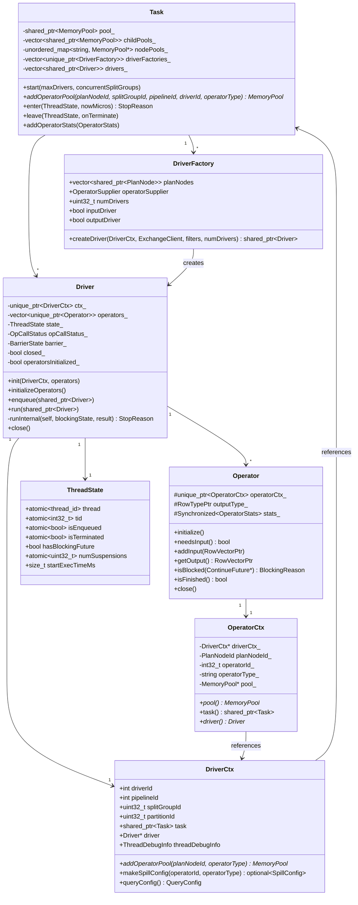
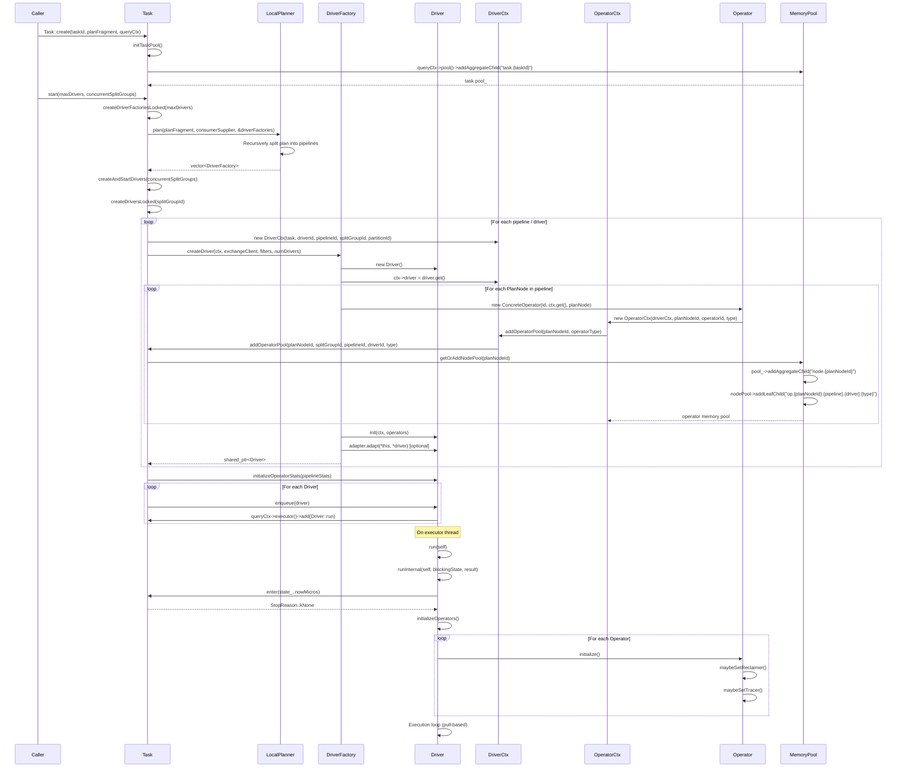

# Module Teardown: Driver Initialization & Pipeline Plumbing

## Table of Contents

- [0. Research Focus](#0-research-focus)
- [1. High-Level Overview](#1-high-level-overview)
- [2. Structural Architecture](#2-structural-architecture)
  - [Class Diagram](#class-diagram)
- [3. Execution & Call Flow](#3-execution-call-flow)
  - [Sequence Diagram](#sequence-diagram)
  - [Phase 1: Task & Pool Creation](#phase-1-task-pool-creation)
  - [Phase 2: Plan Decomposition into DriverFactories](#phase-2-plan-decomposition-into-driverfactories)
  - [Phase 3: Driver Creation (`createDriversLocked`)](#phase-3-driver-creation-createdriverslocked)
  - [Phase 4: Operator Pipeline Assembly (`DriverFactory::createDriver`)](#phase-4-operator-pipeline-assembly-driverfactorycreatedriver)
  - [Phase 5: Memory Pool Wiring During Operator Construction](#phase-5-memory-pool-wiring-during-operator-construction)
  - [Phase 6: Driver Initialization and Adapter Hook](#phase-6-driver-initialization-and-adapter-hook)
  - [Phase 7: Operator Stats Initialization](#phase-7-operator-stats-initialization)
  - [Phase 8: Enqueue and Execution](#phase-8-enqueue-and-execution)
- [4. Concurrency & State Management](#4-concurrency-state-management)
  - [Threading Model](#threading-model)
  - [State Machine](#state-machine)
  - [Synchronization](#synchronization)
- [5. Memory & Resource Profile](#5-memory-resource-profile)
  - [Allocation Pattern](#allocation-pattern)
  - [Memory Tracking](#memory-tracking)
- [6. Key Design Insights](#6-key-design-insights)
  - [1. Two-Phase Operator Lifecycle: Construction vs Initialization](#1-two-phase-operator-lifecycle-construction-vs-initialization)
  - [2. Private Constructor with Friend-Based Factory Pattern](#2-private-constructor-with-friend-based-factory-pattern)
  - [3. Filter+Project Fusion at the Factory Level](#3-filterproject-fusion-at-the-factory-level)
  - [4. CancelGuard RAII Pattern for Exception-Safe Thread Management](#4-cancelguard-raii-pattern-for-exception-safe-thread-management)
  - [5. Thread-Local DriverContext for Ambient Access](#5-thread-local-drivercontext-for-ambient-access)
  - [6. Pipeline Breaking is Recursive and Source-Driven](#6-pipeline-breaking-is-recursive-and-source-driven)
  - [7. Operator IDs Can Be Renumbered by Adapters](#7-operator-ids-can-be-renumbered-by-adapters)
  - [8. Shared PushdownFilters Across Drivers in Same Split Group](#8-shared-pushdownfilters-across-drivers-in-same-split-group)


## 0. Research Focus
* **Task ID:** 2.3.A
* **Focus:** How is a `Driver` instantiated with a sequence of `Operator`s? Trace how `DriverCtx` links the executing thread back to the `Task`'s memory pool and metrics.

## 1. High-Level Overview
* **Core Responsibility:** A `Driver` is the unit of single-threaded execution in Velox. It owns a linear pipeline of `Operator` objects and drives data through them in a pull-based loop. The `DriverCtx` bridges the driver back to its owning `Task`, providing access to query configuration, memory pools, spill config, and tracing context. Each operator in the pipeline gets its own leaf memory pool, wired through `DriverCtx` into a three-level hierarchy: QueryCtx pool -> Task pool -> Node pool -> Operator pool.
* **Key Triggers:** `Task::start()` triggers driver creation via `createDriversLocked()` which calls `DriverFactory::createDriver()`. The created drivers are then enqueued onto the executor via `Driver::enqueue()`, which schedules `Driver::run()` on a thread pool.

## 2. Structural Architecture
* **Primary Source Files:**
  - `velox/exec/Driver.h` -- `Driver`, `DriverCtx`, `DriverFactory`, `ThreadState`, `BlockingState`, `StopReason`
  - `velox/exec/Driver.cpp` -- `Driver::init()`, `Driver::run()`, `Driver::runInternal()`, `DriverCtx` implementation
  - `velox/exec/LocalPlanner.cpp` -- `DriverFactory::createDriver()`, `LocalPlanner::plan()`, pipeline splitting
  - `velox/exec/Operator.h` -- `Operator`, `OperatorCtx`, `SourceOperator`
  - `velox/exec/Task.cpp` -- `Task::createDriversLocked()`, `Task::addOperatorPool()`, `Task::enter()`

* **Key Data Structures:**
  - `DriverCtx` -- per-driver context linking to Task, with IDs for driver/pipeline/splitGroup/partition
  - `ThreadState` -- tracks whether driver is on-thread, enqueued, blocked, suspended, or terminated
  - `OpCallStatus` -- atomic tracking of which operator method is currently executing (for deadlock detection)
  - `BarrierState` -- manages barrier processing and output draining
  - `DriverFactory` -- holds plan nodes for a pipeline and creates Driver instances
  - `OperatorCtx` -- per-operator context holding memory pool and plan node ID

### Class Diagram


## 3. Execution & Call Flow

### Sequence Diagram


* **Step-by-step text breakdown:**

### Phase 1: Task & Pool Creation

1. `Task::create()` calls the private constructor, then `Task::init()`.
2. `Task::initTaskPool()` creates the task-level memory pool as a child of the QueryCtx pool:
   ```cpp
   pool_ = queryCtx_->pool()->addAggregateChild(
       fmt::format("task.{}", taskId_.c_str()), createTaskReclaimer());
   ```

### Phase 2: Plan Decomposition into DriverFactories

3. `Task::start()` calls `createDriverFactoriesLocked(maxDrivers)`.
4. This invokes `LocalPlanner::plan()`, which recursively walks the plan tree. The recursive `detail::plan()` function processes plan nodes bottom-up:
   ```cpp
   void plan(const shared_ptr<const PlanNode>& planNode,
             vector<shared_ptr<const PlanNode>>* currentPlanNodes, ...) {
     // ...
     for (int32_t i = 0; i < numSourcesToPlan; ++i) {
       plan(sources[i],
            mustStartNewPipeline(planNode, i) ? nullptr : currentPlanNodes,
            planNode, makeOperatorSupplier(planNode), driverFactories);
     }
     currentPlanNodes->push_back(planNode);
   }
   ```
   When `mustStartNewPipeline()` returns true (e.g., for LocalPartition, LocalMerge, or non-first join sources), a new `DriverFactory` is created with a fresh `planNodes` vector. The `operatorSupplier` is set to produce a `CallbackSink` or `LocalPartition` operator that bridges between pipelines.

5. After planning, `numDrivers` for each factory is computed based on plan node constraints and `maxDrivers`. For example, `MergeJoinNode` forces `numDrivers = 1`.

### Phase 3: Driver Creation (`createDriversLocked`)

6. `Task::createAndStartDrivers()` calls `createDriversLocked(splitGroupId)`.
7. For each pipeline and each partition within that pipeline, a `DriverCtx` is constructed:
   ```cpp
   drivers.emplace_back(factory->createDriver(
       std::make_unique<DriverCtx>(
           self,                        // shared_ptr<Task>
           driverIdOffset + partitionId, // driverId
           pipeline,                    // pipelineId
           splitGroupId,                // splitGroupId
           partitionId),                // partitionId
       getExchangeClientLocked(pipeline),
       filters,
       [self](size_t i) { ... }));
   ```

8. The `DriverCtx` constructor captures the Task pointer and creates `ThreadDebugInfo`:
   ```cpp
   DriverCtx::DriverCtx(shared_ptr<Task> _task, int _driverId,
       int _pipelineId, uint32_t _splitGroupId, uint32_t _partitionId)
       : driverId(_driverId), pipelineId(_pipelineId),
         splitGroupId(_splitGroupId), partitionId(_partitionId),
         task(std::move(_task)),
         threadDebugInfo({task->queryCtx()->queryId(), task->taskId(), nullptr}) {}
   ```

### Phase 4: Operator Pipeline Assembly (`DriverFactory::createDriver`)

9. `DriverFactory::createDriver()` allocates a raw `Driver` via private default constructor, then iterates over `planNodes`:
   ```cpp
   auto driver = std::shared_ptr<Driver>(new Driver());
   ctx->driver = driver.get();  // backlink from DriverCtx to Driver
   ```

10. For each `PlanNode`, the factory performs a chain of `dynamic_pointer_cast` checks to instantiate the correct operator type. **Filter + Project fusion** is a key optimization: if a `FilterNode` is immediately followed by a `ProjectNode`, they are fused into a single `FilterProject` operator:
    ```cpp
    if (auto filterNode = dynamic_pointer_cast<const core::FilterNode>(planNode)) {
      if (i < planNodes.size() - 1) {
        auto next = planNodes[i + 1];
        if (auto projectNode = dynamic_pointer_cast<const core::ProjectNode>(next)) {
          operators.push_back(
              std::make_unique<FilterProject>(id, ctx.get(), filterNode, projectNode));
          i++;  // skip the next node
          continue;
        }
      }
      operators.push_back(
          std::make_unique<FilterProject>(id, ctx.get(), filterNode, nullptr));
    }
    ```

11. For unknown plan nodes, the factory falls through to the pluggable `Operator::fromPlanNode()` which iterates registered `PlanNodeTranslator` instances.

12. If an `operatorSupplier` is set on the factory (for inter-pipeline sinks like `CallbackSink`), it is appended as the last operator:
    ```cpp
    if (operatorSupplier) {
      operators.push_back(operatorSupplier(operators.size(), ctx.get()));
    }
    ```

### Phase 5: Memory Pool Wiring During Operator Construction

13. Each `Operator` constructor creates an `OperatorCtx`, which in turn calls `DriverCtx::addOperatorPool()`:
    ```cpp
    OperatorCtx::OperatorCtx(DriverCtx* driverCtx, const PlanNodeId& planNodeId,
        int32_t operatorId, string_view operatorType)
        : driverCtx_(driverCtx), planNodeId_(planNodeId),
          operatorId_(operatorId), operatorType_(operatorType),
          pool_(driverCtx_->addOperatorPool(planNodeId, operatorType_)) {}
    ```

14. `DriverCtx::addOperatorPool()` delegates to `Task::addOperatorPool()`:
    ```cpp
    MemoryPool* DriverCtx::addOperatorPool(
        const PlanNodeId& planNodeId, const string& operatorType) {
      return task->addOperatorPool(
          planNodeId, splitGroupId, pipelineId, driverId, operatorType);
    }
    ```

15. `Task::addOperatorPool()` creates a two-level pool structure:
    ```cpp
    MemoryPool* Task::addOperatorPool(const PlanNodeId& planNodeId,
        uint32_t splitGroupId, int pipelineId, uint32_t driverId,
        const string& operatorType) {
      MemoryPool* nodePool;
      if (isHashJoinOperator(operatorType)) {
        nodePool = getOrAddJoinNodePool(planNodeId, splitGroupId);
      } else {
        nodePool = getOrAddNodePool(planNodeId);
      }
      childPools_.push_back(nodePool->addLeafChild(
          fmt::format("op.{}.{}.{}.{}", planNodeId, pipelineId, driverId, operatorType)));
      return childPools_.back().get();
    }
    ```

    The resulting pool hierarchy is:
    ```
    QueryCtx pool (root)
      +-- task.{taskId}                    (aggregate, Task-level)
           +-- node.{planNodeId}           (aggregate, shared by all drivers for this node)
           |    +-- op.{nodeId}.{pipe}.{driver}.{type}  (leaf, per-operator)
           |    +-- op.{nodeId}.{pipe}.{driver}.{type}  (leaf, another driver)
           +-- node.{planNodeId2}
                +-- ...
    ```

### Phase 6: Driver Initialization and Adapter Hook

16. After all operators are built, `DriverFactory::createDriver()` calls `Driver::init()`:
    ```cpp
    void Driver::init(unique_ptr<DriverCtx> ctx,
                      vector<unique_ptr<Operator>> operators) {
      VELOX_CHECK_NULL(ctx_);
      ctx_ = std::move(ctx);
      enableOperatorBatchSizeStats_ =
          ctx_->queryConfig().enableOperatorBatchSizeStats();
      cpuSliceMs_ = task()->driverCpuTimeSliceLimitMs();
      VELOX_CHECK(operators_.empty());
      operators_ = std::move(operators);
      curOperatorId_ = operators_.size() - 1;  // start from sink (last)
      trackOperatorCpuUsage_ = ctx_->queryConfig().operatorTrackCpuUsage();
    }
    ```

17. The adapter hook allows external components to rearrange or replace operators before execution:
    ```cpp
    for (auto& adapter : adapters) {
      if (adapter.adapt(*this, *driver)) {
        break;  // only one adapter applies
      }
    }
    driver->isAdaptable_ = false;
    ```

### Phase 7: Operator Stats Initialization

18. Back in `createDriversLocked()`, the first driver of each pipeline initializes operator stats templates:
    ```cpp
    drivers[firstPipelineDriverIndex]->initializeOperatorStats(
        taskStats_.pipelineStats[pipeline].operatorStats);
    ```
    This creates placeholder `OperatorStats` entries so that running stats can be merged in later.

### Phase 8: Enqueue and Execution

19. Drivers are enqueued via `Driver::enqueue()`, which adds them to the executor:
    ```cpp
    void Driver::enqueue(shared_ptr<Driver> driver) {
      driver->enqueueInternal();  // sets isEnqueued = true, records queue time
      driver->task()->queryCtx()->executor()->add(
          [driver]() { Driver::run(driver); });
    }
    ```

20. `Driver::run()` is the static entry point on the executor thread. It sets up thread-local context:
    ```cpp
    void Driver::run(shared_ptr<Driver> self) {
      process::TraceContext trace("Driver::run");
      ScopedThreadDebugInfo scopedInfo(self->driverCtx()->threadDebugInfo);
      ScopedDriverThreadContext scopedDriverThreadContext(self->driverCtx());
      // ...
      auto reason = self->runInternal(self, blockingState, nullResult);
    }
    ```

21. `runInternal()` first calls `Task::enter()` to atomically transition the driver to "on thread" state:
    ```cpp
    StopReason Task::enter(ThreadState& state, uint64_t nowMicros) {
      std::lock_guard<std::timed_mutex> l(mutex_);
      state.isEnqueued = false;
      // ... check terminated, already on thread ...
      if (reason == StopReason::kNone) {
        ++numThreads_;
        state.setThread();  // records std::this_thread::get_id() and start time
        state.hasBlockingFuture = false;
      }
      return reason;
    }
    ```

22. On the first execution, `initializeOperators()` is called, which invokes `Operator::initialize()` on each operator. This is deferred from construction to avoid memory allocation under the Task lock:
    ```cpp
    void Operator::initialize() {
      VELOX_CHECK(!initialized_);
      VELOX_CHECK_EQ(pool()->usedBytes(), 0, ...);
      initialized_ = true;
      maybeSetReclaimer();
      maybeSetTracer();
    }
    ```

## 4. Concurrency & State Management

### Threading Model
- Each `Driver` is single-threaded at any moment. The `ThreadState` struct enforces this: `state_.thread` records which thread is running the driver.
- Multiple drivers from the same pipeline can run concurrently on different threads (up to `numDrivers`).
- The `Task::mutex_` (a `std::timed_mutex`) serializes state transitions (enter, leave, terminate, pause).
- `Task::enter()` atomically transitions a driver from enqueued to on-thread, incrementing `numThreads_`.

### State Machine
The `ThreadState` struct tracks the driver through these states:

```
Created (all flags false)
    |
    v  [enqueue]
Enqueued (isEnqueued = true)
    |
    v  [Task::enter succeeds]
On Thread (thread = this_thread::id)
    |
    +---> Blocked (hasBlockingFuture = true, off thread)
    |         |
    |         v  [future realized -> BlockingState::setResume -> enqueue]
    |     Enqueued
    |
    +---> Suspended (numSuspensions > 0, still on thread)
    |         |
    |         v  [suspension ends]
    |     On Thread
    |
    +---> Terminated (isTerminated = true, FINAL)
    |
    +---> Yield -> Enqueued (goes to back of queue)
```

### Synchronization
- **Task mutex** (`std::timed_mutex`): protects all state transitions, driver creation, stats collection.
- **Operator stats** (`folly::Synchronized<OperatorStats>`): each operator has independently locked stats.
- **OpCallStatus** uses atomics for lock-free deadlock detection.
- **BlockingState** uses folly futures/promises for async blocking notification.
- **Thread-local `DriverThreadContext`**: set by `ScopedDriverThreadContext` when a driver thread starts executing. Allows any code on the thread to find the active `DriverCtx`.

## 5. Memory & Resource Profile

### Allocation Pattern
- **Construction phase**: Operator constructors must NOT allocate memory from the pool. The comment on `Operator::Operator()` explicitly states: "the operator constructor should not allocate memory from memory pool. The latter might trigger memory arbitration operation that can lead to deadlock as both operator construction and operator memory reclaim need to acquire task lock."
- **Initialization phase**: Memory allocation is deferred to `Operator::initialize()`, which runs on the executor thread (outside the Task lock). The check `VELOX_CHECK_EQ(pool()->usedBytes(), 0, ...)` enforces this contract.
- **Execution phase**: Operators allocate freely from their leaf pools. The framework wraps each operator call in a `NonReclaimableSectionGuard` via the `CALL_OPERATOR` macro, preventing memory reclaim during active operator execution.

### Memory Tracking
The pool hierarchy enables fine-grained tracking at multiple levels:

```
QueryCtx pool                    -- query-wide limit
  task.{taskId}                  -- task-wide tracking, has TaskReclaimer
    node.{planNodeId}            -- node-wide tracking, has ParallelMemoryReclaimer
      op.{id}.{pipe}.{drv}.{type} -- per-operator leaf, has Operator::MemoryReclaimer
```

Key design points:
- **Node pools are shared**: All operators for the same plan node (across different drivers) share the same node-level aggregate pool. This enables coordinated memory reclaim for nodes like hash join where build and probe sides need to coordinate.
- **Join nodes get split-group-scoped pools**: Hash join operators use `getOrAddJoinNodePool(planNodeId, splitGroupId)` which keys on `{planNodeId}[{splitGroupId}]`, giving each split group its own node pool with a `HashJoinMemoryReclaimer`.
- **Lifetime management**: All pool `shared_ptr`s are stored in `Task::childPools_`, ensuring they outlive all operators and drivers.
- **Spill config is per-driver**: `DriverCtx::makeSpillConfig()` builds a spill config with directory paths incorporating `{pipelineId}_{driverId}_{operatorId}`, ensuring no file collisions between drivers.
- **Stats rollup at close**: When a driver closes (`Driver::closeOperators()`), each operator's stats are extracted and merged into the Task's `pipelineStats` via `Task::addOperatorStats()`.

## 6. Key Design Insights

### 1. Two-Phase Operator Lifecycle: Construction vs Initialization
Operators are constructed during `DriverFactory::createDriver()` under the Task lock, but their `initialize()` method is deferred to the first execution on the thread pool. This is a deliberate deadlock-avoidance strategy:

```cpp
// Driver.cpp, line 308
void Driver::initializeOperators() {
  if (operatorsInitialized_) {
    return;
  }
  operatorsInitialized_ = true;
  for (auto& op : operators_) {
    op->initialize();
  }
}
```

The `Operator::initialize()` base implementation enforces zero memory usage at construction time:
```cpp
// Operator.cpp, line 186
void Operator::initialize() {
  VELOX_CHECK(!initialized_);
  VELOX_CHECK_EQ(pool()->usedBytes(), 0,
      "Unexpected memory usage from pool {} before operator init", pool()->name());
  initialized_ = true;
  maybeSetReclaimer();
  maybeSetTracer();
}
```

And `Task::createAndStartDrivers()` also enforces this invariant after all drivers are created:
```cpp
// Task.cpp, line 1070
if (pool_->reservedBytes() != 0) {
  VELOX_FAIL("Unexpected memory pool allocations during task[{}] driver initialization: {}",
      taskId_, pool_->treeMemoryUsage());
}
```

### 2. Private Constructor with Friend-Based Factory Pattern
The `Driver` class has a private default constructor and no public creation method. Only `DriverFactory` (declared as `friend struct DriverFactory`) can instantiate it:

```cpp
// Driver.h, line 582
Driver() = default;
// ...
friend struct DriverFactory;
```

```cpp
// LocalPlanner.cpp, line 476
auto driver = std::shared_ptr<Driver>(new Driver());
ctx->driver = driver.get();
```

This enforces that all drivers are created through the proper factory path, which guarantees proper operator assembly and memory pool wiring.

### 3. Filter+Project Fusion at the Factory Level
The operator pipeline assembly in `DriverFactory::createDriver()` performs compile-time operator fusion. When a `FilterNode` is immediately followed by a `ProjectNode` in the plan, they are merged into a single `FilterProject` operator, reducing the overhead of inter-operator data passing:

```cpp
// LocalPlanner.cpp, line 486
if (auto filterNode = dynamic_pointer_cast<const core::FilterNode>(planNode)) {
  if (i < planNodes.size() - 1) {
    auto next = planNodes[i + 1];
    if (auto projectNode = dynamic_pointer_cast<const core::ProjectNode>(next)) {
      operators.push_back(
          std::make_unique<FilterProject>(id, ctx.get(), filterNode, projectNode));
      i++;
      continue;
    }
  }
}
```

### 4. CancelGuard RAII Pattern for Exception-Safe Thread Management
The `CancelGuard` ensures the driver is properly removed from the thread and cleaned up even when an exception occurs during `runInternal()`:

```cpp
// Driver.cpp, line 534
CancelGuard guard(self, task().get(), &state_, [&](StopReason reason) {
  if (reason == StopReason::kTerminate) {
    ctx_->task->setError(
        makeException("Cancelled", __FILE__, __LINE__, __FUNCTION__));
  }
  close();
});
```

On normal exit, `guard.notThrown()` is called to suppress the error path. On exception (the default `isThrow_ = true`), the destructor terminates the driver and calls `Task::leave()`:

```cpp
// Driver.cpp, line 1242
Driver::CancelGuard::~CancelGuard() {
  bool onTerminateCalled{false};
  if (isThrow_) {
    state_->isTerminated = true;
    onTerminate_(StopReason::kNone);
    onTerminateCalled = true;
  }
  task_->leave(*state_, onTerminateCalled ? nullptr : onTerminate_);
}
```

### 5. Thread-Local DriverContext for Ambient Access
A thread-local pointer `driverThreadCtx` allows any code running on a driver thread to discover the active `DriverCtx` without explicit parameter passing:

```cpp
// Driver.cpp, line 48
thread_local DriverThreadContext* driverThreadCtx{nullptr};
```

The `ScopedDriverThreadContext` RAII class manages this, supporting nested contexts (e.g., when one driver thread temporarily services another context):

```cpp
// Driver.cpp, line 1362
ScopedDriverThreadContext::ScopedDriverThreadContext(const DriverCtx* driverCtx)
    : savedDriverThreadCtx_(driverThreadCtx),
      currentDriverThreadCtx_(DriverThreadContext(driverCtx)) {
  driverThreadCtx = &currentDriverThreadCtx_;
}
```

### 6. Pipeline Breaking is Recursive and Source-Driven
The `detail::plan()` function builds pipelines by walking the plan tree recursively. A new pipeline (new `DriverFactory`) is started whenever `mustStartNewPipeline()` returns true, which happens for:
- `LocalPartitionNode` (local exchange)
- `LocalMergeNode` (local merge)
- `MixedUnionNode`
- Any non-first source of a multi-source node (e.g., the build side of a hash join)

The pipeline-breaking consumer creates an `OperatorSupplier` (via `makeOperatorSupplier()`) that produces a `CallbackSink` at the end of the child pipeline, bridging it to the parent pipeline's source operator (e.g., `LocalExchange`).

### 7. Operator IDs Can Be Renumbered by Adapters
After `Driver::init()`, registered `DriverAdapter`s can rearrange or replace operators. The adapter mechanism calls `DriverFactory::replaceOperators()`, which erases and inserts operators, then renumbers all IDs:

```cpp
// LocalPlanner.cpp, line 769
for (auto i = 0; i < driver.operators_.size(); ++i) {
  driver.operators_[i]->setOperatorIdFromAdapter(i);
}
```

The `isAdaptable_` flag is set to false after adapters run, preventing further modification.

### 8. Shared PushdownFilters Across Drivers in Same Split Group
All drivers in the same pipeline and split group share a single `PipelinePushdownFilters` instance, allowing dynamic filter pushdown to be coordinated without duplication:

```cpp
// Task.cpp, line 1348
auto filters = std::make_shared<PipelinePushdownFilters>();
for (uint32_t partitionId = 0; partitionId < factory->numDrivers; ++partitionId) {
  drivers.emplace_back(factory->createDriver(..., filters, ...));
}
```

The `PipelinePushdownFilters` uses `folly::Synchronized` for thread-safe access, with a lock-ordering convention (downstream before upstream) to prevent deadlocks.
