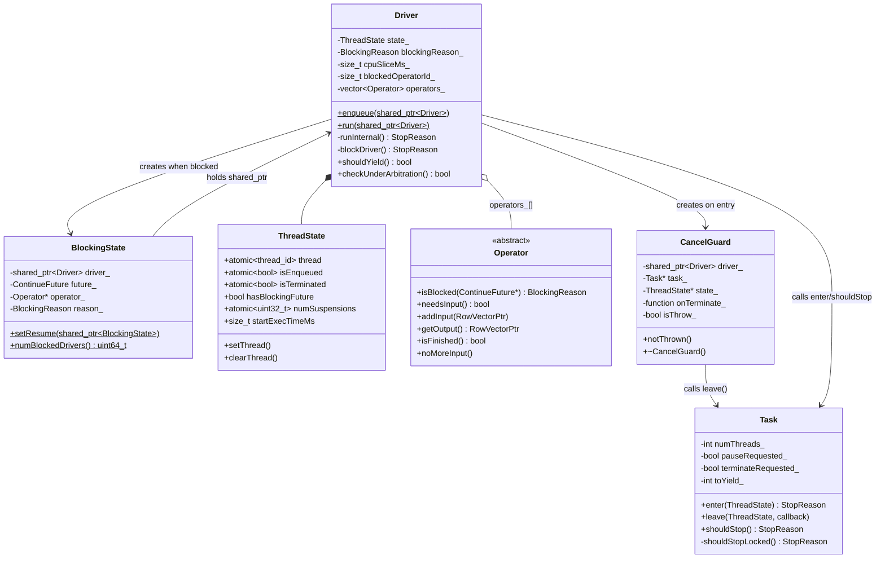

# Module Teardown: The Cooperative Yield Loop (Driver Execution Core)

## Table of Contents

- [0. Research Focus](#0-research-focus)
- [1. High-Level Overview](#1-high-level-overview)
- [2. Structural Architecture](#2-structural-architecture)
  - [Class Diagram](#class-diagram)
- [3. Execution & Call Flow](#3-execution-call-flow)
  - [Sequence Diagram](#sequence-diagram)
  - [Step-by-step text breakdown:](#step-by-step-text-breakdown)
- [4. Concurrency & State Management](#4-concurrency-state-management)
  - [Threading Model](#threading-model)
  - [State Machine](#state-machine)
  - [Synchronization Primitives](#synchronization-primitives)
- [5. Memory & Resource Profile](#5-memory-resource-profile)
  - [Allocation Pattern](#allocation-pattern)
  - [Memory Tracking](#memory-tracking)
- [6. Key Design Insights](#6-key-design-insights)
  - [6.1 Consumer-first iteration prioritizes pipeline drainage](#61-consumer-first-iteration-prioritizes-pipeline-drainage)
  - [6.2 Two-level yield: time-slice vs task-level](#62-two-level-yield-time-slice-vs-task-level)
  - [6.3 The blocking contract: every operator returns a valid future or kNotBlocked](#63-the-blocking-contract-every-operator-returns-a-valid-future-or-knotblocked)
  - [6.4 setResume uses QueuedImmediateExecutor to prevent reentrancy](#64-setresume-uses-queuedimmediateexecutor-to-prevent-reentrancy)
  - [6.5 CancelGuard guarantees thread-count correctness even on exceptions](#65-cancelguard-guarantees-thread-count-correctness-even-on-exceptions)
  - [6.6 Checking BOTH current and next operator for blocking prevents data loss](#66-checking-both-current-and-next-operator-for-blocking-prevents-data-loss)
  - [6.7 Pause-awareness in the resumption path prevents races with memory arbitration](#67-pause-awareness-in-the-resumption-path-prevents-races-with-memory-arbitration)
  - [6.8 Process-wide blocked driver counter enables global scheduling decisions](#68-process-wide-blocked-driver-counter-enables-global-scheduling-decisions)
  - [6.9 The sink operator special case handles serial execution mode](#69-the-sink-operator-special-case-handles-serial-execution-mode)


## 0. Research Focus
* **Task ID:** 2.3.B
* **Focus:** Trace the cooperative loop at the heart of the Velox engine. Exactly what causes a C++ `Driver` to yield the thread (`BlockingReason`)? How does it resume execution via futures/promises when I/O or memory becomes available?

## 1. High-Level Overview
* **Core Responsibility:** The `Driver::runInternal()` loop is the engine's heartbeat. It walks a pipeline of operators from sink (consumer) toward source (producer), polling each operator's `isBlocked()` / `needsInput()` / `getOutput()` / `addInput()` methods in a tight cooperative loop. When any operator reports a blocking condition, or when the driver exceeds its CPU time slice, the driver voluntarily yields the thread -- returning control to the executor thread pool so other drivers can make progress.
* **Key Triggers:** (1) An operator returns a non-`kNotBlocked` blocking reason from `isBlocked()`, producing a `ContinueFuture`. (2) The configurable `cpuSliceMs_` time limit is exceeded (`shouldYield()`). (3) The Task requests a pause, terminate, or yield via `shouldStop()`. (4) Memory arbitration is in progress for the query (`checkUnderArbitration()`). (5) The pipeline finishes (sink `isFinished()` returns true).

## 2. Structural Architecture
* **Primary Source Files:**
  - `velox/exec/Driver.h` -- `Driver`, `ThreadState`, `BlockingState`, `StopReason` enum, `CancelGuard`
  - `velox/exec/Driver.cpp` -- `run()`, `runInternal()`, `blockDriver()`, `BlockingState::setResume()`
  - `velox/exec/BlockingReason.h` -- `BlockingReason` enum
  - `velox/exec/Task.cpp` -- `Task::enter()`, `Task::leave()`, `Task::shouldStop()`, `Task::shouldStopLocked()`
  - `velox/common/future/VeloxPromise.h` -- `ContinuePromise`, `ContinueFuture`

* **Key Data Structures:**

| Structure | Role |
|---|---|
| `StopReason` | 8-value enum governing why a driver goes off-thread (`kNone`, `kBlock`, `kYield`, `kPause`, `kTerminate`, `kAtEnd`, `kAlreadyTerminated`, `kAlreadyOnThread`) |
| `BlockingReason` | 13-value enum describing *why* an operator is blocked (`kNotBlocked`, `kWaitForConsumer`, `kWaitForSplit`, `kWaitForProducer`, `kWaitForJoinBuild`, `kWaitForJoinProbe`, `kWaitForMergeJoinRightSide`, `kWaitForMemory`, `kWaitForConnector`, `kYield`, `kWaitForArbitration`, `kWaitForScanScaleUp`, `kWaitForIndexLookup`, `kWaitForRPC`) |
| `ThreadState` | Per-driver struct tracking: current thread id, `isEnqueued`, `isTerminated`, `hasBlockingFuture`, `numSuspensions`, `startExecTimeMs` for time-slice enforcement |
| `BlockingState` | Captures a `(Driver, ContinueFuture, Operator*, BlockingReason)` tuple when a driver goes off-thread; its static `setResume()` wires the future to re-enqueue the driver |
| `ContinueFuture` / `ContinuePromise` | `folly::SemiFuture<folly::Unit>` / `VeloxPromise<folly::Unit>` -- the promise/future pair used for all blocking/resumption signaling |
| `CancelGuard` | RAII guard that calls `Task::leave()` when the driver exits `runInternal()`, ensuring the thread count is always decremented and termination callbacks fire |
| `OpCallStatus` | Atomic struct tracking which operator method is currently executing, for deadlock detection |

### Class Diagram



## 3. Execution & Call Flow

### Sequence Diagram

```mermaid
sequenceDiagram
    participant Executor as Thread Pool (Executor)
    participant Run as Driver::run()
    participant RI as Driver::runInternal()
    participant Task as Task
    participant Op as Operator[i]
    participant NextOp as Operator[i+1]
    participant BS as BlockingState

    Executor->>Run: lambda [driver]() { Driver::run(driver); }
    Run->>RI: runInternal(self, blockingState, result)
    RI->>Task: enter(state_, now)
    Task-->>RI: StopReason::kNone (thread acquired)

    loop for(;;) outer loop
        loop for i = startingOperator downto 0
            RI->>Task: shouldStop()
            Task-->>RI: kNone

            Note over RI: Check shouldYield() (cpuSliceMs_)
            alt CPU time exceeded
                RI-->>Run: StopReason::kYield
                Run->>Executor: Driver::enqueue(self) -- back of queue
            end

            Note over RI: Check memory arbitration
            alt Under arbitration
                RI->>RI: blockDriver(...)
                RI-->>Run: StopReason::kBlock
            end

            RI->>Op: isBlocked(&future)
            alt Operator blocked
                Op-->>RI: BlockingReason (+ valid future)
                RI->>RI: blockDriver(self, i, future, blockingState)
                RI-->>Run: StopReason::kBlock
                Run->>BS: BlockingState::setResume(blockingState)
                Note over BS: future.via(exec).thenValue -> Driver::enqueue
            end

            RI->>NextOp: isBlocked(&future)
            alt Next operator blocked
                NextOp-->>RI: BlockingReason (+ valid future)
                RI->>RI: blockDriver(...)
                RI-->>Run: StopReason::kBlock
            end

            RI->>NextOp: needsInput()
            alt needsInput == true
                RI->>Op: getOutput()
                alt has output
                    RI->>NextOp: addInput(intermediateResult)
                    Note over RI: i += 2; continue (restart from consumer side)
                else no output, not blocked, isFinished
                    RI->>NextOp: noMoreInput()
                    Note over RI: break inner loop
                end
            end
        end
    end
```

### Step-by-step text breakdown:

**Phase 1: Thread Acquisition (`Driver::enqueue` -> `Task::enter`)**

1. `Driver::enqueue(driver)` is called (by the Task at startup, by `BlockingState::setResume` on unblock, or by `Driver::run` on yield). It marks `state_.isEnqueued = true`, records the queue start time, then submits a lambda `[driver]() { Driver::run(driver); }` to the `folly::CPUThreadPoolExecutor`.

```cpp
// static
void Driver::enqueue(std::shared_ptr<Driver> driver) {
  driver->enqueueInternal();
  if (driver->closed_) {
    return;
  }
  driver->task()->queryCtx()->executor()->add(
      [driver]() { Driver::run(driver); });
}
```

2. When a thread picks up the lambda, `Driver::run()` calls `runInternal()`. The first thing `runInternal()` does is call `Task::enter(state_, now)`, which acquires the Task's mutex and attempts to put the driver on-thread:

```cpp
StopReason Task::enter(ThreadState& state, uint64_t nowMicros) {
  std::lock_guard<std::timed_mutex> l(mutex_);
  VELOX_CHECK(state.isEnqueued);
  state.isEnqueued = false;
  if (state.isTerminated) {
    return StopReason::kAlreadyTerminated;
  }
  if (state.isOnThread()) {
    return StopReason::kAlreadyOnThread;
  }
  const auto reason = shouldStopLocked();
  if (reason == StopReason::kTerminate) {
    state.isTerminated = true;
  }
  if (reason == StopReason::kNone) {
    ++numThreads_;
    state.setThread();             // records thread id + startExecTimeMs
    state.hasBlockingFuture = false;
  }
  return reason;
}
```

The gate-check: if `shouldStopLocked()` returns anything other than `kNone`, the driver never gets on-thread. The Task's `numThreads_` counter is incremented atomically under the mutex only on success.

**Phase 2: The Cooperative Inner Loop**

3. Inside `runInternal()`, after successfully entering the thread, a `CancelGuard` is created. This RAII object ensures `Task::leave()` is called regardless of how the function exits (normal return, exception, etc.):

```cpp
CancelGuard guard(self, task().get(), &state_, [&](StopReason reason) {
    if (reason == StopReason::kTerminate) {
      ctx_->task->setError(
          makeException("Cancelled", __FILE__, __LINE__, __FUNCTION__));
    }
    close();
});
```

4. The outer `for(;;)` loop runs indefinitely until the driver blocks, yields, terminates, or finishes. The inner loop walks operators from the consumer (sink, index = `operators_.size() - 1`) toward the producer (source, index = 0):

```cpp
for (;;) {
    for (int32_t i = startingOperator; i >= 0; --i) {
```

5. **Check 1 -- Task-level stop signals.** At the top of every iteration:

```cpp
stop = task()->shouldStop();
if (stop != StopReason::kNone) {
    guard.notThrown();
    return stop;
}
```

`Task::shouldStop()` checks three atomic flags without taking a lock (fast path):

```cpp
StopReason Task::shouldStop() {
  if (pauseRequested_) return StopReason::kPause;
  if (terminateRequested_) return StopReason::kTerminate;
  if (toYield_) {
    std::lock_guard<std::timed_mutex> l(mutex_);
    return shouldStopLocked();
  }
  return StopReason::kNone;
}
```

The `toYield_` counter is set by `Task::yieldIfDue()` (called externally) and decremented per driver that yields, ensuring exactly `numThreads_` drivers yield.

6. **Check 2 -- CPU time-slice yield.** Immediately after the task stop check:

```cpp
if (FOLLY_UNLIKELY(shouldYield())) {
    recordYieldCount();
    guard.notThrown();
    return StopReason::kYield;
}
```

```cpp
bool Driver::shouldYield() const {
  if (cpuSliceMs_ == 0) return false;       // disabled in serial mode
  return execTimeMs() >= cpuSliceMs_;        // wall time on thread
}
```

`cpuSliceMs_` comes from `QueryConfig::driverCpuTimeSliceLimitMs()` (0 = disabled). This is the per-driver time-slice enforcement. When it fires, `run()` handles the yield by re-enqueuing to the back of the executor queue:

```cpp
case StopReason::kYield:
    // Go to the end of the queue.
    enqueue(self);
    return;
```

7. **Check 3 -- Memory arbitration block.** Before calling any operator:

```cpp
if (FOLLY_UNLIKELY(checkUnderArbitration(&future))) {
    blockingReason_ = BlockingReason::kWaitForArbitration;
    return blockDriver(self, i, std::move(future), blockingState, guard);
}
```

If the query is currently under memory arbitration, the driver goes off-thread instead of running and likely hitting the same arbitration lock. The future is fulfilled when arbitration completes.

8. **Check 4 -- Operator `isBlocked()`.** For both the current operator and the next (consumer-side) operator:

```cpp
// Check current operator
blockingReason_ = op->isBlocked(&future);
if (blockingReason_ != BlockingReason::kNotBlocked) {
    return blockDriver(self, i, std::move(future), blockingState, guard);
}

// Check next operator (i+1, the consumer)
blockingReason_ = nextOp->isBlocked(&future);
if (blockingReason_ != BlockingReason::kNotBlocked) {
    return blockDriver(self, i + 1, std::move(future), blockingState, guard);
}
```

9. **Data flow -- needsInput / getOutput / addInput.** If neither operator is blocked and the next operator needs input:

```cpp
bool needsInput;
needsInput = nextOp->needsInput();
if (needsInput) {
    RowVectorPtr intermediateResult;
    getOutput(op, intermediateResult);
    if (intermediateResult) {
        addInput(nextOp, intermediateResult);
        i += 2;          // restart from consumer side
        continue;
    }
```

The `i += 2; continue` is critical: after feeding data downstream, the loop restarts from the consumer end. This prioritizes draining data out of the pipeline before pulling more in.

10. **Finish propagation.** When `getOutput()` returns null and the operator `isFinished()`:

```cpp
if (finished) {
    nextOp->noMoreInput();
    break;   // break inner loop, re-enter outer loop
}
```

**Phase 3: Blocking and Resumption (`blockDriver` + `BlockingState::setResume`)**

11. `blockDriver()` packages the blocking state:

```cpp
StopReason Driver::blockDriver(
    const std::shared_ptr<Driver>& self,
    size_t blockedOperatorId,
    ContinueFuture&& future,
    std::shared_ptr<BlockingState>& blockingState,
    CancelGuard& guard) {
  VELOX_CHECK(future.valid(), ...);
  if (blockingReason_ == BlockingReason::kYield) {
    recordYieldCount();
  }
  blockedOperatorId_ = blockedOperatorId;
  blockingState = std::make_shared<BlockingState>(
      self, std::move(future), op, blockingReason_);
  guard.notThrown();
  return StopReason::kBlock;
}
```

12. The `BlockingState` constructor marks the driver as having a blocking future:

```cpp
BlockingState::BlockingState(
    std::shared_ptr<Driver> driver, ContinueFuture&& future,
    Operator* op, BlockingReason reason)
    : driver_(std::move(driver)), future_(std::move(future)),
      operator_(op), reason_(reason),
      sinceUs_(/*now*/) {
  driver_->state().hasBlockingFuture = true;
  driver_->state().blockingStartUs = sinceUs_;
  numBlockedDrivers_++;
}
```

13. Back in `Driver::run()`, after `runInternal()` returns `kBlock`, the resumption callback is wired:

```cpp
case StopReason::kBlock:
    BlockingState::setResume(blockingState);
    return;
```

14. `BlockingState::setResume()` is the key piece that connects blocking to resumption:

```cpp
void BlockingState::setResume(std::shared_ptr<BlockingState> state) {
  VELOX_CHECK(!state->driver_->isOnThread());
  auto& exec = folly::QueuedImmediateExecutor::instance();
  std::move(state->future_)
      .via(&exec)
      .thenValue([state](auto&&) {
        auto& driver = state->driver_;
        auto& task = driver->task();
        std::lock_guard<std::timed_mutex> l(task->mutex());
        if (!driver->state().isTerminated) {
          state->operator_->recordBlockingTime(state->sinceUs_, state->reason_);
        }
        VELOX_CHECK(driver->state().hasBlockingFuture);
        driver->state().hasBlockingFuture = false;
        if (task->pauseRequested()) {
          return;  // will be re-enqueued at task resume
        }
        Driver::enqueue(state->driver_);
      })
      .thenError(folly::tag_t<std::exception>{}, [state](std::exception const& e) {
          // ... sets task error
      });
}
```

When the `ContinueFuture` is fulfilled (by whatever operator set the corresponding `ContinuePromise`), the callback fires: it records blocking time, clears the `hasBlockingFuture` flag, and re-enqueues the driver. If the task is paused, the driver stays off-thread and will be re-enqueued when the task resumes.

**Phase 4: Thread Release (`CancelGuard` + `Task::leave`)**

15. The `CancelGuard` destructor handles thread release:

```cpp
Driver::CancelGuard::~CancelGuard() {
  bool onTerminateCalled{false};
  if (isThrow_) {
    state_->isTerminated = true;
    onTerminate_(StopReason::kNone);
    onTerminateCalled = true;
  }
  task_->leave(*state_, onTerminateCalled ? nullptr : onTerminate_);
}
```

If the function exited normally (via `guard.notThrown()`), the driver's thread is released via `Task::leave()`, which decrements `numThreads_` and clears the thread id. If an exception escaped, it marks the driver terminated first.

## 4. Concurrency & State Management

### Threading Model

Each `Driver` runs on exactly one executor thread at a time. The `ThreadState` struct enforces mutual exclusion at a conceptual level -- `Task::enter()` refuses to put a driver on-thread if it is already on one (`StopReason::kAlreadyOnThread`). The `shared_ptr<Driver>` captured in the executor lambda and the `BlockingState` prevents premature destruction.

Thread transitions are serialized by the Task's `std::timed_mutex`:
- `Task::enter()` -- takes mutex, increments `numThreads_`, sets thread id
- `Task::leave()` -- takes mutex, decrements `numThreads_`, clears thread id
- `BlockingState::setResume()` -- takes mutex before re-enqueueing

The `numThreads_` counter on `Task` tracks how many drivers are actively on a thread. When it reaches zero, `allThreadsFinishedLocked()` fulfills promises that allow Task-level pause/terminate operations to proceed.

### State Machine

```
                   enqueue()
    [Created] -----------------> [Enqueued]
                                     |
                              Task::enter()
                                     |
                                     v
                                [On Thread] <-------+
                                /   |   \           |
                     kBlock    /    |    \ kYield   |
                              /     |     \         |
                             v      |      v        |
                        [Blocked]   |  [Enqueued]---+
                             |      |   re-enqueue to back
                    future   |      |
                   fulfilled |      | kPause / kTerminate
                      +------+      |
                      |             v
                      +----> [Terminated / Closed]
                                    |
                            (kAtEnd: pipeline done)
                            (kTerminate: task cancelled)
```

The `Suspended` state is orthogonal: a driver on-thread enters suspension via `Task::enterSuspended()` when waiting for RPC or memory decisions. The key difference from `Blocked` is that `Suspended` preserves the call stack (the thread stays alive but the Task decrements `numThreads_` so pause/terminate can proceed).

### Synchronization Primitives

| Primitive | Location | Purpose |
|---|---|---|
| `Task::mutex_` (`std::timed_mutex`) | Task | Serializes all driver state transitions (enter/leave/enqueue) |
| `ThreadState::thread` (`std::atomic<thread::id>`) | Per-driver | Lock-free check for "is on thread" |
| `ThreadState::isTerminated` (`std::atomic<bool>`) | Per-driver | Set once, never unset; checked without lock |
| `ThreadState::isEnqueued` (`std::atomic<bool>`) | Per-driver | Set during enqueue, cleared on `Task::enter()` |
| `ContinueFuture`/`ContinuePromise` | Per blocking event | Folly SemiFuture/Promise pair for async resumption |
| `Task::pauseRequested_` | Task | Atomic bool checked in fast path of `shouldStop()` |
| `Task::terminateRequested_` | Task | Atomic bool checked in fast path of `shouldStop()` |
| `Task::toYield_` | Task | Counter decremented under lock, one per yielding driver |

## 5. Memory & Resource Profile

### Allocation Pattern

The `Driver` itself is heap-allocated via `shared_ptr` (created in `DriverFactory::createDriver()`). Each `BlockingState` is also heap-allocated as a `shared_ptr` because it must outlive the driver's time on-thread -- the future callback captures it. This is a conscious trade-off: one small allocation per block/unblock cycle.

The operators vector (`operators_`) is allocated once at driver creation and never resized. The `ContinueFuture` objects are stack-allocated in `runInternal()` and moved into `BlockingState` when needed.

### Memory Tracking

The driver integrates with memory arbitration through `checkUnderArbitration()`. When a query's memory pool is under arbitration, the driver proactively yields rather than risk hitting the arbitrator:

```cpp
if (FOLLY_UNLIKELY(checkUnderArbitration(&future))) {
    blockingReason_ = BlockingReason::kWaitForArbitration;
    return blockDriver(self, i, std::move(future), blockingState, guard);
}
```

The `QueryCtx::checkUnderArbitration()` creates a promise that is fulfilled when arbitration completes:

```cpp
bool QueryCtx::checkUnderArbitration(ContinueFuture* future) {
  if (!underArbitration_) return false;
  std::lock_guard<std::mutex> l(mutex_);
  if (!underArbitration_) return false;
  arbitrationPromises_.emplace_back("QueryCtx::waitArbitration");
  *future = arbitrationPromises_.back().getSemiFuture();
  return true;
}
```

## 6. Key Design Insights

### 6.1 Consumer-first iteration prioritizes pipeline drainage

The inner loop walks from the **consumer (sink, highest index) toward the producer (source, index 0)**. When output is successfully passed downstream (`addInput`), the loop restarts from the consumer end via `i += 2; continue`. This ensures data already in the pipeline is flushed out before new data is pulled from the source. This prevents unbounded buffering within the pipeline.

```cpp
for (int32_t i = startingOperator; i >= 0; --i) {
    // ... after successful addInput:
    i += 2;
    continue;
```

The `startingOperator` defaults to `operators_.size() - 1` (the consumer/sink end).

### 6.2 Two-level yield: time-slice vs task-level

There are two independent yield mechanisms:

**Per-driver CPU time slice** (`cpuSliceMs_`): configured via `QueryConfig::driverCpuTimeSliceLimitMs()`. The driver checks `shouldYield()` on every loop iteration. This is wall-clock based (comparing `getCurrentTimeMs() - startExecTimeMs`). Disabled in serial execution mode. When triggered, returns `kYield` and the driver is re-enqueued to the back of the executor queue.

**Task-level yield** (`Task::toYield_`): set externally by `Task::yieldIfDue(startTimeMicros)` which sets `toYield_ = numThreads_`. Each driver that checks `shouldStop()` and finds `toYield_ > 0` decrements the counter under the lock and yields. This yields ALL drivers of a task, not just one.

There is also a **scan-level yield** in `TableScan::getOutput()` which checks both the above signals plus its own `getOutputTimeLimitMs_`:

```cpp
bool TableScan::shouldYield(StopReason taskStopReason, size_t startTimeMs) const {
  return taskStopReason == StopReason::kYield ||
      driverCtx_->driver->shouldYield() ||
      ((getOutputTimeLimitMs_ != 0) &&
       (getCurrentTimeMs() - startTimeMs) >= getOutputTimeLimitMs_);
}
```

When a scan yields, it uses a special pattern: sets `BlockingReason::kYield` with an immediately-fulfilled future (`ContinueFuture{folly::Unit{}}`), which causes the driver to go through the normal block/resume path but resumes immediately.

### 6.3 The blocking contract: every operator returns a valid future or kNotBlocked

The `blockDriver()` method enforces an invariant:

```cpp
VELOX_CHECK(future.valid(),
    "The operator {} is blocked but blocking future is not valid",
    op->operatorType());
VELOX_CHECK_NE(blockingReason_, BlockingReason::kNotBlocked);
```

This is a strict contract: if an operator says it's blocked, it MUST provide a valid `ContinueFuture`. The future is the resumption token. Without it, the driver would hang forever.

Operators create these promises using `makeVeloxContinuePromiseContract()`:

```cpp
static inline std::pair<ContinuePromise, ContinueFuture>
makeVeloxContinuePromiseContract(const std::string& promiseContext) {
  auto p = ContinuePromise(promiseContext);
  auto f = p.getSemiFuture();
  return std::make_pair(std::move(p), std::move(f));
}
```

The operator retains the `ContinuePromise` and hands back the `ContinueFuture`. When the blocking condition clears (e.g., hash build finishes, exchange data arrives, memory is freed), the promise holder calls `promise.setValue()`, which triggers the `setResume` callback chain.

### 6.4 setResume uses QueuedImmediateExecutor to prevent reentrancy

```cpp
auto& exec = folly::QueuedImmediateExecutor::instance();
std::move(state->future_)
    .via(&exec)
    .thenValue([state](auto&&) {
        // ... enqueue driver
    });
```

The `QueuedImmediateExecutor` is critical here. If the future is already fulfilled when `setResume` is called, the callback runs inline. But by using `QueuedImmediateExecutor` (which queues rather than immediately executes nested callbacks), it prevents a situation where the promise fulfillment triggers immediate re-enqueue, which could lead to two threads trying to enter the same driver before the first one fully exits.

### 6.5 CancelGuard guarantees thread-count correctness even on exceptions

The `CancelGuard` RAII pattern ensures the `Task::leave()` is always called:

```cpp
Driver::CancelGuard::~CancelGuard() {
  bool onTerminateCalled{false};
  if (isThrow_) {
    state_->isTerminated = true;
    onTerminate_(StopReason::kNone);
    onTerminateCalled = true;
  }
  task_->leave(*state_, onTerminateCalled ? nullptr : onTerminate_);
}
```

All normal exit paths call `guard.notThrown()` before returning. If the destructor runs without `notThrown()`, it knows an exception escaped, marks the driver terminated, and calls the `onTerminate_` callback (which closes the driver and removes it from the task).

### 6.6 Checking BOTH current and next operator for blocking prevents data loss

The loop checks `isBlocked()` on **both** the current operator (producer) and the next operator (consumer) before attempting data transfer:

```cpp
// Check current operator
blockingReason_ = op->isBlocked(&future);
if (blockingReason_ != BlockingReason::kNotBlocked) {
    return blockDriver(self, i, std::move(future), blockingState, guard);
}
// Check next operator
blockingReason_ = nextOp->isBlocked(&future);
if (blockingReason_ != BlockingReason::kNotBlocked) {
    return blockDriver(self, i + 1, std::move(future), blockingState, guard);
}
```

This two-operator check is essential because: (a) the producer may be blocked waiting for some resource (e.g., hash build), so calling `getOutput()` would be wrong, and (b) the consumer may be blocked (e.g., partitioned output buffer full), so passing it data would overflow or fail. By checking both, the driver yields as early as possible.

### 6.7 Pause-awareness in the resumption path prevents races with memory arbitration

In `BlockingState::setResume()`, after the future fires and the Task mutex is acquired, there is a pause check:

```cpp
if (task->pauseRequested()) {
    return;  // The thread will be enqueued at resume.
}
Driver::enqueue(state->driver_);
```

If a task pause was requested while the driver was blocked (common during memory arbitration), the driver is NOT re-enqueued. Instead, it stays off-thread and will be enqueued later when the task resumes (via `Task::resume()` iterating over all off-thread drivers). This prevents drivers from running during a pause, which could corrupt state during memory arbitration or spilling.

### 6.8 Process-wide blocked driver counter enables global scheduling decisions

```cpp
static std::atomic_uint64_t numBlockedDrivers_;
// In constructor: numBlockedDrivers_++;
// In destructor: numBlockedDrivers_--;
```

`BlockingState` maintains a process-wide atomic counter of blocked drivers. This is accessible via `BlockingState::numBlockedDrivers()` and can be used by external scheduling infrastructure to make decisions about thread pool sizing or query prioritization.

### 6.9 The sink operator special case handles serial execution mode

When the loop reaches the last operator (sink) at the highest index, a separate code path handles it:

```cpp
} else {
    // A sink operator
    getOutput(op, result);
    if (result) {
        // Serial execution mode only
        blockingReason_ = BlockingReason::kWaitForConsumer;
        guard.notThrown();
        return StopReason::kBlock;
    }
    if (finished) {
        guard.notThrown();
        close();
        return StopReason::kAtEnd;
    }
}
```

In async (normal) execution, the sink must not produce output -- data exits via callbacks (like `CallbackSink::consumeCb_`). If the sink *does* return output, it's serial execution mode where the caller of `Driver::next()` receives the data directly. The `kAtEnd` path is where a pipeline finishes: the driver closes itself and removes itself from the task.
