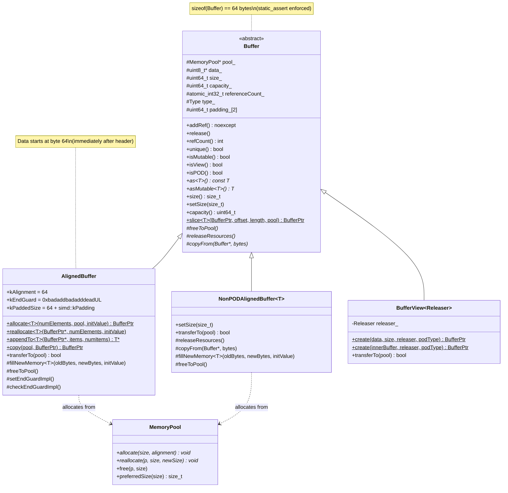
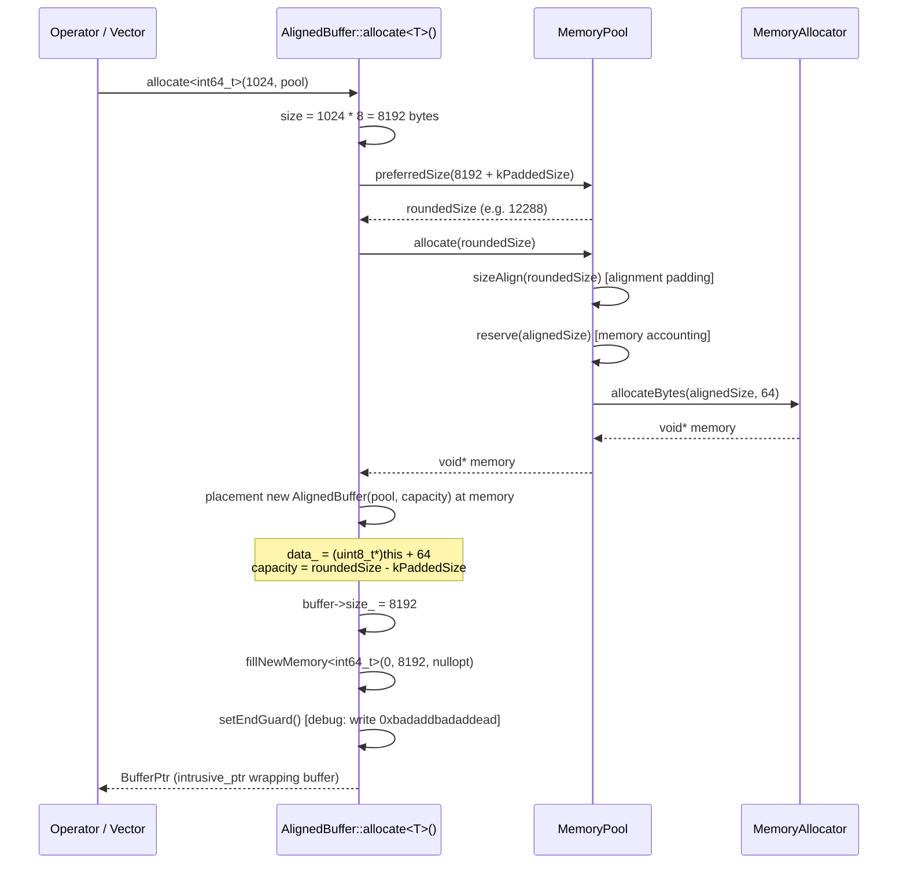
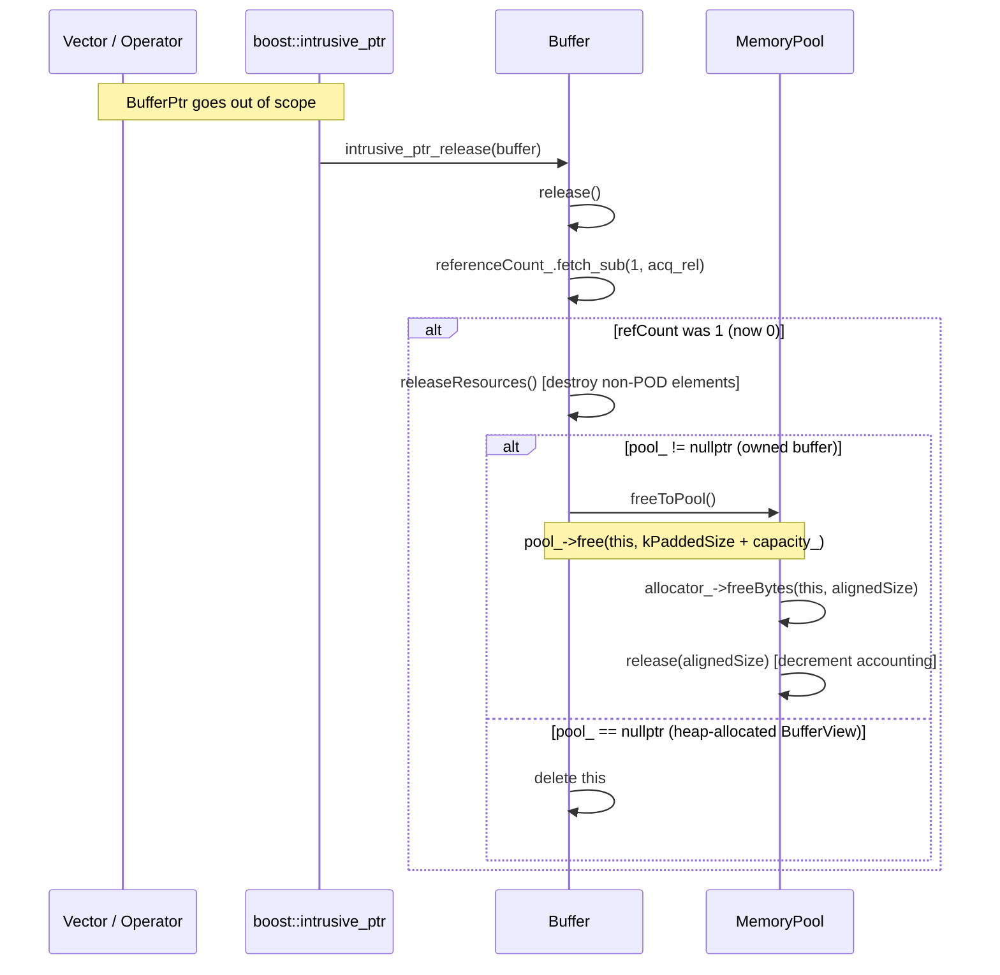
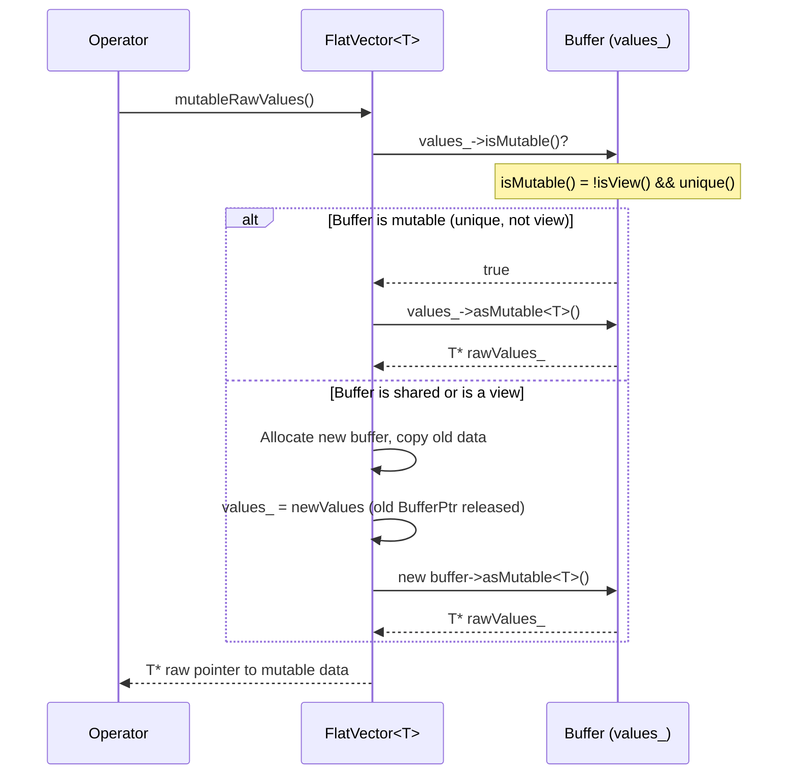
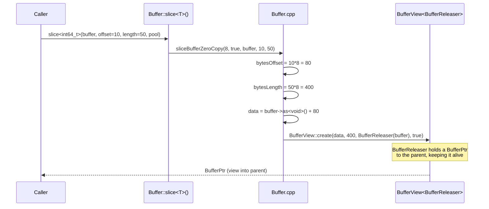

# Module Teardown: The `Buffer` Memory Wrapper

## Table of Contents

- [0. Research Focus](#0-research-focus)
- [1. High-Level Overview](#1-high-level-overview)
- [2. Structural Architecture](#2-structural-architecture)
  - [Class Diagram](#class-diagram)
- [3. Execution & Call Flow](#3-execution-call-flow)
  - [3.1 Allocation Sequence](#31-allocation-sequence)
  - [3.2 Reference Counting & Deallocation Sequence](#32-reference-counting-deallocation-sequence)
  - [3.3 Mutability Protocol](#33-mutability-protocol)
  - [3.4 Zero-Copy Slice](#34-zero-copy-slice)
  - [3.5 Reallocate Flow](#35-reallocate-flow)
- [4. Concurrency & State Management](#4-concurrency-state-management)
  - [Threading Model](#threading-model)
  - [State Machine](#state-machine)
  - [Synchronization](#synchronization)
- [5. Memory & Resource Profile](#5-memory-resource-profile)
  - [Allocation Pattern](#allocation-pattern)
  - [Memory Tracking](#memory-tracking)
- [6. Key Design Insights](#6-key-design-insights)
  - [Insight 1: Intrusive Pointer Eliminates Control Block Overhead](#insight-1-intrusive-pointer-eliminates-control-block-overhead)
  - [Insight 2: Header + Payload as Single Allocation (Placement New)](#insight-2-header-payload-as-single-allocation-placement-new)
  - [Insight 3: POD vs Non-POD Type Dispatch is Compile-Time](#insight-3-pod-vs-non-pod-type-dispatch-is-compile-time)
  - [Insight 4: BufferView Enables Zero-Copy with Lifetime Extension](#insight-4-bufferview-enables-zero-copy-with-lifetime-extension)
  - [Insight 5: Copy-on-Write via `unique()` Check](#insight-5-copy-on-write-via-unique-check)
  - [Insight 6: Debug Guard Against Buffer Overrun](#insight-6-debug-guard-against-buffer-overrun)
  - [Insight 7: Reuse-Friendly Design for Batch Processing](#insight-7-reuse-friendly-design-for-batch-processing)
  - [Insight 8: Detach Pattern Prevents Double-Free in Reallocate](#insight-8-detach-pattern-prevents-double-free-in-reallocate)


## 0. Research Focus
* **Task ID:** 1.1
* **Focus:** Analyze how `velox::Buffer` wraps contiguous raw memory. Trace its use of `boost::intrusive_ptr` for reference counting (C++ ownership) vs. Trino's GC model. How are allocations requested from the `MemoryPool`?

## 1. High-Level Overview
* **Core Responsibility:** `Buffer` is Velox's fundamental contiguous memory wrapper that serves as the backing store for all vector payloads -- value arrays, null bitmaps, dictionary indices, and string data. It provides reference-counted ownership via `boost::intrusive_ptr`, distinguishes between owned memory (`AlignedBuffer`) and externally-managed views (`BufferView`), and enforces a single-writer / multiple-reader discipline through its mutability model.
* **Key Triggers:** Buffer allocation is triggered whenever a vector is created or resized -- operators produce output vectors with freshly allocated buffers, dictionary encodings wrap buffers as indices, and null flags are stored in boolean-packed buffers. Buffer reuse is triggered when an operator finds a singly-referenced buffer from a previous batch, avoiding reallocation.

## 2. Structural Architecture
* **Primary Source Files:**
  - `velox/buffer/Buffer.h` -- Base `Buffer` class, `AlignedBuffer`, `NonPODAlignedBuffer<T>`, `BufferView<Releaser>`
  - `velox/buffer/Buffer.cpp` -- `sliceBufferZeroCopy`, `slice<bool>` specialization, `BufferReleaser`
  - `velox/buffer/StringViewBufferHolder.h` -- Utility for managing string data ownership in buffers
  - `velox/common/memory/MemoryPool.h` -- `MemoryPool` / `MemoryPoolImpl` that backs allocations
  - `velox/common/memory/MemoryAllocator.h` -- Low-level `allocateBytes` / `freeBytes` dispatch
* **Key Data Structures:**
  - `Buffer` -- 64-byte base object with intrusive refcount, type tag, data pointer, size/capacity
  - `AlignedBuffer` -- Owning buffer that places payload immediately after the 64-byte header
  - `NonPODAlignedBuffer<T>` -- Type-aware variant that manages constructors/destructors for non-POD elements
  - `BufferView<Releaser>` -- Immutable non-owning view with custom release callback
  - `BufferPtr` = `boost::intrusive_ptr<Buffer>` -- The smart pointer type used everywhere

### Class Diagram


## 3. Execution & Call Flow

### 3.1 Allocation Sequence



* **Step-by-step text breakdown:**

1. **Size calculation**: The requested number of elements is multiplied by `sizeof(T)` to get the byte count. For `allocate<int64_t>(1024, pool)`, this yields `1024 * 8 = 8192` bytes.

2. **Preferred size rounding**: The pool's `preferredSize()` rounds up `size + kPaddedSize` to follow JEMalloc-like size classes (powers of 2 or 1.5x a power of 2). The `kPaddedSize = sizeof(AlignedBuffer) + simd::kPadding = 64 + max(32, SIMD_width)`. This over-allocation is critical -- it guarantees SIMD-safe padding beyond `capacity()`.

   ```cpp
   // From MemoryPool.cpp
   size_t MemoryPool::getPreferredSize(size_t size) {
     if (size < 8) {
       return 8;
     }
     int32_t bits = 63 - bits::countLeadingZeros<uint64_t>(size);
     size_t lower = 1ULL << bits;
     if (lower == size) {
       return size;
     }
     if (lower + (lower / 2) >= size) {
       return lower + (lower / 2);
     }
     return lower * 2;
   }
   ```

3. **Pool allocation**: `MemoryPool::allocate()` aligns the size, reserves against the memory budget (propagating up the pool hierarchy), then delegates to `MemoryAllocator::allocateBytes()`. The allocator may use malloc or mmap depending on configuration.

   ```cpp
   // From MemoryPool.cpp
   void* MemoryPoolImpl::allocate(int64_t size, std::optional<uint32_t> alignment) {
     const auto alignedSize = sizeAlign(size);
     reserve(alignedSize);
     void* buffer = allocator_->allocateBytes(alignedSize, alignment_);
     // ...
     return buffer;
   }
   ```

4. **Placement new**: The `AlignedBuffer` object is constructed in-place at the start of the allocated memory via `new (memory) AlignedBuffer{pool, capacity}`. The constructor sets `data_ = (uint8_t*)this + sizeof(*this)`, meaning the payload begins immediately after the 64-byte header object. This is a critical design choice -- the buffer metadata and payload are a single contiguous allocation.

   ```cpp
   // From Buffer.h
   AlignedBuffer(velox::memory::MemoryPool* pool, size_t capacity)
       : Buffer{
             Type::kPOD,
             reinterpret_cast<uint8_t*>(this) + sizeof(*this),
             capacity,
             pool} {
     static_assert(sizeof(*this) == kAlignment);  // 64 bytes
   }
   ```

5. **Initialization**: `fillNewMemory<T>()` optionally fills the buffer with an initial value. In debug builds, uninitialized memory is filled with `0xa1` to make use-before-init visible.

6. **End guard**: In debug builds, a magic word `0xbadaddbadadddeadUL` is written at `data_ + capacity_` to detect buffer overruns.

### 3.2 Reference Counting & Deallocation Sequence



* **Step-by-step text breakdown:**

1. When a `BufferPtr` is copied, `intrusive_ptr_add_ref` calls `buffer->addRef()`, which atomically increments `referenceCount_` with `memory_order_acq_rel`.

2. When a `BufferPtr` is destroyed or reset, `intrusive_ptr_release` calls `buffer->release()`.

3. `release()` atomically decrements `referenceCount_`. If the count was 1 (meaning this was the last reference), it proceeds with cleanup.

4. `releaseResources()` is called first -- this is a virtual hook. For `NonPODAlignedBuffer<T>`, it explicitly calls destructors on each element. For POD buffers, it's a no-op.

5. If `pool_` is non-null (the buffer owns its memory), `freeToPool()` returns the entire allocation (header + payload + padding) back to the pool. The pool then decrements its usage accounting and frees through the allocator.

6. If `pool_` is null (a `BufferView` allocated with `new`), `delete this` is called.

The key distinction from a GC model: **deallocation is deterministic and immediate** when the last reference drops. There is no finalization queue, no GC pause, and no resurrection. The intrusive refcount is embedded in the object itself (no separate control block as with `std::shared_ptr`).

### 3.3 Mutability Protocol



The pattern used everywhere in Velox: **copy-on-write at the buffer level**. The check is:

```cpp
bool isMutable() const noexcept {
    return !isView() && unique();
}
```

A buffer is mutable only if (a) it is not a view (it owns its memory), and (b) it has exactly one reference. If either condition fails, the vector copies the data into a fresh buffer before writing. This enables safe sharing of buffers across vectors/operators -- a dictionary vector and a flat vector can share the same values buffer, and only the one that needs to write will copy.

### 3.4 Zero-Copy Slice



The slice operation creates a `BufferView` that points into the parent buffer's memory. The `BufferReleaser` struct holds a `BufferPtr` to the parent, preventing its deallocation:

```cpp
// From Buffer.cpp
struct BufferReleaser {
  explicit BufferReleaser(BufferPtr parent) : parent_{std::move(parent)} {}
  void addRef() const {}
  void release() const {}
 private:
  BufferPtr parent_;
};
```

When the `BufferView` is destroyed, its destructor calls `releaser_.release()` (a no-op for `BufferReleaser`), then the `BufferReleaser` destructor runs, dropping the `BufferPtr` to the parent. If that was the last reference to the parent, the parent is freed.

The special case is `slice<bool>` where the bit offset is not byte-aligned -- a physical copy is required with `bits::copyBits`:

```cpp
// From Buffer.cpp
template <>
BufferPtr Buffer::slice<bool>(
    const BufferPtr& buffer, size_t offset, size_t length,
    memory::MemoryPool* pool) {
  if (offset % 8 == 0) {
    return sliceBufferZeroCopy(
        1, true, buffer, bits::nbytes(offset), bits::nbytes(length));
  }
  // Non-byte-aligned: must copy
  auto ans = AlignedBuffer::allocate<bool>(length, pool);
  bits::copyBits(
      buffer->as<uint64_t>(), offset, ans->asMutable<uint64_t>(), 0, length);
  return ans;
}
```

### 3.5 Reallocate Flow

The `AlignedBuffer::reallocate<T>()` method has three distinct code paths:

```cpp
// From Buffer.h -- reallocate<T>() simplified logic
if (size <= capacity && old->unique()) {
    // Path 1: In-place resize (just update size_)
    old->size_ = size;
} else if (!is_pod_like_v<T> || !old->unique()) {
    // Path 2: Allocate new, copy, replace pointer
    auto newBuffer = allocate<T>(numElements, pool);
    newBuffer->copyFrom(old, min(size, old->size()));
    *buffer = std::move(newBuffer);
} else {
    // Path 3: POD + unique -> pool->reallocate (may reuse address)
    void* newPtr = pool->reallocate(old, oldCapacity, preferredSize);
    buffer->detach();  // prevent double-free
    auto newBuffer = new (newPtr) AlignedBuffer{pool, newCapacity};
    *buffer = newBuffer;
}
```

Path 3 is notable -- `buffer->detach()` disconnects the intrusive_ptr from the old object *before* placement-new overwrites it, because `pool->reallocate` may have already freed and moved the old allocation. Without `detach()`, the intrusive_ptr destructor would attempt to release the old buffer again (double-free).

## 4. Concurrency & State Management

### Threading Model

Buffers themselves are **not internally thread-safe for mutation**. The concurrency model is:

- **Atomic reference counting** (`std::atomic_int32_t referenceCount_`) with `memory_order_acq_rel` for both increment and decrement. This allows safe sharing of `BufferPtr` across threads.
- **Single-writer discipline**: `isMutable()` returns true only when `unique() && !isView()`. An operator must verify mutability before writing. If the buffer is shared, it copies on write.
- **No locking on data access**: Reading `as<T>()` and writing `asMutable<T>()` are unprotected. The system relies on the execution model (pipeline-style single-threaded operators) to prevent data races.

### State Machine

```
                      +--------+
                      |  NEW   |
                      +----+---+
                           |
                  allocate()/create()
                           |
                           v
              +--------------------------+
              | MUTABLE (refCount == 1)  |
              | !isView()               |
              +-----------+--------------+
                          |
              copy BufferPtr (addRef)
                          |
                          v
              +--------------------------+
              | IMMUTABLE (refCount > 1) |
              | !isView()               |
              +-----------+--------------+
                          |
               all but one ref dropped
                          |
                          v
              +--------------------------+
              | MUTABLE (refCount == 1)  |  <-- back to mutable
              +-----------+--------------+
                          |
                  last ref dropped
                          |
                          v
                      +--------+
                      | FREED  |
                      +--------+
```

A `BufferView` is **always immutable** regardless of reference count -- `isView()` returns true, so `isMutable()` is always false. Views can only be read.

### Synchronization

The `referenceCount_` field uses `std::atomic_int32_t`:
- `addRef()`: `fetch_add(1, memory_order_acq_rel)`
- `release()`: `fetch_sub(1, memory_order_acq_rel)`
- `refCount()`: `load(memory_order_acquire)`

The `acq_rel` ordering on `fetch_sub` in `release()` ensures that all memory writes by the previous owner are visible before `releaseResources()` or `freeToPool()` runs. This is the standard pattern for safe reference-counted destruction.

## 5. Memory & Resource Profile

### Allocation Pattern

**Layout of an `AlignedBuffer` in memory:**

```
+---------- pool->allocate(preferredSize) ----------------+
|                                                          |
| [AlignedBuffer header: 64 bytes]  [payload: capacity_]  [simd padding: kPaddedSize - 64] |
|  ^-- this                          ^-- data_             ^-- end guard here (debug)        |
|                                                          |
+----------------------------------------------------------+
  Total = sizeof(AlignedBuffer) + capacity_ + simd::kPadding
        = 64 + capacity_ + kPadding
```

Key properties:
- **64-byte aligned header**: `sizeof(Buffer) == 64` is enforced by `static_assert`. This guarantees cache-line alignment of the header.
- **64-byte aligned data**: Since the header is exactly 64 bytes and the allocation itself is 64-byte aligned (via `MemoryAllocator::kMaxAlignment = 64`), the data payload starts on a 64-byte boundary -- ideal for SIMD operations.
- **SIMD padding**: `kPaddedSize = sizeof(AlignedBuffer) + simd::kPadding` reserves extra bytes beyond `capacity_` so that SIMD loads/stores that read past the logical end don't segfault. `simd::kPadding = max(32, batchByteSize())` where `batchByteSize()` is the SIMD register width (e.g., 32 for AVX2, 64 for AVX-512).
- **Sentinel padding in header**: The `padding_[2]` field at the end of `Buffer` is initialized to `{-1ULL, -1ULL}`. The comment says "If using as int32_t[], guarantee that value at index -1 == -1." This allows sentinel-based loop termination when scanning backwards from `data_`.

**Size class rounding**: The `preferredSize()` function rounds up to JEMalloc-like classes: 8, 12, 16, 24, 32, 48, 64, 96, 128, ... This reduces external fragmentation at the cost of slight over-allocation.

### Memory Tracking

Every allocation flows through the `MemoryPool` hierarchy:

```
MemoryManager (process-wide)
  |
  +-- Root Pool (per-query, managed capacity)
       |
       +-- Task Pool (per-task, aggregates children)
            |
            +-- Node Pool (per-plan-node)
                 |
                 +-- Operator Pool (leaf, actually allocates)
                      |
                      +-- pool->allocate() -> reserve() -> allocateBytes()
```

The `reserve()` call propagates up the tree, incrementing `usedReservationBytes_` at the leaf and `reservationBytes_` up to the root. Each level checks capacity limits. The reservation is quantized at MB granularity:

```cpp
// From MemoryPool.h
static uint64_t quantizedSize(uint64_t size) {
    if (size < 16 * kMB) return bits::roundUp(size, kMB);
    if (size < 64 * kMB) return bits::roundUp(size, 4 * kMB);
    return bits::roundUp(size, 8 * kMB);
}
```

When a buffer is freed via `freeToPool()`, the pool calls `free(this, kPaddedSize + capacity_)` which reverses the accounting through `release(alignedSize)`.

**Contrast with Trino's GC model**: In Trino (Java), `Slice` objects wrapping byte arrays are garbage-collected. Memory accounting is done via `MemoryContext` which uses byte-level tracking with atomic counters, but actual deallocation is non-deterministic (depends on GC). Velox's model is fully deterministic -- the moment the last `BufferPtr` drops, the memory is immediately returned to the pool and the accounting is updated.

## 6. Key Design Insights

### Insight 1: Intrusive Pointer Eliminates Control Block Overhead

Velox uses `boost::intrusive_ptr<Buffer>` instead of `std::shared_ptr<Buffer>`. The reference count is embedded directly in the `Buffer` object (`referenceCount_` field), eliminating the separate control block that `std::shared_ptr` requires. This saves 16+ bytes per buffer and one pointer indirection on every refcount operation.

The integration with Boost is via two free functions:

```cpp
// From Buffer.h
FOLLY_ALWAYS_INLINE void intrusive_ptr_add_ref(Buffer* buffer) noexcept {
  buffer->addRef();
}
FOLLY_ALWAYS_INLINE void intrusive_ptr_release(Buffer* buffer) noexcept {
  buffer->release();
}
```

### Insight 2: Header + Payload as Single Allocation (Placement New)

The `AlignedBuffer` constructor reveals a remarkable layout trick:

```cpp
AlignedBuffer(velox::memory::MemoryPool* pool, size_t capacity)
    : Buffer{Type::kPOD,
             reinterpret_cast<uint8_t*>(this) + sizeof(*this),
             capacity, pool} {
  static_assert(sizeof(*this) == kAlignment);  // 64 bytes
}
```

The buffer header and its payload are a single contiguous allocation. The `data_` pointer is computed as `this + 64`. This means:
- One allocation per buffer (not two: one for metadata, one for data)
- The header is always cache-line aligned because `MemoryAllocator::kMaxAlignment = 64`
- The data is always cache-line aligned because it starts 64 bytes after a 64-byte-aligned address
- Deallocation frees the entire blob in one call: `pool_->free(this, kPaddedSize + capacity_)`

This is why `freeToPool()` frees `this` (not `data_`), and why the buffer cannot be `delete`d normally for pool-allocated buffers.

### Insight 3: POD vs Non-POD Type Dispatch is Compile-Time

The `is_pod_like_v<T>` trait determines which buffer class is instantiated at compile time:

```cpp
template <typename T>
using ImplClass = std::conditional_t<
    is_pod_like_v<T>, AlignedBuffer, NonPODAlignedBuffer<T>>;
```

For POD types (integers, floats, `StringView`), `AlignedBuffer` is used -- no constructors or destructors are called on elements, and `memcpy` is used for copies. For non-POD types, `NonPODAlignedBuffer<T>` uses placement new and explicit destructor calls:

```cpp
// NonPODAlignedBuffer<T>::setSize -- manages object lifetimes
for (int i = oldN; i < newN; ++i) {
  new (data + i) T();   // construct new elements
}
for (int i = newN; i < oldN; ++i) {
  data[i].~T();          // destroy shrunk elements
}
```

Notably, `StringView` is classified as POD-like despite having a non-trivial constructor conceptually. The test file confirms: `static_assert(Buffer::is_pod_like_v<StringView>)`. The definition is `is_trivially_destructible_v<T> && is_trivially_copyable_v<T>` -- `StringView` qualifies because it's just a `{pointer, size, prefix}` struct with no ownership.

### Insight 4: BufferView Enables Zero-Copy with Lifetime Extension

`BufferView<Releaser>` is a template that wraps any external memory with buffer semantics. The `Releaser` is a duck-typed callback object:

```cpp
template <typename Releaser>
class BufferView : public Buffer {
  BufferView(const uint8_t* data, size_t size, R&& releaser, bool podType)
      : Buffer{podType ? Type::kPODView : Type::kNonPODView,
               const_cast<uint8_t*>(data), size, nullptr},
        releaser_{std::forward<R>(releaser)} {
    size_ = size;
    releaser_.addRef();
  }
  ~BufferView() override { releaser_.release(); }
};
```

The `pool_` is always `nullptr` for views. The `const_cast` is safe because `isView()` prevents anyone from getting a mutable pointer -- `asMutable<T>()` checks `!isView()`.

For the slice operation, `BufferReleaser` simply holds a `BufferPtr` to the parent:

```cpp
struct BufferReleaser {
  explicit BufferReleaser(BufferPtr parent) : parent_{std::move(parent)} {}
  void addRef() const {}
  void release() const {}
 private:
  BufferPtr parent_;
};
```

The `addRef`/`release` methods are no-ops -- lifetime management is handled entirely by the destructor of the `BufferPtr` member. This pattern allows creating arbitrary views into existing buffers without any data copying, while guaranteeing the underlying data stays alive.

### Insight 5: Copy-on-Write via `unique()` Check

The mutability model is elegantly simple. A buffer is mutable if and only if:

```cpp
bool isMutable() const noexcept {
    return !isView() && unique();
}
```

This is checked by vectors before mutation. For example, `FlatVector::mutableValues()`:

```cpp
BufferPtr mutableValues(vector_size_t = 0) {
    if (values_ && !values_->isView() && values_->unique()) {
        if (values_->size() < numNewBytes) {
            AlignedBuffer::reallocate<T>(&values_, BaseVector::length_, T());
        }
    } else {
        // Copy on write: allocate new buffer and copy
        BufferPtr newValues = AlignedBuffer::allocate<T>(
            BaseVector::length_, BaseVector::pool(), T());
        if (values_) {
            memcpy(newValues->asMutable<char>(), values_->as<char>(), ...);
        }
        values_ = newValues;
    }
    rawValues_ = values_->asMutable<T>();
    return values_;
}
```

This means a buffer transitions from immutable to mutable simply when all other references are dropped -- no explicit "freeze" or "thaw" operation is needed. The refcount *is* the mutability gate.

### Insight 6: Debug Guard Against Buffer Overrun

In debug builds, `AlignedBuffer` writes a sentinel value at the end of the buffer and checks it on destruction and resize:

```cpp
static constexpr uint64_t kEndGuard = 0xbadaddbadadddeadUL;

void setEndGuardImpl() override {
    *reinterpret_cast<uint64_t*>(data_ + capacity_) = kEndGuard;
}
void checkEndGuardImpl() const override {
    if (*reinterpret_cast<uint64_t*>(data_ + capacity_) != kEndGuard) {
        VELOX_FAIL("Write past Buffer capacity() {}", capacity_);
    }
}
```

This is written into the SIMD padding region (which is always allocated but not logically part of the buffer). It's a lightweight canary that catches buffer overflows before they cause silent corruption. The destructor of `AlignedBuffer` calls `checkEndGuard()` -- if corruption is detected, it throws rather than calling `std::abort()`, because the comment notes that propagating the error through the distributed system is more useful than a core dump.

### Insight 7: Reuse-Friendly Design for Batch Processing

The buffer system is designed for the common Velox pattern where operators reuse buffers across batches:

```
// Typical operator loop:
for each batch:
    if (output_buffer.unique()):
        reuse output_buffer (just reset size)
    else:
        allocate new buffer
    fill buffer with batch results
    emit batch
```

The `prepareForReuse()` method on vectors checks buffer reusability and resets or reallocates as needed. Buffers track this with the `unique()` check. If the downstream consumer has already released its reference, the producer can write directly into the same allocation without any memory management overhead.

### Insight 8: Detach Pattern Prevents Double-Free in Reallocate

The `reallocate<T>()` method for POD types with a unique buffer uses `pool->reallocate()` which may move the allocation. After `reallocate()` returns, the old address may be invalid. The intrusive_ptr must be disconnected from the old object to prevent its destructor from freeing already-freed memory:

```cpp
// Path 3 in reallocate: POD + unique
void* newPtr = pool->reallocate(old, oldCapacity, preferredSize);
buffer->detach();  // Disconnect without decrementing refcount
auto newBuffer = new (newPtr) AlignedBuffer{pool, preferredSize - kPaddedSize};
*buffer = newBuffer;
```

The `detach()` call is crucial -- it nulls out the intrusive_ptr without calling `release()`, because the old buffer object no longer exists in valid memory.
