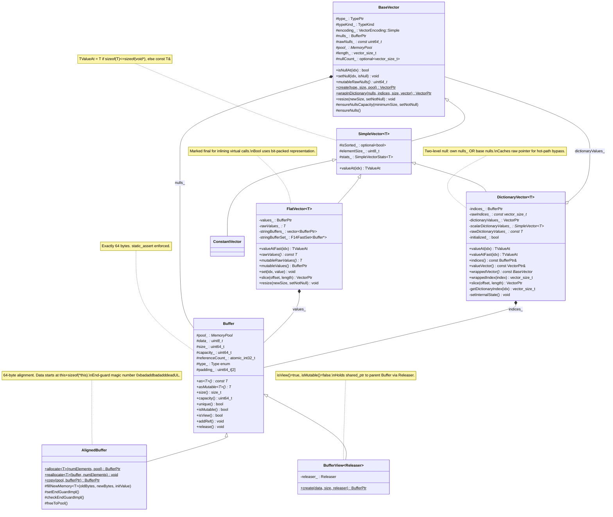
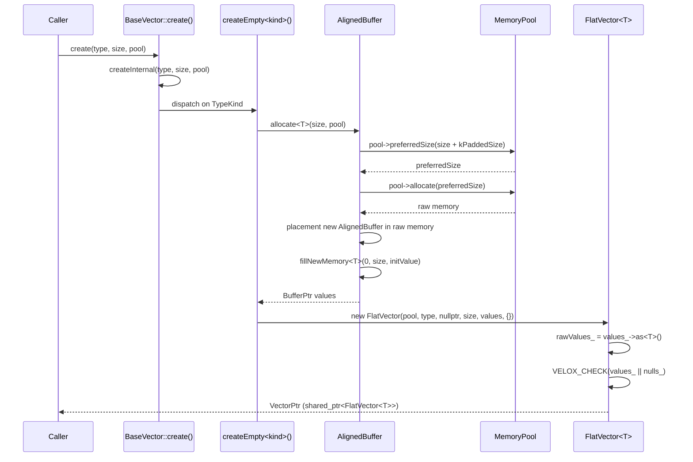
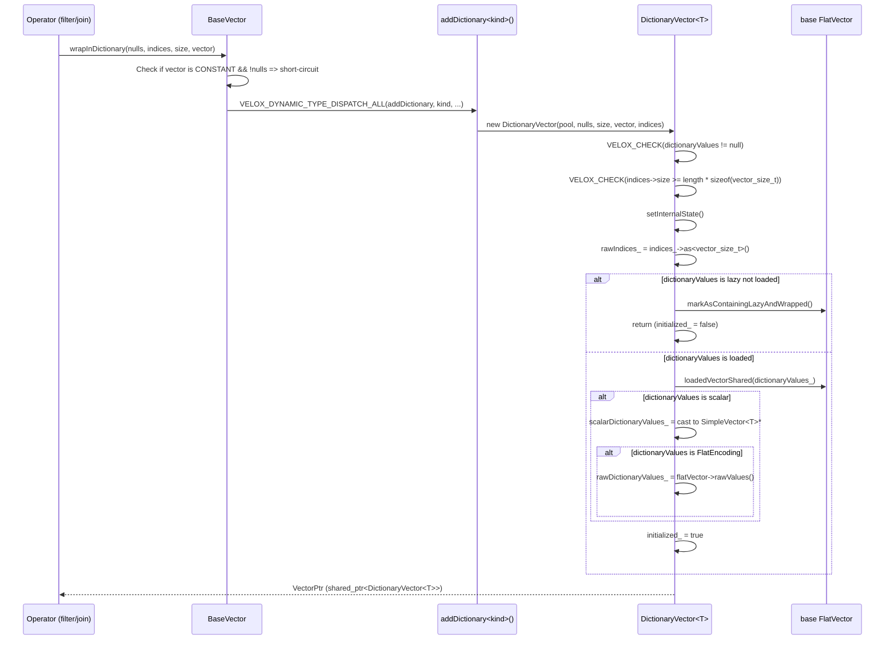
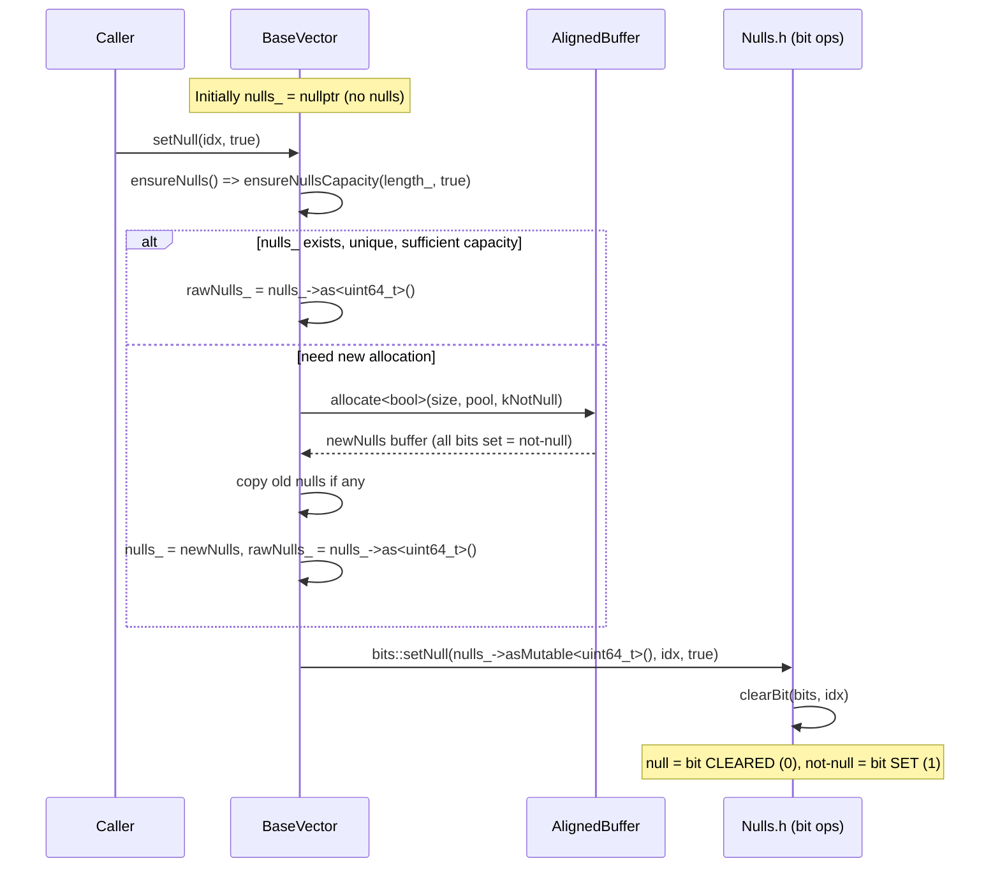

# Module Teardown: Velox Vector Columnar Construction and Bitmaps

## Table of Contents

- [0. Research Focus](#0-research-focus)
- [1. High-Level Overview](#1-high-level-overview)
- [2. Structural Architecture](#2-structural-architecture)
  - [Class Diagram](#class-diagram)
- [3. Execution & Call Flow](#3-execution-call-flow)
  - [3.1 FlatVector Creation Sequence](#31-flatvector-creation-sequence)
  - [3.2 DictionaryVector Wrapping Sequence](#32-dictionaryvector-wrapping-sequence)
  - [3.3 Null Bitmap Management Flow](#33-null-bitmap-management-flow)
- [4. Concurrency & State Management](#4-concurrency-state-management)
- [5. Memory & Resource Profile](#5-memory-resource-profile)
- [6. Key Design Insights](#6-key-design-insights)
  - [Insight 1: Inverted Null Polarity Enables Fast `countNonNulls`](#insight-1-inverted-null-polarity-enables-fast-countnonnulls)
  - [Insight 2: Buffer Copy-on-Write via Reference Counting](#insight-2-buffer-copy-on-write-via-reference-counting)
  - [Insight 3: DictionaryVector's Triple-Cache for Hot-Path Performance](#insight-3-dictionaryvectors-triple-cache-for-hot-path-performance)
  - [Insight 4: DictionaryVector vs. Trino DictionaryBlock -- Structural Comparison](#insight-4-dictionaryvector-vs-trino-dictionaryblock-structural-comparison)
  - [Insight 5: The `Buffer` Object Layout Is Cache-Line Optimized](#insight-5-the-buffer-object-layout-is-cache-line-optimized)
  - [Insight 6: StringView Inlining Avoids Pointer Chasing](#insight-6-stringview-inlining-avoids-pointer-chasing)
  - [Insight 7: `FlatVector` Is Marked `final` for Performance](#insight-7-flatvector-is-marked-final-for-performance)
  - [Insight 8: DictionaryVector Supports Both Cardinality-Reducing and Increasing Operations](#insight-8-dictionaryvector-supports-both-cardinality-reducing-and-increasing-operations)
  - [Insight 9: `wrapInDictionary` Has Optimization for Constant Vectors and Redundant Dictionaries](#insight-9-wrapindictionary-has-optimization-for-constant-vectors-and-redundant-dictionaries)
  - [Insight 10: `DecodedVector` Collapses Multi-Level Dictionaries](#insight-10-decodedvector-collapses-multi-level-dictionaries)


## 0. Research Focus
* **Task ID:** 1.2
* **Focus:** Analyze `BaseVector`. Trace how `FlatVector` manages its data `Buffer` and its `nulls` `Buffer` (bitmap). Trace `DictionaryVector` to understand how it uses an `indices` buffer to achieve zero-copy wrapping, comparing it directly to Trino's `DictionaryBlock`.

## 1. High-Level Overview
* **Core Responsibility:** The Velox vector system provides a unified columnar data representation where `BaseVector` is the abstract root class for all column types. `FlatVector<T>` provides direct, contiguous storage of typed values alongside a separate null bitmap. `DictionaryVector<T>` enables zero-copy reordering, filtering, and duplication of data by holding an indices buffer that maps logical positions to positions in a wrapped base vector.
* **Key Triggers:** Vectors are created by `BaseVector::create()` (which produces `FlatVector` for scalar types), by `BaseVector::wrapInDictionary()` for producing dictionary-encoded views after operators like filter/join, and by expression evaluation during query processing. The `Buffer` reference-counting system (via `boost::intrusive_ptr`) governs when buffers are shared vs. copied, enabling copy-on-write semantics.

## 2. Structural Architecture
* **Primary Source Files:**
  - `velox/vector/BaseVector.h` / `BaseVector.cpp` -- abstract base class, null bitmap management, factory methods
  - `velox/vector/FlatVector.h` / `FlatVector-inl.h` -- contiguous typed value storage
  - `velox/vector/DictionaryVector.h` / `DictionaryVector-inl.h` -- index-based wrapping
  - `velox/buffer/Buffer.h` / `Buffer.cpp` -- `Buffer`, `AlignedBuffer`, `BufferView` memory primitives
  - `velox/common/base/Nulls.h` -- null bitmap polarity constants and helpers

* **Key Data Structures:**
  - `Buffer` (64 bytes, intrusive ref-counted, tracks size/capacity/POD-type/view-type)
  - `AlignedBuffer` (extends Buffer, 64-byte aligned, pool-allocated with end-guard)
  - `BufferView<Releaser>` (zero-copy view into another Buffer's memory)
  - `BufferPtr` = `boost::intrusive_ptr<Buffer>` (reference-counted smart pointer)
  - `BaseVector` (holds `nulls_` BufferPtr, `rawNulls_` cached pointer, `type_`, `encoding_`, `length_`)
  - `FlatVector<T>` (holds `values_` BufferPtr, `rawValues_` cached pointer, `stringBuffers_`)
  - `DictionaryVector<T>` (holds `indices_` BufferPtr, `rawIndices_`, `dictionaryValues_` VectorPtr)
  - `StringView` (16-byte non-owning view: inline <= 12 bytes, or pointer + 4-byte prefix)

### Class Diagram



## 3. Execution & Call Flow

### 3.1 FlatVector Creation Sequence



* **Step-by-step text breakdown (FlatVector creation):**

1. `BaseVector::create(type, size, pool)` calls `createInternal()`, which switches on `TypeKind`.
2. For scalar types, it dispatches to the template function `createEmpty<kind>()`.
3. `createEmpty` calls `AlignedBuffer::allocate<T>(size, pool)` to create the values buffer.
4. `AlignedBuffer::allocate` asks the pool for a `preferredSize` (adds `kPaddedSize = kSizeofAlignedBuffer + simd::kPadding`), allocates from the pool, then does placement-new of the `AlignedBuffer` object into that memory. The data region starts immediately after the 64-byte `AlignedBuffer` header:

```cpp
// velox/buffer/Buffer.h, AlignedBuffer constructor:
AlignedBuffer(velox::memory::MemoryPool* pool, size_t capacity)
    : Buffer{
          Type::kPOD,
          reinterpret_cast<uint8_t*>(this) + sizeof(*this),  // <-- data_ starts right after header
          capacity,
          pool} {
  static_assert(sizeof(*this) == kAlignment);  // 64 bytes
```

5. `createEmpty` constructs a `FlatVector<T>` with `nulls = nullptr` (no nulls initially) and the allocated values buffer.
6. The `FlatVector` constructor caches `rawValues_ = values_->as<T>()` for O(1) indexed access, and verifies that either `values_` or `nulls_` exists.

### 3.2 DictionaryVector Wrapping Sequence



* **Step-by-step text breakdown (Dictionary wrapping):**

1. An operator (e.g., filter) builds an indices buffer mapping output rows to input rows, then calls `BaseVector::wrapInDictionary()`.
2. If the base is a `CONSTANT` with no added nulls, the method short-circuits to return a constant (optimization).
3. Otherwise, it dispatches through `VELOX_DYNAMIC_TYPE_DISPATCH_ALL` to create a `DictionaryVector<T>`.
4. The constructor validates the indices buffer is large enough: `indices->size() >= length * sizeof(vector_size_t)`.
5. `setInternalState()` is the critical initialization method. It caches `rawIndices_` and, for scalar types, caches the underlying `SimpleVector<T>*` and even the raw values pointer of a flat base:

```cpp
// velox/vector/DictionaryVector-inl.h:
void DictionaryVector<T>::setInternalState() {
  rawIndices_ = indices_->as<vector_size_t>();
  // ...
  if (dictionaryValues_->isScalar()) {
    scalarDictionaryValues_ =
        reinterpret_cast<SimpleVector<T>*>(dictionaryValues_->loadedVector());
    if (scalarDictionaryValues_->isFlatEncoding() && !std::is_same_v<T, bool>) {
      rawDictionaryValues_ =
          reinterpret_cast<FlatVector<T>*>(scalarDictionaryValues_)->rawValues();
    }
  }
  initialized_ = true;
}
```

6. This triple caching (`rawIndices_`, `scalarDictionaryValues_`, `rawDictionaryValues_`) allows `valueAtFast()` to resolve a value with a single array dereference:

```cpp
// velox/vector/DictionaryVector-inl.h:
template <typename T>
typename SimpleVector<T>::TValueAt DictionaryVector<T>::valueAtFast(
    vector_size_t idx) const {
  if (rawDictionaryValues_) {
    return rawDictionaryValues_[getDictionaryIndex(idx)];  // single indirection
  }
  return scalarDictionaryValues_->valueAt(getDictionaryIndex(idx));  // virtual call
}
```

### 3.3 Null Bitmap Management Flow



* **Step-by-step text breakdown (Null handling):**

1. Velox uses inverted null polarity: a set bit (1) means NOT NULL, a clear bit (0) means NULL. This is defined in `Nulls.h`:

```cpp
// velox/common/base/Nulls.h:
constexpr bool kNull = false;
constexpr bool kNotNull = !kNull;  // true

inline bool isBitNull(const uint64_t* bits, uint32_t index) {
  return isBitSet(bits, index) == kNull;  // bit is 0 => null
}

inline void setNull(uint64_t* bits, uint32_t index, bool isNull) {
  setBit(bits, index, !isNull);  // if isNull=true, clear the bit
}
```

2. The nulls buffer is lazily allocated. If a vector has no nulls, `nulls_ = nullptr` and `rawNulls_ = nullptr`. The first call to `setNull(idx, true)` triggers `ensureNulls()`.
3. `ensureNullsCapacity()` handles the copy-on-write pattern: if the buffer is shared (non-unique) or a view, a new buffer is allocated and old data is copied:

```cpp
// velox/vector/BaseVector.cpp:
void BaseVector::ensureNullsCapacity(vector_size_t minimumSize, bool setNotNull) {
  const auto fill = setNotNull ? bits::kNotNull : bits::kNull;
  const auto size = std::max<vector_size_t>(minimumSize, length_);
  if (nulls_ && !nulls_->isView() && nulls_->unique()) {
    if (nulls_->capacity() < bits::nbytes(size)) {
      AlignedBuffer::reallocate<bool>(&nulls_, size, fill);
    }
    // ...
  } else {
    auto newNulls = AlignedBuffer::allocate<bool>(size, pool_, fill);
    if (nulls_) {
      ::memcpy(newNulls->asMutable<char>(), nulls_->as<char>(),
               byteSize<bool>(std::min<vector_size_t>(length_, size)));
    }
    nulls_ = std::move(newNulls);
    rawNulls_ = nulls_->as<uint64_t>();
  }
}
```

4. `isNullAt()` is a simple bit test through the cached raw pointer:

```cpp
// velox/vector/BaseVector.h:
virtual bool isNullAt(vector_size_t idx) const {
  return rawNulls_ ? bits::isBitNull(rawNulls_, idx) : false;
}
```

## 4. Concurrency & State Management

* **Threading Model:** Vectors are generally **not thread-safe for mutation**. The `Buffer` reference count (`std::atomic_int32_t referenceCount_`) is atomic, allowing safe sharing of immutable buffers across threads. However, mutating a vector (via `set()`, `setNull()`, `resize()`, etc.) requires exclusive ownership. The `isMutable()` check (`!isView() && unique()`) enforces this at runtime.

* **State Machine:**
  - **Buffer states:** `mutable` (refCount==1, not view) vs. `immutable` (refCount>1 or isView). Transition from immutable to mutable requires copy-on-write (new allocation + copy).
  - **DictionaryVector states:** `initialized_` = false (lazy base not loaded) vs. `initialized_` = true (all caches populated). The `loadedVector()` call triggers lazy loading and transitions to initialized.
  - **Null buffer states:** `nullptr` (no nulls) -> allocated (via `ensureNulls()`). Never transitions back to nullptr during normal mutation (only via explicit `resetNulls()`).

* **Synchronization:**
  - `Buffer::referenceCount_` uses `std::memory_order_acq_rel` for add/sub operations.
  - `BaseVector::length_` is declared `tsan_atomic<vector_size_t>` for thread-sanitizer compatibility.
  - `BaseVector::containsLazyAndIsWrapped_` is `std::atomic_bool` to safely prevent double-wrapping of lazy vectors across threads.
  - `AsciiInfo` in `SimpleVector<StringView>` uses `folly::Synchronized<SelectivityVector>` for thread-safe ASCII tracking on shared input vectors.

## 5. Memory & Resource Profile

* **Allocation Pattern:**
  - All vector data buffers are allocated through `MemoryPool` via `AlignedBuffer::allocate`. The pool provides `preferredSize()` to enable slab-friendly sizing.
  - The `AlignedBuffer` header is exactly 64 bytes (same as a cache line). The data region starts immediately after, also at a 64-byte boundary. This layout is enforced by `static_assert`:

```cpp
// velox/buffer/Buffer.h:
static_assert(sizeof(Buffer) == 64, "Buffer is assumed to be 64 bytes to guarantee alignment");

// AlignedBuffer constructor:
static_assert(sizeof(*this) == kAlignment);  // kAlignment = 64
```

  - `simd::kPadding` extra bytes are allocated past `capacity()` and are guaranteed addressable. A magic number end-guard (`0xbadaddbadadddeadUL`) is written at `capacity_` offset in debug builds to detect buffer overruns.
  - For bool types, storage is bit-packed: `AlignedBuffer::allocate<bool>` delegates to `allocate<char>(bits::nbytes(numElements))`.

* **Memory Tracking:**
  - `retainedSize()` recursively computes all memory held live by a vector, including all child buffers.
  - `estimateFlatSize()` estimates the cost of materializing a vector into flat form.
  - `Buffer::capacity()` reflects actual allocated bytes (from pool). `Buffer::size()` reflects the logical "used" bytes.
  - The pool tracks all allocations, enabling memory limits, spilling, and accounting.

* **Zero-Copy Operations:**
  - `FlatVector::slice()` creates a `BufferView` into the parent's values buffer via `Buffer::slice<T>()`:

```cpp
// velox/buffer/Buffer.cpp:
BufferPtr Buffer::sliceBufferZeroCopy(...) {
  auto data = reinterpret_cast<const uint8_t*>(buffer->as<void>()) + bytesOffset;
  return BufferView<BufferReleaser>::create(
      data, bytesLength, BufferReleaser(buffer), podType);
}
```

  - The `BufferReleaser` holds a `BufferPtr` (shared reference) to the parent, preventing it from being freed while the view exists. The `BufferView` has `isView() = true`, making it immutable (`isMutable() = false` always).
  - `DictionaryVector::slice()` similarly creates a view over the indices buffer while sharing the same `dictionaryValues_` pointer.

## 6. Key Design Insights

### Insight 1: Inverted Null Polarity Enables Fast `countNonNulls`

Velox uses **bit-set = not-null** (opposite of some systems that use bit-set = null). This means `countNonNulls()` is simply `popcount()` on the raw words, which is a single hardware instruction on modern CPUs:

```cpp
// velox/common/base/Nulls.h:
inline uint64_t countNonNulls(const uint64_t* nulls, uint32_t begin, uint32_t end) {
  return countBits(nulls, begin, end);  // popcount over range
}

inline uint64_t countNulls(const uint64_t* nulls, uint32_t begin, uint32_t end) {
  return (end - begin) - countNonNulls(nulls, begin, end);  // derived
}
```

This polarity also means a newly allocated nulls buffer initialized with `memset(0xff)` (i.e., `kNotNullByte`) represents "all not-null" -- the common case. Allocation with `kNull` (all zeros) is used only for all-null vectors like `UNKNOWN` type.

### Insight 2: Buffer Copy-on-Write via Reference Counting

The `Buffer` class uses intrusive reference counting via `boost::intrusive_ptr`. The critical invariant is:

```cpp
// velox/buffer/Buffer.h:
bool isMutable() const noexcept {
  return !isView() && unique();   // refCount == 1 and not a view
}
```

When an operator wants to mutate a vector's values, methods like `mutableRawValues()` check if the buffer is mutable. If not, they allocate a new buffer and copy:

```cpp
// velox/vector/FlatVector.h:
T* mutableRawValues() {
  if (!(values_ && values_->isMutable())) {
    BufferPtr newValues = AlignedBuffer::allocate<T>(BaseVector::length_, BaseVector::pool());
    if (values_) {
      memcpy(newValues->asMutable<uint8_t>(), rawValues_, numBytes);
    }
    values_ = newValues;
    rawValues_ = values_->asMutable<T>();
  }
  return rawValues_;
}
```

This is the same pattern used by `ensureNullsCapacity()` for the nulls buffer. The design guarantees that **shared buffers are never mutated in place**, which is critical for dictionary vectors that share their base's buffers.

### Insight 3: DictionaryVector's Triple-Cache for Hot-Path Performance

`DictionaryVector::setInternalState()` caches three levels of pointers:

| Cache Field | Type | Purpose |
|---|---|---|
| `rawIndices_` | `const vector_size_t*` | Avoids BufferPtr dereference on every index lookup |
| `scalarDictionaryValues_` | `SimpleVector<T>*` | Avoids `dynamic_cast` on every value access |
| `rawDictionaryValues_` | `const T*` | Bypasses virtual `valueAt()` entirely for flat bases |

When `rawDictionaryValues_` is populated (i.e., the base is a non-bool `FlatVector`), `valueAtFast()` resolves to a single array lookup with no virtual dispatch:

```cpp
return rawDictionaryValues_[getDictionaryIndex(idx)];
// which expands to:
return rawDictionaryValues_[rawIndices_[idx]];
```

This is the same access pattern as Trino's `DictionaryBlock.getInt(position)`, which does `rawValues[ids[position]]`. The key difference is that Velox uses C++ template specialization to eliminate virtual dispatch at compile time, while Trino uses the JIT compiler to achieve similar devirtualization.

### Insight 4: DictionaryVector vs. Trino DictionaryBlock -- Structural Comparison

| Aspect | Velox `DictionaryVector<T>` | Trino `DictionaryBlock` |
|---|---|---|
| **Indices storage** | `BufferPtr indices_` (pool-allocated `int32_t[]`) | `int[] ids` (Java heap array) |
| **Base vector** | `VectorPtr dictionaryValues_` (shared_ptr, any encoding) | `Block dictionary` (any Block type) |
| **Null handling** | Separate `nulls_` bitmap OR delegate to base's nulls | `boolean[] valueIsNull` array OR no nulls |
| **Null checking** | Two-level: `BaseVector::isNullAt(idx) || dictionaryValues_->isNullAt(innerIndex)` | Single-level: `mayHaveNull() && valueIsNull[position + offset]` |
| **Value access** | `rawDictionaryValues_[rawIndices_[idx]]` (cached raw pointer) | `dictionary.getInt(ids[position + offset])` (virtual dispatch) |
| **Nesting** | Can nest: `DictionaryVector` wrapping `DictionaryVector`. `DecodedVector` flattens. | Can nest. `DictionaryBlock.getPositions()` / `Block.getLoadedBlock()` flattens. |
| **Zero-copy slice** | `slice()` creates `BufferView` over indices, shares base | `getRegion()` creates new `DictionaryBlock` with offset/length |
| **Lazy loading** | `dictionaryValues_` can be `LazyVector`; `loadedVector()` triggers load for only referenced rows | No direct equivalent; lazy loading handled at connector level |
| **Memory accounting** | `retainedSize()` recursively sums buffer capacities | `getRetainedSizeInBytes()` recursively sums |

The most significant design difference is Velox's **two-level null model**: a `DictionaryVector` can have its own nulls buffer AND the base vector can independently have nulls. This means `isNullAt()` must check both:

```cpp
// velox/vector/DictionaryVector-inl.h:
template <typename T>
bool DictionaryVector<T>::isNullAt(vector_size_t idx) const {
  if (BaseVector::isNullAt(idx)) {   // Check dictionary-level nulls
    return true;
  }
  auto innerIndex = getDictionaryIndex(idx);
  return dictionaryValues_->isNullAt(innerIndex);  // Check base-level nulls
}
```

In Trino, `DictionaryBlock` stores nulls only at its own level. If the underlying dictionary block has its own nulls, those are already accounted for in the dictionary's `getPositions()` path.

### Insight 5: The `Buffer` Object Layout Is Cache-Line Optimized

The `Buffer` base class is exactly 64 bytes (one cache line), enforced by `static_assert`. The `AlignedBuffer` derived class is also exactly 64 bytes, and since data starts at `this + sizeof(*this)`, the data is naturally 64-byte aligned as well:

```
Memory layout of an AlignedBuffer allocation:
[  64-byte Buffer/AlignedBuffer header  ][  data region (capacity bytes)  ][  simd::kPadding  ]
^--- pool_ data_ size_ capacity_         ^--- values start here            ^--- end-guard here
     refCount_ type_ padding_
```

The `padding_` field in `Buffer` is initialized to `{-1ULL, -1ULL}`, which ensures that if data is interpreted as `int32_t[]`, the element at index -1 equals -1. This is a deliberate sentinel for certain algorithms.

### Insight 6: StringView Inlining Avoids Pointer Chasing

For `FlatVector<StringView>`, the values buffer contains an array of 16-byte `StringView` objects. Strings <= 12 bytes are fully inlined inside the `StringView` itself, avoiding any pointer indirection:

```
StringView layout (16 bytes):
+--------+--------+------------------+
|  size  | prefix | inline data OR   |
| 4 bytes| 4 bytes| pointer (8 bytes)|
+--------+--------+------------------+

Small string (<= 12 bytes): prefix + inline data contain full string
Large string (> 12 bytes):  prefix = first 4 chars, pointer to stringBuffers_
```

The separate `stringBuffers_` vector in `FlatVector<StringView>` holds the backing memory for out-of-line strings. These buffers are append-only and reference-counted, enabling safe sharing via `acquireSharedStringBuffers()`. The `stringBufferSet_` (F14FastSet) provides O(1) dedup when acquiring buffers from another vector.

### Insight 7: `FlatVector` Is Marked `final` for Performance

```cpp
// velox/vector/FlatVector.h:
template <typename T>
class FlatVector final : public SimpleVector<T> {
```

The `final` keyword allows the compiler to devirtualize calls on `FlatVector<T>*` pointers. Since `FlatVector` is the most common encoding and is used in tight evaluation loops, this is a significant optimization. Methods like `valueAtFast()`, `isNullAt()`, and `set()` can all be inlined when the static type is known.

### Insight 8: DictionaryVector Supports Both Cardinality-Reducing and Increasing Operations

The `DictionaryVector` constructor comment explicitly documents this dual use:

```cpp
// velox/vector/DictionaryVector.h:
// Base vector can contain duplicate values. This happens when dictionary
// encoding is used to represent a result of a cardinality increasing
// operator, for example, probe-side columns after cardinality increasing join
// or result of an unnest.
//
// The number of indices can be less than the size of the base array, e.g. not
// all elements of the base vector may be referenced. This happens when
// dictionary encoding is used to represent a result of a filter or another
// cardinality reducing operator, e.g. a selective join.
```

This is identical to Trino's `DictionaryBlock` which also serves as both a filter result (fewer indices than dictionary entries) and a join/unnest result (more indices than dictionary entries, with repeats).

### Insight 9: `wrapInDictionary` Has Optimization for Constant Vectors and Redundant Dictionaries

```cpp
// velox/vector/BaseVector.cpp:
VectorPtr BaseVector::wrapInDictionary(...) {
  // Dictionary that doesn't add nulls over constant is same as constant.
  if (vector->encoding() == VectorEncoding::Simple::CONSTANT && !nulls) {
    if (size == vector->size()) return vector;
    return BaseVector::wrapInConstant(size, 0, std::move(vector));
  }
  // ...
  if (flattenIfRedundant) {
    // If base (after peeling all dictionaries) is 8x larger than the
    // wrapper size, flatten to avoid keeping large base alive
    shouldFlatten = !isLazyNotLoaded(*base) && (base->size() / 8) > size;
  }
}
```

The `flattenIfRedundant` flag enables an important optimization: if a filter reduces a million-row base to just a few hundred rows, wrapping in a dictionary would keep the entire million-row base vector alive in memory. The 8:1 size ratio threshold triggers materialization into a flat vector instead.

### Insight 10: `DecodedVector` Collapses Multi-Level Dictionaries

When vectors are processed through multiple operators, dictionary wrappings can nest. The `DecodedVector` utility collapses all dictionary layers into a single flat base + one level of indices:

```cpp
// velox/vector/DecodedVector.h (class comment):
// Takes a flat, constant or dictionary vector with possibly many layers of
// dictionary wrappings and converts it into a flat or constant base vector +
// at most one wrapping. Combines multiple layers of indices and nulls into one.
```

This is essential for expression evaluation efficiency. Rather than chasing through N levels of index indirection per row, `DecodedVector` pre-computes the composed mapping. Its memory is allocated directly from the system allocator (not the pool), allowing it to be cached and reused across batches via `LocalDecodedVector`.
