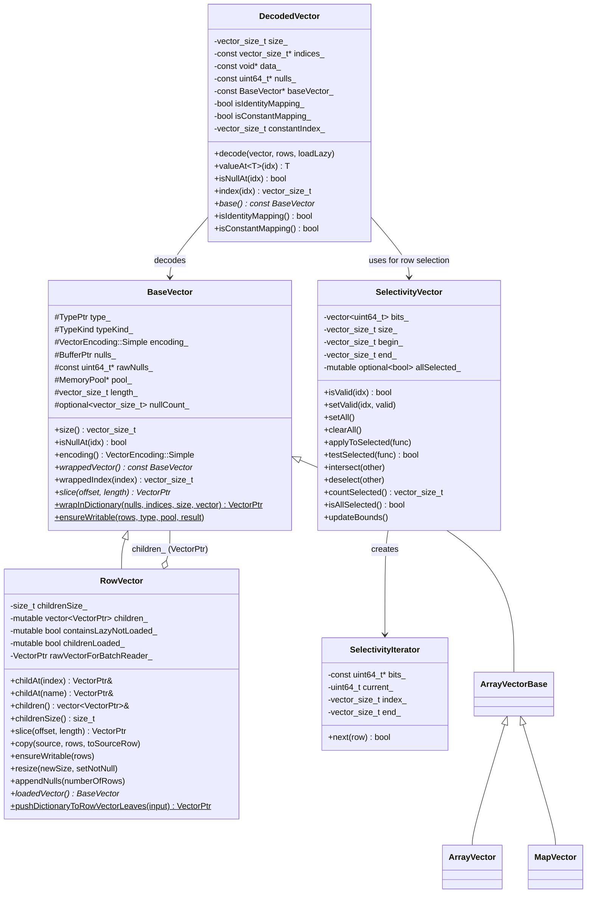
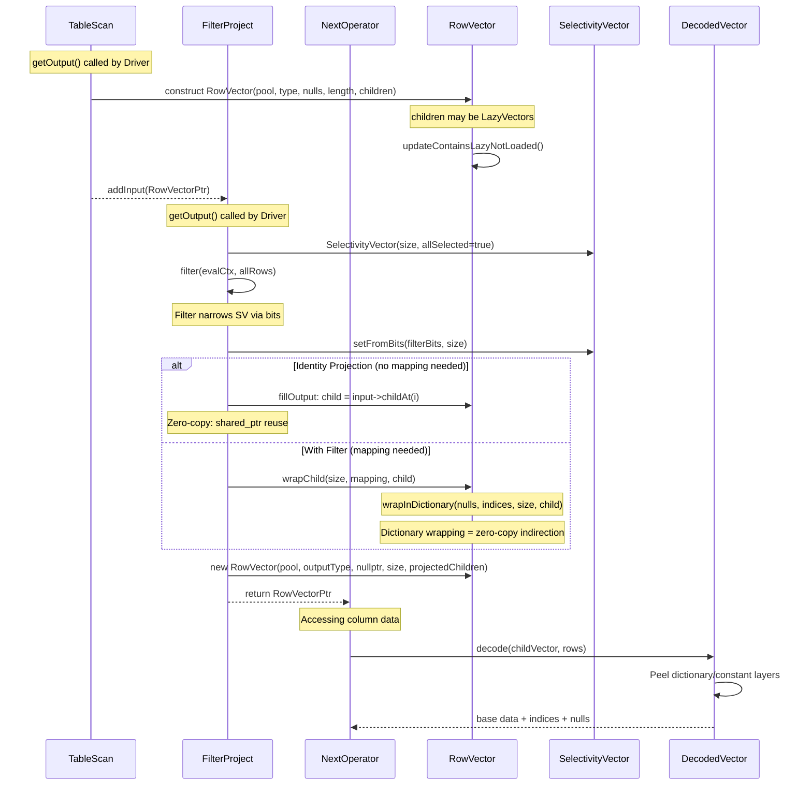

# Module Teardown: RowVector Container

## Table of Contents

- [0. Research Focus](#0-research-focus)
- [1. High-Level Overview](#1-high-level-overview)
- [2. Structural Architecture](#2-structural-architecture)
  - [Class Diagram](#class-diagram)
- [3. Execution & Call Flow](#3-execution-call-flow)
  - [3.1 RowVector Construction and Flow Through Operators](#31-rowvector-construction-and-flow-through-operators)
  - [3.2 RowVector Slice (Zero-Copy Sub-Range)](#32-rowvector-slice-zero-copy-sub-range)
  - [3.3 Lazy Loading Pattern](#33-lazy-loading-pattern)
- [4. Concurrency & State Management](#4-concurrency-state-management)
- [5. Memory & Resource Profile](#5-memory-resource-profile)
- [6. Key Design Insights](#6-key-design-insights)
  - [Insight 1: RowVector is a thin envelope, not a data container](#insight-1-rowvector-is-a-thin-envelope-not-a-data-container)
  - [Insight 2: Three levels of zero-copy projection](#insight-2-three-levels-of-zero-copy-projection)
  - [Insight 3: SelectivityVector enables filter-first evaluation without materialization](#insight-3-selectivityvector-enables-filter-first-evaluation-without-materialization)
  - [Insight 4: DecodedVector unifies access across encoding layers](#insight-4-decodedvector-unifies-access-across-encoding-layers)
  - [Insight 5: Children can be null (unprojected columns) and children count can be less than type field count](#insight-5-children-can-be-null-unprojected-columns-and-children-count-can-be-less-than-type-field-count)
  - [Insight 6: resize() enforces single-ownership on growth, but not on shrink](#insight-6-resize-enforces-single-ownership-on-growth-but-not-on-shrink)
  - [Insight 7: pushDictionaryToRowVectorLeaves enables efficient nested encoding normalization](#insight-7-pushdictionarytorowvectorleaves-enables-efficient-nested-encoding-normalization)
  - [Insight 8: Structural overhead comparison](#insight-8-structural-overhead-comparison)


## 0. Research Focus
* **Task ID:** 1.3
* **Focus:** Analyze `RowVector`. How does it group multiple `BaseVector` columns together? Compare its structural overhead and zero-copy projection capabilities (`SelectivityVector`) to Trino's `Page` and DataFusion's `RecordBatch`.

## 1. High-Level Overview
* **Core Responsibility:** `RowVector` is Velox's columnar batch container -- the equivalent of Trino's `Page` or Arrow's `RecordBatch`. It groups N child `BaseVector` columns under a single row-level nulls bitmap, and is the unit of data that flows between operators (`addInput`/`getOutput`) in the execution pipeline. Unlike Trino's `Page` (which is an immutable sealed object) or DataFusion's `RecordBatch` (which uses Arrow's immutable array model), `RowVector` is a mutable, `shared_ptr`-based object with copy-on-write semantics enabled by reference counting.
* **Key Triggers:** Created by `TableScan::getOutput()` (with lazy-loaded children), constructed during `Operator::fillOutput()` with projected columns, sliced via `RowVector::slice()`, and passed through the operator pipeline via `Operator::addInput(RowVectorPtr)`.

## 2. Structural Architecture
* **Primary Source Files:**
  1. `velox/vector/ComplexVector.h` -- `RowVector`, `ArrayVector`, `MapVector` class definitions
  2. `velox/vector/ComplexVector.cpp` -- `RowVector` method implementations (copy, slice, resize, validate, pushDictionaryToRowVectorLeaves)
  3. `velox/vector/BaseVector.h` -- Parent class with nulls, type, pool, encoding, and wrapInDictionary
  4. `velox/vector/SelectivityVector.h` -- Bitmap-based row filter for zero-copy in-place filtering
  5. `velox/vector/DecodedVector.h` -- Flattens multi-layer dictionary/constant encodings for reading

* **Key Data Structures:**
  - `RowVector::children_` -- `std::vector<VectorPtr>` (the column storage)
  - `BaseVector::nulls_` / `rawNulls_` -- Row-level null bitmap
  - `SelectivityVector::bits_` -- `std::vector<uint64_t>` word-aligned bitmap
  - `DecodedVector` -- Decoded base pointer + indices + nulls

### Class Diagram



## 3. Execution & Call Flow

### 3.1 RowVector Construction and Flow Through Operators



* **Step-by-step text breakdown:**

**Step 1: RowVector Construction (TableScan)**

The `TableScan::getOutput()` operator creates a `RowVector` with children that are often `LazyVector` instances. The RowVector constructor validates child types in debug builds and calls `updateContainsLazyNotLoaded()`:

```cpp
// ComplexVector.h lines 34-72
RowVector(
    velox::memory::MemoryPool* pool,
    const TypePtr& type,
    BufferPtr nulls,
    vector_size_t length,
    std::vector<VectorPtr> children,
    std::optional<vector_size_t> nullCount = std::nullopt)
    : BaseVector(pool, type, VectorEncoding::Simple::ROW,
                 std::move(nulls), length, std::nullopt, nullCount, 1),
      childrenSize_(children.size()),
      children_(std::move(children)) {
    // Some columns may not be projected out
    VELOX_CHECK_LE(children_.size(), type->size());
    // ... debug-only type checks ...
    updateContainsLazyNotLoaded();
}
```

Key structural points:
- `childrenSize_` is `const` and set at construction -- the number of children is fixed.
- `children_` is `mutable` so it can be updated (e.g., by `loadedVector()`).
- Children can be `nullptr` (unprojected columns), and `children_.size()` can be less than `type->size()`.

**Step 2: RowVector Flows to FilterProject**

The `FilterProject::addInput(RowVectorPtr)` stores the input by move:
```cpp
// FilterProject.cpp line 213
void FilterProject::addInput(RowVectorPtr input) {
    input_ = std::move(input);
}
```

**Step 3: Filter Evaluation with SelectivityVector**

In `getOutput()`, a `SelectivityVector` of the input size is created with all bits set. The filter expression narrows it:
```cpp
// FilterProject.cpp lines 229-254
vector_size_t size = input_->size();
LocalSelectivityVector localRows(*operatorCtx_->execCtx(), size);
auto* rows = localRows.get();
rows->setAll();
EvalCtx evalCtx(operatorCtx_->execCtx(), exprs_.get(), input_.get());

auto numOut = filter(evalCtx, *rows);
```

After filtering, the selected bits identify passing rows. If not all rows passed:
```cpp
rows->setFromBits(filterEvalCtx_.selectedBits->as<uint64_t>(), size);
```

**Step 4: Zero-Copy Projection via fillOutput**

The core of the zero-copy mechanism is `Operator::fillOutput()`:
```cpp
// Operator.cpp lines 248-281
RowVectorPtr Operator::fillOutput(
    vector_size_t size, const BufferPtr& mapping,
    const std::vector<VectorPtr>& results) {
  bool wrapResults = true;
  if (size == input_->size() &&
      (!mapping || isSequence(mapping->as<vector_size_t>(), 0, size))) {
    if (isIdentityProjection_) {
      return std::move(input_);  // <-- Entire RowVector reused as-is
    }
    wrapResults = false;  // <-- No dictionary wrap needed
  }

  std::vector<VectorPtr> projectedChildren(outputType_->size());
  projectChildren(projectedChildren, input_, identityProjections_,
                  size, wrapResults ? mapping : nullptr);
  projectChildren(projectedChildren, results, resultProjections_,
                  size, wrapResults ? mapping : nullptr);

  return std::make_shared<RowVector>(
      operatorCtx_->pool(), outputType_, nullptr, size,
      std::move(projectedChildren));
}
```

There are three fast paths here:
1. **Full identity (no filter, no projection change):** Returns `std::move(input_)` directly -- absolutely zero overhead.
2. **No filter but column reorder/subset:** `wrapResults=false`, child `VectorPtr`s are shared directly into the new RowVector's children via `shared_ptr` copy. No data copy.
3. **With filter (mapping is set):** Each child is wrapped in a dictionary via `wrapChild()`:

```cpp
// OperatorUtils.cpp lines 362-372
VectorPtr wrapChild(vector_size_t size, BufferPtr mapping,
                    const VectorPtr& child, BufferPtr nulls) {
  if (!mapping) {
    return child;  // <-- Zero-copy: just share the pointer
  }
  return BaseVector::wrapInDictionary(nulls, mapping, size, child);
}
```

When `mapping` is null, the child is returned directly (zero-copy shared_ptr). When a mapping exists, the child is wrapped in a `DictionaryVector` which holds the indirection indices but does NOT copy the underlying data.

### 3.2 RowVector Slice (Zero-Copy Sub-Range)

```cpp
// ComplexVector.cpp lines 451-460
VectorPtr RowVector::slice(vector_size_t offset, vector_size_t length) const {
  std::vector<VectorPtr> children(children_.size());
  for (int i = 0; i < children_.size(); ++i) {
    if (children_[i]) {
      children[i] = children_[i]->slice(offset, length);
    }
  }
  return std::make_shared<RowVector>(
      pool_, type_, sliceNulls(offset, length), length, std::move(children));
}
```

This recursively slices each child vector and the nulls bitmap. For flat vectors, `slice()` returns a view (offset pointer into the same buffer). No data is copied.

### 3.3 Lazy Loading Pattern

RowVector tracks whether any children are lazy and unloaded:

```cpp
// ComplexVector.cpp lines 484-493
void RowVector::updateContainsLazyNotLoaded() const {
  childrenLoaded_ = false;
  containsLazyNotLoaded_ = false;
  for (auto& child : children_) {
    if (child && isLazyNotLoaded(*child)) {
      containsLazyNotLoaded_ = true;
      break;
    }
  }
}
```

The `loadedVector()` method materializes all lazy children:

```cpp
// ComplexVector.cpp lines 462-482
BaseVector* RowVector::loadedVector() {
  if (childrenLoaded_) {
    return this;
  }
  containsLazyNotLoaded_ = false;
  for (auto i = 0; i < childrenSize_; ++i) {
    if (!children_[i]) continue;
    auto& newChild = BaseVector::loadedVectorShared(children_[i]);
    if (children_[i].get() != newChild.get()) {
      children_[i] = newChild;
    }
    if (isLazyNotLoaded(*children_[i])) {
      containsLazyNotLoaded_ = true;
    }
  }
  childrenLoaded_ = true;
  return this;
}
```

This is a key optimization: columns that are never accessed are never materialized from storage.

## 4. Concurrency & State Management

* **Threading Model:** Each `RowVector` lives on a single driver thread. The Velox execution model runs operators within a `Driver` that executes sequentially on a single thread. RowVectors are passed between operators within the same driver via `addInput`/`getOutput` -- no concurrent access to the same RowVector occurs within a pipeline. Cross-pipeline transfer (e.g., `LocalPartition`, `Exchange`) uses `RowVector` serialization or shared-memory handoff with proper synchronization in the exchange buffers.

* **State Machine:** RowVector has no state machine per se, but it tracks two mutable flags:
  - `containsLazyNotLoaded_` -- Starts `true` if any child is a `LazyVector`. Set to `false` after `loadedVector()` runs.
  - `childrenLoaded_` -- Set to `true` after `loadedVector()` succeeds for all children. Reset to `false` when `updateContainsLazyNotLoaded()` is called (meaning new lazy children were installed, e.g., by table scan).

* **Synchronization:** `BaseVector::length_` is declared as `tsan_atomic<vector_size_t>` (line 1039 of BaseVector.h), which is a ThreadSanitizer annotation. In practice, RowVectors are single-owner. The `shared_ptr` reference counting on `VectorPtr` provides ownership transfer safety. The `isWritable()` check verifies single-ownership:

```cpp
// ComplexVector.cpp lines 408-418
bool RowVector::isWritable() const {
  for (int i = 0; i < childrenSize_; i++) {
    if (children_[i]) {
      if (!BaseVector::isVectorWritable(children_[i])) {
        return false;
      }
    }
  }
  return isNullsWritable();
}
```

Where `isVectorWritable` checks `use_count() == 1`:
```cpp
// BaseVector.h lines 668-675
template <typename T>
static bool isVectorWritable(const std::shared_ptr<T>& vector) {
  if (vector.use_count() != 1) {
    return false;
  }
  return vector->isWritable();
}
```

## 5. Memory & Resource Profile

* **Allocation Pattern:**
  - **RowVector itself:** Only allocates a `std::vector<VectorPtr>` (N shared pointers) plus an optional nulls `BufferPtr`. The structural overhead is approximately `sizeof(RowVector)` (~128 bytes for the object) + `N * sizeof(shared_ptr<BaseVector>)` (16 bytes each on 64-bit) + nulls bitmap (ceil(length/64) * 8 bytes).
  - **Children:** Each child is independently allocated from the `MemoryPool`. Children may share underlying buffers with other RowVectors (via `shared_ptr` copy during projection). Dictionary-wrapped children add only an index buffer (4 bytes per row) without copying data.
  - **Copy-on-write:** `ensureWritable()` only materializes a flat copy when the vector is shared (`use_count > 1`). If singly referenced, it is mutated in place.

* **Memory Tracking:** All `Buffer` and `BaseVector` allocations go through a `velox::memory::MemoryPool*`. The pool hierarchy tracks memory usage per operator, per pipeline, and per task. `retainedSize()` recursively sums the capacity of all buffers:

```cpp
// ComplexVector.h lines 287-295
uint64_t retainedSizeImpl(uint64_t& totalStringBufferSize) const override {
  auto size = BaseVector::retainedSizeImpl();
  for (auto& child : children_) {
    if (child) {
      size += child->retainedSize(totalStringBufferSize);
    }
  }
  return size;
}
```

`estimateFlatSize()` estimates what the data would cost in a fully materialized flat layout:
```cpp
// ComplexVector.cpp lines 430-439
uint64_t RowVector::estimateFlatSize() const {
  uint64_t total = BaseVector::retainedSizeImpl();
  for (const auto& child : children_) {
    if (child) {
      total += child->estimateFlatSize();
    }
  }
  return total;
}
```

## 6. Key Design Insights

### Insight 1: RowVector is a thin envelope, not a data container

Unlike Trino's `Page` which contains `Block[]` and is sealed after creation, `RowVector` is essentially a typed wrapper around `std::vector<VectorPtr>`. Its own memory footprint is negligible -- just pointers and a nulls bitmap. The actual data lives in the child vectors. This makes constructing a new RowVector with different column subsets extremely cheap:

```cpp
// From Operator.cpp fillOutput -- constructing output is just pointer assignment
return std::make_shared<RowVector>(
    operatorCtx_->pool(), outputType_, nullptr, size,
    std::move(projectedChildren));
```

The `projectedChildren` vector is populated by sharing existing `VectorPtr`s from the input. No column data is copied.

**Comparison with Trino's Page:** Trino's `Page` is also a thin wrapper around `Block[]`, but it is immutable -- once built, the Block references cannot change. Velox's RowVector is mutable (children can be swapped, lazy vectors loaded in place), which enables the lazy-loading optimization.

**Comparison with DataFusion's RecordBatch:** Arrow RecordBatch holds `Arc<dyn Array>` columns. Like Velox, column sharing uses reference counting. The key difference is that Arrow arrays are immutable by design, while Velox vectors support in-place mutation when singly referenced.

### Insight 2: Three levels of zero-copy projection

Velox implements a graduated zero-copy strategy in `fillOutput()`:

1. **Full pass-through:** When all rows pass and all columns are identity projections, `return std::move(input_)` transfers the entire RowVector with zero allocation.

2. **Column subset/reorder without filter:** Child `VectorPtr`s are copied as `shared_ptr` (16-byte pointer copy) into a new RowVector. Data buffers are shared.

3. **With filter (row selection):** Each column is wrapped in a `DictionaryVector` via `BaseVector::wrapInDictionary()`. The dictionary holds an index array (4 bytes/row) pointing into the original data. The data itself is not copied.

This is fundamentally the same approach as Trino's `Page.getPositions()` which creates a `DictionaryBlock` wrapping the original `Block`, and DataFusion's `filter_record_batch()` which allocates new arrays for the selected rows.

### Insight 3: SelectivityVector enables filter-first evaluation without materialization

The `SelectivityVector` is a word-aligned bitmap (`std::vector<uint64_t>`) that tracks which rows are "active" at any point during expression evaluation. Its design is optimized for the common case where most or all rows pass:

```cpp
// SelectivityVector.h lines 439-449
template <typename Callable>
inline void SelectivityVector::applyToSelected(Callable func) const {
  if (isAllSelected()) {
    // IMPORTANT: Do not remove this line. Without it the compiler would not be
    // able to vectorize or unroll the loop.
    const auto end = end_;
    for (vector_size_t row = begin_; row < end; ++row) {
      func(row);
    }
  } else {
    bits::forEachSetBit(bits_.data(), begin_, end_, func);
  }
}
```

When `isAllSelected()` is true, the loop becomes a simple sequential iteration that the compiler can vectorize. When partially selected, `forEachSetBit` uses `__builtin_ctzll` to skip zeros efficiently:

```cpp
// SelectivityIterator lines 415-429
inline bool next(vector_size_t& row) {
  while (current_ == 0) {
    if ((index_ + 1) * 64 >= end_) {
      return false;
    }
    current_ = bits_[++index_];
    if ((index_ + 1) * 64 > end_) {
      current_ &= bits::lowMask(end_ & 63);
    }
  }
  row = (index_ * 64) + __builtin_ctzll(current_);
  current_ &= current_ - 1;  // Clear lowest set bit
  return true;
}
```

The `begin_`/`end_` bounds tracking avoids scanning leading/trailing zeros. The lazy `allSelected_` cache (a `mutable std::optional<bool>`) avoids recomputing the full bit count.

**Comparison with Trino:** Trino's `Page` does not have an equivalent in-place selection mechanism. Filtering in Trino produces a new `Page` (via `Page.getPositions(int[], int, int)`) which wraps columns in `DictionaryBlock`. Velox's `SelectivityVector` defers the materialization of a new RowVector until after all filter expressions have been evaluated, which can save allocations when multiple filters are ANDed together.

**Comparison with DataFusion:** DataFusion uses `BooleanArray` for filter masks and `filter_record_batch()` to materialize results. Velox's `SelectivityVector` is more space-efficient (1 bit per row vs 1 byte in BooleanArray) and supports incremental narrowing via `intersect()` and `deselect()`.

### Insight 4: DecodedVector unifies access across encoding layers

`DecodedVector` is the universal accessor that normalizes any vector (flat, dictionary, constant, multi-level dictionary) into a flat base + optional indices + nulls:

```cpp
// DecodedVector.h lines 167-176
vector_size_t index(vector_size_t idx) const {
  if (isIdentityMapping_) {
    return idx;           // Flat: no indirection
  }
  if (isConstantMapping_) {
    return constantIndex_; // Constant: always same index
  }
  VELOX_DCHECK(indices_);
  return indices_[idx];    // Dictionary: lookup
}
```

This three-way branch is the hot path for reading values. The `isIdentityMapping_` fast path is the common case for flat vectors and avoids any indirection.

Memory allocation for `DecodedVector` is done from the system allocator (not the memory pool), which makes it cacheable and reusable across expression evaluations (via `LocalDecodedVector`). This avoids pool fragmentation from high-frequency allocations.

### Insight 5: Children can be null (unprojected columns) and children count can be less than type field count

The constructor explicitly allows `children_.size() <= type->size()`:

```cpp
VELOX_CHECK_LE(children_.size(), type->size());
```

And children can be `nullptr`:
```cpp
const VectorPtr& childAt(column_index_t index) const {
  VELOX_CHECK_LT(index, childrenSize_, ...);
  return children_[index]; // may return a nullptr VectorPtr
}
```

This is used for column pruning during table scan -- columns that are not referenced by any expression are represented as null children, saving the cost of materializing them. Combined with `LazyVector` for columns that might be needed, this creates a three-tier loading strategy: (a) not projected at all (null child), (b) projected but maybe not accessed (LazyVector child), (c) fully materialized (Flat/Dictionary child).

### Insight 6: resize() enforces single-ownership on growth, but not on shrink

```cpp
// ComplexVector.cpp lines 653-670
void RowVector::resize(vector_size_t newSize, bool setNotNull) {
  BaseVector::resize(newSize, setNotNull);
  for (auto& child : children_) {
    if (child != nullptr) {
      VELOX_CHECK(!child->isLazy(), "Resize on a lazy vector is not allowed");
      const auto oldChildSize = child->size();
      if (newSize > oldChildSize) {
        VELOX_CHECK_EQ(child.use_count(), 1, "Resizing shared child vector");
        child->resize(newSize, setNotNull);
      }
    }
  }
}
```

When shrinking, only `BaseVector::length_` is reduced -- the children's buffers are not deallocated. This is safe because the length acts as a logical boundary. When growing, the single-reference check (`use_count() == 1`) prevents accidentally mutating shared buffers -- this is the copy-on-write enforcement point.

### Insight 7: pushDictionaryToRowVectorLeaves enables efficient nested encoding normalization

The static method `RowVector::pushDictionaryToRowVectorLeaves()` traverses a tree of RowVectors possibly wrapped in dictionaries and pushes all dictionary encodings down to the leaf (non-ROW) vectors:

```cpp
// ComplexVector.cpp lines 802-851
VectorPtr pushDictionaryToRowVectorLeavesImpl(
    std::vector<EncodingWrapper>& wrappers,
    vector_size_t size, const VectorPtr& values, memory::MemoryPool* pool) {
  switch (values->encoding()) {
    case VectorEncoding::Simple::ROW: {
      // Combine nulls from wrappers into RowVector nulls
      auto nulls = values->nulls();
      for (auto& wrapper : wrappers) {
        if (wrapper.encoded->nulls()) {
          nulls = combineNulls(wrappers, size, values->rawNulls(), pool);
          break;
        }
      }
      auto children = values->asUnchecked<RowVector>()->children();
      for (auto& child : children) {
        if (child) {
          child = pushDictionaryToRowVectorLeavesImpl(wrappers, size, child, pool);
        }
      }
      return std::make_shared<RowVector>(
          pool, values->type(), std::move(nulls), size, std::move(children));
    }
    case VectorEncoding::Simple::CONSTANT:
    case VectorEncoding::Simple::DICTIONARY: {
      // Accumulate the wrapper and recurse into the value vector
      wrappers.push_back({values, nullptr, nullptr});
      auto result = pushDictionaryToRowVectorLeavesImpl(
          wrappers, size, values->valueVector(), pool);
      wrappers.pop_back();
      return result;
    }
    default:
      // Leaf node: apply accumulated wrappers
      return wrapInDictionary(wrappers, size, values, pool);
  }
}
```

This is used by file writers (Nimble format) that need leaf-level encoding but receive RowVectors with mixed dictionary layers.

### Insight 8: Structural overhead comparison

| Component | Velox RowVector | Trino Page | DataFusion RecordBatch |
|-----------|----------------|------------|----------------------|
| Container overhead | ~128 bytes + N*16 bytes (shared_ptrs) | ~40 bytes + N*8 bytes (Block refs) | ~64 bytes + N*16 bytes (Arc pointers) |
| Null tracking | Bitmap at RowVector level + per-column | Per-Block only (no row-level) | Per-Array only (no batch-level) |
| Immutability | Mutable (COW via refcount) | Immutable after construction | Immutable (Arrow model) |
| Column projection | shared_ptr copy (16 bytes) | new Page + Block[] copy (shallow) | Arc clone (16 bytes) |
| Row selection | DictionaryVector wrap (4 bytes/row) | DictionaryBlock wrap (4 bytes/row) | New array allocation (full copy) |
| Lazy columns | Native (LazyVector child) | Not supported | Not natively supported |
| Column pruning | null child in children_ | Not included in Block[] | Not included in columns |

The key structural distinction: Velox's RowVector has a **row-level** nulls bitmap that applies to the entire row (all columns null simultaneously), which Trino and DataFusion do not have. This is semantically equivalent to a SQL row being NULL and enables efficient `containsNullAt()` checks without scanning all columns.
