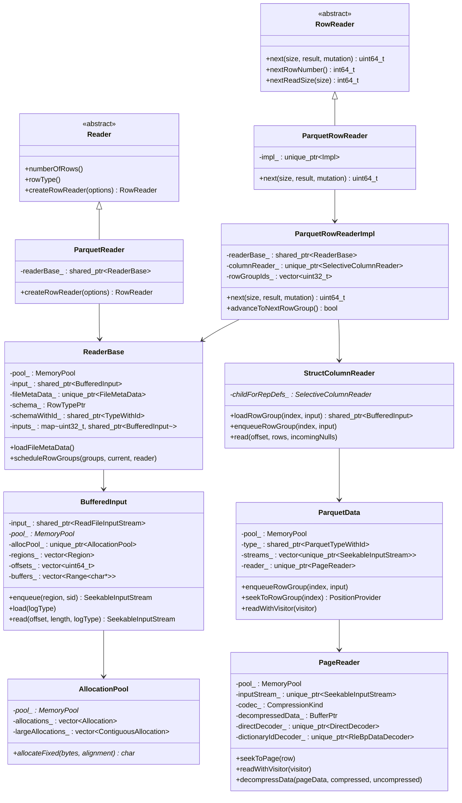
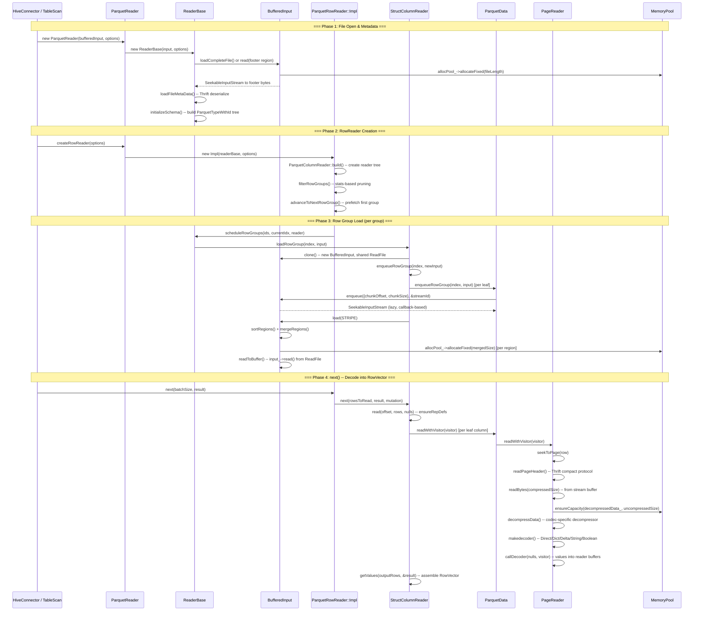

# Module Teardown: DWIO Parquet Reader -- The Ingestion Bridge

## Table of Contents

- [0. Research Focus](#0-research-focus)
- [1. High-Level Overview](#1-high-level-overview)
- [2. Structural Architecture](#2-structural-architecture)
  - [Class Diagram](#class-diagram)
- [3. Execution & Call Flow](#3-execution-call-flow)
  - [Sequence Diagram](#sequence-diagram)
  - [Step-by-step text breakdown:](#step-by-step-text-breakdown)
- [4. Concurrency & State Management](#4-concurrency-state-management)
- [5. Memory & Resource Profile](#5-memory-resource-profile)
- [6. Key Design Insights](#6-key-design-insights)
  - [6.1 Lazy Stream Resolution via Callbacks](#61-lazy-stream-resolution-via-callbacks)
  - [6.2 Region Sort-Merge I/O Optimization](#62-region-sort-merge-io-optimization)
  - [6.3 The ReaderBase Owns Row Group I/O Lifetime](#63-the-readerbase-owns-row-group-io-lifetime)
  - [6.4 Format-Agnostic Framework with Format-Specific FormatData](#64-format-agnostic-framework-with-format-specific-formatdata)
  - [6.5 AllocationPool as Bump-Pointer on Top of MemoryPool](#65-allocationpool-as-bump-pointer-on-top-of-memorypool)
  - [6.6 Speculative Footer Read](#66-speculative-footer-read)
  - [6.7 Row Group Statistics Filtering Before I/O](#67-row-group-statistics-filtering-before-io)
  - [6.8 Page-Level Decode with Visitor Pattern](#68-page-level-decode-with-visitor-pattern)
  - [6.9 BufferedInput Clone for Parallel Row Group Loading](#69-bufferedinput-clone-for-parallel-row-group-loading)
  - [6.10 Decompression Buffer Reuse](#610-decompression-buffer-reuse)


## 0. Research Focus
* **Task ID:** 1.4
* **Focus:** Trace how Velox's DWIO (Data Warehouse I/O) framework pulls bytes from storage and decodes Parquet into a `RowVector`. Trace how memory is pre-allocated from the pool during decoding.

## 1. High-Level Overview
* **Core Responsibility:** The DWIO framework provides a pluggable, format-agnostic pipeline for reading columnar file formats (Parquet, ORC/DWRF, Nimble) from storage into Velox's in-memory `RowVector` representation. The Parquet reader specialization decodes Parquet pages -- handling repetition/definition levels, dictionary and direct encodings, and compression -- into the flat columnar Arrow-like buffers that back Velox vectors. All memory for I/O buffers and decoded data is drawn from Velox's `MemoryPool`, ensuring every byte of the ingestion path is tracked and subject to the same spill/arbitration framework used by operators.
* **Key Triggers:** A `HiveConnector` (or test harness) creates a `ParquetReader` with a `BufferedInput` wrapping a `ReadFile`. It then calls `createRowReader()` to get a `ParquetRowReader`, which is iterated via `next(batchSize, result)`. Each `next()` call drives the full pipeline: row group scheduling, I/O load, page decompression, value decoding, and `RowVector` assembly.

## 2. Structural Architecture
* **Primary Source Files:**
  - `velox/dwio/common/Reader.h` -- Abstract `Reader` / `RowReader` interfaces
  - `velox/dwio/common/BufferedInput.h/.cpp` -- I/O batching, merge, and read
  - `velox/dwio/parquet/reader/ParquetReader.h/.cpp` -- `ParquetReader`, `ReaderBase`, `ParquetRowReader::Impl`
  - `velox/dwio/parquet/reader/StructColumnReader.h/.cpp` -- Top-level struct reader (row group load/enqueue)
  - `velox/dwio/parquet/reader/ParquetData.h/.cpp` -- Per-leaf format data (stream management)
  - `velox/dwio/parquet/reader/PageReader.h/.cpp` -- Page-level decode engine
  - `velox/dwio/common/SelectiveStructColumnReader.h/.cpp` -- Base `next()` / `read()` / `getValues()` logic

* **Key Data Structures:**
  - `BufferedInput` -- Owns `AllocationPool`, enqueued `Region`s, sorted/merged buffers
  - `ReaderBase` -- File metadata, schema (`ParquetTypeWithId` tree), `BufferedInput` pool for row groups
  - `ParquetRowReader::Impl` -- Row group iteration state, `SelectiveColumnReader` tree root
  - `ParquetData` -- Per-leaf column chunk streams, `PageReader` lifecycle
  - `PageReader` -- Page header parsing, decompression, rep/def level decoding, value decoders
  - `AllocationPool` -- Bump-pointer allocator backed by `MemoryPool` `Allocation` runs

### Class Diagram



## 3. Execution & Call Flow

### Sequence Diagram



### Step-by-step text breakdown:

**Phase 1: File Open and Metadata Parsing**

1. The connector creates a `ParquetReader` by passing a `BufferedInput` and `ReaderOptions`. The `ParquetReader` constructor creates a `ReaderBase`.

2. `ReaderBase` constructor (`ParquetReader.cpp:253-268`) immediately loads metadata:
   - Gets `fileLength_` from `input_->getReadFile()->size()`
   - Calls `loadFileMetaData()`

3. `loadFileMetaData()` (`ParquetReader.cpp:270-319`) implements speculative footer reading:
   ```cpp
   bool preloadFile =
       fileLength_ <= std::max(filePreloadThreshold_, footerSpeculativeIoSize_);
   uint64_t readSize = preloadFile ? fileLength_ : footerSpeculativeIoSize_;
   ```
   For small files (below `filePreloadThreshold`), the entire file is loaded with `input_->loadCompleteFile()`. For large files, only the trailing `footerSpeculativeIoSize_` bytes are read. The footer is found by reading the last 8 bytes: 4 bytes of footer length + 4 bytes of magic "PAR1". If the speculative read was too small, a second read fetches the missing portion.

4. The footer bytes are deserialized via Thrift Compact Protocol into `thrift::FileMetaData`. The schema is then converted into Velox's `ParquetTypeWithId` tree by `initializeSchema()`, which recursively walks the Parquet schema elements, computing `maxDefine` and `maxRepeat` at each level.

**Phase 2: RowReader Creation and Row Group Filtering**

5. `createRowReader()` builds a `ParquetRowReader`, which constructs its `Impl`. The Impl:
   - Creates `ParquetParams` (format-specific config holding metadata, timezone, timestamp precision)
   - Calls `ParquetColumnReader::build()` to recursively construct a tree of `SelectiveColumnReader` objects matching the requested schema projection
   - Calls `filterRowGroups()` which uses column-level statistics from file metadata to prune row groups:
     ```cpp
     columnReader_->filterRowGroups(0, parquetStatsContext_, res);
     ```
     Each leaf `ParquetData::filterRowGroups()` tests the scan filter against row group column statistics.
   - If any row groups survive filtering, calls `advanceToNextRowGroup()` to prefetch the first one

**Phase 3: Row Group I/O -- The Ingestion Bridge**

6. `advanceToNextRowGroup()` (`ParquetReader.cpp:1418-1434`) orchestrates row group preparation:
   ```cpp
   readerBase_->scheduleRowGroups(rowGroupIds_, nextRowGroupIdsIdx_,
       static_cast<StructColumnReader&>(*columnReader_));
   columnReader_->seekToRowGroup(nextRowGroupIndex);
   ```

7. `ReaderBase::scheduleRowGroups()` (`ParquetReader.cpp:1200-1217`) implements row group prefetching:
   ```cpp
   auto numRowGroupsToLoad = std::min(
       options_.prefetchRowGroups() + 1,
       static_cast<int64_t>(rowGroupIds.size() - currentGroup));
   for (auto i = 0; i < numRowGroupsToLoad; i++) {
       auto thisGroup = rowGroupIds[currentGroup + i];
       if (!inputs_[thisGroup]) {
           inputs_[thisGroup] = reader.loadRowGroup(thisGroup, input_);
       }
   }
   ```
   Previous row groups are evicted (`inputs_.erase(rowGroupIds[currentGroup - 1])`).

8. `StructColumnReader::loadRowGroup()` (`StructColumnReader.cpp:117-128`):
   ```cpp
   std::shared_ptr<dwio::common::BufferedInput> StructColumnReader::loadRowGroup(
       uint32_t index,
       const std::shared_ptr<dwio::common::BufferedInput>& input) {
     if (isRowGroupBuffered(index, *input)) {
       enqueueRowGroup(index, *input);
       return input;
     }
     auto newInput = input->clone();
     enqueueRowGroup(index, *newInput);
     newInput->load(dwio::common::LogType::STRIPE);
     return newInput;
   }
   ```
   This clones the `BufferedInput` (sharing the underlying `ReadFile` and `MemoryPool` but with fresh enqueue state), then calls `enqueueRowGroup()` on every leaf column to register their byte ranges, then `load()` to execute the I/O.

9. `StructColumnReader::enqueueRowGroup()` (`StructColumnReader.cpp:138-152`) recurses through the reader tree. For each leaf column:
   ```cpp
   child->formatData().as<ParquetData>().enqueueRowGroup(index, input);
   ```

10. `ParquetData::enqueueRowGroup()` (`ParquetData.cpp:94-118`) computes the byte range for the column chunk:
    ```cpp
    uint64_t chunkReadOffset = chunk.dataPageOffset();
    if (chunk.hasDictionaryPageOffset() && chunk.dictionaryPageOffset() >= 4) {
        chunkReadOffset = chunk.dictionaryPageOffset();
    }
    uint64_t readSize =
        (chunk.compression() == common::CompressionKind::CompressionKind_NONE)
        ? chunk.totalUncompressedSize()
        : chunk.totalCompressedSize();
    streams_[index] = input.enqueue({chunkReadOffset, readSize}, &id);
    ```
    The returned `SeekableInputStream` is a lazy `SeekableArrayInputStream` with a callback that resolves to the loaded buffer.

11. `BufferedInput::enqueue()` (`BufferedInput.cpp:140-169`) pushes the region and returns a lazy stream:
    ```cpp
    regions_.push_back(region);
    return std::make_unique<SeekableArrayInputStream>(
        [region, this, i = regions_.size() - 1]() {
            auto result = readInternal(region.offset, region.length, i);
            ...
            return result;
        });
    ```

12. `BufferedInput::load()` (`BufferedInput.cpp:90-122`) is where physical I/O happens:
    - Clears previous buffers, sorts regions by offset, merges nearby regions (gap <= `kMaxMergeDistance` = 1.25 MB)
    - For each merged region, allocates from `AllocationPool` and reads:
      ```cpp
      for (const auto& region : regions_) {
          readToBuffer(region.offset, allocate(region), logType);
      }
      ```
    - `allocate()` uses `allocPool_->allocateFixed(region.length)` which is backed by `MemoryPool::allocate()` through `Allocation` runs
    - VRead path: if `wsVRLoad` flag is set, uses vectorized read API (`input_->vread()`) instead

13. `ParquetData::seekToRowGroup()` (`ParquetData.cpp:120-134`) creates a `PageReader` for the column chunk stream:
    ```cpp
    reader_ = std::make_unique<PageReader>(
        std::move(streams_[index]),
        pool_,
        type_,
        metadata.compression(),
        metadata.totalCompressedSize(),
        stats_,
        sessionTimezone_);
    ```

**Phase 4: Value Decoding -- Page by Page**

14. When `next()` is called on the `ParquetRowReader::Impl` (`ParquetReader.cpp:1363-1387`):
    ```cpp
    columnReader_->next(rowsToRead, result, mutation);
    ```
    This delegates to `SelectiveStructColumnReaderBase::next()`, which calls `read()` then `getValues()`.

15. The Parquet `StructColumnReader::read()` first ensures repetition/definition levels are available via `ensureRepDefs()`, then delegates to the base `SelectiveStructColumnReader::read()`. The base reads children in scan-spec order, applying filters progressively -- filtered children produce a narrowed `outputRows_` set that subsequent children read.

16. Each leaf reader's `read()` calls `ParquetData::readWithVisitor(visitor)` which delegates to `PageReader::readWithVisitor()` -- the core decode loop.

17. `PageReader::readWithVisitor()` (`PageReader.h:546-626`) is a templated method that:
    - Calls `startVisit()` to set up row iteration across pages
    - Loops via `rowsForPage()` which calls `seekToPage()` to advance to the right page
    - `seekToPage()` reads page headers, decompresses data, and initializes decoders
    - `callDecoder()` dispatches to the right decoder based on encoding and data type:
      - **Dictionary encoded:** `dictionaryIdDecoder_->readWithVisitor()` reads indices, visitor resolves values
      - **Direct/Plain:** `directDecoder_->readWithVisitor()` reads raw values
      - **Delta Binary Packed:** `deltaBpDecoder_->readWithVisitor()`
      - **Strings:** `stringDecoder_->readWithVisitor()` or dictionary path
      - **Boolean:** `booleanDecoder_->readWithVisitor()` or RLE-encoded booleans
    - Multi-page reads concatenate null bitmaps via `BitConcatenation`

18. `prepareDataPageV1()` (`PageReader.cpp:213-281`) handles V1 data page preparation:
    - Reads compressed page bytes via `readBytes()`
    - Decompresses via `decompressData()` which allocates `decompressedData_` from the pool:
      ```cpp
      dwio::common::ensureCapacity<char>(
          decompressedData_, uncompressedSize, &pool_);
      ```
    - Parses repetition levels (RLE-encoded), definition levels (RLE bit-packed)
    - Sets `pageData_` to point at the encoded values after rep/def headers

19. `getValues()` (`SelectiveStructColumnReader.cpp:538-629`) assembles the final `RowVector`:
    - Resizes the result `RowVector` to `rows.size()`
    - For each child spec: either calls `children_[index]->getValues(rows, &childResult)` for immediate values, or wraps in a `LazyVector` for deferred loading (when `generateLazyChildren_` is true and no filter is present on the column)
    - Constant columns (e.g., partition keys) are handled via `BaseVector::wrapInConstant()`

## 4. Concurrency & State Management

* **Threading Model:** The DWIO read pipeline is fundamentally single-threaded per `RowReader` instance. One thread calls `next()` repeatedly. However, there are two concurrency hooks:
  - **Prefetch:** `ReaderBase::scheduleRowGroups()` can pre-load `prefetchRowGroups()` row groups ahead of the currently-reading one. The `BufferedInput::load()` call for these is synchronous on the same thread, but `CachedBufferedInput` (used with `AsyncDataCache`) can issue background I/O via `folly::Executor`.
  - **Async I/O:** `ReadFileInputStream::readAsync()` and `ReadFile::preadvAsync()` provide `SemiFuture`-based async read for implementations that support it. The `DirectBufferedInput` and `CachedBufferedInput` subclasses can leverage executors for parallel I/O.
  - **Split-level:** At the `HiveConnector` level, multiple splits (files) can be read concurrently by different threads, each with their own `ParquetReader`.

* **State Machine:** The `ParquetRowReader::Impl` maintains a simple linear state machine:
  - `nextRowGroupIdsIdx_` tracks position in the filtered row group list
  - `currentRowInGroup_` tracks position within the current row group
  - `advanceToNextRowGroup()` transitions between groups (schedule I/O, seek column readers)
  - Reads are strictly sequential within a file -- no random access across row groups

* **Synchronization:** Within a single reader, no mutexes are needed. The `ReadFile` interface requires thread-safety for `pread()`, enabling shared file handles across cloned `BufferedInput` instances. The `AsyncDataCache` used by `CachedBufferedInput` has its own internal synchronization for cache entry management.

## 5. Memory & Resource Profile

* **Allocation Pattern:**
  The ingestion path uses two distinct allocation strategies:

  1. **I/O Buffers (BufferedInput):** Raw bytes from storage are allocated through `AllocationPool`, which does bump-pointer allocation from `Allocation` runs obtained from `MemoryPool`. Regions are sorted and merged before allocation to minimize I/O calls and fragmentation. The `allocate()` method:
     ```cpp
     folly::Range<char*> allocate(const velox::common::Region& region) {
         offsets_.push_back(region.offset);
         buffers_.emplace_back(
             allocPool_->allocateFixed(region.length), region.length);
         return folly::Range<char*>(buffers_.back().data(), region.length);
     }
     ```
     `AllocationPool` starts with `Allocation` runs (16+ pages via `MemoryPool::allocateNonContiguous()`) and switches to `ContiguousAllocation` (large mmap with huge pages) after `kDefaultHugePageThreshold` (256 KB) of usage.

  2. **Decompressed Data (PageReader):** Each `PageReader` allocates a `decompressedData_` buffer from the pool via `ensureCapacity<char>()`, which grows the `BufferPtr` as needed. This buffer is reused across pages in the same column chunk.

  3. **Decoded Values (SelectiveColumnReader):** The column reader framework pre-allocates result buffers (values, nulls, string buffers) from `MemoryPool` through the standard `Buffer`/`BufferPtr` mechanism. The `ensureCapacity<>()` pattern is used extensively to avoid repeated reallocation.

* **Memory Tracking:** Every allocation flows through `MemoryPool`:
  - `AllocationPool` uses `pool_->allocateNonContiguous()` for paged runs and `pool_->allocateContiguous()` for large allocations
  - `BufferPtr` allocations use `pool_->allocate()` (aligned allocation)
  - Decompression buffers use `pool_->allocate()` via `ensureCapacity()`
  - The `MemoryPool` hierarchy ensures all reader memory is tracked under the task's memory tree and subject to arbitration/spill
  - Row group eviction (`inputs_.erase()`) releases I/O buffers when no longer needed, returning memory to the pool

* **Memory Lifecycle per Row Group:**
  - **Enqueue:** No allocation; just records `Region` offsets
  - **Load:** Allocates merged I/O buffers, reads from storage
  - **SeekToRowGroup:** Creates `PageReader`, moves stream ownership
  - **ReadPages:** Allocates decompression buffer (reused), rep/def level arrays (`raw_vector`), leaf nulls
  - **GetValues:** Assembles `RowVector` reusing existing children where possible
  - **Next Row Group:** Previous group's `BufferedInput` is released, `PageReader` is replaced

## 6. Key Design Insights

### 6.1 Lazy Stream Resolution via Callbacks
The `BufferedInput::enqueue()` method does not immediately read data. It returns a `SeekableArrayInputStream` wrapping a lambda callback:
```cpp
return std::make_unique<SeekableArrayInputStream>(
    [region, this, i = regions_.size() - 1]() {
        auto result = readInternal(region.offset, region.length, i);
        ...
        return result;
    });
```
The actual I/O only happens when `load()` is called. This allows all column chunk regions to be collected first, then sorted and merged for optimal I/O. The lambda captures the original enqueue index `i`, which maps through `enqueuedToBufferOffset_` to the post-merge buffer position for O(1) lookup.

### 6.2 Region Sort-Merge I/O Optimization
`BufferedInput::load()` sorts all enqueued regions by file offset and merges adjacent ones within `kMaxMergeDistance` (1.25 MB):
```cpp
bool BufferedInput::tryMerge(Region& first, const Region& second) {
    const int64_t gap = second.offset - first.offset - first.length;
    if (gap < 0 || gap <= maxMergeDistance_) {
        if (extension > 0) {
            first.length += extension;
        }
        return true;
    }
    return false;
}
```
This converts N small column chunk reads into fewer large sequential reads, critical for network-attached storage where latency dominates. The over-read bytes in gaps are tracked via `stats->incRawOverreadBytes(gap)`.

### 6.3 The ReaderBase Owns Row Group I/O Lifetime
`ReaderBase::inputs_` maps row group indices to `shared_ptr<BufferedInput>`. This is the key memory lifetime mechanism:
```cpp
std::unordered_map<uint32_t, std::shared_ptr<dwio::common::BufferedInput>> inputs_;
```
When `scheduleRowGroups()` advances to a new group, it erases the previous group's entry, releasing all I/O buffers. The `shared_ptr` ensures that if any `SeekableInputStream` callback still references the old `BufferedInput`, the memory stays alive until all references are dropped.

### 6.4 Format-Agnostic Framework with Format-Specific FormatData
The DWIO framework achieves format independence through `FormatData` and `FormatParams`:
- `FormatParams::toFormatData()` creates format-specific data for each column (e.g., `ParquetData`)
- `FormatData` provides the interface for nulls, seeking, and row group filtering
- `SelectiveColumnReader` holds a `unique_ptr<FormatData>` and delegates format-specific operations to it
- The `as<T>()` cast pattern (`formatData().as<ParquetData>()`) provides type-safe downcasting

This means the common reader framework (`SelectiveStructColumnReader::read()`, `getValues()`, etc.) works unchanged across Parquet, ORC, and Nimble.

### 6.5 AllocationPool as Bump-Pointer on Top of MemoryPool
`AllocationPool` is a lightweight bump-pointer allocator that avoids per-region calls to the heavyweight `MemoryPool`:
```cpp
char* allocateFixed(uint64_t bytes, int32_t alignment = 1);
```
It allocates large runs from `MemoryPool` (minimum 16 pages = 64 KB) and serves small requests by advancing `currentOffset_`. After 256 KB of usage, it switches to `ContiguousAllocation` with huge page support for better TLB performance. This is ideal for I/O buffers where many small-to-medium regions are allocated in a batch.

### 6.6 Speculative Footer Read
`ReaderBase::loadFileMetaData()` avoids a two-round-trip pattern (read footer length, then read footer) by speculatively reading `footerSpeculativeIoSize_` bytes from the end of the file:
```cpp
bool preloadFile =
    fileLength_ <= std::max(filePreloadThreshold_, footerSpeculativeIoSize_);
uint64_t readSize = preloadFile ? fileLength_ : footerSpeculativeIoSize_;
```
For small files below `filePreloadThreshold`, the entire file is loaded in one read, eliminating subsequent I/O entirely. This is a significant optimization for partition-heavy layouts with many small files.

### 6.7 Row Group Statistics Filtering Before I/O
Row groups are pruned before any column data is loaded:
```cpp
void ParquetRowReader::Impl::filterRowGroups() {
    ...
    columnReader_->filterRowGroups(0, parquetStatsContext_, res);
    ...
    for (auto i = 0; i < rowGroups_.size(); i++) {
        ...
        auto isExcluded =
            (i < res.totalCount && bits::isBitSet(res.filterResult.data(), i));
        if (rowGroupInRange && !isExcluded && !isEmpty) {
            rowGroupIds_.push_back(i);
        } else {
            rowGroups_[i].columns.clear(); // Release metadata memory
        }
    }
}
```
Excluded row groups have their `ColumnChunk` metadata cleared to reduce memory consumption. This is especially important for wide tables where column metadata is the dominant memory cost in the file footer.

### 6.8 Page-Level Decode with Visitor Pattern
The `PageReader::readWithVisitor<Visitor>()` template is the innermost hot loop. It is specialized on three boolean compile-time parameters (`hasFilter`, `filterOnly`, `hasHook`) and dispatches to encoding-specific decoders:
```cpp
void callDecoder(const uint64_t* nulls, bool& nullsFromFastPath, Visitor visitor) {
    if (isDictionary()) {
        auto dictVisitor = visitor.toDictionaryColumnVisitor();
        dictionaryIdDecoder_->readWithVisitor<true>(nulls, dictVisitor);
    } else if (encoding_ == thrift::Encoding::DELTA_BINARY_PACKED) {
        deltaBpDecoder_->readWithVisitor<true>(nulls, visitor);
    } else {
        directDecoder_->readWithVisitor<true>(nulls, visitor, nullsFromFastPath);
    }
}
```
The visitor pattern allows the same decode path to produce filtered row indices (for pushdown), raw values (for non-filtered reads), or dictionary indices (for late materialization) -- all without virtual dispatch in the inner loop.

### 6.9 BufferedInput Clone for Parallel Row Group Loading
`BufferedInput::clone()` creates a new `BufferedInput` sharing the same `ReadFile` and `MemoryPool`:
```cpp
virtual std::unique_ptr<BufferedInput> clone() const {
    return std::make_unique<BufferedInput>(
        input_, *pool_, maxMergeDistance_, wsVRLoad_);
}
```
Each row group gets its own `BufferedInput` with independent enqueue/load state. This enables `CachedBufferedInput` subclasses to issue parallel I/O for prefetched row groups while the current group is being decoded.

### 6.10 Decompression Buffer Reuse
The `PageReader` reuses `decompressedData_` across pages:
```cpp
dwio::common::ensureCapacity<char>(
    decompressedData_, uncompressedSize, &pool_);
decompressedStream->readFully(
    decompressedData_->asMutable<char>(), uncompressedSize);
```
`ensureCapacity` only reallocates if the current buffer is too small. Since pages within a column chunk tend to have similar sizes, this avoids repeated allocation/deallocation. The `BufferPtr` reference counting ensures the buffer is not freed while any pointer into it is still live.
