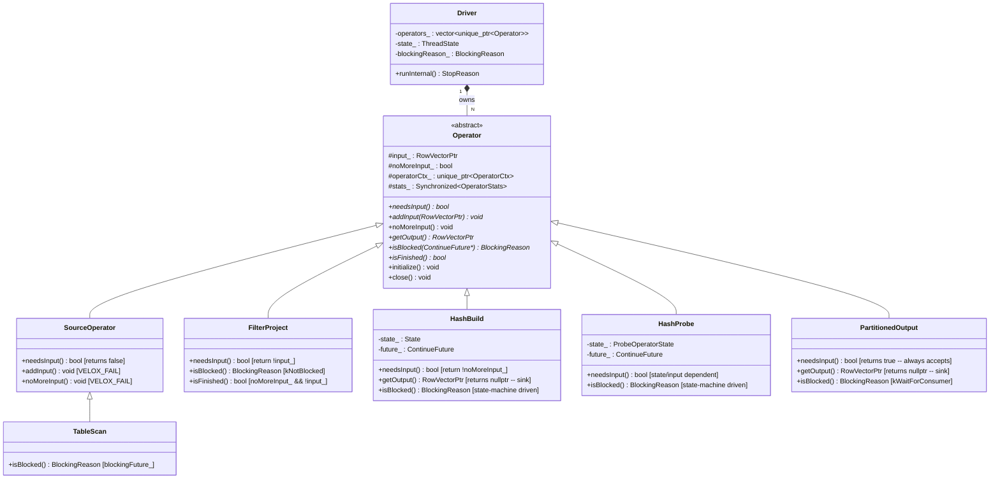

# Module Teardown: The Velox Operator State Machine

## Table of Contents

- [0. Research Focus](#0-research-focus)
- [1. High-Level Overview](#1-high-level-overview)
- [2. Structural Architecture](#2-structural-architecture)
  - [Class Diagram (mermaid)](#class-diagram-mermaid)
- [3. Execution & Call Flow](#3-execution-call-flow)
  - [Sequence Diagram (mermaid)](#sequence-diagram-mermaid)
  - [Step-by-step text breakdown](#step-by-step-text-breakdown)
- [4. Concurrency & State Management](#4-concurrency-state-management)
  - [Threading Model](#threading-model)
  - [State Machine](#state-machine)
  - [Synchronization](#synchronization)
- [5. Memory & Resource Profile](#5-memory-resource-profile)
  - [Allocation Pattern](#allocation-pattern)
  - [Memory Tracking](#memory-tracking)
- [6. Key Design Insights](#6-key-design-insights)
  - [1. Near-identical Volcano contract to Trino, but with C++ async blocking](#1-near-identical-volcano-contract-to-trino-but-with-c-async-blocking)
  - [2. The `isBlocked()` method serves as the operator's main scheduling hook](#2-the-isblocked-method-serves-as-the-operators-main-scheduling-hook)
  - [3. The backward walk from sink to source prioritizes output](#3-the-backward-walk-from-sink-to-source-prioritizes-output)
  - [4. SourceOperator is a hard boundary -- no input methods](#4-sourceoperator-is-a-hard-boundary-no-input-methods)
  - [5. `noMoreInput()` propagation is pull-based, not broadcast](#5-nomoreinput-propagation-is-pull-based-not-broadcast)
  - [6. Blocking uses folly's SemiFuture, not full Future -- no implicit executor](#6-blocking-uses-follys-semifuture-not-full-future-no-implicit-executor)
  - [7. The CALL_OPERATOR macro enforces non-reclaimable execution](#7-the-call_operator-macro-enforces-non-reclaimable-execution)
  - [8. Contrast with DataFusion: push-based vs. pull-based state machines](#8-contrast-with-datafusion-push-based-vs-pull-based-state-machines)
  - [9. Early finish is supported but has specific semantics](#9-early-finish-is-supported-but-has-specific-semantics)
  - [10. The operator factory uses a chain-of-responsibility pattern](#10-the-operator-factory-uses-a-chain-of-responsibility-pattern)


## 0. Research Focus
* **Task ID:** 3.1
* **Focus:** Analyze the Volcano-style contract in Velox. Trace `needsInput()`, `addInput()`, `getOutput()`, `isFinished()`, and `isBlocked()`. Document how strictly this mirrors Trino's Java interface and how blocking signals are passed as `folly::Future`.

## 1. High-Level Overview
* **Core Responsibility:** The `Operator` class defines the fundamental execution contract for every physical operator in Velox -- the interface through which the Driver pulls and pushes data between operators in a pipeline. It establishes a Volcano-style iterator model with five core methods that govern data flow, blocking, and termination. Every concrete operator (TableScan, FilterProject, HashBuild, HashProbe, PartitionedOutput, etc.) implements this contract.
* **Key Triggers:** The Driver's `runInternal()` loop is the sole caller of the Operator contract methods. It walks the operator chain from the sink (consumer) backwards toward the source (producer), invoking `isBlocked()`, `needsInput()`, `getOutput()`, `addInput()`, and `isFinished()` in a precise sequence on each iteration.

## 2. Structural Architecture
* **Primary Source Files:**
  - `velox/exec/Operator.h` -- Abstract base class defining the five-method contract
  - `velox/exec/Operator.cpp` -- Base implementation (close, stats, fillOutput, memory reclaim)
  - `velox/exec/Driver.h` -- Driver state machine, `BlockingState`, `ThreadState`, `ContinueFuture` typing
  - `velox/exec/Driver.cpp` -- `runInternal()` loop that orchestrates the operator contract
  - `velox/exec/BlockingReason.h` -- Enum of all blocking reasons
  - `velox/common/future/VeloxPromise.h` -- `ContinueFuture` / `ContinuePromise` type aliases

* **Key Data Structures:**

| Structure | Role |
|---|---|
| `Operator` | Abstract base with 5 pure virtual methods; holds `input_`, `noMoreInput_`, memory pool, stats |
| `SourceOperator` | Subclass that stubs out `needsInput()`/`addInput()`/`noMoreInput()` for pipeline sources |
| `OperatorCtx` | Per-operator context linking to `DriverCtx`, plan node, memory pool |
| `BlockingReason` | Enum (13 values) describing why an operator is blocked |
| `ContinueFuture` | Type alias for `folly::SemiFuture<folly::Unit>` -- the async unblock signal |
| `ContinuePromise` | Type alias for `VeloxPromise<folly::Unit>` -- producer side of the future |
| `BlockingState` | Captures (Driver, ContinueFuture, Operator*, BlockingReason) when a driver goes off-thread |
| `ThreadState` | Driver's lifecycle state: on-thread, enqueued, blocked, suspended, terminated |
| `OpCallStatus` | Atomic tracking of which operator method is currently executing |

### Class Diagram (mermaid)



## 3. Execution & Call Flow

### Sequence Diagram (mermaid)

```mermaid
sequenceDiagram
    participant Executor as Thread Pool
    participant D as Driver
    participant Sink as operators_[N-1] (Sink)
    participant Mid as operators_[i]
    participant Src as operators_[0] (Source)

    Executor->>D: Driver::run(self)
    D->>D: runInternal(self, blockingState, result)
    D->>D: initializeOperators()

    loop for i = N-1 downto 0
        D->>Mid: isBlocked(&future)
        alt Blocked
            D->>D: blockDriver() -> StopReason::kBlock
            D-->>Executor: off-thread
        end

        alt i < N-1 (not last operator)
            D->>Sink: isBlocked(&future)
            D->>Sink: needsInput()
            alt needsInput == true
                D->>Mid: getOutput()
                alt output != nullptr
                    D->>Sink: addInput(output)
                    Note over D: i += 2; continue
                else output == nullptr
                    D->>Mid: isBlocked(&future)
                    D->>Mid: isFinished()
                    alt finished
                        D->>Sink: noMoreInput()
                        Note over D: break inner loop
                    end
                end
            end
        else i == N-1 (last operator / sink in serial mode)
            D->>Sink: getOutput()
            alt result != nullptr
                D-->>Executor: return result to caller
            else
                D->>Sink: isFinished()
                alt finished
                    D->>D: close()
                    D-->>Executor: StopReason::kAtEnd
                end
            end
        end
    end
```

### Step-by-step text breakdown

The `Driver::runInternal()` method at `Driver.cpp:503` is the heart of the execution loop. Here is the precise algorithm:

**1. Entry and task coordination**

```cpp
StopReason stop =
    closed_ ? StopReason::kTerminate : task()->enter(state_, now);
if (stop != StopReason::kNone) { ... return stop; }
```

The driver attempts to enter the task. If the task is paused, terminated, or the driver is already on thread, it returns immediately with the appropriate `StopReason`.

**2. Operator initialization (once)**

```cpp
initializeOperators();
int32_t startingOperator = getStartingOperator();
```

On the first call, each operator's `initialize()` is called. `getStartingOperator()` returns `operators_.size() - 1` (the sink/consumer) by default -- meaning the loop always starts from the consumer end and walks backwards.

**3. The double loop**

The outer `for(;;)` loop runs indefinitely until the pipeline finishes or blocks. The inner `for (int32_t i = startingOperator; i >= 0; --i)` walks from the last operator (consumer/sink) backwards toward the source:

**Step 3a: Check for yield/stop**
```cpp
stop = task()->shouldStop();
if (stop != StopReason::kNone) { return stop; }
if (FOLLY_UNLIKELY(shouldYield())) { return StopReason::kYield; }
```

**Step 3b: Check isBlocked on current operator**
```cpp
blockingReason_ = op->isBlocked(&future);
if (blockingReason_ != BlockingReason::kNotBlocked) {
    return blockDriver(self, i, std::move(future), blockingState, guard);
}
```

If the current operator is blocked, the driver goes off-thread. The `ContinueFuture` is captured in a `BlockingState` which will re-enqueue the driver when the future completes.

**Step 3c: For non-sink operators (i < operators_.size() - 1)**

Check the *downstream* (next) operator:
```cpp
Operator* nextOp = operators_[i + 1].get();
blockingReason_ = nextOp->isBlocked(&future);  // is downstream blocked?
needsInput = nextOp->needsInput();              // can downstream accept data?
```

If `needsInput` is true, try to pull data from the current operator:
```cpp
getOutput(op, intermediateResult);  // pull a batch
if (intermediateResult) {
    addInput(nextOp, intermediateResult);  // push to downstream
    i += 2;  // jump back to check downstream's output
    continue;
}
```

The critical `i += 2` means: after feeding data to `operators_[i+1]`, the loop's `--i` decrement will bring it back to `i+1`, checking whether the downstream operator can now produce output. This is the "push data down, then check if it comes out" pattern.

If getOutput returns nullptr and the operator is finished:
```cpp
finished = op->isFinished();
if (finished) {
    nextOp->noMoreInput();  // propagate end-of-stream
    break;                  // break inner loop, restart from sink
}
```

**Step 3d: For the sink operator (last in pipeline, serial mode)**

The sink's `getOutput()` returns data to the caller (used in synchronous `Driver::next()` mode):
```cpp
getOutput(op, result);
if (result) {
    blockingReason_ = BlockingReason::kWaitForConsumer;
    return StopReason::kBlock;
}
```

If the sink is finished, the driver closes itself:
```cpp
if (finished) {
    close();
    return StopReason::kAtEnd;
}
```

**4. CALL_OPERATOR macro**

Every method invocation goes through the `CALL_OPERATOR` macro (`Driver.cpp:366-386`) which:
1. Sets `NonReclaimableSectionGuard` -- prevents memory reclaim during operator execution
2. Sets `RuntimeStatWriterScopeGuard` for stats attribution
3. Records `opCallStatus_` (operator id + method name) for debugging/deadlock detection
4. Sets `ExceptionContextSetter` for operator-specific error context
5. Records silent throws count

```cpp
#define CALL_OPERATOR(call, operatorPtr, operatorId, operatorMethod)       \
  try {                                                                    \
    Operator::NonReclaimableSectionGuard nonReclaimableGuard(operatorPtr); \
    RuntimeStatWriterScopeGuard statsWriterGuard(operatorPtr);             \
    threadNumVeloxThrow() = 0;                                             \
    opCallStatus_.start(operatorId, operatorMethod);                       \
    ExceptionContextSetter exceptionContext(                               \
        {addContextOnException, operatorPtr, true});                       \
    auto stopGuard = folly::makeGuard([&]() { opCallStatus_.stop(); });    \
    call;                                                                  \
    recordSilentThrows(*operatorPtr);                                      \
  } catch ...
```

## 4. Concurrency & State Management

### Threading Model

Velox uses a single-threaded-per-driver model. Each Driver runs on exactly one thread at a time, drawn from a `folly::CPUThreadPoolExecutor`. The driver can go off-thread (blocked, yielded, paused) and be re-enqueued later.

Key invariant: **No two threads ever execute the same Driver concurrently.** The `ThreadState` struct enforces this:

```cpp
struct ThreadState {
    std::atomic<std::thread::id> thread{std::thread::id()};
    std::atomic<bool> isEnqueued{false};
    std::atomic<bool> isTerminated{false};
    bool hasBlockingFuture{false};
    std::atomic<uint32_t> numSuspensions{0};
    ...
};
```

This means operator methods do NOT need internal synchronization -- they are always called from a single driver thread.

### State Machine

#### Driver State Machine

```
                    +---> Terminated (final)
                    |
  Created ---> Enqueued ---> On Thread ---> Blocked ---> Enqueued
                  ^              |              |            |
                  |              v              v            v
                  +-------  Yielded      Suspended     Terminated
```

#### Operator Lifecycle (Abstract Contract)

There is no explicit state enum in the base `Operator` class. Instead, the state is *implicit* in the combination of protected fields:

| Field | Meaning |
|---|---|
| `initialized_` | false until `initialize()` called |
| `input_` | non-null when the operator has unprocessed input |
| `noMoreInput_` | true after `noMoreInput()` called |

The abstract lifecycle for a non-source operator is:

```
                    initialize()
                         |
                         v
     +------------> READY (input_ == null, !noMoreInput_)
     |                   |
     |             addInput(batch)
     |                   |
     |                   v
     |           PROCESSING (input_ != null)
     |                   |
     |             getOutput() returns batch
     |                   |
     |      +------- input_ = null --------+
     |      |                               |
     |      v                               v
     +-- READY                    noMoreInput()
                                      |
                                      v
                               DRAINING (noMoreInput_ == true)
                                      |
                                getOutput() until nullptr
                                      |
                                      v
                               FINISHED (isFinished() == true)
```

#### Concrete Operator State Machines

Complex operators like HashBuild and HashProbe define their own explicit state enums:

**HashBuild::State:**
```
kRunning --> kWaitForBuild --> kWaitForProbe --> kRunning (cycle for spill)
                                    |
                                    v
                                 kFinish
```

**ProbeOperatorState (HashProbe):**
```
kWaitForBuild --> kRunning --> kWaitForPeers --> kFinish
      ^                            |
      +----------------------------+   (spill cycle)
```

### Synchronization

1. **Operator stats** (`folly::Synchronized<OperatorStats>`) -- the only mutable state accessed from multiple threads. Read/written with `.rlock()` / `.wlock()`.

2. **BlockingState::setResume** -- called from the `folly::SemiFuture` callback thread (not the driver thread). It acquires the `Task::mutex()` before checking driver state and potentially re-enqueuing:

```cpp
void BlockingState::setResume(std::shared_ptr<BlockingState> state) {
    std::move(state->future_)
        .via(&exec)
        .thenValue([state](auto&&) {
            std::lock_guard<std::timed_mutex> l(task->mutex());
            if (!driver->state().isTerminated) {
                state->operator_->recordBlockingTime(state->sinceUs_, state->reason_);
            }
            driver->state().hasBlockingFuture = false;
            Driver::enqueue(state->driver_);
        });
}
```

3. **NonReclaimableSectionGuard** -- RAII guard (`tsan_atomic<bool> nonReclaimableSection_`) that prevents the memory arbitrator from reclaiming memory while an operator method is executing:

```cpp
class NonReclaimableSectionGuard {
    NonReclaimableSectionGuard(Operator* op)
        : op_(op), nonReclaimableSection_(op_->nonReclaimableSection_) {
        op_->nonReclaimableSection_ = true;
    }
    ~NonReclaimableSectionGuard() {
        op_->nonReclaimableSection_ = nonReclaimableSection_;
    }
};
```

## 5. Memory & Resource Profile

### Allocation Pattern

Each operator gets its own `MemoryPool` created during construction via `DriverCtx::addOperatorPool()`:

```cpp
OperatorCtx::OperatorCtx(DriverCtx* driverCtx, ...)
    : ...
      pool_(driverCtx_->addOperatorPool(planNodeId, operatorType_)) {}
```

The pool is a child of the driver's pool, which is a child of the task's pool. This forms a hierarchy: Task -> Pipeline -> Driver -> Operator.

Key constraint from the Operator constructor comment:
> "The operator (and any derived operator class) constructor should not allocate memory from memory pool. The latter might trigger memory arbitration operation that can lead to deadlock as both operator construction and operator memory reclaim need to acquire task lock."

Memory allocation is deferred to `initialize()`, which is called once from the driver thread during the first `runInternal()` call.

### Memory Tracking

- **Per-operator stats:** `MemoryStats::memStatsFromPool(pool())` captures current/peak usage.
- **Memory reclaim:** The `Operator::MemoryReclaimer` inner class hooks into Velox's memory arbitration framework. When the arbitrator needs memory, it can:
  1. Suspend the driver via `enterArbitration()` (calls `task->enterSuspended()`)
  2. Check `reclaimableBytes()` / `canReclaim()`
  3. Call `reclaim(targetBytes)` on spillable operators
  4. Resume via `leaveArbitration()`
- **Reclaimable vs. non-reclaimable:** The `nonReclaimableSection_` flag prevents reclaim during operator method execution. Spillable operators can temporarily clear this via `ReclaimableSectionGuard` to allow self-reclaim during long operations.

## 6. Key Design Insights

### 1. Near-identical Volcano contract to Trino, but with C++ async blocking

Velox's five core operator methods map 1:1 to Trino's `Operator` Java interface:

| Velox (C++) | Trino (Java) | Notes |
|---|---|---|
| `needsInput() const -> bool` | `needsInput() -> boolean` | Identical semantics |
| `addInput(RowVectorPtr)` | `addInput(Page page)` | RowVector ~ Page |
| `getOutput() -> RowVectorPtr` | `getOutput() -> Page` | Identical semantics |
| `isFinished() -> bool` | `isFinished() -> boolean` | Identical semantics |
| `isBlocked(ContinueFuture*) -> BlockingReason` | `isBlocked() -> ListenableFuture<?>` | Both use futures for async unblock |
| `noMoreInput()` | `finish()` | Same purpose, different name |

The blocking mechanism is remarkably similar. Trino returns a `ListenableFuture<?>` from `isBlocked()`. Velox returns a `BlockingReason` enum and populates a `ContinueFuture*` out-parameter -- a `folly::SemiFuture<folly::Unit>`.

Code evidence -- Trino's `Operator.java` interface declares:
```java
ListenableFuture<?> isBlocked();
boolean needsInput();
void addInput(Page page);
Page getOutput();
boolean isFinished();
void finish();
```

Velox (`Operator.h`):
```cpp
virtual bool needsInput() const = 0;
virtual void addInput(RowVectorPtr input) = 0;
virtual void noMoreInput();
virtual RowVectorPtr getOutput() = 0;
virtual BlockingReason isBlocked(ContinueFuture* future) = 0;
virtual bool isFinished() = 0;
```

### 2. The `isBlocked()` method serves as the operator's main scheduling hook

In Velox, `isBlocked()` is not purely a query -- it is a control point where operators perform side effects. For example, `HashProbe::isBlocked()` initiates `asyncWaitForHashTable()` when in `kWaitForBuild` state. `Exchange::isBlocked()` calls `exchangeClient_->next()` to attempt fetching data. `HashBuild::isBlocked()` calls `processSpillInput()` and `postHashBuildProcess()`.

This is the same pattern as Trino, where `isBlocked()` is called on every iteration and operators use it to manage internal state transitions.

### 3. The backward walk from sink to source prioritizes output

The driver loop starts at `i = operators_.size() - 1` (the sink) and walks backwards:

```cpp
for (int32_t i = startingOperator; i >= 0; --i) {
```

This means the driver always tries to drain output from the deepest point in the pipeline first. The `i += 2; continue;` after `addInput` is the critical mechanism: after feeding data to operator `i+1`, the loop resumes at `i+1` to check if *that* operator can now produce output, prioritizing pushing data toward the consumer.

This differs from Trino's `DriverFactory` which processes operators in source-to-sink order. Velox's approach is a pull-from-consumer pattern that ensures data flows out of the pipeline as quickly as possible.

### 4. SourceOperator is a hard boundary -- no input methods

The `SourceOperator` subclass explicitly forbids the input side of the contract:

```cpp
class SourceOperator : public Operator {
    bool needsInput() const override { return false; }
    void addInput(RowVectorPtr) override { VELOX_FAIL("..."); }
    void noMoreInput() override { VELOX_FAIL("..."); }
};
```

Source operators (TableScan, Exchange) generate data internally via `getOutput()` and signal blocking via `isBlocked()`. The driver loop naturally handles them: when it reaches index 0 (the source), it enters the "sink" branch (`i == operators_.size() - 1` is false for the source operator when there are upstream consumers).

### 5. `noMoreInput()` propagation is pull-based, not broadcast

Unlike a push-based system where finish signals propagate eagerly, Velox propagates `noMoreInput()` lazily. The driver only calls `nextOp->noMoreInput()` when the current operator's `isFinished()` returns true AND `getOutput()` returned nullptr:

```cpp
finished = op->isFinished();
if (finished) {
    nextOp->noMoreInput();
    break;  // restart the inner loop from the sink
}
```

This means an operator that processes all its buffered data before signaling finish will have its `noMoreInput()` propagated immediately, while one that needs multiple `getOutput()` calls to drain will hold up the propagation.

### 6. Blocking uses folly's SemiFuture, not full Future -- no implicit executor

```cpp
using ContinueFuture = folly::SemiFuture<folly::Unit>;
```

A `SemiFuture` (as opposed to `Future`) has no implicit executor -- it cannot be `.then()`'d without explicitly providing one. This is a deliberate choice: the `BlockingState::setResume()` explicitly binds to `QueuedImmediateExecutor` before attaching the callback:

```cpp
std::move(state->future_)
    .via(&exec)  // QueuedImmediateExecutor
    .thenValue([state](auto&&) {
        std::lock_guard<std::timed_mutex> l(task->mutex());
        Driver::enqueue(state->driver_);
    });
```

This ensures the continuation runs on the thread that fulfills the promise, avoiding unnecessary thread hops. The `ContinuePromise` (`VeloxPromise<folly::Unit>`) wraps `folly::Promise` with debug logging for unfulfilled promises.

### 7. The CALL_OPERATOR macro enforces non-reclaimable execution

Every operator method call is wrapped in the `CALL_OPERATOR` macro which sets `NonReclaimableSectionGuard`. This is a critical safety mechanism: while an operator is executing any of its 5 methods, the memory arbitrator cannot reclaim memory from it. Spillable operators can opt into reclaimability by using `ReclaimableSectionGuard` within their methods.

### 8. Contrast with DataFusion: push-based vs. pull-based state machines

DataFusion's `ExecutionPlan` trait uses a very different model. Instead of the five-method Volcano contract, DataFusion operators implement `execute()` which returns a `SendableRecordBatchStream` (a Rust `Stream`). The state machine is implicit in the `Stream::poll_next()` method which returns `Poll::Ready(Some(batch))`, `Poll::Ready(None)`, or `Poll::Pending`.

| Aspect | Velox | DataFusion |
|---|---|---|
| Model | Volcano iterator (pull+push hybrid) | Rust async Stream |
| Blocking | `isBlocked() -> BlockingReason + ContinueFuture` | `Poll::Pending` (Rust waker) |
| Input | Explicit `addInput()` / `needsInput()` | Implicit via `RecordBatchStream::poll_next()` |
| State | Manual fields + operator-specific enums | Async state machine generated by compiler |
| Threading | Single-threaded driver, explicit off-thread/on-thread | Tokio task scheduling, cooperative yielding |

Velox's explicit state machine gives operators fine-grained control over blocking reasons (13 different `BlockingReason` variants) and makes the execution flow debuggable via `OpCallStatus`. DataFusion's approach is more ergonomic (Rust async/await compiles into state machines automatically) but provides less visibility into blocking reasons.

### 9. Early finish is supported but has specific semantics

Operators can finish early without receiving all input. The `Limit` operator is the canonical example:

```cpp
// Limit::isFinished()
bool isFinished() override {
    return finished_ || (noMoreInput_ && input_ == nullptr);
}
```

When `Limit` sets `finished_ = true`, the driver's loop detects this via `isFinished()`, calls `noMoreInput()` on the downstream operator, and breaks the inner loop. The `HashProbe` can also finish early if the build side is empty:

```cpp
// HashProbe::isFinished()
bool HashProbe::isFinished() {
    return state_ == ProbeOperatorState::kFinish;
}
```

This early-finish capability is documented in the `isFinished()` contract:
> "Some operators may finish early before receiving all input and noMoreInput() message."

### 10. The operator factory uses a chain-of-responsibility pattern

Operator creation from plan nodes uses a `PlanNodeTranslator` registry:

```cpp
std::unique_ptr<Operator> Operator::fromPlanNode(
    DriverCtx* ctx, int32_t id, const core::PlanNodePtr& planNode, ...) {
    for (auto& translator : translators()) {
        auto op = translator->toOperator(ctx, id, planNode, ...);
        if (op) return op;
    }
    return nullptr;
}
```

This allows user-defined operators to be registered without modifying the core engine, similar to Trino's plugin-based operator registration, but implemented through a simpler translator list rather than a service provider interface.
