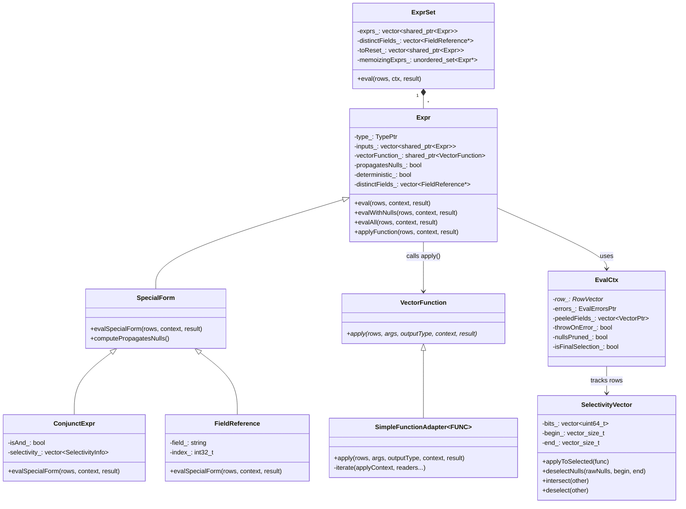
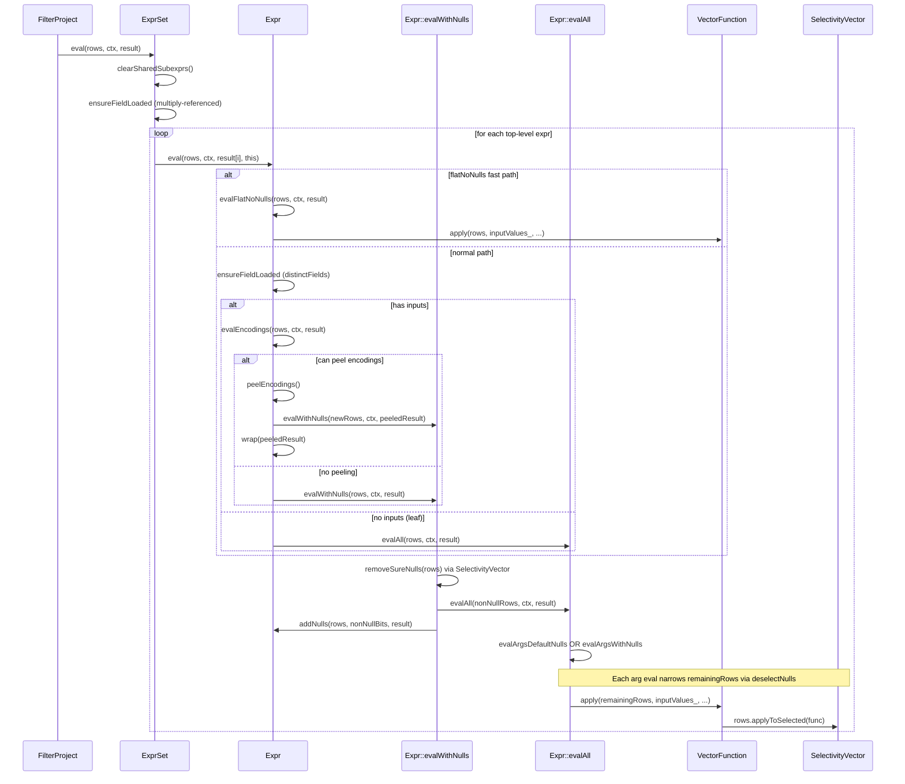

# Module Teardown: Vectorized Expression Evaluation

## Table of Contents

- [0. Research Focus](#0-research-focus)
- [1. High-Level Overview](#1-high-level-overview)
  - [Key Design Principle: "No JIT, No Row-at-a-Time"](#key-design-principle-no-jit-no-row-at-a-time)
- [2. Structural Architecture](#2-structural-architecture)
  - [Primary Source Files](#primary-source-files)
  - [Key Data Structures](#key-data-structures)
  - [Class Diagram (mermaid)](#class-diagram-mermaid)
- [3. Execution & Call Flow](#3-execution-call-flow)
  - [Sequence Diagram (mermaid)](#sequence-diagram-mermaid)
  - [Step-by-step Text Breakdown](#step-by-step-text-breakdown)
- [4. Concurrency & State Management](#4-concurrency-state-management)
  - [Threading Model](#threading-model)
  - [State Machine](#state-machine)
  - [Synchronization](#synchronization)
- [5. Memory & Resource Profile](#5-memory-resource-profile)
  - [Allocation Pattern](#allocation-pattern)
  - [Memory Tracking](#memory-tracking)
- [6. Key Design Insights](#6-key-design-insights)


## 0. Research Focus
* **Task ID:** 3.2
* **Focus:** Trace how a `PlanNode` expression (a `TypedExpr` tree) is compiled into an executable `Expr` tree. Because Velox does not JIT-compile, trace the interpreted vectorized loop inside `Expr::eval()`. Analyze how `SelectivityVector` is used to skip evaluating nulls or filtered rows across a batch.

## 1. High-Level Overview
* **Core Responsibility:** The Velox expression evaluation module compiles logical expression trees (`core::TypedExpr`) into executable `Expr` trees, then evaluates those trees over columnar batches using a pull-based, interpreted, vectorized execution model. Every function call operates on an entire column batch at once, gated by a `SelectivityVector` bitmask that tracks which rows are still "active" (not filtered, not null, not errored).
* **Key Triggers:** The entry point is the `FilterProject` operator calling `ExprSet::eval()` with a `SelectivityVector` representing the rows in the current batch. This in turn calls `Expr::eval()` on each top-level expression.

### Key Design Principle: "No JIT, No Row-at-a-Time"
Velox takes a fundamentally different approach from both Trino (which uses Airlift's bytecode-compiled expressions) and traditional row-at-a-time interpreters. Instead:
1. Expressions are compiled once from `TypedExpr` into an `Expr` tree (an interpreter tree, not bytecode).
2. At runtime, the tree is walked top-down per-expression, but each node operates on **all selected rows at once** (a columnar batch, typically 1024-10000 rows).
3. The `SelectivityVector` bitmask is the unifying mechanism that allows skipping nulls, short-circuiting AND/OR, and handling conditional (IF/SWITCH) evaluation without any row-level branching in the hot path.

## 2. Structural Architecture

### Primary Source Files
| File | Role |
|------|------|
| `velox/expression/ExprCompiler.h/.cpp` | Compiles `TypedExpr` tree into `Expr` tree with CSE dedup |
| `velox/expression/Expr.h/.cpp` | Core `Expr` class: `eval()`, `evalWithNulls()`, `evalAll()`, encoding peeling, memoization |
| `velox/expression/EvalCtx.h/.cpp` | Per-batch evaluation context: holds input row, error state, peeled encodings |
| `velox/expression/VectorFunction.h` | `VectorFunction::apply()` interface for batch-level UDFs |
| `velox/expression/SimpleFunctionAdapter.h` | Adapts row-level "simple" UDFs into `VectorFunction` with vectorized loop |
| `velox/expression/ConjunctExpr.h/.cpp` | AND/OR special form with short-circuit + adaptive reordering |
| `velox/expression/FieldReference.h` | Column reference: reads from `EvalCtx::row()` |
| `velox/expression/PeeledEncoding.h/.cpp` | Dictionary/constant encoding peeling optimization |
| `velox/vector/SelectivityVector.h` | Bitmask tracking active rows across the batch |
| `velox/expression/FunctionMetadata.h` | `VectorFunctionMetadata` with `defaultNullBehavior` flag |
| `velox/functions/prestosql/Arithmetic.h` | Example simple function definitions (plus, minus, etc.) |

### Key Data Structures

| Structure | Description |
|-----------|-------------|
| `SelectivityVector` | Bitmask (`std::vector<uint64_t>`) with `begin_`/`end_` bounds. Tracks active rows. Provides `applyToSelected()` for vectorized iteration. |
| `EvalCtx` | Per-batch context holding the input `RowVector`, error tracking (`EvalErrors`), peeled encodings, flags like `throwOnError_`, `nullsPruned_`, `isFinalSelection_`. |
| `Expr` | Tree node: holds `type_`, `inputs_` (children), `vectorFunction_`, `vectorFunctionMetadata_`, `distinctFields_`, `propagatesNulls_`, `deterministic_`. |
| `ExprSet` | Container for top-level `Expr` trees. Manages shared sub-expression reset, dictionary memoization, and lazy loading. |
| `MutableRemainingRows` | Wrapper that lazily copies a `SelectivityVector` only when rows need to be removed (null/error deselection). Avoids copies on the common no-null path. |
| `VectorFunctionMetadata` | Carries `defaultNullBehavior` (null-in-null-out), `deterministic`, `supportsFlattening` flags. |
| `PeeledEncoding` | Stores a peeled dictionary/constant wrap with `wrap_` indices and `wrapNulls_`. Used to evaluate on distinct inner values, then re-wrap. |
| `EvalErrors` | Bitmask + optional `exception_ptr` vector for per-row error tracking. |

### Class Diagram (mermaid)


## 3. Execution & Call Flow

### Sequence Diagram (mermaid)


### Step-by-step Text Breakdown

#### Phase 1: Expression Compilation (`ExprCompiler.cpp`)

The compilation pipeline transforms `core::TypedExpr` trees (produced by the planner) into executable `exec::Expr` trees. Entry point:

```cpp
// ExprCompiler.h, line 28-32
std::vector<std::shared_ptr<Expr>> compileExpressions(
    const std::vector<core::TypedExprPtr>& sources,
    core::ExecCtx* execCtx,
    ExprSet* exprSet,
    bool enableConstantFolding = true);
```

**Step 1a: Create CompilerCtx and Scope.** The compiler creates a `CompilerCtx` carrying the query config, memory pool, flattening candidates, and CPU tracking candidates. A top-level `Scope` is created for CSE (common sub-expression) deduplication:

```cpp
// ExprCompiler.cpp, line 529-546
Scope scope({}, nullptr, exprSet);
CompilerCtx ctx{
    .queryCtx = execCtx->queryCtx(),
    .pool = execCtx->pool(),
    .enableConstantFolding = enableConstantFolding,
    .flatteningCandidates = collectFlatteningCandidates(sources),
    .cpuUsageTrackingCandidates = ...};
for (auto& source : sources) {
    exprs.push_back(compileExpression(source, &scope, ctx));
}
```

**Step 1b: Recursive compilation with CSE dedup.** Each `TypedExpr` is first checked against the `Scope::visited` map (an `ExprDedupMap` using `ITypedExprHasher`). If found, the existing `Expr` is returned and marked as `isMultiplyReferenced_`. Otherwise, compilation proceeds by `ExprKind`:

```cpp
// ExprCompiler.cpp, line 411-465
switch (expr->kind()) {
    case core::ExprKind::kCall:
        result = compileCall(expr, compiledInputs, trackCpuUsage, ctx);
        break;
    case core::ExprKind::kFieldAccess:
        result = std::make_shared<FieldReference>(...);
        break;
    case core::ExprKind::kConstant:
        result = std::make_shared<ConstantExpr>(...);
        break;
    case core::ExprKind::kCast:
        result = compileCast(...);
        break;
    // ...
}
result->computeMetadata();
scope->visited[expr.get()] = result;
```

**Step 1c: Function resolution for `kCall`.** The `compileCall` function tries three resolution paths in order:
1. **Special form registry** (AND, OR, IF/SWITCH, TRY, COALESCE, CAST) -- returns a `SpecialForm` subclass.
2. **Vector function registry** -- returns a stateful or stateless `VectorFunction` wrapped in `Expr`.
3. **Simple function registry** -- calls `simpleFunctionEntry->createFunction()->createVectorFunction()` which produces a `SimpleFunctionAdapter<FUNC>` (itself a `VectorFunction`).

```cpp
// ExprCompiler.cpp, line 295-306
if (auto functionWithMetadata = getVectorFunctionWithMetadata(...)) {
    return std::make_shared<Expr>(
        resultType, std::move(inputs),
        functionWithMetadata->first,   // shared_ptr<VectorFunction>
        functionWithMetadata->second,   // VectorFunctionMetadata
        call->name(), trackCpuUsage);
}
```

**Step 1d: Metadata computation.** After each `Expr` is constructed, `computeMetadata()` computes four critical properties:
- `deterministic_`: true if this node and all children are deterministic.
- `propagatesNulls_`: true if a null in any `distinctField_` makes this expr null (requires all null-propagating paths to cover all non-null-propagating paths).
- `distinctFields_`: the set of input column references in this subtree.
- `hasConditionals_`: whether any sub-expression is IF, AND, or OR (affects lazy loading strategy).

```cpp
// Expr.cpp, line 276-306 (propagatesNulls_ computation)
if (vectorFunction_ && !vectorFunctionMetadata_.defaultNullBehavior) {
    propagatesNulls_ = false;
} else {
    // null-propagating iff nonNullPropagating fields subset of nullPropagating
    std::unordered_set<FieldReference*> nullPropagating, nonNullPropagating;
    for (auto& input : inputs_) {
        if (input->propagatesNulls_) {
            nullPropagating.insert(input->distinctFields_...);
        } else {
            nonNullPropagating.insert(input->distinctFields_...);
        }
    }
    propagatesNulls_ = /* nonNullPropagating subset of nullPropagating */;
}
```

#### Phase 2: Expression Evaluation (`Expr::eval()`)

The evaluation entry point is `ExprSet::eval()`, called by `FilterProject::getOutput()`:

```cpp
// Expr.cpp, line 2209-2211
for (int32_t i = begin; i < end; ++i) {
    exprs_[i]->eval(rows, context, result[i], this);
}
```

**Step 2a: Fast path check.** `Expr::eval()` first checks if the "flat-no-nulls" fast path applies. This path is only used when: (a) all inputs are flat or constant with no nulls, (b) `throwOnError` is true, (c) the expression and all its children support it, and (d) the batch is small enough. When active, this skips encoding peeling, null checking, and error handling entirely:

```cpp
// Expr.cpp, line 817-823
if (supportsFlatNoNullsFastPath_ && context.throwOnError() &&
    context.inputFlatNoNulls() &&
    context.execCtx()->queryCtx()->queryConfig().exprEvalFlatNoNulls()) {
    evalFlatNoNulls(rows, context, result, parentExprSet);
    return;
}
```

**Step 2b: Lazy vector loading.** Before evaluating, `eval()` decides which lazy vectors to load. The key heuristic: if there are no conditionals (IF/AND/OR), or only one distinct field, all fields are loaded eagerly. If there are conditionals with multiple fields, loading is deferred to avoid loading columns for rows that won't need them:

```cpp
// Expr.cpp, line 866-883
if (!hasConditionals_ || distinctFields_.size() == 1 ||
    shouldEvaluateSharedSubexp(context) || ...) {
    for (auto* field : distinctFields_) {
        context.ensureFieldLoaded(field->index(context), rows);
    }
} else if (!propagatesNulls_ && !evaluatesArgumentsOnNonIncreasingSelection()) {
    for (const auto& field : multiplyReferencedFields_) {
        context.ensureFieldLoaded(field->index(context), rows);
    }
}
```

**Step 2c: Encoding peeling.** `evalEncodings()` attempts to peel off dictionary/constant wrappings from all input columns. If all inputs share a common dictionary layer, the expression is evaluated on the distinct inner values (which is typically much smaller), then the result is re-wrapped:

```cpp
// Expr.cpp, line 1097-1151
void Expr::evalEncodings(...) {
    if (deterministic_ && !skipFieldDependentOptimizations() && peelingEnabled) {
        // Check if all fields have non-flat (dictionary/constant) encoding
        if (!hasFlat) {
            withContextSaver([&](ContextSaver& saveContext) {
                auto peelResult = peelEncodings(context, saveContext, rows, ...);
                if (peelResult.newRows) {
                    if (peelResult.mayCache) {
                        evalWithMemo(*newRows, context, peeledResult);
                    } else {
                        evalWithNulls(*newRows, context, peeledResult);
                    }
                    wrappedResult = context.getPeeledEncoding()->wrap(...);
                }
            });
        }
    }
    evalWithNulls(rows, context, result);  // fallback
}
```

**Step 2d: Null pruning via `evalWithNulls()`.** This is where the first level of `SelectivityVector`-based null skipping happens. If the expression `propagatesNulls_` and any input column may have nulls, `removeSureNulls()` creates a narrowed `SelectivityVector` excluding rows with null inputs:

```cpp
// Expr.cpp, line 1197-1234
void Expr::evalWithNulls(const SelectivityVector& rows, EvalCtx& context, VectorPtr& result) {
    if (propagatesNulls_ && !skipFieldDependentOptimizations()) {
        if (mayHaveNulls) {
            LocalSelectivityVector nonNullHolder(context);
            if (removeSureNulls(rows, context, nonNullHolder)) {
                // Evaluate only non-null rows
                evalAll(*nonNullHolder.get(), context, result);
                // Add nulls back for the pruned rows
                addNulls(rows, rawNonNulls, context, result);
                return;
            }
        }
    }
    evalAll(rows, context, result);
}
```

The `removeSureNulls()` method uses bitwise AND on the `SelectivityVector` bits:
```cpp
// Expr.cpp, line 1153-1187
bool Expr::removeSureNulls(...) {
    for (auto* field : distinctFields_) {
        if (values->mayHaveNulls()) {
            LocalDecodedVector decoded(context, *values, rows);
            if (auto* rawNulls = decoded->nulls(&rows)) {
                if (!result) result = nullHolder.get(rows);
                auto bits = result->asMutableRange().bits();
                bits::andBits(bits, rawNulls, rows.begin(), rows.end());
            }
        }
    }
    // ...
}
```

**Step 2e: Argument evaluation with default-null behavior.** `evalAllImpl()` evaluates all child expressions and applies the function. The argument evaluation strategy depends on `defaultNullBehavior`:

For **default-null** functions (the common case -- null in any arg produces null out), `evalArgsDefaultNulls()` progressively narrows `MutableRemainingRows`:

```cpp
// Expr.cpp, line 370-443
template <typename EvalArg>
bool Expr::evalArgsDefaultNulls(MutableRemainingRows& rows, EvalArg evalArg, ...) {
    for (int32_t i = 0; i < inputs_.size(); ++i) {
        evalArg(i);  // evaluates inputs_[i] into inputValues_[i]
        if (arg->mayHaveNulls()) {
            decoded.get()->decode(*arg, rows.rows());
            flatNulls = decoded.get()->nulls(&rows.rows());
        }
        if (context.errors()) {
            // Bitwise: keep row if it has no null OR has an error
            // nullNoError = flatNulls[j] | errorNulls[j]
            // rowBits[j] &= nullNoError
        } else if (flatNulls) {
            rows.deselectNulls(flatNulls);  // AND with null bits
        }
        if (!rows.rows().hasSelections()) break;  // early exit
    }
}
```

The key insight: `MutableRemainingRows` lazily copies the `SelectivityVector` only on first mutation. The `deselectNulls()` call performs a word-level AND between the row bits and the null flags, efficiently clearing all null rows from the active set.

For **non-default-null** functions (e.g., `coalesce`, `if`), `evalArgsWithNulls()` keeps all rows but deselects only those with errors:

```cpp
// Expr.cpp, line 445-464
template <typename EvalArg>
bool Expr::evalArgsWithNulls(MutableRemainingRows& rows, EvalArg evalArg, ...) {
    for (int32_t i = 0; i < inputs_.size(); ++i) {
        evalArg(i);
        if (!rows.deselectErrors()) break;
    }
}
```

**Step 2f: Function application.** Finally, `applyFunction()` calls `VectorFunction::apply()`:

```cpp
// Expr.cpp, line 1672-1726
void Expr::applyFunction(const SelectivityVector& rows, EvalCtx& context, VectorPtr& result) {
    stats_.numProcessedVectors += 1;
    stats_.numProcessedRows += rows.countSelected();
    auto timer = cpuWallTimer(context);
    vectorFunction_->apply(rows, inputValues_, type(), context, result);
}
```

#### Phase 3: The Vectorized Inner Loop (`SimpleFunctionAdapter::iterate()`)

For "simple" (row-level) UDFs wrapped via `SimpleFunctionAdapter`, the vectorized loop is generated at compile time through C++ templates. The key method is `iterate()`:

```cpp
// SimpleFunctionAdapter.h, line 570-706
template <typename... TReader>
void iterate(ApplyContext& applyContext, TReader&... readers) const {
    // Compute callNullFree and allNotNull at batch level
    bool allNotNull = (!readers.mayHaveNulls() && ...);

    if constexpr (fastPathIteration) {
        // Pre-clear nulls for all active rows (optimistic: most rows non-null)
        auto* data = getRawData();
        auto writeResult = [&](auto row, bool notNull, auto out) {
            if (notNull) {
                data[row] = out;  // direct write to raw buffer
            } else {
                bits::setNull(nullBuffer, row);
            }
        };
        if (allNotNull) {
            applyContext.applyToSelectedNoThrow([&](auto row) {
                typename return_type_traits::NativeType out{};
                bool notNull;
                auto status = doApplyNotNull<0>(row, out, notNull, readers...);
                writeResult(row, notNull, out);
            });
        }
    }
}
```

The iteration goes through `applyContext.applyToSelectedNoThrow()`, which delegates to `EvalCtx::applyToSelectedNoThrow()`, which in turn calls `SelectivityVector::applyToSelected()`. This is the critical vectorized loop:

```cpp
// SelectivityVector.h, line 438-449
template <typename Callable>
inline void SelectivityVector::applyToSelected(Callable func) const {
    if (isAllSelected()) {
        const auto end = end_;
        for (vector_size_t row = begin_; row < end; ++row) {
            func(row);  // tight loop, compiler can vectorize/unroll
        }
    } else {
        bits::forEachSetBit(bits_.data(), begin_, end_, func);
    }
}
```

The `isAllSelected()` fast path produces a simple sequential loop that the compiler can auto-vectorize. The `forEachSetBit` path processes the bitmask word-by-word using `__builtin_ctzll` (count trailing zeros) to find set bits efficiently:

```cpp
// SelectivityVector.h (SelectivityIterator), line 415-428
inline bool next(vector_size_t& row) {
    while (current_ == 0) {
        if ((index_ + 1) * 64 >= end_) return false;
        current_ = bits_[++index_];
    }
    row = (index_ * 64) + __builtin_ctzll(current_);
    current_ &= current_ - 1;  // clear lowest set bit
    return true;
}
```

#### Phase 4: Short-Circuit Evaluation in ConjunctExpr (AND/OR)

The `ConjunctExpr` implements AND/OR with short-circuiting through progressively narrowing `activeRows`:

```cpp
// ConjunctExpr.cpp, line 93-178
void ConjunctExpr::evalSpecialForm(...) {
    // Initialize result: all-true for AND, all-false for OR
    if (isAnd_) {
        bits::orBits(values, rows.asRange().bits(), rows.begin(), rows.end());
    } else {
        bits::andWithNegatedBits(values, rows.asRange().bits(), ...);
    }

    LocalSelectivityVector activeRowsHolder(context, rows);
    auto activeRows = activeRowsHolder.get();
    for (int32_t i = 0; i < inputs_.size(); ++i) {
        // Evaluate input on active rows only
        inputs_[inputOrder_[i]]->eval(*activeRows, context, inputResult);
        // Update result and deselect decided rows
        updateResult(inputResult.get(), context, flatResult, activeRows);
        numActive = activeRows->countSelected();
        if (!numActive) break;  // all rows decided
    }
}
```

The `updateResult()` method operates at the word level (64 rows at a time) using bitwise operations:

```cpp
// ConjunctExpr.cpp, line 222-235
inline void updateAnd(uint64_t& resultValue, uint64_t& resultPresent,
                      uint64_t& active, uint64_t testValue, uint64_t testPresent) {
    auto testFalse = ~testValue & testPresent;        // definite false
    setFalseForOne(active, testFalse, resultValue);   // result &= ~(active & testFalse)
    setPresentForOne(active, testFalse, resultPresent); // mark as present
    auto resultTrue = resultValue & resultPresent;
    setNonPresentForOne(active, resultPresent & resultTrue & ~testPresent, resultPresent);
    active &= ~testFalse;  // deselect rows with definite false
}
```

Additionally, `ConjunctExpr` implements **adaptive reordering** of conjuncts based on runtime selectivity statistics. Each input tracks how many rows it drops and how long it takes. The `maybeReorderInputs()` method sorts inputs by `timeToDropValue()` (the cost to eliminate one row), placing the cheapest and most selective filters first.

## 4. Concurrency & State Management

### Threading Model
Expression evaluation in Velox is **single-threaded within a single Driver**. There is no shared mutable state between concurrent evaluations of the same expression across different drivers. Each `Driver` owns its own `ExprSet`, `EvalCtx`, and `SelectivityVector` instances.

The key thread-safety points:
- `VectorFunction` instances may be shared (stateless functions registered globally), but `apply()` is called with driver-local `EvalCtx` and result vectors.
- `SimpleFunctionAdapter` creates a per-expression `FUNC` instance (`fn_`), so any state in the UDF struct is expression-local.
- `ExprSet::toReset_` and `memoizingExprs_` are mutated only during `eval()` which runs single-threaded per driver.

### State Machine

The expression evaluation state machine for a single `Expr::eval()` call:

```
eval() entry
    |
    v
[FlatNoNulls?] --yes--> evalFlatNoNulls() --> applyFunction() --> DONE
    |no
    v
[has inputs?] --no--> evalAll() --> DONE
    |yes
    v
evalEncodings()
    |
    +--> [can peel?] --yes--> peelEncodings() --> evalWithNulls(newRows)
    |                                               --> wrap(result)
    |                                               --> DONE
    |no
    v
evalWithNulls()
    |
    +--> [propagatesNulls && mayHaveNulls?]
    |       |yes
    |       v
    |    removeSureNulls() --> evalAll(nonNullRows) --> addNulls() --> DONE
    |       |no
    |       v
    +-----> evalAll(rows)
                |
                +--> [isSpecialForm?] --yes--> evalSpecialFormWithStats() --> DONE
                |no
                v
            evalArgsDefaultNulls/evalArgsWithNulls
                |
                +-- for each arg: eval(remainingRows) --> deselectNulls
                |
                v
            [tryPeelArgs?] --yes--> applyFunctionWithPeeling()
                |no
                v
            applyFunction(remainingRows) --> addNulls(if changed) --> DONE
```

### Synchronization
Within a single expression evaluation:
- `ContextSaver` saves/restores `EvalCtx` state across encoding peeling boundaries. Uses RAII via `withContextSaver()`.
- `ScopedVarSetter` temporarily modifies `throwOnError_`, `nullsPruned_`, etc.
- `ScopedFinalSelectionSetter` manages `isFinalSelection_` and `finalSelection_` for conditional expressions.
- `LocalSelectivityVector` and `LocalDecodedVector` are RAII wrappers that pool and recycle these expensive objects via `ExecCtx`.

## 5. Memory & Resource Profile

### Allocation Pattern

**Vector pooling:** `EvalCtx::getVector()` and `releaseVector()` use `ExecCtx::vectorPool()` to recycle result vectors between batches. Similarly, `LocalSelectivityVector` and `LocalDecodedVector` use their own pools.

**Lazy allocation in `MutableRemainingRows`:** The key optimization for the common case (no nulls, no errors):
```cpp
// Expr.h, line 92-97
void ensureMutableRemainingRows() {
    if (mutableRows_ == nullptr) {
        mutableRows_ = mutableRowsHolder_.get(*rows_);  // copy only on first mutation
        rows_ = mutableRows_;
    }
}
```
This means that when all rows pass (the common case), no `SelectivityVector` copy is made at all.

**Result buffer reuse in SimpleFunctionAdapter:** For fixed-width, non-null-producing functions, the adapter can reuse an input argument's buffer for the result if the argument is singly-referenced:
```cpp
// SimpleFunctionAdapter.h, line 332-344
if constexpr (!FUNC::can_produce_null_output && ... && return_type_traits::isFixedWidth) {
    if (!reusableResult->get()) {
        if (auto* arg = findReusableArg<0>(args)) {
            reusableResult = arg;
            isResultReused = true;
        }
    }
}
```

### Memory Tracking

**Dictionary memoization:** `Expr::evalWithMemo()` caches results for dictionary-encoded inputs that share the same base vector across consecutive batches. This trades memory for computation:
- `baseOfDictionary_`: strong reference to base vector (held after 2+ repeats).
- `dictionaryCache_`: cached results, 1:1 with base vector positions.
- `cachedDictionaryIndices_`: `SelectivityVector` of which base positions have been computed.

**Shared sub-expression caching:** `Expr::evaluateSharedSubexpr()` maintains `sharedSubexprResults_`, a map from input vectors to cached `SharedResults` (a `SelectivityVector` of computed rows + the result vector). The cache is bounded by `maxSharedSubexprResultsCached` (from `QueryConfig`).

**Error tracking:** `EvalErrors` allocates an `AlignedBuffer<bool>` for error flags and lazily allocates a separate `AlignedBuffer<shared_ptr<exception_ptr>>` only when detailed error information is needed.

## 6. Key Design Insights

**1. SelectivityVector is the null/filter skip mechanism, not branch prediction.**
Unlike row-at-a-time engines where each function must check for nulls per-row, Velox removes null rows from the SelectivityVector *before* the function is called. The `defaultNullBehavior` flag in `VectorFunctionMetadata` (line 44, FunctionMetadata.h) determines whether the framework performs this null-pruning automatically. This means the vast majority of function implementations never need to check for nulls at all -- they receive only non-null rows.

**2. Two-level null pruning eliminates redundant work.**
The first level is `evalWithNulls()` -> `removeSureNulls()`, which prunes nulls *before* evaluating children. The second level is `evalArgsDefaultNulls()`, which prunes nulls *after* each child evaluates. This two-level approach handles both direct column nulls (first level) and computed nulls from sub-expressions (second level). The `skipFieldDependentOptimizations()` check (line 450, Expr.h) prevents redundant pruning when parent and child share the same fields.

**3. Encoding peeling is Velox's answer to dictionary-heavy workloads.**
When multiple inputs share a dictionary encoding (common after joins), `PeeledEncoding::peel()` strips the dictionary layer, evaluates on the distinct base values only, then re-wraps. For a dictionary with 10,000 rows but only 100 distinct values, this is a 100x computation reduction. The `evalWithMemo()` method extends this across batches by caching results for repeated base vectors.

**4. Word-level bitwise operations replace per-row branching.**
The `ConjunctExpr::updateResult()` method processes 64 rows at a time using bitwise AND/OR/NOT on raw `uint64_t` words. This is critical for AND/OR short-circuiting: rather than checking each row individually, it deactivates rows in bulk. Similarly, `SelectivityVector::deselectNulls()` uses `bits::andBits()` for word-level null removal.

**5. Adaptive filter reordering optimizes AND/OR at runtime.**
`ConjunctExpr` tracks per-input `SelectivityInfo` (selectivity + timing) and uses `maybeReorderInputs()` to dynamically sort conjuncts by `timeToDropValue()`. This is analogous to Trino's adaptive filter ordering in `PageProcessor`, but operates at the sub-expression level rather than the filter level.

**6. The "all-selected" fast path enables compiler auto-vectorization.**
`SelectivityVector::applyToSelected()` (line 438-449, SelectivityVector.h) checks `isAllSelected()` and, when true, emits a simple `for (row = begin_; row < end; ++row)` loop. The comment explicitly notes: "IMPORTANT: Do not remove this line. Without it the compiler would not be able to vectorize or unroll the loop." This tight loop is the innermost hot path for all expression evaluation.

**7. Contrast with Trino's JIT approach.**
Trino (via Airlift) compiles expressions into JVM bytecode that is then JIT-compiled by HotSpot/Graal. This gives Trino the advantage of eliminating virtual dispatch and enabling cross-function inlining at the CPU level. Velox compensates for the lack of JIT with: (a) compile-time template specialization in `SimpleFunctionAdapter` that generates specific code paths for each function signature, (b) the `FOLLY_ALWAYS_INLINE` / `INLINE_LAMBDA` hints that encourage the C++ compiler to inline the UDF `call()` method into the vectorized loop, and (c) the encoding peeling optimization that has no equivalent in Trino's row-level evaluation.

**8. Contrast with DataFusion's Arrow compute kernels.**
DataFusion evaluates expressions by calling Arrow compute kernels (`arrow::compute::add`, etc.) that operate on entire arrays. Velox's approach is similar in spirit (batch-level operations) but differs in two ways: (a) Velox uses `SelectivityVector` to skip rows within a batch without materializing a filtered array, while DataFusion typically creates new filtered arrays; (b) Velox's `SimpleFunctionAdapter` generates per-row loops over selected rows (with auto-vectorization), while Arrow compute kernels use explicit SIMD intrinsics. Velox's approach is more flexible for complex expressions with conditional evaluation, while Arrow's approach may be faster for simple arithmetic on dense arrays.

**9. The `MutableRemainingRows` pattern avoids allocation on the happy path.**
The `MutableRemainingRows` class (line 41-106, Expr.h) holds a const pointer to the original `SelectivityVector` and only allocates a mutable copy when `deselectNulls()` or `deselectErrors()` is first called. Since most batches have few or no nulls, this avoids a copy per argument per expression in the common case. The `hasChanged()` check at the end of `evalAllImpl()` (line 1525) determines whether nulls need to be written back to the result.
