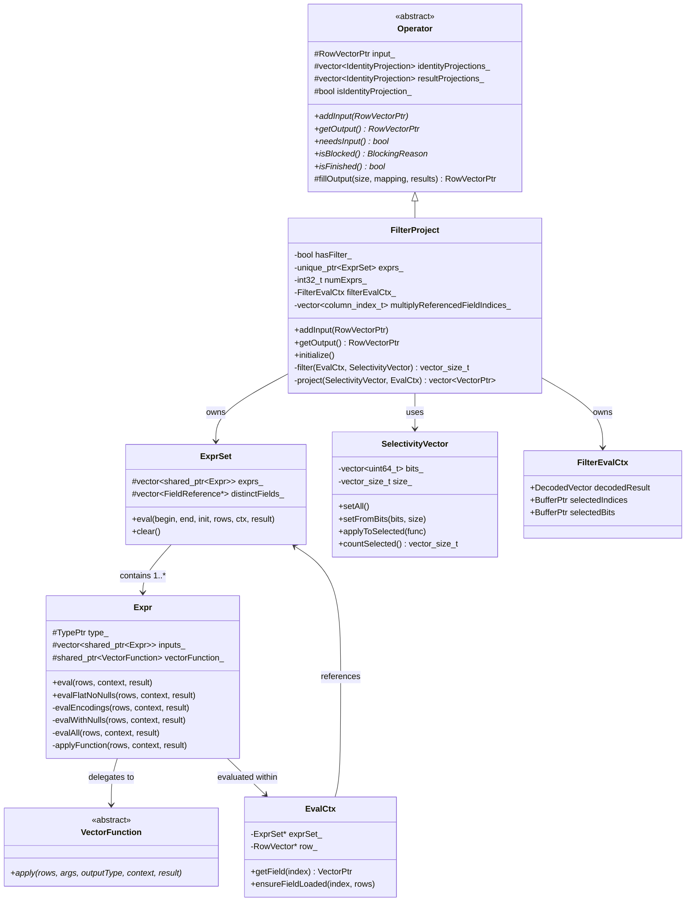

# Module Teardown: FilterProject -- Stateless Vectorized Filter & Project

## Table of Contents

- [0. Research Focus](#0-research-focus)
- [1. High-Level Overview](#1-high-level-overview)
- [2. Structural Architecture](#2-structural-architecture)
  - [Primary Source Files](#primary-source-files)
  - [Key Data Structures](#key-data-structures)
  - [Class Diagram (mermaid)](#class-diagram-mermaid)
- [3. Execution & Call Flow](#3-execution-call-flow)
  - [Sequence Diagram (mermaid)](#sequence-diagram-mermaid)
  - [Step-by-step Text Breakdown](#step-by-step-text-breakdown)
- [4. Concurrency & State Management](#4-concurrency-state-management)
  - [Threading Model](#threading-model)
  - [State Machine](#state-machine)
  - [Synchronization](#synchronization)
- [5. Memory & Resource Profile](#5-memory-resource-profile)
  - [Allocation Pattern](#allocation-pattern)
  - [Memory Tracking](#memory-tracking)
- [6. Key Design Insights](#6-key-design-insights)
  - [1. Filter-Project Fusion Eliminates Intermediate Materialization](#1-filter-project-fusion-eliminates-intermediate-materialization)
  - [2. SelectivityVector is the Fundamental Alternative to Row-by-Row Iteration](#2-selectivityvector-is-the-fundamental-alternative-to-row-by-row-iteration)
  - [3. Identity Projection Detection Avoids Unnecessary Computation](#3-identity-projection-detection-avoids-unnecessary-computation)
  - [4. Dictionary Wrapping is Zero-Copy Row Elimination](#4-dictionary-wrapping-is-zero-copy-row-elimination)
  - [5. Expression Evaluation Has Multiple Fast Paths](#5-expression-evaluation-has-multiple-fast-paths)
  - [6. The ExprSet Arrangement Enables Filter Short-Circuit for Projections](#6-the-exprset-arrangement-enables-filter-short-circuit-for-projections)
  - [7. Comparison with Trino's FilterAndProjectOperator](#7-comparison-with-trinos-filterandprojectoperator)
  - [8. Comparison with DataFusion's FilterExec and ProjectionExec](#8-comparison-with-datafusions-filterexec-and-projectionexec)


## 0. Research Focus
* **Task ID:** 3.3
* **Focus:** Trace the `addInput` and `getOutput` methods of the FilterProject operator. How does it apply the `Expr` evaluator to an incoming `RowVector` and produce an output `RowVector` without row-by-row iteration overhead?

## 1. High-Level Overview

* **Core Responsibility:** The `FilterProject` operator is Velox's unified operator for predicate filtering and column projection. It evaluates boolean filter expressions to select rows, and projection expressions to compute new columns, operating on entire columnar batches at a time rather than individual rows.

* **Key Triggers:**
  - The Driver loop calls `addInput(RowVectorPtr)` to supply a batch of rows.
  - The Driver then calls `getOutput()`, which evaluates the filter (if any), narrows the active row set, evaluates projections, and returns a new `RowVector` containing only the surviving rows with the projected columns.

* **Design Philosophy:** Velox fuses separate FilterNode and ProjectNode plan nodes into a single `FilterProject` operator at plan translation time. This avoids an intermediate materialization step between filter and project -- the filter produces a `SelectivityVector` bitmask that directly controls which rows the projections evaluate, saving both memory and CPU.

## 2. Structural Architecture

### Primary Source Files

| File | Role |
|------|------|
| `velox/exec/FilterProject.h` | Operator class declaration with filter/project state |
| `velox/exec/FilterProject.cpp` | Core implementation: `addInput`, `getOutput`, `filter`, `project`, `initialize` |
| `velox/exec/Operator.h` | Base class defining `Operator` contract (`addInput`/`getOutput`/`needsInput`/`isBlocked`/`isFinished`) |
| `velox/exec/Operator.cpp` | `fillOutput()` -- assembles the output RowVector from identity projections and expression results |
| `velox/exec/OperatorUtils.h/.cpp` | `processFilterResults()`, `projectChildren()`, `wrapChild()` utilities |
| `velox/expression/Expr.h` | `Expr` (individual expression node) and `ExprSet` (expression container) |
| `velox/expression/Expr.cpp` | `ExprSet::eval()`, `Expr::eval()` -- the vectorized expression evaluation engine |
| `velox/expression/EvalCtx.h` | `EvalCtx` -- evaluation context binding expressions to input row data |
| `velox/expression/VectorFunction.h` | `VectorFunction::apply()` -- the interface for vectorized function dispatch |
| `velox/exec/LocalPlanner.cpp` | Plan translation logic that fuses FilterNode + ProjectNode into one FilterProject |

### Key Data Structures

| Structure | Purpose |
|-----------|---------|
| `RowVectorPtr input_` | The current input batch (held between `addInput` and `getOutput`) |
| `ExprSet* exprs_` | Compiled expression set containing both filter and projection expressions |
| `bool hasFilter_` | Whether `exprs_[0]` is a filter expression |
| `int32_t numExprs_` | Total number of expressions (filter + projections) |
| `FilterEvalCtx filterEvalCtx_` | Reusable buffers for filter result processing (`selectedBits`, `selectedIndices`) |
| `std::vector<IdentityProjection> identityProjections_` | Columns copied directly from input to output (no expression needed) |
| `std::vector<IdentityProjection> resultProjections_` | Maps expression result indices to output column positions |
| `bool isIdentityProjection_` | True when all output columns are direct copies from input |
| `SelectivityVector` | A bitmask over row positions -- the fundamental unit of vectorized row selection |
| `EvalCtx` | Binds an `ExprSet`, the input `RowVector`, and an `ExecCtx` together for evaluation |
| `VectorFunction` | Abstract interface for vectorized function implementations that operate on whole batches |

### Class Diagram (mermaid)



## 3. Execution & Call Flow

### Sequence Diagram (mermaid)

```mermaid
sequenceDiagram
    participant D as Driver
    participant FP as FilterProject
    participant ES as ExprSet
    participant E as Expr
    participant VF as VectorFunction
    participant U as OperatorUtils

    D->>FP: addInput(RowVectorPtr)
    Note over FP: input_ = move(input)

    D->>FP: getOutput()
    Note over FP: SCOPE_EXIT { input_.reset() }

    FP->>FP: Create SelectivityVector(size), setAll()
    FP->>FP: Create EvalCtx(execCtx, exprs_, input_)

    alt Pre-load multiply-referenced lazy fields
        FP->>FP: evalCtx.ensureFieldLoaded(fieldIdx, rows)
    end

    alt No Filter (project-only)
        FP->>FP: project(rows, evalCtx)
        FP->>ES: eval(0, numExprs_, true, rows, evalCtx, results)
        loop For each expression i in [0, numExprs_)
            ES->>E: eval(rows, context, result[i])
            E->>E: evalEncodings / evalWithNulls / evalAll
            E->>VF: apply(rows, inputValues_, type, context, result)
        end
        FP->>FP: fillOutput(size, nullptr, results)
    else Has Filter
        FP->>FP: filter(evalCtx, allRows)
        FP->>ES: eval(0, 1, true, allRows, evalCtx, results)
        ES->>E: eval(allRows, context, result[0])
        E->>VF: apply(allRows, ...) → boolean vector
        FP->>U: processFilterResults(result, allRows, filterEvalCtx, pool)
        Note over U: Returns numOut; populates selectedBits + selectedIndices

        alt numOut == 0
            Note over FP: return nullptr (all rows filtered out)
        else numOut > 0
            alt Has projections (not identity)
                alt Not all rows selected
                    FP->>FP: rows.setFromBits(selectedBits, size)
                end
                FP->>FP: project(rows, evalCtx)
                FP->>ES: eval(1, numExprs_, false, rows, evalCtx, results)
                loop For each projection expression
                    ES->>E: eval(filteredRows, context, result[i])
                    E->>VF: apply(filteredRows, ...)
                end
            end
            FP->>FP: fillOutput(numOut, selectedIndices, results)
            Note over FP: Identity columns: wrapInDictionary(selectedIndices)
            Note over FP: Expression results: placed directly at output positions
        end
    end

    FP->>FP: loadReusedLazyVectors(output)
    FP-->>D: return output RowVectorPtr
```

### Step-by-step Text Breakdown

#### Phase 0: Initialization (`initialize()`)

Before any data flows, `initialize()` compiles the filter and projection expressions into a single `ExprSet`. This is where Velox's key fusion optimization happens.

```cpp
void FilterProject::initialize() {
  Operator::initialize();
  std::vector<core::TypedExprPtr> allExprs;
  if (hasFilter_) {
    allExprs.push_back(filter_->filter());   // filter is always exprs_[0]
  }
  if (project_) {
    const auto& inputType = project_->sources()[0]->outputType();
    for (column_index_t i = 0; i < project_->projections().size(); i++) {
      auto& projection = project_->projections()[i];
      bool identityProjection = checkAddIdentityProjection(
          projection, inputType, i, identityProjections_);
      if (!identityProjection) {
        allExprs.push_back(projection);
        resultProjections_.emplace_back(allExprs.size() - 1, i);
      }
    }
  }
  // ...
  exprs_ = makeExprSetFromFlag(std::move(allExprs), operatorCtx_->execCtx(), lazyDereference_);
```

Key points:
1. **Identity projection detection:** For each output column, `checkAddIdentityProjection()` checks whether the projection is a simple field reference (`SELECT col1`). If so, it records the input-to-output channel mapping in `identityProjections_` and avoids creating an expression for it. This means trivially projected columns are just pointer-copied (or dictionary-wrapped), never re-evaluated.
2. **Expression ordering:** The filter expression is always `exprs_[0]`. Projection expressions follow starting at index 1 (or 0 if there is no filter). This allows the `project()` method to skip the filter expression with `eval(hasFilter_ ? 1 : 0, numExprs_, ...)`.
3. **Multiply-referenced field tracking:** If a column is both an identity projection AND referenced by a filter/projection expression, it is added to `multiplyReferencedFieldIndices_`. These fields must be pre-loaded before evaluation to avoid partial lazy loading issues.

#### Phase 1: Input Acceptance (`addInput`)

```cpp
void FilterProject::addInput(RowVectorPtr input) {
  input_ = std::move(input);
}
```

This is trivially simple -- the operator just stores the input. It is a purely stateless operator: it holds at most one input batch at a time, processes it entirely in `getOutput()`, and clears it. The `needsInput()` method returns `!input_`, so the driver will not call `addInput` again until `getOutput` has consumed the current batch.

#### Phase 2: Output Production (`getOutput`) -- The Core

```cpp
RowVectorPtr FilterProject::getOutput() {
  if (!input_) {
    return nullptr;
  }
  SCOPE_EXIT {
    input_.reset();
  };
```

**Step 2a: Create evaluation context.** A `SelectivityVector` is initialized with all rows selected, and an `EvalCtx` binds the expression set to the input data.

```cpp
  vector_size_t size = input_->size();
  LocalSelectivityVector localRows(*operatorCtx_->execCtx(), size);
  auto* rows = localRows.get();
  rows->setAll();
  EvalCtx evalCtx(operatorCtx_->execCtx(), exprs_.get(), input_.get(), lazyDereference_);
```

The `SelectivityVector` is the critical abstraction that replaces row-by-row iteration. It is a compact bitmask (one bit per row) that can be efficiently AND-ed, OR-ed, and iterated over using bitwise operations. All subsequent expression evaluation receives this bitmask and only operates on the selected positions.

**Step 2b: Pre-load multiply-referenced lazy vectors.**

```cpp
  if (!lazyDereference_) {
    for (auto fieldIdx : multiplyReferencedFieldIndices_) {
      evalCtx.ensureFieldLoaded(fieldIdx, *rows);
    }
  }
```

This prevents a subtle bug: if column `c1` is both identity-projected and used in a filter expression like `f(c0) AND g(c1)`, the AND short-circuit might only load `c1` for rows where `f(c0)` is true. But the identity projection needs all rows for `c1`. Pre-loading ensures correctness.

**Step 2c: Project-only path (no filter).**

```cpp
  if (!hasFilter_) {
    VELOX_CHECK(!isIdentityProjection_);
    auto results = project(*rows, evalCtx);
    auto output = fillOutput(size, nullptr, results);
    loadReusedLazyVectors(output);
    return output;
  }
```

When there is no filter, all rows pass through. The `project()` method evaluates expressions on all rows. The `nullptr` mapping in `fillOutput` means identity columns are taken directly from input without dictionary wrapping.

**Step 2d: Filter evaluation.**

```cpp
  auto numOut = filter(evalCtx, *rows);
  if (numOut == 0) {
    input_ = nullptr;
    return nullptr;
  }
```

The `filter()` method is the heart of the vectorized filtering:

```cpp
vector_size_t FilterProject::filter(
    EvalCtx& evalCtx, const SelectivityVector& allRows) {
  std::vector<VectorPtr> results;
  exprs_->eval(0, 1, true, allRows, evalCtx, results);
  return processFilterResults(results[0], allRows, filterEvalCtx_, pool());
}
```

This evaluates only `exprs_[0]` (the filter expression) over all rows, producing a boolean vector. Then `processFilterResults()` converts that boolean vector into two compact representations:
- `selectedBits`: a bitmask where bit i is set if row i passed the filter
- `selectedIndices`: a dense array of passing row indices (e.g., `[0, 3, 5, 7]`)

The implementation of `processFilterResults` dispatches on encoding:

```cpp
// For flat boolean vectors (the common case):
vector_size_t processFlatFilterResults(...) {
  auto* selectedBits = filterEvalCtx.getRawSelectedBits(size, pool);
  auto* nonNullBits = filterResult->as<FlatVector<bool>>()->rawValues<uint64_t>();
  if (filterResult->mayHaveNulls()) {
    bits::andBits(selectedBits, nonNullBits, filterResult->rawNulls(), 0, size);
  } else {
    ::memcpy(selectedBits, nonNullBits, bits::nbytes(size));
  }
  // ...
  bits::forEachSetBit(selectedBits, 0, size,
      [&rawSelected, &passed](vector_size_t row) {
        rawSelected[passed++] = row;
      });
  return passed;
}
```

This operates on `uint64_t` words, processing 64 rows at a time with bitwise AND operations, not row-by-row boolean checks.

**Step 2e: Post-filter projection evaluation.**

```cpp
  const bool allRowsSelected = (numOut == size);
  std::vector<VectorPtr> results;
  if (!isIdentityProjection_) {
    if (!allRowsSelected) {
      rows->setFromBits(filterEvalCtx_.selectedBits->as<uint64_t>(), size);
    }
    results = project(*rows, evalCtx);
  }
```

The `rows` selectivity vector is narrowed to only the surviving rows. The `project()` method then evaluates projection expressions only on these rows:

```cpp
std::vector<VectorPtr> FilterProject::project(
    const SelectivityVector& rows, EvalCtx& evalCtx) {
  std::vector<VectorPtr> results;
  exprs_->eval(hasFilter_ ? 1 : 0, numExprs_, !hasFilter_, rows, evalCtx, results);
  return results;
}
```

Note the `begin` parameter: `hasFilter_ ? 1 : 0` skips expression 0 (the filter) when projecting. The `initialize` parameter is `!hasFilter_` -- when there is a filter, the ExprSet was already initialized during filter evaluation, so we pass `false` to avoid clearing shared subexpression caches.

**Step 2f: Output assembly.**

```cpp
  auto output = fillOutput(
      numOut,
      allRowsSelected ? nullptr : filterEvalCtx_.selectedIndices,
      results);
```

The `fillOutput()` method in the base `Operator` class assembles the final `RowVector`:

```cpp
RowVectorPtr Operator::fillOutput(
    vector_size_t size, const BufferPtr& mapping,
    const std::vector<VectorPtr>& results) {
  bool wrapResults = true;
  if (size == input_->size() && (!mapping || isSequence(mapping, 0, size))) {
    if (isIdentityProjection_) {
      return std::move(input_);  // Zero-copy passthrough
    }
    wrapResults = false;
  }

  std::vector<VectorPtr> projectedChildren(outputType_->size());
  projectChildren(projectedChildren, input_, identityProjections_, size,
                  wrapResults ? mapping : nullptr);
  projectChildren(projectedChildren, results, resultProjections_, size,
                  wrapResults ? mapping : nullptr);

  return std::make_shared<RowVector>(pool, outputType_, nullptr, size,
                                     std::move(projectedChildren));
}
```

When a filter has removed rows (`mapping != nullptr`), identity-projected columns are wrapped in a dictionary vector using the `selectedIndices` as the index buffer. This avoids copying the actual column data -- instead, the output vector contains a logical view (indices `[0, 3, 5, 7]` pointing into the original flat vector) that represents only the passing rows.

Expression result columns do NOT need dictionary wrapping because they were already evaluated only on the selected rows and are properly sized.

**Step 2g: Lazy vector safety.**

```cpp
  loadReusedLazyVectors(output);
```

If the same lazy vector appears in multiple output columns (e.g., `SELECT c1, c1`), this forces it to be loaded. Without this, pushdown hooks during lazy loading could corrupt shared state.

## 4. Concurrency & State Management

### Threading Model

The `FilterProject` operator executes within a single Driver thread. There is no internal concurrency. Each Driver instance has its own copy of the `FilterProject` operator, and the operator's state (`input_`, `filterEvalCtx_`, `exprs_`) is never shared across threads.

The only thread-safety mechanism is the `folly::Synchronized<OperatorStats>` used for statistics reporting, which is safely readable by the Task's stats aggregation thread.

### State Machine

FilterProject is essentially a two-state machine:

```
                addInput()
  [NEEDS_INPUT] ---------> [HAS_INPUT]
       ^                       |
       |      getOutput()      |
       +-----------------------+
       (output returned or nullptr)
```

- **NEEDS_INPUT:** `input_ == nullptr`, `needsInput()` returns true
- **HAS_INPUT:** `input_ != nullptr`, `needsInput()` returns false, `getOutput()` will process it
- **Terminal:** `noMoreInput_ == true && input_ == nullptr` causes `isFinished()` to return true

The operator is never blocked (`isBlocked` always returns `kNotBlocked`) and does not need draining (`startDrain` returns false).

### Synchronization

There is no synchronization needed within the operator itself because:
1. It is single-threaded per Driver instance.
2. It holds at most one input batch at a time.
3. Expression evaluation (`ExprSet::eval`) is not thread-safe and is designed for single-threaded invocation.

The `FilterEvalCtx` reuses `selectedBits` and `selectedIndices` buffers across batches to reduce allocation overhead. These are always overwritten before being read, so no synchronization is needed.

## 5. Memory & Resource Profile

### Allocation Pattern

| Resource | Lifecycle | Notes |
|----------|-----------|-------|
| `ExprSet* exprs_` | Operator lifetime | Compiled once in `initialize()`, reused across all batches |
| `FilterEvalCtx.selectedBits` | Reused across batches | Resized as needed via `getRawSelectedBits()`; capacity grows monotonically |
| `FilterEvalCtx.selectedIndices` | Reused across batches | Resized as needed via `getRawSelectedIndices()` |
| `SelectivityVector rows` | Per-`getOutput()` call | Stack-allocated via `LocalSelectivityVector` (pooled) |
| `EvalCtx` | Per-`getOutput()` call | Stack-allocated, references `input_` and `exprs_` |
| Expression result vectors | Per-`getOutput()` call | Allocated by expression evaluator, may reuse buffers across calls |
| Output `RowVector` | Per-`getOutput()` call | Assembled from identity projections (dictionary-wrapped) and expression results |

**Key memory efficiency strategies:**

1. **Dictionary wrapping instead of copying:** When a filter removes rows, identity-projected columns are not physically compacted. Instead, they are wrapped in a dictionary vector that references the original data through an index buffer. This means the output shares memory with the input.

2. **Lazy vector support:** Input columns can be `LazyVector` instances that defer I/O until actually needed. The filter expression may eliminate rows before a column is loaded, saving I/O bandwidth.

3. **Buffer reuse:** `FilterEvalCtx` reuses its internal buffers across batches. `LocalSelectivityVector` pulls from a thread-local pool.

4. **Zero-copy passthrough:** When all rows pass the filter and the projection is identity, `fillOutput` returns `std::move(input_)` directly.

### Memory Tracking

Memory is allocated through the operator's `pool()` (obtained from `operatorCtx_`), which is a child of the task-level memory pool. This integrates with Velox's memory arbitration system. The `ReclaimableSectionGuard` / `NonReclaimableSectionGuard` RAII guards in the base Operator class protect against concurrent memory reclamation during expression evaluation.

Since FilterProject does not support spilling (it is stateless), `canReclaim()` returns false. It never buffers data beyond the single current input batch.

## 6. Key Design Insights

### 1. Filter-Project Fusion Eliminates Intermediate Materialization

The local planner in `LocalPlanner.cpp` detects consecutive FilterNode + ProjectNode pairs and fuses them into a single FilterProject operator:

```cpp
// LocalPlanner.cpp, lines 486-496
if (auto filterNode = std::dynamic_pointer_cast<const core::FilterNode>(planNode)) {
  if (i < planNodes.size() - 1) {
    auto next = planNodes[i + 1];
    if (auto projectNode = std::dynamic_pointer_cast<const core::ProjectNode>(next)) {
      operators.push_back(
          std::make_unique<FilterProject>(id, ctx.get(), filterNode, projectNode));
      i++;  // skip the project node
      continue;
    }
  }
```

This is similar to Trino's `FilterAndProjectOperator` which combines a filter `PageProcessor` and a project `PageProcessor` into a single operator. However, Velox goes further: the filter and projections share a single `ExprSet`, allowing shared subexpression optimization across the filter and projection expressions.

DataFusion, by contrast, keeps `FilterExec` and `ProjectionExec` as separate operators in the physical plan, though it relies on its optimizer rules to push projections into scans and fuse adjacent projections.

### 2. SelectivityVector is the Fundamental Alternative to Row-by-Row Iteration

The entire vectorized execution model revolves around `SelectivityVector` -- a compact bitmask where each bit represents one row's active/inactive state. Instead of:

```
for each row:
    if filter(row):
        output.add(project(row))
```

Velox does:

```
selectedBits = filter.eval(allRows)          // vectorized boolean eval
projectionRows = SelectivityVector(selectedBits)
results = project.eval(projectionRows)       // only active rows evaluated
output = wrapInDictionary(selectedBits, input) + results
```

This has several advantages:
- **CPU vectorization:** Bitmask operations like `bits::andBits()` and `memcpy` operate on 64 bits (rows) at a time.
- **Branch elimination:** Functions receive the SelectivityVector and can use SIMD loops over contiguous selected ranges rather than per-row branches.
- **Lazy evaluation:** Expression nodes can skip entire subtrees for deselected rows, and conditional expressions (AND/OR) progressively narrow the selection without evaluating irrelevant branches.

### 3. Identity Projection Detection Avoids Unnecessary Computation

During `initialize()`, each projection is checked for being a simple field access:

```cpp
bool checkAddIdentityProjection(
    const core::TypedExprPtr& projection,
    const RowTypePtr& inputType,
    column_index_t outputChannel,
    std::vector<IdentityProjection>& identityProjections) {
  if (auto field = core::TypedExprs::asFieldAccess(projection)) {
    const auto& inputs = field->inputs();
    if (inputs.empty() || (inputs.size() == 1 &&
         dynamic_cast<const core::InputTypedExpr*>(inputs[0].get()))) {
      const auto inputChannel = inputType->getChildIdx(field->name());
      identityProjections.emplace_back(inputChannel, outputChannel);
      return true;
    }
  }
  return false;
}
```

A `SELECT a, b, a + b FROM t WHERE a > 10` query would result in:
- `identityProjections_ = [{0, 0}, {1, 1}]` (columns a, b are identity-projected)
- `resultProjections_ = [{1, 2}]` (the expression `a + b` is at exprs index 1, maps to output column 2)
- `exprs_ = [a > 10, a + b]` (only two expressions, not four)

This is a significant optimization because real-world queries often pass through many columns unchanged, especially in star-schema analytical workloads.

### 4. Dictionary Wrapping is Zero-Copy Row Elimination

When a filter removes rows, the output does NOT compact the data. Instead, the surviving row indices become a dictionary index buffer:

```cpp
// wrapChild in OperatorUtils.cpp
VectorPtr wrapChild(vector_size_t size, BufferPtr mapping,
    const VectorPtr& child, BufferPtr nulls) {
  if (!mapping) {
    return child;
  }
  return BaseVector::wrapInDictionary(nulls, mapping, size, child);
}
```

If 1000 rows enter and 300 pass the filter, the output identity columns are dictionary vectors of size 300, pointing into the original 1000-element flat vectors. The actual data bytes are never moved. This is a critical performance optimization:
- No memcpy of column data
- The dictionary indices (`selectedIndices`) are already computed by `processFilterResults`
- Downstream operators (especially HashProbe and Aggregation) can further compose dictionaries

This is conceptually similar to Apache Arrow's approach with validity bitmaps, but Velox's dictionary encoding is more general -- it supports arbitrary reordering, not just null masking.

### 5. Expression Evaluation Has Multiple Fast Paths

The `Expr::eval()` method chooses from several evaluation strategies based on input characteristics:

```cpp
void Expr::eval(const SelectivityVector& rows, EvalCtx& context,
    VectorPtr& result, const ExprSet* parentExprSet) {
  if (supportsFlatNoNullsFastPath_ && context.throwOnError() &&
      context.inputFlatNoNulls() &&
      context.execCtx()->queryCtx()->queryConfig().exprEvalFlatNoNulls()) {
    evalFlatNoNulls(rows, context, result, parentExprSet);  // Fast path
    return;
  }
  // ... standard path
```

The evaluation hierarchy is:
1. **`evalFlatNoNulls`:** Fastest path. All inputs are flat/constant, no nulls. Skips null propagation, encoding peeling, and null pruning. Directly calls `applyFunction()`.
2. **`evalEncodings`:** Peels dictionary/constant encodings from inputs, evaluates on the underlying base vectors, then re-wraps the result. Avoids redundant work on duplicate rows in dictionary-encoded data.
3. **`evalWithNulls`:** Removes "sure null" rows from the selectivity vector before evaluating, then adds nulls back to the result.
4. **`evalAll`:** General path. Evaluates all inputs, handles shared subexpressions, and calls `applyFunction()`.
5. **`applyFunction`:** Final dispatch to `VectorFunction::apply()`, which is the user-provided vectorized kernel.

### 6. The ExprSet Arrangement Enables Filter Short-Circuit for Projections

Because filter and projection expressions share a single `ExprSet`, and the filter is always evaluated first on all rows, the projection evaluation can reuse:
- Shared subexpression results computed during filter evaluation
- Lazy vectors that were already loaded for the filter
- The narrowed `SelectivityVector` from the filter, so projections skip filtered-out rows entirely

The `initialize` parameter in `ExprSet::eval()` controls this:
```cpp
// Filter call:
exprs_->eval(0, 1, true, allRows, evalCtx, results);
//                 ^^^^ initialize=true: clears shared subexpr caches

// Projection call:
exprs_->eval(hasFilter_ ? 1 : 0, numExprs_, !hasFilter_, rows, evalCtx, results);
//                                            ^^^^^^^^^^^ initialize=false when filter ran
```

### 7. Comparison with Trino's FilterAndProjectOperator

Trino's `FilterAndProjectOperator` (Java) has a structurally similar design:
- It fuses filter and project into one operator.
- It evaluates the filter to produce a `selectedPositions` array, then evaluates projections only on selected positions.
- It uses `PageProcessor` which evaluates expressions column-at-a-time.

Key differences:
- **Trino uses `int[]` selectedPositions**, while Velox uses a bitmask (`SelectivityVector`) that supports faster bulk operations. Velox's bitmask is more cache-friendly for high-selectivity filters.
- **Trino materializes output into new `Block` arrays** (via `BlockBuilder`), while Velox uses dictionary wrapping to avoid data copies. This gives Velox a significant advantage for wide tables where most columns are identity-projected.
- **Trino's expression evaluation is Java-based** with bytecode compilation (via `MethodHandle`), while Velox uses C++ templated vectorized functions with potential SIMD optimization.
- **Trino processes in configurable batch sizes** (e.g., 1024 positions at a time within a Page), while Velox processes the entire input batch at once with the SelectivityVector controlling which rows are active.

### 8. Comparison with DataFusion's FilterExec and ProjectionExec

DataFusion (Rust) keeps Filter and Projection as separate operators:
- `FilterExec` evaluates a predicate, produces a `BooleanArray`, and uses `filter_record_batch()` to physically compact the data.
- `ProjectionExec` evaluates projection expressions on the full RecordBatch.

Key differences from Velox:
- **No operator fusion:** DataFusion relies on optimizer rules (like `PushDownProjection`) rather than physical operator fusion. The intermediate RecordBatch between Filter and Projection is materialized.
- **Physical compaction vs. dictionary wrapping:** DataFusion's `filter_record_batch` uses Arrow's `take` kernel to physically compact arrays, while Velox uses zero-copy dictionary wrapping. Velox's approach is faster when selectivity is moderate to high, but dictionary-encoded data may cause cache misses in downstream operators if the indices are sparse.
- **Arrow columnar format:** DataFusion's expressions operate on Arrow arrays, leveraging Arrow's compute kernels. Velox has its own vector format optimized for expression evaluation (with encoding peeling, memoization, and lazy loading).
