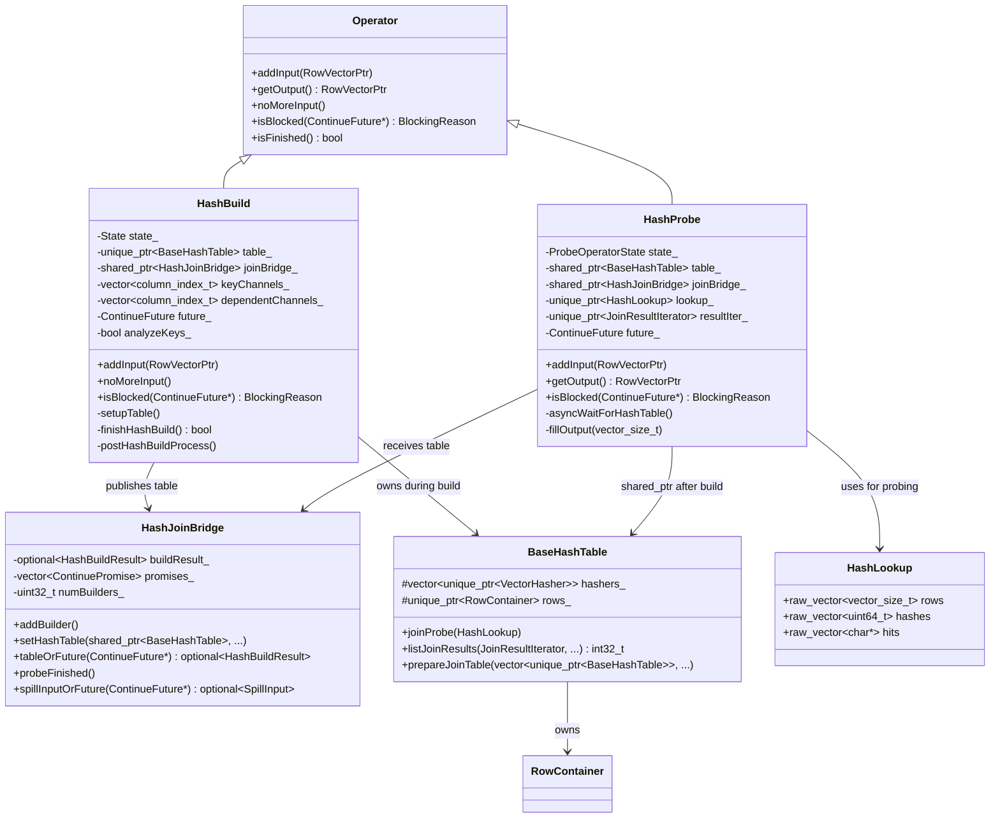
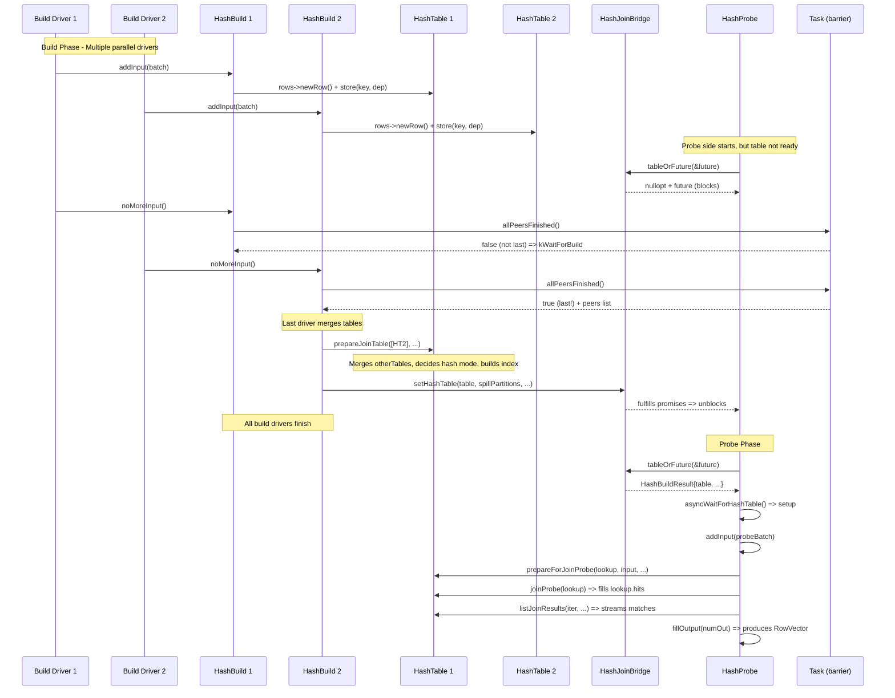

# Module Teardown: Hash Join Split Pipeline Execution (HashBuild / HashProbe)

## Table of Contents

- [0. Research Focus](#0-research-focus)
- [1. High-Level Overview](#1-high-level-overview)
- [2. Structural Architecture](#2-structural-architecture)
  - [Primary Source Files](#primary-source-files)
  - [Key Data Structures](#key-data-structures)
  - [Class Diagram (mermaid)](#class-diagram-mermaid)
- [3. Execution & Call Flow](#3-execution-call-flow)
  - [Sequence Diagram (mermaid)](#sequence-diagram-mermaid)
  - [Step-by-step Text Breakdown](#step-by-step-text-breakdown)
- [4. Concurrency & State Management](#4-concurrency-state-management)
  - [Threading Model](#threading-model)
  - [State Machine](#state-machine)
  - [Synchronization](#synchronization)
- [5. Memory & Resource Profile](#5-memory-resource-profile)
  - [Allocation Pattern](#allocation-pattern)
  - [Memory Tracking](#memory-tracking)
  - [Spill Architecture (Briefly)](#spill-architecture-briefly)
- [6. Key Design Insights](#6-key-design-insights)


## 0. Research Focus
* **Task ID:** 3.4
* **Focus:** Trace the split pipeline execution of Hash Join. How does `HashBuild` ingest vectors into the `HashTable`? How does `HashProbe` block until the build is complete, and then stream matches? How does the `HashJoinBridge` coordinate the two sides?

## 1. High-Level Overview
* **Core Responsibility:** Velox implements hash join as two cooperating operators that live in separate pipelines and are connected through a shared `HashJoinBridge`. `HashBuild` (the final operator in the build-side pipeline) ingests build-side row vectors into a `RowContainer` within a `HashTable`. `HashProbe` (an operator in the probe-side pipeline) blocks until the build side is complete, receives the hash table through the bridge, and then streams matching rows to downstream operators.
* **Key Triggers:**
  - `HashBuild::addInput()` -- called by the Driver loop whenever the build pipeline produces a new batch.
  - `HashBuild::noMoreInput()` -- called when the build-side source is exhausted; triggers the barrier and final table merge.
  - `HashProbe::isBlocked()` -- the Driver checks this before each `getOutput()` call; the probe operator uses this to asynchronously wait for the hash table via `HashJoinBridge::tableOrFuture()`.
  - `HashProbe::getOutput()` -- called by the Driver loop to produce output batches by probing the hash table with probe-side input.

## 2. Structural Architecture

### Primary Source Files
| File | Role |
|---|---|
| `velox/exec/HashBuild.h/.cpp` | Build-side operator: ingests vectors, stores rows in RowContainer, coordinates barrier for table merge |
| `velox/exec/HashProbe.h/.cpp` | Probe-side operator: blocks for table, probes for matches, streams output, handles spill restore |
| `velox/exec/HashJoinBridge.h/.cpp` | Shared coordination bridge between build and probe pipelines (table handoff, spill signaling) |
| `velox/exec/HashTable.h/.cpp` | The hash table data structure: tag-based open addressing with SIMD probing, supports kHash/kArray/kNormalizedKey modes |
| `velox/exec/RowContainer.h` | Columnar row storage backing the hash table; each row is a contiguous byte buffer with inline fixed-width + out-of-line variable-width data |
| `velox/exec/JoinBridge.h` | Base class providing mutex and promise/future plumbing |
| `velox/exec/ProbeOperatorState.h` | Enum defining the probe operator state machine |

### Key Data Structures

| Structure | Description |
|---|---|
| `HashTable<ignoreNullKeys>` | Templated hash table with tag-based probing (SSE2/NEON). Each slot is 8 bytes (pointer to row). Tags stored in a parallel array of 16-byte SIMD vectors. Supports three modes: `kHash` (generic), `kArray` (small cardinality dense), `kNormalizedKey` (concatenated value IDs). |
| `RowContainer` | Backing store for rows. Each row is a `char*` pointing to a fixed-size buffer. Keys stored first, then dependents. Variable-length data stored out-of-line via `HashStringAllocator`. |
| `HashLookup` | Input/output struct for probe operations. Contains `rows` (indices to probe), `hashes` (hash values), `hits` (result pointers), `newGroups` (for group probe). |
| `JoinResultIterator` | Stateful iterator that tracks position across multiple output batches for a single input batch. Fields: `lastRowIndex`, `nextHit` (for following duplicate chains). |
| `HashJoinBridge::HashBuildResult` | The build result struct containing the shared `BaseHashTable`, restored partition ID, spill partition IDs, and `hasNullKeys` flag. |
| `HashJoinBridge::SpillInput` | Contains a `SpillPartition` shard for a build operator to restore from spilled data. |

### Class Diagram (mermaid)



## 3. Execution & Call Flow

### Sequence Diagram (mermaid)



### Step-by-step Text Breakdown

#### Phase 1: HashBuild Construction and Initialization

Each build-side Driver instantiates a `HashBuild` operator. The constructor extracts key and dependent channel information from the `HashJoinNode`:

```cpp
// HashBuild constructor (HashBuild.cpp:51-120)
HashBuild::HashBuild(..., std::shared_ptr<const core::HashJoinNode> joinNode)
    : ...
      joinBridge_(operatorCtx_->task()->getHashJoinBridgeLocked(
          operatorCtx_->driverCtx()->splitGroupId, planNodeId())),
      ...
{
  joinBridge_->addBuilder();   // <-- Register with bridge

  for (int i = 0; i < numKeys; ++i) {
    auto channel = exprToChannel(key.get(), inputType);
    keyChannelMap_[channel] = i;
    keyChannels_.emplace_back(channel);
  }
  // Non-key columns become "dependentChannels_"
  for (auto i = 0; i < inputType->size(); ++i) {
    if (keyChannelMap_.find(i) == keyChannelMap_.end()) {
      dependentChannels_.emplace_back(i);
      decoders_.emplace_back(std::make_unique<DecodedVector>());
    }
  }
}
```

`initialize()` calls `setupTable()` which creates the `HashTable<ignoreNullKeys>` via `createForJoin()`:

```cpp
// HashBuild.cpp:219-286
void HashBuild::setupTable() {
  // Creates VectorHashers for each key column
  for (vector_size_t i = 0; i < numKeys; ++i) {
    keyHashers.emplace_back(VectorHasher::create(tableType_->childAt(i), keyChannels_[i]));
  }
  // Creates the HashTable -- template parameter ignoreNullKeys
  // varies by join type (false for right/full joins, true otherwise)
  table_ = HashTable<true>::createForJoin(
      std::move(keyHashers), dependentTypes,
      !dropDuplicates_, /*allowDuplicates*/
      needProbedFlag, hasProbedFlag, hasCountFlag,
      queryConfig.minTableRowsForParallelJoinBuild(),
      tableMemoryPool(), queryConfig.hashProbeBloomFilterMaxSize());
  analyzeKeys_ = table_->hashMode() != BaseHashTable::HashMode::kHash;
}
```

#### Phase 2: HashBuild::addInput() -- Row Ingestion

Each call to `addInput()` decodes key columns, filters null keys (for most join types), decodes dependent columns, and then writes rows into the `RowContainer` one at a time:

```cpp
// HashBuild.cpp:421-577
void HashBuild::addInput(RowVectorPtr input) {
  checkRunning();
  ensureInputFits(input);               // Memory reservation for spill

  activeRows_.resize(input->size());
  activeRows_.setAll();

  // Step 1: Decode keys through VectorHashers
  auto& hashers = table_->hashers();
  for (auto i = 0; i < hashers.size(); ++i) {
    auto key = input->childAt(hashers[i]->channel())->loadedVector();
    hashers[i]->decode(*key, activeRows_);
  }

  // Step 2: Deselect rows with null keys (for inner/left/semi joins)
  if (!isRightJoin(joinType_) && !isFullJoin(joinType_) && ...) {
    deselectRowsWithNulls(hashers, activeRows_);
  }

  // Step 3: Decode dependent (non-key) columns
  for (auto i = 0; i < dependentChannels_.size(); ++i) {
    decoders_[i]->decode(
        *input->childAt(dependentChannels_[i])->loadedVector(), activeRows_);
  }

  // Step 4: Spill if needed
  spillInput(input);

  // Step 5: For dedup mode (left semi/anti), do groupProbe to detect duplicates
  if (dropDuplicates_ && !abandonHashBuildDedup_) {
    table_->prepareForGroupProbe(*lookup_, input, activeRows_, ...);
    table_->groupProbe(*lookup_, ...);
    return;  // rows already inserted by groupProbe
  }

  // Step 6: Analyze keys for value-ID based hash modes (kArray, kNormalizedKey)
  for (auto& hasher : hashers) {
    if (analyzeKeys_) {
      hasher->computeValueIds(activeRows_, hashes_);
      analyzeKeys_ = hasher->mayUseValueIds();
    }
  }

  // Step 7: Write rows into RowContainer
  auto rows = table_->rows();
  auto nextOffset = rows->nextOffset();
  activeRows_.applyToSelected([&](auto rowIndex) {
    char* newRow = rows->newRow();
    if (nextOffset) {
      *reinterpret_cast<char**>(newRow + nextOffset) = nullptr;  // null next-pointer
    }
    // Store keys
    for (auto i = 0; i < hashers.size(); ++i) {
      rows->store(hashers[i]->decodedVector(), rowIndex, newRow, i);
    }
    // Store dependents
    for (auto i = 0; i < dependentChannels_.size(); ++i) {
      rows->store(*decoders_[i], rowIndex, newRow, i + hashers.size());
    }
  });
}
```

Key detail: rows are stored one at a time via `RowContainer::newRow()` which allocates from pre-reserved pages. Each row is a flat byte array. Keys come first in table column order (not input order), followed by dependent columns. This column layout within a row ensures good cache locality at probe time -- reading one string column primes the cache line for the next.

#### Phase 3: Build Barrier and Table Merge (finishHashBuild)

When the build source is exhausted, `noMoreInput()` calls `finishHashBuild()`. This is where the multi-driver barrier lives:

```cpp
// HashBuild.cpp:798-962
bool HashBuild::finishHashBuild() {
  pool()->release();  // Release unused reservation

  std::vector<ContinuePromise> promises;
  std::vector<std::shared_ptr<Driver>> peers;

  // Barrier: the last Driver to arrive becomes the merger
  if (!operatorCtx_->task()->allPeersFinished(
          planNodeId(), operatorCtx_->driver(), &future_, promises, peers)) {
    setState(State::kWaitForBuild);  // Not last -- wait
    return false;
  }

  // === WE ARE THE LAST DRIVER ===
  SCOPE_EXIT {
    peers.clear();
    for (auto& promise : promises) { promise.setValue(); }  // Wake up peers
  };

  // Gather tables from all peer drivers
  std::vector<std::unique_ptr<BaseHashTable>> otherTables;
  for (auto* build : otherBuilds) {
    std::lock_guard<std::mutex> l(build->mutex_);
    build->stateCleared_ = true;
    otherTables.push_back(std::move(build->table_));
    // Also collect spiller state
  }

  // Reserve memory for the merged hash table index
  ensureTableFits(numRows);

  // Build the unified hash table index
  table_->prepareJoinTable(
      std::move(otherTables),
      isInputFromSpill() ? spillConfig()->startPartitionBit : -1,
      vectorHasherMaxNumDistinct_, dropDuplicates_,
      allowParallelJoinBuild ? executor : nullptr);

  // Transfer ownership to the bridge
  std::shared_ptr<BaseHashTable> table = std::move(table_);
  joinBridge_->setHashTable(table, std::move(spillPartitions),
                            joinHasNullKeys_, std::move(tableSpillFunc));
  return true;
}
```

`prepareJoinTable()` inside `HashTable` performs the critical merge:

1. Takes ownership of all `otherTables_` (their RowContainers become sub-tables).
2. Merges VectorHasher statistics from all tables.
3. Decides the final hash mode (`kHash`, `kArray`, or `kNormalizedKey`).
4. Allocates the tag array and hash table slots.
5. Inserts all rows from all RowContainers into the unified index (potentially in parallel using `buildExecutor_`).

#### Phase 4: HashJoinBridge -- Handoff

`HashJoinBridge::setHashTable()` stores the build result and fulfills all waiting promises:

```cpp
// HashJoinBridge.cpp:218-245
void HashJoinBridge::setHashTable(
    std::shared_ptr<BaseHashTable> table, SpillPartitionSet spillPartitionSet,
    bool hasNullKeys, HashJoinTableSpillFunc&& tableSpillFunc) {
  std::vector<ContinuePromise> promises;
  {
    std::lock_guard<std::mutex> l(mutex_);
    buildResult_ = HashBuildResult(
        std::move(table), std::move(restoringSpillPartitionId_),
        spillPartitionIdSet, hasNullKeys);
    promises = std::move(promises_);  // Collect all waiting probe promises
  }
  notify(std::move(promises));  // Fulfill them -- unblocks probe Drivers
}
```

On the probe side, `HashJoinBridge::tableOrFuture()` either returns the result immediately (if build is done) or sets a future:

```cpp
// HashJoinBridge.cpp:301-318
std::optional<HashBuildResult> HashJoinBridge::tableOrFuture(ContinueFuture* future) {
  std::lock_guard<std::mutex> l(mutex_);
  probeStarted_ = true;
  if (buildResult_.has_value()) {
    return buildResult_.value();    // Ready!
  }
  promises_.emplace_back("HashJoinBridge::tableOrFuture");
  *future = promises_.back().getSemiFuture();
  return std::nullopt;              // Not ready, blocks via future
}
```

#### Phase 5: HashProbe -- Blocking and Table Acquisition

`HashProbe` starts in `ProbeOperatorState::kWaitForBuild`. The Driver calls `isBlocked()` on every iteration:

```cpp
// HashProbe.cpp:650-682
BlockingReason HashProbe::isBlocked(ContinueFuture* future) {
  switch (state_) {
    case ProbeOperatorState::kWaitForBuild:
      if (!future_.valid()) {
        setRunning();
        asyncWaitForHashTable();  // Try to get the table
      }
      break;
    case ProbeOperatorState::kRunning:
      // May read spill input
      break;
    case ProbeOperatorState::kWaitForPeers:
      if (!future_.valid()) { setRunning(); }
      break;
    case ProbeOperatorState::kFinish:
      break;
  }
  if (future_.valid()) {
    *future = std::move(future_);  // Pass future to Driver for async wait
  }
  return fromStateToBlockingReason(state_);
}
```

`asyncWaitForHashTable()` does the real work of acquiring the table and setting up the probe:

```cpp
// HashProbe.cpp:433-503
void HashProbe::asyncWaitForHashTable() {
  auto hashBuildResult = joinBridge_->tableOrFuture(&future_);
  if (!hashBuildResult.has_value()) {
    setState(ProbeOperatorState::kWaitForBuild);  // Block
    return;
  }

  // Table is ready -- set up probe state
  table_ = std::move(hashBuildResult->table);
  initializeResultIter();

  maybeSetupSpillInputReader(hashBuildResult->restoredPartitionId);
  maybeSetupInputSpiller(hashBuildResult->spillPartitionIds);

  if (table_->numDistinct() == 0 && skipProbeOnEmptyBuild()) {
    // Short-circuit for inner/semi joins with empty build
    noMoreInput();
    return;
  }

  // Push down dynamic filters (bloom filter, range) if applicable
  if (... && table_->hashMode() != BaseHashTable::HashMode::kHash) {
    pushdownDynamicFilters();
  }
}
```

#### Phase 6: HashProbe::addInput() -- Probe Execution

When probe input arrives, `addInput()` decodes keys, computes hashes, and performs the join probe:

```cpp
// HashProbe.cpp:700-801
void HashProbe::addInput(RowVectorPtr input) {
  input_ = std::move(input);

  // Step 1: Decode and detect non-null keys
  decodeAndDetectNonNullKeys();  // Populates nonNullInputRows_
  activeRows_ = nonNullInputRows_;

  // Step 2: Prepare hashes or value IDs
  table_->prepareForJoinProbe(*lookup_.get(), input_, activeRows_, false);

  // Step 3: Execute probe
  if (joinIncludesMissesFromLeft(joinType_)) {
    auto& hits = lookup_->hits;
    hits.resize(numInput);
    std::fill(hits.data(), hits.data() + numInput, nullptr);
    if (!lookup_->rows.empty()) {
      table_->joinProbe(*lookup_);  // <-- THE PROBE
    }
    // Include ALL rows for left/full join output
    auto& rows = lookup_->rows;
    rows.resize(numInput);
    std::iota(rows.begin(), rows.end(), 0);
  } else {
    lookup_->hits.resize(lookup_->rows.back() + 1);
    table_->joinProbe(*lookup_);  // <-- THE PROBE
  }

  // Step 4: Initialize iterator for streaming results
  resultIter_->reset(*lookup_);
}
```

The actual probe in `HashTable::joinProbe()` uses a 4-way interleaved probe pattern for CPU pipeline efficiency:

```cpp
// HashTable.cpp:611-653
template <bool ignoreNullKeys>
void HashTable<ignoreNullKeys>::joinProbe(HashLookup& lookup) {
  if (hashMode_ == HashMode::kArray) {
    arrayJoinProbe(lookup);  // Direct array lookup (SIMD gather)
    return;
  }
  if (hashMode_ == HashMode::kNormalizedKey) {
    joinNormalizedKeyProbe(lookup);
    return;
  }
  // Generic hash mode: 4-way interleaved probing
  ProbeState state1, state2, state3, state4;
  for (; probeIndex + 4 <= numProbes; probeIndex += 4) {
    state1.preProbe(*this, lookup.hashes[rows[probeIndex]], rows[probeIndex]);
    state2.preProbe(*this, lookup.hashes[rows[probeIndex+1]], rows[probeIndex+1]);
    state3.preProbe(*this, lookup.hashes[rows[probeIndex+2]], rows[probeIndex+2]);
    state4.preProbe(*this, lookup.hashes[rows[probeIndex+3]], rows[probeIndex+3]);
    state1.firstProbe(*this, 0);
    state2.firstProbe(*this, 0);
    state3.firstProbe(*this, 0);
    state4.firstProbe(*this, 0);
    fullProbe<true>(lookup, state1, false);
    fullProbe<true>(lookup, state2, false);
    fullProbe<true>(lookup, state3, false);
    fullProbe<true>(lookup, state4, false);
  }
  // Handle remaining rows
}
```

Each `ProbeState` stores the tag being searched and the slot position. `preProbe` computes the tag and initial slot. `firstProbe` loads the SIMD tag vector and finds matches. `fullProbe` follows the chain of rows at matching slots, comparing full keys for equality.

#### Phase 7: HashProbe::getOutput() -- Streaming Results

`getOutput()` is called repeatedly by the Driver. It uses `listJoinResults()` to stream matching rows in batches:

```cpp
// HashProbe.cpp:1054-1249 (simplified)
RowVectorPtr HashProbe::getOutputInternal(bool toSpillOutput) {
  // ... setup outputRowMapping_ and outputTableRows_ buffers ...

  for (;;) {
    int numOut = 0;
    if (emptyBuildSide) {
      // LEFT/FULL/ANTI: return all probe rows with null build columns
      std::iota(mapping.begin(), mapping.begin() + inputSize, 0);
      std::fill(outputTableRows, outputTableRows + inputSize, nullptr);
      numOut = inputSize;
    } else if (isAntiJoin(joinType_) && !filter_) {
      // Return non-matching rows
    } else {
      // THE MAIN PATH: stream join matches
      numOut = table_->listJoinResults(
          *resultIter_,
          joinIncludesMissesFromLeft(joinType_),
          folly::Range(mapping.data(), outputBatchSize),
          folly::Range(outputTableRows, outputBatchSize),
          preferredOutputBatchBytes);
    }

    if (!numOut && !noMatchDetector_.hasLastMissedRow()) {
      input_ = nullptr;  // Done with this input batch
      break;
    }

    // Apply filter if present, then produce output
    fillOutput(numOut);
    return output_;
  }
}
```

`listJoinResults()` is the heart of result streaming. It walks `lookup.hits` and follows duplicate chains:

```cpp
// HashTable.cpp:2069-2131
int32_t HashTable<ignoreNullKeys>::listJoinResults(
    JoinResultIterator& iter, bool includeMisses,
    folly::Range<vector_size_t*> inputRows,
    folly::Range<char**> hits, uint64_t maxBytes) {
  size_t numOut = 0;
  while (iter.lastRowIndex < iter.rows->size()) {
    if (!iter.nextHit) {
      // Start a new input row
      iter.nextHit = (*iter.hits)[row];
      if (!iter.nextHit) {
        ++iter.lastRowIndex;
        if (includeMisses) {
          inputRows[numOut] = row;  // LEFT join: emit with null hit
          hits[numOut] = nullptr;
          ++numOut;
        }
        continue;
      }
    }
    // Walk the chain of duplicate matches for this key
    while (iter.nextHit) {
      char* next = nextRow(iter.nextHit);  // Follow linked-list
      inputRows[numOut] = (*iter.rows)[iter.lastRowIndex];
      hits[numOut] = iter.nextHit;
      ++numOut;
      iter.nextHit = next;
      if (!iter.nextHit) { ++iter.lastRowIndex; }
      if (numOut >= maxOut || totalBytes >= maxBytes) { return numOut; }
    }
  }
  return numOut;
}
```

Key detail: duplicate build-side rows with the same key are linked via a "next" pointer at `nextOffset_` within each row. `listJoinResults` follows this chain, allowing one probe-side row to match multiple build-side rows across output batches.

## 4. Concurrency & State Management

### Threading Model

Velox hash join uses **pipeline-level parallelism** through multiple Drivers:

- **Build side:** N parallel Drivers each run their own `HashBuild` operator instance. Each has its own `HashTable` with its own `RowContainer`. They accumulate rows independently (no cross-driver synchronization during ingestion). Only at the end is there a barrier + merge.

- **Probe side:** M parallel Drivers each run their own `HashProbe` operator instance. All share the same `BaseHashTable` (via `shared_ptr`). Probing is read-only and naturally safe for concurrent access. The only synchronization point is the "last prober" barrier for build-side output in right/full joins and spill restore signaling.

- **Cross-pipeline:** The `HashJoinBridge` is the sole communication channel. It uses a mutex-protected state machine with promise/future-based async signaling.

### State Machine

**HashBuild States:**
```
kRunning  --(noMoreInput, not last driver)-->  kWaitForBuild
kRunning  --(noMoreInput, last driver, no spill)-->  kFinish
kRunning  --(noMoreInput, last driver, spill)-->  kWaitForProbe
kWaitForBuild  --(peers done)-->  kRunning  (then continues to postHashBuildProcess)
kWaitForProbe  --(probe finished)-->  kRunning  (then restores spill partition)
kYield  -->  kRunning  (voluntary yield during spill restore)
```

**HashProbe States (from ProbeOperatorState.h):**
```
kWaitForBuild  --(table received)-->  kRunning
kRunning  --(all probe input done, need peer sync)-->  kWaitForPeers
kRunning  --(all done, no spill)-->  kFinish
kWaitForPeers  --(peers done, more spill data)-->  kWaitForBuild
kWaitForPeers  --(peers done, no more data)-->  kFinish
```

### Synchronization

1. **Build Barrier (`Task::allPeersFinished`):** Uses a counter + promise list per plan node. Each build driver increments the counter. The last one to arrive gets the list of peer Drivers and their promises. It performs the merge, then fulfills the promises to wake everyone up.

2. **Bridge Handoff (`HashJoinBridge::setHashTable` / `tableOrFuture`):** Protected by `mutex_`. Probe operators that arrive before the build is done get a future (backed by a promise stored in `promises_`). When `setHashTable` is called, all accumulated promises are fulfilled.

3. **Probe Peer Barrier:** Similar mechanism to the build barrier, using `Task::allPeersFinished` again. The last probe operator becomes `lastProber_` and handles build-side output for right/full joins and triggers spill restore.

4. **Internal State Mutex (`HashBuild::mutex_`):** Guards `table_` and `spiller_` against concurrent access during close vs. finishHashBuild. This is needed because a thread may try to close the operator while another is in the middle of the table merge.

## 5. Memory & Resource Profile

### Allocation Pattern

| Phase | Allocation | Strategy |
|---|---|---|
| Row ingestion | `RowContainer::newRow()` | Pre-allocated pages (64KB chunks). Each call returns a pointer into the current page. New pages allocated when current is full. |
| Variable-length data | `HashStringAllocator` | Inline for small strings (<= 12 bytes), out-of-line chain of header+payload blocks for larger. |
| Hash table index | `table_` (tag array + slot array) | Single contiguous allocation sized at `numDistinct / loadFactor`. Load factor is 0.7. Rehashed when growing. |
| Probe output | `outputRowMapping_`, `outputTableRows_` | Reusable buffers sized at `outputBatchSize_`. |
| Spill | Spill files on disk | Partitioned by hash bits. Each partition is a separate spill file. |

### Memory Tracking

- Each `HashBuild` operator has its own `MemoryPool` (tracked via Velox's hierarchical pool system).
- `ensureInputFits()` proactively checks if the next batch can fit. If not, it attempts to grow the reservation. If that triggers arbitration, the operator itself may be spilled.
- `ensureTableFits()` reserves memory before the final merge. The reservation is 1.1x the estimated table size to account for parallel build overhead.
- After the merge, `pool()->release()` returns unused reservation.
- The probe side calls `ensureOutputFits()` before each output batch to avoid OOM in the non-reclaimable probe loop.

### Spill Architecture (Briefly)

Velox's hash join supports **recursive spilling**:

1. During `addInput()`, if memory pressure triggers spilling, `HashBuildSpiller` partitions rows by hash bits and writes them to disk.
2. At probe time, probe-side rows matching spilled build partitions are also spilled to disk via `inputSpiller_`.
3. After the first probe pass, the bridge selects a spilled partition, shards it among build operators, and they restore it to build a new (smaller) hash table. The corresponding probe partition is also restored.
4. If the restored partition still does not fit, recursive spilling kicks in (deeper hash bit ranges), up to `maxSpillLevel`.

## 6. Key Design Insights

**1. Split Pipeline with Barrier-based Coordination**

Unlike Trino's `HashBuilderOperator` which collects data from a single pipeline into a shared state via `PartitionedOutputBuffer`, Velox gives each build-side Driver its own independent `HashTable`. The merge happens only once, at the barrier. This eliminates contention during the ingestion phase entirely -- no locks, no CAS operations, just straight-line writes per Driver.

```cpp
// The barrier: Task::allPeersFinished (Task.cpp:2249-2289)
if (++state.numRequested == numPeers) {
    peers = std::move(state.drivers);
    promises = std::move(state.allPeersFinishedPromises);
    barriers.erase(planNodeId);
    return true;  // Last driver -- do the merge
}
```

**2. Three-Mode Hash Table (kHash / kArray / kNormalizedKey)**

Velox dynamically selects the hash table representation during `addInput()` by analyzing keys via `VectorHasher::computeValueIds()`. If all keys fit in a small range, it uses `kArray` mode (direct indexing, no hashing). If keys can be packed into a 64-bit normalized key, it uses `kNormalizedKey` mode. Otherwise, it falls back to `kHash` mode with tag-based probing. The decision is made lazily by setting `analyzeKeys_ = false` when any key value exceeds the representable range. This adaptive approach is unique to Velox -- Trino and DataFusion always use generic hashing.

**3. SIMD-Accelerated Tag Probing**

The `kHash` mode uses a Swiss-table-inspired design with 7-bit tags stored in a parallel array. Tags are loaded as 16-byte SIMD vectors (`xsimd::batch<uint8_t>`) and compared in parallel:

```cpp
static TagVector loadTags(uint8_t* tags, int64_t tagIndex) {
    return TagVector(_mm_loadu_si128(reinterpret_cast<__m128i const*>(src)));
}
```

This enables checking 16 slots simultaneously per SIMD comparison, dramatically reducing probe cost for the common case where most probes match on the first group.

**4. 4-Way Interleaved Probing for ILP**

The `joinProbe` method processes 4 rows simultaneously through `preProbe`/`firstProbe`/`fullProbe` stages. This hides memory latency by interleaving cache-miss-heavy operations across independent rows:

```cpp
for (; probeIndex + 4 <= numProbes; probeIndex += 4) {
    state1.preProbe(*this, lookup.hashes[rows[probeIndex]], rows[probeIndex]);
    state2.preProbe(/* row+1 */);  state3.preProbe(/* row+2 */);  state4.preProbe(/* row+3 */);
    state1.firstProbe(*this, 0);   state2.firstProbe(*this, 0);
    state3.firstProbe(*this, 0);   state4.firstProbe(*this, 0);
    fullProbe<true>(lookup, state1, false); /* ... repeat for state2-4 */
}
```

This is a classic technique from high-performance hash table implementations. Neither Trino nor DataFusion employ this level of probe-level ILP.

**5. Duplicate-Chain Linked List for 1:N Joins**

Build-side rows with duplicate keys are linked via a "next" pointer embedded at `nextOffset_` within each row:

```cpp
// During addInput (HashBuild.cpp:558-559)
if (nextOffset) {
    *reinterpret_cast<char**>(newRow + nextOffset) = nullptr;
}
```

During `prepareJoinTable`, when a new row hashes to an occupied slot with matching keys, it is chained via this pointer. `listJoinResults` follows the chain to enumerate all matches. This avoids a separate overflow structure and keeps duplicates physically close in the RowContainer.

**6. Comparison with Trino and DataFusion**

| Aspect | Velox | Trino | DataFusion |
|---|---|---|---|
| Build coordination | Barrier in Task, last driver merges N independent tables | `PartitionedLookupSourceFactory`, builds feed into shared pages, lookup source assembled centrally | Single `HashJoinExec` per partition; build side collected via channels |
| Probe blocking | Promise/future via `HashJoinBridge::tableOrFuture()` | `ListenableFuture` from `LookupSourceProvider` | Tokio channel; probe future awaits `SharedHashJoinState` |
| Hash table structure | Tag-based (Swiss table), 3 modes (array/normalized/hash), SIMD probing | Open-addressing with linear probing in `PagesHash`, `ChannelIndex` for multi-key | `hashbrown::raw` (Rust Swiss table) or custom via Arrow `HashMap` |
| Duplicate handling | Linked list within RowContainer rows | Linked list via position lists | Arrow Array-based join with match indices |
| Spill | Recursive partition-based spilling, build+probe sides both spill | Hash-partitioned spill to temp storage | Partition-based spill via `ExternalSorter` |
| Parallel build | Per-driver independent tables merged at barrier; optional parallel index build within merge | Parallel page accumulation, single-threaded lookup source build | Single-threaded per partition |

**7. Dynamic Filter Pushdown**

After receiving the hash table, `HashProbe` can push range/bloom filters derived from the hash table's `VectorHasher` statistics down to upstream operators (e.g., table scans). This can eliminate entire input batches before they reach the join:

```cpp
// HashProbe.cpp:382-431
void HashProbe::pushdownDynamicFilters() {
    auto numFilters = driver->pushdownFilters(this, keyChannels_,
        [&](column_index_t sourceChannel, std::shared_ptr<common::Filter>& filter) {
            filter = hasher.getFilter(false);  // Range filter
            if (!filter) {
                filter = hasher.getBloomFilter();  // Bloom filter
            }
            return true;
        });
    // If single unique-key, no dependents, no filter => replace join entirely
    if (keyChannels_.size() == 1 && !table_->hasDuplicateKeys() && ...) {
        canReplaceWithDynamicFilter_ = true;
    }
}
```

This optimization is particularly powerful for star-schema joins where dimension tables are small. Trino has a similar feature (`DynamicFilter`), but DataFusion's implementation is less mature.

**8. Memory-Pressure-Aware Spilling with Operator Reclaim**

The `ensureInputFits()` method demonstrates Velox's cooperative memory management. Before processing each input batch, it checks whether enough memory is available and, if not, enters a `ReclaimableSectionGuard` to allow the memory arbitrator to reclaim memory from this very operator:

```cpp
// HashBuild.cpp:645-657
{
    Operator::ReclaimableSectionGuard guard(this);
    if (pool()->maybeReserve(targetIncrementBytes)) {
        if (spiller_->spillTriggered()) {
            pool()->release();  // We got spilled while reserving!
        }
        return;
    }
}
```

This bidirectional spill protocol (the operator can be spilled while trying to grow) is unique to Velox and enables graceful degradation under memory pressure without deadlocking.
