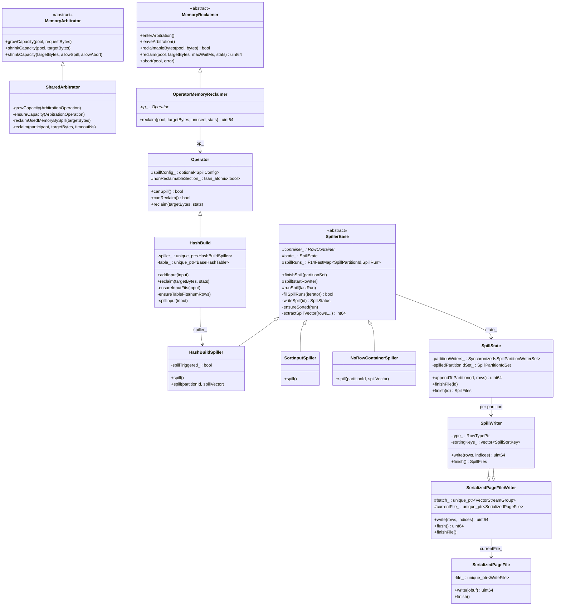
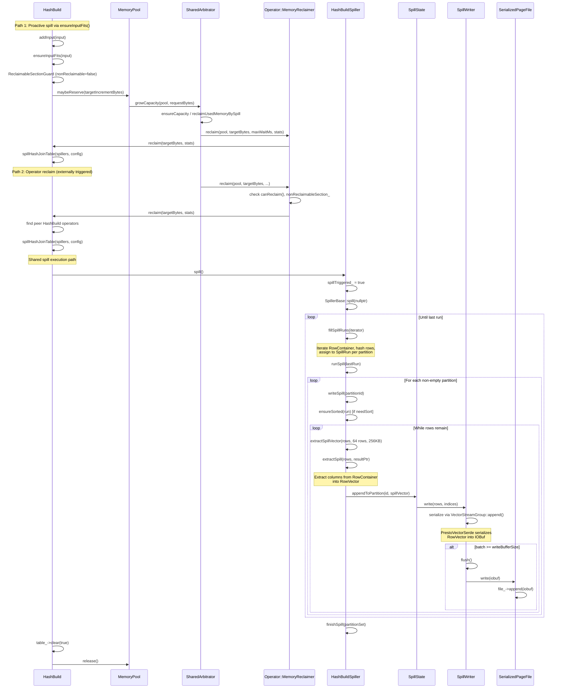

# Module Teardown: Disk Spilling Mechanism

## Table of Contents

- [0. Research Focus](#0-research-focus)
- [1. High-Level Overview](#1-high-level-overview)
- [2. Structural Architecture](#2-structural-architecture)
  - [Class Diagram (mermaid)](#class-diagram-mermaid)
- [3. Execution & Call Flow](#3-execution-call-flow)
  - [Sequence Diagram (mermaid)](#sequence-diagram-mermaid)
  - [Step-by-step Text Breakdown](#step-by-step-text-breakdown)
- [4. Concurrency & State Management](#4-concurrency-state-management)
  - [Threading Model](#threading-model)
  - [State Machine](#state-machine)
  - [Synchronization](#synchronization)
- [5. Memory & Resource Profile](#5-memory-resource-profile)
  - [Allocation Pattern](#allocation-pattern)
  - [Memory Tracking](#memory-tracking)
- [6. Key Design Insights](#6-key-design-insights)


## 0. Research Focus
* **Task ID:** 3.5
* **Focus:** Trace the triggering mechanism for spilling. When memory limits are reached, how does an operator serialize its state to disk using Velox's serialization format?

## 1. High-Level Overview
* **Core Responsibility:** Velox's disk spilling subsystem provides a safety valve that allows memory-intensive operators (hash join build, hash aggregation, order by, window, etc.) to offload intermediate data to disk when memory pressure is detected. This prevents out-of-memory failures by serializing in-memory state (RowContainer contents or RowVectors) into files using the Presto wire-protocol serialization format (PrestoSerializer), partitioned by hash value for efficient restore.
* **Key Triggers:**
  1. **Proactive reservation failure (operator-initiated):** During `addInput()`, operators like HashBuild call `ensureInputFits()` which attempts `pool()->maybeReserve()`. This memory reservation request flows to the MemoryArbitrator, which may reclaim memory from the requesting operator itself or other operators, triggering spill.
  2. **Arbitrator-initiated reclaim (external):** The SharedArbitrator detects system-wide memory pressure and calls `MemoryReclaimer::reclaim()` on operator memory pools, which routes to `Operator::reclaim()` and then to operator-specific spill logic (e.g., `HashBuild::reclaim()`).

## 2. Structural Architecture
* **Primary Source Files:**
  - `velox/exec/Spiller.h` / `Spiller.cpp` -- SpillerBase hierarchy: orchestrates row extraction, sorting, and writing
  - `velox/exec/Spill.h` / `Spill.cpp` -- SpillState, SpillPartition, SpillPartitionId, SpillMergeStream
  - `velox/exec/SpillFile.h` / `SpillFile.cpp` -- SpillWriter (extends SerializedPageFileWriter), SpillReadFile
  - `velox/exec/SpillStats.h` / `SpillStats.cpp` -- Thread-safe atomic spill statistics
  - `velox/exec/HashBuild.h` / `HashBuild.cpp` -- HashBuild operator with spill trigger logic, HashBuildSpiller
  - `velox/exec/HashJoinBridge.cpp` -- `spillHashJoinTable()` coordination across parallel build drivers
  - `velox/common/memory/MemoryArbitrator.h` -- MemoryArbitrator, MemoryReclaimer interfaces
  - `velox/common/memory/SharedArbitrator.h` / `.cpp` -- SharedArbitrator implementation
  - `velox/common/base/SpillConfig.h` -- SpillConfig struct
  - `velox/serializers/SerializedPageFile.h` / `.cpp` -- Generic serialized page file writer/reader
  - `velox/serializers/PrestoSerializer.h` -- PrestoVectorSerde used as the spill serialization format
  - `velox/exec/Operator.h` / `Operator.cpp` -- Operator base class, Operator::MemoryReclaimer

* **Key Data Structures:**

| Structure | Purpose |
|-----------|---------|
| `SpillerBase` | Abstract base class that orchestrates spilling from a RowContainer: fills SpillRuns, sorts if needed, writes to SpillState |
| `HashBuildSpiller` | Concrete spiller for hash join build side; handles probed-flag column for right joins |
| `SortInputSpiller` | Spiller for sort operators; requires sorted output |
| `NoRowContainerSpiller` | Spiller that accepts RowVectors directly (no RowContainer) |
| `SpillState` | Manages per-partition SpillWriter instances, tracks which partitions are spilled |
| `SpillWriter` | Extends `SerializedPageFileWriter`; writes RowVectors to spill files using PrestoSerializer |
| `SpillReadFile` | Extends `SerializedPageFileReader`; reads back spilled data |
| `SpillPartitionId` | Encoded hierarchical partition identifier supporting up to 4 recursive spill levels |
| `SpillPartition` | Groups spill files belonging to one partition; provides ordered/unordered readers |
| `SpillRun` | Collects row pointers from RowContainer for one partition before writing |
| `SpillConfig` | Configuration: file size limits, partition bits, max spill level, compression, executor |
| `HashBitRange` | Extracts a bit range from a 64-bit hash to determine partition assignment |
| `MemoryReclaimer` | Interface for memory pools to participate in arbitration and reclaim memory |
| `SharedArbitrator` | System-wide memory arbitrator that coordinates spill across queries |

### Class Diagram (mermaid)



## 3. Execution & Call Flow

### Sequence Diagram (mermaid)



### Step-by-step Text Breakdown

#### Phase A: Spill Trigger Detection

**A1. Proactive reservation in `HashBuild::ensureInputFits()`** (lines 579-665 of HashBuild.cpp)

When `HashBuild::addInput()` is called, the very first thing it does is call `ensureInputFits(input)`. This method estimates the incremental memory needed for the incoming batch:

```cpp
void HashBuild::ensureInputFits(RowVectorPtr& input) {
  if (!canSpill() || spiller_ == nullptr || spiller_->spillTriggered()) {
    return;  // Already spilling everything to disk, no reservation needed
  }
  // ...
  const auto minReservationBytes =
      currentUsage * spillConfig_->minSpillableReservationPct / 100;
  const auto tableIncrementBytes = table_->hashTableSizeIncrease(input->size());
  const int64_t flatBytes = input->estimateFlatSize();
  const auto incrementBytes = rowContainerIncrementBytes + tableIncrementBytes;
```

If existing reservations are insufficient, it attempts a larger reservation:

```cpp
  const auto targetIncrementBytes = std::max<int64_t>(
      incrementBytes * 2,
      currentUsage * spillConfig_->spillableReservationGrowthPct / 100);
  {
    Operator::ReclaimableSectionGuard guard(this);  // Mark as reclaimable
    if (pool()->maybeReserve(targetIncrementBytes)) {
      if (spiller_->spillTriggered()) {
        pool()->release();  // Spill was triggered on us during reservation
      }
      return;
    }
  }
```

The critical mechanism here: `ReclaimableSectionGuard` temporarily sets `nonReclaimableSection_ = false`, which means while the `maybeReserve()` call is blocking inside the arbitrator, the arbitrator can call back into this same operator's `reclaim()` method to free memory.

**A2. `HashBuild::ensureTableFits()`** (lines 964-1007)

After all input is received, the last HashBuild operator estimates the hash table size and reserves memory:

```cpp
  const uint64_t memoryBytesToReserve =
      table_->estimateHashTableSize(numRows) * 1.1;
  {
    Operator::ReclaimableSectionGuard guard(this);
    if (pool()->maybeReserve(memoryBytesToReserve)) {
      if (spiller_->spillTriggered()) {
        pool()->release();
      }
      return;
    }
  }
```

**A3. External reclaim via SharedArbitrator** (SharedArbitrator.cpp lines 1389-1419)

When the arbitrator determines it needs to free memory (either for the requesting pool or globally), it calls through the reclaimer chain:

```
SharedArbitrator::reclaim()
  -> ArbitrationParticipant::reclaim()
    -> MemoryPool::reclaim()
      -> MemoryReclaimer::reclaim()  [Operator::MemoryReclaimer]
        -> Operator::reclaim()       [HashBuild::reclaim()]
```

The `Operator::MemoryReclaimer::reclaim()` (Operator.cpp, line 727) performs several checks before delegating:
1. The driver must still be alive
2. `op_->canReclaim()` must return true
3. The driver must not be terminated
4. The task must have a pause requested
5. The operator must not be in `nonReclaimableSection_`

#### Phase B: Spill Execution in HashBuild::reclaim()

`HashBuild::reclaim()` (lines 1283-1377) coordinates spilling across all peer HashBuild operators in the same pipeline:

```cpp
void HashBuild::reclaim(uint64_t, memory::MemoryReclaimer::Stats& stats) {
  // ... validation checks ...
  const std::vector<Operator*> operators =
      task->findPeerOperators(operatorCtx_->driverCtx()->pipelineId, this);

  // Check ALL peer operators are in reclaimable state
  for (auto* op : operators) {
    HashBuild* buildOp = dynamic_cast<HashBuild*>(op);
    if (buildOp->nonReclaimableState()) {
      // Can't reclaim - one peer is in a non-reclaimable state
      return;
    }
  }

  // Collect all spillers
  std::vector<HashBuildSpiller*> spillers;
  for (auto* op : operators) {
    HashBuild* buildOp = static_cast<HashBuild*>(op);
    spillers.push_back(buildOp->spiller_.get());
  }

  spillHashJoinTable(spillers, config);

  // Clear tables and release memory
  for (auto* op : operators) {
    HashBuild* buildOp = static_cast<HashBuild*>(op);
    buildOp->table_->clear(true);
    buildOp->pool()->release();
  }
}
```

**Key insight:** All peer HashBuild operators in a pipeline are spilled together atomically. This is necessary because the hash table is built collectively by multiple drivers, and partial spilling would leave inconsistent state.

#### Phase C: SpillerBase::spill() -- The Spill Loop

`HashBuildSpiller::spill()` sets `spillTriggered_ = true` and delegates to `SpillerBase::spill()` (Spiller.cpp, line 71):

```cpp
void SpillerBase::spill(const RowContainerIterator* startRowIter) {
  VELOX_CHECK(!finalized_);
  RowContainerIterator rowIter;
  bool lastRun{false};
  do {
    lastRun = fillSpillRuns(&rowIter);
    runSpill(lastRun);
  } while (!lastRun);
  checkEmptySpillRuns();
}
```

**C1. fillSpillRuns()** (lines 88-144): Iterates the RowContainer in batches of 4096 rows, hashes each row's keys, and assigns them to per-partition SpillRun vectors:

```cpp
  constexpr int32_t kHashBatchSize = 4096;
  for (;;) {
    const auto numRows = container_->listRows(iterator, rows.size(), rows.data());
    if (numRows == 0) { lastRun = true; break; }

    // Hash the key columns
    for (auto i = 0; i < container_->keyTypes().size(); ++i) {
      container_->hash(i, rowSet, i > 0, hashes.data());
    }
    // Assign to partition SpillRuns
    for (auto i = 0; i < numRows; ++i) {
      const auto partitionNum = bits_.partition(hashes[i]);
      auto& spillRun = createOrGetSpillRun(SpillPartitionId(partitionNum));
      spillRun.rows.push_back(rows[i]);
      spillRun.numBytes += container_->rowSize(rows[i]);
    }
    totalRows += numRows;
    if (maxSpillRunRows_ > 0 && totalRows >= maxSpillRunRows_) break;
  }
```

The `maxSpillRunRows_` cap (from `SpillConfig::maxSpillRunRows`) is critical for controlling peak memory during spilling -- it prevents the system from loading all row pointers into memory at once.

**C2. runSpill()** (lines 146-196): Dispatches parallel write tasks per partition:

```cpp
void SpillerBase::runSpill(bool lastRun) {
  std::vector<std::shared_ptr<AsyncSource<SpillStatus>>> writes;
  for (const auto& [id, spillRun] : spillRuns_) {
    if (spillRun.rows.empty()) continue;
    writes.push_back(
        memory::createAsyncMemoryReclaimTask<SpillStatus>(
            [partitionId = id, this]() { return writeSpill(partitionId); }));
    if ((writes.size() > 1) && executor_ != nullptr) {
      executor_->add([source = writes.back()]() { source->prepare(); });
    }
  }
```

Note the use of `createAsyncMemoryReclaimTask` which propagates the `MemoryArbitrationContext` to background threads. This prevents recursive arbitration during the spill write itself.

**C3. writeSpill()** (lines 198-222): Extracts row data in 64-row / 256KB batches and writes to the partition:

```cpp
std::unique_ptr<SpillStatus> SpillerBase::writeSpill(const SpillPartitionId& id) {
  constexpr int32_t kTargetBatchBytes = 1 << 18; // 256K
  constexpr int32_t kTargetBatchRows = 64;

  RowVectorPtr spillVector;
  auto& run = spillRuns_.at(id);
  ensureSorted(run);  // Only for SortInputSpiller
  size_t written = 0;
  while (written < run.rows.size()) {
    extractSpillVector(run.rows, kTargetBatchRows, kTargetBatchBytes,
                       spillVector, written);
    state_.appendToPartition(id, spillVector);
  }
}
```

#### Phase D: Serialization to Disk

**D1. SpillState::appendToPartition()** (Spill.cpp, lines 203-243): Creates or reuses a SpillWriter per partition:

```cpp
uint64_t SpillState::appendToPartition(
    const SpillPartitionId& id, const RowVectorPtr& rows) {
  partitionWriters_.withWLock([&](auto& lockedWriters) {
    if (!lockedWriters.contains(id)) {
      lockedWriters.emplace(id, std::make_unique<SpillWriter>(
          std::static_pointer_cast<const RowType>(rows->type()),
          sortingKeys_, compressionKind_,
          fmt::format("{}/{}-spill-{}", spillDir, fileNamePrefix_, id.encodedId()),
          targetFileSize_, writeBufferSize_, fileCreateConfig_,
          updateAndCheckSpillLimitCb_, pool_, stats_));
    }
  });
  IndexRange range{0, rows->size()};
  return partitionWriter(id)->write(rows, folly::Range<IndexRange*>(&range, 1));
}
```

**D2. SerializedPageFileWriter::write()** (SerializedPageFile.cpp, lines 148-174): Serializes RowVector using PrestoSerializer:

```cpp
uint64_t SerializedPageFileWriter::write(
    const RowVectorPtr& rows, const folly::Range<IndexRange*>& indices) {
  if (batch_ == nullptr) {
    batch_ = std::make_unique<VectorStreamGroup>(pool_, serde_);
    batch_->createStreamTree(
        std::static_pointer_cast<const RowType>(rows->type()),
        1'000, serdeOptions_.get());
  }
  batch_->append(rows, indices);  // Serialize into in-memory buffer
  if (batch_->size() < writeBufferSize_) {
    return 0;  // Buffer not full yet
  }
  return flush();  // Write buffered data to file
}
```

**D3. SerializedPageFileWriter::flush()** (lines 120-146): Flushes the serialized buffer to disk:

```cpp
uint64_t SerializedPageFileWriter::flush() {
  auto* file = ensureFile();
  IOBufOutputStream out(*pool_, nullptr,
                        std::max<int64_t>(64 * 1024, batch_->size()));
  batch_->flush(&out);       // Copy serialized data to IOBuf
  batch_.reset();
  auto iobuf = out.getIOBuf();
  writtenBytes = file->write(std::move(iobuf));  // Write to filesystem
}
```

**D4. SpillWriter construction** (SpillFile.cpp, lines 31-59) reveals the serialization format:

```cpp
SpillWriter::SpillWriter(...)
    : serializer::SerializedPageFileWriter(
          pathPrefix, targetFileSize, writeBufferSize, fileCreateConfig,
          std::make_unique<serializer::presto::PrestoVectorSerde::PrestoOptions>(
              kDefaultUseLosslessTimestamp,
              compressionKind,
              0.8,          // min compression ratio
              /*_nullsFirst=*/true),
          getNamedVectorSerde("Presto"),  // Uses PrestoVectorSerde
          pool, &stats->ioStats), ...
```

The spill format uses **Presto's wire protocol serialization** with these options:
- Lossless timestamps (nanosecond precision preserved)
- Optional compression (configurable via SpillConfig)
- Min compression ratio of 0.8 (80%)
- Nulls sorted first

## 4. Concurrency & State Management

### Threading Model

Velox's spilling involves three threading contexts:

1. **Driver thread (operator thread):** Executes `addInput()` -> `ensureInputFits()`. When a reservation triggers arbitration, the driver is **suspended** via `enterArbitration()` which calls `task->enterSuspended(driver->state())`. This allows other threads to pause the task for memory reclaim.

2. **Arbitrator thread:** The `SharedArbitrator` runs a background `globalArbitrationController_` thread and a `memoryReclaimExecutor_` thread pool. Global arbitration reclaims memory from multiple participants in parallel.

3. **Spill executor thread(s):** When multiple partitions need to be spilled, `runSpill()` dispatches parallel write tasks to the `spillConfig->executor` (a folly::Executor). The first partition is written inline while additional partitions run on the executor.

### State Machine

```
HashBuild States:
  kRunning -----> kWaitForBuild (all drivers done adding input)
       |                |
       |                v
       |         kWaitForProbe (table built, wait for probe to finish)
       |                |
       |                v
       |           kRunning (restore spilled partition)
       |                |
       v                v
     kYield         kFinish
```

Reclaimable states: `kRunning`, `kWaitForBuild`, `kYield` -- but only when `nonReclaimableSection_ == false` and `spiller_` is not null/finalized.

```cpp
bool HashBuild::nonReclaimableState() const {
  return ((state_ != State::kRunning) && (state_ != State::kWaitForBuild) &&
          (state_ != State::kYield)) ||
      nonReclaimableSection_ || !spiller_ || spiller_->finalized();
}
```

### Synchronization

| Lock | Scope | Purpose |
|------|-------|---------|
| `HashBuild::mutex_` | Per-operator | Protects `table_` and `spiller_` against concurrent access from `close()` and `finishHashBuild()` |
| `SpillState::partitionWriters_` (folly::Synchronized) | Per-SpillState | R/W lock around partition writer map; writers are created on first spill for a partition |
| `Operator::nonReclaimableSection_` (tsan_atomic) | Per-operator | Atomic boolean flag toggled by RAII guards to signal whether the operator can be reclaimed |
| `ReclaimableSectionGuard` / `NonReclaimableSectionGuard` | RAII scoped | Toggle the `nonReclaimableSection_` flag on the operator |
| `MemoryArbitrationContext` | Thread-local | Prevents recursive arbitration by tracking whether a thread is already under memory arbitration |
| `SharedArbitrator::stateMutex_` | Per-arbitrator | Protects arbitrator internal state (free capacity, waiters) |

The thread-local `MemoryArbitrationContext` is particularly important. During spill writes, the system allocates memory for serialization buffers using `memory::spillMemoryPool()` -- a special system-wide pool that is **not** subject to arbitration. The context is propagated to async spill tasks via `createAsyncMemoryReclaimTask`:

```cpp
template <typename Item>
std::shared_ptr<AsyncSource<Item>> createAsyncMemoryReclaimTask(
    std::function<std::unique_ptr<Item>()> task) {
  auto* arbitrationCtx = memory::memoryArbitrationContext();
  return std::make_shared<AsyncSource<Item>>(
      [asyncTask = std::move(task), arbitrationCtx]() -> std::unique_ptr<Item> {
        std::unique_ptr<ScopedMemoryArbitrationContext> restoreArbitrationCtx;
        if (arbitrationCtx != nullptr) {
          restoreArbitrationCtx =
              std::make_unique<ScopedMemoryArbitrationContext>(arbitrationCtx);
        }
        return asyncTask();
      });
}
```

## 5. Memory & Resource Profile

### Allocation Pattern

Spilling memory is allocated from a **dedicated system-wide spill memory pool** (`memory::spillMemoryPool()`), NOT from the operator's own pool. This is critical because:

1. The operator's pool is the one under memory pressure -- allocating from it during spill would be circular.
2. The spill pool is not subject to memory arbitration, preventing recursive arbitration loops.
3. Spill memory is transient: used only while serializing a batch, then freed.

Per-batch memory footprint during spilling:
- **Row pointer vector:** Up to `maxSpillRunRows` char* pointers in SpillRun::rows (using StlAllocator<char*> on spill pool)
- **Extracted RowVector:** 64 rows x row size (target 256KB per batch)
- **Serialization buffer:** VectorStreamGroup accumulates serialized data up to `writeBufferSize` (configurable, typically 1MB)
- **IOBuf for flush:** Temporary copy of serialized data before file write

### Memory Tracking

`SpillStats` provides comprehensive atomic counters:

```cpp
struct SpillStats {
  std::atomic_uint64_t spillRuns{0};            // Number of spill runs
  std::atomic_uint64_t spilledInputBytes{0};    // In-memory bytes spilled
  std::atomic_uint64_t spilledBytes{0};         // Bytes written to disk (may be compressed)
  std::atomic_uint64_t spilledRows{0};          // Rows spilled
  std::atomic_uint32_t spilledPartitions{0};    // Partitions spilled
  std::atomic_uint64_t spilledFiles{0};         // Files created
  std::atomic_uint64_t spillFillTimeNanos{0};   // Time hashing/partitioning rows
  std::atomic_uint64_t spillSortTimeNanos{0};   // Time sorting rows
  std::atomic_uint64_t spillSerializationTimeNanos{0};  // Serialization time
  std::atomic_uint64_t spillWriteTimeNanos{0};  // Disk write time
  // ... read stats ...
};
```

All stats are maintained at both the operator level (per-spiller) and globally via `updateGlobal*` functions.

The spill limit is enforced via `UpdateAndCheckSpillLimitCB`:
```cpp
// In SpillWriter::updateWriteStats():
updateAndCheckLimitCb_(spilledBytes);  // Throws if query spill limit exceeded
```

There is also a hard serialization size limit:
```cpp
static constexpr uint64_t kMaxSpillBytesPerWrite =
    std::numeric_limits<int32_t>::max();  // ~2GB per write
```
This exists because the Presto serializer uses 32-bit length fields.

## 6. Key Design Insights

**1. Spilling is triggered by memory reservation, not memory usage.**

Unlike systems that spill when a hard memory limit is hit, Velox triggers spilling proactively during `maybeReserve()`. The operator estimates how much memory the next batch will need and tries to reserve it. If the reservation fails (after arbitration), the operator knows it must spill. This is more resilient than reactive spilling because it prevents partial-allocation states.

Evidence: `HashBuild::ensureInputFits()` at line 647:
```cpp
Operator::ReclaimableSectionGuard guard(this);
if (pool()->maybeReserve(targetIncrementBytes)) {
    if (spiller_->spillTriggered()) {
        pool()->release();  // Was spilled during reservation attempt
    }
    return;
}
```

**2. The arbitrator can spill the requesting operator itself.**

When `HashBuild::ensureInputFits()` calls `pool()->maybeReserve()`, the arbitrator may decide to reclaim memory from that same operator. The `ReclaimableSectionGuard` makes this possible by temporarily marking the operator as reclaimable. After the `maybeReserve()` returns, the spiller checks `spiller_->spillTriggered()` to detect if it was self-spilled.

**3. Peer operators are spilled atomically.**

In a parallel hash join build (multiple drivers), `HashBuild::reclaim()` gathers ALL peer HashBuild operators and checks that ALL are in a reclaimable state before spilling ANY. This prevents inconsistent hash table state:

```cpp
for (auto* op : operators) {
    if (buildOp->nonReclaimableState()) {
        return;  // Abort spill for ALL peers
    }
}
spillHashJoinTable(spillers, config);
```

**4. Spill uses Presto's wire-protocol serializer, not a custom format.**

Velox reuses `PrestoVectorSerde` (the same serializer used for shuffle) for spilling. This provides automatic support for all Velox types, optional compression (LZ4, ZSTD, etc.), and battle-tested correctness. The tradeoff is some overhead vs. a zero-copy format, mitigated by batch buffering (`writeBufferSize`) before disk writes.

Evidence in `SpillFile.cpp` line 48:
```cpp
std::make_unique<serializer::presto::PrestoVectorSerde::PrestoOptions>(
    kDefaultUseLosslessTimestamp, compressionKind, 0.8, true),
getNamedVectorSerde("Presto"),
```

**5. Recursive spilling with hierarchical partition IDs.**

Velox supports up to 4 levels of recursive spilling for hash join. When a restored partition still exceeds memory, it re-partitions using additional hash bits. `SpillPartitionId` encodes the full hierarchy in a single 32-bit integer:

```
Bits 0-2:   Level 1 partition number (0-7)
Bits 3-5:   Level 2 partition number (0-7)
Bits 6-8:   Level 3 partition number (0-7)
Bits 9-11:  Level 4 partition number (0-7)
Bits 29-31: Current spill level (0-3)
```

The `startPartitionBit` advances by `numPartitionBits` at each level:
```cpp
startPartitionBit =
    partitionBitOffset(spillPartition->id(), startPartitionBit, numPartitionBits)
    + numPartitionBits;
if (config->exceedSpillLevelLimit(startPartitionBit)) {
    exceededMaxSpillLevelLimit_ = true;
    return;  // Give up spilling, will likely OOM
}
```

**6. The spill memory pool is isolated from operator pools.**

All spill-related allocations (SpillRun row pointers, extracted RowVectors, serialization buffers) use `memory::spillMemoryPool()`, a system-wide singleton not subject to arbitration. This breaks what would otherwise be a deadlock: the arbitrator asks an operator to free memory, but the spill process itself needs to allocate memory to serialize data.

**7. Comparison with Trino's spilling:**

Trino's spilling model differs substantially:
- **Trigger:** Trino uses a revocable memory concept where operators report `revocableMemory`. The `MemoryRevokingScheduler` periodically checks total memory usage and triggers `startMemoryRevoke()` on operators exceeding thresholds, rather than Velox's reservation-based approach.
- **Serialization:** Trino spills to `PagesSerdeUtil.serializePage()` / custom serialization, while Velox reuses the Presto wire format.
- **Coordination:** Trino revokes memory per-operator without the atomic peer-operator coordination that Velox requires for parallel hash builds.
- **Recursion:** Both support recursive spilling for hash join, but Velox's `SpillPartitionId` provides a more structured hierarchical encoding.

**8. Comparison with DataFusion's disk manager:**

DataFusion uses a fundamentally different approach:
- **External sorter model:** DataFusion's `DiskManager` manages temporary file handles and the `ExternalSorter` is the primary spill operator.
- **Arrow IPC format:** DataFusion spills in Arrow IPC format rather than a custom serialization.
- **No global arbitrator:** DataFusion relies on Rust's memory tracking via its `MemoryPool` trait and `MemoryManager` but lacks a centralized arbitrator that actively reclaims from other queries. Instead, each operator is responsible for self-spilling when it exceeds its memory reservation.
- **Simpler trigger:** `can_spill()` is checked and operators spill when they detect their memory usage exceeds the configured threshold, without the complex arbitration handshake.
